# EEngine Next Renderer
# 下一代 WebGPU 渲染架构学习版设计白皮书

> **用途：学习 / 架构理解 / 后续实现参考**
>
> **架构基线：ADR-0020 + `docs/next-renderer.md` 当前目标设计**
>
> **重要说明：本文描述的是 EEngine Next 的目标架构，不代表当前生产代码已经全部实现。**
>
> Phase 1 已切断旧 `MainRenderPipeline` composition 和旧 CSM/SSR/SSGI/TAA 效果主管线。Phase 2 已提取共享数学和发布记录，删除旧 Surface/Sparse owner；当前唯一新链连接 Visibility、ShadingWork、Surface/PBR/basic direct light 与 Present。有限实现边界见 [Surface/Work V1](./contracts/surface-work-v1.md)，具体事实以 [Shading domain](./domains/shading.md) 为准；结构收口不等于正式画质和性能验收。本文会明确区分：
>
> - **已存在并准备保留/提取的基础技术**
> - **已经拍板的 Next 架构**
> - **仍是候选或尚未冻结的算法/ABI**

---

> **执行入口：** [ADR-0020](./adr/0020-clean-cut-renderer.md) → [执行路线](./next-renderer.md) → [当前 workstream](../project/workstreams/active/eengine-next-clean-rebuild.yaml)。ADR-0019 已被取代。本文的完整目标流程不扩大阶段门禁：Phase 2 先收口 Surface 所有权与有限频率 profile，广泛受光降频归 Phase 4，合法历史复用始于 Phase 3。结构完成、功能实现和正式质量/性能验证分别记录。
>
> 流程图中的 Surface Reconstruction 指可按需求执行的几何/身份重建，不要求完整材质采样后再降频；廉价分类必须先于昂贵材质求值。Product 名称不代表已物化纹理；GPU Work 图不要求所有任务 compact。

# 0. 一句话理解 EEngine Next

EEngine Next 不是：

```text
GPU-Driven Geometry
+ Shadow
+ GTAO
+ SSR
+ GI
+ TAA
+ Atmosphere
+ Fog
```

这种“不断叠加效果 Pass”的 Renderer。

它的目标是：

> # **单路径、需求驱动、虚拟化、Visibility-first 的 WebGPU Renderer**

核心可以浓缩成：

```text
Virtualized Scene
        ↓
Semantic Render Demand
        ↓
Render Product Planning
        ↓
GPU Dynamic Work
        ↓
Visibility
        ↓
Surface Reconstruction
        ↓
Adaptive Shading
        ↓
Light Transport
        ↓
Physical Environment / Media
        ↓
Temporal Reconstruction
        ↓
Presentation
```

底层再由：

```text
GPU Work Runtime
Virtual Resource Runtime
Temporal Fabric
FrameGraph
WebGPU
```

统一支撑。

---

# 1. 设计目标

EEngine Next 面向：

- 桌面浏览器 WebGPU；
- 中大型、高几何密度场景；
- mostly-static / bulk GPU Scene；
- 大量实例和虚拟几何；
- GPU-first 可见性和工作生成；
- 现代 AAA 级光照、阴影、GI、反射、时域重建；
- 尽可能减少 CPU 场景遍历；
- 尽可能减少无效 GPU Work 和显存带宽；
- 1080p / 60 FPS 是目标预算，不是已经达成的性能声明。

性能优化优先级不是“少一个 shader 指令”，而是：

```text
1. 不做无用工作
2. 降低着色频率
3. 降低带宽
4. 复用历史 / Cache
5. 做虚拟化 Residency
6. 最后才是局部 ALU 微优化
```

---

# 2. 八条核心架构原则

---

## 2.1 Visibility is Truth

Opaque 场景最核心的事实不是完整 GBuffer，而是：

```text
VisibilityKey + Depth
```

它回答：

```text
这个屏幕像素看见的是谁？
这个可见 hit 的 primitive 是什么？
这个 hit 的深度是多少？
```

后续：

- Surface；
- Material；
- Motion；
- Normal；
- Reflection；
- GI；

尽量从 Visibility 语义出发，而不是每个系统各自重新 raster / 重新解析。

---

## 2.2 Work is Currency

昂贵 GPU 计算应该显式变成“工作量”。

例如：

```text
Meshlet Work
Shading Work
Reflection Ray Work
Shadow Page Work
Probe Update Work
```

Renderer 不应该默认：

```text
屏幕有 2M pixels
→ 所有效果都处理 2M pixels
```

而应该问：

```text
这一帧真正需要处理多少工作？
```

---

## 2.3 Shading Rate is a Decision

这是 EEngine Next 非常重要的一条。

```text
Visible Pixel
≠
必须执行一次完整 Material + PBR
```

一个可见 sample 的最终结果可以来自：

```text
Full-rate Evaluation
Coarse Evaluation
Spatial Reconstruction
Valid Temporal Reuse
```

因此：

```text
Visibility Resolution
≠
Shading Resolution
≠
Presentation Resolution
```

---

## 2.4 Render Products are Semantic

例如：

```text
SurfaceNormal
DirectVisibility
IndirectRadiance
SpecularRadiance
Motion
AerialScattering
```

它们首先是**逻辑产品**。

不等于：

```text
必须存在一张 Texture
```

同一个 Product 可能：

```text
Reconstruct
Fuse
Materialize
Reuse
Cache
Tile-local
```

---

## 2.5 Residency is Memory

Geometry、Texture、Shadow、Radiance 都可能比物理 GPU Memory 大。

统一思路：

```text
Logical Resource
↓
Demand
↓
Priority / Budget
↓
Residency
↓
Physical Cache
```

但它们不会强行使用同一个物理缓存。

---

## 2.6 Temporal is Persistent State

Temporal 不等于最后的 TAA Pass。

时间信息是整个 Renderer 的基础设施：

```text
Previous Camera
Motion
Depth History
Surface Identity
Disocclusion
Exposure
Confidence
History Validity
```

反射、GI、Volume、最终 Upscale 都依赖它。

---

## 2.7 Static Kernel Graph + Dynamic GPU Work

WebGPU 不依赖：

- Mesh Shader；
- Work Graph；
- GPU 任意生成 Pipeline；
- native unrestricted bindless；
- hardware RT。

因此采用：

```text
CPU / FrameGraph
决定有哪些 Kernel

GPU
决定每个 Kernel 本帧执行多少工作
```

例如：

```text
ReflectionTraceKernel
存在

但 GPU 本帧可能生成：
0 rays
2000 rays
50000 rays
```

---

## 2.8 One Renderer Path

EEngine Next 不建立：

```text
Legacy Renderer
+
RendererNext
```

而是：

```text
旧 Renderer → Git History

当前源码 → 唯一 Next Renderer
```

---

# 3. 六个一级模块

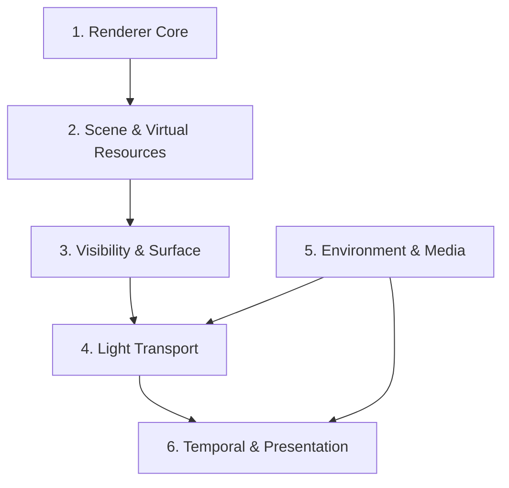

对应职责：

| 模块 | 主要职责 |
|---|---|
| Renderer Core | 帧入口、Demand、Product Plan、Provider、GPU Work、FrameGraph lowering、预算、Submit/Recovery |
| Scene & Virtual Resources | GPU Scene、VG、VT、VSM、Radiance 的逻辑身份与 Residency |
| Visibility & Surface | GPU 可见性、VisibilityKey、Surface 重建、Material、Shading Frequency |
| Light Transport | Direct Visibility、AO、GI、Reflection、Direct/Indirect/Specular Radiance |
| Environment & Media | Sun、Sky、Atmosphere、Aerial Perspective、Fog/Volume |
| Temporal & Presentation | Motion、History、Disocclusion、FSR3-style Reconstruction、最终输出 |

---

# 4. 三个决策时间尺度

EEngine Next 很重要的一点是：

> 不是所有事情都每帧由 CPU 决定。

---

## 4.1 Asset / Material Compile Time

输入：

```text
Material Description
Textures
Geometry metadata
Shader capability
```

做：

```text
Material feature analysis
Texture sample equivalence
Kernel family
Conservative frequency metadata
Material capability
```

输出：

```text
Compiled Material Metadata
Kernel Family ID
Resource Requirements
Frequency Hints
```

这一步回答：

> **这个材质“可能”怎么被执行？**

---

## 4.2 Publication / Configuration Time

发生在：

- 场景 revision 变化；
- Renderer setting 变化；
- provider 变化；
- resolution topology 变化；
- asset publication 变化。

输入：

```text
Consumer Demands
Scene Publication
Renderer Configuration
Capabilities
```

做：

```text
Provider Selection
Product Topology
Representation Plan
Pipeline/Layout Selection
History Topology
```

输出：

```text
Logical Render Plan
```

这一步回答：

> **这一类帧允许哪些合法执行方案？**

---

## 4.3 Per-frame GPU Time

输入：

```text
Camera
Depth
Visibility
Motion
Actual occupied tiles
Page demand
Ray demand
Probe demand
History validity
```

GPU 决定：

```text
Meshlet count
Shade count
Ray count
Shadow page count
Probe update count
Shading frequency
```

这一步回答：

> **这一帧到底做多少？**

---

# 5. 顶层完整数据流

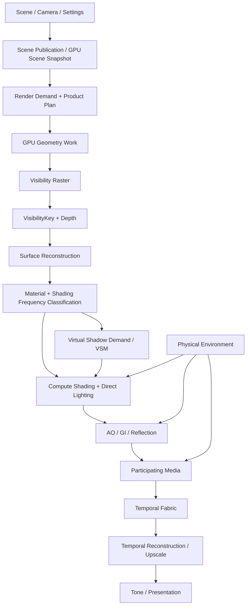

注意：

> 这是**逻辑依赖图**，不是说 GPU 必须严格按照这个线性顺序执行。

例如：

- Atmosphere LUT 可能多帧不更新；
- VSM page allocation 可以和其他独立 compute 工作并行组织；
- AO 和 Reflection 可以依赖同一 Depth Product；
- FrameGraph 根据真实 dependency 决定具体顺序。

---

# 6. 一帧从 CPU 到 GPU 的完整生命周期

---

# Stage 0 — Frame Entry

## 输入

```text
Camera
Scene
deltaTime
Renderer Settings
Device Capability
Previous Frame State
```

## CPU 工作

Renderer Core：

```text
beginFrame()
↓
更新 camera / jitter
↓
收集 scene revision
↓
收集 renderer demand
↓
决定是否需要重新编译 Product Plan
```

## 输出

```text
FrameContext
Scene Snapshot Handle
Render Demand Set
Temporal Inputs
```

---

# Stage 1 — Scene Publication

Scene 不直接让 Renderer 每帧遍历对象生成 draw list。

目标：

```text
CPU Scene
↓
Publication
↓
Retained GPU Scene
```

## 输入

```text
Geometry Product
Instances
Materials
Transforms
Texture logical refs
Scene patches
```

## 工作

```text
Stable instance identity
GPU table update
Virtual geometry binding
Material publication
Texture generation
Scene revision
```

## 输出

```text
GpuSceneSnapshot
SceneRevision
MaterialRevision
GeometryRevision
TextureRevision
```

---

# Stage 2 — Render Demand / Product Planning

这是 Renderer Core 的核心。

## 输入

```text
Scene Snapshot
Enabled quality profile
Consumers
Device capabilities
Output resolution
Temporal state
```

## 示例 Consumer Demand

假设最终画面需要：

```text
Opaque Color
Reflection
AO
Temporal Upscale
```

那么需求可能展开为：

```text
OpaqueColor
├ Surface
├ DirectVisibility
├ DirectRadiance
└ Environment

Reflection
├ Depth
├ ShadingNormal
├ Roughness
└ ColorHierarchy

AO
├ DepthHierarchy
└ Normal

Temporal
├ Motion
├ Depth
├ Reactive
└ Exposure
```

## Product Planner 做什么？

从有限合法方案选：

```text
Normal:
  A. Visibility reconstruct
  B. Surface shading 时 materialize

Depth Hierarchy:
  A. reuse compatible hierarchy
  B. build dedicated hierarchy

Motion:
  A. reconstruct
  B. materialize

Radiance:
  A. fused
  B. transient texture
```

## 输出

```text
Logical Product Plan
Provider Plan
Representation Plan
Execution Domain Plan
```

---

# 7. Render Product Compiler / Planner

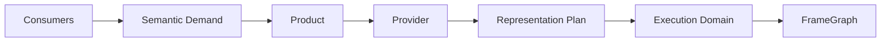

---

## 7.1 一个 Product 应该描述什么？

例如 `ShadingNormal`：

```text
Semantic:
    shading normal

Space:
    world-space / view-space

Resolution:
    internal shading domain

Filtering:
    normalization-aware

Precision:
    specified

Coverage:
    only valid where visibility exists

Temporal identity:
    follows stable surface identity

Missing behavior:
    reconstruct or reject consumer
```

不能只写：

```text
NormalTexture
```

因为：

```text
Geometry Normal
!=
Shading Normal
```

---

## 7.2 Product 和 Resource 的区别

```text
Product
= “我要什么语义”

Resource
= “这一帧用什么物理形式存它”
```

例如：

```text
SurfaceNormal Product
```

可以：

```text
不存在 texture
→ consumer 当场重建

或

RGBA16 / packed normal texture
→ 多 consumer 共享
```

---

# 8. Stage 3 — GPU Geometry Work Generation

输入：

```text
GpuSceneSnapshot
Camera Frustum
HZB
Geometry hierarchy
SSE / LOD thresholds
Residency state
```

GPU 执行：

```text
Root Work
↓
Hierarchy Traversal
↓
Frustum Cull
↓
Cone Cull
↓
HZB Occlusion
↓
LOD / SSE
↓
Leaf / Meshlet Work
```

输出：

```text
MeshletWork[]
Indirect Draw Args
Virtual Geometry Page Demand
Counters
Overflow telemetry
```

---

# 9. GPU Work Runtime

目标不是做一个万能 Queue。

而是统一**工作协议**。

---

## 9.1 通用逻辑

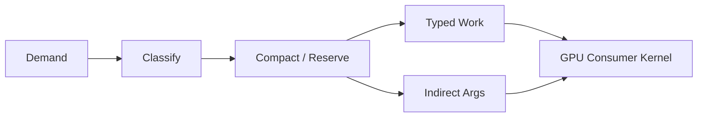

---

## 9.2 每种工作保持自己的 ABI

```text
MeshletWork
ReflectionRayWork
ShadowPageWork
ProbeUpdateWork
ShadingWork
```

不会强行变成：

```text
UniversalGpuWorkRecord
```

---

## 9.3 Work Stream 至少包含

```text
Producer
Consumer
Element ABI
Capacity
Written Count
Attempted Count
Overflow
Indirect Args
Lifetime
Telemetry
```

---

# 10. 四类 GPU Execution Domain

---

## A. Dense Field

适合：

```text
HZB reduction
Tone mapping
Atmosphere LUT
某些 AO
Froxel Integration
```

形式：

```text
dispatch(width / group)
```

---

## B. Sparse WorkStream

适合：

```text
Meshlet
Reflection Ray
Expensive shading
Selective GI
```

形式：

```text
Classify
→ Compact
→ dispatchIndirect
```

---

## C. Virtual Page / Brick

适合：

```text
Geometry Page
Texture Tile
VSM Page
Radiance Brick
Probe Update
```

---

## D. Temporal / Cache Reuse

适合：

```text
VSM Page Cache
Reflection History
Stable Shading
Probe History
Environment Cache
```

---

# 11. Stage 4 — Visibility Raster

输入：

```text
MeshletWork
Geometry buffers
Instance transforms
Camera
```

执行：

```text
Hardware-first Raster
```

输出核心：

```text
VisibilityKey
Depth
```

可能还有根据实现需求产生的辅助数据。

---

## VisibilityKey 的意义

它不是完整 Surface。

它更像：

```text
“这个 pixel 指向哪个 visible primitive”
```

后续通过：

```text
VisibilityKey
→ Meshlet / Primitive
→ Vertex Attributes
→ Surface Reconstruction
```

获得 Surface。

---

# 12. Stage 5 — Surface Reconstruction

输入：

```text
VisibilityKey
Depth
Meshlet / Triangle Data
Vertex Attributes
Instance Transform
Current / Previous Transform
```

输出逻辑 Surface：

```text
World Position
Geometry Normal
UV
Tangent Frame
Material Ref
Motion / Surface Identity
Analytic Attribute Gradients
```

---

## 12.1 为什么不直接做 Fat GBuffer？

传统 Deferred：

```text
Raster
→ Position
→ Normal
→ BaseColor
→ Roughness
→ Metallic
→ Velocity
→ ...
```

意味着每帧写大量 full-resolution attachment。

Visibility-first：

```text
Raster
→ compact identity

需要时
→ reconstruct
```

优势：

```text
减少 GBuffer bandwidth
减少固定 materialization
让 Product Planner 决定哪些 Surface 数据值得存
```

---

# 13. Compute Shader 中的梯度问题

Fragment Shader 有隐式：

```text
dpdx
dpdy
implicit mip LOD
```

Compute Shader 没有自动 fragment quad derivative。

因此 EEngine 当前已有的 analytic gradient 数学会被提取进新 Surface Runtime：

```text
Projected Triangle
+
Perspective-correct barycentric
+
Attribute interpolation
↓
dAttribute/dx
dAttribute/dy
```

UV：

```text
dUVdx
dUVdy
```

然后：

```text
textureSampleGrad(...)
```

这样才能正确进行：

```text
Mip selection
Normal map sampling
Material texture filtering
```

---

# 14. Material Compiler

目标：

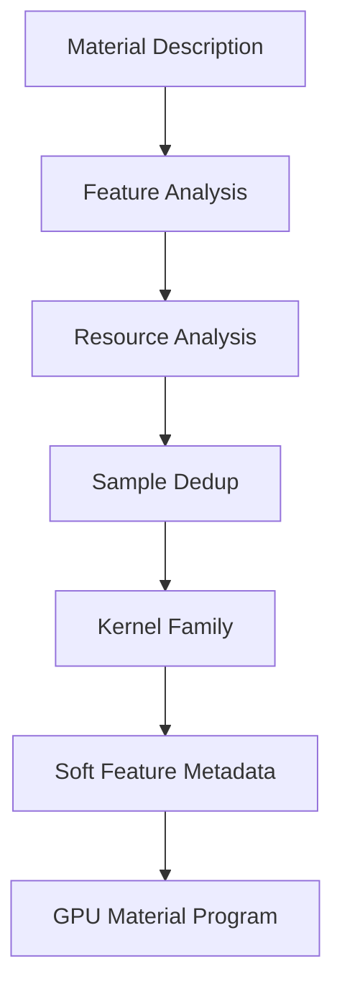

---

## 14.1 为什么要 Compiler？

不是每个材质都应该走：

```text
超级通用 PBR shader
```

也不应该：

```text
每个材质 = 一个 shader permutation
```

目标是少量 Kernel Family。

例如概念上：

```text
Rough Opaque
General Opaque
Complex Specular
Transmission
Special Surface
```

具体最终 family 数量尚未冻结。

---

## 14.2 Texture Sample Dedup

如果：

```text
ORM
AO
```

指向：

```text
相同 Texture
相同 Sampler
相同 UV
相同 UV Transform
相同 LOD Policy
```

则：

```text
只 Sample 一次
→ 重用 channel
```

---

# 15. Stage 6 — Shading Frequency Classification

这是下一代设计和当前旧 Sparse Shading 最大的区别之一。

目标不是：

```text
所有 visible pixel
→ 完整 material evaluation
```

而是：

```text
cheap metadata + geometry + temporal signals
↓
frequency classification
↓
expensive material evaluation
```

---

## 15.1 三类 Frequency 信息

### Coverage / Identity

```text
Depth discontinuity
Silhouette
Motion
Disocclusion
Surface continuity
```

### Material Appearance

```text
Texture frequency
Normal-map frequency
Albedo variation
Effective roughness range
Emissive
Alpha / special material
```

### Lighting

```text
Shadow boundary
Specular lobe
Local-light gradient
Reflection variance
GI variance
```

---

## 15.2 输出

```text
Full 1×1
Coarse 2×2
Coarse 4×4
Temporal Reuse
```

Temporal Reuse 必须等 Temporal Fabric 存在并且 history 合法。

---

## 15.3 一个重要原则

不要：

```text
先完整采样所有纹理
↓
发现材质很平滑
↓
再决定 4×4
```

这样已经花掉大部分成本。

应该：

```text
Compile / Publication 阶段
生成 conservative metadata

+
本帧 cheap classifier

↓
先确定 candidate frequency

↓
再 expensive shade
```

---

# 16. Stage 7 — Virtual Shadow Map

EEngine Next 的主太阳阴影目标：

> **Directional VSM**

没有 CSM runtime fallback。

---

# 16.1 为什么 VSM 不是一张巨大 Shadow Map？

VSM 把巨大的逻辑阴影空间分成：

```text
Virtual Pages
```

只对真正需要的页面：

```text
Allocate
Render
Cache
Invalidate
```

---

## 16.2 VSM 数据流

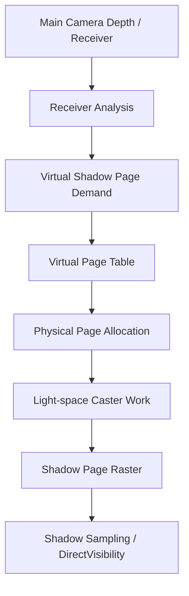

---

## 16.3 VSM 输入

```text
Physical Sun / Directional Light
Main camera receiver demand
GPU Scene
Geometry hierarchy
Virtual geometry residency
Previous page cache
Scene / light revisions
```

## 输出

```text
DirectVisibility
VSM Page Table
Physical Shadow Pages
Cache telemetry
```

---

## 16.4 为什么 caster 不能只使用 Camera-visible Meshlets？

一个：

```text
主相机看不见的物体
```

仍然可能：

```text
给主相机看得见的地面投影
```

因此 VSM 要：

```text
Receiver Page Demand
↓
Light-space Caster Generation
```

独立产生 shadow caster work。

---

# 17. Stage 8 — Material / Direct Lighting

输入：

```text
Surface
Material Program
Shading Frequency
Lights
DirectVisibility
Physical Sun
Environment Data
```

执行：

```text
Material Evaluation
BRDF
Direct Lighting
Environment / IBL contribution
```

输出：

```text
DirectRadiance
Surface-dependent intermediate products
```

是否 materialize：

```text
Normal
Roughness
Velocity
Diffuse data
```

由 Product Plan 决定。

---

# 18. IBL 与 Physical Environment

旧思路：

```text
HDR Environment
→ Diffuse cubemap
→ Specular prefilter
→ every pixel full IBL
```

Next 环境由：

```text
Physical Environment
```

提供：

```text
Physical Sun
Sky Irradiance
Sky Radiance
Atmospheric Transmittance
Aerial Scattering
Environment Radiance Cache
```

Material/Shading Planner 可以根据：

```text
roughness
frequency
material kernel
```

选择适当 evaluation 成本。

---

# 19. Stage 9 — Light Transport

顶层不是：

```text
GTAO System
SSR System
SSGI System
```

而是语义：

```text
Direct Light Visibility
Indirect Visibility
Indirect Radiance
Specular Radiance
```

---

# 20. AO — Indirect Visibility

首选算法：

```text
XeGTAO
```

逻辑链：

```text
Depth Product
↓
Depth Prefilter / Mips
↓
GTAO Evaluate
↓
Denoise
↓
IndirectVisibility
```

它不应该拥有自己的世界架构。

只是：

```text
IndirectVisibilityProvider
```

---

# 21. Reflection — Specular Radiance

首选：

```text
FidelityFX SSSR-style
```

---

## 数据流

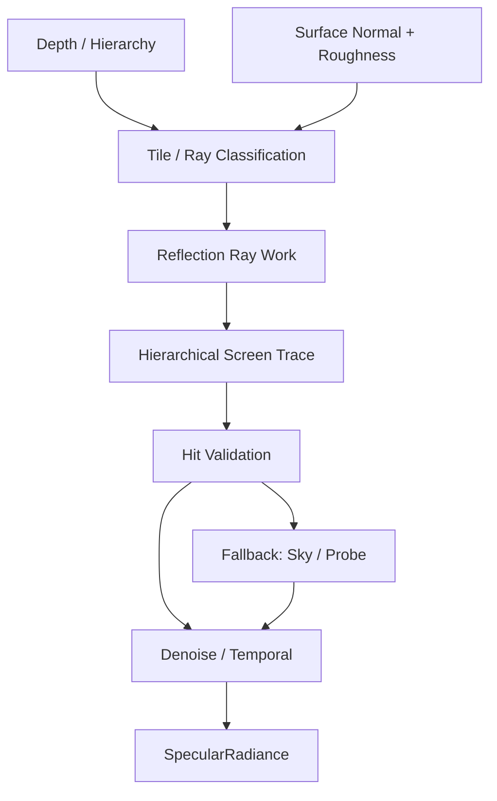

---

## 输出

```text
SpecularRadiance
Hit Confidence
Validity
```

Screen miss：

```text
Environment / Probe fallback
```

这是合法产品 fallback，不是旧 Renderer fallback。

---

# 22. Hybrid GI

目标：

```text
IndirectRadiance
```

由三个空间尺度组成：

```text
Near Field
→ Screen GI

World Field
→ DDGI / Probe / Brick

Infinite
→ Physical Sky
```

---

## 22.1 World GI 数据流

当前主要候选：

```text
Atlas DDGI + Software BVH
```

逻辑：

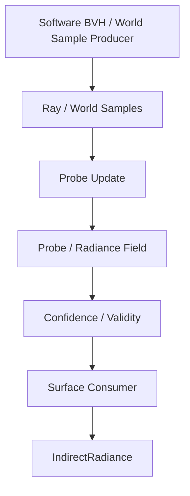

非常重要：

```text
Probe Storage
!=
GI Sample Producer
```

必须明确是谁生成：

```text
radiance + distance samples
```

---

# 23. Virtual Resource Runtime

这是 VG、VT、VSM、Radiance 之间真正共享的部分。

---

## 23.1 Control Plane

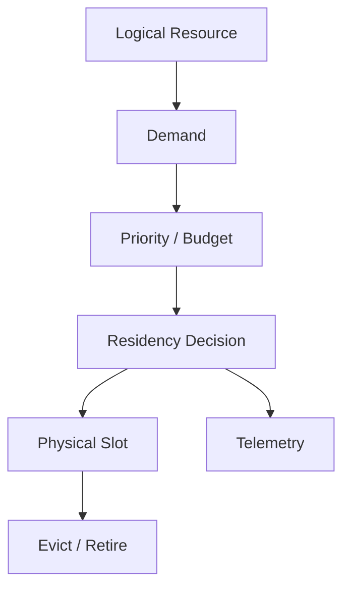

共享：

```text
Logical Identity
Revision
Demand
Priority
Budget
Residency State
Physical Slot lifecycle
Retirement
Telemetry
```

---

# 24. 四种 Virtualized Data Plane

```text
Virtual Resource Runtime
│
├ Geometry
│  └ Virtual Geometry Pages
│
├ Texture
│  └ Virtual Texture Tiles
│
├ Shadow
│  └ VSM Pages
│
└ Radiance
   └ Probe / Brick Data
```

它们共享 Control Plane。

但不会共享一套 Physical Cache。

---

# 25. Virtual Geometry

已经是 EEngine 当前成熟基础之一。

逻辑：

```text
Huge Geometry Product
↓
Virtual Pages
↓
GPU Demand
↓
CPU/IO async scheduling
↓
Upload
↓
Page Table / Residency
↓
GPU hierarchy consumer
```

CPU readback：

```text
只用于未来帧 IO / streaming feedback
```

不能成为：

```text
本帧 CPU visible list
```

---

# 26. Virtual Texture

**VT 包含在最终架构中。**

但当前状态和 VSM 不一样：

```text
VSM
= 已明确正式目标

Full VT
= 已在架构中预留，但完整实现和 donor 尚未最终冻结
```

完整 VT 至少需要：

```text
Texture Feedback
Virtual Texture Page Table
Physical Texture Cache
Mip / Tile Request
Upload
Eviction
Border / Filtering Handling
Shader Sampling Indirection
```

当前 Texture Residency：

```text
不能仅改名就称为完整 Virtual Texture
```

---

## VT 逻辑数据流

```text
Material Texture Sample Demand
↓
Virtual Address / Mip
↓
Feedback
↓
Page Request
↓
Residency Budget
↓
Physical Tile Cache
↓
Page Table
↓
Shader Sampling
```

---

# 27. VSM 与 VT 的相似和不同

相似：

```text
Virtual Address
Demand
Physical Cache
Residency
Eviction
```

不同：

### VT

```text
数据通常来自磁盘 / 网络
Mip / filtering / border 很重要
```

### VSM

```text
页面是 GPU 渲染生成
受 Scene / Light Revision 影响
Same-frame urgency 更强
Temporal cache / invalidation 更重要
```

所以：

> 共用 Control Plane，不共用物理 Cache。

---

# 28. Radiance Field Virtualization

Probe / Brick 同样可以视作虚拟资源：

```text
Logical World Region
↓
Probe / Brick Demand
↓
Update Priority
↓
Radiance Sample Update
↓
Temporal Convergence
```

其物理 cache 又和 VT/VSM 完全不同。

---

# 29. Physical Environment

主要来源：

```text
Takram WebGPU non-geospatial atmosphere
```

目标不是：

```text
Sky Effect
```

而是：

```text
Physical Environment Lighting
```

---

## 29.1 数据流

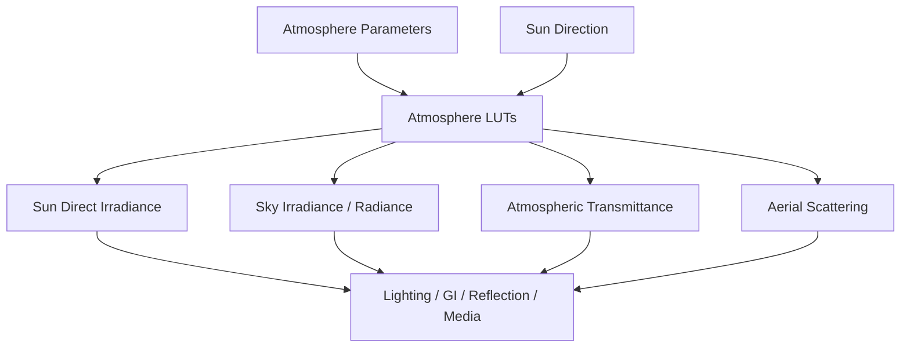

---

# 30. Aerial Perspective

不是普通“后处理雾”。

它描述：

```text
Camera
到
Surface
```

之间大气对辐射的：

```text
Transmittance
+
In-scattering
```

逻辑：

```text
Scene Radiance
+
Depth
+
Atmosphere
+
Sun Visibility
↓
Atmospheric Transport
↓
Aerial-composited Radiance
```

---

# 31. Local Participating Media

候选：

```text
Adria-style Froxel
```

目标统一：

```text
Fog
Local Volume
Particle Medium
Light Scattering
```

介质语义：

```text
Extinction
Scattering
Emission
Phase
```

---

## Froxel Pipeline

```text
Camera Frustum
↓
3D Froxel Grid
↓
Inject Medium
↓
Inject Lights
↓
Scattering / Extinction
↓
Integrate along view
↓
Composite
```

Atmosphere 和 Froxel 不强制塞入同一 3D texture。

---

# 32. Temporal Fabric

Temporal Fabric 是 Renderer 级共享基础。

---

## 输入

```text
Current Camera
Previous Camera
Current / Previous Depth
Motion
Jitter
Exposure
Surface Identity
Scene / Material / Lighting Revision
Resolution
Reactive Mask
```

---

## 核心管理

```text
begin
commit
abort
ping-pong
history identity
resolution compatibility
exposure compatibility
disocclusion
history rejection
device loss
camera cut
```

---

## 输出

不是一个统一 Color。

而是：

```text
Temporal validity infrastructure
```

供：

```text
Reflection
GI
Volume
Final Reconstruction
```

消费。

---

# 33. 稳定 Surface Identity

不能使用：

```text
Frame-local VisibilityKey
```

作为长期 history identity。

因为下一帧：

```text
MeshletWorkSlot
```

可能变化。

跨帧应该基于更稳定：

```text
Scene Object / Instance Generation
Geometry Revision
Material Revision
Surface Identity
```

---

# 34. Stage 10 — Temporal Reconstruction

当前首选目标：

```text
FidelityFX SDK v1.1.4 FSR3 Upscaler
```

注意：

```text
不包含 Frame Generation
```

---

## 逻辑输入

```text
Input Color
Depth
Motion
Jitter
Exposure
Reactive / Transparency
Shading Change
History
```

---

## 目标阶段

```text
Prepare Inputs
Reactive Analysis
Luma Pyramid
Shading Change
Reprojection
Accumulate
Upsample
Luma Instability
Sharpen / RCAS
```

具体 WGSL adaptation 尚需要真正 port 后验证。

---

# 35. Presentation

输入：

```text
Reconstructed HDR / Pre-exposed Radiance
Exposure
Display settings
```

处理：

```text
Exposure
Tone Mapping
Color Grading
Output Encoding
```

输出：

```text
Swapchain / Canvas
```

---

# 36. FrameGraph 的位置

非常重要：

> **Product Planner 决定“做什么”。**
>
> **FrameGraph 决定“怎么执行”。**

不要把二者混在一起。

---

# 37. FrameGraph 顶层关系

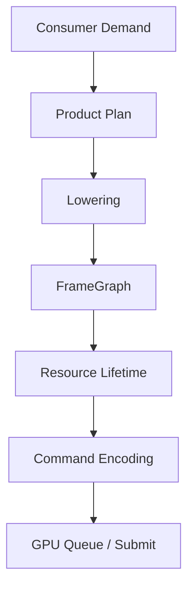

---

# 38. FrameGraph 管理什么？

```text
Pass dependency
Read / Write dependency
Imported Resource
Transient Resource
Resource lifetime
Pass pruning
Topological scheduling
Compiled topology cache
Command encoding
```

---

# 39. FrameGraph 不管理什么？

不应该决定：

```text
要不要做 Reflection
使用 SSSR 还是其他 Provider
Normal 应该重建还是存 Texture
是否使用 VSM
GI 用哪种 Provider
```

这些属于：

```text
Renderer Core / Product Plan
```

---

# 40. 一个概念 FrameGraph 示例

假设本帧开启：

```text
Opaque
VSM
XeGTAO
SSSR
FSR3 Upscale
```

逻辑 FrameGraph 可能类似：

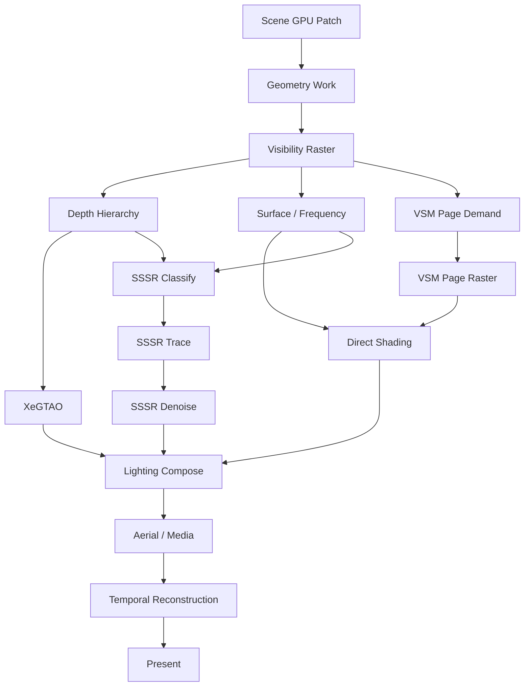

注意：

这个图只是**逻辑示例**。

真正实现时：

- 某些 Product 可能融合；
- 某些 Pass 可能不存在；
- 某些资源可能重建而不是 materialize；
- 某些历史可能直接复用；
- atmosphere LUT 可能完全不在本帧更新。

---

# 41. Feature-off 为什么应该自然消失？

例如 Reflection 关闭。

Consumer 不再请求：

```text
SpecularRadiance(ScreenTrace)
```

那么：

```text
SSSR classify
SSSR ray buffer
SSSR trace
SSSR denoise history
```

都失去消费者。

Product Plan 不生成它们。

FrameGraph 也就没有对应 Pass/Resource。

这是：

```text
Demand-driven
```

而不是：

```text
Pass 仍执行
shader 里面 if (!enabled) return;
```

---

# 42. FrameGraph Resource Lifecycle

典型：

```text
Create transient
↓
First Writer
↓
Several Readers
↓
Last Reader
↓
Release / Reuse
```

例如：

```text
Reflection Ray List
```

只在：

```text
Classification
→ Trace
```

之间存在。

不应该成为 Renderer 长生命周期 permanent buffer，除非有真实理由。

---

# 43. Persistent Resource vs Transient Resource

---

## Persistent

```text
GPU Scene
Virtual Geometry Residency
Texture Cache
VSM Physical Cache
Probe Field
History
Atmosphere LUT cache
Pipeline Cache
```

---

## Frame Transient

```text
Ray Work
Temporary indirect args
Temporary classification map
Some materialized Surface Products
Intermediate AO / Reflection buffers
```

---

# 44. CPU 与 GPU 职责边界

---

## CPU 应负责

```text
Asset/Material compile
Scene publication
Provider / Product topology
Capability negotiation
Pipeline creation
Virtual resource IO scheduling
Long-term budget policy
Diagnostics
```

---

## GPU 应负责

```text
Visibility
Hierarchy traversal
LOD
Actual occupancy
Meshlet count
Ray count
Page demand
Shading frequency
Probe update selection
Same-frame indirect work
```

---

## 不应该

```text
GPU 生成 visible list
↓
CPU readback
↓
CPU 再生成 draw calls
```

这会打破 GPU closure。

---

# 45. 完整每帧 Input / Output 总表

| 阶段 | 输入 | 核心工作 | 输出 | 主要消费者 |
|---|---|---|---|---|
| Frame Entry | Camera/Scene/Settings/History | 更新帧上下文、需求 | Frame Context | Planner |
| Scene Publication | Assets/Instances/Patches | GPU Scene 更新 | Scene Snapshot | Visibility/Resources |
| Product Planning | Demands/Capabilities/Revisions | Provider/Representation Plan | Logical Plan | FrameGraph Lowering |
| Geometry Work | Scene/Hierarchy/HZB | Cull/LOD/Traversal | MeshletWork | Raster |
| Visibility | MeshletWork/Geometry | Hardware Raster | VisibilityKey/Depth | Surface/VSM/AO/SSR |
| Surface | Visibility/Geometry | Decode/Interpolation/Gradients | Surface semantics | Shading/Light |
| Frequency | Surface metadata/Temporal | full/coarse/reuse classification | Shading Work | Material |
| VSM | Receiver/Light/Scene | Page demand/caster/raster/cache | DirectVisibility | Direct Light |
| Material/Direct | Surface/Material/Shadow/Environment | PBR/direct/IBL | DirectRadiance | Light Compose |
| AO | Depth/Normal | XeGTAO | IndirectVisibility | Light Compose |
| Reflection | Depth/Surface | SSSR | SpecularRadiance | Light Compose |
| GI | Screen/World/Sky | Screen+DDGI+Sky | IndirectRadiance | Light Compose |
| Media | Radiance/Depth/Medium | Froxel/Aerial transport | Composited Radiance | Temporal |
| Temporal | Color/Depth/Motion/History | reprojection/accumulation/upscale | Reconstructed Color | Presentation |
| Present | HDR/Exposure | tone/output encode | Canvas | User |

---

# 46. 产品依赖示例

最终 Opaque Color 可以理解成：

```text
Final Opaque Radiance
=
Direct Radiance
+
Indirect Radiance
+
Specular Radiance
```

再受到：

```text
Atmospheric Transport
Local Media
Temporal Reconstruction
```

处理。

但真实 BRDF/energy composition 会由具体 PBR/Provider Contract 决定，不能简单把上面的“+”理解成任意颜色相加。

---

# 47. Depth / Pyramid 为什么也要 Semantic 化？

多个系统需要类似：

```text
Depth Hierarchy
```

但：

```text
Visibility HZB
AO Depth Mips
SSR Hierarchical Depth
```

不一定具有相同：

```text
encoding
filter
reduction operator
resolution
precision
```

所以正确设计：

```text
Semantic Depth Requirement
↓
检查物理 Representation 是否兼容
↓
兼容才共享
```

而不是：

```text
大家都需要 depth mip
→ 强行共用一张 HZB
```

---

# 48. VSM / VT / VG / GI 为什么统一到 Virtual Resource 思维？

因为它们都面对：

```text
逻辑世界
>
物理 GPU 容量
```

共同问题：

```text
什么数据当前重要？
什么已经 resident？
什么要更新？
什么可以 evict？
什么可以缓存？
```

统一 Control Plane 可以做：

```text
Global memory budget
Priority
Pressure
Telemetry
```

而每种资源保持自己的算法。

---

# 49. Performance Budget

未来 Renderer 可以有统一预算：

```text
Frame GPU Budget
├ Geometry
├ Shading
├ Shadow
├ Reflection
├ GI
├ Media
└ Reconstruction
```

本帧根据：

```text
Screen importance
Motion
Variance
Confidence
Temporal stability
```

调整：

```text
Shading rate
Reflection ray budget
VSM page updates
GI probe updates
Dynamic resolution
```

这里属于目标能力，具体 Budget Arbiter 尚未冻结为当前 runtime ABI。

---

# 50. 当前保留技术资产与目标架构关系

---

## Keep / Move

```text
GpuRenderWorld
Geometry Product
Virtual Geometry
Geometry Residency
HierarchicalWorkGenerator
MeshletWorkCandidate
MeshletBucketRaster
PackedVisibilityPass
VisibilityKey
HZB
Current-HZB Late Recheck
FrameGraph
CompiledFrameGraph
```

---

## Extract

```text
Visibility Decode
Perspective Reconstruction
Analytic ddx/ddy
UV Transform
textureSampleGrad
Material Texture Bank
PBR math
Bounded Work Protocol idea
Program Cache / Binding separation
History lifecycle
```

---

## Rewrite

```text
Renderer
FrameProducts
OpaqueShadingDemand
Surface ownership
TemporalHistoryRegistry public contract
Material / Lighting ownership
```

---

## Delete

```text
MainRenderPipeline
MainFrameFeatureTopology
OptionalFrameFeatures
old FramePlan
old effect-owned AO
old SSR
old SSGI
old GI owner
old CSM
old TAA / NSS
old Sparse Shading owner
```

---

# 51. 下一代目录思维

最终不会保留：

```text
render-next/
legacy-render/
```

而是新 Renderer 就是：

```text
render/
├ runtime/
├ scene/
├ virtual/
├ visibility/
├ surface/
├ lighting/
├ environment/
└ temporal/
```

目录只是建议 ownership 表达，不是架构本身。

---

# 52. 哪些技术已经明确，哪些还没冻结？

---

## 已明确目标

```text
Single Renderer Path
VisibilityKey + Depth
Hardware-first Visibility
Semantic Products
Typed GPU Work
Adaptive Shading Frequency
Directional VSM
XeGTAO
SSSR-style Reflection
Hybrid GI
Takram Physical Environment
Temporal Fabric
FSR3 Upscaler target
Virtual Resource Control Plane
```

---

## 尚未完全冻结

```text
完整 Virtual Texture donor / implementation
Screen GI 完整 donor
VSM WebGPU page raster 最终成本与上界
Atlas DDGI dynamic update budget
Adaptive Shading 实际收益
FSR3 WGSL adaptation details
具体 GPU Work binary ABI
具体 Product physical layouts
Local light shadow virtualization
Transparency / refraction final representation
Volumetric clouds
```

学习时应该把这些看作：

```text
Architecture slot 已经存在
但实现仍待证据
```

---

# 53. 推荐学习顺序

如果你要真正吃透这套架构，建议按下面顺序。

---

## 第一层：先懂 Visibility-first

学习：

```text
GPU Scene
Virtual Geometry
Hierarchy
Meshlet Work
VisibilityKey
Surface Reconstruction
```

先理解：

> 为什么不用完整 GBuffer。

---

## 第二层：懂 Product / Work

学习：

```text
Semantic Product
Representation
Dense vs Sparse
Typed Work
Indirect Dispatch
```

理解：

> 为什么“需要一个结果”不等于“创建一张 Texture”。

---

## 第三层：懂 Adaptive Shading

学习：

```text
Surface frequency
Material frequency
Lighting frequency
Full / Coarse / Reuse
```

理解：

> 为什么 Visibility full-res 不等于 Material full-res。

---

## 第四层：懂 Virtualization

学习：

```text
VG
VT
VSM
Radiance Field
```

理解：

> 为什么它们共享 control plane，但不能做一个万能 cache。

---

## 第五层：懂 Light Transport

学习：

```text
DirectVisibility
IndirectVisibility
IndirectRadiance
SpecularRadiance
Physical Environment
```

理解：

> GTAO/SSR/GI 是 Provider，而不是 Renderer 顶层架构。

---

## 第六层：懂 Temporal

学习：

```text
Motion
Surface Identity
History Validity
Disocclusion
Reprojection
Upscaling
```

理解：

> Temporal 为什么不是一个 TAA Pass。

---

## 第七层：最后理解 FrameGraph

FrameGraph 最容易被误解。

先理解前面“Renderer 想做什么”，再看：

```text
如何把逻辑 Plan
lower
成实际 GPU Pass/Resource dependency graph
```

就会非常清晰。

---

# 54. 一张总图理解所有系统

```text
                           ┌─────────────────────┐
                           │ Scene / Camera / UI │
                           └──────────┬──────────┘
                                      │
                                      ▼
                         ┌────────────────────────┐
                         │     Renderer Core      │
                         │ Demand / Product Plan  │
                         └──────────┬─────────────┘
                                    │
                     ┌──────────────┴──────────────┐
                     │                             │
                     ▼                             ▼
          ┌────────────────────┐       ┌─────────────────────┐
          │ GPU Scene / VG     │       │ Virtual Resources   │
          │ Scene Publication  │       │ VG / VT / VSM / GI  │
          └──────────┬─────────┘       └──────────┬──────────┘
                     │                             │
                     ▼                             │
          ┌────────────────────┐                   │
          │ GPU Work Runtime   │◀──────────────────┘
          │ Meshlet/Page/Ray   │
          └──────────┬─────────┘
                     │
                     ▼
          ┌────────────────────┐
          │ Visibility System  │
          │ Cull/LOD/Raster    │
          └──────────┬─────────┘
                     │
              VisibilityKey
                   + Depth
                     │
                     ▼
          ┌────────────────────┐
          │ Surface Runtime    │
          │ Decode / Gradient  │
          └──────────┬─────────┘
                     │
                     ▼
          ┌────────────────────┐
          │ Shading Planner    │
          │ Full/2x2/4x4/Reuse │
          └──────────┬─────────┘
                     │
         ┌───────────┼────────────────────────────┐
         │           │                            │
         ▼           ▼                            ▼
  ┌────────────┐ ┌────────────┐           ┌────────────────┐
  │ VSM        │ │ Material + │           │ Environment    │
  │ Visibility │ │ Direct PBR │◀──────────│ Sun/Sky/Atmo   │
  └─────┬──────┘ └─────┬──────┘           └───────┬────────┘
        │              │                          │
        └──────────────┼──────────────────────────┘
                       ▼
             ┌──────────────────────┐
             │    Light Transport   │
             │ AO / GI / Reflection │
             └──────────┬───────────┘
                        │
                        ▼
             ┌──────────────────────┐
             │ Environment / Media  │
             │ Aerial / Froxel      │
             └──────────┬───────────┘
                        │
                        ▼
             ┌──────────────────────┐
             │   Temporal Fabric    │
             │ History / Identity   │
             └──────────┬───────────┘
                        │
                        ▼
             ┌──────────────────────┐
             │ FSR3 Reconstruction  │
             └──────────┬───────────┘
                        │
                        ▼
             ┌──────────────────────┐
             │ Tone / Presentation  │
             └──────────────────────┘


  以上所有 GPU 执行最终都由：

      Product Plan
          ↓
      FrameGraph Lowering
          ↓
      FrameGraph
          ↓
      WebGPU Command Encoding
          ↓
      GPU Submit

  统一落地。
```

---

# 55. 最终学习总结

EEngine Next 最重要的不是某个具体算法。

不是：

```text
VSM 很先进
SSSR 很先进
FSR3 很先进
```

真正重要的是：

## 第一层

用：

```text
VisibilityKey + Depth
```

代替固定 Fat GBuffer 作为 opaque scene truth。

## 第二层

用：

```text
Semantic Product
```

代替“每个 Feature 自己申请 Texture”。

## 第三层

用：

```text
Typed GPU Work
```

代替“所有 Feature 都 full-screen”。

## 第四层

用：

```text
Adaptive Shading Frequency
```

打破：

```text
Visible Pixel = Full PBR Evaluation
```

## 第五层

用：

```text
Virtual Resource Control Plane
```

统一大规模 Geometry、Texture、Shadow 和 Radiance 的容量管理。

## 第六层

用：

```text
Temporal Fabric
```

把时间从 Post Effect 提升为 Renderer 基础维度。

## 第七层

最后由：

```text
FrameGraph
```

把已经决定好的 Renderer Plan 高效执行到 WebGPU。

因此 EEngine Next 最终不是“很多高级效果的集合”，而是一套：

> # **能够根据场景、资源、可见性、频率、历史和预算动态决定“这一帧真正应该做多少工作”的 GPU Renderer。**

---

# 56. 仓库内学习入口

本文基于当前仓库目标设计整理，建议配合阅读：

```text
docs/adr/0020-clean-cut-renderer.md
docs/next-renderer.md
docs/contracts/render-product-work-history-v2.md
docs/porting/next-renderer.md
docs/WEBGPU.md
docs/VALIDATION.md
```

理解当前“旧实现是什么”时，再看：

```text
docs/domains/
project/claims/
validation/evidence/
```

不要把 Target Architecture 和 Current Production Fact 混为一谈。

---

# 57. 最短记忆版

只记住这一条主线：

```text
Scene
↓
GPU Scene
↓
GPU Work
↓
VisibilityKey + Depth
↓
Surface Reconstruction
↓
Shading Frequency
↓
Material / Lighting
↓
VSM + AO + GI + Reflection
↓
Physical Environment / Media
↓
Temporal Fabric
↓
FSR3 Reconstruction
↓
Present
```

横向始终有：

```text
Semantic Product
GPU Work Runtime
Virtual Resource Runtime
FrameGraph
```

四套基础机制支撑整个 Renderer。
