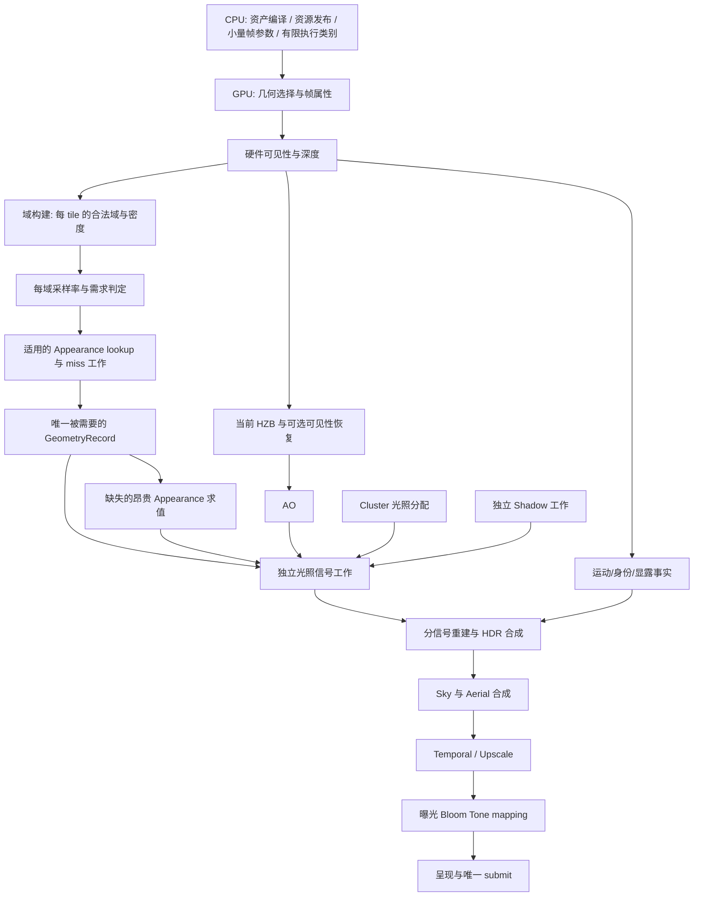

# EEngine 极致性能重建设计（母稿）

日期：2026-10-05。源码快照：`09449d6d`。状态：**已批准方向，尚未实施**。

> 本文是 EEngine Next 的唯一架构与性能设计入口。此前的 V3 原文、有界前端设计、优化 V1 设计均已归档，只供历史追溯；它们的实施页同样归档。取代关系见每份归档文档的 `supersededBy` 字段。

## 0. 三个不可协商的目标

1. **极致性能**：帧成本由**执行结构的规模**决定，不由场景复杂度或像素数线性决定。
2. **完整的计算与画质**：不通过关效果、降精度、丢工作换性能。
3. **可持续扩展**：Virtual Geometry / VT / VSM / ReSTIR / SSGI / Atmosphere / 高级 Temporal / AI Upscaling 都必须是**新增一个负责其真实工作域的 owner**，而不是往已有链上再叠一层协调协议。

---

## 1. 问题

### 1.1 实测事实

GTX 1650 Ti、1080p、Dungeon、VSM 与 jitter 关闭、固定曝光。

| 指标 | 远景 | 近景 |
|---|---:|---:|
| Surface GPU P50 / P95（ms） | 96.14 / 101.24 | **785.19 / 815.05** |
| 可见像素 | 159,914 | 1,286,720 |
| GeometryRecord / 可见像素 | 99.953% | **99.965%** |
| 整帧可执行 graph node | — | **2,689** |
| compute pass / dispatch | — | **2,382 / 2,394** |
| buffer clear / copy | — | 489 次 / 283.47 MiB；965 次 |

近景 Surface 内部（P50，ms）：

| 类别 | 阶段 | 小计 |
|---|---|---:|
| **管理计算** | Field Lookup 169.54、Classifier 178.52、Proof 146.15、Signal Lookup 108.00、Demand 62.26、Store 44.24 | **708.71** |
| **实际计算** | Appearance 6.68、Lighting 10.09、Reconstruct 6.49 | **23.26** |

**管理 : 实际 ≈ 30 : 1。**

### 1.2 这些管理机制服务的目标几乎没有发生

| 机制 | 实际命中 / 准入 |
|---|---|
| material cache | **2.24%** |
| field cache admission | **0.27%**（6,687 / 2,465,254） |
| signal cache admission | **0.11%**（1,351 / 1,226,203） |
| proof admitted | 10.5% |
| lightingRecords / 可见像素 | 98.4% |

**即：付出了 100% 的协议成本，买到了 0.3% 的收益。**

### 1.3 结构性根因

以下五条互相放大，任一条单独修都不成立：

**根因 1：固定容量把 Surface 变成数千命令的流水线。**
512 MiB envelope 把稳定 scratch 与一次 retired overlap 一起收费，1080p 只容纳 700 tiles，固定展开 47 批。每批重新编码 setup / facts / lookup / proof / 分类 / demand / store / 重建。
**决定性证据**：把 `maxBufferSize` 提到 512 MiB、`maxStorageBufferBindingSize` 提到 256 MiB，`batchTileCapacity` 一位不变——约束是自定义记账（`limitingPools=["retirementEnvelope"]`），不是硬件。

**根因 2：管理缓存比重算更贵。**
Field key 32 words / entry 256 B；Signal key 72 words / entry 352 B，而 payload 只有 16 B。key 比 value 大 20 倍。

**根因 3：证明与分类没有换来对应的工作缩减。**
15 field planes + 6 signal planes，每 plane 重复 tree / geometry reduction / provider proof / prefix。tree 路径显式 `workgroupBarrier` 为 `27 + 4D`。而 `GeometryRecord ≈ 可见像素` 说明这些判定没有减少该产品产量。

**根因 4：FrameGraph 执行复杂度错误。**
`FrameGraph.executeCompiled` 每节点后扫描全部 resource registry，约 `2,689 × 1,603 = 431 万` 次 entry 判断/帧。图编译与 dump 已有缓存，问题在执行而非重编译。

**根因 5：没有统一的正确工作域。**
Product 硬编码 hierarchy depth 64；Product 路径 previous HZB 为 null；普通相机变化清 HZB；cluster overflow 退化为每 shading sample 遍历全部 active lights。Shadow 的 caster 域不能等同 camera-visible meshlets。

### 1.4 一个必须承认的物理事实

**高频区域 `G`（GeometryRecord）本来就接近 `P`（像素数）。** 高频 normal / 锐利 specular 不会让几何消失。

因此本设计**不要求每个指标都稀疏**。目标是让总成本随**真实需求**增长，而不是强制所有产品都变成稀疏产品。任何"把 G 压到 30%"的目标都是错的。

---

## 2. 架构判断：为什么是"域缺失"而不是"参数没调好"

### 2.1 证明系统存在的唯一理由

源码里存在三个相关实体，但都不是求值单位：

| 实体 | 它是什么 | 它**不是**什么 |
|---|---|---|
| `tile`（8×8） | 空间单位 | 不是求值单位 |
| `cell` / `candidate` | 用于**证明**的候选 | 不是用于**求值**的单位 |
| `domain`（domain key 内） | 用于**比较** | 不是用于**聚合** |

**系统有"域"的概念，但没有"域"的实体。**

推论：每个像素必须独立走一遍"我属于哪个域、域里能否共享"。这就是 10,293,760 次 probe（≈8 probes/像素）的来源。

### 2.2 这是删除判据，不是性能观察

**一旦"域"成为一等实体（被求值一次、被多个消费者引用），proof / certificate / 固定树 / 逐像素 witness 的职责就消失了**——不是被"优化掉"，是**没有存在理由**。

这条判据比"这些机制很贵"更稳：**"贵"是可以被未来调参重新论证回来的，"职责已被取代"不能。**

### 2.3 由此得到三条架构原则

**原则 1：正确性的单位 ≠ 性能的单位。**
正确性：每个可见像素必须被正确着色（O(P)）。
性能：成本由**域的数量 × 每域成本**决定。
当前架构把两者绑在一起。分开它们是本次重建的核心。

**原则 2：层级预算是硬架构约束，不是规划结果。**
当前 batch 数是 CPU 用静态 envelope 反推的。若预算属于架构，它应当在 GPU 上闭环（按实际帧状态决定域的数量与密度），使场景复杂度不再直接决定帧成本。

**原则 3：复用是域的属性，不是像素之间的事件。**
复用发生在域层：一个域被求值一次，域内消费者引用它。这是结构性的、与命中率无关的。把它做成像素之间的概率事件，就注定得到 0.11% 的命中率。

---

## 3. 目标架构

### 3.1 三条硬约束（可机检）

这三条不是性能目标，是**架构不变量**。违反必须改结构，不允许靠调参通过。

**约束 A：命令数解耦。**
```
Surface 前端 dispatch 数 ≤ 小常数 × 启用的执行类别数
且与场景复杂度、全屏像素数【解耦】
现状：47 批 × 48 dispatch = 2,263 compute passes   ← 违反
```
选它作为硬约束的理由：**它可数**（不需 GPU 采样，任何提交前都能查）、**它直接绑定那个乘法基数**、**它不可绕过**（想加 pass 必须解释它属于哪个类别）。

**约束 B：管理成本上限。**
```
T(管理) / T(实际计算) ≤ 1
现状：708.71 / 23.26 ≈ 30.5   ← 违反
```
它防止未来重新长出协议层。

**约束 C：复用层可关闭。**
关掉整个复用层后，帧必须**仍然完全正确**，且仍在**同一数量级**。
若关掉就崩或慢一个数量级，说明事实层依赖了优化层——结构已错。

### 3.2 目标数据流



与当前架构的差别只有一处，但是根本性的：**`Domain` 是新增的一等阶段**，它把"逐像素决定"变成"逐域决定"。

### 3.3 目标成本模型

```
Tsurface = Tlight_facts(P)                     ← 全率事实，不可协商
         + Tdomain(tiles)                      ← 域构建，成本 = tile 数 × 常数
         + Trate(domains)                      ← 率判定，成本 = 域数
         + Tapplicable_lookup(reuse)           ← 仅适用于昂贵 closure
         + Tgeometry(G)                        ← G 在高频区可接近 P
         + Tappearance(Mmiss)
         + Tlighting(Ldiffuse, Lspecular, Lcoat, ...)
         + Treconstruct(P)                     ← 全率合成
         + Tmemory_and_schedule
```

**关键**：`Tdomain` 与 `Trate` 是 `O(tiles)` 和 `O(domains)`，而当前对应项是 `O(P × planes)`。

### 3.4 owner 边界

以下名字是责任描述，不要求逐项新建类。

| 边界 | 负责 | 明确不负责 |
|---|---|---|
| Asset compiler | 几何页/层级、材质分析、静态产品、稳定地址映射 | 长期 GPU residency、本帧可见性 |
| Scene publication | 稳定身份、实例/材质/灯光变更与 GPU 发布 | 每个 tile 的工作状态 |
| Geometry residency | 压缩页、展开属性、异步请求/上传、合法 LOD | Surface cache、全屏证明 |
| Frame runtime | 有限执行拓扑、资源生命期、命令 scope、唯一 submit | 重判材质/光照语义 |
| Visibility / geometry work | LOD/culling、raster work、可见 key、depth、帧几何 | 材质与光照结果 |
| **Domain builder（新增）** | 每 tile 的合法域、密度、需求 mask；把 tile 聚合为可求值的域 | 域内容求值 |
| Material publication | 编译程序、输入依赖、常量/纹理/静态产品、更新计划、**成本分类** | 世界空间照明有效性 |
| Surface work | 按域的需求、GeometryRecord union、consumer mapping | 万能任务协调 |
| GeometryRecord producer | 权威几何插值与派生量（薄记录 + 按需补全） | 另建独立缓存/失效语义 |
| Lighting providers | 直接光/IBL/反射/GI 各自任务、结果、更新、有效性 | 自行从 Visibility 恢复完整几何 |
| Shadow | light-space 需求、caster work、物理页、shadow visibility | 借 camera-visible list 当完整 caster 集合 |
| Temporal facts | motion、身份、显露、变化事实 | 替每个 provider 再管一份同义 scene state |
| Reconstruction / post | 分信号重建、合成、HDR、显示处理 | 重跑完整材质或完整 PBR |

**Renderer 只装配以上边界。** 继续把方法拆成多个文件但保留同一个 God owner 与重复状态，不算架构重构。

---

## 4. 四层重建设计

### 4.1 事实层：无条件、零协议

全率且不可协商：Coverage、Depth、Motion、Identity、每 tile 的唯一 GeometryRecord。

这一层**不许有任何"要不要做"的判断**。任何条件分支进入事实层都是架构错误——那正是当前 30:1 的来源。

### 4.2 域层（新增）

**域是本次重建的核心新增实体。**

单位：tile 起步（8×8）。域描述：

```
tileDomain[tileIndex]
  ├─ coverage / mode mask          (u32)
  ├─ domainClass                   (u8)   // 材质/连续性类别
  ├─ requiredFieldMask             (u32, 15 bit)
  ├─ requiredSignalMask            (u32, 6 bit)
  └─ exceptionBase / count         (u32 × 2)
```

**判据（可断言，不是感觉）**：
> 全屏同材质、UV 连续的场景，应产生 **1 个**域描述和 **0 个** exception。

当前架构下这条**不可能成立**（必然产生逐像素条目）。新结构下它是可测的结构性证据。

**ABI 尺寸作为设计探索范围，不是已确定合同**：1080p 共 32,400 个 tile，64 B descriptor ≈ 1.98 MiB。对照当前状态：一张逐像素 u32 映射是 7.91 MiB，21 张是约 166.1 MiB。**这是布局算术，不表示新方案必须用这些尺寸。**

### 4.3 采样率层

**这一层替代 proof / certificate / 固定树。**

三件事分开，不再打包成通用 proof：

| 问题 | 来源 |
|---|---|
| **合法域**：对象/材质/侧面、LOD 映射、有效资源、接缝 | 权威 producer 与实际依赖 |
| **更新事实**：参数、纹理、光源、阴影、视向、显露、历史年龄 | 实际依赖版本 |
| **质量选择**：某信号在什么空间/时间间隔满足约定误差 | 经验证的近似模型 |

前两者来自 producer；第三者允许近似。**没有理由每个 plane 重新证明一遍共同身份与几何边界。**

常规准入使用 coverage/depth、不连续 mask、发布时的字段变化信息、normal/roughness、信号风险。低频 diffuse 可更粗；镜面/coat 按粗糙度、法线、视向、遮挡变化局部提高率。

**必须触发细率的情况**：尖锐高光、UV 接缝、薄几何、显露边缘。**不能**用单一历史低 contrast 作为当前帧安全证明。

**变化信息缺失时**：先保证该字段/局部信号完整求值，同时补全发布元数据。**不把"未知永远 fine"当作架构完成状态。**

**循环依赖的解法**（"分类需要材质、材质又需要分类"）：
1. 用 visibility / depth / 发布元数据确定 coverage、合法域、初始几何需求。
2. 分类只采样必要的便宜 guide（源通道或已发布产品），结果被后续消费者直接使用，不采完丢弃。
3. Appearance 缺失字段独立决定求值工作；Lighting 在已有 guide/field 之上选择 primary 与 history 更新。
4. 若某几何输入只因后续 guide 才确定，由**同一 producer** 追加未生产方式，或在初始 union 中按明确 profile 计入。**不开第二个几何恢复 owner。**

因此"唯一 GeometryRecord"**不要求所有字段在一个 kernel 里一次写完**——允许早期薄记录 + 后续按需补全。每个字段的写域与发布点固定，**禁止消费者自行补写共享 record**。

### 4.4 复用层：默认关闭

**定位**：可选加速器。必须证明自己比直接重算更便宜才运行。

```
hit_probability × avoided_compute
  > address + lookup + validity + miss_management + store
  + extra_bandwidth + initialization + schedule + lifetime
```

**策略在发布时决定，不在每 tile 动态预测。**

材质按真实成本分四类（同一编译语义，不是四套材质系统）：

| 类别 | 生产处理 | 每帧处理 |
|---|---|---|
| 常量、廉价算术、已有简单纹理 | 常量折叠、死通道删除、等价采样合并 | **直接消费，不缓存等价 16 B 结果** |
| 昂贵静态、局部、视向无关 | 资产阶段生成有过滤合同的 Appearance 产品 | 合法地址/footprint 采样 |
| 昂贵动态、局部、可重复消费 | 发布稳定域、依赖与更新程序 | demand 去重、有效产品 lookup、miss-only 更新 |
| 视向/光照/非局部 | 专用求值或对应 provider | 按该信号真实需求执行 |

**Lighting 建议替换当前 72-word 通用 SignalStore 作为默认机制**：视向相关的 direct/specular/coat 首先使用各自历史图、reprojection、局部依赖变化与置信度。静态 material 身份不足以保证 lighting 有效。

**从宽 key 变小的正确方法**是改变依赖表达与地址域——发布时给不变的完整描述无歧义 domain ID，GPU 读权威版本，地址只保留影响结果的变量。**不是截断 key，不是以 hash 碰撞概率替代身份正确性。**

---

## 5. 我不接受的东西（明确拒绝）

| 方案 | 处理 | 理由 |
|---|---|---|
| 强制所有产品稀疏（含几何） | 拒绝 | §1.4：高频区 G 本就近 P，这是物理事实 |
| 把所有 dispatch 合成一个 megashader | 拒绝 | 发布/indirect/寄存器边界是真实的 |
| 用碰撞 hash 替代完整身份 | 拒绝 | 错误复用 |
| 恢复旧执行模式（V1/V2） | 拒绝 | 当前问题不构成回退依据 |
| 用 persistent workgroup 做跨工作组全局同步 | 拒绝 | WebGPU 无前进保证，可能死锁 |
| 为未来效果新建万能 scheduler / proof graph / provider registry | 拒绝 | 那正是本次要删的东西 |
| 只因为"现代"就强制全局 subgroup / 硬件 VRS / bindless | 拒绝 | 不是 baseline |
| 通过关效果、降精度、丢工作换性能 | 拒绝 | 违反目标 2 |

---

## 6. 删除边界

| 处理 | 对象 | 理由 |
|---|---|---|
| REPLACE | `SurfaceOptimizationCapacity` 固定 envelope/batch 模型 | 把退休峰值与稳态工作耦合，放大命令数 |
| REPLACE | `SurfaceCellClassifierPass` 全批展开 + 21-plane 通用判定 | 管理成本大于重算；改为域/率/需求 |
| REPLACE | `SurfaceWorkRuntime` batch 协调链 | 新产品与执行 scope 直接接线 |
| DELETE | 简单常量/已有纹理的等价结果 Store 路径 | 直接消费更适合该类别 |
| REPLACE | 72-word `SignalStore` 作为统一跨帧默认 | 改用各 signal 自身 domain 的 history/provider |
| DELETE | 已发布不变量的每帧全量重复证明 | 发布时保证，变更时更新 |
| DELETE | 多 consumer 重复几何恢复 + 无消费者 setup/metadata | 只保留需要的数据产品 |
| REPLACE | 512 B setup + memo 作为统一前置路径 | 按真实 primitive/consumer 需求生成；memo 需净收益 |
| DELETE | FrameGraph 逐节点全资源扫描 | 编译 lifetime 事件列表 |
| DELETE | Product 固定 hierarchy depth 64 | 来自真实 representation metadata |
| REPLACE | cluster overflow 全灯循环与 VSM 全交叉扫描 | 分级 light 域与 page-caster bins |
| REPLACE | shader marker/replace 驱动语义拼装 | 明确库、入口、生成 ABI |
| **KEEP** | 有独立依据的插值/BRDF/过滤/radiometry 数学 | 重构执行方式不推翻数学 |
| **KEEP** | 异步 residency、必要 pin/generation/retirement | 对应真实 GPU 资源寿命 |
| **KEEP** | HZB、AO、Atmosphere、FSR 的有用实现 | 有真实 consumer |
| **KEEP** | 完整工作覆盖、writer 互斥、有效身份断言 | 是必要语义，不是旧结构兼容 |

---

## 7. 待证明（本设计不预承诺）

- 新域/率机制在普通合法材质上有真实共享成功，并满足连续画质——不是换一种永久拒绝。
- 前置 lookup 所需轻量几何的真实成本，以及命中真正省掉的 heavy 工作量。
- 动态 Appearance 页方案的过滤、跨 LOD 稳定映射、cache cold 与更新成本。
- 替代 lighting history 后的显露、高光、shadow 变化行为。
- 瘦 GeometryRecord 是否保留全部现有与目标 consumer 所需精度。
- 每个 scope 在真实 WebGPU usage/limit 下合法；dispatch 估算没有隐藏按 capacity 展开。
- 改进后 GPU 全帧与 CPU 编码的同条件收益。**本设计不提供未经实现的新帧时预测。**

---

## 8. 与未来 AAA 系统的关系

| 未来系统 | 应依赖的基础 | 应避免的扩展方式 |
|---|---|---|
| Virtual Geometry | 合法页/LOD 映射、真实 hierarchy work、保守 visibility | 再添一层 CPU visible batch 协调 |
| Virtual Texture | texture 域 address/feedback/异步 residency | 每像素复制全依赖 witness |
| Virtual Shadow | light-space 需求与 caster 域、page 版本 | camera visible 集合替所有 caster |
| ReSTIR | provider 自有 reservoir、真实候选/重用/visibility 输入 | 每个 reservoir 经 Surface 通用 certificate Store |
| SSGI / SSR | 当前 depth、必要 normal/roughness/motion、world query 域 | 完整大 GBuffer 永远预留或从 HDR 反推几何 |
| Atmosphere | 更新型 LUT、统一 radiometry | 每帧重复证明静态 LUT |
| 高级 Temporal | 一次 motion/identity/change 事实、分信号历史合同 | 多 owner 各自发明 cameraCut/generation |
| AI Upscaling | 明确输入/输出 profile、motion/reactive/exposure | 以低内部尺寸掩盖底座调度成本 |

**共同基础是可预测的执行规模、明确的数据产品与更新责任，而不是一个能管理所有效果的巨大抽象。**

---

## 9. 参考

本设计综合以下独立审计与提案的结论，并加入域实体、命令预算、删除判据三项调整：

- [源码与 GPU 性能独立审计](../reviews/eengine-independent-source-gpu-performance-audit-2026-10-05.md)
- [源码真值审计](../reviews/eengine-source-truth-audit-2026-10-05.md)
- [原重建提案](../reviews/eengine-rebuild-proposal-2026-10-05.md)：本文的母本，其结论已并入本文；该文件保留为历史记录。
