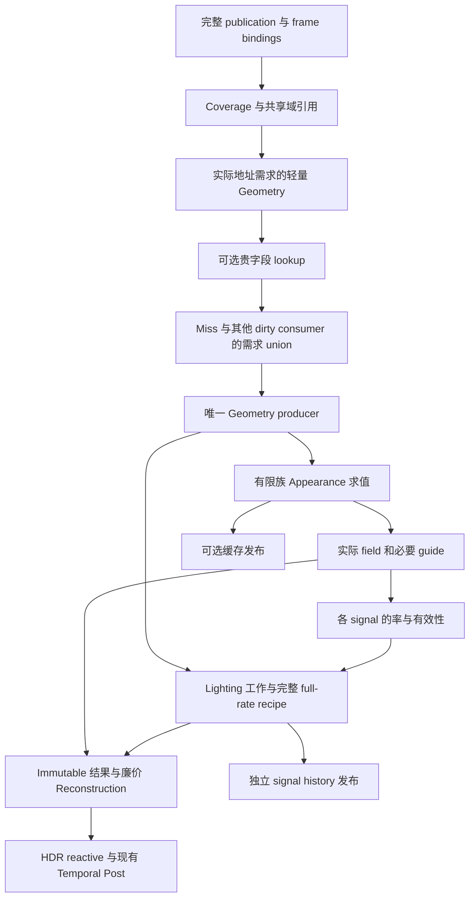

# EEngine Surface V3 极致性能重建设计

日期：2026-10-05。设计核对源码：11a7af962dd4eae54e900e31d28dc856d540d443。问题与历史计时基线：09449d6d98b33a89b200bd71d5faaf8140149779。

本文细化既有母稿，继续作为唯一当前重建设计入口。目标是先替换失衡的 Surface V3 生产链；A0/A1 只前移必要的测量、执行与资源工作。执行顺序仍为 A0 → A1 → B1 → B2 → C → D → E → F。新设计、拟移植算法、生产实现和验证采用是不同状态：**本次只形成文档，未实现新链，未取得新性能结果。**

[执行文档](../next-execution/eengine-extreme-performance-rebuild-execution-2026-10.md)定义切换任务与退出条件；[来源账本](../porting/next-renderer.md)保存固定源码、许可、阶段映射和未覆盖范围。两份审计是历史问题证据：[独立源码/GPU审计](../reviews/eengine-independent-source-gpu-performance-audit-2026-10-05.md)、[源码真值审计](../reviews/eengine-source-truth-audit-2026-10-05.md)。审计中的行号不能替代当前符号定位。

## 0. 目标、范围与决策状态

### 0.1 目标

EEngine 继续追求极致性能、现代 GPU-driven、WebGPU Native、AAA Rendering 和可持续扩展。首要运行目标是 GTX 1650 Ti、1080p 复杂场景。

具体工程目标是：

1. 命令拓扑由有限执行类别、真实全局同步和资源作用域决定；不按像素数、活跃 tile 数、cache 请求数或材质实例数复制整条命令链。
2. GPU 工作量随实际合法需求增长；高频区域可以接近全率。完整求值的物理成本不会因一个域 ID 消失。
3. 分类、缓存和复用必须获得端到端净收益；关闭复用时仍有同一生产结构中的完整直接求值。
4. 保持完整身份、需求 union、唯一 writer、互斥写域、合法精度、错误与容量覆盖；不通过关闭效果、丢材质、截断证明或隐式降精度满足预算。
5. 让后续系统消费明确 GPU 产品，避免新增万能 scheduler、证明图或全局 SignalStore 协议。

“恢复正常性能”本轮指消除已证明的数百毫秒管理热点，并测得可解释的 Surface 和整帧成本；没有预先承诺 FPS。目标质量、场景和时间预算必须在实现前声明，未测结果保持未完成。

### 0.2 本次范围

主切换对象是 SurfaceWorkRuntime、CellClassifier、Demand、Geometry 产品、Appearance 调度、Field/Signal Store、Reconstruction 与 Surface capacity/lifetime。直接影响它们的 FrameGraph、材质发布、纹理 binding、AO/Shadow/Temporal 接线随 producer 前移。

D/E/F 补齐现有 Geometry、Lighting/Shadow、Temporal/Post 的基础缺陷。未来 VG/VT/VSM/ReSTIR/SSGI/Atmosphere/高级 Temporal/AI 的输入扩展合同在 §21 声明；本次不先建设那些尚无现有消费者的完整效果。

### 0.3 决策分类

| 级别 | 本文内容 | 实现要求 |
|---|---|---|
| 必须保持 | 单 production path/submit、完整数学、身份、覆盖与生命周期 | 每切换单元检查 |
| 选定结构 | 有限执行族、共享发布域、薄几何、独立信号率、compact overlay＋完整 indexed 目的地 | 按执行计划实施 |
| 选定来源 profile | Forge 插值、Wicked 工作组织、Filament lifetime events、RTS scan 等 | 保留源阶段；差异登记 |
| 本地算法 | 现有 DAG 的有限族执行、Surface 需求发布、信号风险与混合写域、可选字段缓存 | 命名、独立参考、真实 GPU 和成本核查 |
| 原型必须确定 | exact DAG 求值 live slots、产品 atlas routes、薄记录布局、dense 峰值、coarse 质量门槛 | B1/B2 不得空着跨单元 |
| 后续能力 | 新 world-query、ReSTIR、AI inference 等 | 接口预留不等于功能完成 |

## 1. 源码事实与历史证据

### 1.1 生产链

当前 FrameProgramLowering 调用 SurfaceWorkRuntime.addToGraph；后者将 consume 闭包传给 SurfaceCellClassifierPass，每个静态 batch 再建立 Demand → Geometry → Appearance → Field publish → Lighting → Signal publish → Reconstruction。

当前仍存在：15 field＋6 signal plane，512 B 三角形 setup/memo，Field 32-word key/256 B entry，Signal 72-word key/352 B entry，128 B hot＋最大528 B cold GeometryRecord，以及按 unique Appearance program 编码命令。

| 问题 | 当前定位 | 重建责任 |
|---|---|---|
| CPU 固定逐 batch 展开 | SurfaceCellClassifierPass.addToGraph、SurfaceWorkRuntime.consume | §7/§11 |
| retirementEnvelope 压制 steady scratch | SurfaceOptimizationCapacity.physicalFor/failures | §12 |
| plane 内树、归约与 prefix | surface_cell_classify、surface_cell_group_validation | §9 |
| lookup 前 heavy setup | SurfaceCellGeometrySetup、surface_cell_geometry_setup | §8 |
| 每 unique WGSL/product binding 一个命令 | GpuAppearancePublication.prepare/encodeSurfaceFields | §6 |
| 每 node 扫 resource registry | FrameGraph.executeCompiled | §13 |
| reconstruction 依赖旧 field/signal refs | SurfaceReconstructionPass、surface_reference_values | §10/§14 |
| AO 的实际消费者 | Reconstruction 逐 output pixel 消费 scalar AO；XeGTAO 从 depth 恢复自身 normal | §14/§16 |

Scene/资产 publication、GPU residency、真实 indirect、已有插值与 BRDF、FrameProgram 缓存、单提交及异步退休有保留价值。未进入生产帧的源码不计入本帧成本，文件行数不作为删除依据。

### 1.2 历史测量的使用边界

历史环境：NVIDIA Turing/系统 GTX1650Ti，Dungeon，1920×1080 internal/output，VSM 和 jitter 关闭，固定曝光；full profiling 组 29 个完成 GPU 样本，未控制温度/频率。这里只引用其问题定位，不将其视为本次重测。

| 指标 | 历史值 |
|---|---:|
| Surface GPU pass-sum P50/P95：far | 96.14 / 101.24 ms |
| Surface GPU pass-sum P50/P95：near | 785.19 / 815.05 ms |
| 整帧可执行 graph nodes / compute passes / dispatch | 2689 / 2382 / 2394 |
| 固定 batch / tiles per batch | 47 / 700 |
| near FieldLookup / Proof / Classifier / SignalLookup P50 | 169.54 / 146.15 / 178.52 / 108.00 ms |
| near Appearance / Lighting / Reconstruction P50 | 6.68 / 10.09 / 6.49 ms |
| near material lookup hit fraction | 2.24% |
| near GeometryRecord / visible pixels | 99.965% |
| 每帧 clear 命令 / 请求清理范围 | 489 / 283.47 MiB |
| CPU render profiling off（有 native wrappers） | 约40–41 ms |

管理类别分项 P50 之和708.71、Appearance/Lighting/Reconstruct之和23.26，只表达严重失衡的量级；分母没有包含全部真实 Geometry 工作。分项分位数不能代替逐帧求和再计算分位数。

CPU graph 时间不能从 GPU Surface 时间相减。admission fraction 不等于节省比例。clear 请求范围不等于实测显存带宽。VSM/有效 local lights 未在这组计时执行，不能用该结果证明其正确或解释这些 Surface 热点。完整 cache-off/recompute 反事实仍未建立。

### 1.3 两份审计的取舍

选用第二份实际命令/计时/容量结果纠正第一份静态估算：1080p 是700 tiles/47 batches，4K受到输出策略拒绝，不能把184 batches写成可运行实测；graph缓存已有，thrash需要另测；FG node不是GPU pass；FSR3 1:1仍承担temporal；atlas load/store不能直接换算总线字节。

pending allocator有Promise回调，删除数组元素保留排序，FSR3有真实reset入口。这些风险按完整生命周期核查，不直接登记确定泄漏。VSM pageConstants创建后无可达写入、point/spot shadow返回1以及camera-visible caster输入，则保留为具名源码缺口。

## 2. 来源优先与移植选择

先读完整 GitHub 源入口，再对照作者论文/详细说明。固定版本表示可复查来源，不表示本地已采用；完整阶段映射见来源账本的“Surface集中重建”条目。

| 编号 | 固定来源 / 许可 | 选定范围 | 本地阶段及差异 |
|---|---|---|---|
| SF01 | Wicked df44c3db4c4927492bc9c791eac715d98d7ed091 / MIT | analyze→resolve bins→indirect→masked shade | coverage、有限family工作、完整写域；Wave/Quad/bindless改为已协商WebGPU实现 |
| SF02 | Intel CPS 63ad5c1adafbfcc2869a200f50a5ea11f28b4887 / shader Apache-2.0 | GBuffer-first、rate2 coarse/full及完整补做 | Lighting调度原型；其判据不证明pre-material省计算；新增风险策略另名本地算法 |
| SF03 | Forge cd5046893faba2dc7869243873bf01f02a6f0df9 / Apache-2.0 | CalcFullBary、Interpolate*WithDeriv | 唯一Geometry数学；既有W=0/负W本地扩展单独核对，不改成clamp分母 |
| SF04 | Filament bb360e80259167c986e94db7b70153bcdb92c0e1 / Apache-2.0 | compile first/last→per-pass acquire/release→execute | FG生命周期事件；WebGPU资源退休和abort仍由本地owner处理 |
| SF05 | GPUPrefixSums 98d93a4e9ed2f3c8353119515bf9be90a2e137ad / MIT＋根notice | RTS reduce→spine_scan→downsweep，inclusive u32 scan | compact基础；该WGSL需要subgroups，exclusive/scatter/overflow/args是本地集成 |
| SF06 | OSS 473a59bbcdd30e3366cc567d66a5a97353620d48 / Apache-2.0 | occupancy→allocation/task→virtual sampling机制 | 选定贵closure缓存参考；不复制逐instance host、后验overflow、RT/Htex全工程 |
| SF07 | Filament同SF04 / Apache-2.0 | gltfio UbershaderProvider有限预构建material与实例参数 | 有限执行族的架构参考；不提供完整AppearanceGraph解释器 |
| SF08 | DOOM GPC2025 PDF / 技术参考 | rate/coverage→primaries、texturing compact、Lighting tile remap、immutable重建启示 | 没有完整可复制源码；surfaceID、per-pass SRI等未来建议不写已交付 |
| SF09 | Twinklebear webgpu-marching-cubes 1d550a3de65ef2f8c10a89069526c5d2b8b0413b / MIT | 无subgroup Blelloch block exclusive scan→block offsets→add offsets | portable scan数学来源；host chunk/private submit/readback不采用，有界多层发布是本地集成 |

DOOM冻结PDF SHA256为e5fe7cf223006bf95089eb2890c878a47aecccd612eb9e5398c1fe43273d0fad。其同UAV原地deblock race不采用；composite/fog后续撤掉VRCS说明变率必须逐信号评估。

无完整donor覆盖本地连续域、前置lookup、全部Appearance标量DAG、VG/VT身份、信号误差与无损overflow。具名本地组合称为 **EEngine Domain-Scheduled Surface**：名称表示本地责任，不提升任一upstream adoption。

便携scan优先选有明确多dispatch发布的算法。SF09提供无subgroup的完整block up/down sweep与offset数学；本地Bounded Tile Count Scan使用有限多级GPU发布，修正padding初始化并删除上游host等待/submit/readback。SF05的subgroup RTS作为协商特化；exclusive/scatter/overflow/args分别登记本地集成，不采用跨工作组自旋/look-back。

## 3. 架构不变量与成本合同

### 3.1 A：有限命令拓扑

Surface命令数由固定phase、material family、绑定资源profile、signal family决定：

    Dsurface <= Dfixed + Kresource * Kmaterial * Dmaterial + Ksignal * Dsignal
    Kmaterial/Kresource属于renderer能力profile；材质实例/graph数量不增加K。
    工作组数、shader内部实际求值量可以随真实需求增长。

命令账同时列graph nodes、compute/render passes、dispatch/draw、copy/clear、bind requests/native creates、upload calls/bytes。不能把千个dispatch塞进一个node就称解耦。

跨硬件limit必要分段必须有有限profile上界及完整结果覆盖；分段不得重新复制全部管理链。任意graph各自一个pipeline/dispatch不满足本约束，§6提供完整执行方案。

### 3.2 B：管理不得压倒计算

逐帧定义：

    Tmanage = coverage/domain work + bin/scan + rate selection + lookup/validity
            + admission/publication + reset/copy/scheduling归属
    Tevaluate = 所需Geometry + Appearance + Lighting + 正式求值产品
    Treconstruct与temporal/post单列，并计入端到端总成本。

非空代表workload要求Tmanage<=Tevaluate，且新增复用端到端成本优于关闭该复用。空帧/常量closure的分母接近零时同时报告绝对管理税、实际命令和字节，不能添加无用求值抬高分母。比率不可采样时标未验证，以零heavy lookup/proof等结构事实辅助，不填0ms。

A0/A1只核自身执行与测量范围；B1核切换closure，B2/C核全部Surface。局部范围通过不等于仍含旧链的整帧已经满足不变量。

### 3.3 C：复用可关闭

同一产品、算法数学、coverage与consumer；关闭缓存/空间复用/历史复用后计划变为完整直接求值。无旧renderer、A/B运行桥、测试专用fallback或第二submit。

cache hit/off输出按精确合同对照；空间/temporal近似按已批准误差合同对照。关闭复用不得依赖旧Store/旧proof产品才能正确。

## 4. Ownership与五种实体

| 边界 | 权威产品 | 直接消费者 |
|---|---|---|
| Asset/Scene/Material publication | 完整描述、无歧义handle、版本、程序/路由、实际成本类别 | Surface address/work、Geometry、各provider |
| Geometry owner | source mapping、薄record、按需输入、几何guide | Appearance、Lighting、具名normal/roughness产品producer |
| Surface work | coverage、tile run、field/signal需求与实际queue、最终写域 | 各worker与Reconstruction |
| Appearance owner | 实际field值、常量/产品refs、guide、选定缓存value | Lighting与Compose |
| Lighting provider | 独立signal结果、需要时history与validity | Compose、对应denoiser |
| Frame runtime | bindings、lifetime events、encoder/submit/abort | 所有生产pass |
| TemporalFacts | 当前motion/identity/change事实 | 各history判定与最终upscaler |
| Reconstruction | signal插值、因子合成、HDR/reactive | Sky/Aerial、FSR、Post |

域、tile、sample、execution bin和cache address分开：域共享身份/地址规则；tile是局部处理与coverage单位；sample是实际求值点；bin用于执行一致性；cache address指向可复用值。

所有名称是责任边界，不要求新增同名类/registry。Renderer保留composition root，算法、预算和失效事实回到其实际owner。

## 5. 身份、域描述与发布

### 5.1 三种identity保持分离

| 身份 | 用途 | 组成与限制 |
|---|---|---|
| Winner identity | 精确恢复实际可见primitive/side | instance、representation、source meshlet/primitive、generation等原完整信息 |
| Sharing identity | 判合法共享候选范围 | 发布域、接缝、坐标域、LOD lineage、实际所需依赖；同winner可不共享，不同winner可合法共享 |
| Cache identity | 判断某field值是否可复用 | 完整closure/域描述及版本＋实际坐标/footprint/动态witness；hash只定位 |

CPU publication可以将完整不可变描述做精确intern，再发无歧义handle；intern需比较完整描述。handle复用前等待所有GPU引用退休，配deviceEpoch和generation。Temporal change hash不是cache equality。

### 5.2 共享描述与局部引用

DomainDirectory在publication维护静态语义；TileWork仅写coverage、domain/mixed模式、需求mask、有限exception范围。单一合法域可被全屏tile引用，不要求把所有tile工作压成一个GPU任务。

结构测试分开：
- 单实例、同一已发布域、无接缝的fixture：一个共享DomainDirectory条目；仍允许多个TileWork。
- 同域的高频纹理/normal/高光：允许全率samples；不能由一个domain条目推出一个值。
- 混合winner且不能共享：按实际局部runs或隐式full-rate处理，不生成21份leaf映射。

动态版本只更新真实依赖；camera运动不应清静态Appearance。representation/texture/instance变化仍需准确失效，发布与消费版本必须同一帧事务。

## 6. 材质编译与有限执行族

### 6.1 必须替换的真实增长源

GpuAppearancePublication的kernelKey包含生成WGSL、textureBindingSetId和product texture keys；surfaceProgramCount随unique descriptor增加。TextureBindingSetPolicy的4 sets/9 banks/6samplers只是资源边界，旧16×4类别声明不能证明当前Surface命令有界。

本设计选择：
1. 常量、Unlit、Standard PBR/coat常用源纹理使用有限参数化family，参数/route按material handle索引。
2. 完整现有AppearanceInstruction DAG进入exact generic family；graph/instruction作为数据，不为每个graph建立命令。
3. static/dynamic product textures进入已声明bank/atlas route，不能按每个asset key新增binding profile。
4. texture/resource profile只按协商能力分有限族。新shader operation改变renderer版本，不按实例创建family。

SF07只支持“预构建少量程序＋material instances”的参考边界；generic DAG执行是具名本地 **Exact Appearance DAG Execution**。

### 6.2 generic执行的完整语义

保留现有标量IR的constant、parameter、input、texture、operation、product、normal-product；完整覆盖add/subtract/multiply/divide/min/max/pow、sin/cos/abs/sqrt、mix/clamp及swizzle/combine scalarization结果。保留原操作顺序、坐标子图、嵌套采样、UV0/1/2、sRGB RGB与linear alpha、sampler/wrap、normal/coat validity、finite guard。

发布时生成拓扑指令顺序、精确field closure mask、liveness slots与route。常用family必须和generic/CPU参考逐输出一致，不能以外观相近代替。

generic scratch以同时执行的lane数Q和live slots L配置；每lane独占scratch，C/X/Y只保留实际梯度所需值。可用固定数量workgroups按GPU actual work做strided loop，计算各自独立work item；循环没有其他workgroup完成等待、全局锁或barrier。

    temporaryBytes = Q * liveSlotStride(L, actual point domains)
    资源及私有上限在publication/device preflight协商；
    live slots从完整DAG推导，不截instruction数量或输出。
    scratch紧张时减少并发Q；不能丢任务、改廉价材质或回到每graph一个dispatch。

若完整DAG无法在该device limits下执行，publication必须明确失败并保留原合法publication；这是能力/资源失败，不是静默改语义。任何原支持资产因此被拒绝，必须记录为未解决回归，不能据此判B2完成。

### 6.3 profile/liveness原型责任

B1除廉价closure竖切，还验证有限族的可行性：多个不同graph、不同set、nonlinear坐标、三UV、normal/coat/product，命令拓扑不增长；private/register/storage scratch有真实账；generic不能慢到抵消全部前端收益。

这里允许两个成本明确的实现特化（常用静态family/generic完整family），但只有同一publication和产品协议。禁止保留无上界逐program协调路径作为未声明逃生口。

### 6.4 指令与资源执行协议

generic不是每个field单独解释完整graph。publication从实际miss field mask求原始DAG闭包，保留共享sample/坐标节点；一个work item执行其需求union，共同节点只求值一次。指令记录携带opcode、源slots、destination、parameter/input/route引用和原field输出关系；slot复用只能在所有相关consumer结束后发生，原数学求值顺序不改变。

每个lane的scratch地址由frame allocation、lane slot、point domain和live slot确定。不同lane范围不重叠；跨workgroup不传递中间值。静态family和generic使用同一参数、resident sampling与输出语义；无效operand/route在publication边界拒绝，GPU只保留实际输入/边界失败必须处理的分支。

product atlas/bank发布必须保持原f32/格式、mip/过滤、wrap/sampler、gutter与坐标范围；不能将独立product压成RGBA8或粗页后称等价。route的纹理格式与采样类别参与有限resource profile，具体asset身份仅为数据。原独立product尚未路由的情况是B1/C未完成项，不能用每asset一个新kernel掩盖。

是否可缓存还受address成本约束：key所需坐标若必须先运行昂贵几何/坐标子图，publication选择direct/per-target或合法预计算产品；不先完整求值再lookup。view/nonlocal依赖没有完整低成本地址合同前直接计算，既有材质功能仍完整。

## 7. 新生产数据流与阶段

下列S编号是semantic phases，不要求一个phase对应一个GPU pass，也不预设固定ABI字节。CPU只编码有限拓扑；实际数量由GPU产品发布。

| phase | 输入 | 输出 | 主要写owner |
|---|---|---|---|
| S0 publish/reset | 已提交publication、frame参数、history roles | 完整帧bindings、少量control reset | publication/runtime |
| S1 coverage/work | Visibility、extent、published identity | coverage/active tiles、uniform/mixed引用 | Surface work |
| S2 address geometry | 真实lookup依赖、winner、source/resident/frame geometry | 最小address/mapping、实际lookup请求 | Geometry owner |
| S3 field lookup | 仅适合cache的地址＋完整版本 | immutable hit refs、miss field masks | Appearance cache |
| S4 demand/bin/args | misses、dirtylighting、必要guides | Geometry union、实际family work、间接参数 | Surface work |
| S5 Geometry→Appearance | 唯一需求union、源属性、完整程序 | GeometryRecord视图、实际field值/full-rate guide | Geometry后Appearance |
| S6 rate/signal work | 已发布guide、共享域、provider facts | 独立signal sample plan、完整异常recipe | Surface work/provider |
| S7 Lighting | 唯一GeometryRecord、fields、cluster/shadow/IBL | signal结果或full-rate最终radiance贡献 | Lighting provider |
| S8 optional publish | 明确eligible value和唯一writer | 下帧可用cache/history | 对应owner |
| S9 reconstruct/compose | immutable结果、pixel factors、AO、TemporalFacts | HDR/reactive、完整covered/background写域 | Reconstruction |

S5可在一个kernel内由Geometry代码先生成invocation-private完整record，再让Appearance消费者读取，避免物化最大cold；跨phase可复用部分则发布薄record/field planes。Appearance不从Visibility另恢复三角形。S7不补写Geometry，S9不调用完整插值、材质或PBR。

全率与稀疏采用同一worker数学及结果接口。完整full-rate indexed recipe是工作表示和写域模式，不是旧renderer。低覆盖/空队列至多承担固定小量reset/finalize命令。

## 8. 唯一Geometry产品与lookup前置

### 8.1 lookup前只生产实际需要的轻量信息

address需求来自field cache class：纯publication不需geometry；实例域只需权威handle/版本；真正依赖UV/footprint才请求对应projection/UV mapping。禁止先decode position/normal/tangent/所有UV/color，再称lookup省掉geometry。

source/resident/frame products已有属性时复用其owner产品，避免第三份decode authority。primitive mapping只为实际需要的primitive形成；是否缓存mapping取决于净收益。

### 8.2 需求union

    GeometryDemand = union(
      missingAppearance.dependencies,
      dirtyLighting.dependencies,
      requiredGuides.dependencies,
      numericResidual.dependencies
    )

每个field hit只移除它自己的miss dependencies。其他dirty consumer仍可请求同一record；numeric-only miss可以无需record。语义bit与物理alias保持分离，同物理position/normal/tangent需求只生产一次。

若rate依赖Guide后才出现新需求，只有同一Geometry owner完成missing mask；已产生输入不重写。frame-local状态含producedMask/requiredMask与明确发布点，不增加独立失效owner。

### 8.3 薄记录与局部cold

保留完整f32数学，先减少无消费者字段与填充，再选择布局。hot不再一律128 B；position、几何normal、shading normal、tangent/sign、depth等按实际consumer保留。view若可由已发布position与同一camera数学廉价派生，由Geometry读取接口给出；消费者不能再decode源顶点。

C/X/Y冷输入优先在Geometry→Appearance相邻求值中局部存活，具有后续consumer的输入才写frame cold pool。跨kernel记录按实际字段宽度SoA/分段，typed view能还原原语义；改变float精度需独立质量依据和用户认可。

写域：
- 一work item拥有其record；
- 后置completion只写未发布字段；
- cold append先完成容量预留，再写，下一dispatch发布；
- collision/容量失败由同一Geometry数学完成直接工作，不读未完成slot。

B1/B2必须证明最坏需求有完整路径；不能仅凭tinyfixture拥有几个record就判布局可行。

## 9. 分信号采样与共享合法性

### 9.1 率合同

每个signal独立记录coverage、sample locations、footprint、rate、结果语义、error profile和history validity。material地址共享、Lighting率和最终output像素率分开。

常量field由publication直接给值；普通便宜纹理保持完整正确采样；贵closure的空间重用只在有可核过滤/variation合同的地址域内发生。不能以相同material ID推广非线性过滤等价。

Lighting分类在实际guide可用之后执行。由共同覆盖/合法域/normal与provider事实一次生成相关风险，不再逐15/6plane重建共同树。

### 9.2 初版可交付的成功范围

先交付有独立依据的常量publication共享、合法稳定field命中、平滑diffuse/irradiance的局部coarse成功及局部拒绝。高频normal、低roughness specular/coat、细几何、新显露、接缝/LOD变化各自提高相关率。

“原Intel CPS profile”只用于原公式/常量/数据阶段的对照。EEngine生产使用具名本地 **Signal Footprint Admission**：加入真实identity、normal/coat差异、roughness/view/light/shadow风险，不宣称是原CPS完整port。缺充分事实时只有依赖该事实的区域/信号直接求值；普通合法低频成功必须在B2/C被证明。

判定应使用：
- coverage/side/domain兼容与当前frame有效版本；
- field/normal/roughness guide的实际variation或有依据的envelope；
- cluster/light集合及receiver范围；
- shadow/content变化与硬边界；
- specular/coat对half-vector、法线和视向的敏感性；
- source footprint、材质非线性与LOD/texture residency变化；
- 历史confidence仅作为temporal输入，不能单独证明当前空间平滑。

shadow范围证明暂缺时，可以直接求值相关direct signal；必须补合法成功分支，不能以永久拒绝shadow/所有未知材质当最终状态。

### 9.3 footprint与误差

中心值、空间过滤、梯度、源mip、normal filtering以及最终upscale分别有合同。不得用粗率步长隐式改变原textureGrad、额外mip bias、随意clamp或将normalTS当颜色插值。

定义signal-specific误差指标：linear HDR绝对/相对差、normal角差、direct/specular/coat独立差、edge coverage、temporal闪烁/ghosting与newly-visible恢复。数值阈值从独立reference/现有预算得出；需要改变原质量范围时先取得用户认可，不在本文虚构一组已批准常量。

空间变率、signal history、FSR共同计算有效footprint和累计质量风险，不能三处各自放宽后把误差交给TAA隐藏。

## 10. Field缓存与signal history

### 10.1 publication决定策略

每closure发布exact constant/direct source/static product/dynamic cache/per-target类别及dependency recipe。cost class来自实际指令、采样和更新profile，未测cheap-value不进入重协议。

field cache只覆盖明确昂贵且可重复消费的值；lookup在material miss compact之前。完整不可变closure/domain描述由handle引用，动态witness按实际依赖保存；不同cache class可以有不同宽度。若缩短地址需要遗漏依赖，选择直接求值。

### 10.2 读写与失效事务

hash定位后比较完整identity/witness；frame hit refs不可在消费中被evict。候选地址去重后唯一producer发布一次；其结果被多个consumer读取。lookup、nomination、publish如果不能得到净收益，就退出该closure的cache策略。

content/sampler/material/geometry/LOD/instance/device各自有权威版本。共享slot复用等待generation与pin/retire完成；未提交帧写入不成为下帧hit。弱CAS失败、hash满、admission满都转为实际求值，完整radiance需求不被cache队列截断。

禁止跨workgroup用一个state atomic当多word payload发布屏障；写payload与consume/commit经合法dispatch顺序，必要state只描述已发布事务。

### 10.3 SignalStore替换

72-word通用SignalStore不再是所有Lighting的默认路径。需要历史的signal采用自己的screen/object/provider domain、reprojection、normal/depth/identity与light/shadow版本判定。direct/specular/coat/irradiance不共用一个“material相同即可复用”的规则。

C提供完整现有signal对应关系和合法历史更新；history无效直接求值。cache/history关闭后仍完整生产同语义结果。未来reservoir/denoiser各自拥有算法状态，不强行映射到这套history。

## 11. Compact工作、完整异常与发布边界

### 11.1 统一覆盖分区

输出covered pixels = sparse-covered集合 ∪ indexed-full-rate集合，两者不相交。背景是第三个互斥集合。每个signal/field的最终计划在正式work发布边界确定，其consumer不重复遍历旧proof或decode同一identity。

TileWork使用uniform/mixed/implicit-full-rate模式。sparse descriptor按tile整项预留，成功才提交sample映射；失败整个所属写域切indexed full-rate，已预留未commit内容不可被消费。执行类别bin可扫描小tile header或消费compact tiles，但不能每family逐像素探测所有材质。

### 11.2 各种耗尽必须分别处理

| 耗尽对象 | 正确处理 | 禁止 |
|---|---|---|
| domain/mixed descriptor | 该tile使用完整indexed recipe | 丢mixed lane、截run |
| sparse sample queue/map | 预发布前改该信号full-rate，保证唯一写域 | 部分sample留下未覆盖像素 |
| optional field cache/request | miss direct compute；不取消output需求 | cache queue overflow等同工作完成 |
| Geometry cold scratch | 降低并发Q或局部record直接消费；同owner完整数学 | 让Appearance/reconstruct另恢复几何 |
| retained field/signal destination | extent/publication预检保证完整上限；合法pool或直接正式producer输出 | 将metadata fallback当作目的地存在证明 |
| history pool | 当前frame direct compute，必要guide仍写 | 将陈旧结果当合法 |
| 数量/u32溢出 | checked arithmetic在preflight/发布点拒绝非法产品并保留上一合法事务 | wrap为小count继续写 |

目的地必须在编码前满足完整frame需求，GPU不能临时createBuffer。exact full-rate并不免费：thin Geometry和窄field的最坏物理量、绑定数及效果输入全部进入§12。

full-rate直接radiance可以由正式Lighting producer融合因子合成后写最终贡献；Reconstruction只消费其结果。只有实际layout和register/private存储通过后才采用融合；不能假定一个巨kernel能绑定所有source/material/light资源。

### 11.3 queue与scan

局部workgroup聚合counts，少量原子reserve实际连续范围；必要全局prefix用reduce→spine scan→scatter/args发布。scan和队列采用有界整数范围，明确空队列、padding、exclusive转换、完整tilecommit和失败。

无subgroup正确基线与subgroup特化输出完全一致。GPU indirect args由finalize发布到独立arguments buffer；下一dispatch不将该buffer同时作为writable storage与INDIRECT。若直接写STORAGE|INDIRECT缓冲，通过绑定集排除写alias可免copy，但需要真实usage验证。

GPU workgroup strided loop处理互不依赖items，允许；等待其他workgroup或假定“最后一个group”完成全局发布，不允许。

## 12. 物理布局、容量与峰值内存

### 12.1 账本与分配责任

每个产品声明stride、active count、reserved capacity、GPU writes、reset范围、alignment、owner、consumer、lifetime及overflow。分配上限与实际写量分别报告。

    PeakLive = mandatory outputs + required retained inputs
             + bounded work/temporary pools + selected reuse/history
             + uploads + unavoidable in-flight/resize retirement
    DeviceBindingLimit逐buffer检查；OwnerBudget和GlobalPressure分别检查。

不要将父arena与其子range重复相加，不将budget ceiling写成live allocation；destroy后的pending retirement独立追踪。retirement不能永远按2×steady scratch限制每批。

### 12.2 可核算的表示算术

以下是1920×1080的布局对照，不是选定ABI或实测流量：

| 表示 | 全屏容量算术 |
|---|---:|
| tile数/64 B tile header | 32400 / 约1.98 MiB |
| 一个u32/pixel | 约7.91 MiB |
| 现有15个vec4 field slots | 240 B/pixel，约474.61 MiB |
| 当前15 fields的真实25个f32通道 | 100 B/pixel，约197.75 MiB |
| 现有Geometry hot＋最大cold | 656 B/pixel，约1297.27 MiB |
| 一个rgba16float全屏output | 约15.82 MiB |

选择窄通道、常量省槽和按需求保留能改变表示；“compact”本身不减少已保留capacity。将所有656 B records扩大到全屏不采用。

完整直接求值采用：薄retained Geometry/guide、实际宽度field planes、局部C/X/Y record、直接/稀疏signal组合。已经在publication提供的constant不占逐pixel槽；同语义物理alias不另分配。字段布局按consumer而非固定15×vec4；不以float16压缩当默认收益。

### 12.3 preflight与工作集调度

preflight输入为extent、完整field/guide要求、family routes、maxlive DAG slots、provider需要、buffer/texture limits和帧并发。输出包括完整indexed目的地、稀疏overlay容量、Q、stage bindings、steady/resize峰值。

分配策略：
1. 先保留完整output/必要guide/直接求值目的地；
2. 给Geometry/Appearance临时工作选择bounded Q；
3. 为实际稀疏工作分配optional overlay；
4. 余量再分配能获得收益的cache/history；
5. resize先检查overlap，推迟publication或减少in-flight，必要时明确unsupported extent；不悄悄降分辨率。

更大binding limit不能替代整体VRAM账。generic DAG长导致Q减少时shader计算可能增加，必须测最坏帧；不能用合法但近乎串行的执行宣称正常性能。

## 13. FrameGraph、bindings与WebGPU能力

图保留resource versions、真实producer/consumer、side-effect、死节点裁剪、late binding与异常清理。编译输出acquireBefore/releaseAfter/resourceSlots/scopes，不在execute逐node扫registry。

同物理scratch只有一个owner身份＋版本链。per-scope引用使用typed ranges；logical last use归还queue-ordered pool，真正destroy等待正确GPU寿命。

[WebGPU resource usage](https://gpuweb.github.io/gpuweb/#resource-usages)与[synchronization](https://gpuweb.github.io/gpuweb/#synchronization)：compute每dispatch一个usage scope；render一个pass一个scope；copy/clear在pass外。兼容dispatch可以共享compute pass；pass合并不能替代全局producer/consumer dispatch顺序，也不保证减少所有driver同步。

bindings静态layout先协商device limits，buffer binding offsets使用device实际alignment；buffer-texture copy按规范row pitch，queue.writeTexture单独遵守其规则。避免read-only/storage/indirect同whole-buffer不兼容usage，即使range不相交也不豁免。

稳定pipeline/layout/sampler/bind group缓存按资源身份复用。graph key只含真实执行profile；材质参数、per-frame数量和普通camera运动进data不进recipe。tiny参数按frame/profile打包；Immediates可做协商增强，保留相同语义uniform路径。

subgroups、shader-f16、primitive-index、immediate_address_space等逐项probe；不能把它们或原生mesh/RT/bindless当默认正确性条件。当前WGSL特殊atomic vec2 min/max需语言能力协商，不等于一般64-bit atomics已适用。创建资源前验证所有descriptor/limits。

## 14. 全部直接consumer与合成语义

| 现有consumer | 必须消费的新产品 | 切换责任 |
|---|---|---|
| Appearance kernels | 唯一GeometryRecord＋field miss mask＋published route | hit不执行相应heavy；numeric-only不强求geometry |
| SurfaceLightingWorkPass | 唯一GeometryRecord＋实际fields/guides＋providers | 不自己从source重建，不写record |
| Reconstruction | immutable packet/贡献＋pixel factors＋AO＋TemporalFacts | 无完整Geometry/材质/PBR重执行 |
| TemporalFacts | 真实Visibility/depth/publication/previous frame roles | 不把其change hash当精确field key |
| XeGTAO | 当前仍为depth→其normal/preparation→AO | 保留donor数学；不声称已有Surface guide消费 |
| Sky/Aerial | HDR/radiometry与Atmosphere LUT版本 | 按原正确顺序合成，不增加独立submit |
| FSR3/Post/Present | HDR/reactive、depth/motion/exposure与完整history role | resize/cut/abort/failure保持 |

保留现有packet语义：
- Denv是不含reflectance、occlusion、AO及1/π的irradiance；
- Ddirect是已含1/π的factor-free transport，或显式colored residual；
- specular/coat是radiance；
- emissive/unlit来自正确field；
- colorspace/pre-exposure在现有定义边界各执行一次。

unsafe numeric envelope必须保持原完整BRDF finite guard和colored residual。不能把guard所依赖的IOR/base/specular字段省掉后继续输出transport。当前AO按output pixel作用于environment diffuse的语义保留；改变specular AO策略属于独立效果决策。

新的full-rate shading normal/roughness产品只在实际rate/consumer要求时生产；未来SSR/SSGI所需精度/率不得用coarse复制值冒充真实guide。

## 15. Geometry、LightCluster与VSM基础缺口

Surface主切换先完成B1/B2/C；D/E只建设现有正确消费所需工作域和极端路径。

D：真实hierarchy depth、Product保守HZB/恢复、普通camera motion与cut区分、完整resident fallback、共享frame attributes、独立Shadow caster需求。camera可见列表不能作为world-query完整集合。

E：light assignment按bounds影响范围count/prefix/fill或有来源的层级方法；溢出仍覆盖所有实际光源。禁止将列表截为128或用color-zero早退代替极端路径重建。

VSM pageConstants缺producer必须修；caster依据light-space页域；完成页才commit；capacity不足可用明确resident coarse表示与重试。持续返回visibility1不能算阴影完整。point/spot现有stub按真实功能缺口处理，不宣称本次已有全部local shadows。

这些正确性接线如果阻塞新的真实Lighting consumer，在B单元前移修复；不能为了Surface测试关闭阴影绕过已启用功能。大规模VSM算法改选保持单独E单元与固定donor映射。

## 16. Temporal、Atmosphere与Post

统一frame facts和事件，不统一所有history内容。cameraCut清screen history，静态Appearance只有其实际依赖变化才失效；object-domain history保留自身规则。frameIndex、read/write roles、deviceEpoch、pre-exposure与submit/abort共同形成事务。

Signal history、denoiser和FSR分别保留更新、confidence、normal/depth拒绝与reactivity；不能多重无限平滑隐藏漏工作。FSR3 1:1的temporal收益与upscale收益分profile测；不默认删除。

Atmosphere已有LUT owner及dirty策略复用，图外维护产品的发布版本进入FrameGraph引用。Sky/Aerial保留其完整数学与颜色空间。Bloom/Present只在算法等价时减少中间输出/上传；不以“后处理名字多”当主要热点证据。

## 17. 质量与失败合同

直接求值是正确reference语义；变率/历史为有明确误差和失效条件的加速。空间重建读immutable输入，sample/duplicate写域互斥；不复制DOOM原地race。

必需质量分布：常量、源纹理、nonlinear UV、normal/ORM、coat、强IBL、sharp highlights、接缝/跨primitive连续面、薄几何、near/far、static/moving、新显露、LOD/形变、texture/page变化、有效local lights、shadow边缘、AO边界。

故障分布：每pool独立耗尽、hash冲突/弱CAS、generation变化、stale/pinned refs、buffer binding limits、奇数extent、空画面、device loss、abort、resize overlap。失败保存原始结果→独立核对预期→分类→局部修复→原用例及关联回归。不可用counter/超时/skip单列。

不能删断言、改宽容差、吞异常、只缩counter、永远fine/miss、关feature、降低最终场景或添加测试专用producer来通过。质量预算变更先取得用户认可。

## 18. 测量与正常性能的判断

四种模式分别运行：production无profiling；coarse小预算frame span；stage有限语义区间；full短窗口细分并单列税。query/readback资源复用，异步读取不控制本帧工作。

每帧先归集stage和all-cost，再计算P50/P95；记录GPU span、pass sum、copy/clear gaps、CPU encode、queue completion，不能互相替代。stage sampled区间未覆盖全部阶段时明确missing coverage。

每counter有实际producer、单位、容量和读取窗口：coverage、domain引用/exception、各field/signal实际eval、hit/miss/admission、heavy Geometry字段、args、overflow恢复、bytes written/reset/allocated/live/retired、commands和bindings。未接线不是0工作。

本次Surface收口需要：
1. 当前功能和完整输出合同成立，所有直接consumer接通；
2. 普通合法共享成功和局部拒绝成立，all-miss/no-reuse保持可控；
3. 固定47批、宽leaf proof/ref协议及重复heavy工作确实消失；
4. 同质量Surface与整帧成本可解释，管理不再支配；
5. 所有容量与峰值账完整。

开发组件质量/结构/成本诊断在各单元集中运行。全部主要架构及planned providers完成后，才进行正式browser matrix、持续画质/生命周期矩阵、固定条件历史收益、正式evidence和claims。诊断目标预算不能升级为已测FPS或正式验收线。

## 19. 切断与保留矩阵

| 对象 | 动作 | 正确性职责的新落点 |
|---|---|---|
| SurfaceCellClassifierPass batch协调 | REPLACE | S1/S4/S6有限work发布 |
| 21-plane tree/certificate/逐leaf witness与dense refs | DELETE被替代部分 | publication身份、signal footprint策略、正式写域发布 |
| SurfaceWorkRuntime.consume嵌套全批链 | REPLACE | 直接产品接线与semantic scopes |
| SurfaceDependencyEpoch每帧静态全量证明 | REPLACE | 实际发布/变更验证；动态依赖仍完整更新 |
| SurfaceOptimizationCapacity envelope/batch policy | REPLACE | 完整目的地＋bounded temporary＋真实overlap preflight |
| 统一512 B setup/memo前置 | REPLACE | 实际mapping需求、Geometry局部record与有收益的共享 |
| 廉价field Store、72-word统一SignalStore默认 | REPLACE | direct/产品、selected field cache、各signal history |
| GpuAppearancePublication每unique program命令 | REPLACE | 有限family＋exact DAG＋受控product routes |
| Geometry数学、原PBR/packet因子 | KEEP | 唯一Geometry及正式Lighting producer |
| FG resource versions/culling/late bindings | KEEP并修execute | 编译lifetime/scopes |
| HZB/AO/Atmosphere/FSR、residency生命周期 | KEEP所需产品 | 真实consumer与版本关系 |

替换producer与全部直接consumer/reset/binding/capacity作为切换单元；B1迁移closure从旧mask删除，其余closure暂按原唯一producer生产。没有旧/新renderer开关。Git历史与独立checkout承担回溯/reference。

代码删除先检查export/debug/test/worker消费者；有效数学与oracle不因旧协调器退休一起删除。不为保旧mock重新接生产adapter。

## 20. 原型风险与必须作出的决定

| ID | 风险 | 负责单元 / 必须得到的结果 |
|---|---|---|
| R01 | 任意DAG/独立product导致family增长 | B1/C：完整generic语义、resource route、固定命令实证 |
| R02 | generic解释/liveness造成spill或低并发长尾 | B1：实际private/storage、多个graph成本与完整源对照 |
| R03 | 全屏thin/field/guide目的地仍超峰值或binding | B1/B2：完整worst-case账、actual GPU layout；不能只验metadata |
| R04 | address lookup仍偷偷完整decode | B2/C：hit heavy字段/采样计数真实归零，其他dirty不漏 |
| R05 | coarse漏窄高光/shadow/normal变化 | B2/C：逐signal负例、合法成功、现有质量预算 |
| R06 | cold/reference/sample耗尽无法恢复 | B2：每pool容量受控故障，indexed输出完整且互斥 |
| R07 | transport finite guard/因子迁移变义 | B2/E：独立combined BRDF与packet数值对照 |
| R08 | history/cut/resize不同owner漂移 | C/F：事件、role、abort/commit真实链 |
| R09 | disabled reuse仍有hidden proof/Store工作 | C：命令/分配/写入真实消失，输出完整 |
| R10 | VSM/多灯未测被普通场景掩盖 | E：有效非零provider、off-camera caster、overflow与dirty恢复 |

没有风险可以通过改名“后续优化”退出本次必要语义范围。无法达到预算时记录真实算法瓶颈，选择有完整来源的替代profile或提出需用户决定的质量变化。

## 21. 未来承载合同

| 系统 | 本次保证的基础 | 后续owner需要补齐 |
|---|---|---|
| Virtual Geometry | 完整winner/LOD/residency身份、共享geometry产品、camera/shadow/query域区分 | 其完整hierarchy/streaming/query实现与性能 |
| Virtual Texture | 完整坐标/footprint、product bank route、版本与异步反馈边界 | page tables、pinned coarse mip、filtering/streaming |
| Virtual Shadow | light-space需求、caster与camera分离、content version | 完整page allocation/raster/coarse fallback |
| ReSTIR | field/geometry、完整light身份、radiometry、motion/guide | reservoir/PDF/shift/visibility；不把抽样当query能力 |
| SSGI/SSR | depth与实际要求的full-rate shading normal/roughness/motion | ray work、miss/confidence、屏外provider、denoiser |
| Atmosphere | LUT authority、sun/transmittance、HDR/radiometry接口 | 按其完整profile更新，复杂云/介质另有预算 |
| 高级Temporal | 单次frame facts、明确事件与read/write roles | 各signal/reservoir/denoiser自己的validity和history |
| AI Upscaling | HDR、depth、motion、exposure/reactive和GPU寿命 | 模型/权重许可、推理、interop、延迟与能力协商 |

新provider声明输入、工作域、容量/失败、输出语义、质量、历史与退出检查，不经过通用21-plane证明。这里只预留实际产品合同，不为未来消费者永久分配全屏大产品。

## 22. 文档可证伪条件与实施状态

frontmatter的files是核查入口，不宣称文件已经实现本文。可证伪条件包括：
- execute仍逐node扫描全registry，A1未完成；
- Surface仍按screen容量batch或unique graph复制命令，A未满足；
- lookup前仍完整512 B setup，或hit重跑heavy，B2/C未完成；
- geometry/field/signal目的地全率无法覆盖合法需求，B2未完成；
- normal/coat/shadow风险只永久fine，普通coarse成功未证，B2/C未完成；
- reconstruction完整decode/material/PBR，生产边界未满足；
- 同key多writer、stale refs、overflow丢工作、第二submit，正确性未满足；
- 只有文档/源码regex/mock/counter变化，没有真实GPU消费，采用与性能未验证。

本次文档更新没有执行生产typecheck/build/GPU/benchmark，也没有提升任何算法采用、Phase完成或claim。实现进度只在执行文档的实际记录区与workstream currentSlice维护；入口文件不复制阶段状态。
