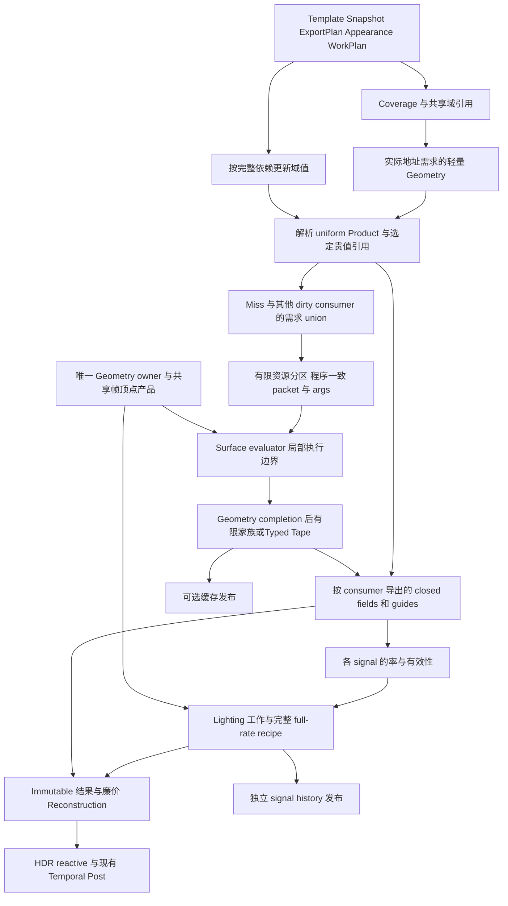

# EEngine 极致性能重建设计：按实际工作域执行 Surface

日期：2026-10-05。设计核对源码：11a7af962dd4eae54e900e31d28dc856d540d443。问题与历史计时基线：09449d6d98b33a89b200bd71d5faaf8140149779。

本文是唯一当前重建设计入口，修订 **SURFACE-2026-10-07-R3**。本次按用户要求重构目标与阶段职责：既避免旧 V3 的管理系统压倒计算，也避免所有昂贵 Appearance 被默认绑定到 visible-pixel-rate。R2 的有限家族、Typed Tape、频率更新、程序一致工作、局部 Geometry→Appearance 与窄输出保留为直接执行基础；它们不单独构成最终按域架构，也不以某次微测决定目标架构。

执行顺序仍为 **A0 → A1 → B1 → B2 → C → D → E → F**。B1/B2 接通 Appearance 工作域与真实减少重计算的生产链；C 扩展有收益的可选缓存与历史。按完整架构切换单元持续实现，接齐 producer/产品/全部直接 consumer 后集中检查，再进入下一单元。核心架构收口后才集中做表示细节和持续性能优化；开发中的编译修复和最小正确性调试不受禁止。本文定义目标与合同，执行文档维护当前事实和缺口；修订文档不代表源码已完成 R3。

[执行文档](../next-execution/eengine-extreme-performance-rebuild-execution-2026-10.md)定义切换任务与退出条件；[来源账本](../porting/next-renderer.md)保存固定源码、许可、阶段映射和未覆盖范围。两份审计是历史问题证据：[独立源码/GPU审计](../reviews/eengine-independent-source-gpu-performance-audit-2026-10-05.md)、[源码真值审计](../reviews/eengine-source-truth-audit-2026-10-05.md)。审计中的行号不能替代当前符号定位。

## 0. 目标、范围与决策状态

### 0.1 目标

EEngine 继续追求极致性能、现代 GPU-driven、WebGPU Native、AAA Rendering 和可持续扩展。首要运行目标是 GTX 1650 Ti、1080p 复杂场景。

具体工程目标是：

1. 命令拓扑由有限执行类别、真实全局同步和资源作用域决定；不按像素数、活跃 tile 数、cache 请求数或材质实例数复制整条命令链。
2. 贵 Appearance 的工作量由 closure 的更新频率、完整计算域、实际独立查询/footprint 与 miss/dirty 需求决定；不能无条件令所有贵 closure 每帧按 visible pixels 重算。高频、动态或不可共享区域允许全率，完整数学不会因一个域 ID 消失。
3. 分类、缓存和复用必须获得端到端净收益；关闭复用时仍有同一生产结构中的完整直接求值。
4. 保持完整身份、需求 union、唯一 writer、互斥写域、合法精度、错误与容量覆盖；不通过关闭效果、丢材质、截断证明或隐式降精度满足预算。
5. 让后续系统消费明确 GPU 产品，避免新增万能 scheduler、证明图或全局 SignalStore 协议。

同时降低**工作份数**与**每份工作的执行代价**。固定命令、coherent packets、Typed Tape、窄 SoA 主要改善组织和每份成本，不能冒充减少 Appearance samples。Sparse Lighting 不抵消已经执行的材质工作。输出覆盖、便宜组合及确需独立值的样本仍可随像素数线性增长；不承诺任意合法高频图都能次线性求值。

逻辑成本分解为：

    Tsurface = Tpublish/update + Tcoverage/address/plan
             + Σclosure (Theavy × Nactual-evaluations + Tread × Nconsumers)
             + Tsignal-plan/lighting + Treconstruct + Tmaintenance

`Nactual-evaluations` 不等于 domain 数、packet 数或 visible pixels 的别名。必须能解释贵值由谁生产、为什么需要这些独立值、多少消费者读取、失效时如何补做；不能只减少计数器。复用 OFF 仍保留合法 constant/uniform 提取，因为它们是计算频率语义，不是可随意关闭的缓存。

“恢复正常性能”本轮指消除已证明的数百毫秒管理热点，并测得可解释的 Surface 和整帧成本；没有预先承诺 FPS。目标质量、场景和时间预算必须在实现前声明，未测结果保持未完成。

### 0.2 本次范围

主切换对象是 SurfaceWorkRuntime、CellClassifier、Demand、Geometry 产品、Appearance 调度、Field/Signal Store、Reconstruction 与 Surface capacity/lifetime。直接影响它们的 FrameGraph、材质发布、纹理 binding、AO/Shadow/Temporal 接线随 producer 前移。

D/E/F 补齐现有 Geometry、Lighting/Shadow、Temporal/Post 的基础缺陷。未来 VG/VT/VSM/ReSTIR/SSGI/Atmosphere/高级 Temporal/AI 的输入扩展合同在 §21 声明；本次不先建设那些尚无现有消费者的完整效果。

### 0.3 决策分类

| 级别 | 本文内容 | 实现要求 |
|---|---|---|
| 必须保持 | 单 production path/submit、完整数学、身份、覆盖与生命周期 | 每切换单元检查 |
| 选定结构 | 有限执行族、共享发布域、薄几何、独立信号率、compact overlay＋完整 indexed 目的地 | 按执行计划实施 |
| 选定来源 profile | Forge 插值、Wicked 工作组织、Filament lifetime events、RTS scan 等 | 保留源阶段；差异登记 |
| 本地算法 | 现有 DAG 的有限族执行、Surface 需求发布、信号风险与混合写域、可选字段缓存 | 命名、独立参考、真实 GPU 和成本核查 |
| 单元内必须确定 | 工作域/依赖、真实 heavy demand、完整 fallback、binding/峰值容量/发布生命周期 | 架构切换时闭合；不以逐 patch benchmark 决策 |
| 架构后优化 | Q、scratch 放置、采样路由特化、primitive math 产品及具体 packet 宽度 | 完整架构成本定位后选定；不作为主执行次序 |
| 后续能力 | 新 world-query、ReSTIR、AI inference 等 | 接口预留不等于功能完成 |

### 0.4 R3 决策索引与阅读顺序

本轮授权是重构设计与执行文档，不自动表示 R3 源码已经切换。先读 §0/§3 的目标、§6.9 的 Appearance 工作域、§7 的完整数据流，再按执行文档 B1/B2 推进；物理表示细节服务这些边界。SD 是设计责任编号，S 是语义阶段，A0–F 才是执行切换单元，不增加并行的推进路线。

| ID | 选定决策 | 权威定义 | 执行落点 |
|---|---|---|---|
| SD01 | 模板、实例快照、执行/输出计划分离 | §6.1、§6.6 | B1 |
| SD02 | 普通家族及完整 General，原合法图不裁剪 | §6.2 | B1/B2 |
| SD03 | 类型/点域/闭包/word liveness与sinks | §6.3、§6.5–6.6 | B1/B2 |
| SD04 | 真实依赖频率与 GPU 更新事务 | §6.4、§6.9 | B1/B2 |
| SD05 | 有限命令、程序一致 work 与完整 indexed recipe | §6.7、§11.4 | B1/B2 |
| SD06 | 唯一按需 Geometry，hit 不重做其已满足的依赖 | §7–8 | B1/B2 |
| SD07 | consumer 决定 retained fields/guides | §12.4 | B1/B2 |
| SD08 | 六 RGB 信号/显式状态/独立率/原合成 | §9、§12.5、§14 | B2/E |
| SD09 | binding/完整目的地/各池失败/live-retired | §8.5、§11–12 | 每个切换单元 |
| SD10 | 架构先闭环、单元集中检查、整体后优化 | §18 | 每个切换单元 |
| SD11 | Appearance WorkPlan：更新级/便宜直读/贵域值/逐样本计算分流 | §6.9、§7、§10 | B1最小完整链，B2全面替换，C扩展 |

选定的是责任边界和数据语义，不强制新增 class/registry。必要物理布局在单元内设计并直接接通；不先逐个跑 Q/window/private-array 候选。具体字段字节与可选特化在架构完成后的成本分析中定案，不改变数学、支持范围与拓扑。R2/R1 的实验与 V01–V12 旧责任映射只在执行文档历史附录追溯，不再是当前任务列表。

## 1. 设计依据与历史证据

### 1.1 审计快照的旧生产链

以下定位来自设计起点源码快照 `11a7af962dd4eae54e900e31d28dc856d540d443` 与两份审计，只解释重建动机，不描述当前工作树。该快照中 FrameProgramLowering 调用 SurfaceWorkRuntime.addToGraph；后者将 consume 闭包传给 SurfaceCellClassifierPass，每个静态 batch 再建立 Demand → Geometry → Appearance → Field publish → Lighting → Signal publish → Reconstruction。

该历史快照包含：15 field＋6 signal plane，512 B 三角形 setup/memo，Field 32-word key/256 B entry，Signal 72-word key/352 B entry，128 B hot＋最大528 B cold GeometryRecord，以及按 unique Appearance program 编码命令。是否已经删除、替换或验证，只读执行文档的实际记录与当前源码；不能从下表推断退休文件仍在生产。

| 问题 | 历史定位 | 重建责任 |
|---|---|---|
| CPU 固定逐 batch 展开 | SurfaceCellClassifierPass.addToGraph、SurfaceWorkRuntime.consume | §7/§11 |
| retirementEnvelope 压制 steady scratch | SurfaceOptimizationCapacity.physicalFor/failures | §12 |
| plane 内树、归约与 prefix | surface_cell_classify、surface_cell_group_validation | §9 |
| lookup 前 heavy setup | SurfaceCellGeometrySetup、surface_cell_geometry_setup | §8 |
| 每 unique WGSL/product binding 一个命令 | GpuAppearancePublication.prepare/encodeSurfaceFields | §6 |
| 每 node 扫 resource registry | FrameGraph.executeCompiled | §13 |
| reconstruction 依赖旧 field/signal refs | SurfaceReconstructionPass、surface_reference_values | §10/§14 |
| AO 的实际消费者 | Reconstruction 逐 output pixel 消费 scalar AO；XeGTAO 从 depth 恢复自身 normal | §14/§16 |

Scene/资产 publication、GPU residency、真实 indirect、已有插值与 BRDF、FrameProgram 缓存、单提交及异步退休有保留价值。未进入生产帧的源码不计入本帧成本，文件行数不作为删除依据。

### 1.2 历史测量的使用边界

历史环境：NVIDIA Turing/系统 GTX1650Ti，Dungeon，1920×1080 internal/output，VSM 和 jitter 关闭，固定曝光；full profiling 组 29 个完成 GPU 样本，未控制温度/频率。这里只引用其问题定位，不将其视为本次重测。

| 指标 | 历史值 |
|---|---:|
| Surface GPU pass-sum P50/P95：far | 96.14 / 101.24 ms |
| Surface GPU pass-sum P50/P95：near | 785.19 / 815.05 ms |
| 整帧可执行 graph nodes / compute passes / dispatch | 2689 / 2382 / 2394 |
| 固定 batch / tiles per batch | 47 / 700 |
| near FieldLookup / Proof / Classifier / SignalLookup P50 | 169.54 / 146.15 / 178.52 / 108.00 ms |
| near Appearance / Lighting / Reconstruction P50 | 6.68 / 10.09 / 6.49 ms |
| near material lookup hit fraction | 2.24% |
| near GeometryRecord / visible pixels | 99.965% |
| 每帧 clear 命令 / 请求清理范围 | 489 / 283.47 MiB |
| CPU render profiling off（有 native wrappers） | 约40–41 ms |

管理类别分项 P50 之和708.71、Appearance/Lighting/Reconstruct之和23.26，只表达严重失衡的量级；分母没有包含全部真实 Geometry 工作。分项分位数不能代替逐帧求和再计算分位数。

CPU graph 时间不能从 GPU Surface 时间相减。admission fraction 不等于节省比例。clear 请求范围不等于实测显存带宽。VSM/有效 local lights 未在这组计时执行，不能用该结果证明其正确或解释这些 Surface 热点。完整 cache-off/recompute 反事实仍未建立。

### 1.3 两份审计的取舍

选用第二份实际命令/计时/容量结果纠正第一份静态估算：1080p 是700 tiles/47 batches，4K受到输出策略拒绝，不能把184 batches写成可运行实测；graph缓存已有，thrash需要另测；FG node不是GPU pass；FSR3 1:1仍承担temporal；atlas load/store不能直接换算总线字节。

pending allocator有Promise回调，删除数组元素保留排序，FSR3有真实reset入口。这些风险按完整生命周期核查，不直接登记确定泄漏。VSM pageConstants创建后无可达写入、point/spot shadow返回1以及camera-visible caster输入，则保留为具名源码缺口。

## 2. 来源优先与移植选择

先读完整 GitHub 源入口，再对照作者论文/详细说明。固定版本表示可复查来源，不表示本地已采用；完整阶段映射见来源账本的“Surface集中重建”条目。

| 编号 | 固定来源 / 许可 | 选定范围 | 本地阶段及差异 |
|---|---|---|---|
| SF01 | Wicked df44c3db4c4927492bc9c791eac715d98d7ed091 / MIT | analyze→resolve bins→indirect→masked shade | coverage、有限family工作、完整写域；Wave/Quad/bindless改为已协商WebGPU实现 |
| SF02 | Intel CPS 63ad5c1adafbfcc2869a200f50a5ea11f28b4887 / shader Apache-2.0 | GBuffer-first、rate2 coarse/full及完整补做 | Lighting调度原型；其判据不证明pre-material省计算；新增风险策略另名本地算法 |
| SF03 | Forge cd5046893faba2dc7869243873bf01f02a6f0df9 / Apache-2.0 | CalcFullBary、Interpolate*WithDeriv | 唯一Geometry数学；既有W=0/负W本地扩展单独核对，不改成clamp分母 |
| SF04 | Filament bb360e80259167c986e94db7b70153bcdb92c0e1 / Apache-2.0 | compile first/last→per-pass acquire/release→execute | FG生命周期事件；WebGPU资源退休和abort仍由本地owner处理 |
| SF05 | GPUPrefixSums 98d93a4e9ed2f3c8353119515bf9be90a2e137ad / MIT＋根notice | RTS reduce→spine_scan→downsweep，inclusive u32 scan | compact基础；该WGSL需要subgroups，exclusive/scatter/overflow/args是本地集成 |
| SF06 | OSS 473a59bbcdd30e3366cc567d66a5a97353620d48 / Apache-2.0 | occupancy→allocation/task→virtual sampling机制 | 选定贵closure缓存参考；不复制逐instance host、后验overflow、RT/Htex全工程 |
| SF07 | Filament同SF04 / Apache-2.0 | gltfio UbershaderProvider有限预构建material与实例参数 | 有限执行族的架构参考；不提供完整AppearanceGraph解释器 |
| SF08 | DOOM GPC2025 PDF / 技术参考 | rate/coverage→primaries、texturing compact、Lighting tile remap、immutable重建启示 | 没有完整可复制源码；surfaceID、per-pass SRI等未来建议不写已交付 |
| SF09 | Twinklebear webgpu-marching-cubes 1d550a3de65ef2f8c10a89069526c5d2b8b0413b / MIT | 无subgroup Blelloch block exclusive scan→block offsets→add offsets | portable scan数学来源；host chunk/private submit/readback不采用，有界多层发布是本地集成 |
| SF10 | [Cycles typed stack/compiler](https://github.com/blender/blender/blob/67807e1800cc48cc7bff3c793525e1179a4d64ca/intern/cycles/scene/svm.cpp)；67807e1800cc48cc7bff3c793525e1179a4d64ca / 所列Cycles文件Apache-2.0 | SVM完整node执行、连续float words、vector/query输出、last-user释放 | B1/B2 typed tape/liveness参考；不移植CUDA/private stack、不截溢出图，不机械搬CPU constant folding |
| SF11 | [Cycles GPU sorted work](https://github.com/blender/blender/blob/351e555acfd3be40d2702bf36cad50b02505d831/intern/cycles/kernel/device/gpu/parallel_sorted_index.h)；351e555acfd3be40d2702bf36cad50b02505d831 / 所列Cycles文件Apache-2.0 | shaderKey/partition→count/prefix/scatter→统一kernel | B1/B2程序一致工作参考；packet/run tail是本地责任，不搬host读counter/选择kernel调度 |
| SF12 | [FidelityFX ParallelSort](https://github.com/GPUOpen-Effects/FidelityFX-ParallelSort/blob/0c539948c8d196ae338d91efbc8ca495f1ea0d1d/ffx-parallelsort/FFX_ParallelSort.h)；0c539948c8d196ae338d91efbc8ca495f1ea0d1d / MIT | count/reduce/scan/scanadd/scatter完整radix链 | R2候选参考，32-bit key 8轮×5dispatch不是默认税；portable同步/zero/overflow须本地处理，未选为默认生产算法 |

DOOM冻结PDF SHA256为e5fe7cf223006bf95089eb2890c878a47aecccd612eb9e5398c1fe43273d0fad。其同UAV原地deblock race不采用；composite/fog后续撤掉VRCS说明变率必须逐信号评估。

无完整donor覆盖本地连续域、前置lookup、全部Appearance标量DAG、VG/VT身份、信号误差与无损overflow。具名本地组合称为 **EEngine Domain-Scheduled Surface**：名称表示本地责任，不提升任一upstream adoption。

沿用此前核读的固定实现与论文，来源范围不随文档修订自动扩大。SF10–SF12的具体函数、关键分支/降级、许可与目标产物映射见[来源账本R2条目](../porting/next-renderer.md#2026-10-06surface-r2来源核读与拟实施映射)。[Megakernels Considered Harmful（Laine/Karras/Aila，HPG 2013）](https://research.nvidia.com/publication/2013-07_megakernels-considered-harmful-wavefront-path-tracing-gpus)支持按任务相干性评估divergence/private占用的理由，但不证明本地GPU收益，也不否定Geometry→Appearance局部衔接。SF10的无导数SVM/255-word私有栈、SF11的path tracer host调度、SF12的Wave lane映射均不能直接成为WebGPU Surface实现。R2组合与CXY/uniform/sinks/packets/arena/RGB合同是具名本地方案；已核读来源不等于已实施或已采用。

便携scan优先选有明确多dispatch发布的算法。SF09提供无subgroup的完整block up/down sweep与offset数学；本地Bounded Tile Count Scan使用有限多级GPU发布，修正padding初始化并删除上游host等待/submit/readback。SF05的subgroup RTS作为协商特化；exclusive/scatter/overflow/args分别登记本地集成，不采用跨工作组自旋/look-back。

## 3. 架构不变量与成本合同

### 3.1 A：有限命令拓扑

Surface命令数由固定phase、material family、绑定资源profile、signal family决定：

    Dsurface <= Dfixed + Kresource * Kmaterial * Dmaterial + Ksignal * Dsignal
    Kmaterial/Kresource属于renderer能力profile；材质实例/graph数量不增加K。
    工作组数、shader内部实际求值量可以随真实需求增长。

命令账同时列graph nodes、compute/render passes、dispatch/draw、copy/clear、bind requests/native creates、upload calls/bytes。不能把千个dispatch塞进一个node就称解耦。

跨硬件limit必要分段必须有有限profile上界及完整结果覆盖；分段不得重新复制全部管理链。任意graph各自一个pipeline/dispatch不满足本约束，§6提供完整执行方案。

### 3.2 B：管理不得压倒计算

逐帧定义：

    Tmanage = coverage/domain work + bin/scan + rate selection + lookup/validity
            + admission/publication + reset/copy/scheduling归属
    Tevaluate = 所需Geometry + Appearance + Lighting + 正式求值产品
    Treconstruct与temporal/post单列，并计入端到端总成本。

非空代表workload要求Tmanage<=Tevaluate，且新增复用端到端成本优于关闭该复用。空帧/常量closure的分母接近零时同时报告绝对管理税、实际命令和字节，不能添加无用求值抬高分母。比率不可采样时标未验证，以零heavy lookup/proof等结构事实辅助，不填0ms。

A0/A1只核自身执行与测量范围；B1核切换closure，B2/C核全部Surface。局部范围通过不等于仍含旧链的整帧已经满足不变量。

### 3.3 C：复用可关闭

同一产品、算法数学、coverage与consumer；关闭可选缓存/空间复用/历史复用后，其需求变为完整直接求值，合法constant/uniform频率提取仍保留。无旧renderer、A/B运行桥、测试专用fallback或第二submit。

cache hit/off输出按精确合同对照；空间/temporal近似按已批准误差合同对照。关闭复用不得依赖旧Store/旧proof产品才能正确。

## 4. Ownership与五种实体

| 边界 | 权威产品 | 直接消费者 |
|---|---|---|
| Asset/Scene/Material publication | 完整描述、无歧义handle、版本、程序/路由、实际成本类别 | Surface address/work、Geometry、各provider |
| Geometry owner | source mapping、薄record、按需输入、几何guide | Appearance、Lighting、具名normal/roughness产品producer |
| Surface work | coverage、tile run、field/signal需求与实际queue、最终写域 | 各worker与Reconstruction |
| Appearance owner | 实际field值、常量/产品refs、guide、选定缓存value | Lighting与Compose |
| Lighting provider | 独立signal结果、需要时history与validity | Compose、对应denoiser |
| Frame runtime | bindings、lifetime events、encoder/submit/abort | 所有生产pass |
| TemporalFacts | 当前motion/identity/change事实 | 各history判定与最终upscaler |
| Reconstruction | signal插值、因子合成、HDR/reactive | Sky/Aerial、FSR、Post |

域、tile、sample、execution bin和cache address分开：域共享身份/地址规则；tile是局部处理与coverage单位；sample是实际求值点；bin用于执行一致性；cache address指向可复用值。

所有名称是责任边界，不要求新增同名类/registry。Renderer保留composition root，算法、预算和失效事实回到其实际owner。

## 5. 身份、域描述与发布

### 5.1 三种identity保持分离

| 身份 | 用途 | 组成与限制 |
|---|---|---|
| Winner identity | 精确恢复实际可见primitive/side | instance、representation、source meshlet/primitive、generation等原完整信息 |
| Sharing identity | 判合法共享候选范围 | 发布域、接缝、坐标域、LOD lineage、实际所需依赖；同winner可不共享，不同winner可合法共享 |
| Cache identity | 判断某field值是否可复用 | 完整closure/域描述及版本＋实际坐标/footprint/动态witness；hash只定位 |

CPU publication可以将完整不可变描述做精确intern，再发无歧义handle；intern需比较完整描述。handle复用前等待所有GPU引用退休，配deviceEpoch和generation。Temporal change hash不是cache equality。

### 5.2 共享描述与局部引用

DomainDirectory在publication维护静态语义；TileWork仅写coverage、domain/mixed模式、需求mask、有限exception范围。单一合法域可被全屏tile引用，不要求把所有tile工作压成一个GPU任务。

结构测试分开：
- 单实例、同一已发布域、无接缝的fixture：一个共享DomainDirectory条目；仍允许多个TileWork。
- 同域的高频纹理/normal/高光：允许全率samples；不能由一个domain条目推出一个值。
- 混合winner且不能共享：按实际局部runs或隐式full-rate处理，不生成21份leaf映射。

动态版本只更新真实依赖；camera运动不应清静态Appearance。representation/texture/instance变化仍需准确失效，发布与消费版本必须同一帧事务。

## 6. 材质编译与有限执行族

### 6.1 三种发布产品与程序身份（SD01）

程序模板、材质实例快照、执行/输出计划必须分开。既有 validated scalar IR 可以保留为语义输入；execution tape 是唯一 General VM 的 GPU 表示，不建立旧 evaluator adapter 或第二 renderer。

| 产品 | 必须包含 | 更新边界 |
|---|---|---|
| ProgramTemplate | 完整操作/采样拓扑、输入语义、类型/点域、参数地址布局、输出关系、full equality descriptor | 图结构或编译语义变化 |
| MaterialSnapshot | template 引用、实例参数、runtime inputs、resident/Product routes、资源与内容版本 | 参数/route/驻留或内容变化 |
| ExecutionPlan/ExportPlan | family、uniform/update plan、需求闭包、word liveness、Geometry needs、sinks、retained/temporary products、resource profile | 实际依赖或 consumer/layout 变化 |

相同程序模板可以有不同参数、texture identity 与 instance transforms。template interning 使用完整结构比较，不以 hash 决定相等；`templateIndex` 是 publication 内 dense 执行索引，跨 publication 引用另带 namespace/generation/deviceEpoch，不是 cache equality。MaterialSnapshot 数值更新不重编同一 PSO；改变实际 consumer 容量时仍须事务重建 ExportPlan，不能沿用旧 extent/stride。

`AppearanceProgramRegistry` 继续管理有限 PSO 家族的生命周期；程序模板数据不得再次以 unique graph WGSL 进入该 registry。是否拆分辅助函数/文件按职责决定，不增加全局 compiler scheduler。Surface 模块的命令合同与 Coverage/raster 等其他工作域分别核对，不把局部 finite-family 结果升级为整个 renderer 的命令证明。

### 6.2 有限普通家族与完整支持（SD02）

选定普通类别是 Publication-only、Unlit、Standard PBR（包含其完整 coat/normal/specular/IOR 特性），加完整 General VM。这里的类别不是每个 feature 的无条件笛卡尔积；受控资源 profile 与 Geometry source profile 仅按 device 能力形成有限组合。

普通家族由完整输出结构、操作顺序、输入/UV 与采样语义匹配，不按材质名、当前零值、instruction count 或 live slots 选择。不匹配的合法图完整进入 General VM，不退成默认材质。普通家族是固定数学函数和参数/route 数据，不解释任意 authored DAG；固定数量纹理角色的查询循环属于采样组织，不可偷换成逐 node VM。

全部当前合法 `AppearanceInstruction` 语义继续支持：constant/parameter/input/texture/product/normal-product，add/subtract/multiply/divide/min/max/pow、sin/cos/abs/sqrt、mix/clamp，以及 swizzle/combine scalarization 结果。保留 UV0/1/2、坐标子图与嵌套采样、原 C/X/Y footprint、sRGB RGB/linear alpha、sampler/wrap/mip/filter、normal/coat validity、有限值 guard 和 numeric residual。不能用资产拒绝、节点截断、近似坐标或隐式降精度退出 B1/B2。

SF07 Filament archive＋material instances 支持程序/参数分离的结构参考；`prepareConfig/constrainMaterial` 的删特性、UV限制与默认材质替换不采用。普通家族 matcher 与本地参数协议单独列来源映射，不宣称完整 Filament port。

### 6.3 类型、点域与真实临时宽度（SD03）

具名本地执行表示为 **Typed Appearance Execution Tape**。一次指令表示一个实际语义操作；能证明对应关系的 vector math、一次 texture query、一次 normal-moment decode 不再拆成多个完整 decode/求值循环。混合通道或不能安全合并的图保留 scalar 节点，语义支持范围不变。

每个 value descriptor 明确 `{valueType, widthWords, pointDomain, dependencyMask, storageClass}`；每个 instruction 明确完整 u32 operand/route 引用、所需 point domains、field closure 与 sinks。种类与地址分开编码，禁止 tag bits 截断原 u32 地址。scalar input/channel 不是 RGBA sample，C/X/Y 不是 RGB 分量，两种维度不得继续混在一个 vec4 slot 中。

| 值 | word 宽度/点域 | 含义 |
|---|---|---|
| scalar C | 1 | 一个中心 f32 |
| RGB C | 3 | 原 RGB 数学，非三个 sample points |
| UV C/X/Y | 2×3=6 | 三点原始坐标/footprint输入 |
| texture RGBA C | 4 | 一次原过滤查询的四个通道 |
| texture RGBA C/X/Y | 4×3=12 | 真正被嵌套 coordinate 消费的三次查询 |
| normal-moment decoded result | 按 direction/roughness/validity 实际消费定义 | 共用同一次数学解码，不能省掉 validity |

points 从完整需求闭包传播：只有真实 coordinate ancestors 或具名邻点 consumer 使用 C/X/Y。保留原像素有限差分，不能改用 chain-rule 近似、coarse 步长或额外 mip bias。一个 work item 执行 miss/dirty/guide/guard 的 union，共同节点按原 compiled sampling identity 共用；不同 sampler/transform/decode/footprint 的相同 texture 不合并。

物理基线是紧凑 **f32 word SoA**：`wordOffset * Q + lane`，instruction 整数记录和 value 宽度分开。仅真正 General VM 的 live words 决定 General temporary；普通家族与 uniform 阶段分别声明自己的 temporary，互斥阶段可以物理 alias，但不能各自声称零容量后实际共用不够大的缓冲。

    GenericTemporaryBytes = aligned(4 * Q * maximumLiveWords)
    SharedTemporaryBytes = max(互斥阶段各自需要的真实字节)

Q是本次dispatch全部并发evaluation contexts的上界，不能一边只分配Q份scratch、一边让多个workgroup各自复用同一组lane地址。global context index唯一拥有其word slice，处理完当前item才串行复用；packet/group映射与stride调度须保持这个所有权。workers对独立items/packets做strided loop；减少Q不截图、不丢work、不依赖其他workgroup完成，不得把近乎串行的正确执行当性能可行。alignment、最小合法binding、round-up、u32/乘法溢出创建前检查。

Cycles SF10 的 float/vector 槽和 semantic node 是参考，不照搬 private `float[255]`、栈超限后清空程序或 CUDA/local-memory 假设。当前 16-slot workgroup 窗口不是选定基线。任何 register/shared window 必须先有实际 liveness/occupancy/成本依据，并在能力与完整 tail 预算内选择；不能凭“私有数组”宣称寄存器驻留。

### 6.4 更新频率与 uniform 子图（SD04）

publication 对每个节点传播实际依赖，频率至少分为 publication constant、material-update uniform、frame uniform、sample-dependent。频率取完整祖先和资源依赖的并集；texture/Product、Geometry/footprint、view/nonlocal 的值不能因为当前画面稳定被当常量。资源查询也不能只因 opcode 是 texture 就永久定为 sample-dependent：若坐标、原 C/X/Y footprint、sampler/route 与所需资源版本全部在一个更新域一致，允许该域一次计算，资源变化触发更新。无法证明完整查询输入一致时保持原 sample-dependent 执行。

例如 `texture * sin(materialParameter)` 的 parameter-only 因子可在更新阶段生成，sample 部分保持原 footprint。不是仅提取“整个输出都常量”的 field：sample 输出内部的 uniform 子图也要分析。uniform result 通过明确的 value ref 供普通家族/General VM 读取，broadcast 不复制 Q 份。

需要保持 GPU 数学的 sin/pow/sqrt/mix 等在 GPU publication/update phase 使用相同操作顺序和精度；不以 JS double 结果替代。literal 编解码和可证等价的纯数据工作可在 CPU 做。禁止未经证明的 `x*0`、`x/x`、重排乘法/加法、CPU transcendental folding 或算完再 bake texture；`f(filter(T))` 与 `filter(f(T))` 一般不等价。

更新事务：program/material/resource 依赖变化 → 产生对应 dirty uniform ranges → 原 frame encoder 内执行 update → 按合法 dispatch 顺序发布该版本 → S5 消费匹配版本。submit/abort 决定何时提交版本，device loss 不发布成功状态。frame uniform 每个必要 frame 更新，material uniform 不因无关 camera motion 重算，texture/content/residency/representation 的真实失效不得遗漏。不存在本帧 visible/work readback 或独立 frame submit。

### 6.5 输出 sinks 与存活释放（SD03/SD07）

ExportPlan 为每个 output/guide/guard 列出内部和外部 consumer。目标字段可能是 retained plane、publication uniform ref、producer-local guide input 或只供数值 guard 的局部值，不由“作者声明了25个通道”推导25个逐像素 plane。

root 的 final use 是最后内部 consumer 和对应 sink 都完成的时点，不统一延长到整张 tape 结束。RGB/normal 需要完整 tuple 的 sink 等全部组件就绪后消费；对 shared sample/CXY、后续嵌套 coordinate 的引用继续保持存活。只有所有相关 consumer 完成才复用地址，destination 不能在读完全部 operands 前覆盖它们。

retained field sink 必须由唯一 producer 写实际声明范围；Geometry guide 与 numeric guard 在原始 TS normal/IOR/specular/coat 等输入仍可用时完成。完整 guard 不可因后续不保存字段而删输入。结束时发布 closed products/producedMask，热 consumer 不重做 guard/decode。死输出只在确认没有当前 consumer 后删除；full-graph 数值组件仍覆盖完整原输出，不能把 closure 测试改成只验导出的几个字段。

### 6.6 执行数据与资源协议（SD01/SD03/SD09）

ProgramTemplate 的 immutable tape、MaterialSnapshot 的 mutable ranges 与 GPU uniform results 有明确 owner、访问类型及版本。物理合并允许，但单个 dispatch 不能把同一 whole buffer 同时用作不兼容 read-only/storage alias；capacity 和 lifecycle 也不能因为合并而遗漏。新引用格式迁移 publication、worker、constant/update evaluator、全部 shader accessors、binding/reset、CPU/GPU oracle，不能只换 pixel evaluator。

product route 保留原格式、f32/half texel数学、mips、filter、wrap、域范围与版本；asset identity 只为数据，不能每 asset 一个新 binding/PSO。Coverage/alpha 仍使用其原正确数学并同步 parameter/route consumer，不能因材质发布拆分而得到陈旧参数。完整资产无法容纳时事务明确失败并保留上一合法 publication；由此产生的原支持资产回归仍是未解决项，不是成功的能力裁剪。

### 6.7 程序一致工作与固定命令（SD05）

execution family/resource bin 只解决命令类别，不证明同一 warp/workgroup 执行一致。General work 保留 original target、material snapshot、templateIndex、实际 need masks 和 frame version；同 template 的不同实例可以有不同数值和 routes。

选定正确基线是 GPU 按 publication 的 dense template index 组织 Generic work：count → 有界 prefix/offset → scatter indices → bucket runs → packet/indirect args。资源 profile 在原有限外层分区，shader 不为每个 program dispatch。每 packet 只引用同 template 的一个连续 run，尾部 mask 明确；点域来自该 template，lane-specific miss masks 保持完整，不能声称所有 conditional 都自动一致。

已有一致工作或单 template 可直接形成 packet；不对普通 PBR/常量默认做全屏排序。组织开关影响工作表示，不影响输出或唯一 producer；选定策略来自 publication 与已测 workload class，不建立 per-tile 成本预测器。若 prefix/scatter 不值得其管理税，可在同 worker 使用完整 indexed recipe，但必须显式记录 coherence 未获收益/未通过的范围，不能用永久混合执行抹掉多图成本门。

indexed fallback可能在同workgroup内混合template，因此基线word SoA执行不依赖跨lane operation同步或共享指令窗口。需要workgroup barrier/shared window的优化只能进入已证明同template且uniform控制流的packet分支；不能在mixed fallback中按各lane的不同tape长度执行barrier。尾lane仍遵循该分支的同步合同，valid mask只控制实际读写。

Cycles SF11 的 shader count/prefix/scatter 提供组织来源。其完整 host wavefront 的 queue readback 和 CPU kernel choice 不采用。FidelityFX SF12 radix-sort 是后续候选，不是默认必跑40个 dispatch 的全屏税；若选它，记录完整 key/payload、八轮全部阶段、WGSL portable/subgroup差异、零输入和容量恢复。不得只排裁剪后的低位 key。

program 数量只改变数据量、GPU counts、workgroups 和 shader 工作长度；scan层数的拓扑上限由协商 capability profile 决定，不随 active program/run 数复制命令。程序模板/实例/partial extent 缩放的 actual native dispatch/copy/clear 账必须成立，graph node 数不是替代证据。

### 6.8 执行基础与表示选择边界（SD10）

| 方案 | 决策与依据 |
|---|---|
| 现有 scalar vec4 VM 上持续加窗口/调Q | 不作为目标；未解决类型/点域、uniform work、coherence和跨阶段存活 |
| 每 graph 生成 native PSO/dispatch | 不采用；实例/图增长带来命令类别或source/compile增长 |
| 拼接全场景 giant shader | 不采用默认路径；代码规模、编译等待、更新事务与最坏寄存器压力随scene增长 |
| 有限普通家族＋Typed Tape＋程序一致work＋局部completion/按consumer保留 | 保留为完整直接执行基础；与§6.9工作域/更新/值引用组成R3，单独不证明贵工作已减少 |

直接执行必须完整、组织有界且其成本可解释；不要求任意复杂图在每个像素独立求值时都达到普通 PBR 的帧时。直接参考也贵时，先审查真实独立需求及可合法前移的工作；参考便宜而本地执行贵时，审查实现表示。两者均可能存在。完整架构单元收口前不串行尝试窗口、private scratch、sampler特化和primitive math来追微小毫秒；具体优化依§18进行。

### 6.9 Appearance 工作域与 WorkPlan（SD11）

WorkPlan 是现有 publication/execution plan 的逻辑产品，不强制新增协调器。它对每个实际 closure/共享子图声明：完整依赖、更新频率、计算域、值/采样语义、consumer、成本类别、执行表示、失效条件、容量与完整直接降级。family/template 决定如何执行，工作域决定执行几份，两者分开。

| 类别 | 真实 producer 与工作数量 | consumer 与降级 |
|---|---|---|
| 更新级值 | publication/material/frame producer，按 dirty 域计算；包含可证明输入完全一致的资源查询 | 匹配版本值引用/broadcast；未知依赖转实际 sample-dependent，不把 texture content 当常量 |
| 便宜逐样本值 | 当前直接 texture/Product accessor 或便宜算术，按必要覆盖点执行 | 局部Appearance/合成；不默认进入hash、proof或逐值缓存 |
| 贵稳定域值 | 现有语义已规定的静态Product，或完整地址/依赖相等的域值生产；按dirty域/实际unique miss执行 | 先解析已有效值再compact miss；不能把同domain/同material当值相等 |
| 贵逐样本值 | 高频、视向、非线性坐标或不能证明共享的closure，按实际独立sample及原footprint执行 | fixed/完整General；缓存不适用仍完整支持，并单列必要查询/算术与额外执行税 |

成本类别来自真实操作、查询、更新与消费特征，是发布时选择依据；不为每tile建立昂贵成本预测系统。没有实测时记录不确定性，不自动给所有合法图套cache。一个closure内部可拆出更新级子图，共同查询和数学在同实际输入/采样身份下只生成一次；不以field名字重复计算共享祖先。

`ValueWork`、`ValueRef`、`SampleMap` 是逻辑产品：分别表达完整实际计算需求、已发布匹配版本的值、原输出目标到合法值/采样结果的映射。每个生产边界声明是否为uniform、直接indexed、Product或selected miss；不先固定通用大record。相同key的unique work在结果发布前确定唯一writer。不同field可以有不同域/率；consumer通过同一读取合同取值，不能因为减少heavy work又在consumer重新跑closure。

新增产品纳入既有publication/Geometry/Surface owner和FrameGraph版本依赖。更新域value以真实update→consumer边界发布，sample值以work→result边界发布，submit/abort与retire分别管理；完整Graph依赖不能因物理合并丢失。WorkPlan/refs/maps/请求与payload优先利用现有metadata/control/temporary/Product/closed regions的读取合同，Product Surface仍须满足9+7=16 storage profile；不能额外添加第17个binding或把同一whole buffer同时绑定为不兼容read-only/storage alias。新增存储连同immutable/mutable区、alignment、dirty范围及live/retired重新计账，原R2容量算术不证明新布局已经适配设备。

必须分开三个计数：covered targets、actual heavy evaluations、value reads。constant/uniform不分配P份昂贵结果；sample map或必要guide可以是O(P)轻量工作。程序排序只重排原work不减少求值，域intern只减少描述不证明少算。完整UV/footprint在每pixel不同的exact cache可能全部miss，不能靠key压缩制造共享。

B1必须接通至少一个普通合法、确有贵工作减少的端到端工作域。例如坐标/原CXY footprint/资源版本全部uniform的昂贵查询子图，在更新域执行一次，原像素consumer读取匹配结果；同帧仍按dirty Lighting需求生成必要Geometry。B2扩展到全部当前closure的分类/请求/读取合同。C扩展其他有收益的跨帧/空间cache与history，不负责首次建设这个核心边界。未覆盖的合法closure保持直接worker，不建立第二renderer。

该成功用例只证明机制，不证明Showcase的主要贵texture工作已经减少。单元范围必须列当前场景各类别的实际占比/依赖/独立查询规模；若主要closure的精确输入均不同，报告仍需全率的范围和必要成本，不能用人为常量fixture声称普遍亚像素计算或最终性能已达成。扩大空间域采样是单独质量/算法决策，不隐含在本修订中。

静态Product的过滤是原产品合同。不能把任意材质图逐texel bake后声称精确等价：`f(filter(T))`与`filter(f(T))`一般不同；复用条件包含完整坐标、footprint、sampler/LOD/资源版本/动态输入。引入近似域采样必须先定义重建、误差、接缝与失效，并取得质量范围认可；本修订不批准额外mip bias、低分辨率材质、clamp或half量化。

沿用SF03/07/10/11/06的既有固定来源作为数学、执行与域值参考，R3的WorkPlan/资源依赖频率/需求合并是具名本地设计，本轮没有新增完整donor核读或采用声明。实施完整算法前按§2及根AGENTS重新核固定源阶段与本地映射；现有adoption不转授新产品。选定合同后一次实现完整producer→consumer，再集中核正确性、真实工作量和全成本。

## 7. 新生产数据流与阶段

下列S编号是semantic phases，不要求一个phase对应一个GPU pass，也不预设固定ABI字节。CPU只编码有限拓扑；实际数量由GPU产品发布。

| phase | 输入 | 输出 | 主要写owner |
|---|---|---|---|
| S0 publish/reset | Template/Snapshot/ExportPlan/WorkPlan、资源dirty、frame/history roles | 匹配版本更新级值、Product引用、帧bindings、少量reset | publication/runtime |
| S1 coverage/work | Visibility、extent、published identity | coverage/active tiles、uniform/mixed引用 | Surface work |
| S2 address geometry | 真实lookup依赖、winner、source/resident/frame geometry | 最小address/mapping、实际lookup请求 | Geometry owner |
| S3 value resolve | WorkPlan、uniform/Product/选定cache地址与完整版本 | immutable value refs、真实miss/dirty字段需求；便宜值直读 | Appearance owner |
| S4 demand/bin/args | misses、dirtylighting、必要guides | Geometry union、有限family与同template packets、完整indexed模式、间接参数 | Surface work |
| S5 Geometry→Appearance | 唯一需求union、frame/resident输入、匹配uniform版本、完整tape | 局部completion→Appearance→sinks，导出closed Geometry/实际fields/guides | 唯一Geometry后Appearance |
| S6 rate/signal work | 已发布guide、共享域、provider facts | 独立signal sample plan、完整异常recipe | Surface work/provider |
| S7 Lighting | 唯一GeometryRecord、fields、cluster/shadow/IBL | signal结果或full-rate最终radiance贡献 | Lighting provider |
| S8 optional publish | 明确eligible value和唯一writer | 下帧可用cache/history | 对应owner |
| S9 reconstruct/compose | immutable结果、pixel factors、AO、TemporalFacts | HDR/reactive、完整covered/background写域 | Reconstruction |

S5对真实miss/sample-dependent工作在同一Surface evaluator内由Geometry owner先完成实际输入，Appearance读取局部record，再运行ExportPlan sinks。只有实际跨phase consumer需要的产品才发布。默认全屏UV/color中间池退役；S0/S4仍是合法全局发布边界，S7/S9保持分离。Appearance不从Visibility另恢复三角形，S7不补写Geometry，S9不调用完整插值、材质或PBR。无法通过§8.5绑定/存活门时返回表示设计，不私下恢复分离中间池作为最终路径。

全率与稀疏采用同一worker数学及结果接口。完整full-rate indexed recipe是工作表示和写域模式，不是旧renderer。低覆盖/空队列至多承担固定小量reset/finalize命令。

## 8. 唯一Geometry产品与lookup前置

### 8.1 lookup前只生产实际需要的轻量信息

address需求来自field cache class：纯publication不需geometry；实例域只需权威handle/版本；真正依赖UV/footprint才请求对应projection/UV mapping。禁止先decode position/normal/tangent/所有UV/color，再称lookup省掉geometry。

source/resident/frame products已有属性时复用其owner产品，避免第三份decode authority。primitive mapping只为实际需要的primitive形成；是否缓存mapping取决于净收益。

### 8.2 需求union

    GeometryDemand = union(
      missingAppearance.dependencies,
      dirtyLighting.dependencies,
      requiredGuides.dependencies,
      numericResidual.dependencies
    )

每个field hit只移除它自己的miss dependencies。其他dirty consumer仍可请求同一record；numeric-only miss可以无需record。语义bit与物理alias保持分离，同物理position/normal/tangent需求只生产一次。

若rate依赖Guide后才出现新需求，只有同一Geometry owner完成missing mask；已产生输入不重写。frame-local状态含producedMask/requiredMask与明确发布点，不增加独立失效owner。

### 8.3 薄记录与局部cold

保留完整f32数学，先减少无消费者字段与填充，再选择布局。hot不再一律128 B；position、几何normal、shading normal、tangent/sign、depth等按实际consumer保留。view若可由已发布position与同一camera数学廉价派生，由Geometry读取接口给出；消费者不能再decode源顶点。

C/X/Y冷输入优先在Geometry→Appearance相邻求值中局部存活，具有后续consumer的输入才写frame cold pool。跨kernel记录按实际字段宽度SoA/分段，typed view能还原原语义；改变float精度需独立质量依据和用户认可。

写域：
- 一work item拥有其record；
- 后置completion只写未发布字段；
- cold append先完成容量预留，再写，下一dispatch发布；
- collision/容量失败由同一Geometry数学完成直接工作，不读未完成slot。

B1/B2必须证明最坏需求有完整路径；不能仅凭tinyfixture拥有几个record就判布局可行。

### 8.4 Primitive setup、逐点需求与私有存活期

唯一 Geometry owner 内区分 PrimitiveSetup（三角形源引用、变换和 Winner 系数）与 GeometrySample（实际 center/neighbor 属性）；不是增加第二条 Geometry authority。centerNeeds 与 neighborNeeds 分开，UV footprint 不触发没有邻点 consumer 的 normal/tangent/position/view。Generic 真正使用这些邻点语义时仍完整生成，保留当前 Winner 有限像素差分，不换成近似导数。

先消除 producer-private 无消费者字段和过长存活；禁止同时持有最大 corners、完整三份 GeometryPoint 和完整 DAG 临时数组。局部completion→Appearance保持绑定、存活和consumer合同，完整单元连通后集中核数学/容量/成本。此前融合/分离实验只作历史诊断，不因旧融合慢就恢复全屏UV池，也不因取消写出就宣称一定快。

setup共享不是默认架构层；首先复用已有共享顶点产品。uniform primitive的工作组setup、跨group dictionary只有净节省大于build/lookup/bytes与occupancy成本时才选；microtriangle/mixed tile和池耗尽仍用同一数学直接完成。不全帧自旋、不恢复旧proof/协调链。The Forge/DAIS只提供数学与局部插值/采样组织参考，本地需求和调度不是完整上游port。

当前帧已生成的共享顶点产品应供 Surface 消费，避免每个像素再次应用同一 instance 的 world/normal transform。对象属性供 Coverage 使用，world normal/tangent/position 供唯一 Geometry completion 使用；不可改变透视系数、正交化、镜像 tangent sign、facing 或退化处理。两种空间的属性不能混读。产品容量由实际 stride、owner 累计 live/retired 和 negotiated limit 决定，源目录只发布完整准备好的 meshlet；容量不足时由同一 Geometry owner 读取 resident 输入完成，不能漏样本。跨 owner 的完整 FrameGeometry 工作域仍按 D 推进，必要生产/消费接线随 B 前移。

Q、f32 word地址、point domain与普通家族临时空间按§6.3协商，不能继续把`liveSlots`含糊当vec4数/float数。实际源Geometry输入先于需要它的tape节点生成，可在同一owner内部缓存已完成语义；不同通道读取同一semantic不能重复完整setup。完整Generic与相同输入、相同C/X/Y需求的隔离直接参考比较，参考不进入生产。

#### 8.4.1 Primitive setup 的优化边界

逐sample重复数学可在整体成本分析后用既有Geometry owner的per-primitive产品减少；这属于每份工作成本优化，不替代Appearance工作域与真实需求。既有Triangle Math/private scratch/sampler候选及结果只在执行计划附录H.4追溯，不再作为当前B1主任务。产品必须保留零负W/近裁剪/退化/facing、partial/zero完整local数学、binding/attribute容量损失与live/retired账；不恢复旧Winner dictionary/hash/自旋或第二submit。核心链未闭合时不围绕它逐候选微调。

### 8.5 融合前的 binding 与 arena 可行性（SD06/SD09）

融合不能仅拼WGSL。当前Product源读取需要meshlet work、Geometry arena/source、resident vertex payload、instances、Product metadata及4个banks，共9个storage inputs；再加code、material metadata、Q temporary、closed heap、2个Appearance Product banks和control为7个，合计16。独立frame attributes会变17，不能靠更高limit或删Product reader通过首要device profile。

选定接线是由既有Geometry arena-backed读取接口提供共享frame attributes：attributes region及directory addressing归入同一Geometry owner的arena容量/发布合同，Surface不额外增加storage binding。Coverage/raster、Surface、FrameProgram bindings和debug直接读者同时迁移。普通家族查询临时值借原temporary binding，不能在融合后再加一个fixed-input或sample-cache绑定。照此Product worker可保持9+7=16；uniforms、texture/sampler数量、group内binding数和minimum binding size仍分别preflight。

arena的prefix metadata、mandatory directories/control与optional prepared vertices一起计账，不能无条件把两份最大buffer拼接。vertex region实际stride、clip/triangle空间及每binding limit决定准备容量；只发布完整准备好的meshlet。缓存覆盖不足走同一Geometry owner的原resident精确completion，不拒可见工作、不重建第二owner。mandatory metadata/目的地本身放不下则在prepare前明确失败并保持事务，不把optional fallback当capacity证明。

绑定闭环先于shader性能原型：普通/Product、完整缓存/partial/zero prepared capacity都经过真实producer→Coverage/Surface consumers；检查对象/世界属性空间、镜像tangent、normal matrix、generation、filtered/original directory与frame offset。合并资源后仍按whole-buffer usage rules与queue fence管理，不能两个owner重复account/destroy同一arena。

## 9. 分信号采样与共享合法性

### 9.1 率合同

每个signal独立记录coverage、sample locations、footprint、rate、结果语义、error profile和history validity。material地址共享、Lighting率和最终output像素率分开。

常量field由publication直接给值；普通便宜纹理保持完整正确采样；贵closure的空间重用只在有可核过滤/variation合同的地址域内发生。不能以相同material ID推广非线性过滤等价。

Lighting分类在实际guide可用之后执行。由共同覆盖/合法域/normal与provider事实一次生成相关风险，不再逐15/6plane重建共同树。

### 9.2 初版可交付的成功范围

先交付有独立依据的常量publication共享、合法稳定field命中、平滑diffuse/irradiance的局部coarse成功及局部拒绝。高频normal、低roughness specular/coat、细几何、新显露、接缝/LOD变化各自提高相关率。

“原Intel CPS profile”只用于原公式/常量/数据阶段的对照。EEngine生产使用具名本地 **Signal Footprint Admission**：加入真实identity、normal/coat差异、roughness/view/light/shadow风险，不宣称是原CPS完整port。缺充分事实时只有依赖该事实的区域/信号直接求值；普通合法低频成功必须在B2/C被证明。

判定应使用：
- coverage/side/domain兼容与当前frame有效版本；
- field/normal/roughness guide的实际variation或有依据的envelope；
- cluster/light集合及receiver范围；
- shadow/content变化与硬边界；
- specular/coat对half-vector、法线和视向的敏感性；
- source footprint、材质非线性与LOD/texture residency变化；
- 历史confidence仅作为temporal输入，不能单独证明当前空间平滑。

shadow范围证明暂缺时，可以直接求值相关direct signal；必须补合法成功分支，不能以永久拒绝shadow/所有未知材质当最终状态。

### 9.3 footprint与误差

中心值、空间过滤、梯度、源mip、normal filtering以及最终upscale分别有合同。不得用粗率步长隐式改变原textureGrad、额外mip bias、随意clamp或将normalTS当颜色插值。

定义signal-specific误差指标：linear HDR绝对/相对差、normal角差、direct/specular/coat独立差、edge coverage、temporal闪烁/ghosting与newly-visible恢复。数值阈值从独立reference/现有预算得出；需要改变原质量范围时先取得用户认可，不在本文虚构一组已批准常量。

空间变率、signal history、FSR共同计算有效footprint和累计质量风险，不能三处各自放宽后把误差交给TAA隐藏。

## 10. Field缓存与signal history

### 10.1 publication决定策略

每closure发布exact constant/direct source/static product/dynamic cache/per-target类别及dependency recipe。cost class来自实际指令、采样和更新profile，未测cheap-value不进入重协议。

field cache只覆盖明确昂贵且可重复消费的值；lookup在material miss compact之前。完整不可变closure/domain描述由handle引用，动态witness按实际依赖保存；不同cache class可以有不同宽度。若缩短地址需要遗漏依赖，选择直接求值。

### 10.2 读写与失效事务

hash定位后比较完整identity/witness；frame hit refs不可在消费中被evict。候选地址去重后唯一producer发布一次；其结果被多个consumer读取。lookup、nomination、publish如果不能得到净收益，就退出该closure的cache策略。

content/sampler/material/geometry/LOD/instance/device各自有权威版本。共享slot复用等待generation与pin/retire完成；未提交帧写入不成为下帧hit。弱CAS失败、hash满、admission满都转为实际求值，完整radiance需求不被cache队列截断。

禁止跨workgroup用一个state atomic当多word payload发布屏障；写payload与consume/commit经合法dispatch顺序，必要state只描述已发布事务。

### 10.3 SignalStore替换

72-word通用SignalStore不再是所有Lighting的默认路径。需要历史的signal采用自己的screen/object/provider domain、reprojection、normal/depth/identity与light/shadow版本判定。direct/specular/coat/irradiance不共用一个“material相同即可复用”的规则。

B2接齐当前signal消费合同，C扩展合法历史更新；history无效直接求值。cache/history关闭后仍完整生产同语义结果。未来reservoir/denoiser各自拥有算法状态，不强行映射到这套history。

## 11. Compact工作、完整异常与发布边界

### 11.1 统一覆盖分区

输出covered pixels = sparse-covered集合 ∪ indexed-full-rate集合，两者不相交。背景是第三个互斥集合。每个signal/field的最终计划在正式work发布边界确定，其consumer不重复遍历旧proof或decode同一identity。

TileWork使用uniform/mixed/implicit-full-rate模式。sparse descriptor按tile整项预留，成功才提交sample映射；失败整个所属写域切indexed full-rate，已预留未commit内容不可被消费。执行类别bin可扫描小tile header或消费compact tiles，但不能每family逐像素探测所有材质。

### 11.2 各种耗尽必须分别处理

| 耗尽对象 | 正确处理 | 禁止 |
|---|---|---|
| domain/mixed descriptor | 该tile使用完整indexed recipe | 丢mixed lane、截run |
| sparse sample queue/map | 预发布前改该信号full-rate，保证唯一写域 | 部分sample留下未覆盖像素 |
| optional field cache/request | miss direct compute；不取消output需求 | cache queue overflow等同工作完成 |
| Geometry cold scratch | 降低并发Q或局部record直接消费；同owner完整数学 | 让Appearance/reconstruct另恢复几何 |
| retained field/signal destination | extent/publication预检保证完整上限；合法pool或直接正式producer输出 | 将metadata fallback当作目的地存在证明 |
| history pool | 当前frame direct compute，必要guide仍写 | 将陈旧结果当合法 |
| 数量/u32溢出 | checked arithmetic在preflight/发布点拒绝非法产品并保留上一合法事务 | wrap为小count继续写 |

目的地必须在编码前满足完整frame需求，GPU不能临时createBuffer。exact full-rate并不免费：thin Geometry和窄field的最坏物理量、绑定数及效果输入全部进入§12。

full-rate直接radiance可以由正式Lighting producer融合因子合成后写最终贡献；Reconstruction只消费其结果。只有实际layout和register/private存储通过后才采用融合；不能假定一个巨kernel能绑定所有source/material/light资源。

### 11.3 queue与scan

局部workgroup聚合counts，少量原子reserve实际连续范围；必要全局prefix用reduce→spine scan→scatter/args发布。scan和队列采用有界整数范围，明确空队列、padding、exclusive转换、完整tilecommit和失败。

无subgroup正确基线与subgroup特化输出完全一致。GPU indirect args由finalize发布到独立arguments buffer；下一dispatch不将该buffer同时作为writable storage与INDIRECT。若直接写STORAGE|INDIRECT缓冲，通过绑定集排除写alias可免copy，但需要真实usage验证。

GPU workgroup strided loop处理互不依赖items，允许；等待其他workgroup或假定“最后一个group”完成全局发布，不允许。

### 11.4 程序 bucket、packet 与 indexed 写域（SD05/SD09）

直接执行基础对Generic实际work索引做count/prefix/scatter，数据桶数为publication内template数乘有限resource partitions，不乘所有可能miss masks。GPU构建run与packet，`sum(ceil(runLength / packetWidth)) <= actualWorkCount`（空输入另分支）；program数量增长允许数据/运算增长，不增加逐program dispatch。lane-specific needs保留为完整数据，future C的partial hit不得为了coherence重做已hit字段。

count、scan offsets、scatter cursors、indices、packets、args都有声明capacity和u32上界。先计完整union work，每covered target只有一个最终Appearance writer；原空间坐标通过index payload保留。scatter写入与consume经独立合法dispatch发布；不能在同dispatch由lane0 reset全局counter和其他group并发append。

组织优化可选空间在生产前全部或按明确partition受理；不足时该partition完整indexed枚举，不让packet与indexed写同一目标。原始work存在是完整fallback的前提，不先截原队列再称fallback完整。GPU count超mandatory上限是错误事务，非静默min截断。zero-input、尾部packet、partial bank、single-template、mixed templates与最大声明数量都要有结果断言。

## 12. 物理布局、容量与峰值内存

### 12.1 账本与分配责任

每个产品声明stride、active count、reserved capacity、GPU writes、reset范围、alignment、owner、consumer、lifetime及overflow。分配上限与实际写量分别报告。

    PeakLive = mandatory outputs + required retained inputs
             + bounded work/temporary pools + selected reuse/history
             + uploads + unavoidable in-flight/resize retirement
    DeviceBindingLimit逐buffer检查；OwnerBudget和GlobalPressure分别检查。

不要将父arena与其子range重复相加，不将budget ceiling写成live allocation；destroy后的pending retirement独立追踪。retirement不能永远按2×steady scratch限制每批。

### 12.2 可核算的表示算术

以下是1920×1080的布局对照，不是选定ABI或实测流量：

| 表示 | 全屏容量算术 |
|---|---:|
| tile数/64 B tile header | 32400 / 约1.98 MiB |
| 一个u32/pixel | 约7.91 MiB |
| 现有15个vec4 field slots | 240 B/pixel，约474.61 MiB |
| 当前15 fields的真实25个f32通道 | 100 B/pixel，约197.75 MiB |
| 现有Geometry hot＋最大cold | 656 B/pixel，约1297.27 MiB |
| 一个rgba16float全屏output | 约15.82 MiB |

选择窄通道、常量省槽和按需求保留能改变表示；“compact”本身不减少已保留capacity。将所有656 B records扩大到全屏不采用。

完整直接求值采用：薄retained Geometry/guide、实际宽度field planes、局部C/X/Y record、直接/稀疏signal组合。已经在publication提供的constant不占逐pixel槽；同语义物理alias不另分配。字段布局按consumer而非固定15×vec4；不以float16压缩当默认收益。

### 12.3 preflight与工作集调度

preflight输入为extent、ExportPlan的完整field/guide要求、family/routes、最大live f32 words与各阶段temporary、program/work组织空间、provider需要、buffer/texture/workgroup limits和帧并发。输出包括完整indexed目的地、optional容量、Q、stage bindings、steady/resize峰值。名称不允许混用float字数与vec4槽数。

分配策略：
1. 先保留完整output/必要guide/直接求值目的地；
2. 给Geometry/Appearance临时工作选择bounded Q；
3. 为实际稀疏工作分配optional overlay；
4. 余量再分配能获得收益的cache/history；
5. resize先检查overlap，推迟publication或减少in-flight，必要时明确unsupported extent；不悄悄降分辨率。

更大binding limit不能替代整体VRAM账。generic DAG长导致Q减少时shader计算可能增加，必须测最坏帧；不能用合法但近乎串行的执行宣称正常性能。

### 12.4 Consumer 存活分析与信号物理表示

完整材质值首先在 producer 局部供 numeric guard/guide 消费；只有实际后续 Lighting、Reconstruct、history/cache 读取的字段才保留窄 planes。TS normal/临时切线只用于生成最终 guide 时不跨 kernel 保留，view fallback 等真实语义必须保留等价输入，不能仅为缩 stride 删掉。常量来自 publication，不占逐 pixel plane。

六种信号的独立语义不要求六份永久全屏 vec4：full-rate贡献、可共享transport/irradiance、可复用history分别声明 consumer、sample rate、format、lifetime。合并贡献须保留 AO作用域、radiance/transport、coat attenuation、finite fallback与原合成顺序；不得把 PBR 移到 Reconstruct。没有这些等价证据前保留原精度与必要产品，不能凭容量较小宣称带宽收益。

preflight 基于最终 consumers、actual varying fields、guide需求与 signal representation；active、reserved、GPU reads/writes、retired overlap分别记录。f16/normal压缩不属于本次默认优化。新增资源不能让 binding 数随资产增长，必须在原有 capability profile 内协商。

ExportPlan必须逐项记录`semantic/space/precision/pointDomain/updateFrequency/consumers/storageClass/writer/producedVersion/lastUse`。用可核对的表作为产品合同，不假定新增同名class。如下是当前直接consumer责任，具体offset只在选定layout后定义：

| 产品 | producer/sink | consumer与必须保留的语义 | 生命周期 |
|---|---|---|---|
| Winner/coverage/depth/motion/facts | 原Visibility/Geometry/TemporalFacts权威 | Coverage、Surface地址、Temporal/Reconstruct；完整identity/side/version | 原工作域要求，全率事实不随复用率改变 |
| UV/color/中心邻点输入 | 唯一Geometry completion | 当前Appearance查询与坐标子图，保留C/X/Y原差分 | S5局部；默认不导出全屏planes |
| 原始normalTS/coatNormalTS及validity | Appearance tape/普通家族 | 原mapped guide、moment roughness、完整numeric guard | 所有内部sink结束后释放 |
| closed Geometry/guides | Geometry定义＋Appearance guide sink | Lighting/率/当前具名consumer；position/depth、几何/着色normal、coat、view fallback按实际需要 | 从S5发布到最后consumer |
| base/emissive/metallic/occlusion等 | field sink或uniform ref | 原Lighting/Reconstruct的因子、IOR/specular/coat math；不默认保存全部作者outputs | 按外部读者保留，constant无逐pixel槽 |
| transport/finite/produced状态 | 原guard及产品发布边界 | 正式Lighting/合成决定；不是hash equality或stale payload替代 | 与其产品版本同寿命 |

尚无consumer的未来输出不分配；新增SSR/SSGI等consumer必须更新此表及ExportPlan再创建资源。不能仅删normalTS plane，却在Lighting偷偷重新decode它；完整view fallback不能因节约字节消失。生命周期alias只在actual last-use之后且GPU queue order成立，resize/abort时logical free与physical retirement分开。

### 12.5 六种信号的选定物理语义（SD08）

六种logical signals仍是Ddirect、Denv、Sdirect、Senv、CoatDirect、CoatEnv。目标payload为实际RGB f32 planes/pools，packet validity、radiometry/transport类别、sample recipe与version显式保存，不再默认每sample每kind一个vec4的`.w`位编码。状态是否可按kind/profile广播必须由发布边界证明；per-pixel numeric residual/transport判断不能误升级为全material常量。

六份全率RGB payload为72 B/sample，原六vec4为96 B/sample；这只是表示算术，还要计状态、recipe、alignment、padding、完整exact容量与retired overlap。coarse signal可以只写实际primary，recipe允许consumer引用已发布primary；no-reuse/zero overlay仍有完整全率目的地与唯一writer。没有coat需求的合法profile可省其产品，但参数编辑或新consumer可能启用coat时需在同事务重协商，不能凭当前零参数永久省略。

Reconstruct保持原顺序：emissive/unlit起始、direct（factor-free transport或colored residual）、按output-pixel AO/occlusion与1/π合成Denv，再按原顺序添加Sdirect/Senv/CoatDirect/CoatEnv，最后既有色彩空间/pre-exposure边界。不提前合并四个specular/coat项，不改变加法分组、不把AO施给原本不受它影响的signal、不把PBR移到Reconstruct。

reset只清必要control/state；每个将被读取的payload必须被本帧合法writer写入或由有效版本/recipe引用。未写的padding、无coat、background及上一帧payload不成为有效输入。独立RGB和metadata reader随producer同切，不能保留vec4 reader依赖“总是写零”掩盖布局错误。

## 13. FrameGraph、bindings与WebGPU能力

图保留resource versions、真实producer/consumer、side-effect、死节点裁剪、late binding与异常清理。编译输出acquireBefore/releaseAfter/resourceSlots/scopes，不在execute逐node扫registry。

同物理scratch只有一个owner身份＋版本链。per-scope引用使用typed ranges；logical last use归还queue-ordered pool，真正destroy等待正确GPU寿命。

[WebGPU resource usage](https://gpuweb.github.io/gpuweb/#resource-usages)与[synchronization](https://gpuweb.github.io/gpuweb/#synchronization)：compute每dispatch一个usage scope；render一个pass一个scope；copy/clear在pass外。兼容dispatch可以共享compute pass；pass合并不能替代全局producer/consumer dispatch顺序，也不保证减少所有driver同步。

bindings静态layout先协商device limits，buffer binding offsets使用device实际alignment；buffer-texture copy按规范row pitch，queue.writeTexture单独遵守其规则。避免read-only/storage/indirect同whole-buffer不兼容usage，即使range不相交也不豁免。

稳定pipeline/layout/sampler/bind group缓存按资源身份复用。graph key只含真实执行profile；材质参数、per-frame数量和普通camera运动进data不进recipe。tiny参数按frame/profile打包；Immediates可做协商增强，保留相同语义uniform路径。

subgroups、shader-f16、primitive-index、immediate_address_space等逐项probe；不能把它们或原生mesh/RT/bindless当默认正确性条件。当前WGSL特殊atomic vec2 min/max需语言能力协商，不等于一般64-bit atomics已适用。创建资源前验证所有descriptor/limits。

## 14. 全部直接consumer与合成语义

| 现有consumer | 必须消费的新产品 | 切换责任 |
|---|---|---|
| Appearance kernels | 唯一GeometryRecord＋field miss mask＋published route | hit不执行相应heavy；numeric-only不强求geometry |
| SurfaceLightingWorkPass | 唯一GeometryRecord＋实际fields/guides＋providers | 不自己从source重建，不写record |
| Reconstruction | immutable packet/贡献＋pixel factors＋AO＋TemporalFacts | 无完整Geometry/材质/PBR重执行 |
| TemporalFacts | 真实Visibility/depth/publication/previous frame roles | 不把其change hash当精确field key |
| XeGTAO | 当前仍为depth→其normal/preparation→AO | 保留donor数学；不声称已有Surface guide消费 |
| Sky/Aerial | HDR/radiometry与Atmosphere LUT版本 | 按原正确顺序合成，不增加独立submit |
| FSR3/Post/Present | HDR/reactive、depth/motion/exposure与完整history role | resize/cut/abort/failure保持 |

保留现有packet语义：
- Denv是不含reflectance、occlusion、AO及1/π的irradiance；
- Ddirect是已含1/π的factor-free transport，或显式colored residual；
- specular/coat是radiance；
- emissive/unlit来自正确field；
- colorspace/pre-exposure在现有定义边界各执行一次。

unsafe numeric envelope必须保持原完整BRDF finite guard和colored residual。不能把guard所依赖的IOR/base/specular字段省掉后继续输出transport。当前AO按output pixel作用于environment diffuse的语义保留；改变specular AO策略属于独立效果决策。

新的full-rate shading normal/roughness产品只在实际rate/consumer要求时生产；未来SSR/SSGI所需精度/率不得用coarse复制值冒充真实guide。

## 15. Geometry、LightCluster与VSM基础缺口

Surface主切换先完成B1/B2/C；D/E只建设现有正确消费所需工作域和极端路径。

D：真实hierarchy depth、Product保守HZB/恢复、普通camera motion与cut区分、完整resident fallback、共享frame attributes、独立Shadow caster需求。camera可见列表不能作为world-query完整集合。

E：light assignment按bounds影响范围count/prefix/fill或有来源的层级方法；溢出仍覆盖所有实际光源。禁止将列表截为128或用color-zero早退代替极端路径重建。

VSM pageConstants缺producer必须修；caster依据light-space页域；完成页才commit；capacity不足可用明确resident coarse表示与重试。持续返回visibility1不能算阴影完整。point/spot现有stub按真实功能缺口处理，不宣称本次已有全部local shadows。

这些正确性接线如果阻塞新的真实Lighting consumer，在B单元前移修复；不能为了Surface测试关闭阴影绕过已启用功能。大规模VSM算法改选保持单独E单元与固定donor映射。

## 16. Temporal、Atmosphere与Post

统一frame facts和事件，不统一所有history内容。cameraCut清screen history，静态Appearance只有其实际依赖变化才失效；object-domain history保留自身规则。frameIndex、read/write roles、deviceEpoch、pre-exposure与submit/abort共同形成事务。

Signal history、denoiser和FSR分别保留更新、confidence、normal/depth拒绝与reactivity；不能多重无限平滑隐藏漏工作。FSR3 1:1的temporal收益与upscale收益分profile测；不默认删除。

Atmosphere已有LUT owner及dirty策略复用，图外维护产品的发布版本进入FrameGraph引用。Sky/Aerial保留其完整数学与颜色空间。Bloom/Present只在算法等价时减少中间输出/上传；不以“后处理名字多”当主要热点证据。

## 17. 质量与失败合同

直接求值是正确reference语义；变率/历史为有明确误差和失效条件的加速。空间重建读immutable输入，sample/duplicate写域互斥；不复制DOOM原地race。

必需质量分布：常量、源纹理、nonlinear UV、normal/ORM、coat、强IBL、sharp highlights、接缝/跨primitive连续面、薄几何、near/far、static/moving、新显露、LOD/形变、texture/page变化、有效local lights、shadow边缘、AO边界。

故障分布：每pool独立耗尽、hash冲突/弱CAS、generation变化、stale/pinned refs、buffer binding limits、奇数extent、空画面、device loss、abort、resize overlap。失败保存原始结果→独立核对预期→分类→局部修复→原用例及关联回归。不可用counter/超时/skip单列。

不能删断言、改宽容差、吞异常、只缩counter、永远fine/miss、关feature、降低最终场景或添加测试专用producer来通过。质量预算变更先取得用户认可。

## 18. 架构先闭环、单元集中检查与整体性能优化

开发单位为完整producer→GPU产品→全部直接consumer切换，执行细节见执行计划§1/§2。调试允许typecheck/build/最小targeted；链连通后集中一次必要验证。功能/数值/编译错误、容量非法、漏work/consumer、已知无界管理及必须减少的工作仍执行，均在本单元处理，不拖到F。核心架构未完成时不逐patch跑完整GPU benchmark/浏览器矩阵，测试结果不自动重设计架构。

四种模式分开：production无profiling、coarse有限frame span、stage有限语义区间、full短窗口详细计时；query/readback生命周期有界，异步诊断不控制本帧work。逐帧归集再求P50/P95，frame span/pass sum/CPU encode/queue completion不能互换；gap不是独立copy时间，缺计时标unknown。

### 18.1 B1/B2 架构可行性出口

B1竖切WorkPlan/更新域贵值/cheap direct/完整sample-dependent与原consumer，B2扩展全部当前closure/Geometry需求/六signal/合成。原R2执行基础不是“全部贵work按pixel重算”的最终合格判据；不能以增加域ID、coherence、窄输出或后置Lighting sparse代替真实减少Appearance工作。C扩展复用，核心分类/值引用/真实需求不能等C才建设。

每个单元同时核：完整IR/原数学与实际consumer；资源版本/dirty/submit-abort/容量/退休；covered targets、actual heavy evaluations、value reads分开；有限native命令与峰值；三条不变量在本单元范围。B1普通合法更新域有贵查询一次计算/多consumer读取，局部未知依赖保持完整direct；B2全closure按实际WorkPlan执行，不裁合法图、不永久fine/miss。

直接执行的组织与数学必须正确且有界。不能将“关闭可选复用仍完整可控”误读为“所有复杂图在全屏dense状态必须先达到最终FPS”；合法uniform提取仍是直接算法的一部分。独立需求确实接近P时报告必要成本，实现额外税也单列；不把必要采样当错误，也不以cache掩盖无界/失衡的direct路径。

单元实现、正确性/接线和结构/成本责任及本范围不变量闭合后进入下一单元，不靠每个局部微测的毫秒收益决定推进。必需缺口保持未完成；数值预算按用户要求先报告同质量全链成本，再决定，未批准不自设2ms/60FPS。

### 18.2 三类证据与成本失败分类（SD10）

| 证据 | 集中检查的责任 | 不能代替 |
|---|---|---|
| 实现/数学 | 当前生产入口、完整closure/CXY/查询、有效provider、全部直接consumer、独立预期、正常/边界/失败 | 小fixture/零API error不证明整架构或性能 |
| 实际结构/工作量 | coverage、heavy eval/query、value reads、unique miss/dirty、writer/生命周期、native commands、物理live-retired | domain/packet数量、counter下降、容量合法不证明少算/帧时下降 |
| 同质量全成本 | 更新级/cheap/贵稳定/动态/full-rate、cold/warm/OFF/ON、完整producer至consumer、管理/维护/读写 | 不同clock/source、单shader、微测比例和分项P50不证明整帧收益 |

成本失败先分类：①独立计算/过滤需求确实很大；②可合法前移或复用的工作仍重复；③VM/scratch/路由/存活等实现税；④lookup/scan/reset/调度/历史维护税。①②需要计算域/表示审查；③④在明确热点后修相应owner。原因可以并存，缺硬件register/spill证据就标未知，不能写成确定根因。

保留正确性失败的保存→最小复现→分类→局部修复→原例/关联回归流程。禁止“为了绿而改预期”及根据一次timing改支持范围/过滤/数学。连续同类成本候选失败时停止该方向，作整体审查，不能一直换窗口/Q/private数组。

### 18.3 架构之后的细节优化与正式验收

B1/B2/C连通完整Surface计算链后，集中测实际工作量与全链成本，选择主要热点的细节优化；D/E/F各自完整链完成后处理对应热点。只比较针对已确认问题的有界候选，核完整数学/消费者与净成本，不承诺register驻留，也不以1%微测代替减少贵work的架构目标。架构/质量/功能边界需改变时先修母稿并说明影响，不在测试循环中悄悄改变。

所有主要架构与planned providers完成后才做正式browser matrix、连续画质、固定条件历史收益、正式P50/P95/evidence/claims；`verify --full`属于此阶段。bind超限、mandatory不足、原合法graph被拒、stale版本/重算hit/双writer/漏consumer、无普通合法成功或历史OOM未定位仍保持未通过，不因换阶段名称消失。

## 19. 切断与保留矩阵

| 对象 | 动作 | 正确性职责的新落点 |
|---|---|---|
| SurfaceCellClassifierPass batch协调 | REPLACE | S1/S4/S6有限work发布 |
| 21-plane tree/certificate/逐leaf witness与dense refs | DELETE被替代部分 | publication身份、signal footprint策略、正式写域发布 |
| SurfaceWorkRuntime.consume嵌套全批链 | REPLACE | 直接产品接线与semantic scopes |
| SurfaceDependencyEpoch每帧静态全量证明 | REPLACE | 实际发布/变更验证；动态依赖仍完整更新 |
| SurfaceOptimizationCapacity envelope/batch policy | REPLACE | 完整目的地＋bounded temporary＋真实overlap preflight |
| 统一512 B setup/memo前置 | REPLACE | 实际mapping需求、Geometry局部record与有收益的共享 |
| 廉价field Store、72-word统一SignalStore默认 | REPLACE | direct/产品、selected field cache、各signal history |
| GpuAppearancePublication每unique program命令 | REPLACE | 有限family＋exact DAG＋受控product routes |
| scalar vec4逐node临时表示/含糊liveSlots | REPLACE | Typed Tape的type/pointDomain/live words/uniform refs与完整tail |
| 默认全屏fixed Geometry UV/color输入池及第二consumer reader | DELETE同切 | S5局部completion→Appearance，真实跨phase导出另有consumer合同 |
| 六份vec4 signals/隐式`.w`状态 | REPLACE同切 | 六RGB f32产品、显式状态/recipe/version、原合成顺序 |
| 原型16-slot窗口/quad setup共享的形状断言 | 不当目标保留 | 数值、lane isolation、实际读写与完整容量责任迁移，不让实验形状驱动生产 |
| Geometry数学、原PBR/packet因子 | KEEP | 唯一Geometry及正式Lighting producer |
| FG resource versions/culling/late bindings | KEEP并修execute | 编译lifetime/scopes |
| HZB/AO/Atmosphere/FSR、residency生命周期 | KEEP所需产品 | 真实consumer与版本关系 |

替换producer与全部直接consumer/reset/binding/capacity作为切换单元；既有工作树的一条路径随当前切换单元更新，不恢复已删协调器。其余closure有同路径明确producer与计划，不用旧/新renderer开关。Git历史与独立checkout承担回溯/reference。

代码删除先检查export/debug/test/worker消费者；有效数学与oracle不因旧协调器退休一起删除。不为保旧mock重新接生产adapter。

## 20. 架构风险与单元责任

| ID | 风险 | 负责单元 / 必须得到的结果 |
|---|---|---|
| R01 | 任意DAG/独立product导致family增长 | B1/C：完整generic语义、resource route、固定命令实证 |
| R02 | generic解释/liveness造成spill或低并发长尾 | B1：实际private/storage、多个graph成本与完整源对照 |
| R03 | 全屏thin/field/guide目的地仍超峰值或binding | B1/B2：完整worst-case账、actual GPU layout；不能只验metadata |
| R04 | address lookup仍偷偷完整decode | B2/C：hit heavy字段/采样计数真实归零，其他dirty不漏 |
| R05 | coarse漏窄高光/shadow/normal变化 | B2/C：逐signal负例、合法成功、现有质量预算 |
| R06 | cold/reference/sample耗尽无法恢复 | B2：每pool容量受控故障，indexed输出完整且互斥 |
| R07 | transport finite guard/因子迁移变义 | B2/E：独立combined BRDF与packet数值对照 |
| R08 | history/cut/resize不同owner漂移 | C/F：事件、role、abort/commit真实链 |
| R09 | disabled reuse仍有hidden proof/Store工作 | C：命令/分配/写入真实消失，输出完整 |
| R10 | VSM/多灯未测被普通场景掩盖 | E：有效非零provider、off-camera caster、overflow与dirty恢复 |
| R11 | uniform更新误classify或JS folding改变数学 | B1/B2：完整依赖、GPU操作、版本/abort与参数改动reference |
| R12 | 排序/packet成本压过计算、run tail丢work | B1/B2：dense templates、固定scan上界、独立全覆盖、OFF/ON成本 |
| R13 | 融合后Product绑定17+或arena拼接超limit | B1/B2：arena-backed attributes、完整/partial/zero准备覆盖与16-binding账 |
| R14 | early sinks释放仍被nested query使用的值 | B1/B2/04：内部last-use＋tuple sink、共享CXY/normal/late查询回归 |

没有风险可以通过改名“后续优化”退出本次必要语义范围。无法达到预算时记录真实算法瓶颈，选择有完整来源的替代profile或提出需用户决定的质量变化。

## 21. 未来承载合同

| 系统 | 本次保证的基础 | 后续owner需要补齐 |
|---|---|---|
| Virtual Geometry | 完整winner/LOD/residency身份、共享geometry产品、camera/shadow/query域区分 | 其完整hierarchy/streaming/query实现与性能 |
| Virtual Texture | 完整坐标/footprint、product bank route、版本与异步反馈边界 | page tables、pinned coarse mip、filtering/streaming |
| Virtual Shadow | light-space需求、caster与camera分离、content version | 完整page allocation/raster/coarse fallback |
| ReSTIR | field/geometry、完整light身份、radiometry、motion/guide | reservoir/PDF/shift/visibility；不把抽样当query能力 |
| SSGI/SSR | depth与实际要求的full-rate shading normal/roughness/motion | ray work、miss/confidence、屏外provider、denoiser |
| Atmosphere | LUT authority、sun/transmittance、HDR/radiometry接口 | 按其完整profile更新，复杂云/介质另有预算 |
| 高级Temporal | 单次frame facts、明确事件与read/write roles | 各signal/reservoir/denoiser自己的validity和history |
| AI Upscaling | HDR、depth、motion、exposure/reactive和GPU寿命 | 模型/权重许可、推理、interop、延迟与能力协商 |

新provider声明输入、工作域、容量/失败、输出语义、质量、历史与退出检查，不经过通用21-plane证明。这里只预留实际产品合同，不为未来消费者永久分配全屏大产品。

## 22. 文档可证伪条件与实施状态

frontmatter的files是核查入口，不宣称文件已经实现本文。可证伪条件包括：
- execute仍逐node扫描全registry，A1未完成；
- 贵更新级查询仍无条件逐pixel执行、或只有domain/packet而没有实际需求分流，B1/B2的SD11未完成；
- Surface仍按screen容量batch或unique graph复制命令，A未满足；
- lookup前仍完整512 B setup，或hit重跑heavy，B2/C未完成；
- geometry/field/signal目的地全率无法覆盖合法需求，B2未完成；
- normal/coat/shadow风险只永久fine，普通coarse成功未证，B2/C未完成；
- reconstruction完整decode/material/PBR，生产边界未满足；
- 同key多writer、stale refs、overflow丢工作、第二submit，正确性未满足；
- 只有文档/源码regex/mock/counter变化，没有真实GPU消费，采用与性能未验证。

本文定义架构要求，不作为实现、测试通过、算法采用、Phase完成或claim的证据。实现进度与本次检查只在执行文档的实际记录区与workstream currentSlice维护；入口文件不复制阶段状态。

### 22.1 防漂移合同

1. 当前规范修订为`SURFACE-2026-10-07-R3`，执行计划声明相同revision，以SD01–SD11映射B1/B2/C职责。A0–F是唯一阶段轴，SD/S/内部任务不是新增阶段。
2. 母稿只定义目标/不变量/owner合同；当前实现与阶段缺口在执行文档§6.11及workstream currentSlice。旧R1/R2任务、实验、source快照收进执行文档历史附录，仅追溯，不能作为当前执行次序。
3. WorkPlan必须解释计算域、依赖/footprint、actual heavy work/value reads、consumer、失效/完整降级；不能将domain/template/packet/cache identity混用，也不能把typed words/Q存储优化当域计算已实现。
4. 变更数学/过滤/质量/原合法资产或三不变量先取得用户认可；物理offset/布局/临时放置在合同内由完整单元实施，原来源及新增本地算法映射写ledger，未核来源不宣称port。
5. 单元集中检查记录SD→source producer/产品/全部consumer→独立预期→工作量/结构/成本→source/build→未关闭范围。历史报告不拼成R3通过，源码改动后重跑受影响责任。
6. `docs-verify`仅检查文档合同，不提升实现/性能/adoption。目标逻辑产品不虚构存在的类/文件；verifies.files只列真实入口。本修订不批准新质量阈值或宣称极致性能已经实现。
