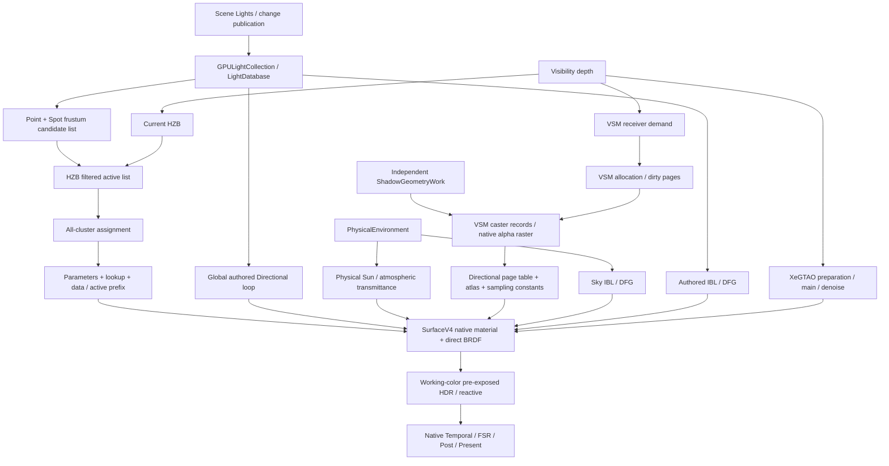

# M3 Lighting V4：局部灯光工作生成

本文是 M3 的设计 authority；阶段、状态与实施结果只在 [M3 执行计划](../next-execution/eengine-v4-lighting-execution-2026-10.md)。[全局 V4 母稿](./eengine-v4-native-shading-2026-10.md)继续约束单一 Renderer、native Material、产品责任、成本与原子切换。下文源码审查是设计起点快照；L3.2 已将 LocalLightWork 接入唯一生产链并删除旧 cluster owner，当前接线见 [Shading](../domains/shading.md)，验证范围与未运行项以执行计划为准。

现行生产验收与NONE/DIRECT/SPARSE成本限制见[最终验收记录](../next-execution/eengine-v4-lighting-execution-2026-10.md#11-l33-production-lighting-acceptance2026-10-09)；下文目标/起点分析不代替实测，不把自动非零DIRECT阈值或未实现shadow能力写成已启用。

2026-10-08 重新 `git fetch origin`，审查起点 HEAD/origin/master 均为 `ae140163886b71bf9a153033ba2e1460dc612ab9`，工作区干净。源码及符号引用是事实依据；M1/M2 关闭范围和 CPU OPEN 不因本文改变。本轮只设计，未修改生产 TS/WGSL、未运行新 GPU benchmark。

## 1. 当前实现事实

### 1.1 灯光 publication 和数据

[SceneLights](../../OEngine/src/scene/Scene.ts) 按 add/remove/markChanged/needs_update 推进 version；Light 普通字段修改须经过现有 Scene 变化通知，不假设所有字段有 setter。`GPUSceneEnvironmentContext.encodeFrame` 按 frameIndex 幂等准备，读取 changesSince；`GPULightCollection.update` 在 version/Scene change 变化时 build，按类型连续重排 GPU slots、删除旧尾部。命令 abort 回滚 publication revision、counts、source version；稳定帧不是重复完整建库。

`LightDatabase` 是 Scene 持久 GPU database，包含 light_point/directional/spot 与三种 shadow table，并拥有 authored IBL publication。记录被 `.pack()`，不是 JS 字段长度，也不是手猜 std430：

| 类型 | packed record | 生产读取 |
| --- | --- | --- |
| Directional，48B | direction、color、disk_radius、flags、near_clip_distance、shadow_id | 页 occupancy mask 迭代，incident direction=-direction；最多 32 个，CPU 明确 admission |
| Point，48B | position、color、distance、radius、flags、near_clip_distance、shadow_id | finite-radius inverse-square + cutoff、BRDF；Opaque 的 local shadow query 返回 1 |
| Spot，64B | Point 字段，加 direction、coneCos、penumbraCos | 距离衰减 × 角度衰减、BRDF；Opaque 的 local shadow query 返回 1 |

布局由 StructType.pack/GPUDatabase 的 descriptor 决定；现有 test-dist descriptor 的只读核对为 128KiB/page、Point/Directional 2723 slots/page、Spot 2043 slots/page，4096 pages/table；这些大于实际 Lighting admission，不是“支持几百万 active lights”的承诺。directional producer 仅使用单页前 32 个 mask slots。Point+Spot 当前总 admission 为 **16,380**；48/64B 是有效 record stride，真实物理账还含 page lookup、occupancy/header、capacity、retiring，不能用 N×stride 冒称全部 VRAM。

color 写入含强度/亮度归一；radius 和 distance 是不同语义，near_clip/shadow_id 在旧 shadow helpers 可读，不能当成已经存在 local shadow producer。slot 是当前 publication 内地址，不是跨帧稳定 entity ID；Scene/revision/device epoch 是外部 lifetime context。

### 1.2 真实生产链

真实调用是 `RendererCore` 的 `_lightCluster` lazy owner → `FrameProgramOwners.lightCluster()` → `FrameProgramLowering` 的 `addToGraph()` → Native Surface group1 bindings 0..3。`FrameProgram.hasLit` 同时要求 direct provider 和 IBL，并使 buildHzb=true；**只有全局 Sun 的 lit Scene 也会声明旧 cluster 产品**。Surface 读取最终 lookup/data，candidate/active/counters 是 pass 内部产品/诊断；Temporal 不直接读取 cluster list，消费 HDR、light publication revision 和 VSM content version。

`LightDatabase` 的可达渲染消费者是 LightCluster 与 Native Surface 生成的 direct helpers；GPUSceneEnvironmentContext 持有 collection，Renderer/View 将其导入图。`packed_transparent_oit` 使用旧 `LIGHTING_DIRECT_WGSL`，但 `PackedTransparentOitPass` 未从本快照 Renderer/FrameProgram 调用，不能称第二条生产 Lighting。它及测试的存活依赖在切换时单独处理，不能机械按名字删 BRDF 或宣布透明已完成。

### 1.3 Global Direct、Shadow、Indirect 的真实边界

- **Physical Sun 是独立 Global Direct Provider。** PhysicalEnvironmentRuntime 发布 64B 参数、transmittance LUT、sky IBL；native_surface_lighting 用现有 BRDF 和 directional VSM 查询。不进入 Local cluster，不把它重复登记成 Point/Spot，也不偷偷合并用户显式添加的 Directional。
- authored Directional 也是 global loop，不进入 Local cluster。Opaque VSM wrapper 在 flags=shadow 时查询同一个 directional atlas；Renderer 的 lightView/clipmaps 却来自 **physical_environment.sunDirectionWorld**。故当前不能证明任意多个 authored Directional 各有正确阴影。
- VSM 是真实生产的 **单 Sun directional clipmap** owner：receiver demand → bounded page allocation → independent light-view Geometry → native alpha caster raster → complete dirty-page commit → sampled content version。VsmGeneration 按 device/Scene/cut/sun/caster/resize/page quantum 失效；采样核验 generation/dirty，缺页使用 coarse，最终缺失 neutral=1。现有 negotiated high/bounded/disabled profile、PCF/bias 不在 M3 重写。
- `shadow_point` vec4、Spot atlas+projection、Directional 三 cascade records 和 legacy sampling helpers 存在；**没有当前 opaque Point/Spot shadow 的完整 producer→consumer**。不得把 ABI 存在写成 Point/Spot VSM 已完成。
- IBL diffuse irradiance、prefiltered specular、DFG 分别由 authored/physical environment 提供；AO 来自 XeGTAO 的 r8unorm scalarTexture，未消费的 packed buffer pass 可被图裁掉。Native Surface 当前 AO×material occlusion 乘 diffuse IBL，spec/coat 是既有数学；Direct 不借 AO 掩盖 shadow。M3 不改变 IBL 能量模型/BRDF/曝光、GI、reflection、ReSTIR 或 AO 算法。
- Surface 仅 winner reconstruction → native material → global/local direct + shadow visibility + IBL/AO → HDR。Rec709→Rec2020/preExposure 按既有出口执行一次；有限 Sun continuation 必须继续保持唯一贡献与独立 HDR 读/写版本。

### 1.4 当前成本与正确性风险

tile=32、Nz=24；1080p 为 T=60×34=2040，C=T×24=**48,960**。assign 4×4×4，实际 launch 15×9×6×64=**51,840 lanes**，边界 lanes early-return。每有效 cluster 扫描完整 filtered active N；Point sphere/frustum，Spot 每次重建八 corners/cluster bounding sphere/cone 测试。

每 invocation 的 `var local_lights: array<u32,256>` 是 **function/private**，逻辑 1KiB/lane，Point/Spot 各限128，不是协作的 workgroup array。超过 per-type 或 data 容量，cluster flags 指向 complete filtered active prefix，逐灯完整评估；admission 保证 candidate/filtered 不先丢灯。即使空 cluster 也走 reservation，CAS 争抢一个 global output counter。**INFERENCE：** 动态索引 private array 可能 spill、降低 occupancy，CAS 可能 contention；没有 register/spill/DRAM counters，不能把历史 30ms 精确归因给它们。

1080p 旧 reserved descriptor bytes：

| 产品 | bytes |
| --- | ---: |
| lookup，16C | 783,360 |
| data header + 16,380 active tuples + 64.5C indices | 12,697,232 |
| candidate + filtered 两列表 | 131,072 |
| settings | 128 |
| 合计，不含 LightDatabase/diagnostics/driver | **13,611,792（12.98MiB）** |

这是 **reserved**，不是每帧所有 bytes 都写。zero local lights 不 dispatch 核心 shader，但 lit 图仍声明按 C 计算的产品。正常 Surface 每 pixel 是 tuple→48/64B light gather→约100–200 scalar ops/灯的历史估算，不代表 uncached transactions/FLOP counter。

最新源码的 LightCluster 变更日志只有既有 sparse ABI 和格式化，没有 M1 后算法替换。可信历史 M1 production oracle（旧执行 §3.4.1，source hash `95acada96c0214bb0f2060527316147f3a9b0164bc80c80c845b51e557a48656`、output hash `27cd83d7f124df7ccdbb9efa7127ce488b6e8d2a172a2c06b2a456de4fa560ce`，GTX1650Ti/Chrome154）ordinary4 assign P50/P95=**29.908/38.412ms**；32-Program/8灯=35.197/40.620ms。M2 large authored 很少 local lights，stage≈.005ms；CPU round1 callback≈.04ms 是同类低 local 场景，不能外推多灯 CPU 或推翻 GPU 压力。**本轮没有新计时**：现有 oracle 一次包含多组120帧及 recovery，是重型任务；新的同条件 baseline 放 L3.0。

从源码推导、尚待独立边界 oracle 的风险：

1. `light_sphere_distance_attenuation` cutoff 用 max(centerDistance-radius,0)，finite 支持域是 **distance+radius**，而旧 Point/Spot cull 用 distance。distance<=0 时数学不截断，Spot 默认极大 distance 还可能使 bounds arithmetic overflow。不能以旧列表为新 oracle 真值。
2. penumbra=0 会产生相同 smoothstep edges；灯心处 normalize(0)/radius÷0、cone sqrt roundoff 都需要有限值/明确极限约定。不靠宽容差或夹掉非零贡献过关。
3. HZB 的投影、reverse depth、边界 taps 和 jitter 必须保守证明；“光源中心被遮挡”不是“灯不能影响可见 Surface”。
4. authored directional shadow flag 与 Sun atlas 的来源关联不完整；必须显式 capability 约束，不能把不相关 atlas 当有效阴影。

以上是设计起点的审查记录。L3.0 在 `811e7f1e` 后独立 GPU oracle 证实并修复了 finite support/radius、非正 cutoff 的 unbounded cull、硬 cone 等边缘和 emitter-center 非有限值；旧 cluster 的 owner、private256、CAS、产品与生产 graph 均保留。真实生产 publication 在修改 revision/table 前拒绝有效但没有 provider 的 authored shadow ID，Physical Sun VSM 不受影响。灯心约定 direction=0、angular radius≤1，避免未定义 normalize/divide；不是增加亮度 clamp 或放宽 HDR 容差。数值、原始失败、计时与未运行项只在 [L3.0 实施记录](../next-execution/eengine-v4-lighting-execution-2026-10.md#8-l30-baseline-实施记录)维护。

## 2. 范围与 KEEP / ALIGN / REWRITE / DELETE

M3 解决几十/几百及更多 Point/Spot 的 **GPU Local Light Work Generation**：仅对可能影响实际 opaque winner 的灯光与区域付费。不是重新实现灯类、Lighting VM、GI 或新的 Renderer。

| 子系统 | 决定 | 边界 |
| --- | --- | --- |
| SceneLights / GPULightCollection / LightDatabase | KEEP + ALIGN | 保参数、page publication/abort/lifetime；补 bounds/identity/capability 约束，不改 GPU Scene |
| Global Directional / Physical Sun | KEEP | global provider 独立；纠正 unsupported shadow reference 语义 |
| BRDF / direct attenuation / coat / IBL / AO | KEEP + numeric closure | 提取清楚的数学函数；只修 oracle 证明的必要数值错误 |
| LightClusterPass / cluster assign WGSL owner | REWRITE LOCAL OWNER | 完整构建新 producer，原子替换全部可达消费者 |
| cluster-centric private256 + global CAS allocator | DELETE after cutover | 不作为新 owner 的常规 execution mode |
| lookup/data 中间 ABI / active prefix copy | REPLACE | 新 typed tuples + compact ranges，无旧ABI adapter |
| directional VSM / ShadowGeometryWork | KEEP + provider alignment | 保 allocation/raster/PCF/Geometry；明确唯一 Sun shadow source |
| Point/Spot shadows、多 Directional shadows | 未完成能力，独立后续 scope | M3 不默默引入 local VSM/atlas 重构，也不宣称实现 |
| FrameGraph / CommandContext / timing / resource accounting | KEEP | 图级责任和按需诊断，不建新调度系统 |
| Transparency orphan wrappers / 旧表示测试 | dependency review | 无 consumer 才删；数学/数值/overflow oracle 迁移，不恢复退休 GBuffer |

发布后的 shadow capability 仅支持 Physical Sun directional VSM 和显式 disabled profile。已有 casts_shadow 默认值但 shadow_id=-1 不是有效 shadow request；**已发布 flags=shadow 的 Point/Spot 或独立 authored Directional 没有合法 provider 时，preflight 明确报 unsupported reference**，不能在新代码把它包装为“已支持但 visibility=1”。不自动给 authored Directional 绑定 Sun atlas；未来新增 shadow provider 必须另有真实 producer 合同。L3.0 检查现有 workload 是否触发这个公开缺口，不能通过清掉用户有效 request 让测试变绿。

## 3. 成熟源码参考与方案选择

Local / Reference / Adopt / Adapt / Original 详见 [来源 ledger](../porting/next-renderer.md#m3-lighting-source-map)。已实际阅读以下 pinned hot paths，只有 **reference**，未声明代码移植/adoption：

- [Bevy](https://github.com/bevyengine/bevy/tree/fd98063564218bd210308675602a3e9643014c31/crates/bevy_pbr/src/cluster)，revision `fd98063564218bd210308675602a3e9643014c31`，MIT OR Apache-2.0（根 license 核对）：gpu.rs 的 prepare/五 pass组织/metadata resize；cluster_z_slice.wesl `z_slice_main/try_write_z_slice`；cluster_raster.wesl 的 bounds、sphere/AABB、spot test、count/populate；cluster_allocate.wesl 的 local/global scan；render/clustered_forward.wesl 的 range unpack/ID consumer。它实际使用 light-centric z-quads raster Count→Scan→Populate，不是 CPU clustered 的推测。
- [Wicked Engine](https://github.com/turanszkij/WickedEngine/tree/7f776d02094571dd2c8166c7e5879d5e93d2b642/WickedEngine/shaders)，revision `7f776d02094571dd2c8166c7e5879d5e93d2b642`，MIT（LICENSE.txt）：lightCullingCS.hlsl `main`、tile depth min/max/32bit mask、协作 entity intersection/bitset；ShaderInterop_Renderer.h 的256 entities/8 buckets；shadingHF.hlsli 的 Point/Spot bucket consumer。保留 occupancy 和协作思路，不复制 universal entities、256硬上限、bindless/wave scalarization。

Bevy z-slice/index 容量不足会先漏项、delayed metadata 后 resize（gpu.rs 明说可能几帧 corrupted）；**拒绝该 overflow 行为**。不复制其 sequential global scan 的全域串行 loop，也不模拟 Wicked 的 wave/bindless。简单 glue/helper 按本地架构直接实现；复杂 cull、scan、bounds 修改先核对完整 source 分支与数学。

记 N=admitted local lights，Na=frustum candidates，C=总 froxels，Ca=occupied froxels，B_l=灯的 conservative tile×slice bounds，Q=ΣB_l，E=实际 emitted light/froxel pairs，V=visible lit pixels，K=每 pixel list length。

| 方案 | 物理工作 / 风险 | 决定 |
| --- | --- | --- |
| A 旧 cluster-centric | C×Na tests，private256，global CAS；空域税大，low N仍昂贵 | 淘汰旧 owner；它仍是 L3.0 baseline，不保长期 selector |
| B light-centric | bounds O(N)，只遍历 Q；小灯/空域优势，巨灯最坏仍 C×N | **选为核心**，64-region tasks 并行化，不让一 lane 串行扫描全屏 |
| C Tile→depth | tile candidates O(ΣtileBounds)，再各 tile 按mask细化；减少24倍无效域，但引入第二列表/容量/两级散写 | 本轮不建第二 tile-light list；采用 tile depth mask作 predicate，保一次3D列表 |
| D active/surface sparse | 全分辨率 depth/winner扫描8P bytes；active list再有compaction/queue/indirect税 | **采用 occupancy mask**，不默认额外 active-cluster queue；低 coverage才可能赢，必须算这8P税 |
| E Count→Scan→Scatter | 两遍 Q、per-cluster原子2E、scan bytes/barriers/约11 dispatch；移除global CAS/private lists | **采用**；不宣称scan天然更快，和 A及直接全灯评估比总成本 |
| F bounded Direct small-N | 0灯没有 local GPU work；小N Surface直接读 admitted IDs，成本V×N、无需cluster | **同一 subsystem 的有限模式**；非零阈值由L3.0/L3.1测定，不能拍脑袋设16 |

推荐 architecture 已决定：**LightDatabase → LocalLightWorkGenerator → LocalLightWork → SurfaceV4**。核心是 B+D+E，F 负责 zero/证实获益的小 N；模式只有 NONE / DIRECT / SPARSE，另外 correctness fallback 使用 DIRECT，同数学同 owner。C 的独立 tile candidate product 暂不建；若 chosen plan 在 L3.0 的理想模型都不盈利，记录反证并局部修订本文后再开工，不无限增加优化层。

## 4. 完整物理执行方案

### 4.1 初始化、bounds 与工作组织

1. CPU preflight 核验 light publication、admission、view/depth identity、profile/limits；不读 GPU 可见灯数决定工作。N/counts/revision 必须来自 **本命令实际可读的 staged-or-active publication**，与同encoder的DB上传一致，不能只读上一committed snapshot漏掉本帧新灯；abort沿既有publication合同回滚。按 N 与校准策略选有限 topology NONE/DIRECT/SPARSE，key只含 topology/capacity tier/extent/profile，不含每帧 position/count/revision 的完整值。
2. 同 encoder 的 initialize 写 epoch/frame/publication header，清 counts/cursors/status，固定每帧的 all-admitted ID 段。一个 bounds invocation/源灯，按连续 Point/Spot slots确定 tuple，包含 offscreen灯；NONE无灯 kernel，DIRECT只需IDs/header，不需要mask/grid/bounds/scan。
3. SPARSE bounds 计算 finite sphere支持域 distance+radius，与 view变换/jitter一致；非正 cutoff/无法有限投影/near crossing/极大范围 conservatively cover whole view。无穷范围灯仍可按 cone剔除但不必须；第一实现保守进入 global-local tail，所有 winner 都评估一次。finite灯 offscreen 可令B_l=0。
4. bounds rectangle用 outward tile rounding，z沿用现有24 log slices和clamped两端语义；末slice不能仅截在camera.far使合法远winner漏灯。初版使用 enclosing sphere/AABB；Spot内层保守sphere测试，精确cone仅在 oracle证明且 Cost Card有净收益时启用，不重复八corner/三平面除法。非finite输入参数 CPU报错，合法极大distance的算术溢出作保守cover，不用NaN剔除。
5. 每灯任务数 g_l=ceil(B_l/64)，scan exclusive prefix。GPU indirect dispatch 2D展平 taskID；每WG一次 upper_bound(prefix, taskID) 找灯，64 lanes枚举矩形/slice区域，剔尾。zero-length bounds不产生task，prefix重复值用upper_bound正确跳过。最多log2N步/组，**不是每pixel search**，无展开region queue。light字段可按WG复用，不建立persistent cache。
6. scan采用portable workgroup 256 lanes local exclusive scan、block sums scan、offset add；不要求subgroups。大extent多层block scan有明确level与checked/saturating arithmetic，通常1080p C只有192 blocks，N最多64 blocks。生成indirect参数在scan完成后的writer发布，不能同dispatch跨WG假设global barrier。

### 4.2 Occupancy、count、scatter、finalize

SPARSE GPU task budget通过后，1WG/32×32 tile、64 lanes各遍历最多16 pixels。每pixel读取 **最终 VisibilityKey+Depth**，只对有效winner计算slice，局部OR后共享树归并输出一个24bit mask/u32；background不点亮。不能在barrier前让越界lane early return。mask与Surface lookup使用同一个pixel/depth→slice定义、同camera/jitter/extent，不混previous HZB或half-res AO depth。slice边缘及depth与winner reconstruction数值差需要独立oracle；未证明前保守扩相邻slice，而不能缩可见域。

Count tasks：mask空bit直接跳过，再sphere/cluster保守相交，per-cluster atomicAdd count一次。cluster几何从tile rays+slice bounds恢复，不重复昂贵Spot八corner函数；两端无限slice保守pass而不是构造inf AABB导致NaN。无workgroup/private light-ID数组。E个true pairs只产生E个distributed count原子，无global reservation CAS。

Scan counts：生成8B/cluster range（offset,count）和总E；若E>I或arithmetic/status非法，header进入完整 DIRECT，scatter args=0。Scatter用完全相同 bounds/mask/predicate，再per-cluster cursor atomicAdd和4B tuple write；始终offset+ticket<count/capacity核验。无需按Point/Spot分区，typed loop共享现有incident/BRDF函数。all finite bounds为空且global-local tail为空时，task scan可证明没有任何local贡献，GPU发布NONE并zero indirect；此时Surface/diagnostics均不得读取未写的lookup，不需要本帧CPU决策。

Finalize每cluster核验cursor=count、全部writes合法；scatter任何mismatch/overflow设置全帧DIRECT flags。Surface只能读finalize后的data header/metadata版本；**不得一边填列表一边消费、不得消费partial**。DIRECT fallback读取all-admitted IDs，包含未入bounds的灯，不依赖错误filtered list；SPARSE读取本cluster列表加unbounded tail（finite/unbounded互斥），无双计数。

L3.1 的1080p SPARSE在N≤256时为12个compute dispatch：bounds1、light task scan1、schedule1、occupancy1、count1、cluster scan3、allocate1、scatter schedule1、scatter1、finalize1，另有clear/upload；N>256增加task scan层，通常14个。GPU发现空bounds/region或index溢出时，count/scatter indirect归零，仍执行occupancy/cluster scan/allocate/finalize固定尾段；不能把它写成完全免费跳过。CPU NONE/DIRECT无local compute dispatch、不分配大grid。进一步跳过固定尾段须有测量依据，不能为减少dispatch未经成本证明合成megakernel。

### 4.3 Low-light选择与 Cost Card

NONE（N=0）是数学必然成立的无local贡献；Global Sun/Directionals/IBL/AO继续正常工作。DIRECT使用完整admitted IDs，GPU可visible-cull但初版不需要第二compact active list。非零默认threshold在baseline完成前为 **未校准/禁用**，不是硬编码magic number。

比较 `Tdirect=V×N×t_test + accepted×t_BRDF` 与 `Tsparse=Tbounds+Toccupancy+Tscan+2Q×t_pair+2E×t_atomic+Tlists+V×K×t_test+accepted×t_BRDF`。t是匹配GPU测量/估算；Surface+light work合计才是收益，不能只看producer计时。L3.0固定0/1/4/8/16/32及更高N、low/high coverage、小/大radius；L3.1隔离同数学新模式交替复核。profile中仅保守选择 **所有校准覆盖条件均净赢** 的小N上界，其他用SPARSE；coverage/radius无需本帧CPU readback。没有稳定crossover则threshold=0、不建在线学习器。mode切换不改变native Program shader identity、材质实例数对应pipeline数或曝光/阴影。

## 5. LocalLightWork ABI 与资源合同

以下是初版必须实现的ABI，L3.0可按limits/实测修订预算，不可把必要语义留“以后再定”。只供opaque local direct work，不合并GI/ReSTIR/透明/volumetric数据。

| 产品 | layout / 寿命 | owner / writer / reader |
| --- | --- | --- |
| LightDatabase | 既有packed records，Scene persistent | GPUSceneEnvironmentContext/GPULightCollection owns；publication writes；generator/global+local shading reads |
| LocalLightParameters | 128B uniform，view/frame | generator上传；含grid/near-far-log/view profile/capacity/publication context；Surface/producer读 |
| LocalLightLookup | 8B/cluster `{offset:u32,count:u32}`，NONE/DIRECT合法tiny dummy | generator拥有frame allocations与真实fence；FrameGraph声明宏依赖，allocate写、finalize依赖；Surface仅SPARSE读 |
| LocalLightData | 128B header + u32 payload，frame/view-local；空runtime array物理至少132B | generator拥有frame allocations与真实fence；bounds/scatter/finalize分段writer；Surface借读，不能destroy |
| 内部scratch | occupancy4T、bounds32N、prefix/scan、counts/cursors；indirect 16B/阶段 | generator声明图寿命/预算，只有内部pass读写，不能泄漏给Surface |

Data header按32×u32=128B，word布局：0 abiVersion=1；1 mode（0 NONE/1 DIRECT/2 SPARSE）；2 flags；3 deviceEpoch；4 frameIndex；5 lightPublicationRevision；6 admittedCount；7 allIdsOffset；8 globalLocalCount；9 globalLocalOffset；10 clusterCount；11 indexCapacity；12 indicesOffset；13 indicesWritten；14 paddedRegionTasks；15 taskBudget；16..31 reserved=0。offset均为payload中的u32 word，不含header；all IDs/global tail/index各是明确不重叠slice。只有SPARSE发布indicesWritten=E，NONE=0，fallback/direct不得信任残留indices。

tuple32沿用合理的 **low24 database slot + high8 type（Point0/Spot1）** 编码，但不兼容旧ClusterData/metadata。写前assert slot<=0xFFFFFF/type合法，无mask截断；最多N=16,380的admitted snapshot，无ID generation假象。primitive/light identity不同，M3不改VisibilityKey。相同epoch/Scene/view/publication被graph bindings关联；任何CPU可知context mismatch在encode前fail，GPU unexpected stale header是必需correctness failure，不用空光当成功。GPU状态不能同帧readback决定dispatch。

flags定义bit0 REGION_BUDGET、bit1 INDEX_CAPACITY、bit2 COUNT_SCATTER_MISMATCH、bit3 INVALID_WORK；前两位允许正确DIRECT fallback但必须诊断，后两位即使保住完整图像也必须使验收失败。invalid源参数/publication admission在preflight失败，不进入部分提交。diagnostics延迟采样，不逐pixel atomic计数，也不逐帧map。

Surface group1继续使用 DB storage、parameters uniform、lookup storage、data storage三storage+一uniform原有槽位；不新增sampled textures、不破坏16 sampled limit或sun continuation。HDR/Aux ownership不改。生产compile前由同一 ABI 模块生成TS/WGSL定义、offsets与layout测试；独立CPU oracle不得导入GPU emitter验证自身。

### 5.1 Capacity / overflow

- admission保当前Point+Spot<=16,380、Directional<=32、database slot/record/table合法；超界创建资源前明确拒绝，没有截断/未来resize弥补漏灯。
- 4GB/1080p初始SPARSE预算 **I=1,048,576 tuples（4MiB）**、单frame physical products+scratch **6MiB ceiling**。这是初始capacity设计，不是实测最优。2 in-flight +1 resize/replacement峰值最多18MiB；需按真实graph allocation/fence计账，不能假设destroy即时释放。
- region launch工作上界 `sum(64×g_l)<=8I`，超过budget置flag并选DIRECT、indirect=0。L3.1以CPU preflight证明 `ceil(C/64)×64×N<=u32max` 后运行精确portable scan，不宣称GPU用了saturating scan。8I是有界工作保护值，不是已测break-even；L3.0/L3.1计量后可降低，但不丢贡献。extent/dispatch2D/buffer limits在分配前协商。
- pair E>I则全帧DIRECT，不返回前I项；all-admitted段独立容量>=N，因此完整fallback可执行。不能无限grow图资源；future-frame delayed overflow statistics仅提示容量policy，不是正确性依赖。
- FULL DIRECT worst O(V×N)，极端16380全屏会很慢并可能触发device timeout；不宣称bounded memory等于bounded frame time。高重叠压力若频繁fallback/超时，验收记录为能力/性能缺口，不能把partial image算通过、偷偷减灯或增加runtime bridge。
- NONE/direct topology只需要header/IDs/tiny lookup；L3.1 owner另保O(N) scratch，不分配C级grid或I级indices。Scene/mode/capacity tier变化进入既有cache key，稳定帧不重compile。SPARSE资源不能被同时未过fence的frame覆盖；generator的有界allocation复用必须尊重真实last-use。最多2个encoded/submitted frame与1个prepared replacement，峰值18MiB；profile/epoch变化使cache失效，而revision/count更新late bindings/上传。

## 6. Cost Map 与可证伪条件

以下是 **ESTIMATE**，不是本轮性能结果。1080p P=2,073,600，N取当前最大admission，C=48,960，T=2040：

| 成本 | 旧 / 新模型 |
| --- | --- |
| intersection | 旧C×Na；新两遍Q（padded task上界另记）+O(N)+occupancy O(P)；empty bits省掉精细test但不是免费任务 |
| footprint | 新约16C+48N+4I+4T+4KiB+256B≈**5.51MiB**；旧12.98MiB；cap按6MiB，DB/VSM/IBL/AO另账 |
| sequential traffic | occupancy额外8P≈16.59MB/frame；count/cursor clear约8C，metadata最终8C；scan若每元素约读写3轮，约24(C+N)；IDs一次4N写；scatter4E写、Surface list4×evaluations读 |
| random access | per任务shared light read48/64B + mask/predicate；per pair count/cursor atomics至少各一次；Surface DB高度共享，逻辑bytes不是DRAM |
| ALU / specials | bounds O(N)、task binarysearch ceil(log2N)/WG、slice log/exp、sphere tests；保BRDF/texture/VSM useful work不变；scanO(C+N)加workgroup barriers |
| atomics / barriers | distributed2E原子；occupancyWG tree约6轮、scan block约8轮以上，完整dispatch间graph依赖；没有globalCAS、没有每lane1KiBID数组 |
| pipelines / dispatch | 10个device-local PSO，1080p SPARSE通常12/14dispatch，DIRECT/NONE零local compute；少灯收益需扣完整管理税 |
| CPU | publication更新、常量latebind、有限dispatchencode；不引入每帧全Product/page scan或完整light-work evidence |

理想小范围灯：Q≈C×N×f，f是conservative bounds覆盖率；忽略固定税，双遍需2f<1才少于旧C×N。50%受益时理想0.5旧tests仍要扣occupancy/scan/atomics；0%受益（f=1）新tests约2倍旧，是 **负收益**，此时必须由DIRECT避免list管理或如实承认高重叠限制。100%空域/极小灯收益最多省去旧tests，还要付16.59MB扫描；低coverage、不多灯未必赚钱，NONE/校准DIRECT不付它。

Direct break-even为 `被避免的(V×(N-K) incident test/gather) > work management + extra list traffic`。不把“少tests”“更小reserved”当提速证明。L3.0记录read/write吞吐校准和existing GPU oracle；L3.1核实ideal/expected/worst，按同灯光/HDR数学比较Surface+generator+frame总量及P95。core方案不能在最佳小灯case盈利则拒绝，不能加global lighting cache/proof/history救它。

## 7. 生命周期、切换与未来边界

Renderer只composition/lifecycle，拟建`LocalLightWorkGenerator`拥有device-local PSO/preflight和可用profile；Scene仍 owns DB，不把lights复制进Surface owner。FrameProgram声明raw winner/depth/DB readers→LocalLightWork writers→Surface/诊断readers，全部同encoder/一次submit。新的occupied work不需要旧LightCluster HZB；**只删除directLighting对HZB的强制需求**，保Geometry previous/current-HZB真实消费者，不关功能。buffer resources不由Loader长期拥有。

prepare不发布success，encode不advanceScene/Temporal。submit成功提交CPU revision和frame lease；abort清pending bindings/不改变active publication，retry重置header/count/cursors、重新写完整域，不用上次partial列表。resize/capacity/Scene replacement在旧graph最后fence后退休；late fence只能释放自己的allocation。device loss取消旧epoch delayed diagnostics/map，重建PSO/profile、回放Scene lights，不能把上一epoch mode/list当新帧。releaseScene先撤publication，取消相关readback，fence后释放Scene DB；renderer destroy释放generator和neutral产品，不destroy borrowed FrameGraph/IBL/VSM/AO产品。

非生产可与旧源码并存，但新Product不能喂旧cluster owner，旧filtered/CAS产品不能成为新hot path。L3.1完整构建所有Point/Spot、finite/unbounded、DIRECT/SPARSE/overflow/numeric/lifecycle，再L3.2一次切换Renderer/FrameProgram/Surface/neutral bindings/diagnostics并立即purge。不为常绿加A/B production flag、bridge或dual owner。

新work只覆盖当前opaque winner；透明/volumetric尚无同域消费者，不能借opaque occupancy剔它们的灯。未来 effect 若需要自己的depth/volume域，定义其producer/product，不扩UniversalLightingRecord。shadow visibility由真实shadow owner提供，不在LightWork内建atlas/cache/history。M3完成后STOP，VT/多光源shadow/GI/ReSTIR/CPU继续优化均需另一次用户授权与源码设计。
