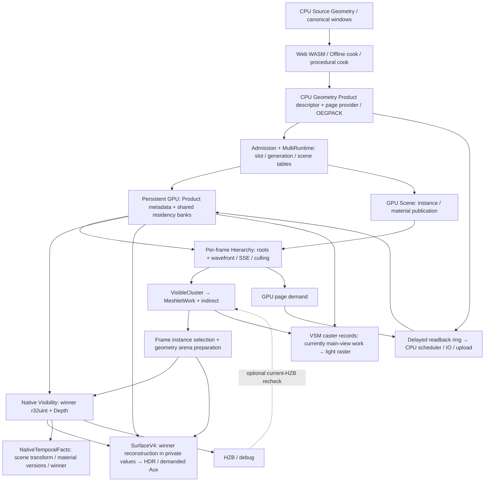

# EEngine V4：Native Shading 架构母稿

本文件是 **V4 全局架构不变量 authority**，保留 M1/M2 设计；[原执行计划](../next-execution/eengine-v4-native-shading-execution-2026-10.md)保留其实施结果与通用验证纪律。M3 已转入独立 [Lighting Design](./eengine-v4-lighting-2026-10.md) / [Lighting Execution](../next-execution/eengine-v4-lighting-execution-2026-10.md)，当前模块唯一 authority 由 [workstream](../../project/workstreams/active/eengine-next-clean-rebuild.yaml)导航，不复制完整任务。源码定义当前实现事实，`docs/domains/`在真实代码切换后更新。本文 §2 是 M1 切换前快照，§11 是 M2 设计；文档采纳不证明实现、GPU 验证或来源 adoption。

2026-10-07 执行 `git fetch origin` 后，HEAD、master、origin/master 均为 `b69a0a60b13930212fdc98f988443186fad024e4`；开始时仅两份 V4 提案未跟踪。下文源码定位以该快照为审查起点，实施必须重新检查 HEAD/工作区与直接消费者。

## 1. Authority 与设计输入

主方案来自[Native Shading 独立提案](<./EEngine V4：Native Shading 独立架构提案.md>)。从[辅助研究提案](<./EEngine V4：以 Native Material Shading 为核心的独立渲染架构设计.md>)吸收 AAA composition、VRAM/带宽、风险、one-route→multi-route、calibration、来源映射及可证伪方法；其路线、预算与实施顺序不自动采纳。两份提案保留为 history 研究输入，不能形成第二份 current authority。

[R3/R4 设计](./eengine-extreme-performance-rebuild-2026-10.md)、[R3/R4 执行记录](../next-execution/eengine-extreme-performance-rebuild-execution-2026-10.md)及 ADR-0021 退出 current；旧实验、C cache 负收益、B1/B2 数值问题原文保留。历史文本中的“必须修旧 cache”“General VM”“六 signal”“A0→F”不再约束 V4。发生冲突时，以本母稿、最新源码事实、协商到的 WebGPU 能力和可检验成本模型共同裁决；实现事实不因目标改变而重写。

长期目标仍是 Extreme Performance、GPU Driven、WebGPU Native、AAA 画质、复杂场景 streaming 和可持续扩展；GTX 1650 Ti 4GB/1080p 是首要约束之一。VG、VT、VSM、clustered lighting、ReSTIR、GI/SSGI、SSR/SSSR、Atmosphere、Temporal、Dynamic Resolution、FSR/未来 AI Upscaling、Transparency/Media 保留为能力方向。M3 Lighting 的完整模块设计已独立成文，不继续向本文追加；更后续模块仍只定义连接合同，须根据真实源码另行设计。

## 2. M1 切换前源码审查与切断边界（历史快照）

下表只描述 M1 切换前接线，表中“当前”指该审查时点；已退休路径不再是现行生产 owner。路径均相对于 `OEngine/src/`。实际调用和依赖须用符号检索，历史行号不能替代源码；切换后事实见执行计划 §3.3.1/§3.4.1 与本文 §11。

2026-10-07 再次 `git fetch origin` 后，HEAD 与 origin/master 均为 `0386bea5fc59a98cefd3f54d2be589ab9b2ed0eb`，工作区干净。本次按实际调用重新核查实施边界，只调整文档执行模型，没有 native probe 或生产代码改动。此前 `b69a0a60` 是首次 authority 切换的审查快照，不作为永久最新源码。

| 当前 producer / 入口 | 产品与真实 direct consumers | V4 处理 |
|---|---|---|
| `render/pipeline/RendererCore.ts`；`render/program/FrameProgram.ts/FrameProgramBindings.ts/FrameProgramLowering.ts` | Renderer 构建 `_surfaceWork`，调用 canPrepareFrame/prepareFrame、invalidate、commit/abort、diagnostics/destroy；Lowering 的 `FrameProgramOwners.surfaceWork` 调用 addPublicationToGraph/addToGraph；radiance→Sky/Aerial→FSR，reactive→FSR | KEEP composition、唯一提交；S2 原子 REWRITE owner/lifecycle、需求/key 与全部 direct consumers，不只替换一个 pass |
| `render/surface/SurfaceWorkRuntime.ts::addPublicationToGraph/addToGraph` | Tape 更新→coverage/work/coherence/cache→Geometry+Appearance→Lighting 六 signals→Reconstruct→radiance/reactive | DELETE 中央 runtime；换 native opaque 及简单 execution bins |
| `SurfaceFrameResources.ts`；`gpu/GpuSurfaceWorkAbi.ts` | 四 bank closed heap、field/guides、六 RGB+state、cache 控制/请求与 history；供旧 Surface shaders | DELETE 旧产品/预算协议；REUSE limits、物理计账、fence 退休和 bind caching 方法 |
| `material/AppearanceGraphCompiler.ts::compileAppearanceGraph` | scalar typed IR、CSE/DCE、依赖、共享 sample、过滤语义；publication/compiler consumers | KEEP 图语义/分析；去除 runtime cache policy 推导 |
| `material/ExactAppearanceDag.ts`；`shaders/appearance_exact_dag.ts` | frequency、C/X/Y、liveness 和 Tape packing；GPU `dag_code` 循环及 `dag_values` 全局 scratch | REUSE 分析/数学；DELETE GPU Tape 编码/解释执行及热 scratch |
| `shaders/appearance_program.ts::lowerAppearanceWgsl` | 已有 straight-line native 生成、实例常量槽；当前 sample callback 仅传 UV | REWRITE 为完整 native backend；存在 helper 不代表已经有 production native 路径，必须补显式导数/全部采样语义 |
| `gpu/AppearanceProgramRegistry.ts` | async pipeline lease、资源 preflight、有限 compile admission、device loss；publication 消费 | KEEP 生命周期；REWRITE ProgramKey/profile；DELETE 仅服务旧 cache 的 field witness interning |
| `gpu/GpuAppearancePublication.ts`；`gpu/GpuRenderWorld.ts::prepareAppearance` | 图/实例/coverage/kernel、Tape/metadata、事务；`CoverageRasterBindings`、`MeshletBucketRaster`、`RasterWorkPartitions`、`VsmAtlasRasterPass`、TemporalFacts、Surface | REWRITE native publication；参数/资源更新、abort/retry、coverage 和 VSM alpha consumers 同步切换 |
| `render/passes/PackedVisibilityPass.ts`；`gpu/GpuVisibilityKeyAbi.ts` | `r32uint` winner、Depth、MeshletWork、frame geometry；Surface、TemporalFacts、VSM demand、HZB/debug | KEEP winner 契约；32-bit key 携带 slot/primitive，generation/partition 外置；不把 Temporal identity 当 winner |
| `render/FrameGeometryArena.ts`；`shaders/surface_geometry_completion.ts` | metadata/source/filtered directories、clips/triangles/attributes、prepared/resident recovery；Visibility/Coverage/Surface，相关 VSM geometry | KEEP arena owner；REUSE reconstruction/normal/tangent/bary/gradient 数学；去除写旧 Surface heap 的 wrapper |
| `gpu/TextureResidency.ts`；`TextureBindingSetPolicy.ts` | residency/版本/采样 route；当前每 set 九 texture banks、最多四 resident sets；coverage/native consumers | KEEP 真实 residency；REWRITE 执行绑定政策与整机预算，不把未来 VT 宣称已完成 |
| `render/passes/LightClusterPass.ts`；`shaders/surface_work_lighting.ts`及 BRDF/provider helpers | cluster lookup/data/active list、溢出处理；VSM table/atlas/constants、IBL/sun/AO 被旧 Lighting 消费 | KEEP providers/数学；REWRITE native consumer；DELETE packet/history/rate orchestration |
| `render/temporal/TemporalFactsPass.ts`；`shaders/temporal_facts.ts` | motion `rg16float`、mask `rgba8unorm`、双份 `rgba32uint` identity；Surface 与 FSR/debug 消费 motion/mask，下一帧 facts 读 identity | KEEP 有效语义；REWRITE publication 接口与需求；history 留 Temporal owner，审查是否值得保存，不能无依据删掉身份拒绝 |
| `render/passes/fsr3/Fsr3UpscalerRuntime.ts`及 PrepareInputs/Reactivity/Accumulate | color/depth/motion/reactive/validity/两帧 exposure→FSR history/output→Radiometry/Bloom/Present | KEEP 已有算法 owner/曝光语义；REWRITE Surface inputs |
| `framegraph/FrameGraph.ts`；`ShadeGPUCommandContext.ts` | compiled dependency/resource events、late bindings、事务编码、submit/completion fence；所有 pass | KEEP 宏依赖/生命周期/兼容资源复用；不接管 shader 内部调度 |

当前 `GpuAppearancePublication` 同时耦合 coverage、材质数值更新、旧 field/cache identity 和 Tape；不能整类当 KEEP。Geometry 的复用对象是源产品和正确数学，不能继续要求所有 Appearance/Lighting 读取一个跨 pass GeometryRecord。V4 fused 内部可以直接把重建值留寄存器。

当前 `GpuVisibilityKeyAbi` 为 `r32uint`：24-bit meshletWorkSlot + 8-bit localPrimitive，generation/partition 为外部生命周期 context。本模块 KEEP，不主动扩为 64-bit；只有真实能力需求证明不足时才重新评估。

`GpuRenderWorld::prepareAppearance` 等待 publication、主 meshlet 与 VSM alpha pipelines，`GraphicsContext` 持有 registry/static residency 和物理资源账；它们也是发布切换边界。`RasterWorkPartitions` 直接读取 coverageDirectory，TemporalFacts 直接读取 surfaceMetadataOffsets/materialLookup/valueVersions。当前 FrameProgramBindings 检查多个 activeSets/BindingSets，不能把 one-route-only 当作完整合法生产域。Registry 与 publication 必须按职责拆分，静态资产 residency 不因名称带 Appearance 就删除。

## 3. 历史教训与候选裁决

V1 的 O(P) 不是算法错误，昂贵 Geometry/Material 无条件 pixel-rate 才限制上限；V2 只 sparsify Lighting，前段与中间带宽仍在。旧 V3 把 proof/tree/cache 的管理当便宜，失败同时属于成本模型、抽象和 GPU 映射。R3/R4 的编译期分析、局部 Geometry 与事务发布有价值；General interpreter 的执行表示税、global closure cache 的精确 key/随机访问/atomic/publish 税和六 signal/history 产品不能因已写完就保留。

旧记录的 direct 27.540/27.382ms、warm cache 59.475ms，以及 cache scopes 分类漏计 44.827ms，仍只属于对应历史夹具/指纹。cache hit、预算有界、旧 oracle `passed` 均不证明净收益；本次没有新 GPU 测量。出处和原始限制保留在 [R4 执行 §2](../next-execution/eengine-extreme-performance-rebuild-execution-2026-10.md#2-当前事实与开放责任)。

| 候选 | 物理工作/成本 | 灵活性与 WebGPU/AAA 影响 | 裁决 |
|---|---|---|---|
| A Visibility + native compute + fused opaque | 一次 winner reconstruction/material/light→HDR；默认不落 closure/signals。多 route 增 compact indices 与调度 | native graph 灵活；固定 banks + 每 bin dispatch；寄存器/随机 gather 是风险 | 默认 V4 |
| B Visibility + compact material resolve + deferred light | 若 closure 24B，一写一读增加48B/visible pixel；缩短 live range，真实跨 pass consumer 可获益 | GI/ReSTIR 等可有实际阶段需求；必须说明 energy/composition、产品 owner，不能恢复通用六 signals | 有数据/consumer 时允许有限 profile |
| C Forward+/GPU-driven raster specialization | 插值/derivatives 硬件便宜，opaque overdraw 执行材质/灯；WebGPU CPU 仍编码已发布 pipeline/binding scopes，不能 GPU 自动切 pipeline | 对部分透明/低 overdraw 适合；VG/winner 与复杂 alpha/pass duplication成本需核 | 不作为 M1 的第二 opaque production；透明模块将来独立论证 |

同主提案普通95% coverage模型：A optimistic/expected/pessimistic 约4.1/6.9/13.0ms；B 加48B roundtrip、提高有效 ALU 的假设下约5.0/7.9/14.5ms。均是未校准预测。C 的额外材质/灯执行以有效 overdraw d 乘对应 pixel 工作项；例如 d=1.5、原 useful pixel shading 6ms 时先增加约3ms，再扣去 A reconstruction/bin 税，不宣称跨路线实测优劣。A/B 的物理分界先由 V4-S0 隔离数据判断，再于 V4-S3 完整 production 验收核对。

## 4. 目标帧流与 ownership

```text
GPU Scene / asset publication / texture residency / native programs
  → Geometry work / Virtual Geometry residency + LOD/SSE/HZB/meshlets
  → Visibility winner + Depth + frame geometry sources
  → dense one-route 或 GPU CompactPixelBins
  → native specialized opaque shading
      winner geometry reconstruction → material → direct/VSM/IBL
  → pre-exposed HDR + demanded SurfaceAux
  → effect-owned composition / Sky + Aerial / Temporal + FSR
  → Radiometry / Post / Presentation
```

Geometry owns LOD、SSE、HZB culling、meshlet queues/page residency；Surface 不能用 cache 为过度 Geometry 工作补偿。Visibility owns coverage/depth winner，包括 alpha test；被 alpha 拒绝的 primitive 不能在后续才擦除，否则后方 winner 已丢。主光栅/软光栅/阴影 coverage 使用同一材质语义。

Material compiler owns typed IR、依赖/频率、CSE/DCE、导数及 native source，设备无关图不拥有 GPU queue。Program registry owns source/layout/profile key、异步编译/lease/device epoch；publication owns instance parameters、resource routes 与事务提交。Native shading owner 只拥有输入绑定、执行和 HDR/Aux 写域；bins owner 只拥有 count/offset/index/indirect 的瞬态产品。它们都不拥有所有 effect 的 history/cache。

Lighting providers 保留 cluster/overflow、VSM query、BRDF、IBL/DFG、sun/atmosphere 和 AO 语义；模块化 WGSL helpers 由生成器组合进 native kernel，模块解耦不要求写显存。Renderer 只 composition；Frame Program 只有限需求/图结构与绑定角色；FrameGraph 只宏 dependency、lifetime、兼容资源 alias 和 execute，最终 submit 仍由现有帧 owner 完成。

### 4.1 完整构建与唯一原子切换

SurfaceV4 采用 **complete construction → atomic cutover + immediate destructive purge → acceptance**，分阶段开发，不分阶段迁移 production。V4-S0 是小型 native viability 实验；V4-S1 在非生产环境完成全部 subsystem、multi-route、publication、Aux 和生命周期闭包；V4-S2 一次切换全部 production ownership 并在同一单元立即删除旧 Surface；V4-S3 在纯 V4 生产链上验收。详细阶段与状态只见执行计划。

- 新 subsystem 可与旧 renderer 在源码共存，但不得作为第二条 production renderer；S1 中 RendererCore/FrameProgram 生产仍完整走旧 Surface。
- 新 V4 中间产品不得供给旧 Surface 中间 owner；V4 hot path 不得依赖旧 heap/Tape/cache/coherence/signals/history/Reconstruct/work packet。
- 允许共享 GPU Scene、Geometry/Visibility、纹理与 lighting providers、编译分析、FrameGraph、计账/提交等基础设施；复用旧 shader 数学时先拆掉 runtime 协议。
- 只有 production-equivalent 功能闭包完整、包含当前合法多 program/多 BindingSet/alpha/Temporal 场景后，才切换生产 owner；one-route 是 S1 内部 vertical slice。
- cutover 与 retirement 属于一个架构单元；不留死 owner、旧 allocations/config/tests/contracts 或“稍后删除”，不增加兼容桥、fallback VM 或新旧 runtime flag。

阶段内部允许暂时不编译、断图或仅隔离 harness；稳定边界只有 100% 旧生产或 100% SurfaceV4 生产，不为始终出图保留临时 ABI。Git history 是旧实现的保留方式。Surface 验收完成后停止，根据实际代码重新设计下一大模块。

## 5. Material execution 与工作组织

```text
Material Graph → validated typed IR → CSE/DCE + dependency/frequency
              → required geometry + C/X/Y coordinate ancestry
              → native WGSL → explicit layouts → async pipeline
Material Instance → parameter/resource publication → Program reference
```

Standard PBR、Unlit、Clearcoat 与合法 custom graph 都生成 native GPU code；custom 不回退 General VM。保留已有 graph 节点、normal filtering、texture decode/transform/sampler/minimum resident mip、cooked Product 和原 C/X/Y 语义。compute 不用隐式 fragment derivatives；winner triangle 连续扩展得到 C/X/Y，坐标祖先必须完整传播，包括非线性/嵌套 texture；采样用正确 `textureSampleGrad` 或等价显式 LOD，不能对 compact list 邻 lane 求屏幕导数。

Material/Frame/View/Dynamic frequency extraction 是编译期真实依赖分析。便宜值可 CPU/inline；昂贵 uniform 子图只有真实跨频率 consumer 与 Cost Card 证明更新/存储/读取比 native inline 更划算时，才生成 native update kernels，用同一 encoder 发布后消费。没有这类物化也可形成完整 native 正确路径；不能把保留依赖分析称为已实现执行频率优化。实际物化时变化才更新，stable frame 不无条件重算；不是通用动态 proof 或 memo store。CSE 是共享 source query，不是按输出数重复计收益。

Instance count、unique Program、Pipeline、ExecutionBin 分开计：`ExecutionBin = Pipeline + compatible physical BindingSet/profile`。参数值/texture layer/实例数量不制造 ProgramKey；拓扑、采样语义、resource layout、output/profile/真实 specialization 可进入 key。10000 instances/几十 programs 合法；几十 native dispatch 合法。registry 的现有128 admission不是永久性能常量；发布期协商 capacity/compilation，未 ready 的新 publication不进入当前帧，保持已提交资产或显式失败/等待，不用 fallback VM 或默认材质遮错。

最初只两种组织，均须在 S1 非生产构建完成后才能切换：单 execution route 直接 dense；多 route 用 CompactPixelBins。8×8 tile 做局部计数/聚合→按屏幕 shard 的 histogram→small prefix→重访 Visibility、局部 rank/预留、compact pixel indices→每个已发布 bin 的 native indirect dispatch。pipeline/bind group 由 CPU 已知 publication 编码；count 由 GPU 决定，空 bin 的 indirect work 为零。无本帧 readback，CPU命令可随 unique execution bins 增长，不随实例数同比增长；不要求所有场景固定几个 dispatch。

给出首版计量参数而非冻结 ABI：B execution bins、S shards、P screen pixels、V valid winners、T tiles、U mean unique bins/tile。queue最多V个u32 index，约4V；按P保守容量4P；histogram约4BS，offset/cursor/args另计。tile dense counters需4B shared bytes，B增长会增加初始化/scan成本；portable实现不能依赖固定wave宽度。容量/2D dispatch/整数范围在发布与extent边界协商，越界不得丢像素。超 profile 显式拒绝发布/降低有依据的资源预算，或实现经过验证的新本地布局；不偷切旧 renderer。

SortedTileRoutes、额外PixelCompaction层、ProgramPage、NativeSwitch、Software VRS、缓存和自动策略选择系统均不在初版 M1 必需范围。CompactPixelBins 本身已经包含 pixel compaction，不能另加一个同名必经层。若 bins 的管理税/破坏 locality 不赚钱，先重新设计工作组织；不能造 cache/VM 补偿。

## 6. 像素、产品和精度边界

一个 opaque winner：读 visibility + queue context→MeshletWork/instance/material mapping；按 Geometry 要求读 arena或resident corners/attributes，重建 position/bary/UV gradients/normal/tangent；读实例参数与texture routes，native graph共享采样；寄存器内构造 PBR closure→cluster indices/lights→VSM table/atlas→IBL/DFG/sun/AO→应用正确 radiometry/pre-exposure→写 HDR。Geometry、C/X/Y临时值、Material closure、BRDF/direct/IBL累积默认留寄存器，不写旧 fields/六 signals。背景由明确 background producer 写一次，Sky/Aerial是后续 graph version；多route只写各自 winner，图内完整HDR域不能留下未初始化像素。

天然产品为 Depth、Visibility、HDR，Aux从真实 consumers倒推。以下是有限语义 profile，格式是预算起点，稳定 ABI 在 producer/consumer 实现后另写；未有 consumer 的字段不声明、不分配、不写。

| Profile | 可能需要的跨 pass产品 | 逻辑 budget / consumer |
|---|---|---|
| Base | HDR `rgba16float`；既有Depth `depth32float`、当前Visibility `r32uint`+外置context | 8+4+4=16B/pixel，1080p约31.64MiB；不是每个pass全读写 |
| Temporal | motion 精度由Temporal owner与consumer合同决定：`rg16float` 4B是预算候选，必要时`rg32float` 8B；reactive/validity/change mask按实际consumer布局，mask候选 `rgba8unorm` 4B | motion+mask为8–12B/pixel候选约15.82–23.73MiB；Surface reactive若为独立产品再计4B/P，不能重复漏账；FSR/debug需求，identity history归Temporal |
| Reflection/GI（有真实consumer才启用） | world normal+perceptual roughness、albedo/metallic或有限response/flags | 8–16B/pixel候选；SSR/GI完整profile可能要求coat/response额外字段，须cost card，不能预分配 |

当前 Temporal identity 双 `rgba32uint` 是32B/pixel持久数据、1080p约63.28MiB，与winner16/32/64-bit选择无关。S1 从真实 Temporal/FSR consumer 倒推 change/reprojection 契约，决定重算、有限签名/存储或删去无 consumer 字段，并在隔离闭包验证；S2 同步切换全部读写者，不能先迁生产再补语义，也不以预算强迫压缩。若新winner contract确实需要2×u32，使用8B并记多出7.91MiB；不能截断身份以达4B。现有32-bit winner+完整外部context是可用起点，不预先改宽。

内部 f32 数学默认保留；fp16或packed storage必须说明坐标系、值域、invalid编码、误差预算及图像验证。建议待验证预算：motion投影误差≤0.1 render pixel（越界/溢出显式invalid），普通normal方向≤0.5°、低roughness高光单独更严格评估，roughness quantization≤1/255、response线性域≤1/255；这些不是放宽旧测试的授权。若候选格式无法满足，保留更高精度。HDR保留已有pre-exposure与fp16范围契约，高亮/暗部/coat不只用均值误差。CPU reference不把JS transcendental结果视为GPU逐bit oracle。

## 7. 成本模型、4GB约束和可证伪性

沿主提案统一规划模型，不拼两份提案的不同假设：1080p P=2,073,600，8×8 T=32,400；95% V=1,969,920。普通PBR平均8相交lights、9个抽象texture queries（material/IBL/VSM合计，PCF tap另明细）、约1200 scalar FLOP-equivalent与6个sqrt/pow等special ops/visible pixel。FMA按2 FLOPs计；索引、整数、branch指令不硬换成FLOPs，其成本纳入实测有效吞吐与residual；special ops逐类校准，不假定pow与sqrt同吞吐。外存等效208B read+16B write=224B，其中64B random storage是总量子集。texture query不是单texel，filter taps/压缩/cache必须在校准模型单列；不得把峰值硬件带宽当预测。

沿主提案 expected 假设：有效 mixed memory 90GB/s、ALU 0.85TFLOP/s、texture 8G queries/s、random storage 35GB/s、special-op 等效 15Gop/s；全部是未测参数，需按具体 access pattern/操作类别校准。约441.26MB/frame外存、2.78ms compute floor、4.90ms bandwidth floor、2.22ms texture floor、3.60ms random floor、0.79ms special-op floor。主提案近似式是 `M + max(f) + α × (sum(f) − max(f))`，其中 `f=[max(tBW,tRandom),tALU,tTexture,tSpecial]`，expected `M=0.8ms, α=0.2`；重叠修正不是物理定律，须与真实混合 kernel核对。Texture/random均已包含bytes，不能在bandwidth再重复加一份流量。224B模型含 compact-list读取及管理假设；S0 one-route probe 没有该 queue，必须单独减掉对应读写/管理，不能把6.9ms直接当其测量预期。

| 工作负载 | 主提案预测 optimistic / expected / pessimistic ms | 规划解释 |
|---|---:|---|
| 高coverage普通PBR | 4.1 / 6.9 / 13.0 | 6–9ms量级目标，需 S0 校准、S3 production 核对 |
| 复杂PBR | 6.7 / 11.4 / 23.4 | 9–15ms量级目标，sample/ALU/spill敏感 |
| 高多灯 | 7.2 / 13.1 / 28.1 | 11–18ms量级目标，light/VSM预算单列 |

这些是 Surface/shading 规划，不是整帧60Hz承诺或 `<X ms`测试断言。旧 closed geometry48B+guides24B、six signals76B，再加实际varying fields F，单次写→读至少 `2×(148+F)` B/pixel，F=0也约613.8MB/fullscreen/frame，在90GB/s为6.82ms纯带宽地板；额外request、history、clear、Tape与不同真实coverage另计。必须按实际producer/consumer次数核，而非把所有字段假定每帧都全写。

24B compact closure写读为48V≈94.56MB，在90GB/s约1.05ms，拆kernel必须用occupancy/跨pass消费者收益覆盖这个成本和dispatch税。4B index queue一次写一次读约8V≈15.76MB、理论0.18ms，另有两遍winner/mapping、histogram/scan/atomics/随机gather。U=1.8 时两遍global tile-bin reservation约2TU=116,640；shared atomic约2V，barriers依实际kernel记录；B=32、S=64的单count plane8192B，不含offset/cursor。binning总管理不可只报prefix时间。

对optional机制令C为新增管理ms、W为可删除useful work ms、r为有效收益比例，净节省rW−C，break-even r=C/W；0/50/100%分别为−C、0.5W−C、W−C。100%仍无明显收益即拒绝；0%高税不能进普通hot path。binning是程序正确派发的组织成本，不假装cache hit率；比较against等价native分派（1-route bypass、或隔离probe的受控N-route扫描），按它实际减少的divergence/无效work和locality损失计算break-even，不能只拿VM当唯一对手。

4GB按物理对象去重记resident/transient/history/upload/retired及resize峰值。当前TextureResidency最高2GiB、Arena256MiB、旧Surface768MiB不能独立取满后称满足4GB。V4规划示例：texture pools1024MiB、geometry/scene640MiB、VSM256MiB、Temporal/Post192MiB、HDR/depth/visibility/Aux/bins128MiB、environment128MiB、inflight/upload/retired384MiB，合计2752MiB；剩余1344MiB是浏览器/driver/未核产品与安全余量，绝不是可用VRAM实测。M1必须按真实live/peak重新账算，streaming/质量/在途容量不能各自吞同一余量。native1080p/60的全开VSM+GI+SSR+Atmosphere+Temporal在1650Ti不作为现实保证；quality tiers、render scale/DRS/Upscaling由后续owner预算协同，不能隐藏减少材质语义/漏工作。

小型 calibration 值得作为开发方法，但按实际问题取最小范围：S0 只需顺序读/写、随机 geometry gather、texture locality、ALU 和 dispatch/pass 固定成本，以及 fused/compact split。atomic/CAS、shared/barrier、subgroup 只在后续 work organization 真正需要且 Cost Card 无法解释时补针对性实验，不预建矩阵。固定输入/结果 sink 防 DCE，GPU 作业串行，timestamp 可用才报 GPU 时间；不可用如实标明，不将 CPU wall 冒充 GPU ms。记录 effective 吞吐范围，微基准不代替混合 PBR/production，也不扩成 runtime 校准或自动调度系统。

## 8. WebGPU物理约束

以[WebGPU](https://www.w3.org/TR/webgpu/)及[WGSL](https://www.w3.org/TR/WGSL/)规范、运行时features/limits与实际编译验证为准。标准compute、u32 atomics、workgroup memory、显式Grad、indirect dispatch和async pipeline可直接用于基线；`shader-f16`、timestamp、subgroups等需协商，portable算法不得假定32-lane wave、全局barrier、cross-workgroup spin progress或设备上的subgroup吞吐。

CPU仍需选择pipeline/bind groups再编码各indirect command；GPU不能仅通过一个program ID执行任意pipeline切换。固定显式texture banks/arrays-of-layers是当前可用入口，不能把D3D12/Vulkan bindless descriptor arrays、ExecuteIndirect pipeline切换、mesh shader、硬件VRS或ray tracing当portable基线。若目标实现暴露额外能力，另做有限profile与本地降级，不建另一renderer。标准FrameGraph alias是兼容资源不重叠寿命复用，没有通用placed-resource heap alias。

fused shader 的bindings必须包括winner、geometry sources、instances/publication、material banks/samplers、cluster、VSM、IBL、exposure、AO/atmosphere和实际outputs的完整资源清单；逐stage/storage/sampled texture/sampler/workgroup limits在资源创建前preflight。当前九banks＋provider slots正好接近已有profile预算，不能只用现有policy的“reserved7”常量证明完整fused legal。不同stage可用不同资源布局；必要pass边界由limits/实际成本决定，不许以重建通用record逃避审查。

资源兼容身份须包含完整物理材质输入（含 cooked Product），不能直接把某个owner的局部set ID当全局BindingSet。cooked half字段可用保持原payload/尺寸/mips/domain的有限packed物理表示，避免每字段独立texture binding随资产数量增长；显式采样/索引/上传成本另计，不能把重新烘焙、降精度或sampler解释器伪装成布局调整。

完整profile确实超过negotiated sampled/storage limits时，允许具名有限provider边界：例如native core先写HDR，后续重新计算所需Geometry/Material，只追加physical sun到新的HDR version。重算与HDR读写/copy/额外PSO必须有Cost Card，全部PSO ready才原子发布，保持背景及未受影响routes完整写域、Aux唯一writer和一个submit；不要求通用MaterialRecord或缓存。此能力profile不是可选性能优化，普通输入仍fused。不能假定`rgba16float`支持read-write storage，实际格式/feature不支持时用独立读取/写入资源。已构建的具体范围和验证只见执行计划，本文不提升production实现状态。

## 9. AAA连接合同（只到接口）

| 系统 owner | 连接核心的输入/输出 | composition/history约束 |
|---|---|---|
| Geometry / VG | Scene+view→LOD/SSE/HZB/meshlets/page residency→winner可恢复源 | Geometry正确coarse/missing profile由Geometry负责 |
| VT | native sampler→page table/atlas/feedback→texture value+footprint/resident mip | pages/cache归VT；异步streaming影响后续帧，不GPU→CPU→GPU本帧控制 |
| Lighting / VSM | position/normal/light→query page table/atlas/constants→visibility | VSM owns residency/cache/content revisions；native query保既有PCF/missing政策 |
| ReSTIR | finite material response+geometry/light candidates→reservoir/evaluated direct→HDR composition | reservoir/reprojection/normalization/visibility归ReSTIR；替换对应direct项，不能又加一遍fused direct |
| GI / SSGI | Depth/normal及实际算法需要的response/radiance→indirect | GI history归GI；指定替换/补充diffuse IBL的权重/置信条件，避免重复能量 |
| SSR / SSSR | Depth/HZB/normal/roughness及response→reflection/confidence | SSR history归SSR；指定replacement/blend of specular IBL，coat需明确响应，不能直接再加完整IBL |
| Atmosphere | camera/depth/exposure+LUT providers→Sky/Aerial HDR graph versions | provider独立；background与opaque writer/颜色域明确 |
| Temporal / FSR / future AI | HDR/depth/motion/reactive/validity/exposure→reconstructed output | history属于具体重建owner；AI按实际SDK契约设计，不预建统一history |
| Transparency / Media | 独立ordered/integration work→HDR和实际reactivity/motion需求 | 不冒充opaque winner；blend/order/energy由该模块设计 |

跨pass理由真实存在时，可引入finite compact deferred profile或effect-owned response产品；recipe从consumer反推，不把Surface变成“Universal SurfaceRecord”。详细算法、格式、阶段、质量条件及适用的开源参考在该模块成为currentSlice时再研究和设计。

## 10. 来源、风险与未来修订

**复杂模块优先参考成熟开源实现。** 开源实现是优先参考项，不是强制依赖，也不是所有代码都必须移植。简单、局部、低风险的 glue code、数据结构转换、明确的小型 helper、简单资源绑定、已有 EEngine 基础上的直接扩展，以及没有复杂 GPU 算法风险的普通工程代码，可以直接按当前架构实现，不为“有参考”额外寻找 donor。

复杂、高风险、性能敏感、容易踩硬件执行坑的模块，开工前优先搜索并研究成熟开源实现。重点包括 Material Graph→Native Shader、Visibility Buffer/Shading、Material/Program Binning、GPU-Driven Work Generation、Virtual Geometry/Texture/Shadow Map、VRS、复杂 Lighting、SSR/SSGI/GI、ReSTIR、Temporal Reconstruction/Upscaling、Atmosphere/Volumetric 及复杂 GPU Streaming/Residency。先判断是否有合适参考；有则阅读真实源码 hot path，理解数据流、GPU work、资源布局和平台假设，对照 EEngine/WebGPU 后决定移植、改写或放弃。没有合适参考，或平台差异要求时，再自主设计并简述依据；不把缺 donor 当作实施阻塞，也不通过拆小任务回避复杂算法的整体研究。

重点吸收算法核心、物理执行方式、工作组织、数据布局、性能边界与失败经验；不机械复制 C++ 框架结构、D3D12/Vulkan 专用封装或不适合 WebGPU 的 bindless/ExecuteIndirect/wave 假设。复杂模块可在既有实施记录或来源账本留下很短的 Local / Reference / Adopt / Adapt / Original Source Map，格式见[执行计划 §1.5](../next-execution/eengine-v4-native-shading-execution-2026-10.md#source-reference-policy)；不新增 authority、状态文档或重型文档流程。实际引用或移植的来源才记录固定 revision、license、具体文件/函数与本地映射。

开源参考不自动证明在 EEngine/WebGPU 上性能更好，也不证明本地 adoption 完成；最终 hot path 仍须本项目自己的 Cost Card 和真实 GPU 验证。简单问题直接解决，复杂问题优先借鉴成熟实现，确无合适参考或平台差异要求时自主设计。

固定来源、license、具体函数及拟本地阶段见[来源账本 V4条目](../porting/next-renderer.md#v4-planning-source-map)。Wicked的analyze/resolve/shade/host支持分类与native消费的物理参考；Forge支持bary/derivative/SampleGrad数学；现有Filament/MaterialX/scan来源支持owner/编译/扫描边界。不把其bindless/wave/nativeAPI照搬为WebGPU，也不把几个参考文件叫完整算法采用。

最容易再次失败：native program×BindingSet膨胀、编译/发布卡顿、fused live ranges导致spill、compact indices破坏texture/cluster locality、高coverage随机Geometry访问、误改C/X/Y/LOD/normal、bindings超limits、Aux膨胀、history中央化、计时scope漏算和微基准过拟合。分别在 S0–S3 用native数据、程序/route矩阵、独立oracle、真实consumer、完整物理账和failure分类核对。

母稿不保存阶段状态。改变选择必须写明被证伪假设、真实work/quality/limits与Cost Card；不能为了pass少、dispatch固定、cache hit高或旧测试形状恢复R3。当前实施单元及边界只读[执行计划](../next-execution/eengine-v4-native-shading-execution-2026-10.md)和workstream。

## 11. M2 — Geometry / Virtual Geometry Alignment & Scale Optimization

### 11.1 审查基线、问题与范围

本节源码数字/KEEP矩阵是下述规划revision的审查快照，不覆盖随后实施事实；各单元结果只读执行计划§8，当前产品/layout只读domain和spec。尤其规划时144B frame attributes、64B/triangle continuity与固定128MiB Arena数字不应被后续Agent当成必须保留的ABI。

2026-10-08 重新 fetch 后，HEAD 与 origin/master 均为 `a66667e04222481ca130c4c6d878118bf649bb9f`，审查开始时工作区干净。M1 已到执行计划的 S3 关闭边界；`RendererCore._surface` 与 `FrameProgramOwners.surface` 只接 SurfaceV4，旧 SurfaceWorkRuntime/Tape/cache/six-signal 不再是生产输入。M2 不重做 Surface，不从零重写 VG，也不把历史 Nyx/Phase H 工作当作未实现。

本节保留该 SHA 的规划时源码审查与目标选择，不作为后续实施快照；实际实现及验证只读[执行计划 §8](../next-execution/eengine-v4-native-shading-execution-2026-10.md#m2-execution)。引用 M1 原始记录时保留工作负载、范围及限制。M2 优先解决容量正确性、4GB 下的固定预留和多 Product 生命周期，再优化已证明有重复的产品及每帧工作；LightCluster 在部分 M1 probe 的 30ms+ 是外部瓶颈，不纳入 Geometry 优化。

范围包括 asset→Product→Scene→Residency→Hierarchy→MeshletWork→Visibility→native winner 的全部接线，以及 Geometry 向 VSM、Temporal、HZB 和延迟 streaming 的真实接口。VSM 分页/PCF、Lighting、VT、GI/ReSTIR、压缩体系重建及全 renderer 性能 claim 不在本模块。

### 11.2 真实生产数据流与 ownership



虚线 recheck 不是当前 capture 默认开启的路径。Product 的 previous-HZB early cull 当前关闭；普通 Geometry 的 previous-HZB 分支仍存在。VSM 目前从主视图 MeshletWork 取得 caster，不能把图中这一箭头解释为完整 light-view coverage。shadow demand readback API 存在，但本次符号搜索未找到生产调用。

路径以下相对 `OEngine/src/`；同名或版本后缀不决定职责。

| 层 / owner 与源码入口 | 实际产品、writer、reader 与寿命 |
|---|---|
| CPU asset：`assets/geometry-product/GeometryProductV1.ts`、`VirtualGeometrySceneSourceV1.ts`；`assets/web-cook/`、OEGPACK providers；native `tools/oengine-asset-core/src/geometry/GeometryCooker.cpp` | descriptor、256KiB pages、roots/refinement、格式与 source/revision。bounded canonical windows、shards、spill、activation-first 已有；Loader 提供 CPU source，不拥有长期 GPU residency |
| Persistent Scene：`gpu/GpuScene.ts`、`GpuRenderWorld.ts`、`GpuAssetStore.ts` | instance/material/native publication；Product slot/generation 随实例进入 GPU。普通 asset store 另有 decoded/sparse copies，主要服务 legacy/tool/oracle 路径，仍有实际 reader，不能按名称整类删除 |
| Persistent Product：`GeometryProductAdmission.ts`、`GeometryProductMultiRuntime.ts`、`VirtualGeometryResidency.ts`、`GeometryProductSlotPool.ts` | Admission 原子激活；Residency 写 raw pages、resident attributes、page locations；MultiRuntime 重定位 scene metadata。四物理 bank 按 GPUDevice 共享，并非每 Product 各四份；各 Product local metadata 与 scene heap 仍重复 |
| Streaming：`GeometryPageDemandAbiV1.ts`、`GeometryDemandReadbackRing.ts`、`GeometryPageScheduler.ts`、`GeometryPageStreamingRuntime.ts` | GPU 请求→已提交帧 fence 后延迟 readback→CPU pending/IO/verified upload→Residency；不得成为本帧 work 控制。Page eviction 策略/API 已有，生产 pressure→evict→retry 上传的闭包尚未接齐 |
| Per-frame work：`geometry/GeometryHierarchy.ts`、`render/HierarchicalWorkGenerator.ts`、`shaders/hierarchical_work_generation.ts`、`render/MeshletWorkCandidate.ts` | spatial hierarchy 与 meshlet refinement DAG 不是同一棵树；frustum/cone/SSE→8B traversal tasks→20B VisibleCluster→24B MeshletWork/indirect；生产 Product 使用 wavefront，再独立 expand |
| Prepared acceleration：`render/FrameGeometryArena.ts`、`FrameGeometryVertices.ts`、`gpu/GpuFrameGeometryArenaAbi.ts`、`GpuFrameGeometryAttributesAbi.ts`、`shaders/frame_geometry_vertices.ts` | Arena owns buffer/retirement；metadata prefix 在 workset publication 时复制；source/filtered directory、clips、triangles、attributes 由 prepare/recheck GPU 写，Visibility 与 native winner 读。不是逐 pixel 完整 GeometryRecord |
| Winner/direct consumers：`render/passes/PackedVisibilityPass.ts`、`surface/NativeVisibilityPass.ts`、`render/MeshletBucketRaster.ts::nativeWinnerGeometry`、`shaders/native_surface.ts`、`surface_geometry_completion.ts` | winner slot→MeshletWork→instance/triangle/corners→bary/CXY、UV/normal/tangent→native Material。Arena miss 使用真实 resident source decode；这是 Geometry 正确恢复路径，不是旧 Surface compatibility bridge |
| Effect-specific：`FrameProgramLowering.ts`、`render/vsm/VsmCasterRecordPass.ts`、`VsmAtlasRasterPass.ts`；`render/temporal/NativeTemporalFactsPass.ts` | VSM 读 work/instance/source Product，使用 light transform 而非主 view clip；Temporal 读 winner、scene transforms/material versions，不读 Arena 的 144B attribute record；history/identity 留 Temporal，不向 Geometry 请求未来万能记录 |

### 11.3 KEEP / ALIGN / REWRITE / DELETE 裁决

| 子系统 | 裁决 | 证据与边界 |
|---|---|---|
| Product descriptor、Web/Offline/procedural 同合同 | KEEP + ALIGN | 未来唯一长期 production asset/runtime 合同；原生/WASM 共用 cooker。V2 CPU asset/oracle 可保留，生产可达的第二种上传/恢复依赖须收口，不把 tool 路径伪称第二 renderer |
| meshoptimizer cook / seams / hierarchy / SSE / refinement | KEEP + OPTIMIZE | 已有边界锁、属性误差、非有限/退化拒绝、parent bounds/error 与 failed-branch root pins；保持 float32 position、normal/UV/tangent 质量。只减无 reader 的序列化负担，不删 cook 质量数学 |
| Frustum / cone / wavefront / VisibleCluster / indirect | KEEP + ALIGN | 当前真实生产可用；修真实 depth/capacity、overflow 和 Product expansion dispatch，不因 pass 多造 persistent polling megakernel |
| fused-leaf 与 HZB | KEEP，扩用由数据决定 | fused crossover 144 属既有条件结果；当前 PackedVisibility `rasterExpansionEnabled:false`，普通生产也走 wavefront，不能直接宣称已选 fused。Product previous-HZB 因 cut/disocclusion recovery 缺失保持关闭；当前 HZB directory remap 保留 |
| r32 VisibilityKey / MeshletWork winner contract | KEEP | 24bit work slot + 8bit primitive，generation/context 外置；当前 Surface 与 Temporal 已消费。先解决 work/binding 容量，不扩 64bit 换预算或掩盖 consumer bug |
| shared residency pool / bank ABI / budget profile | LOCAL REWRITE + KEEP 安全语义 | 保四 bank portable binding 和 page publication/fence；将 fixed ≥512MiB 改为预算驱动容量，统一所有地址 reader。当前 Balanced/HighEnd slot 容量与硬编码 512 不一致，属 correctness，不能仅调预算回避 |
| MultiRuntime metadata、replacement、recovery | LOCAL REWRITE | scene 固定64MiB、按区域比例切分且 append-only；release 不回收 ranges。各 local metadata + scene copy 可收口为一个 production authoritative directory；重写以完整 slot/gen/fence 闭包为边界，不做 GPU allocator OS |
| demand/ring/scheduler/async upload | KEEP + ALIGN / OPTIMIZE | 延迟反馈、优先级、预测、年龄/回取/thrash 策略已存在；补 abort ring、generation routing、verified queue budget、fairness、pressure eviction、shadow demand 生产调用 |
| resident decoded 96B/vertex | KEEP，优化待 Cost Card | 它换掉每 pixel raw unpack，多 consumer 有用；raw+expanded 重复不自动意味着应删除。更紧格式或直接 raw decode 必须算全 consumer/frame 的重算和 gather 成本 |
| FrameGeometryArena | KEEP owner + REWRITE LOCAL LAYOUT / capacity | mixed acceleration 与重复字段。先同精度紧化已证明不读的 object-space vectors，按需求容量预留；不能直接删掉 cache 迫使每 pixel 重建 |
| serialized continuity 64B/triangle | DELETE runtime payload，ALIGN cook | `GeometryContinuityAbi.decode` 仅见 WASM cook oracle，M1 新 readers 不读取此 payload；仍影响当前 recipe/hash/payload acceptance。更新版本、recook、迁移独立 oracle；cook seam/lineage/error 必须保留 |
| ordinary GpuAssetStore 的重复 GPU representation / unused reader | DELETE 仅限证实无 consumer 的部分 | V2 upload 有明确 tool/oracle、recovery caller；先迁移生产依赖和正确性 oracle，再删除重复 GPU upload。`surfaceGeometrySourceReaderWgsl` 无外部引用候选；`surfaceGeometryDecodeWgsl` 有真实读者，必须保留 |
| Geometry→VSM caster 输入 | ALIGN / LOCAL owner closure | 当前主 camera work 不能证明 off-camera caster 完整。Geometry 提供 conservative shadow work/transform/demand；VSM page selection、filter/cache 留 VSM owner |

本模块不使用人为 KEEP 百分比；小范围 owner 改写不等于整模块重建。每次共享 ABI 或核心 owner 改写均先独立构建完整 producer→全部 readers→lifecycle，再一次切换并立即删除旧职责。其他正确 owner 按上述 local alignment 保留，无第二 production 路径。

### 11.4 规模与生命周期的真实缺口

**容量先于调速。** 审查基线中的 `VirtualGeometrySceneSourceV1` 单 Product 将 traversal/visible/raster capacity 设为 `min(65535,max(256,assetCount×16))`，depth 固定64；合并主要相加这些估计。它未按 instance multiplicity、实际最大 hierarchy depth 和合法 refinement cut 上界证明容量。`MeshletWorkCandidate` 的 Product expansion 按 capacity 直接 dispatch 一维 grid，超协商 `maxComputeWorkgroupsPerDimension` 拒绝。M2 将静态合法上界与动态 GPU actual count 分开：admission 算容量、GPU indirect/合法二维 flatten 编码 work，不读回本帧 count。空间 BVH parent 非 renderable LOD，overflow 不能假装输出这个 parent；不能以 suppressed indirect/部分 cut 接受成功帧。超预算必须明确 admission/prepare 失败，或有已证明完整的 renderable coarse cut。

**Residency 地址存在源码冲突。** Portable/Balanced/HighEnd 四 bank 分别128/192/256MiB，即512/768/1024个256KiB slots/bank；`GeometryProductGpuAbiV1` CPU codec/validator/WGSL 固定512。后两 profile 的物理 slot≥512 可被 allocator 分配却无法合法编码。新的容量合同覆盖 raw bank/slot、resident directory address、generation、全部 CPU/WGSL readers，创建前检查 binding/buffer limits；profile 测试必须到达边界槽，不只上传第一个 page。

**四 bank 已共享；问题在容量和峰值。** Portable 共512MiB，无更小可用 profile；请求小于 portable 的预算当前会 disable，而非创建小 bank。每逻辑 page raw 占一槽，decoded attributes directory 至少另一槽，更多96B vertex data再占槽；最少512KiB/逻辑页，2048物理槽最多容纳1024页，更高展开成本时更少。physical `residentBytes`、有效 uploaded bytes、descriptor reservation 是不同量。先选四个较小 bank 的预算 profile，保持现有 binding 数；不立即建 bank-count selector、迁移式虚拟 allocator 或每 Product 独立池。

**多 Product 是已实现基础，尚未完整规模闭包。** `bindings()` 找 first active 只是取共享 banks，实例的 slot/gen 和重定位 tables 支持多个 Product，不是只渲染第一个 Product。但 scene metadata cursors 不回收；`publishPageLocation(slot,pageId,location)` 缺 expected generation；stream completion 主要依 ProductID/revision，须覆盖同 revision 并存与 slot 重用。Renderer recovery 对 active>1 明确抛出需 application replay；Streaming eviction/evidence 仍借最初 Residency，且未找到生产 pressure eviction 调用。上述 generation/ring 风险是 SOURCE RISK，尚无本轮 GPU 复现；不得据此宣称已修复或所有多 Product 都坏。

Scheduler 已有 adaptive budgets、missing/shadow/predictive priority 和 age，不重建。需补 bounded verified-upload CPU queue、每 Product starvation/fairness、pin/resident/retiring 峰值、主动回收后 retry；不能把 IO cap 当已包含所有 upload-queued bytes。Readback encode 时占 ring slot、abort 后的 rollback/重新提交、fence 后 consume 与错误可观察性也要闭合；延迟 shadow反馈可接，但不得本帧 GPU→CPU→GPU。

### 11.5 Arena 与 Geometry→Surface 的最小产品

Arena 不是旧 Surface continuity store。当前布局：header64B、immutable metadata prefix、source directory `16+16M`；有 current-HZB recheck 时另有 filtered directory，否则 alias；clips `16Nv`、triangle corners `4Nt`、attributes `144Nv`（九 vec4）。FrameGeometryVertices 按选中 work 写 source directory/clip/triangles/attributes；recheck 只重映射16B entries，不复制全部 attributes。FrameGeometryArena owns allocation、metadata commit/abort、borrower fence retirement；FrameInstances 另从 scene176B实例形成288B prepared record，保留其选中 transform acceleration。

当前144B包括 object normal/tangent/position 的48B和 world normal/tangent/position 的48B，加 UV/color 等48B。Native Visibility/Surface 的 cached reader 读取后六 vec4（UV/color/world fields），不读取 object-space 三项；VSM native raster cached=false，使用源和 light transform；NativeTemporalFacts 不读取这144B record。**优先候选为同精度96B frame attributes +16B clip**，同一 unit 改 producer/layout/bounds检查/Visibility/Surface/HZB/debug/oracle。prepared miss 保留完全正确 resident reconstruction；normal 非均匀缩放、negative determinant、two-sided、C/X/Y、SampleGrad 与 UV/color 语义不变。不为 Product UV2 当前为零就删除 custom/ordinary graph UV2 contract。

当前 layout 通常填到约128MiB，即使实际使用少；owner 累计上限256MiB含旧/新未退休 allocation，不是每个 buffer可绑定256MiB。需要按照可证明 work/vertex/triangle demand与有界 headroom创建，增长允许 fence 重叠但必须先计算 peak。紧字段与改 reservation 分开计效益；128MiB reserved 不等于每帧读写128MiB。

替代方案比较：

| 方案 | 有价值处 | 裁决 / 证伪条件 |
|---|---|---|
| 保 prepared arena、减字段/合理预留 | 多 pixel 复用 transform，修改范围小、不改精度 | 首选；若新布局使更频繁 miss/重建，则重算总成本，不只报告 allocated bytes下降 |
| 全部直接 resident/raw decode | 减 per-frame writes/VRAM | 不默认选；pixel overdraw/coverage 与重复 unpack/transform 可能放大 gather/ALU。只在 measured break-even 成立的合法工作负载使用，不建自动 selector |
| 更多完整 GeometryRecord / persistent work cache | 可减少部分重算 | 无真实 consumer 不创建；management/identity/fence/memory 税需先证明，不能重建 Surface OS |
| 删除连续性 runtime payload | 减 asset/IO/raw resident bytes，native reader 不依赖 | 首选；保 cook 质量误差/锁与独立验证，版本切换不留 runtime legacy decoder |
| Product runtime GPU压缩 / 紧化 resident payload | 减 banks/gather | 待数据决定；不把 meshoptimizer CPU/SIMD codec 直接翻成昂贵 per-pixel WGSL，也不靠降精度获胜 |

### 11.6 Cost Map 与已有测量

令 H 为 visited hierarchy nodes、E 为 queued tasks、C 为 visible groups、M 为 MeshletWork、Nv/Nt 为本帧 prepared vertices/triangles、V 为 winner pixels、I 为 prepared instances、Tc 为所有序列化 LOD triangles、U 为上传页。下表是 **ESTIMATE：逻辑访问量**，不是 cache miss/DRAM counter；不重复把同一共享 buffer reservation计入每 Product。

| 成本 | 一致估算口径 / 已知产品 |
|---|---|
| Hierarchy / queue | node约48H；task write/read约16E；VisibleCluster write/read约40C，加 instance/asset/page-location lookup；root与实际 depth rounds分开计 |
| Work expansion | queue write/read约48M、32B header；meshlet headers另约48M。当前 Product capacity-sized dispatch的空 work与lane-local prefix另计 |
| Arena prepare | resident decoded source最多96Nv；写160Nv+4Nt+16M；filtered remap另16Mf。metadata prefix只在实际 publication时计copy，不记为稳定每帧完整copy |
| Winner reconstruction | normal-mapped cached PBR 示例：3 corners×(clip/worldpos/worldnormal/worldtangent/UV各16B)+4B triangle+24B work+16B directory≈284B/V，另 instance/meta。compiler live fields/cache reuse/重复reader使实际量变化；VSM raw light-space路径另算 |
| Temporal / VSM / HZB | Temporal读scene176B相关fields/winner/depth，history自管；VSM caster work+resident/light transform按真实 shadow工作算；HZB构建/latefilter不并入Surface useful work |
| Demand / readback / CPU | header16B+record16B，最多16383records/256KiB；dedup mask≤1MiB，main ring3×256KiB，shadow ring按需要。CPU filtering/sorting、pending source/verified bytes、upload U、readback delay分别记录 |
| Persistent / peak | 四 raw banks + 各 localmetadata + scene64MiB + duplicated ProductTable + expanded slots；arena/work/instances/IO staging/retiring另列。metadata逻辑表约144A+4roots+48hierarchy+16groups+16pages+16formats+64products，不等于按比例预留heap |

既有 S3 `showcase-static-final/0-high-timing.json`（本地保存，SHA256 `30f0f848db8c50009041747d76819671ee207f14202293507ae7ab83956cc6c4`）中，GTX1650Ti/Chrome154、1080p Dungeon、798instances、25materials、2Program/bin/BindingSet、V=1,667,147（80.40%）；120个完整帧，current-HZB recheck关闭，Product previous-HZB关闭。本次仅重读原始记录，**未新跑 GPU**：

| 现有 capture stage | GPU P50 / P95 ms |
|---|---|
| 每帧 Hierarchy 65个 pass 的时间总和 | 2.555904 / 3.604480 |
| Frame vertices build | 0.393216 / 0.458752 |
| Product MeshletWork | 0.131072 / 0.131072 |
| Native Visibility winner | 0.393216 / 0.720896 |

Hierarchy 是逐帧相加再取分位，不是各 pass P95 的和；量化步长0.065536ms，零值不意味着免费。上述 pass sum 不是 frame critical span，也不是任意大场景的预测；多 Product/pressure/retirement峰值和真实Geometry DRAM有效带宽仍 UNKNOWN。实际 descriptor reservation：banks512MiB+scene metadata64MiB≈576MiB，Arena约128MiB，合计约704MiB，尚未包括各 local metadata。M1 API trace live约1.740GiB、observed peak约1.822GiB；partial owner ledger约0.94GiB漏VG/VSM/FSR等，不可作为总VRAM。destroy后的driver/fence内存仍 UNKNOWN。

S0 sequential169.49GB/s、random28.36GB/s只是 micro-calibration。Floor=`logical bytes/effective BW`、compute floor=`ALU/measured throughput`均需标 ESTIMATE；Geometry真实cache/locality/occupancy不是该微基准。Nv=100k时减48Nv=4.8MB，理想169.49GB/s floor约0.028ms；不能据此承诺毫秒级改善。当前最有证据的 scale瓶颈是固定reserved capacity、instance无关的work上界、多Product回收/压力闭包；该capture内Geometry GPU主要成本是traversal（INFERENCE），Streaming/CPU在超resident大场景是否占首位还未知。

### 11.7 优先机制 Cost Cards 与 break-even

基础 full-rate Geometry/native正确路径不依赖新 cache/proof。下列是待实测的设计卡，Implementation前补 workload数量、实际 timer/working set、ideal/expected/worst；没有数据不填伪精确 ALU。

| 机制 | 新增 / 删除成本（bytes、ALU、samples、access、同步/命令） | 0 / 50 / 100% 收益、worst、break-even |
|---|---|---|
| 预算化四bank + metadata回收 | 小bank候选4×32/64MiB=128/256MiB，较512省384/256MiB reservation；增加 bounded CPU free-ranges、retiring记录及可能更多IO/upload，GPU page lookups/samples/ALU基本不变；page revoke/publication顺序不删，新增GPUatomics/barriers/dispatch目标0 | 100% resident/pins可容纳时省reservation；50% misses时按expanded physicalslot计算IO/P95；0% locality时可能thrash，不能接受pin/candidate/retiring峰值不容纳。下限是pin+最坏candidate+in-flight retirement+有界working set；最终bank尺寸由此和P95选择，不以更小总是更快 |
| Arena 144→96B attributes / demand reservation | 删除48Nv sequential写/存储，cached实际reader字段不增；保clip16Nv、triangle、directories；新增ALU/texture/randomreads/atomics/barriers目标0，dispatch/pipeline count不增但layouts/pipelines重建；Nv=2^20时省48MiB attribute区 | 命中保持时100%省48Nv写与capacity，50%覆盖按实际prepared Nv算，0 prepared vertices时仅layout/CPU成本；若更小capacity产生额外miss，新gather/transform成本必须小于减少write+reservation收益，不能把省容量算作已省GPU时间 |
| 移除64B/Tc continuity runtime payload | 删除64Tc asset/raw upload bytes（100万Tc约61MiB，1亿Tc约5.96GiB，含全部LODs）；texture/consumerALU/atomics/barriers/dispatch不增，runtime readers原本为0；新增一次recook与version/hash管理，cooklineage保留 | 0/50/100% residency时减0/32/64Tc resident相关有效payload（physicalslots以重新pagepack后的实值计，不能线性承诺）；asset始终减64Tc。若新pagepacking使更多pins/parenterror退化则失败；quality相同且recook成本可接受才切换 |
| actual-depth / GPU count work组织 | 删除空rounds和capacity-sized expansion空work；新增若干indirect args（12B/grid）/GPU准备小pass，必要queue write/read不删，SSE/cone/texture samples不变，atomics保boundedexistingprefix；二维flatten增加少量indexALU | 100%空工作可省时仍需覆盖新增preparepass；50%按observedactive counts算；0%（全满/最深）税不得明显大于合法baseline。break-even：节省空dispatch/lanes时间 > args准备+新增reads，禁止本帧CPU回读或跨WG全局spin |
| shadow Geometry coverage闭包 | 新增 conservative work/instance transforms/page demand +必要view遍历；复用immutableProduct/scene/residency，不能复用主camera cull结果冒充所有caster；新增queue/dispatch和CPUdelayedpressure明确记账 | 这是correctness不是“省重复遍历”优化。比较broadcasterwork vs dirtyregion/clipview遍历；无dirty区域应几乎无税，100% dirty最坏完整caster域仍有界。共享只有比独立work+必要reconstruction更便宜才选；不建persistentwork cache，不移除off-camera caster换数字 |

保四bank、同精度Arena紧化、删无runtime reader payload是首选；一次性扩bank到1GiB、完全禁用prepared、统一main/shadow visibility、为大场景建立GPUallocator/cache OS均未获成本证明，拒绝作为默认。压缩、fused-leaf扩用、previous-HZB two-pass恢复等可选项只在当前unit确有必要且有理想收益/break-even/真实证据时纳入，否则延期。

### 11.8 七个问题、身份上限与数据决策

| 问题 | 当前结论 / 剩余责任 |
|---|---|
| Q1 Product是否唯一长期合同？ | 是目标且已是Web/Offline/procedural生产路径；V2 tool/oracle/recovery真实可达，M2迁移生产依赖后清理重复GPU表示，不删除有价值CPU资产/独立数学oracle |
| Q2 Arena必要还是遗留？ | 混合：prepared acceleration必要，有未读48B和过大reservation；先locallayout/capacity收口，再以真实gather成本决定更深重建 |
| Q3 wavefront/fused适合WebGPU？ | 保wavefront和已有fused基础；actualdepth/indirect合法性优先。旧crossover不是Product结论，不为dispatch数制造VM/globalspin |
| Q4 四bank浪费？ | 共享bank设计合理，512MiB最小预留对4GB过重；较小预算bank优先，尺寸/metadataheadroom待pins/pressure/peak数据决定 |
| Q5 多Product完整？ | slot/gen/rendering已实现；metadata回收、asyncexactgeneration、pressurefairness、全部Productrecovery未闭合，必须补齐 |
| Q6 main/VSM/streaming重复？ | 并未发现生产shadow独立traversal造成重复；相反main-selectedcaster有coverage风险。streaming消费同一demand；复用immutable数据，work仅在view语义一致且成本有利时共享 |
| Q7 最大scale瓶颈？ | 先处理容量/lifecycle，再看traversal/gather/CPU/IO。一个Dungeoncapture不能决定超resident场景瓶颈；Lighting慢单独记，M2不能改善Geometry后声称frame全面变快 |

VisibilityKey 24bit最多16,777,216 work slots，24B队列在这个上限约384MiB；128MiB storage binding扣32Bheader只能容纳5,592,404个records，更早触及协商buffer/dispatch/arena/work限制。Product group24bit与meshlet local7bit/primitive最多128等源格式约束也要独立检验重定位与generation。**KEEP4B winner**；只有实际合法场景穿过其他limits仍无法表达身份才重设，不以未来想象扩成8B。

真正数据决策只包括bank/metadata/arena headroom、resident96B vs更紧布局的全consumer成本、actual-depth和work expansion的合法分批/二维规模、shadow broadwork vs有界clipview、streaming公平/pressure策略及可选fused/HZB的break-even。不预设万能GeometryRecord、压缩decoder、hierarchy新算法或动态selector。

### 11.9 成熟参考与实施边界

本次选择与当前问题最贴近、已可核对真实源码的 Nyx 与已vendored meshoptimizer；不是机械阅读所有引擎名单。Nyx固定`bc7e5b1e51f6b3b8af4771db81ffaa714fcbe64b`的DAG cull/refine、root pins、stream反馈与地址发布；meshoptimizer固定`9e1f07b159d3cb777f1c67ed31fc11fd117986f4`的clusterize/partition/simplify/codec。具体文件/函数、许可、hash核对、Adopt/Adapt/Reject/Original见[本轮轻量Source Map](../porting/next-renderer.md#m2-geometry-source-map)。它们是参考与已存在基础，不提升新adoption。

M2仅细分五个完整单元，详细producer/product/consumer、测试迁移与退出在[执行计划 §8](../next-execution/eengine-v4-native-shading-execution-2026-10.md#m2-execution)。正确模块局部对齐；确需重写的pool/metadata/共享layout先完整construction再原子切换全部direct consumers并立即删旧职责，不强迫整Geometry采用M1式全重写。一个单元集中验收后停在下一个边界；M2完成STOP，按真实Lighting/VT等缺口重新评审下一模块。
