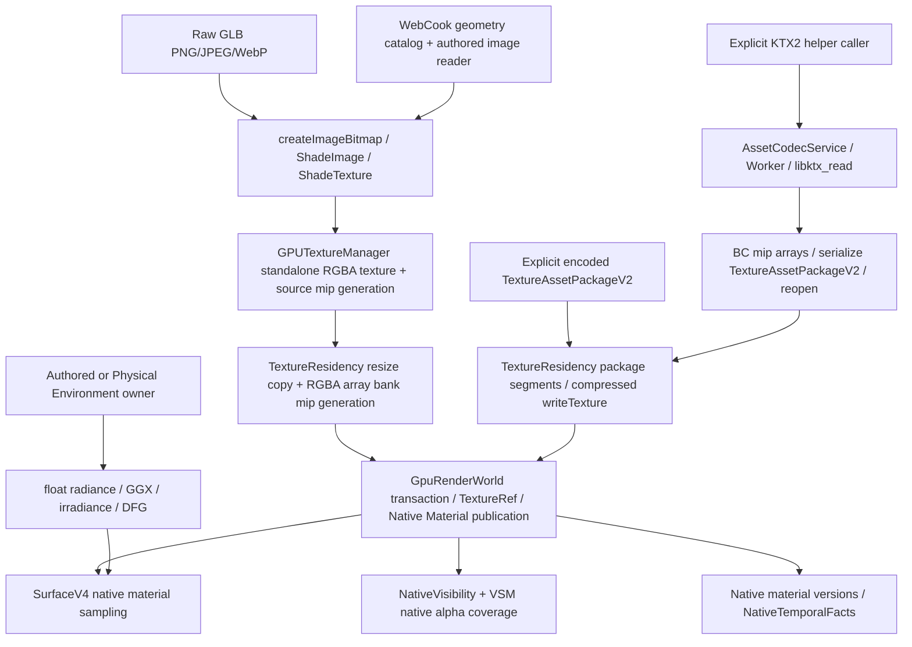
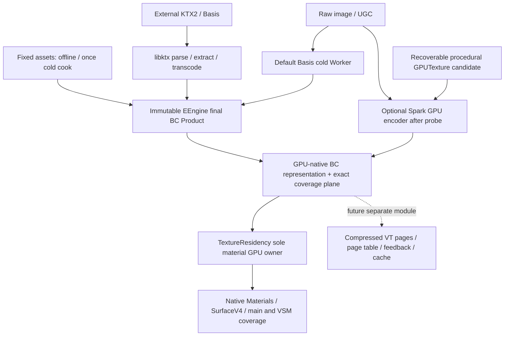

# PC-First GPU Native Texture Compression

这是 virtual-resources-v4 的 Texture Compression slice 设计 authority；阶段状态、施工入口和实测结果只在[执行计划](../next-execution/eengine-v4-texture-compression-execution-2026-10.md)。[V4 母稿](./eengine-v4-native-shading-2026-10.md)仍是全局 authority。本文区分已有源码与冻结目标，不宣称production切换或整个slice验收完成。

第一轮源码审查起点为 `579fd521b3e948ca2f3bb716aaec28f9d758cb0a`。第二轮复核 `99ca968aced19cd8fbe99b2fec6320e16b8f79e0`，仅交付Design V2。T4.0开工fetch后HEAD/origin/master=`b39f23a0e21a57c469cf2396d646ac80571fc48e`，production源码无变化；已跑真实Texture/codec/Spark component baseline，结果见Execution §9。下文仍区分当前实现、目标与候选，不以文档或component通过证明production切换。

## 1. 当前源码事实

### 1.1 实际数据流



| 层                    | 当前事实 / ownership                                                                                                                                           | 证据入口                                                                         |
| --------------------- | -------------------------------------------------------------------------------------------------------------------------------------------------------------- | -------------------------------------------------------------------------------- |
| Raw input             | GltfLoader 解 PNG/JPEG/WebP；required `KHR_texture_basisu` 明确拒绝；没有把公开 KTX helper 接入该 loader                                                       | `loaders/gltf/GltfLoader.ts`、`gltfTextures.ts`                                  |
| WebCook input         | Geometry 已是 Product；图像仍 range read 后 `createImageBitmap`，按 source/sampler/usage 缓存 Promise；失败 Promise 没有自动移除                               | `assets/web-cook/WebCookSceneSource.ts::createWebCookSceneSourceAsync`           |
| CPU asset             | ShadeImage 保存 decoded image；ShadeTexture 保存 sampler/usage 或 runtime package。当前 cache 的 usage 分 srgb/linear/normal，不是完整 scalar-channel identity | `texture/*`、WebCook mapper                                                      |
| Raw persistent GPU    | standalone source texture 与 RGBA array bank 并存；先 source mip，再 resize copy，再给整个 touched bank 生 mip                                                 | `GPUTextureManager.obtain`、`TextureResidency.stage`、`MipmapGenerator`          |
| Cooked persistent GPU | package segment 按 `variant.format` 创建 2D array，直接上传 encoded blocks。BC 不会又展开成 RGBA8                                                              | `TextureResidency.applyPackageSegmentPlans`、`stageTextureAssetPackageV2ToLayer` |
| KTX ingestion         | lazy WASM Worker 输出 BC；helper 再 serialize/reopen package。是可调用 codec 基础，不能据此称 authored GLB 已走 BC                                             | `Ktx2BasisCodec.prepareKtx2TextureAssetPackageV2`                                |
| Offline writer        | V2 writer 支持 final encoded variants；低质量 `ReferenceTextureCodec` 是 test-only，不是 production BC cooker                                                  | `TextureAssetPackage.ts`、`ReferenceTextureCodec.ts`                             |
| Shader binding        | native bindings 只声明实际用到的 bank/resource，静态 WGSL；不是 bindless，也不是总会绑定 9 张纹理                                                              | `NativeMaterialBindings.createNativeMaterialBindings`                            |
| Coverage              | main alpha-tested Visibility / VSM 共用 native alpha graph，自己的 geometry producer 提供 C/X/Y                                                                | `nativeMaterialCoverageProgram`、`NativeVisibilityPass`、`VsmAtlasRasterPass`    |
| Temporal              | 生产 NativeTemporalFacts 读 native material versions；旧 `temporal_facts.ts` 的 texture route reader 不是当前 pass                                             | `NativeTemporalFactsPass.ts`、`native_surface_aux.ts`                            |
| Transparent           | 当前 Renderer/FrameProgram 没有完整 authored transparent texture shading producer；classification/mask 留存不等于功能完成                                      | Renderer/FrameProgram、native pass 接线                                          |
| Environment           | authored octahedral source、radiance mip、GGX、irradiance/DFG 属独立 owner；主要 GPU 产品是 rgba16float                                                        | `GpuAuthoredEnvironment`、`GPUSceneEnvironmentManager`、PhysicalEnvironment      |

因此答案是：**BC compressed package upload 已存在生产可消费入口；真实 large authored GLB/WebCook 默认链仍是 decoded RGBA。** 不把 test fixture 的 BC 格式覆盖追认为所有 native material 数值正确。

### 1.2 当前容量、mip 和成本陷阱

- 5 个 RGBA size classes：256/512/1024/2048/4096；默认 layer 上限 64/32/16/32/2，实际可由场景配置改大。另有 4 个 package 槽位 × 最多 4 个 sets，最多 16 个 package segments，材质最多引用 4 个 package segments。
- segment 按 format/width/height/mipCount 精确分组；capacity 不原地增长，新批次容易新建 segment。logical descriptor capacity 又与 RGBA bank capacities 绑定，不能支持大目录而不一起增加 RGBA allocation。
- TextureRef ABI2 是 version4 / bank4 / routing2 / layer22；logical handle/generation 与物理 route 不同。一个 format 一个 GPU array，同 format 不同 base extent/mipCount 也不能混在同一个 array。
- 当前 `GPU_TEXTURE_BANK_COUNT=9` 的 5+4 分配是历史物理分工；native 实际资源生成不要求这套分工。完整 Standard graph 最多 10 个 texture roles，不能假定 4 package slots 足够。
- cooked coarse-first 会分配**完整 mip chain**，只先上传 tail；不是稀疏分配，不减少 reserved VRAM。alpha-mask 当前从 mip0 开始；base-color 含 alpha 不自动等价于 alpha-mask semantic。
- minMip 编码是有限 0..6/full，promotion 小于 6 会跳到 0；不是任意逐 mip scheduler。revision/minMip 在成功提交后发布，失败不能发布新 clamp。
- package uploader 将行补到 256B 并 `.slice()`；`queue.writeTexture` 本身不要求 256B row 对齐，encoder buffer-to-texture copy 才要求。GPU/driver copy 仍不可避免，不能宣称 upload 零复制。
- `physicalTextureExtent` 是 block upload footprint，**不是 GPUTexture base extent**。当前 createTexture 使用 source logical extent：没有 `texture-compression-unaligned` 时，非 4 倍数 BC base extent 不合法。逐 source mip 独立 round 也不等于合法 storage mip chain。
- T4.0 的 `decodedPeakBytes` 汇总 mip RGBA-equivalent 与 variation sidecar，836B=340B+496B，不是实际峰值。T4.1 已把 load evidence 升为 schema2，拆成 `rgbaEquivalentBytes`、`retainedSidecarBytes`、`actualDecodedPeakBytes:null`；历史失败保留，340B/496B 各自断言。`copyBytes=0`、transfer counters 不证明无内部复制。
- TextureResidency 分配 32MiB variation owner、stage/promote 写 variation/version GPU 数据。符号闭包没有当前 production variation-query GPU consumer；NativeMaterialBindings 只要 slot/generation/revision/minMip。旧 route 的 variation 字段仍被 CPU pack，但不证明 shader 有 reader。
- GPUTextureManager 的 source cache 没有独立 release/destroy API，GraphicsContext.destroy 未调用它；这是需审计的 owner 缺口，不能仅凭统计断言 driver 泄漏。切换后 material 不再创建 standalone source GPU texture；环境 owner 不顺带改写。

与旧文档/命名冲突：`desktop-bc` / `worker-transcoded` / `portable-rgba8` 是 package provenance/profile，不是完整 production 覆盖证明；`normal-linear → BC5` policy 不证明当前 signed XYZ consumer 正确；`hdr-linear` 候选为空，不代表 BC6H 已支持。

### 1.3 当前 KTX owner

本地 pin：KTX-Software v4.4.2，commit `4d6fc70eaf62ad0558e63e8d97eb9766118327a6`；vendor WASM 769,795B、JS 277,279B，WASM SHA256 `8336a23659f306c93f45816022dcdfae122f66eaf566488a2b7cf40e0bf65f0e`。2026-10-09 GitHub release 查询仍以 v4.4.2 为最新 stable；调查 upstream HEAD `4f2d7bc7e26d92b0f0e61a7381b92e48a4485a5d`，不自动升级。

当前 local header reader 读 80B、以 supercompression 0/1 猜 UASTC/ETC1S，拒绝 Zstd2，再让 libktx parse。它已超过 magic/byte-cap preflight，形成重复 semantic parser。upstream C texture 有 shape/levels；JS texture binding 有 colorModel/transferFunction/supercompressScheme/vkFormat，但**当前 read binding 没有完整暴露 numLevels/numLayers/numFaces/baseDepth**；createInfo 的同名字段不是 read texture getter。T4.1 在同一 upstream pin 上增加薄 read-only getter/error bridge 并重建，不能假装现有 JS 已可直接取得全部字段。

libktx constructor 将 JS 输入复制进 WASM，再创建 loaded texture；`getImage` 返回借用 heap view，本地逐 mip copy 在 delete/transfer 前必要。`finally delete()` 和 Worker transferable ownership 保留。当前 estimatedPeak=`max(8MiB,input×8)` 是调度估计；不是测量。默认最多 4 Worker、256MiB in-flight estimate、256 queued、3 failures，需要保留可取消/销毁行为，不把这些值认证为 4GB 预算最优。

薄 bridge 同时提供 upstream metadata-only parse（不带 `KTX_TEXTURE_CREATE_LOAD_IMAGE_DATA_BIT`）：先验证 dimensions/shape/levels/DFD 与预计 decoded/block bytes，再申请 cold-task credits 并加载数据。不能让很小 supercompressed input 绕过 host budget，先展开巨大纹理后才验证限额。Worker WASM maximum memory 与 task/output byte cap 有明确上限，超额明确失败并释放 credits；估计峰值与 actual linear-memory high-water 分开。不是另写 parser，也不增加本帧控制环。

### 1.4 T4.1 非production产品边界

`TextureProduct.ts` 实现 RuntimeAsset container2 / texture metadata3、共享 owned/disk validator、recipe/payload identity、完整 BC7/BC4 与有限 exact R8 planes。`PcTextureCook.ts`、`PcTexturePreparation.ts`、`pc-texture-worker.ts` 是 cold CPU producer，使用既有 WorkerPool；不创建 GPU owner。`writeTextureProductPlane` 仅对 caller-owned array layer 写 tight block rows，不 allocate/submit/publish；当前直接 consumer 只有独立 GPU oracle。

新 `vendor/pc-texture` 是 pinned Basis direct encoder 与同 pin libktx read-only bridge；shape/DFD/levels/Zstd 仍由 libktx 解析。输入只做 magic/byte cap，先持有 bounded task credit，再解析尺寸并验证 live decode/output 预算，最后 load/transcode。Basis retained heap硬上限160MiB、libktx96MiB，合计256MiB；统计是两 heap 长度之和，浏览器原生 decode/driver峰值仍 UNKNOWN。PNG/JPEG/WebP decode 在 Worker admission 后执行，bitmap finally close；不是生产稳定帧工作。

兼容 full-chain BC KTX 只提取 blocks，Basis 只 transcode；缺 mips/unaligned/需要 semantic 转换时才 canonical cook。完整 supplied/external mips 按 source domain 验证，再逐级映射到 ceil4 storage domain，额外 storage tail 复用 source 最后一层；不 normalize 已提供的 signed/non-unit XYZ。raw mip 仍 normalize-after-linear-filter；DFD transfer 与目标不同则只在 cold path 转换 RGB，alpha不做 gamma。save 才序列化，立即 upload 不 serialize/reopen。

**生产仍是原 schema2/原 KTX Worker/原 Residency 与 material 消费链。** 两套文件的暂存是执行计划要求的非production construction，不是 runtime selector/bridge。T4.2 才原子接线所有 consumers、退休重复 parser/old worker/raw source route；本轮不升级为 production adoption，不解决 GPU source-cache teardown。

## 2. 最终决策

| 对象                          | 决策                                                             | 原因与实施边界                                                                                                                 |
| ----------------------------- | ---------------------------------------------------------------- | ------------------------------------------------------------------------------------------------------------------------------ |
| Primary PC profile            | **BC REQUIRED**                                                  | adapter + enabled device 均验证 `texture-compression-bc`，不支持则初始化失败；无 ASTC→ETC→RGBA production 回退                 |
| Cooked path                   | **Final blocks → direct package → GPU**                          | 加载 cooked product 时 decode/transcode/codec Worker 启动均为 0                                                                |
| Raw PNG/GLB/WebCook           | **Cold cook ingestion 保留**                                     | 默认 Basis WASM 生成可持久化 BC Product；Spark 只按 §3.3 probe 条件成为 transient cold GPU cooker，不进 stable render hot path |
| KTX-Software                  | **KEEP + ADAPT 4.4.2**                                           | 保留成熟 KTX parser/transcoder；薄 metadata/error getters，委托 DFD/shape/Zstd/container validation                            |
| Basis Universal               | **ADOPT offline/cold BC encoder；DEFER standalone runtime 替换** | 实读 direct DDS BC pack；复用 block encoder，不经 Basis universal 中间格式；未测得替换 libktx 的收益                           |
| Spark GPU encoder             | **REFERENCE / OPTIONAL，T4.0 裁决 DEFER**                        | 真实1K/2K/4K probe已跑；stock submit/layer与canonical mips/recovery未闭合，raw WASM matched对照缺失。保留未来候选，不纳入T4.1  |
| ASTC / ETC2                   | **KEEP OPTIONAL，移出 primary**                                  | upstream/tooling 自然能力不删；production 不选、不打包、不启用对应 feature，不维护 primary test matrix                         |
| BC1 / BC3                     | **移出 primary**                                                 | 第一版不为更多组合维护选择矩阵；外部已编码输入在 cold import 标准化或明确拒绝                                                  |
| TextureAssetPackageV2         | **KEEP family/container，REVISE texture metadata schema**        | RuntimeAsset container schema2 不改；texture assetSchemaVersion 2→3，旧 cooked asset recook，禁止 runtime adapter              |
| TextureResidency              | **局部 owner 重写物理分配**                                      | 沿既有 transaction/refcount/fence 产品责任；所有 material 段按 BC format/extent 分配，删除固定 5 RGBA + 4 package 分工         |
| Binding/material              | **KEEP native exact resource sets，ALIGN route slots**           | 不造 Material Binding OS；去掉全局 4 sets/16 segments 限制，完整 descriptor 先验证限额                                         |
| Progressive mip               | **KEEP 有限 clamp/promotion 与 revision**                        | cooked full chain 离线生成，逐 mip blocks 上传；coarse-first 不声称减少物理分配                                                |
| Cooked runtime mip generation | **DELETE material 调用**                                         | cooked 已有完整 BC chain，无 load-time mip/filter/encode；cold GPU preparation 与环境 float mip owner 分开计费                 |
| Variation GPU                 | **DELETE 无消费者的部分**                                        | 保留 CPU publication revision/minMip、native exact Products/normal moments；删资源、dispatch 和对应表示测试                    |
| HDR / BC6H                    | **DEFER**                                                        | 独立 Environment 需要 source HDR→prefilter→BC6H→sampling 全闭环；当前动态 float/storage 产品不改                               |
| RGBA fallback                 | **不属于 production profile**                                    | raw decoded CPU input 和 effect-owned float texture 合法；不能以 fallback 让缺 BC 的 material 入场                             |

### 2.1 格式与质量合同

| 实际 semantic / channels                 | 第一版格式                                                          | B/texel 大尺寸近似 | shader / quality                                                                                   |
| ---------------------------------------- | ------------------------------------------------------------------- | ------------------ | -------------------------------------------------------------------------------------------------- |
| BaseColor、Emissive、SpecularColor RGB   | `bc7-rgba-unorm-srgb`                                               | 1                  | hardware sRGB→linear，一次转换；straight alpha，不 premultiply                                     |
| Normal / CoatNormal XYZ                  | `bc7-rgba-unorm`                                                    | 1                  | 保留 signed Z 和 mip 非单位长度；原 normal_scale、normal moments 不变                              |
| ORM RGB                                  | `bc7-rgba-unorm`                                                    | 1                  | 原 R/G/B 语义；拆 3×BC4 为 1.5B+3 samples，拒绝                                                    |
| 经 graph 证明只读单通道的 AO/coat/scalar | `bc4-r-unorm`                                                       | 0.5                | cooker 选 source R/G/A，native 静态 channel mapping 恢复该 role 的 vec4；同图多通道用途走 BC7      |
| 含 RGB 的非 coverage alpha               | BC7 保留 RGBA                                                       | 1                  | 不以 BC4 丢掉 RGB；透明路径本模块不新增                                                            |
| alpha-tested / shadow coverage           | BC7 RGB + **exact `r8unorm` alpha plane**；纯 mask 只需 exact plane | 2 / 1              | alpha 与 mip 数值和既有 cutoff 语义一致；main/VSM 使用同一 plane，不依赖 lossy BC alpha 的偶然结果 |

BC5 **DEFER 第一版 normal**：BC5 与 BC7 都为 16B/4×4，沒有额外 VRAM 节省；当前 graph 用 `RGB*2-1` 的 signed Z，XY 重建正半球 Z 会改变非单位 normal/mip variance。未来单独确立可证明的 normal encoding 后再用 BC5；本轮不提前更改 material 算法。Basis universal BC5 transcode 还可能从 R/Alpha 取通道，与 direct encoder 的 RG 不同，必须用语义验证，不按名称认定一致。

exact coverage plane 是有真实消费需求的有限语义产品，**不是设备/codec fallback**。BC4 和 BC7 alpha 有损，不保证阈值附近不翻转；禁止放宽 coverage assertion。alpha plane 以 canonical uncompressed mip reference 的 8-bit alpha 存储，线性/导数/LOD/地址模式保留。native lowering 分开 RGB 与 alpha 依赖，coverage graph 只绑定/读取 alpha plane；Surface 只在 alpha 输出需要时取 alpha。纯标量且无 exact coverage 要求才用 BC4。两个 plane 的成功 publication/retirement 同一事务，不允许 RGB/alpha 跨 revision。

需要 coverage 的 texture 在首次 publication 前上传 mip0 到 tail 的完整两套 plane，不能用 coarse-first 改变 alpha-tested winner；其他材质纹理保持现有 tail-first/minMip promotion。这样不引入两套 plane 独立 clamp 状态；同 image 同时供 opaque 与 alpha-tested material 使用时，该共享 product 按更严格 coverage readiness 入场。

不强行 channel-pack 使用不同 UV、sampler 或 mip recipe 的纹理。缺 map 的 constant/default 语义保留；缺 asset/capability/capacity 不得伪装成 default texture。T4.0 在编码结果前冻结 numeric assertions、有损质量预算、reference/camera/LOD；Basis BC7 选择 bc7e_scalar quality6，weights 按 semantic 固定。Spark 没有同名 quality6 等价保证，必须独立通过相同质量合同；不能为了启用它调低质量或放宽容差。

### 2.2 NPOT、mip 与颜色

基线不依赖新 optional `texture-compression-unaligned`。offline/cold cooker 对非 4 倍数 base extent 将**整个 UV domain 上采样**为 `storageW=ceil(sourceW/4)*4`、`storageH=ceil(sourceH/4)*4`；不 crop、不下采样，不贴 padding 后用 source/storage UVscale。source extent 独立保留，runtime `uvScaleBias=[1,1,0,0]`。既定 workload resolution cap 先明确作为同条件 recipe，不能为压缩再调小；超 device dimension/budget 则 admission 失败。

storage mip `w(l)=max(1,floor(storageW/2^l))`，h 同理，完整 levels=`floor(log2(max(storageW,storageH)))+1`；每级 upload footprint round 到 4×4，tail 1×1/2×2 仍一个 block。例如 source257→storage260，下一 mip logical130、physical132；不能给它旧 source mip128。GPUTexture 使用 storage base，BC 与 alpha plane 使用相同 storage chain；source/UV 与 mip byte footprint 分别验证。

Whole-domain 上采样会改变离散滤波结果，不能宣称与原 NPOT 逐 sample 位等价。T4.0 固定 raw/reference 与 canonical-storage 两组 NPOT sample/coverage 对照，T4.1 需证明边界/repeat/LOD 质量满足冻结预算；失败则修 cook/filter，不放宽预算或默默改成 crop。`texture-compression-unaligned` 只记录 capability，不在首版添加另一设备分支/asset variant。

source 色彩解释属于 cook key。RGB sRGB mip 在 linear 域滤波后重编码；alpha 始终 linear。**当前 raw `MIPMAP_FILTER_LINEAR_NORMAL_WGSL` 对过滤后的 XYZ 做 normalize**，不能说它保留非单位 mip 长度；native graph 则允许已提供的 signed XYZ/non-unit 数据。canonical recipe 要分别保留 source mip producer 的既有归一化行为和外部/已烘焙数据的consumer语义，不借压缩改 normal/roughness 模型；offline/reference filter必须有CPU/GPU oracle。标量/ORM在线性域滤波。BC hardware sRGB不沿用“解成linear再量化RGBA8 bank”的中间损失，不叠加shader pow。压缩质量与此前bank二次过滤差异分别记录。

## 3. Producer / Product / Consumer



图中 BC representation 是格式/语义汇合点，不是新增 Universal Buffer 或可序列化类型。CPU Product 与临时 GPU blocks 的 ownership 不同，不能把 GPUBuffer 冒充 immutable CPU chunks。

| 生命周期                             | 推荐 producer / 输出                                                                                                  | 不采用的绕行                                                                           |
| ------------------------------------ | --------------------------------------------------------------------------------------------------------------------- | -------------------------------------------------------------------------------------- |
| A Fixed production / cached WebCook  | native offline 或一次 cold cook → final BC Product/cache → 每次 load 只验证/上传/发布                                 | 不因 Spark 快就在每次启动 decode/encode                                                |
| B External KTX2 / KHR_texture_basisu | libktx parsing/extraction/Basis transcode → 同 CPU Product                                                            | 不做 KTX2→RGBA→Spark→BC；需 canonicalization 的不兼容输入按明确 cook recipe 处理或报错 |
| C Raw / UGC / runtime / procedural   | raw image 默认 Basis WASM；Spark probe 通过可填 Residency target。已在GPU的source仅候选GPUencode，不成立则DEFER该用途 | 不为调用 CPU encoder 把 GPUTexture readback→reupload，不建独立 texture owner           |

KTX2 是 external/import container，不是 Renderer abstraction。final BC KTX2 由 libktx cold extraction 写 RuntimeAsset manifest/chunks/checksums；不实现第二 KTX2 residency、不更换 container2。缺 mips、NPOT 或 scalar 通道不匹配时，upstream decode+同 recipe cook，不能将转码正常输入无故展开重编码。新增 import 不包括 HDR/cube/array，既有普通 GLB 功能不减少。

Offline primary 使用 Basis direct BC7/BC4 core；`dds_mode → process_source_images → build_dds` 是研究质量设置/packer的入口，T4.1薄 glue直接调用 scalar encoder，返回 per-mip blocks，不执行DDS container pipeline、不先编码 universal 中间格式、不自己 parse DDS。相同 core 提供默认 browser WASM cold cook，复用 bounded WorkerPool/Service；binary lazy，cooked load 不启动。CPU输出与 package-open 使用同一 validated view（owned mip chunks+metadata），立即消费不 serialize→parse，只有保存调用 writer。借用 WASM view 在 delete/transfer 前一次 owned copy；shared archive 不可误 detach，hash/validation 每个 immutable package 加载一次。

### 3.1 Texture asset metadata schema3

| 字段            | 合同                                                                                                                                           |
| --------------- | ---------------------------------------------------------------------------------------------------------------------------------------------- |
| identity        | sourceContentHash、sourceByteLength、sourceUri/provenance、cook recipe hash、codec revision/binary hash；assetId 内容寻址                      |
| extent          | sourceWidth/Height 与 storageWidth/Height；storage mapping 固定 whole-domain resample、UV identity；超限拒绝                                   |
| semantic        | color/normal/ORM/scalar role、source channel、transferFunction、straight alpha、coverageRequired；不同解释不能误 dedup                         |
| planes          | 一个 color/normal/ORM/scalar BC plane；需要 coverage 时一个 exact R8 plane；每 plane format/block layout/完整 mip chunks；不造任意 plane graph |
| channel mapping | 有限 RGBA selectors（source channel/0/1），native 编译为 static component/constant；不扩大每像素动态路由分支                                   |
| mip             | level、storage logical dims、physical block extent、chunkId/bytes/checksum；strict complete contiguous chain，验证精确 byteLength              |
| capability      | PC BC feature，texture dims/layers/usage limits；只有一个 primary final variant，provenance 不参与 hotpath negotiation                         |
| recipe          | 原 authored quality cap、canonical filter/edge mode、alpha policy、encoding settings；变更产生新 identity                                      |

新 texture metadata schema 必须 bump；原名 `TextureAssetPackageV2` 的 container 家族可保留，类型/constant 清楚声明 texture schema3，不能继续声称接受 metadata2。旧 assets 离线 recook，旧 primary variants/schema tests 迁移；不写隐式 runtime conversion。public Shader Material graph 本身不换架构，native constant routes 增加 static channel/plane glue。

### 3.2 Residency 与绑定容量

TextureResidency 仍唯一 material GPU owner；用现有 package array segment 作主物理表示。segment key=`format + storage extent + mipCount`，layer0 为该段 neutral/default，其他层为 live content。去掉固定 RGBA banks 和全局最多16段：段数按真实 capacity、GPU bytes budget、live/retiring accounting 有界，**不是无限增长**。

第一版物理策略：stage 批次预先统计 fresh layers；优先填已有 free layers，不扩大 live GPU texture；不足时创建新 immutable segment，容量为本批需求+1（受 maxTextureArrayLayers 与预算约束，超出拆段）。不预留大量 speculative layers；有消费者才分配，空段 fence 后回收。跨批次 fragmentation 纳入 acceptance，不先造 defrag/allocator OS。

logical descriptor slots 由 live/pending/retiring unique contents 决定并受显式 descriptor-byte budget，不能从 RGBA bank capacities 推导。payload 同 content/recipe 可以共享 GPU layer；sampler 独立。不同 semantic 导致不同 bytes/mapping 时 cook identity 必须分离；重复 image 不必因不同 sampler 复制 block payload，若 mip edge recipe 不同则不能共用。

BindingSet 只是 material-local immutable resource tuple，供现有 native bins 比较 exact resource identity；取消 global 4-set quota、每材质4个 package限制。物理 TextureRef 保留 u32 的 version4/bank4/routing2/layer22 形状，version bump3，bank改为 material-local slot0..15（最多16个实际 segments，包括 alpha plane）；layer>0、u32 invalid、external logical generation/context 保留。不往 ref 塞 universal swizzle：channel/plane 在 native compiled callback。

`GPU_TEXTURE_BANK_COUNT=9` 退出固定全域 bank 含义。最多16个 route slots 是 ABI 上限，**不等于 device 能绑定16个 material纹理**。逐完整 descriptor 算实际 sampled/sampler/storage/uniform/resources；现有 native Surface fused providers 占7 sampled（Visibility1+IBL3+VSM1+AO1+Sun1），packed native exact Products 再占1，coverage alpha plane另占1。10个独立 Standard maps+packed Products+alpha+全 providers 的保守需求是19。

初始化只协商所需 sampled上界：adapter>=19 时 request19，adapter16..18 时 request其可支持的这一下界区间，最低16，caller-owned device 同检查；不是复制全部 adapter limits。material/scene plan在创建纹理之前运行完整 descriptor admission，超过实际 limit 明确失败并保留旧 Scene，不能遗漏地图、压缩 Products、降画质或新增 renderpass逃限。既有 finite sun continuation 保留，但不能宣称解决所有 overflow；它仍需完整 preflight。T4.0 在目标1650上记录16/19可用性与完整目录最大实际 footprint，T4.2不得让原本可接纳的 authored catalog 因 format fragmentation失败。

CPU BindingSet 数随实际 immutable resource combinations，有显式 live/pending/retiring计数与现有 native bin/queue限额；不是16段全域上限，也不是16^N预枚举。large directory 的 unique segment数量不直接成为单个shader的资源数；dynamic material-instance identity不生成新shader。稳定 frames不重建bindings、不全扫 evidence。

### 3.3 Optional raw GPU encoding：事实与接入选择

Spark **是 GPU encoder**：raw RGB/RGBA/GPUTexture→BC；libktx 是已有压缩中间表示→BC 的 parser/transcoder；VT 是寻址/feedback/residency/streaming/cache，三者不互相替代。以下事实固定在 §5 pin，不是 EEngine 已实现能力：

- `encodeTexture` 接 URL/Blob/decoded image/GPUTexture；按需建 RGBA8 input、NPOT/flip 临时 texture，先 mip/filter，再 compute 写私有 `STORAGE|COPY_SRC` block buffer，最后 `copyBufferToTexture`。BC7/BC5 输出 u32×4，BC4/BC1 u32×2；encoder workgroup16×8，每 invocation 一个 block，行 stride 配合 256B padding。API 只返回 GPUTexture，不暴露 buffer/layout。
- `outputTexture` 默认是 hint，extent/format/mips 不匹配会分配并返回另一张 standalone texture。显式 `outputMipLevel`（含0）才 strict；copy destination 没有 origin/layer，隐式 z=0，未验证 array depth。匹配 array 的 layer0 可以作为 probe，不等于能写 Residency 的 live layer>0；layer0 在本地是 neutral。
- 自建 command encoder、自行 `queue.submit`；Promise 返回表示已提交，不是 GPU完成。默认输出只有 `TEXTURE_BINDING|COPY_DST`，不含 COPY_SRC。不能原样把返回纹理搬进现有 CPU-chunk uploader，更不能接 three-gltf 的 ExternalTexture 支路。
- 默认 mip 到4×4，显式 full count 才到1×1。utils box/magic filter、alpha weighting/scaling、normal normalize 与当前 canonical recipe 不自动等价；`normal:true` 和 `format:auto` 可能选 BC5。首版明确 BC7 normal、关闭 auto；先用 EEngine canonical mips 逐级 encode，只有 oracle 证明等价才用 Spark mip generator。exact R8 coverage 同 recipe、同事务，不取有损 BC alpha。
- GPUTexture 可在无 resize/flip/mipgen 时借用；有 mipgen 会 copy base 到 input，需合法 format/usage。缓存 input/tmp/output 持有 high-water 到 free/dispose；非缓存资源在内部 submit 后 destroy。没有 EEngine epoch/abort/fence/accounting 接线，也没有覆盖整个 allocation/encode 失败区间的清理合同。
- auto GPU channel detection 有 submit→wait→mapAsync 的控制环，**禁止采用**。仅 preload/use `bc7-rgb`、`bc7-rgba`、`bc4-r`；不启用 ASTC/ETC/BC1/BC5。无 shader-f16 时 upstream 会重写 f16→f32，1650上必须实际 compile/quality/time，不推定硬件半精度吞吐。
- `getTimeElapsed` 另 submit query resolve、wait、map；无 query 返回0不能称0ms。pin 的 compute pass descriptor 用 `writeTimestamps`，现 WebGPU字段是 `timestampWrites`；probe 必须用 EEngine有效 timestamps/validation scopes，不照抄 demo数字或将诊断等待算 encode CPU。

| Shape                                      | Ownership / copy / 接口成本                                                                                                                    | 决策                                                                                |
| ------------------------------------------ | ---------------------------------------------------------------------------------------------------------------------------------------------- | ----------------------------------------------------------------------------------- |
| S1 standalone Spark GPUTexture→Renderer    | stock API 可做 demo，但独立 persistent texture/binding/recovery owner 会碎片化；返回纹理默认不能 COPY_SRC                                      | **REJECT** 第二生产纹理 owner；只用于隔离 evaluation                                |
| S2 caller-owned Residency destination      | outputTexture 有基础，但缺 layer、caller encoder、strict identity、transaction cleanup；薄 JS 适配把 blocks 直接 copy 到已预约 array layer/mip | **条件推荐**。仍有必需 block-buffer→array copy，没有额外 standalone BC texture/copy |
| S3 encoded GPUBuffer+layout→Residency copy | buffer 私有，非公开 API；需薄 JS 暴露 encoded ranges/临时 ownership，EEngine 做最后同一次 copy                                                 | **次选**，仅 S2 不易安全适配时；不自改压缩算法，不读回 blocks                       |

S2/S3 采用前：异步 decode/pipeline warmup 在 transaction 前完成；Residency 先完整 admission/reservation，cold job 使用调用方 command context，不 await/私自 submit。临时 input、参数、output buffer 按 job 完整保留：移除 Spark 内部 submit 后，不能继续共享一个会被后续 `queue.writeBuffer`/external source upload 覆盖的 uniform/input cache。按预算分配独立 job ranges/resources，或证明 command 内串行 copy/mip/encode 可安全复用；提交/中止/失效都由 EEngine last-use fence 退休。不是简单增加两个 options 就完成接入。prepared cook 可在既有统一提交内编码；stock API 独立 submits 只允许隔离 probe，并实记数量。

如果 probe 通过，Spark 是 **Transient Cold GPU Cooker**：共享 semantic/format/recipe/admission/native publication，短期 GPU work receipt 不新增 Spark Product/Residency 类。GPU结果不自动成为磁盘 immutable Product；保留 raw CPU bytes/URI identity 或可重放 procedural recipe 供 loss/retry，source GPUTexture 由原 owner 持有直到 last-use。无法重放的 dynamic source 不纳入本 slice。生产 load 不为持久化做 compressed GPU readback；可不缓存本次 GPU结果，或由独立后台/offline Basis cook 创建 final BC cache，后续固定加载 direct。成本需包含未缓存时再次 cold encode/recovery，不假装 permanent cache 已存在。

默认仍用 Basis WASM browser cold cook：易产出 CPU-owned chunks/cache/recovery。Spark 只有同质量、cold CPU/wall 有可重复收益且临时 GPU预算/渲染竞争可接受时才取代该用途；外部 KTX 和固定 cooked 主链不变。无收益 REJECT 当前 slice；接入仍不闭合则 DEFER，不阻塞强制 BC Product 路线、不造动态 registry。

## 4. Lifetime / publication

| 产品                                       | 创建 / writer                                                        | reader                          | lifetime owner                                                                         |
| ------------------------------------------ | -------------------------------------------------------------------- | ------------------------------- | -------------------------------------------------------------------------------------- |
| source/cooked CPU bytes                    | loader/cooker 或 range source，immutable chunks                      | cook/Residency upload/recovery  | asset/scene CPU source；GPU loader不拥有长期资源                                       |
| codec task/WASM                            | Service/Worker upstream                                              | cold ingestion                  | Service，取消/销毁/失败可重试；bounded bytes credits                                   |
| GPU BC/alpha arrays                        | TextureResidency allocate；CPU blocks upload 或获准 cold encode/copy | native Surface / coverage       | GraphicsContext内Residency；最后引用与last-use fence                                   |
| optional GPU cook 临时 input/params/blocks | cold job writer，caller-owned command context                        | encode + Residency array copy   | cook job 有界暂存；abort/submit/loss 按 last-use 退休，不成为 persistent texture owner |
| logical descriptor / generation / minMip   | TextureResidency transaction                                         | native bindings/publication     | Residency，generation耗尽明确拒绝不截断                                                |
| native binding/constants/version           | GpuNativeMaterialScene/Publication                                   | Surface/Visibility/VSM/Temporal | 既有 publication candidate/active/fenced retire                                        |
| environment float GPU                      | Authored/Physical Environment                                        | Surface/IBL                     | 独立 environment owner，保持当前 fence                                                 |

按 `GpuRenderWorld.stage → texture plan/upload → material/native candidate → command onFinished commit`，abort不改变active material/clamp。submit成功不等于GPU完成；移除最后引用/Scene replacement后等真实 `command.gpuDone` 才recycle/destroy层/段，object+generation+device epoch guard 防止晚fence删除replacement。共享Product由引用持有，borrowed source不因一次Scene release错误销毁。

`queue.writeTexture` 即刻入队，abort不能撤销。upload前必须完成preflight和reservation；fresh失败层以及promotion已写区间进入quarantine，等覆盖这些queue writes的completion token后才复用。成功可用已有统一submit的queue fence；abort没有submit时允许completion registration，不额外frame submit、不做GPU→CPU→GPU控制。active promotion失败只保留旧minimumMip；写入更细mip不代表提前可采样。一次new revision不能暴露半套RGB/alpha。

device loss：先撤销publication/停codec或失效task epoch，再销毁旧设备owners；晚Worker/fetch/map callback不得进入新stage。恢复从仍保留的CPU Product，或 raw bytes/replay recipe 重 cook 后重建 Residency，不把 detached Worker buffer/旧GPUTexture 当 recovery source；failed Promise 从 cache 移除、同 identity retry。optional GPU job 在未提交 abort 时释放未使用资源；已有 queue writes 的输入以及已提交临时资源按真实 completion quarantine，不能销毁后发布空 target。每个 job 使用 object/generation/epoch guard；late completion 不替新 Scene commit。

readback 仅 delayed diagnostics，不参与本帧 texture readiness；Spark 编码的 BC blocks 不为 load/cache 做 GPU→CPU→GPU。release/abort 分别验证 pending/live/retiring/decoded/Worker/cook-temp/banks/metadata（允许共享 Scene/effect 引用，分 owner 记账）。借用 procedural source 的 ownership 不转给 encoder；源不可重放则 future dynamic use 单独设计。

删除 variation GPU buffers/builds/old CPU packed variation fields之前重跑直接consumer搜索；保留 native Products/normal moments和publication语义。`AppearanceStaticResidency`共享helper若仍有活跃非纹理用途不机械删除。原旧temporal shader/helper若无人使用可删除，不能为删buffer恢复旧Temporal owner。

## 5. 开源 Source Map

以下记录实际源码阅读和采用边界。T4.1 的 Basis/libktx 非production构建已落在 `OEngine/tools/texture-codec`，binary/glue hashes 与编译器记录在 `vendor/pc-texture/source.json`，NOTICE/各依赖license同目录保留；独立 oracle 结果见Execution。producer glue 与上游未修改 core 分开记录，production adoption 仍须 T4.2 全消费者接线，不以 vendor 文件存在替代证明。

| Reference / pin / license                                                                                                                                                                                                                    | 实读 hot path                                                                                                                                                                                                                                                                                                                                                                                                                         | Local / Adopt / Adapt / Reject                                                                                                                                                                                                                                                                                                               |
| -------------------------------------------------------------------------------------------------------------------------------------------------------------------------------------------------------------------------------------------- | ------------------------------------------------------------------------------------------------------------------------------------------------------------------------------------------------------------------------------------------------------------------------------------------------------------------------------------------------------------------------------------------------------------------------------------- | -------------------------------------------------------------------------------------------------------------------------------------------------------------------------------------------------------------------------------------------------------------------------------------------------------------------------------------------- |
| [KTX-Software v4.4.2](https://github.com/KhronosGroup/KTX-Software/tree/4d6fc70eaf62ad0558e63e8d97eb9766118327a6)，Apache-2.0及per-file第三方许可；额外调查HEAD `4f2d7bc7e26d92b0f0e61a7381b92e48a4485a5d`                                   | `interface/js_binding/ktx_wrapper.cpp` ctor/getImage/transcodeBasis/embind，release `lib/texture2.c::ktxTexture2_CreateFromMemory/inflateZstdInt`（HEAD移入`lib/src/`）、`basis_transcode.cpp::ktxTexture2_TranscodeBasis`、LICENSE.md                                                                                                                                                                                                | Local Ktx2BasisTranscoder/worker/vendor。KEEP parser+DFD/transcode、borrowed-memory deletion；Adapt read metadata和失败error bridge、关闭不需要GL/ETC software unpack；Reject重复JS semantic parser及broad renderer format negotiation                                                                                                       |
| [Basis Universal](https://github.com/BinomialLLC/basis_universal/tree/99f52d63aa6799cbdaecfe977111dc5ec3b31d47)，pin `99f52d63aa6799cbdaecfe977111dc5ec3b31d47`（不是v2_50 tag），Apache-2.0+NOTICE/per-file notices；latest stable查询v2_50 | `basisu_tool.cpp::dds_mode`、`encoder/basisu_dds_export.cpp::build_dds/pack`、`basisu_bc7e_scalar.*`；`transcoder/basisu_transcoder.h`、`webgl/transcoder/basis_wrappers.cpp` ktx2_file / transcodeImageWithFlags                                                                                                                                                                                                                     | Local thin offline/native+WASM cook integration。Adopt direct BC7高质量/BC4 encoder；Adapt per-mip block output，不写DDS后自己parse；Reject把BC5 RG与R/Alpha转码混同、额外Basis中间编码。standalone runtime替换DEFER：没有matched启动/吞吐/peak实测，wrapper也有输入/输出copy                                                                |
| [Twinklebear/webgpu-gltf](https://github.com/Twinklebear/webgpu-gltf/tree/bdfc2e562b30d303700aa533a11cec7b971d9c3f)，MIT                                                                                                                     | `src/glb_import.js` imageBitmap/createTexture/copyExternalImageToTexture，LICENSE.md                                                                                                                                                                                                                                                                                                                                                  | Local raw GLB路径对照。**该pin没有KTX/BC upload实现**，Reject将其当compressed donor或移植renderer；只参考raw upload与明确sRGB descriptor，原source也有semantic TODO                                                                                                                                                                          |
| [Three.js](https://github.com/mrdoob/three.js/tree/e9a8a1264c58150907230122ac17f5760a1ebab1)，MIT                                                                                                                                            | `examples/jsm/loaders/KTX2Loader.js` Worker init/transfer/transcode/dispose；`src/renderers/webgpu/utils/WebGPUTextureUtils.js::_copyCompressedBufferToTexture/writeTextureLayer`；LICENSE                                                                                                                                                                                                                                            | Local Worker生命周期和package uploader。Adopt lazy codec、finally清理、按block tight rows逐mip/layer writeTexture；Reject万能fallback priority与renderer架构                                                                                                                                                                                 |
| [Ludicon/spark.js](https://github.com/Ludicon/spark.js/tree/b9ea643a08cb9eef3a9ddc64564089bdd6fd0daf)，pin `b9ea643a08cb9eef3a9ddc64564089bdd6fd0daf`，package0.1.6；JS MIT，shaders 独立 EULA                                               | `src/spark.js::encodeTexture/loadPipeline/generateMipmaps/computeMipmapLayout/getTimeElapsed/freeTempResources`（部分为 private）；`utils.js::resolveOutputTexture/resolveMipmapCount`；`shaders/spark_bc7_rgb.wgsl`、`spark_bc7_rgba.wgsl`、`spark_bc4_r.wgsl`、`spark_bc5_rg.wgsl`、`spark_bc1_rgb.wgsl` 的 sample/block store/entry；`utils.wgsl` mip/normal/alpha；`three-gltf.js`、API/types、output/caching tests、LICENSE/EULA | **REFERENCE / OPTIONAL** cold GPU encoder，T4.0 已裁决 **DEFER**，14-case component artifact不提升production adoption。拟 Adapt MIT JS command/array-target/temp ownership glue，不重写 shader；Reject three-gltf ExternalTexture、自动 RG normal、catch→RGBA 与 broad format selection。不 vendor proprietary Spark shaders 到 EEngine 源码 |
| [WebGPU living spec](https://gpuweb.github.io/gpuweb/)，读取2026-10-09                                                                                                                                                                       | texture creation、texel copy layout、GPUQueue.writeTexture、`texture-compression-bc`与`texture-compression-unaligned`                                                                                                                                                                                                                                                                                                                 | normative contract，非codec donor。Original是EEngine PC profile、typed semantic产品、material-local residency/lifetime integration                                                                                                                                                                                                           |

KTX LICENSE 明确 `external/etcdec/etcdec.cxx` 是特殊 Ericsson non-open-source license，GL ETC软件解码可通过 `LIBKTX_FEATURE_ETC_UNPACK=NO` 不纳入新build；不能把整个vendor笼统称“全Apache”。保持已vendor完整licenses，新build保留实际依赖BOM/notices；Basis修改文件标变更并附NOTICE，BC7派生文件也保留来源版权。当前direct encoder LDR，`build_dds`不提供完整BC6H cook；transcoder列有BC6H不证明HDR owner闭环。

Spark [repository LICENSE](https://github.com/Ludicon/spark.js/blob/b9ea643a08cb9eef3a9ddc64564089bdd6fd0daf/LICENSE) 区分 JS MIT 与 proprietary shaders。[EULA](https://ludicon.com/sparkjs/eula.html)（更新2026-05-26，读取2026-10-09）允许个人/教育研究；商业 Product 有 US$100k 门槛及 attribution，engine/toolkit 分发限 evaluation，商业超范围另需许可。[官网 licensing](https://ludicon.com/spark/#licensing) 不覆盖该特定条款。**本项目学习研究可评估，许可不阻塞本轮/T4.0，不要求购买或联系厂商**；未来商业分发另核。JS 薄适配保留 MIT notice，shader 作为外部依赖及所需 attribution，**Do not vendor proprietary Spark shaders into EEngine source**。不把 shader 称 MIT，不将 EULA 误读为禁止修改 JS，也不声称已获商业授权。

## 6. Cost Cards 与测量边界

定义 `B_f(W,H)=Σ_l ceil(w(l)/4)*ceil(h(l)/4)*blockBytes`；BC7/BC5 block16B、BC4 block8B；RGBA=`Σ4*w*h`，exact alpha=`Σw*h`。以下是**ESTIMATE：布局精确算术，不是driver VRAM实测**，包含完整mips/tail，不含segment空层、metadata、driver overhead。

| storage base | RGBA8 chain B | BC7 chain B | BC4 chain B | BC7 + exact R8 alpha B |
| ------------ | ------------- | ----------- | ----------- | ---------------------- |
| 1024²        | 5,592,404     | 1,398,128   | 699,064     | 2,796,229              |
| 2048²        | 22,369,620    | 5,592,432   | 2,796,216   | 11,184,837             |
| 4096²        | 89,478,484    | 22,369,648  | 11,184,824  | 44,739,269             |

### 6.1 四条路径与 break-even

bytes公式为ESTIMATE；当前实测见Execution §9和 `OEngine/benchmarks/texture-compression-t4-0.json`，§6.2仅历史输入。actual host/driver峰值与GPU copy独立时间仍UNKNOWN，不使用Spark demo认证EEngine。

| 成本             | 当前 raw RGBA baseline        | KTX2/Basis Worker→BC                                | Spark raw GPU encode→BC（候选）                                                          | Cooked BC direct（固定资产）                               |
| ---------------- | ----------------------------- | --------------------------------------------------- | ---------------------------------------------------------------------------------------- | ---------------------------------------------------------- |
| Input/用途       | PNG/JPEG/WebP decoded         | 已压缩 external KTX2                                | raw/UGC/GPUTexture，保留 replay source                                                   | final BC archive/chunks                                    |
| CPU              | browser decode/mapper         | init/queue/libktx/transcode/owned copy；当前 repack | browser decode/command encode/plan；cold pipeline init 单列                              | metadata/chunk checks/plan/publication；decode/transcode=0 |
| Host peak        | decoded/source bytes          | input+WASM high-water+owned blocks/repack           | source encoded+decoded+job metadata，GPU source 本身不算 host decoded                    | retained package/views/bounded staging                     |
| Upload/copy      | RGBA source+resize            | BC blocks writeTexture                              | RGBA source upload；mip/NPOT source copy；encoded buffer→BC array copy；exact alpha 单列 | tight BC/R8 rows，无编码/源RGBA上传                        |
| GPU temp         | standalone source+mips        | upload 暂存（可观测部分）                           | RGBA chain+NPOT tmp+padded block buffer+in-flight/cached jobs                            | 有界 upload 暂存，無 codec temp                            |
| Persistent GPU   | RGBA banks/variation/retiring | BC/R8 arrays/neutral/free/retiring                  | **同一 Residency arrays**；不额外持有 standalone BC texture                              | 同左                                                       |
| Commands/submits | 原 Renderer 接线              | Worker 不加 frame submit                            | stock 内部 submit，仅 probe；拟 S2/S3 caller encoder，同 frame submit                    | 原统一 frame submit                                        |
| Mip/caching      | source+bank两次 GPU mip       | 完整 BC chain，无 runtime compressed mip            | cold GPU encode 每 mip；canonical full chain/exact coverage；GPU结果不自动形成 CPU cache | offline full chain，tail upload/promotion，runtime mip=0   |

定义每路径完整 critical wall time（重叠时用实测 critical span，不把阶段和简单相加当证据）：

```text
Tdirect = IO(final BC) + upload + publication
Tbasis  = IO(KTX2) + Worker init/queue + WASM transcode + CPU ownership copy + upload + publication
Tspark  = IO(raw) + browser decode + source upload + GPU mip/filter + GPU encode + block copy + publication
          [cold pipeline/library init 单列并计入 cold wall]
```

Browser **raw WASM encode** 另测 `IO(raw)+decode+Worker init/queue+BC encode+owned copy+upload+publication`；它不是 Basis transcode 数字。比较 Spark 与它才回答 browser cold cook 选择，不能拿不同 source/decode 条件混比。Spark 相对 direct 的可能收益只能来自更小 source IO/已有 GPU source：节省 IO 的 `(B_direct-B_raw)/有效吞吐` 必须大于 decode/upload/mips/encode/copy/init 新增 critical 成本，并计正常 Renderer 的 GPU争用。Basis 的比较同理：节省 init/transcode/copy 是否抵消较大 BC package 的 IO；结果可能随冷/暖 cache、网络不同，默认固定资产仍 direct，不引入在线选择系统。

Spark buffer allocation=`Σ align256(ceil(w/4)*blockBytes)*ceil(h/4)`；有效 encoded/copy texel bytes 是 §6 的 `B_f`，padding allocation 不冒称真实 GPU总线流量。ideal 已有 canonical GPU mip source 只需 encode+一次 blocks copy；expected raw 要 RGBA上传/mips及参数暂存；worst NPOT scratch+cached high-water+多job in-flight+old/new target/retiring。cached buffer 的增长和 destroy 后 in-flight bytes 都入 peak ledger。S2/S3 不新增第二次 BC texture→array copy，必须的一次 buffer→array copy仍付费。

stock full-chain encoder：L 次 encode dispatch，单 compute pass，L 次 copy；mips 另 L-1 次 dispatch（compute模式单 pass，fragment模式逐级 pass），resize/flip 额外 work。canonical 每 mip 调用要记实际增加的 pass/bind group/job scratch，不能沿用 stock 理想数。shader f16→f32、BC7 encode ALU/private memory、硬件 block decode/cache/DRAM 都 UNKNOWN，需实际GPU时间，不能仅用 ratio 宣称吞吐。

0/50/100% cooked coverage：0%全额 cold成本，50%仅为 raw 半数付费、相同 semantic recipe 去重，100%正常固定生产 encode/Worker/decode 为0。BC7理想有效 resident/upload节省约75%、BC4约87.5%、exact alpha双plane约50%；allocation碎片与临时 RGBA不能隐去。无消费者 variation32MiB、旧 resize/mip退休收益独立归因。GPU encoder不进 stable render workload；后台 cook 若与帧争用使 P95变坏，可 DEFER，不以装入预算就宣称收益。

T4.0 Spark evidence 必须包含 source encoded bytes、decode/init/queue/CPU main thread/wall、GPU encode/mip/copy、host/GPU temp峰值、encoded/padded/upload/copy/persistent bytes、commands/submits、first texture ready/full mip ready。ready 要区分 submitted 可队列消费与实际完成，不使用 encodeTexture Promise 当 GPU完成计时；timer/diagnostic submits/waits 单列。没有 query/driver counters 时 UNKNOWN，不填0。

Residency ideal为exact live blocks；expected加neutral/free容量与metadata；worst replacement peak=`old live + new live + retiring + pending upload`。fragmentation=`allocated block capacity-live block bytes`，预检加入retiring后仍超预算就延迟/拒绝publication，不能破坏old scene。每像素sample/read成本使用实际native graph，包括C/X/Y与coverage；不将compression ratio当DRAM硬件counter。register/spill/bandwidth均UNKNOWN除非有counter。

### 6.2 已有实际 artifact，仅作历史输入

已读取 `.local/validation/2026-10-08T16-02-26-761Z-lighting-acceptance-e2d764bb-a318-4fac-a296-51e7d7d12ce6/result.json`：commit `f36b2feca13409179a957c2c82b3c9cb912bd1d8`，**dirty:true**，engineSourceSha `ee84ed30f0a750d2d4c73a530b66b31a0571d08ae63099d34c62958578b8d981`，hostBuildId `1a55a25b74acc5375d2317431e8221363eda3ebd08f703d1080e8f740304b4c9`，Chrome154.0.8037.98。workloadSha `1e806834c189df03355ea9801fea7d2411b6bcf3d7178835a3557e0cbc085a11`，quality为complete-authored-textures-512-native-v4。

**MEASURED historical software accounting**：518 unique texture routes，RGBA最大bank容量749,381,536B，materials+texture allocated793,030,832B，residentLogical346,537,572B，resident textures518；capability记录BC。artifact无完整TextureResidency ledger，不足证明518都BC、source bytes或driver VRAM。不能把793MB直接除4，也不能当当前HEAD baseline。**用户已永久排除477MB模型，不再补跑该目录。** 新baseline用dungeon完整25张2K纹理、保留原尺寸；不与66 Products/518 routes等价，不用它追认历史large acceptance。

## 7. VT seam、验收与施工结论

保留 per-mip format/extent/chunk/range/hash/source recipe，这是未来whole texture→compressed page source的必要seam。KTX2 level index是整级，不是2D page index；当前mip chunk也不意味着具备VT gutters/borders/page addressing。未来离线从source/mips构建带border的BC pages，runtime始终compressed storage→physical cache；不把今天BC整级当可无损重新拼border的完整VT page产品。

本slice不创建feedback/page table/page scheduler/eviction学习系统。wholetexturebudget与fenced segments只是当前真实residency责任；后续VT重新按实际consumer设计。Environment BC6H、完整transparency、跨手机/WebGL/Safari均不扩展本轮范围。

`Texture Memory ≈ ResidentPageCount × BytesPerPage`：VT 减少 resident pages，BC 减少每页 bytes，两者是乘法收益，不是互替。Spark 未来最多成为 dynamic/procedural/decal-bake page 的 optional GPU encoder，直接写 BC physical page；它不负责 virtual address/table、feedback、调度、eviction/cache policy 或 gutters。这里只保留 compressed format/recipe/target-copy/replay integration point，不创建 `IVirtualTexturePageEncoder` 或任何 VT API；page borders/filtering 在未来 VT owner 闭合。

验收需真实GPU证明format、sampling、sRGB一次解码、normal signedZ/length、ORM channels、exact main/VSM alpha、NPOT/repeat/tail/derivatives/LOD、progressive clamp、generation与replacement/abort/retry/loss/fence。source catalog全部覆盖、同quality不减少maps、compressed distribution和owner accounting可核对；historical测试通过不代替当前product消费。现有tiny texture component仅4×4 RGBA clamp，不足作BC闭包。

施工状态与下一授权边界只读[Execution](../next-execution/eengine-v4-texture-compression-execution-2026-10.md)。Spark=DEFER，不继续候选研究或建立第二Residency；source cache lifetime 与旧 production 路线的 NPOT/consumer 接线留给 T4.2。非production product 通过不等于压缩生产验收。后续用dungeon原尺寸完整catalog与1K/2K/4K语义矩阵，477MB/66Product性能与本轮完整Renderer frame测量均未运行。T4.3结束STOP，不自动开始VT。
