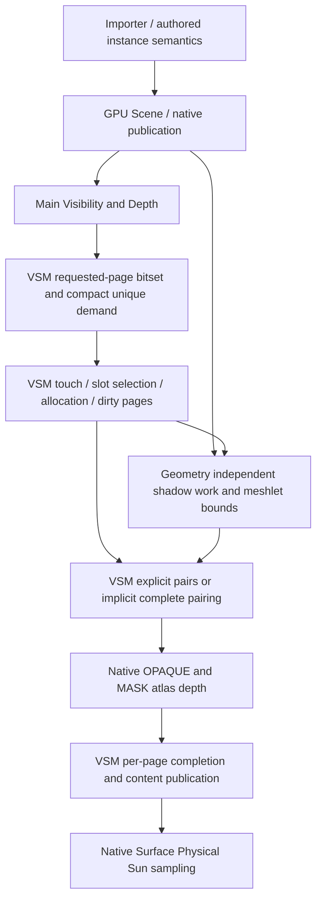

# VSM V4：完整太阳阴影、稳定页面与有界工作

本文件是 **VSM V4 模块设计依据**，实施顺序、实际切换与阶段状态仅在[执行计划](../next-execution/eengine-v4-vsm-execution-2026-10.md)。全局约束继承[V4 母稿](./eengine-v4-native-shading-2026-10.md)。当前 workstream 为 VSM V4，Minimal GPU Work 继续暂停；R0建立源码/来源设计与当前设备基线，用户随后授权实施R1与R2。下文明确标注实际ABI与责任切换；R3 pair/implicit/gutter仍为目标，不由文档采纳证明已实现。

当前开发/验证设备经 `nvidia-smi` 确认为 **RTX 2060 SUPER 8GB（8192 MiB，driver 591.86）**。当前设备1080p作为本模块实机验收环境；原1650 Ti 4GB仍保留为架构的低显存适配目标，其跨设备成本/性能未运行、不推定通过。旧实验保留原设备身份，不能跨机器比较P50/P95或将8GB解释为无限容量。

旧 [VSM design](./vsm.md) / [VSM execution](../next-execution/vsm.md)仅用来追溯来源、早期数学和 owner；其中旧 Surface、main-view caster、执行顺序与完成状态不能作为本模块 authority。已有独立 shadow view/native coverage/太阳 consumer 是复用基础，而不是未实现项。

## 1. 结论与支持域

选择 **保留 Geometry/native raster/Physical Sun 基础，替换 VSM 需求、驻留身份和完成协议**。不以 OR instance flags、65536→131072 或绕过 overflow 提交作为最终架构。

本模块支持一个 Physical Sun、OPAQUE/MASK、ordinary geometry 与 Geometry Product、真实 source/resident cut、显式 cast/receive 属性和现有 PCF 质量。Point/Spot、多 authored Directional、透明透射阴影、PCSS/接触硬化、光线追踪阴影不纳入；有效但无 provider 的请求继续显式 unsupported。不重构 VT、FSR3、BRDF、Atmosphere 或 Minimal GPU Work。

最终正常路径是 GPU 全域需求标记→唯一页面工作→可靠驻留/粗页覆盖→独立 shadow Geometry→紧致 caster 配对→hardware atlas depth→逐页完成→native Sun visibility。容量压力不能发布截断内容；大记录量有同数学的完整 GPU 隐式配对路径，物理页压力有明确的已完成 coarse 页策略。两者分别解决工作容量和空间分辨率，不能混淆。

## 2. R0源码基线与问题分类

审查起点：2026-10-10，HEAD `821ed4eeb96d4d0ab1da5523a8cdbfa25be017b9`，工作区包含太阳日历、来源记录和暂停导航改动。下表保留R0旧实现故障，不能当作R1切换后的源码现状。R0在当前2060 SUPER上重新诊断既有 full cooked Bistro 链路，并保留此前实验与独立坐标算术复现。SOURCE 表示静态源码确定事实，GPU 表示实际读回；性能推论单独列出。当前设备与R1定向结果见执行计划；原失败不重新解释为修复。

| 问题 | 当前证据 | 后果 / 设计责任 |
|---|---|---|
| 投影语义未从 importer 发布 | `GeometryCooker.h:47` instance flags 默认 0；`GltfImporter.cpp:315`只设 asset/transform；`cooked-scene.ts:176`透传；`ShadowGeometryWork.ts:192`要求 CastsShadow | GPU：1591实例中0 caster，0 ready页。修复资产→Scene的语义，不让 renderer猜测 |
| caster 全局容量阻断完成 | `VsmCapabilities.ts:137` high=65536；`VsmAtlasRasterPass.ts:37` overflow 时拒绝所有提交 | GPU：补语义后78172 attempted/65536 written/12636 overflow，0 ready。扩到131072后515 ready；只证明此相机链路可工作 |
| receiver在去重前截断 | `vsm_receiver_demand.ts:93`每个有效像素 atomicAdd，ticket≥8192直接return；allocation才处理重复页 | SOURCE：超过8192 receiver会截断像素需求，不能保证所有屏幕区域覆盖。执行次序不保证是屏幕前8192像素 |
| footprint需求与采样不一致 | demand按深度启发式选mip；`vsm_sampling.ts`从包含位置的clip开始优先查mip0；viewport.z写1，缺真实shadow/screen footprint比例 | SOURCE：生产与消费没有共同的目标精度契约。首版统一精确clip/mip选择，不引入未经证明的自适应降精度 |
| 内容代际兼作访问帧 | `vsm_allocate_pages.ts:145` last_visited=generation；199/218拒绝last_visited==generation的slot | SOURCE：同generation曾访问页面会持续不可回收；参考CPU oracle复制了同一假设，不能发现该错误 |
| 重复需求与分配竞态 | 页锁在reuse之后释放；不同lane可再次为同页append；新需求回收与已有需求touch在同dispatch竞争 | SOURCE：锁保护短临界区不等于每帧去重，allocation容量≤slots不能证明唯一work。先完成全部需求/touch，再回收分配 |
| 页面身份随相机相对坐标变动 | lightView减camera；clip origin=`quantizedWorld-cameraLight-halfExtent`；`VsmGeneration`比较该相对signature | SOURCE + 独立算术：0.01世界单位的页内平移保持同一点UV，却改变signature导致全失效；沿光轴移动1单位可保持XY signature，却令extent64的depth变化1/512。生产GPU回归尚未运行 |
| 无caster页不能完成 | commit遍历caster.records，不遍历dirty page work | SOURCE：清过深度的空页无提交入口，持续dirty；“无caster”与“工作没完整执行”必须分别表示 |
| 全局溢出与raster真实状态不一致 | caster finalize的args不是native caster实际draw；`native_raster_partitions.ts`记录malformed但prefix仍能输出draw | SOURCE：partial draw可能发生；阻止commit保正确，但不是完整恢复。提交必须消费实际geometry/partition/raster成功状态 |
| 页边界过滤条件不闭合 | overlap用整个instance sphere，未扩border；atlas fragment限制slot边界；sampling把tap clamp到interior | SOURCE：过宽caster集合放大工作，border几何与PCF语义需同定义；不能靠clamp隐藏跨页接缝 |
| 生命周期与失效范围过宽/缺项 | generation.begin提前改previous，无自身abort；sunRevision来自整个环境revision；geometry resident cut的改变未在VSM内建立明确依赖合同 | SOURCE：需要独立核对abort/重试、光强变动、VG coarse→fine和纹理coverage publication。不是已经GPU复现的新增失败 |
| receive语义与诊断缺口 | GPU ABI已有ReceivesShadow，但Physical Sun helper无对应instance条件；dirtyMask主要被clear，fallback诊断仍为reserved | SOURCE：声明的字段不能当有效能力或有效计数 |

已有GPU原件：忽略目录 `.local/validation/vsm-cast-flags/result.json`、`result-capacity-131072.json`。实验通过HTTP响应改标记/容量，未修改源代码或cooked资产；960×640、FSR3/jitter关闭，同camera/default Sun。截图仅定性，不当同条件性能或完整画质验收。新增算术脚本 `.local/validation/vsm-v4-design/math-probe.mjs`报告页内UV不变、光轴depth偏移；不冒充真实shader GPU运行。

## 3. KEEP / ALIGN / REWRITE / DELETE

| 范围 | 决策 |
|---|---|
| Geometry Product/ordinary residency、decode、独立shadow view、shadow delayed demand | KEEP；新增紧致meshlet bounds/dirty-empty gating与实际resident-cut失效产品，不恢复main-selected caster |
| GPU instance cast/receive ABI、instance patches、native material publication | ALIGN producer与全部consumer；material分类不得覆盖用户语义 |
| receiver demand、allocator访问/锁协议、clipmap身份、VsmGeneration | REWRITE VSM LOCAL OWNER职责 |
| hardware depth atlas、native OPAQUE/MASK编译与有限raster classes | KEEP + ALIGN新的caster描述和完整失败状态；不复活CSM或旧材质VM |
| caster展开、页完成、coarse生产和PCF border处理 | REWRITE对应VSM产品与全部direct consumer |
| RendererCore/FrameProgram/FrameGraph | ALIGN composition、真实读写域、事务与资源版本；不让FrameGraph承担shader内部调度 |
| per-pixel bounded append、generation式LRU、caster-driven dirty commit、重复硬编码布局 | DELETE于所属单元切换出口 |

## 4. 所有权与GPU数据流

Scene/GPU owner持有语义、实例与真实publication；Geometry持有合法source和view work；VSM持有page table/meta/atlas、投影身份、需求、分配、dirty/ready与pair工作；native material持有coverage程序/R8/cutoff与binding；Temporal持有自身history。Renderer仅装配，最终一个frame submit。不得将VSM/VT统一进全局cache/proof/history系统。

### 4.1 资产语义

glTF没有通用cast/receive标准，import policy默认普通OPAQUE/MASK实例cast+receive；显式场景属性可以关闭，BLEND仍不进入本profile。meshlet MaterialFlags中的cast bit与GPU instance bit属不同ABI，必须独立定义/转换，禁止复制位值。

Cooker输出语义参与scene recipe/identity；Native与两种WASM producer同切并重cook相应场景。旧flags=0不能判断是未填写还是作者关闭，不对旧包自动OR6；建立明确版本/recipe检查和重cook提示，preserve显式关闭。公开Scene source在缺省属性与显式0之间明确区分；已有显式flags按原值处理。

ReceivesShadow在receiver和native Sun consumer使用同一实例语义；不得只少生成需求而consumer继续采样。Unlit无Sun消费者，关闭VSM或unsupported source不隐式创建工作。

### 4.2 稳定页面与投影

逻辑身份是 `(Scene/device namespace, projection epoch, clip level, mip, signed world page X/Y)`。CPU/GPU用完整有符号整数页坐标；环形索引仅提供位置，不能替代身份验证。取模使用floor modulo，验证negative/world-boundary/camera-cut。超过i32/f32合法精度域先协商并显式拒绝或按声明的floating-origin协议换epoch，不能截断坐标。

固定太阳basis，页面用世界网格寻址，页内相机移动不改变物理内容。跨page移动只撤销离开窗口的页并引入新边缘页；大跳转可全量撤销。投影Z anchor/range在epoch内固定，不能随camera沿光轴平移。VSM在Scene/sun projection变更时消费GPU Scene所有active caster的保守light-Z bounds reduction（instance bounds覆盖完整source，非main-selected/仅resident finest）；GPU发布固定anchor/range给raster和sampling。无caster场景发布合法空域。范围改变必须失效全部受影响页面，不在vertex逐点clamp深度以掩盖未包含的caster。bias由当前实际shadow texel和depth range换算，保reverse-Z/max-depth规则。

拆分projection/content epoch、submitted frame serial、page content version与device namespace。太阳方向改变推进projection epoch；仅光强、曝光、无关大气参数变动不重画shadow depth。cast/transform/coverage和VG resident-cut publication有真实失效输入；初版对无法定位的变化可全量content失效，局部优化必须有准确旧/新bounds与Cost Card。移动对象必须覆盖旧位置和新位置。view-dependent coverage按作者图定义的view域失效并绑定，不能用虚构零camera替代。

CPU lifecycle提供prepare/commit/abort；未submit不提交origin/epoch/Scene事实，abort→retry重置全frame scratch。提交后GPU内容只有page completion允许ready。device loss整namespace退休；任何旧diagnostic/fence不能修改新owner。

R1/R2实际ABI（producer和全部direct consumer同步；R3配对模式尚未实现）：

| 产品 | 布局 / owner |
|---|---|
| page entry | `VsmPageState`/`vsm_page_table`，12words/48B：slotX/Y、mip、flags、generation、fallbackMip、contentVersion、projectionEpoch、signed worldX/Y、namespace、reserved。clip/mip plane由完整entry地址定义，modulo只决定存储位置 |
| meta / demand / page work / caster | meta8words/32B，lastVisited为submitted frame serial。R2 demand header16B为fineCount/written/overflow/generation，record16B为virtualPage/reserved slot/signed worldXY；touch后records复用于miss，header仍表示完整需求。page work32B最后8B为signed worldXY；caster仍旧32B，仅R3替换 |
| 公共投影块 | `VsmProjection`，buffer256B、WGSL最小240B：light matrix0、clips64、dimensions160、control176、参数192、GPUdepth208、identity224。各pass局部control意义不同，不复制独立light/depth公式 |
| stable depth | `VsmDepthBoundsPass`唯一producer，persistent16B `[minZ,maxZ,inverseRange,valid]`。64lane两级归约所有active且cast且非BLEND实例的原始AABB，affine support包含shear/negative/nonuniform；无caster域为[-0.51,0.51]，invalid source发布valid0而非伪造深度 |
| depth consumers | GPUcopy16B进入receiver/sampling、caster、native raster常量208；raster用`(maxZ-lightZ)*inverseRange`，不逐点clamp；采样bias按实际clip/mip shadow texel乘inverseRange |
| revisions | 太阳方向以f32事实构造basis并比较身份；caster publication、resident-cut revision分别输入，不相加截断。streaming观察全部注册residency的真实revision，直接public upload/retire同样失效；非streaming读取本residency。namespace与epoch溢出显式拒绝 |

每个mip窗口按clip世界中心重新量化，不把fine origin直接floor当coarse起点。相机world page支持域为abs≤1048576，越界要求floating origin；这只是f32网格可表示性边界，超远世界亚texel质量尚未验收。view-dependent coverage当前保守逐帧失效，并绑定真实camera/view数据；不宣称这类材质能缓存不重画。

### 4.3 完整需求与驻留

每个有效receiver定位实际instance，核验receive与Sun消费语义，标记请求页bitset。可选8×8组内去重只作为以后成本优化，portable baseline使用storage atomicOr，不依赖subgroup。需求容量按有限完整虚拟页域，不按任意像素前缀；随后按word popcount/prefix压缩唯一页。R2 high为131328 entries、bitset16416B，bounded为87552 entries、bitset10944B；完整需求与miss各一份bitset。无需2M条32B像素record。

首版producer和consumer共享同一clip/mip selector：保持现有包含位置的clip选择、正常目标mip0。删除未标定的depth启发式；未来footprint LOD必须同步改两端且独立证明精度。clip外点不clamp成窗口边缘页；返回显式outside-domain类别。filter border由同一shadow texel度量。

全部requested/touch标记完成后，单独扫描physical slots收集free和当前frame未请求的reclaimable slots，再用prefix给唯一miss分配slot。避免每个request扫描900slot，以及已有需求touch与新页eviction竞争。映射和反向meta在后续dispatch完成发布；一页一个writer、一slot一个owner，不用跨WG锁等待。当前请求、coarse pinned和本frame raster中的slot不能被回收；长期dirty但无人需求的旧页可以撤销，不能永久占池。

为物理压力保留真实coarse覆盖：mip5世界页尺度仍为extent/4；fine128×128窗口滚动后每轴可能与5个coarse页相交，旧4×4地址环会别名。R2将mip5存储环扩为8×8（每clip的entries从21840增至21888），按fine窗口首/末world page构造完整guard集合，Geometry覆盖其完整world cell并加gutter余量。high对齐时实际需求96页，滚动时最多150页，在900slots中固定预留150（16.7%）；bounded对齐64、最多100，在225slots中固定预留100（44.4%）。fine使用剩余750/125slots；未使用的coarse预留仍保持空闲，不借给fine后再竞态争抢。**这是本地设计，不声称donor为方向光提供了相同pin方案。** coarse请求先压缩/分配到独立保留域；coarse和fine共用真实clear/raster/commit，仅完成的coarse可采样；pool不足保证coarse集合时profile明确unsupported。fine需求记录完整，未驻留页保miss计数，当前帧使用已完成coarse；不得以此宣称原fine分辨率无损。默认完整Bistro预期fine覆盖须报告，不能持续coarse冒充正常质量。

### 4.4 caster配对与完整容量路径

Geometry继续一次独立clip union traversal，无main HZB/cone，保守resident cut。现有SSE=0先保持，不顺手引入shadow LOD近似。Geometry提供每个shadow meshlet保守light-space XY bounds：ordinary用已有meshlet AABB，Product用真实meshlet header AABB；变换必须包含非均匀缩放/shear/negative determinant。非法/非有限bounds是可见失败，不能当零记录。

显式模式按meshlet投影页矩形枚举，在dirty-page lookup中过滤；包含实际mip/clip与border扩张，不为每meshlet遍历全部allocation，不使用instance sphere替代meshlet空间精度。pair目标记录16B：完整workSlot/pageSlot/virtualPage/状态word，source/material/raster flags继续读取独立shadow work。最终ABI由一个TS/WGSL owner定义，native partitions不得读取旧32B caster布局。避免在每个pair复制24B source工作。

必须有 **同一新VSM中的隐式完整模式**：显式pair queue超容量时，忽略全部partial显式结果；对实际dirty页D和已分类的合法shadow work W执行完整笛卡尔候选域。每个native raster partition的GPU draw instance count为`W_partition × D`；vertex以instance index映射完整work/page，保守bounds不重叠就退化为不光栅的primitive，重叠则使用同一source、MASK、depth/border数学。无需存全部W×D records，不需要CPU读回，也不逐page重新traverse scene。

隐式模式是容量正确性路径，不是性能承诺，且不是旧CSM/双Renderer/VM。每partition的u32乘法上界与dispatch/绑定在Scene/profile preflight；超支持域明确拒绝，不能整数wrap。反复进入隐式模式表明容量/配对设计未达到正常场景成本目标；验收必须统计，不能用它悄悄长期支付W×D×vertex税。

比较过的替代：只扩容无法给未来视角完整保证；全pair worst-case分配是`32 W S`级显存，不适合4GB；按最坏组合固定数百raster waves引入大量空CPU编码/draw；逐page全Scene traversal重复工作。故推荐紧致显式正常路径+无巨大record存储的同数学隐式压力路径。隐式路径尚未GPU构建；其resource profile与最坏成本是实施前和退出时的必需否证项。

### 4.5 页面完成与采样

页面状态为 unmapped / mapped-dirty / rendering / ready，状态存储由VSM拥有。clear只执行dirty slot一次；raster后 **按dirty page工作列表提交**，不是按caster记录提交。正确空页在完整geometry/配对执行后clear depth=0并ready；source未完整、queue malformed、partition invalid、epoch不符的页绝不能ready。

frame/page completion消费Geometry header、pair模式选择、native partition完整性与raster顺序，区分“没有相交caster”和“没有执行完整工作”。全局合法隐式模式也要完成全部dirty页之后才发布。GPU状态读写用dispatch/pass顺序，不把workgroup barrier当跨WG同步。提交时核验full logical page key、slot owner、projection/content epoch，每页content version只推进一次；累计namespace version只在真实采样内容改变时推进。

border保留4texel，pair bounds按border覆盖域膨胀，raster写完整slot gutter；PCF允许访问正确gutter，不把tap clamp到interior掩盖接缝。不得跨slot写入。fine/coarse使用各自texel尺度与对应bias；request/coarse/source production真正齐备后才叫coarse-resident策略。所有查询只消费ready页；missing/stale/dirty最终neutral=1仍为显式异常/域外行为，并有有效诊断，不能常态化无影。R2查询结果为fine/coarse/missing/stale/dirty/outside，coarse仍保存targetStatus以区分fine失败；没有每像素hot-path全局atomic计数。diagnostics的samplingFallback/overflowMask为null（没有该产品），不能把保留零字解释为测得零fallback。dirtyPages指向allocation的32B唯一页工作、records offset16/count offset4；旧dirty bitset和page/slot locks已退休。

## 5. Cost Card（ABI实际字节；时间证据范围见执行计划）

记P=receiver像素，V=虚拟entries，S=physical slots，W=shadow meshlets，D=dirty pages，E=有效meshlet/page pairs，K=有限native raster partitions，C=显式pair容量。

| 机制 | bytes / ALU / samples / access | atomics、barriers、命令与边界 |
|---|---|---|
| bitset+unique compact | R2 high：两个16416B bitset、2101264B request、33880B scan、16B indirect；bounded：两个10944B bitset、1400848B request、22584B scan。scan为每word vec2u local prefix、group counts/prefix和total；需求与miss先后复用scan/request，保留完整header。depth/key/source读取仍在 | receiver P次atomicOr。请求/miss各count→prefix→scatter，共6dispatch；64lane portable scan，high65groups也完整，不依赖wave。每group13个WG barrier，scatter执行page decode。D=0仍付需求/scan税，0/50/100%不会免费 |
| slots分阶段选择 | R2 candidate 8S+16：high7216B/bounded1816B；meta32S，page48V。touch随机读取唯一request/page/meta；collect与publish_dirty各两次顺序S扫描，分配随机撤销旧page并写新page/meta | touch和allocate为实际count indirect，collect_slots与publish_dirty各1group，管理合计10dispatch/8pipelines、独立pass顺序；touch telemetry或miss atomicOr、每miss content marker，删除锁/CAS重试与每miss O(S)搜索。free先于当前frame无需求clean/dirty，不严格LRU |
| stable world pages | R1实际page48B，较32B增加16V：high V131040增加2096640B；bounded V87360增加1397760B。meta仍32B；window常量256B。query新增world/epoch/namespace字段读取，随机页访问仍存在 | full/roll扫描V entries、64lane，steady不执行window dispatch；R2撤销匹配reverse meta，删除无reader的旧dirty bitset。相机/光强不全失效；0%可复用仍付key税，50/100%可复用省下对应clear/raster有效工作，完整净收益未测 |
| stable depth bounds | epoch变化读取N条176B中必要AABB/affine字段；partials16ceil(N/64)B、constants80B、persistent16B。所有投影buffer仍256B；enabled帧3×16B GPUcopy，不新增binding | 64lane两级归约，2dispatch、WG内barriers，无atomics；steady0bounds dispatch/ALU，仍有48Bcopy。连续太阳运动/coverage变化最坏每帧全归约；supportdot(abs(lightZrow),halfExtent)，不靠sphere近似深度域 |
| bounds+compact pairs | 16W可选bounds产品有实际两个消费者；16E pair writes+4E partition indices，旧为32E+4E；C=262144候选预算4MiB pair+1MiB indices，非最终固定值 | tighter page tests新增AABB变换ALU，减少无关append；每有效pair预约atomic与native count/scatter税仍有。需要完整storage-stage profile |
| implicit capacity mode | 不分配全16WS；只用现有work/dirty列表、有限K indirect args；没有新增shadow texture samples | hardware vertex最坏W D bucketVertices，重复bounds/source读取，可能非常慢；仅容量压力。理想常态为0次进入，成本必须真实测 |
| page completion | O(D)状态/version写，替代O(E)caster扫描/锁；空页也能提交 | one page writer，无每caster page-lock竞争；读取实际失败状态，命令顺序不可删 |
| gutter PCF | atlas仍depth32float 4096²=64MiB，900个136²slot；保原4×4 high PCF最多16loads | border扩大raster域/fragment成本；不增加per-tap page-table lookup；真实纹理缓存成本UNKNOWN |

资源按物理对象去重，包含shadow hierarchy/work/frame instances、bounds、native partition buffers、atlas、页表/请求/状态、retiring和在途frame。64MiB atlas不是VSM总账；旧owner与replacement同时存活的峰值单列。R1 high主要owner为64MiB atlas+6289920B页表+约2MiB caster+其他，不能拿该估算冒称driver VRAM。R2已删除旧allocator/append，但没有旧/新同质量全场景GPU时间对照，不能声明净收益；resident-cut观察CPU为O(注册Products)，stable不分配，变更才刷新revision快照。

Dirty比例0/50/100%：normal steady应没有clear/raster/pair有效工作，Geometry可通过GPU空dirty门控indirect；全部失效必须完整重新生产coarse+fine，不能靠拖延或减少caster得到漂亮数字。收益条件为新增mark/scan/key/bounds管理成本小于所省重复需求、随机slot扫描、错误全失效和无关caster/raster；若理想静态和稀疏dirtycase都不赚钱，否证具体优化，不新增cache/proof/megakernel。

## 6. 参考来源与平台差异

本轮重新从GitHub读取Timberdoodle固定revision `1987cf3b8ddda42585d2470bb5806efbc96c6cae`（Apache-2.0）。原件/sha位于忽略目录 `.local/validation/vsm-v4-design/reference`；源码与本地映射见[来源记录](../porting/next-renderer.md#vsm-v4-design-source-map2026-10-10reference-only)。

核对了 `mark_required_pages.hlsl` atomic page标记后才append、`find_free_pages.glsl` physical slot扫描/未访问页、`allocate_pages.hlsl`双向映射、`free_wrapped_pages.hlsl`环形边缘撤销、`invalidate_pages.hlsl`局部bounds、`clear_dirty_bit.glsl`按page request完成、`cull_and_draw_directional_pages.hlsl`及shared的真实task/mesh/fragment路径、`gen_dirty_bit_hiz.hlsl`、`vsm_util.glsl`和host clip projections。该固定revision的方向光实际采样位于 `src/rendering/tasks/shade_opaque.hlsl::get_vsm_shadow/vsm_shadow_test`，会读取每页保存的camera position row重建深度；`vsm_sampling.hlsl`主要是Point/Spot，不能将其错记为完整太阳采样入口。

保留receiver→page→raster→sampling不变量；参考预去重、free/not-visited阶段与world-grid滚动。Reject固定wave32、64-bit meta atomics、Daxa pointers、DispatchMesh、virtual-screen fragment atomicMin后端。保留本地reverse-Z hardware depth atlas/native MASK source语义，不照搬donor的min-depth存储和比较，也不复制上游固定SampleLevel2/cutoff0.5。上游存在out-of-range和dirty-HIZ bounds TODO，reference不意味着所有边界已经正确。

bitset全域compaction、方向光coarse pin、compact explicit/implicit容量路径、V4 page完成/事务协议均为具名本地设计；没有找到覆盖本地完整WebGPU执行和ABI的单一现成donor。本轮仅reference，不提升R07 adoption、不宣称完整Timberdoodle移植。

## 7. 原子切换与验证边界

按执行计划形成完整owner单元：非生产构建replacement和独立oracle→切换所有direct consumers/ABI/资源与reset→立即删除所属旧职责。可复用基础不机械重写；不把新pair喂旧32B consumer，不允许新旧allocator同时生产同一page table。

必要验证包含：真实cook资产默认与显式off；>8192receiver的全域页面集合；同content epoch的回收和touch竞争；camera页内/跨页/光轴/负坐标滚动；光方向/仅光强；0caster页；forced explicit overflow与implicit同数学；Geometry/partition failure不得ready；off-camera/occluded/MASK/非均匀shear；VG coarse→fine和texture coverage变更；abort→retry/resize/toggle/Scene replacement/release/device loss；唯一writer/submit；fine/coarse seam和bias独立数学。

完整cooked Bistro必须保持1591instances、2829226source triangles、132materials与405texture images及全部mips，原camera/default Sun并扩多姿态/太阳角度，先确认source identity和residency。在当前RTX2060 SUPER 8GB、1080p验收VSM producer、shadow Geometry、native raster、Surface、整帧P50/P95和完整memory峰值；1650Ti4GB适配按明确预算核算，实机未测保留未验证。GPU作业串行。原无影/补flags仍overflow的失败原件保存，诊断扩容不是正式修复。

R0只涵盖设计、独立算术与既有实现诊断。R1新WGSL、CPU/oracle、真实production小场景及完整Bistro重cook/GPU语义与深度结果见执行计划；同条件1080p成本尚缺，R2已切换需求、驻留、查询和唯一dirty页发布；R3 caster压力模式尚未切换，完整Bistro仍复现caster overflow/0ready。不能用R1通过宣布VSM V4完整修复或性能提升。
