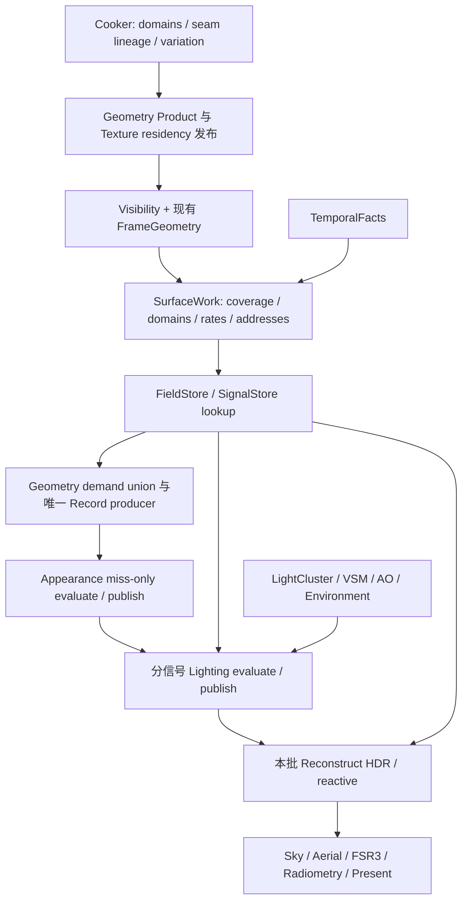

# Surface V3 第一版优化设计：连续表面共享、稳定字段缓存与有界稀疏信号

日期：2026-10-03。源码与测量基线：`0676cf28`。状态：**Phase 0–1 已完成；Phase 2–6 已完成代码切换但正式验收延期；Phase 7 尚未开始，不代表整链画质性能已通过**。

配套：[执行文档](../next-execution/surface-work-v3-optimization-v1-execution-2026-10.md)、[已有性能报告](../performance/2026-10-03-surface-v3-work-bandwidth-report.md)、[第三版总设计](eengine-v3-extreme-performance-aaa-final-refactor-design-2026-10.md)、[整体架构](eengine-next-overall-architecture-final-2026.md)、[来源账本](../porting/next-renderer.md)。

本文件响应用户最新要求：第一版优化必须大胆放宽 VisibilityKey 对共享的限制，真实减少 GPU 工作、存储和带宽，不能只改名称或加入默认关闭的选项。它细化并替换 V3 初次实现的物理调度、缓存地址和存储策略，保留唯一生产路径、唯一 GeometryRecord producer、前置字段 lookup、独立 lighting signals、TemporalFacts 与廉价 reconstruct 的总边界。本文与旧文档中的具体物理方案冲突时，本轮优化采用本文；旧文档中的历史实现描述不追溯改写。

设计编写阶段曾暂停实现与测试；用户现已要求按 Phase 完整实施、检查、每阶段一次提交后继续。实际进展以执行文档和阶段代码为准。用户分析文档《VisibilityBuffer架构重着色计算问题.md》作为问题输入；当前实现事实仍以本地源码和已有测量为准。

## 1. 直接确定的方案

1. **删除“VisibilityKey 相同才能共享”的生产判据。** VisibilityKey 继续精确表示当前像素获胜三角形；一个 shading group 默认允许包含多个 VisibilityKey、跨 primitive 和 meshlet。
2. **以连续表面域为候选范围，按字段和信号分别判断共享。** 不以同材质、同 domain 或低深度差任一单项直接批准整个 PBR 共享。UV seam 只切断依赖该 UV 的字段，normal 高频只收紧依赖该 normal 的信号。
3. **mixed 不再等于逐像素着色。** 8×8 tile 内生成不同 domain、不同 cell 和不同信号率；局部问题局部细分。默认从 2×2 候选开始，合格区域合并 4×4，低频照明允许 8×8。
4. **缓存脱离像素地址和精确 camera epoch。** 常量直接引用；稳定局部字段使用 surface/chart 地址与 footprint 有效域；视角、动态和非局部字段单独进入本帧需求。
5. **删去按全屏容量分配的 192 B GeometryRecord 和成套 dense material 产品。** Geometry 只为真正需求生成，64 B hot core 加按需 cold extension；字段采用一个有界持久 FieldStore 和紧凑本帧临时存储。
6. **拆开 diffuse environment、specular environment 和 emissive。** 当前 IBL 混合物不能统一降为低频；coat 缺席使用 ZeroRef，不写零 plane。
7. **删去四路全分辨率 Surface signal history 与其 dense identity/age history。** 使用有界稀疏 SignalStore，TemporalFacts 保留全分辨率事实，FSR3 保留最终显示历史。
8. **固定显存预算、固定最大批数、GPU 决定实际工作量。** 默认每批覆盖至多 262,144 个目标像素，1080p 分 8 批顺序复用工作区。所有批次进入同一 FrameGraph 和同一次 frame submit。

这不是“在不改变原系统的前提下再省一点”：本轮允许删掉当前 dense cache/packet/history 物理布局和相机精确失效模型，中间可以无法编译。禁止保留两套生产 Surface 作为迁移桥。

## 2. 基线究竟哪里有问题

### 2.1 已核对的代码事实

| 当前入口 | `0676cf28` 的实际行为 | 第一版处理 |
|---|---|---|
| `SurfaceWorkRuntime.ts` | 8×8 tile 同 VisibilityKey 才归 uniform；mixed 每个 covered pixel 一个 sample；sharing key 直接来自 winner key | 替换 classifier、sample 地址和映射，不保留相等门槛 |
| `SurfaceCacheIdentityPass.ts` | 13 个 u32/pixel 的 witness，包含精确 camera epoch，像素地址参与缓存 | 删除 dense witness；分离稳定 surface identity、footprint 与本帧地址 |
| `SurfaceGeometryPass.ts` | 唯一 GeometryRecord producer 已存在；独立 192 B/pixel 容量；hit 仍写 36 B | 保留 owner，替换记录布局、容量与需求入口 |
| `SurfaceMaterialCachePass.ts` | 76 B/pixel keys、48 B/pixel values，另有 48 B/pixel material fields；部分字段 miss 可独立求值 | 删除三套 dense 产品；保留 masked evaluation 能力 |
| `GpuAppearancePublication.ts` | 每程序 indirect 和材质 bin 已存在 | 重做有限 profile 与紧凑字段消费，不把“增加 binning”重复算作优化 |
| `SurfaceLightingWorkPass.ts` | dirty signal classify/compact/indirect 已存在；四路持久 vec4f planes；IBL 混含两种环境光和 emissive | 保留数学，改信号分解、存储和更新粒度 |
| `SurfaceReconstructionPass.ts` | 不再完整恢复几何或 PBR；仍全屏写四路 histories/identity/age | 删 dense Surface history，变为稀疏结果采样与合成 |
| `FrameGeometryVertices` / `FrameGeometryArena` | 已共享选中 meshlet 的顶点及几何资源；不是全场景唯一顶点去重 | 扩展已有 owner 的 primitive setup，不另造几何协调器 |

`WinnerPrimitiveInterpolation` 类存在，不等于它当前被生产路径实例化。不得把其组件验证或未接入的 coefficient dictionary 算作现成收益，也不得恢复 retired coordinator 来接新设计。旧“GeometryRecord 还重复复制一个 work prefix”的容量判断已过时，基线已分离分配。

### 2.2 已有 1080p 数据支持什么

GTX 1650 Ti、Chrome 154、同一 Dungeon；内部和输出均 1920×1080。主报告 VSM/jitter 关闭，AO、FSR3、Bloom、HZB、cone 开启。以下是已有报告摘录，不是本轮新测量：

| 移动段 P50 | 低覆盖 | 高覆盖 |
|---|---:|---:|
| 可见像素 | 667,815 | 1,653,229 |
| Surface sample | 543,683 | 613,834 |
| sample / 可见像素 | 81.37% | 37.09% |
| Geometry / Material hit | 0 / 0 | 0 / 0 |
| Geometry 写入，十进制 MB | 104.39 | 117.86 |
| Packet 写入，十进制 MB | 34.80 | 39.29 |
| Reconstruct 写入，十进制 MB | 132.71 | 132.71 |
| Material evaluate | 10.55 ms | 11.80 ms |
| Surface 总 GPU | 22.41 ms | 26.08 ms |
| FSR3 | 12.98 ms | 14.02 ms |

静止时 geometry/material 命中，但仍有 witness、lookup、metadata 和全屏 history 成本。Mixed 贡献约 97%–99.6% 的 sample。现在的 implicit 实际为空 tile，非空 implicit 为零。现有 coat 求值可为零而四类 packet 都写入，说明“少跑重计算”尚未等于“少存结果”。

这些 MB 是 shader 逻辑访问计数，不是物理 DRAM 流量。不同列 P50 不可相加。VSM 开启尝试因 `VsmAtlasRasterPass` 初始化读取 undefined.device 失败，不存在可引用的该配置 VSM 时间。当前证据尚不能证明 V3 优于同条件的旧 full-resolution 设计。

## 3. 成本模型：不要再用一个 sample 数掩盖全部工作

设 P 为目标像素，V 为可见像素，S_f 为字段 f 的代表数量，S_l 为照明信号 l 的代表数量，M_f 为字段 miss，G 为需要重几何的唯一地址集合。

```text
G = geometry-dependent material misses
    ∪ dirty lighting addresses requiring geometry

Surface cost = coverage/classification(P)
             + cheap address/setup(unique primitives, candidate cells)
             + lookup(sum S_f + sum S_l)
             + geometry(|G|)
             + appearance(sum M_f)
             + lighting(sum dirty S_l)
             + compact mapping/publication
             + reconstruct(P)
```

逐像素读取 winner/depth/少量元数据仍然存在；目标是把昂贵属性、纹理、BRDF、历史和宽记录工作从 P 上移开。分类若暗中为 P 个像素完整恢复法线/UV/材质再决定降频，就违反本方案。

必须同时报告代表数、缓存 lookup 数、miss 数、geometry 数、各信号求值和写入数。多字段不同采样率下，“Surface sample”只作为地址并集统计，不能替代各 worker 的真实 invocation。

## 4. 身份与地址必须分开

| 名称 | 含义 | 可否跨帧 |
|---|---|---|
| WinnerIdentity / VisibilityKey | 当前 raster 的精确获胜 primitive、实例及发布代际 | 不能直接当持久 cache key |
| SharingDomain | 可提出共享候选的连续表面范围；可含多个 winner | domain 稳定不等于结果永久有效 |
| PixelAddress | 输出像素坐标 | 不用于持久字段缓存 |
| FrameSampleAddress | 本批 representative、cell、几何 slot | 批结束失效 |
| PersistentSurfaceAddress | Product/实例作用域、surface/chart、canonical cell/level 与代际 | 满足字段依赖和 footprint 条件才有效 |
| FieldRef / SignalRef | Constant、Persistent、Transient、Zero 等有标签的结果引用 | 各自比较 generation 与生命周期 |

**放宽的是 shading sharing 与有界近似有效域，不是随机丢弃 cache key 比较。** Hash 只用于定位桶；完整逻辑 key 必须比较。不同物体正好相邻、不同侧面或 UV 重叠不能仅因 hash/domain/material 相同就串用。

稳定材质 key 至少覆盖：字段依赖的 Product/实例作用域、chart/参数化、canonical cell 与层级、程序/字段版本、纹理与 sampler 身份、相关资源驻留内容版本、输入属性版本及编码 profile。只有经编译器证明 instance-independent 的字段才能省实例身份。geometry/view/dynamic 输入不得被错误省略。

## 5. 连续域由资产发布链提供，不能再把风险全部折成 domain=0

### 5.1 复用现有基础，修正其粒度

已有 `SurfaceMetadata.h::BuildSourceSurfaceDomains` 用 CanonicalVertex 字节和 UV orientation 构造角点身份，通过反向流形边连通得到域；`GeometryCooker.cpp` 发布 32 B primitive metadata，`SurfacePrimitiveAbi.ts` 解码。当前 Surface classifier 没有消费它。

当前 cooker 把多种 risk 汇总，再用 `risk == 0 ? domain : 0` 发布；包括双面、法线差异、LOD 源角点查询失败等。直接接上这份 metadata 仍可能使大量区域无法共享，因此本轮必须同时改变 producer，不能只接一根 binding。

新 metadata 在逻辑上拆成：

- **身份可信度**：连通来源是否可靠、侧别、非流形/退化、LOD correspondence 有效域。
- **几何连续性**：位置连续、局部法线锥、曲率/平面偏差界、形变版本。
- **字段连续性**：各 UV chart、UV 方向/接缝、颜色、normal/tangent 的独立域或 seam mask。
- **信号敏感性**：材质 feature、roughness 下界、normal variation、emissive/alpha 风险等独立摘要。

同一几何域可以包含多个 UV chart。跨 UV seam 的 base-color 不共享，但常量 roughness、几何候选和适合的 diffuse irradiance 仍可共享。双面属性不直接清空 domain：front/back side 分开，合法同侧继续评估。

### 5.2 LOD、普通资产和动态对象

Product cooker 在简化时传递源域及字段 seam lineage；一个 coarse primitive 混合多个来源时保留有界的域/误差描述，超出描述能力只使该局部字段使用 LOD-local 身份。不能声称当前“精确 source-corner 查找”已提供一般跨 LOD 对应。

普通资产沿同一发布合同生成 metadata。Loader 只交付 CPU 产品，GpuRenderWorld/Geometry Product residency 拥有长期 GPU 数据。缺失 metadata 的资产在本地 connected primitive 范围处理，不能用“同材质”跨任意表面共享；缺口计数公开，不隐形退化整个场景。

skin/morph 改变几何依赖版本，稳定 UV 字段可继续复用；当前变形位置和光照不可复用为静态事实。没有对应映射的 LOD 切换只失效关联页/字段，而不是清空全局 cache。

## 6. Tile → domain → cell → field/signal 的共享算法

本地算法名称：**连续表面域分信号采样（Continuity-Domain Signal Sampling）**。这不是任何上游完整算法的移植声明。

### 6.1 分类输入与固定阶段

1. 8×8 workgroup 读取 winner、depth、coverage 和轻量 primitive/domain/feature metadata；从已有 FrameGeometry owner 获取共享 primitive setup。
2. 每个覆盖像素只参与身份/侧别、depth plane residual 和 cheap bounds 判定。不运行完整 material、normal-map 或 PBR probe。
3. 形成 2×2 候选；按 domain/side 和目标字段依赖分组。组可以含不同 primitive，meshlet 边界不是自动 seam。
4. 用曲率、法线锥、相关纹理 footprint variation、视角/roughness、light/shadow 风险决定保持、细分或合并。
5. 合格相邻 cell 合并到 4×4；8×8 仅对满足低频条件的照明分量。细分支持 2×1、1×2、1×1。
6. 将 field/signal rate plan、代表位置、coverage mask 和必要 remap 发布；worker 只处理 compact 后的真实需求。

代表必须落在本 domain 的已覆盖像素中，不固定取 tile 左上角。共享组中目标像素的 winner 仍保留自己的几何覆盖，不借用代表的 silhouette、深度或 alpha coverage。

### 6.2 哪些条件真正阻止共享

| 条件 | 影响范围 | 处理 |
|---|---|---|
| 空洞、不同实例表面、front/back 切换、无可信几何连接 | 当前局部组 | 切 domain/coverage，不跨洞过滤 |
| 不同 VisibilityKey，但域连续且误差满足 | 不构成拒绝条件 | 默认跨 primitive 共享 |
| UV0 seam / UV0 高频 | 依赖 UV0 的字段 | 只细分这些字段；UV1/常量独立 |
| normal-map 高频 | normal 及依赖其方向的光照 | normal/spec 可全率，base/常量仍可低率 |
| 低 roughness、反射方向变化 | specular / coat direct/env | 更密采样或短 history，不连带 diffuse 全率 |
| light-set/cluster 或 shadow discontinuity | 对应 direct signal | 分组/细分；未知当前 shadow 风险不批准粗 direct |
| emissive 细线、alpha test | 对应字段及 reactive/coverage | 保留精细结果；alpha coverage 仍由 Visibility 权威产生 |
| 资源摘要未知 | 当前依赖字段 | 局部细分并记录原因，不整 tile/全材质归零 |

深度或 normal 阈值都是复合判据的一部分，不足以证明跨墙共享安全。信号需要依赖字段的变化界；没有可靠界时优先把该信号缩到 2×2/1×1，其他已知字段继续共享。

### 6.3 初始激进 profile

以下是实现初始校准值，**不是已证明的画质保证**。默认值必须非零，不能以“待验收”为由全部设零然后宣布接线完成。

| 项目 | 初始候选/上限 | 初始限制 |
|---|---|---|
| base/ORM 等局部字段 | 默认 2×2，允许 4×4 | 线性归一化字段 variation 暂取 0.02；normal、HDR emissive 单独度量 |
| normal/tangent | 默认 2×2，允许合格 4×4 | 方向锥暂取 3°；粗率不覆盖已知细法线变化 |
| diffuse irradiance | 默认 2×2，合并 4×4/8×8 | 接受平面投影偏差暂取 0.5 pixel；光源/阴影条件另外检查 |
| specular | roughness ≥ 0.35 可提出 2×2/4×4 | 随反射方向锥/roughness 收紧；阈值本身不自动批准 |
| 镜面/coat | 允许局部 1×1，不强制整 tile | 低 roughness、高 view variation、细亮点单独细分 |
| cell rate 变化 | 升频立即、降频需连续 2 帧合格 | 没有稳定 history 的新区域直接使用当前 metadata 判据 |

field variation 对比的是该目标 footprint 的局部 bounds，不是整张纹理 min/max。深度判据在恢复的局部几何平面/投影误差域计算，不在非线性 depth buffer 上使用统一常数。

### 6.4 V1 激进共享合同：VisibilityKey 不得再成为隐式门槛

这一版把跨三角形共享作为默认生产路径，而不是一个需要后续打开的实验开关：

1. `VisibilityKey` 只回答“当前像素由哪个 primitive 获胜”，不参与 `SharingDomain`、field cell 或 signal cell 的相等判断。`VisibilityKey` 不同本身不能使 cell 退化为 1×1。
2. 同一连续域内允许跨 primitive、跨 meshlet、跨 material-bin 组织一个 shading group。primitive、meshlet 和 material-bin 只是 lookup/setup 的输入，不是默认 seam。
3. 8×8 tile 先建立 2×2 候选；连续性和字段 bounds 通过后，默认尝试合并到 4×4；只要对应信号满足低频条件，diffuse environment 可以继续合并到 8×8。没有理由时不允许直接展开成 64 个 pixel sample。
4. 不同字段和信号独立升频：UV0 seam 只阻止依赖 UV0 的字段，normal 高频只阻止 normal/specular/coat，shadow 或 light-set 边界只阻止对应 direct signal。不能用一个失败条件把整组材质和照明全部打回全率。
5. 只有五类硬边界可以拒绝跨 key 合并：coverage 空洞或 alpha 边、front/back 或不同实例、无可信域/非流形连接、字段依赖的 seam/unknown variation、信号依赖的 shadow/light/environment discontinuity。`VisibilityKey`、primitive 边界、meshlet 边界和材质 ID 不在硬边界列表中。
6. 元数据缺失时只在受影响字段或 signal 使用 2×2/1×1 fine cell，并记录原因；不能因为一个字段未知而把整 tile 或整材质清空成 full-rate。

实现必须发布 `cross_visibility_key_group_count`、`cross_meshlet_group_count`、`multi_key_cell_pixels`、`forced_fine_reason_mask` 和各 rate 的实际覆盖数。若微三角形连续墙测试中这些跨 key 计数为零，或非空 tile 的默认 rate 全部为 1×1，视为 V1 未接线，即使类型名已经改成 `SharingDomain` 也不能算完成。

### 6.5 纹理摘要是正式 producer

当前 `TextureVariation.ts` 的 whole-texture bounds 不足以支持局部降频，压缩/不可读格式的 UNKNOWN 也不能永久把所有纹理表面锁成全率。

采用按 mip/空间块的局部 variation hierarchy，分别存颜色误差界、normal 方向锥、roughness 范围与 emissive 风险。优先由 cooker 离线发布；运行时纹理可在 residency publication 时用现有 GPU encoder 构建一次。摘要覆盖 bilinear/trilinear/anisotropic 所需邻域、wrap 与 sampler 语义；不能只取中心 texel。

先以 primitive/cell 的保守 UV footprint bounds 选择摘要节点，必要时由同一 Geometry owner 的 address helper 计算代表 UV/导数。不能完整采样所有像素再生成“便宜摘要”。摘要不足的局部字段按需精细计算，同时保留可继续共享的其他字段。

纹理 bounds 还不是最终字段误差。Appearance 编译器需要沿实际字段表达式传播区间/方向锥：乘加使用有界输入，normalize 检查长度下界，非线性、分支、UV 扭曲和 procedural 节点分别提供受支持的误差规则。接近奇点、跨离散分支或没有规则的节点只将所依赖输出标记 unknown；不能用输入纹理的 0.02 variation 直接保证任意 shader graph 输出误差小于 0.02。第一版应优先完整支持当前生产 PBR 的常见纹理乘色、ORM、normal decode 与 UV transform 闭包，unknown 原因及覆盖率必须可见。

## 7. 工作表示：非空 implicit 与 mixed 都必须真正省东西

分类分两条轴，避免把“非空 implicit”和“uniform-domain”做成互斥统计后重复解释：

- coverage/domain 轴：empty、single-domain、mixed-domain；
- addressing 轴：implicit template、compact explicit map；另记各信号 full-rate cell。

规则矩形 cell 或全率连续 span 使用模板：tile origin、rate、mask、结果 base。消费端从坐标推导 slot，不为每个 pixel 写 task 或 pixel-to-sample 项。uniform-domain 可以同时使用 implicit template。

mixed tile 只为不规则分组保存局部 masks/remap。极端每 pixel 一个域时使用 full-rate implicit span，不再写 64 条宽 task 再读回。**全率着色仍可能必要，但全率 task 膨胀并非必要。**

有界局部分类、prefix/compaction 与 reservation 后再发布有效计数。超出局部 group 容量时，只有当前 tile/field 改为 implicit fine 模板；禁止截断覆盖或将不合格像素塞进粗 cell。统计 mask、模板、显式 map 的实际字节。

## 8. 稳定字段缓存：地址稳定，依赖严格，footprint 允许有界近似

### 8.1 字段路由

| 字段类型 | 路由 |
|---|---|
| 编译期或 publication 常量 | ConstantRef；零 lookup、零 geometry、零字段写入 |
| UV/chart-local 稳定纹理表达式 | PersistentSurfaceAddress → FieldStore |
| 稳定 object-local 且可参数化表达式 | 显式 object-space chart/cell → FieldStore |
| 世界坐标程序、形变依赖 | 仅在相应变换/形变依赖有效时复用，否则本帧求值 |
| view/dynamic/nonlocal | 独立 transient 需求；不污染可稳定缓存的其他字段 |

编译器按字段依赖拆分求值闭包。命中的字段不再为程序入口重跑；共享子表达式在同一次 miss worker 内复用。不能因 normal miss 把所有 base/ORM/emissive 重新采样。

### 8.2 Canonical cache cell

每个 chart 使用确定性 canonical grid 与 level；cell 是查找和准入单位，缓存值具有明确的实际求值 anchor/footprint。一个移动像素请求可映射到已有 cell，前提是其 footprint 被 entry 的有效域覆盖，误差界符合对应字段预算。

第一版在合法代表 winner 上求值并保存 anchor、过滤 footprint 与有效域，不把该点值谎称为整个 cell 的精确平均。新的请求按距 anchor 的空间/方向变化和字段 bounds 判断可复用范围；覆盖不到时增加更细 entry 或 transient 求值。canonical 地址不要求在不存在几何的 chart 中心恢复三角形，也不允许跨 overlapping-UV sheet 共用身份。需要对多个 cached 值插值时，必须使用最终字段的误差规则；任意非线性材质结果不能凭输入纹理平滑就随意双线性插值。

key 中记录层级、filter/sampler、必要各向异性方向类别；entry 携带有效 footprint、variation bound、精度和版本。仅量化 mip 而忽略梯度方向、各向异性或接缝不够。请求过细或跨 seam 时使用更细 cell/临时求值。

**这是一种明确允许误差的重采样近似，不叫“任意视角精确 cache hit”。** Exact constant/unchanged-input hit 与 bounded-footprint hit 分开统计。没有合适 chart 的字段可以临时计算，但不能为了第一版省事把所有 UV-local 字段都路由 transient。

失效来自所依赖资源的内容/程序/参数/几何版本。无关纹理的 residency 更新不清空整个 FieldStore。camera motion 不使 view-independent 字段失效；footprint 不再适合才 miss。切镜头只清需要屏幕时域连续性的状态，不清仍有效的静态材质页。

### 8.3 并发与驱逐

采用明确的 GPU dispatch 阶段：Lookup → request dedup/admit → 单一 producer evaluate → Publish → Consume。有限 hash probe/原子 reservation，不跨 workgroup 等待另一个 entry 完成，也不在同 dispatch 中读未发布值。

重复 key 在本批 request 表选唯一 owner；冲突/满表退到本批 transient 值，不借用错误 key。缓存满时可以不准入，正确渲染不依赖成功插入。

引用包含 generation。一个 batch 的 consumer 完成前，其持久命中与新发布项被 pin；之后可由同队列后续维护释放。跨帧淘汰遵循 submitted epoch，abort 不推进有效历史；所有 in-flight 依赖在显存账本内。命中项只更新紧凑必要状态，不重写一份完整材质值。

## 9. Geometry：只为需求生成，记录只留热数据

保留 `SurfaceGeometryPass` 为唯一重几何 producer。其廉价 address/setup 阶段和完整 record 阶段属于同一 owner；Appearance、Lighting、Reconstruct 都不得新增三顶点属性恢复器。

流程：

1. 轻量地址/footprint 为 cache lookup 提供必要输入，直接复用共享 primitive setup。
2. 字段 lookup 与 signal history lookup 得到 miss/dirty masks；依赖字段 miss 时，对应照明可先标记潜在 dirty。
3. 对需要 geometry 的地址取并集、去重、compact；无 geometry 需求的常量和完全复用项不分配 record。
4. 生成 hot core 与所需 cold fields，Appearance 和 Lighting 共用结果。
5. 后续精确 signal 判定若消除了潜在 dirty，计入 speculative geometry 成本；不把这部分藏成 cache hit 收益。

Hot core 目标 **64 B/record**：以当前位置/深度、几何/着色 frame 的紧凑表达、主 UV/footprint 引用和必要 flags 为主。具体 bit layout 在实现时根据真实消费者固定，本文不是已稳定 ABI。Primitive identity、静态属性描述、共享梯度系数放入 primitive/setup 表，避免逐 sample 重复。

Cold extension 存额外 UV/梯度、颜色、高精度 frame、形变等实际请求字段，按 program profile 显式计容量。不能为凑 64 B 丢掉现有材质功能，也不能暗中再分配一个 128 B/pixel cold 全屏数组。

primitive setup 由现有 FrameGeometry owner 按当前 batch 唯一 primitive 需求发布，有界目录和有限直接计算分支。微三角形若 setup 去重收益低，仍通过该 owner 的直接模式处理；不恢复旧 Winner 协调器。全命中且无需刷新光照的项，GeometryRecord 写入应为零。

## 10. Lighting 的物理信号与颜色合同

### 10.1 拆开当前四个大包

| 逻辑分量 | 采样/历史依赖 | 存储策略 |
|---|---|---|
| Ddirect | 几何/normal、light-set、shadow 与 diffuse 模型 | 稀疏 irradiance 或必要的已着色残差 |
| Denv | normal、环境、AO 合同 | 独立低频候选；不得包含 spec env |
| Sdirect | view、normal、roughness/F0、lights/shadows | 独立中高频结果 |
| Senv | view、normal、roughness/F0、environment | 独立率及短有效域 |
| Cdirect / Cenv | coat feature、coat frame/roughness 和对应 provider | 仅存在 coat 时创建 |
| E | emissive 字段 | 从材质结果引用，无额外 lighting worker |

对外可继续聚合 diffuse/specular/coat/IBL 指标，但物理求值、历史和 packet 不再强行各一整屏 plane。第一版有限 worker families 为 diffuse irradiance 与 specular/coat；按信号 mask 与有限 profile 调度，不生成任意材质 × 光源 × feature 组合 PSO。

Diffuse 尽量把高频材质颜色与低频 irradiance 分开：`Ld = diffuseReflectance × E / π`。保留当前生产 BRDF 的能量项；依赖 light/view/roughness 的项必须在 worker 内处理，不能随意把非可分 BRDF 改成 Lambert 近似。无法分离的部分存已求值 residual 或使用该信号细率；其成本单独记录。

### 10.2 禁止再次出现泛白的合同

- Packet 的物理量、颜色空间、是否包含 `1/π`、Fresnel/coat attenuation、AO 和 exposure 必须有单一标识和 producer 定义。
- diffuse irradiance 与已着色 radiance 不共用无标签的 vec4。`1/π`、AO、能量衰减各应用一次。
- 延续基线已有线性 Rec.709 packet → HDR Rec.2020 working-space 转换边界；若改变，只能统一迁移 producer/consumer，不能混用。
- 稀疏缓存/历史保存曝光无关值，合成后按权威 pre-exposure 合同输出。不能提高曝光来补低率采样能量损失。
- spec env 与 emissive 不乘 diffuse AO；shadow/AO 的具体应用保持现有权威数学，不用“统一环境光倍率”替代。

目标 packet 默认为 8 B 半精度数值加外置共享元数据；非有限、超半精度范围或精度不满足时转 16 B 高精度 slot，计入同一预算。不能把 HDR 硬裁成半精度范围。Absent coat 用 ZeroRef，零求值、零 packet 写入、零 history 占用。

### 10.3 光源与阴影边界

Signal key/有效域包含实际依赖的 light-set/cluster、shadow page/content 与 environment 版本。跨 cluster 不因共享域相同而借用代表的光列表。可由 provider 发布可证明相同的 light-set identity；不能把哈希相等当完整集合相等。

阴影边界采用 provider 的当前 conservative 风险/有效域及 temporal rejection。新遮挡或未知风险的 direct signal 局部细率；Denv 仍可以低率。VSM 第一版验收必须修复已有初始化错误并测真实启用路径，不能只在 VSM 关闭场景宣布完成。

## 11. 稀疏 SignalStore 取代 dense Surface histories

FieldStore 缓存材质表达式，SignalStore 缓存光照结果与其有效域，二者不混为“一个 material hit”。

Signal entry 包含 surface/cell、signal kind、依赖版本、当前有效 normal/view/position footprint、age/confidence 和结果引用。TemporalFacts 仍唯一提供全率 motion、identity、disocclusion、reactive 基础；SignalStore 用这些事实选择/拒绝历史，不自建第二套全屏 motion/identity。

view-independent 的稳定 diffuse 可跨相机移动复用；specular/coat 必须满足反射方向与 roughness 有效域，不能仅凭 material key 命中。新光源、移动遮挡、形变、footprint 改变只使有关 signal 失效。

读历史 epoch 与写发布阶段分离，同一 entry 每提交帧最多推进一次 age；多个批次访问同 cell 不重复累积。有限 probe 失败转 transient 当前求值。进入 lookup 的历史保持只读；通过独立发布阶段更新结果和 generation，不复制演讲中的同 UAV 原地重建读写 race。

FSR3 负责最终 presentation history。删除 Surface dense history不等于把缺失光照随意交给 FSR3 补：稀疏 signal 复用必须发生在重 worker 之前，真实减少求值，失败则当前帧算出合法结果。

## 12. Reconstruct：有界读取、明确写域、只做合成

每个 batch 只写自己的 output pixels，规则 cell 由模板定位，mixed 通过紧凑 map 定位。先保证本域合法 source，再进行有限插值。默认单 source，需平滑且误差允许时最多 4 个同域 source/信号；不得跨 silhouette、UV field seam、side 或失效 history 过滤。

首选 workgroup 共享加载同 cell 的结果，避免相邻像素重复宽 packet 读取。缓存行为仍需硬件时间判断，逻辑读数必须按实际 load 和 tap 报告。

允许操作：引用解析、解包、有限插值、diffuse 颜色乘法、已定义 AO/energy 系数合成、颜色空间/pre-exposure、HDR/reactive 输出。不允许：重建完整几何、材质纹理求值、遍历光列表、BRDF/DFG 积分或 specular 环境采样。

细率 normal/材质与低率照明需要的 compose factors 在上游计算并显式存储。若某 BRDF 无法分离，就提高该信号率，不把计算偷塞到 reconstruct。权威 publication 边界保证引用合法、generation 和互斥写域；consumer 不每像素重查所有生命周期不变量。

输出无重叠、无未覆盖像素。背景与空 coverage 按原场景合同合成，不能拿俯视黑背景当错误。全屏仅保留最终 HDR/reactive 等必要输出，不再额外回写四路 Surface history。

## 13. 固定预算和分批工作区

### 13.1 为什么必须同时改存储

1080p 当前主要容量（MiB，二进制单位；不是每帧流量）：GeometryRecord 379.69、work prefix 65.75、geometry witness 102.83、材质三产品 340.14、四 packet planes 126.56、signal witness 63.28、四 history pairs 加 identity/age 205.66。减少 shader invocation 而保留这些全屏产品，不足以兑现 V3 的带宽和 4 GB GPU 目标。

### 13.2 第一版物理预算

默认 batch 覆盖 R=262,144 个目标像素，4096 个 8×8 tile；1080p 的 32,400 tiles 需要 8 批，最后一批带 bounds mask。批次只是同一新 Surface 算法的工作区复用，不是另一种 fallback renderer。

| 产品 | 目标 MiB | 包含内容 |
|---|---:|---|
| tile plans / controls | 4 | 分类、模板、indirect 与计数 |
| primitive setup / address | 32 | 有界 primitive 目录、轻量地址、footprint |
| Geometry hot | 16 | R × 64 B |
| Geometry cold | 32 | 按需求扩展池 |
| transient fields | 24 | 全 miss 时的本批字段值 |
| queues / refs | 16 | 字段、geometry、signal 队列与引用 |
| transient signal results | 32 | 活跃分量及高精度 spill |
| mixed resolve maps | 8 | 仅不规则覆盖映射 |
| persistent FieldStore | 128 | keys、values、页表、代际及管理数据全部包含 |
| persistent SignalStore | 64 | 读写 epochs、结果、依赖与管理数据全部包含 |
| local variation hierarchy | 32 | 本轮引入的摘要 resident pool |
| HDR / reactive 输出预留 | 24 | 格式/对齐后的 Surface 输出归属预算 |
| 合计 | **412** | 设计目标，尚未分配与测量 |

Surface 设计 envelope 为 **512 MiB**，余量覆盖对齐、scratch 调整和退休重叠。共享 Visibility、FrameGeometry 基础资源、TemporalFacts、材质纹理、FSR3、VSM 等另列整帧账本；Surface 新增的 primitive setup/摘要不能偷算进“共享资源”逃避预算。512 MiB 不是整引擎总显存承诺。

表是预算和布局约束，不保证每种 profile 都能按此 stride 装下。实现必须按最坏字段、key、cold、signal 数推导 R；若需要更多字节，在场景/profile 发布或 resize 时减小 R、增加固定 batch 上界。不得在创建后等 shader overflow 再丢数据。

### 13.3 GPU 调度与最坏情况

CPU 按已协商 extent/profile 编码固定最大批数和有限 program dispatch；每批实际数量、miss、compact 与 indirect 全由 GPU 生成，无本帧 readback。batch 顺序为：classify/address → lookup → demand union → geometry → material → lighting → reconstruct → release scratch。

同一 queue 的 pass 顺序保证前批 consumer 结束后才覆写 scratch；所有消费者都必须在复用点之前。dispatch 总量和 CPU encoding 代价单独测量，不能把批处理视为免费。

全屏高频/所有 cache miss 时仍完整渲染：每批最多 R 个精细目标，geometry/field/signal 的最坏容量由 profile 证明。常量和缺席信号不占 slot；多字段的数量上界不能错误地按一个 S 计算。大 cold profile 通过较小 R 装入预算，仍使用同一最终链。

persistent store 满、hash 冲突、准入失败不扩大显存；转 transient。分类局部容量不足转同一模板的 fine cell。极端精度 spill 纳入最坏 stride 协商。资源 capability 不足时发布明确不支持的配置，不能静默漏画或无限重试。

## 14. Owner 与 FrameGraph 数据流



| Owner | 生产责任 | 不能越界 |
|---|---|---|
| Cooker / Product publication | 域、LOD lineage、字段连续性与离线摘要 | Loader 不持有长期 GPU store |
| Texture residency | 内容版本、局部摘要 publication | 无关资源更新不清全局字段缓存 |
| FrameGeometry | 当前顶点、primitive setup、共享属性入口 | 不复活旧协调器 |
| SurfaceWorkRuntime | 本批 work/rate/address、需求与覆盖 | 不求完整材质/光照做分类 |
| SurfaceGeometryPass | 地址辅助与唯一完整几何生产 | 下游不另恢复几何 |
| Appearance / FieldStore | 字段 lookup、miss program、值发布与生命周期 | 不负责光照 history |
| Lighting / SignalStore | 信号需求、光照求值和稀疏历史 | 不另造 TemporalFacts |
| Reconstruction | 引用解析、轻量合成和互斥输出 | 不补做材质/PBR |
| FrameProgramLowering | 真实依赖、固定 batch 编码与资源生命期 | Renderer 保持 composition root；无 private submit |

## 15. WebGPU 与生命周期

基础方案使用 storage buffers/textures、GPU indirect、固定工作组与显式 dispatch 发布边界。subgroups 可优化 ballot/compaction，但算法不能假设未协商 subgroup width 或 lane 对应某个屏幕 2×2。

截至本轮查阅的 Chrome 发布资料：Immediates 对应 `immediate_address_space`/`setImmediates`；`subgroup-size-control` 为可选 feature；`buffer_view` 需要 WGSL language feature 能力。能力记录只是发现，不证明 device 已申请或 shader 已消费。

这些是同一生产算法的有限 specialization：immediates 减少小参数更新，buffer views 减少绑定压力，subgroup specialization 改善调度。均不能自动减少 record 容量或纹理读取，也不是第一版方案成立的前提。WebGPU 不提供这里可随意使用的多条原生 async compute queue。

资源创建前检查 buffer size、storage binding size/count、workgroup storage、indirect bounds 与可选 feature；必要分段和减小 R 由发布 profile 决定。buffer usage 的 writable/indirect 冲突由 pass 边界处理，barrier 必须 uniform；无全局 spinlock。

resize 调整 pixel extent/batch scratch，保留仍有效的 persistent fields；camera cut 拒绝屏幕 history，但可保留有完整稳定依赖的 material entries。scene unload、Product slot reuse、device loss、submit abort、资源驱逐均通过 owner generation/epoch 管理。旧资源在 GPU 完成后退休，重叠计入预算；无法容纳双份 resize 时先受控 drain 再重建，不能无界临时翻倍。

## 16. 来源与采用边界

完整条目与逐阶段映射见[迁移账本](../porting/next-renderer.md)。以下固定来源不是性能背书：

| 来源 / 固定版本 / 许可证 | 本轮参考内容 | 明确不能声称 |
|---|---|---|
| The Forge `cd5046893faba2dc7869243873bf01f02a6f0df9`，Apache-2.0 | `VisibilityBufferShadingUtilities.h.fsl` 的 `CalcFullBary` / `Interpolate2DWithDeriv`；透视插值与梯度 | 完整稀疏 Surface donor |
| Wicked Engine `df44c3db4c4927492bc9c791eac715d98d7ed091`，MIT | `visibility_resolveCS.hlsl` / `visibility_shadeCS.hlsl` 的 tile、bin、compact 与 indirect | 上游已完成跨 primitive 低率材质 |
| Intel CPS `63ad5c1adafbfcc2869a200f50a5ea11f28b4887`，shader Apache-2.0 | `ComputeShaderTile.hlsl` 的 coarse/full lighting、coverage 与 per-pixel refine | 上游已有前置材质 classifier；它消费现成 GBuffer |
| DOOM GPC 2025 VRCS 演讲，固定 PDF hash 见账本 | rate、primary/duplicate、remap、重建与边缘问题 | surfaceID 页的未来构想是已交付算法；可复制全部代码 |
| WeakKnight OSS `473a59bbcdd30e3366cc567d66a5a97353620d48`，Apache-2.0 | chart/task/cache；沿用账本 10-01 `DependencySamplePages` 的 allocator/filter/history 源阶段映射 | 本轮重新完成全仓审计、Unity/Htex 完整移植或本地 adoption 完成 |

检索尚未得到完整覆盖连续域、前置字段缓存、有界批次和本地 WebGPU 生命周期的单一许可 donor。因此本轮采用具名本地算法，保留来源可复用数学/阶段。DACS 许可未明确的代码不复制；DOOM 第 35 页同 UAV 原地读写 race 不复制。来源核读、实现、数值 oracle、真实 GPU 消费和性能采用是不同状态。

## 17. 明确排除的方案

| 方案 | 不采用的原因 |
|---|---|
| 仅把 VisibilityKey 换成 materialID | 同材质不同表面会串用；不支持字段/信号不同频率 |
| 只接现有 risk/domain0 metadata | 大量区域仍退全率，不能实现本轮跨 primitive 目标 |
| 像素 cache 去掉 camera epoch 但不改地址 | 相机移动后像素指向不同表面，造成错误命中 |
| 所有纹理/BRDF 降到统一 4×4 | 高频 normal、阴影、镜面与 emissive 失真 |
| 保留 dense 数组，只减少写入次数 | 容量、lookup、历史与 full-screen reconstruct 成本未闭合 |
| 一次分配全屏最大 sample/cold/packet | 对 4 GB GPU 不合理；预算必须有物理约束 |
| 超预算后丢 sample 或临时恢复旧 renderer | 覆盖错误或双生产路径；同一有界新链必须完成 |
| 每个 pixel 先完整 probe 再选 rate | 先支付最贵工作，抵消稀疏收益 |
| 先上新 WebGPU feature 再处理算法 | 不解决 winner-sharing 和 dense 产品问题 |
| 依赖 FSR3 掩盖缺失的当前光照 | 最终 history 不能替代合法当前结果 |

## 18. 完成后的判断标准与待校准项

最终新链完成后统一验证以下整链要求；阶段实现仍按最新用户要求检查实际阶段产物。必须证明：

- 多小三角形连续墙面存在实际跨 VisibilityKey 共享；关闭同 key 相等条件后不是因其他默认门槛仍全率。
- mixed tile 包含低率工作；UV seam/high-frequency normal 只细分相关字段/信号。
- 稳定局部字段在移动相机时有真实复用；hit 不运行 heavy material，完全复用项不写 GeometryRecord。
- 缺席 coat 没有物理 plane/写入；高频 spec env 不被低频 Denv 错误共享。
- 基线 dense witness/field/packet/history 不再出现在生产资源账本；最坏全率、全 miss、hash full 和精度 spill 均覆盖完整且有界。
- GPU 时间包含分类、摘要更新摊销、lookup、队列、geometry、材质、光照、发布、reconstruct 和批次开销；不能只报重 worker 变快。
- 同条件画质与运动稳定性满足要求后，Surface 总时间、整帧时间和资源总量再与基线比较；不提前保证固定 FPS 或百分比。

尚需在最终校准确定：各字段误差界、roughness/view 有效域、history age、摘要块粒度、FieldStore 页尺寸、64 B hot core 的最终编码、batch R 与 program dispatch 代价。**这些参数可调，跨 primitive 默认共享、稳定缓存地址、删除 dense 产品、稀疏 history 和固定预算不是待选菜单。**

FSR3 在移动段约 13–14 ms，是独立整帧瓶颈；本轮先真实减少 Surface 及其输入噪声/带宽，保留 FSR3 独立计时。不能因 Surface 变快就宣称整帧目标已达成，也不把替换 FSR3 算法塞进本轮范围。
