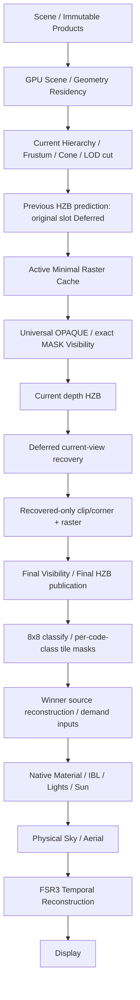

# V4 Minimal GPU Work：执行

[设计](../next-design/eengine-v4-minimal-gpu-work-2026-10.md)为本轮模块唯一选择依据；源码为实现事实。用户明确授权 A→F，不采用旧 agent 的性能结论。

| 单元 | 实施状态 | 验证边界 |
|---|---|---|
| A Cost Map | 本轮 Before 已采集 | 固定相机 residency 收敛；完整 cooked Bistro static/slow/fast |
| B Minimal Visibility/Geometry | producer/consumer 已切换，集中验证通过 | MASK/主 VSM、winner numeric、perspective/normal/LOD/HDR/motion、abort/retry/retirement/loss、full Bistro；P95 回归仍开放 |
| C Tile Surface Work | tile banks/background/source locator 已切换并实测 | 已拒绝有实测回归的 shared GeometryCompletion；最终winner成本及P95仍开放 |
| D Material Physical Binding | shared bank profile / graph demand 已接线验证并实测 | bins11→3；F已删除stable材料扫描；selector独立成本/最终性能仍未关闭 |
| E Moving HZB | Product 同帧恢复、forced disocclusion/dynamic instance GPU 检查通过 | 非 Product 保守开放；完整配对已运行，work下降，稳定GPU收益/P95验收未关闭 |
| F CPU/Scheduling/FSR3 | mutation/publication事件、唯一submit fence、3-slot bounded capacity、FSR3 lane mapping与zero-coat IBL已接线 | 2/3 slots实际运行，保留latency默认2；CPU下降，GPU长尾/正式性能验收未通过 |

## 最终实现与本机验收报告

**结构重构及下列正确性检查已落地，GPU性能验收未通过。** 不将候选工作量降低、历史C阶段P50下降或测试通过换算成当前FPS收益。最终benchmark `.local/validation/bistro-convergence-final-r2/suite.json` 完整24项capture：4个配置×3条相机轨迹×CPU/GPU，120 samples+30 warmup；errors/sourceChanged为空，GPUvalidation/deviceLost/timestamp失败均0。第一轮third-frame真实失败及前述模块失败保留。

### 条件与证据范围

本机NVIDIA GeForce **GTX1650Ti 4096MiB**，PCI0x1F9510DE，vendor nvidia/architecture turing，driver581.42，Chrome154.0.8037.98。WebGPU设备名称/description为空，以nvidia-smi核对；不是RTX2060。GPU used baseline约672MiB（包含其它系统使用），Bistro运行快照约3045–3694MiB；这不是本Renderer精确分配量或DRAM带宽counter。

Output/Internal **1920×1080 /1920×1080**，DPR1、renderScale1、SSE4。完整cooked输入1,035,637,812B、2,829,226源三角形、132材质、405纹理、10 MASK；all full mips/exact R8保持。FSR3、camera jitter、PhysicalSky/Aerial开；VSM/GTAO/Bloom沿demo原始状态为关，Before/After一致，未通过关效果做性能优化。VSM开启的语义另由实际Renderer GPU oracle与main/VSM coverage oracle验证，不将本表当开启全部effects的成本。

Static相机`[20,5,-45]`朝`[20,5,5]`；slow/fast为radius50、每**submitted** frame .002/.012 rad，同样30+120。运动后的resident cut可能与初始静态加载的cut不同，完整输入/SSE未变；实际selected count列出，不能把cut变化全部归于HZB。

Before HEAD=`7c6914f15628b08be2eb217badd47a487a01b881`，正式已settled采样见下文A/B；最终sensors89–90°C、频率存在300–1350MHz变化，驱动明确报告SW Thermal Slowdown Active。重复完全相同on-latency静态P50 **43.385→60.621ms**，证明运行条件/长尾未稳定；**不能给出可信的整帧百分比提升，也不能将全部长尾都归因于热降频**。未取得硬件DRAM/occupancy/WDDM paging/per-frame clock或Nsight inter-frame idle证据。

### 最后当前源码静态补采

在 passive timing labels 与 Native `hasLit` consumer 修复之后，完整相同 cooked Bistro 再运行 `.local/validation/bistro-convergence-final-current/suite.json`：static/on-latency，CPU/GPU各30 warmup+120 samples；errors/sourceChanged为空、GPU diagnostics全部0。**这是最新源码的静态结果；slow/fast与2/3配对表来自上一轮完整capture，不冒充同一fingerprint。** 最后两个修复没有改变Bistro既有lit profile的GPU数学/pass，但仍单独保存当前源码证据。

| 项目 ms P50/P95 | Before static | 最新源码 static |
|---|---|---|
| CPU normal | 4.035/5.785 | 1.225/1.785 |
| GPU command span | 40.894/57.213 | 56.820/148.505 |
| Geometry | 4.391/5.833 | 4.194/13.107 |
| Frame Geometry preparation | 3.211/4.063 | 1.704/3.801 |
| Visibility（含partition/recovery） | 4.588/5.636 | 3.211/7.406 |
| winner Surface | 13.500/15.532 | 23.134/59.179 |
| Tile classify | 原count .655/.721 | 1.245/3.015 |
| HZB aggregate | .262/.328 | .918/2.032 |
| FSR3 aggregate | 11.796/14.418 | 16.581/42.205 |

最新静态 hierarchy nodes/accepted clusters/selected meshlets的P50/P95分别9917/9917、3194/3194、11982/11982，与Before cut数量一致；末帧deferred5485、early6497、recovered8、rejected5477、active6505，prepared388557V/301318T（Before704224V/492201T）。shaded pixels P50/P95均2007914，与Before一致。uniform31106/mixed375/empty919 tiles，mixed1.157%，bins/programs3/3、continuation0、pixels/bin `[1973250,34664,0]`、31659 work records/379908B逻辑写入，queue capacity1166496B。

正常capture实际submitted17.481FPS、completion deferrals193、history deferrals0；completion CPU-observed112.870/123.485ms。命令P50仍76dispatch/34draw/54computePass/6renderPass。最新sensors端点88–90°C/1350MHz，baseline588MiB、运行3555–3564MiB；端点不代表逐帧clock，更不能单凭thermal事件解释Surface约59ms/整帧约149ms的P95。GPU明显没有稳定改善，保留此回归；CPU约69.6%的P50观测下降不换算成FPS收益。

### 1. 当前实际瓶颈排序

按最新静态同帧pass聚合：winner Surface23.134ms最高；FSR3合计16.581ms第二；Geometry4.194ms，Visibility含partition/prediction/recovery3.211ms，tile classify1.245ms，两次HZB合计 .918ms。上一轮首个on-latency静态相应为14.418/8.782/2.425/1.835/.721/.590ms，模块排名相同、绝对成本波动明显。GPU长尾跨上述模块出现，最新Surface P95约59ms、FSR3约42ms；CPU normal1.225ms已不是本场景主要吞吐瓶颈。P50不能逐项相加等同整帧P50。

Before瓶颈为Surface13.500、FSR3合计11.796、Visibility4.588、FrameGeometry3.211ms；候选attributes/材质化Visibility/pixel work管理确实有可删成本，而不只是BindGroup创建。

### 2/4. 删除模块与大模块Cost Card

详细ALU、samples、atomics/barriers、working set、0/50/100%与break-even见唯一[设计Cost Cards](../next-design/eengine-v4-minimal-gpu-work-2026-10.md)。本表为源码与实测logical bytes，不是DRAM计数。

| 模块 | Before | 当前实现 / 代价与边界 |
|---|---|---|
| A instrumentation | 历史硬件profile不可当本机事实 | 复用pass timestamps/counters；entropy仅计时后诊断readback；正常production不运行entropy shader |
| B Visibility | 11 Surface bins的22个raster PSO、88 indirect draws；OPAQUE携带完整shading inputs | 2 raster classes、4个PSO、每raster phase16 draws；OPAQUE无material texture/varyings；MASK仅alpha dependency、exactR8/cutoff；仍保留4个meshlet partition kernels |
| B/C Geometry | 16B clip+88B shading payload/candidate vertex | 16B clip+4B corner/triangle+8B source locator/work；删除88MiB vertex-capacity属性allocation与静态61,971,712B/frame候选属性stores；winner才读source/transform；新增directory约954,880B含padding；arena23,836,928B |
| C Surface work | full-screen count→scan→finalize→scatter→u32/pixel queue；8,294,752B容量 | classify→finalize，12B/tile-bin mask record；3 bins容量1,166,496B、scratch28B、静态实际写约379,956B；winner目录解析一次；删除scan/scatter，未删除必要的一次全屏classify；固定bank容量随bin数增长，高entropy/大量程序仍有容量与inactive lane税 |
| C background | 独立黑色HDR image16,588,800B、graph background pass、empty-winner compute | attachment clear HDR/Reactive，Surface只写winner；删除黑色image和empty-winner全屏扫描；实际pre-exposed image输入仍按合法GPUcopy初始化 |
| D texture binding | execution class含material-local physical tuple，11 bins/7 programs | whole-texture全局有限profile，TextureRef bank/layer、独立exactR8引用；3 bins/3 programs、0 continuation、mixed约1.17%；无新增纹理/pass；有限bank switch与带alpha route新增8B税保留；未实现VT |
| E occlusion | normal motion使旧HZB fail-open；旧filtered Work namespace/owner | 当前Product cut完整一次，previous预测→current恢复原slot；仅真正active/recovered准备和raster。索引477,456B、owner控制112B、额外raster settings32B；第二次raster/partition及最终HZB build为固定税，0%拒绝时不盈利 |
| F CPU | stable每帧snapshot/132 materials、streaming evidence scan、FrameGraph dump、Surface descriptor copy | dirty events+稳定ready O(1)，冷变更完整snapshot；lastPoll/blockedUploads O(1)、debug on-demand、同步descriptor不复制；最新CPU static4.035/5.785→1.225/1.785ms，仅CPU观测下降，非FPS收益 |
| F scheduling | 硬编码2 admission，gpuDone可能稍后抓取包含后续frame的fence；LocalLight两个互相矛盾的限制 | 命名latency2/throughput3、有界3 context；每submit唯一即时fence；retirement/history各自owner；LocalLight仅保留完整3-allocation/18MiB容量；默认2未改，第三帧实测无稳定收益 |
| F FSR3/IBL | ShadingSPD一个lane串行4次完整source_value；zero-coat仍采样8次环境load | SPD256 lanes、4KiB shared、一barrier，同dispatch/公式/精度；12组GPU f32/f16逐值误差0；IBL仅positive-coat采样，零贡献8loads删除。跨轮时间不作孤立因果收益 |

C曾尝试workgroup共享完整GeometryCompletion，Bistro Surface反而18.874ms，已删共享结构与两个barrier；保留失败，未引入shading cache。旧CurrentHzbLateRecheckGpu/filtered GPU shader、late greater-equal raster PSO和filtered raster入口删除。稳定帧buffer/bindgroup/view缓存仍保留。

实际完整静态命令P50：Before **66 dispatch /90 draw**；当前recovery开 **76 /34**，recovery关 **55 /18**。因此总draw减少56个，**dispatch增加10个**：C/D删除的工作被E正确恢复的21个额外dispatch部分抵消，不能声称所有命令都减少。总compute pass44→54（full profiler marker/实际owner依计时模式有1个波动），render pass5→6。没有为功能新增frame submit。

### 3. 一帧所有权流程

Before：Scene→完整Product hierarchy/cut→Full Frame Attributes→material-aware raster partitions→Visibility→Pixel Count/Scan/Scatter→Surface+empty background→FSR3→Display。

所有GPU work encode进同一render-frame submit；CPU只发布长期资源/设置，不读取本帧可见结果生成绘制。非Product geometry尚无recovery，保守跳过previous-HZB rejection。

### 5. 本机Bistro P50/P95：上一轮完整配对

ms；CPU来自**未开启GPU profiler**的normal capture，GPU来自独立full timestamps。Geometry含hierarchy/meshlet/instance/minimal-cache及recovery build；Visibility含两次partition/raster与predict/recover，不含HZB；Surface仅native winner evaluate（Before含原background），classify另列；FSR3为每帧所有其pass相加后取percentile。不能相加各行P50/P95。

| 项目 | Before static | 配对轮latency2 static | 配对轮slow Orbit | 配对轮fast Orbit |
|---|---|---|---|---|
| CPU normal | 4.035/5.785 | 1.300/2.035 | 1.240/1.830 | 1.270/1.705 |
| GPU command span | 40.894/57.213 | 43.385/150.012 | 48.628/137.036 | 30.999/134.545 |
| Geometry | 4.391/5.833 | 2.425/17.302 | 2.097/13.828 | 2.294/20.120 |
| Frame Geometry preparation | 3.211/4.063 | 1.114/4.981 | .655/3.342 | 1.049/5.571 |
| Visibility | 4.588/5.636 | 1.835/8.782 | .918/4.981 | 1.704/8.978 |
| Surface | 13.500/15.532 | 14.418/59.965 | 13.304/56.492 | 7.471/39.911 |
| Tile classify | 原count .655/.721 | .721/3.080 | .655/2.556 | .524/2.425 |
| HZB aggregate | .262/.328 | .590/3.080 | .524/2.097 | .524/2.097 |
| FSR3 aggregate | 11.796/14.418 | 8.782/42.009 | 9.961/45.220 | 8.782/47.841 |

Static FSR3明细：PrepareInputs .852/3.867、Luma .262/1.049、ShadingChange SPD1.901/8.585+final .066/.262、Reactivity1.376/7.537、LumaInstability .524/1.835、Accumulate3.408/17.957、RCAS .328/1.638。GPU pre-exposure .000/.066；.000为64μs级timestamp量化，不代表数学零成本。

同browser配置对比GPU span：

| 配置 | static | slow | fast |
|---|---|---|---|
| recovery off /2 slots | 43.647/147.718 | 52.953/66.585 | 49.283/65.733 |
| recovery on /2 slots | 43.385/150.012 | 48.628/137.036 | 30.999/134.545 |
| recovery on /3 slots | 50.463/147.390 | 67.371/139.526 | 40.042/126.419 |
| recovery on /2 slots repeat | 60.621/144.179 | 37.421/145.555 | 56.426/119.210 |

最后两项不是选优删除异常；全部保留。HZB减少geometry work，但无法在该运行环境证明稳定整帧收益；最终P95明显未达验收。

### 6. Work counts

hierarchy GPU counters每8帧采样，15 samples，表值P50/P95。Meshlet/vertex/triangle/occlusion末帧为计时结束后读回，不冒充其全段P50；fast轨迹末尾遮挡特别强，不代表整段始终只360 meshlets。

| 指标 | Before static | 当前static | slow | fast |
|---|---|---|---|---|
| tested hierarchy nodes P50/P95 | 9917/9917 | 9917/9917 | 9903/9944 | 9934/10388 |
| accepted clusters P50/P95 | 3194/3194 | 3194/3194 | 3200/3222 | 3072/3203 |
| selected source meshlets P50/P95 | 11982/11982 | 11714/11714 | 12180/12445 | 10743/12158 |
| source meshlets末帧 | 11982 | 11714 | 12103 | 11145 |
| deferred /recovered /rejected末帧 | 无 | 5478/1/5477 | 3631/104/3527 | 10840/55/10785 |
| active meshlets末帧 | 11982 | 6237 | 8576 | 360 |
| prepared vertices末帧 | 704224 | 372232 | 509912 | 21179 |
| prepared/raster triangles末帧 | 492201 | 293047 | 343402 | 19783 |
| shaded pixels GPU counter P50/P95 | 2007914/2007914 | 2007914/2007914 | 1430821/2073600 | 1301412/1655937 |

Hierarchy HZB拒绝为0（Product该consumer明确关闭previous rejection，不是额外读回的node统计）；实际拒绝在meshlet层，不声称减少hierarchy traversal。

Surface static：execution bins11→3，programs7→3，continuation0；uniform31103 tiles、mixed380（≤2类或1类+empty）、3–4类0、>4类0、empty917，总32400，mixed1.17%（Before约7.98%）。pixels/bin `[1973114,34674,0]`；末帧shaded2,007,788；31,663条tile work，379,956B逻辑写入。计时阶段jitter与末帧capture的少量像素差不当质量收益。

### 7. Scheduling / utilization

正常capture实际**submitted FPS**，不是1000/GPU P50，也不是display/input latency：

| 模式 | latency2 FPS /completion deferrals | throughput3 FPS /completion deferrals |
|---|---|---|
| static | 15.425 /190 | 14.927 /42 |
| slow | 18.752 /185 | 16.207 /42 |
| fast | 19.091 /162 | 16.955 /35 |

Static正常frame的queue completion CPU-observed P50/P95：2slots116.295/281.950ms，3slots163.145/415.645ms；history deferrals均0。3slots只是少了RAF admission拒绝，未提高此轮吞吐，且排队更长，故production默认latency2。相同2slots repeat实际FPS又为13.749/15.875/11.858，不将顺序运行误称严格受控帧率提升。

GPU span始终远超16.67ms的主要条件，本轮不具备“command已低于16.67ms但仍错失RAF”的前提。Static2slots command内outside-pass P50/P95=.328/2.687ms（含copy/clear/instrumentation/gaps），不等于inter-frame GPU idle。nvidia-smi端点utilization5–100%且部分为诊断/停止阶段；未测得可定位的queue idle bubble，不能凭RAF拒绝次数宣称GPU利用率已提升。

### 8/9. Remaining Bottlenecks / 明确未完成

1. **稳定同运行条件的整帧GPU改善与P95验收未完成**；热降频已确认，全部长尾根因未归因。需要分帧频率/真实working-set与paging/硬件执行证据，不能把重复不同结果当提升。
2. **winner Surface仍最大，Minimal Geometry的整体break-even未证明**：每winner source transform/interpolation/native texture/normal/IBL仍存在；删除producer stores不自动覆盖新增winner decode/transform税。UV/color按graph裁剪，但lit固定normal/position/tangent basis仍保留，未完成对无normal mapping等材质进一步删除tangent恢复。实际跨bin物理selector的独立成本未隔离；不可宣称D单独更快。
3. **FSR3仍重**；没有独立精简Native AA graph。pinned SDK的NATIVEAA只给1.0 ratio，不能任意删准备/历史公式。保留FSR3，无旧TAA；Quality/Balanced额外性能表未运行。
4. **moving HZB只闭合Product meshlet层**；hierarchy仍完整遍历，普通geometry未实现同帧recovery，保守开放。E增加第二raster/HZB/21dispatch税，稳定break-even未验证，不能以末帧work减少宣称成本关闭。
5. **大量code classes/高entropy**的固定tile banks容量与部分inactive lanes仍是风险；未实现通用混合像素fallback allocator。全部容量按数学上限预flight，无法支持则拒绝，不drop work。
6. **resource continuation**在本Bistro为0；oracle覆盖真实limits continuation，但未消除所有压力profile重复geometry/material execution。未引入大型shading cache。
7. **完整Bistro独立画质/全部effects验收未完成**。已目视Before/After最终fast-camera screenshot，纹理/几何表现相近；这不是MASK植被、开启VSM/GTAO、多姿态或长期Temporal的全画质验收。小型GPU numeric/coverage/lifecycle证据按各自scope报告。
8. VT、page table、GPU texture feedback均未实现（本轮明确禁止）；未自动进入下一个大模块，当前module保留性能验收开放状态。

最终读回原始labels后发现现有debug summary仍只识别旧`native opaque`，把新`native winner shading`误归unclassified；补齐SurfacePhaseTiming/GpuFramePhase与14条timing unit验证，真实Product Renderer GPU验证Surface evaluation不再为null。这是capture之后的被动分类修正，未改变GPU shader/geometry/material/effects；本报告从保存的raw physical pass逐帧重算，未使用错误summary。集中107条受影响contracts、fresh build:test/typecheck/full build通过，实际Product三帧burst/forced disocclusion/device recovery、FSR3 f32/f16、resource-profile GPU检查通过。完整旧Renderer/all Node suite未跑；codec vendor `node:module` browser外置警告仍为已知build warning，不把warning当新渲染失败。

最终 consumer 核对另发现动态 `is_unlit` 会重新发布 Native shader，而 Renderer/FrameProgramBindings 的 lighting demand 仍读取旧 Scene 分类。已将 `hasLit` 缓存到 Native Snapshot，两处读取同一原子 candidate/prepared/active。真实 Product Renderer GPU验证全 unlit 无 LocalLight work、切回 lit 后 abort 保持旧 publication、retry 恢复 lighting work，包含既有 VSM/device recovery/三槽检查，见 `.local/validation/convergence-final-native-light-demand-r3.json`（passed，GPU errors为空）。首轮原 200 polls 约1s的 readiness 窗口失败保留；第二轮未改变原等待窗口已通过，首轮具体等待原因未独立证明；改为60s wall-time上限并保留 required frame/output 和错误诊断，第三轮通过，未放宽 numeric/coverage 断言。此前121条检查通过，最后受影响89条 contracts/timing与fresh full build再次通过。Bistro保持既有 lit profile；该修复不改变其 shader/pass，但最终当前源码静态采样另行记录，不把早期fingerprint冒充最新源码。

## A/B 实际证据

D 实际结果补充：第三次 `.local/validation/bistro-convergence-phase-d-r3/suite.json` 完整 static/slow/fast，errors/sourceChanged/真实 GPU diagnostics 通过。Static work 仍 11982 /704224V /492201T，bins/programs 11/7 →3/3，continuations=0。mixed tile 7.98%→1.16%；queue capacity 4,277,152→1,166,496B；实际 31658 tile records，379896B writes。OPAQUE/MASK raster 仍 2 classes/16 draws。

| D 模式 | CPU normal P50/P95 ms | GPU span P50/P95 ms |
|---|---|---|
| static | 5.940/10.000 | 32.178/33.620 |
| slow | 4.880/8.780 | 29.426/85.328 |
| fast | 4.645/7.180 | 24.445/104.923 |

Static Surface 13.566/14.549ms，相比 C 12.911/32.506ms，P50 没有改善；FSR3 Shading SPD 同时 3.604→4.653ms，核心代码未改，不能归功或全归因于 bank selector。当前 CPU snapshot 仍 O(materials)，新增 profile 规划/比较税留给 F 的事件版本闭合，不声称 O(1)。22 targeted contracts、fresh build:test/typecheck、实际 Product production 与 resource-profile GPU 检查通过，保留 exact alpha numeric、main/VSM depth parity、resize/abort/retry/retirement/device recovery；不能以测试通过声称性能关闭。

原始失败 `.local/validation/bistro-convergence-phase-d/suite.json`：每帧规划误调用完整 shader generator，180s 内不能完成 240 提交预热。拆开 binding-layout 规划和 shader 生成，memo immutable graph 的 demand variants；第二次诊断采样主动中止，第三次完整通过。失败记录保留。

Before HEAD `7c6914f15628b08be2eb217badd47a487a01b881`。本机 NVIDIA GTX 1650 Ti，4096MiB，vendor nvidia/architecture turing，driver 581.42，Chrome 154.0.8037.98；WebGPU description 被浏览器隐藏，硬件名由 nvidia-smi 核对。不是 RTX 2060。

主条件：output/internal=1920×1080、renderScale=1、SSE=4；相机 `[20,5,-45]` 看 `[20,5,5]`，slow=.002 rad/submitted frame、fast=.012。FSR3 开，GTAO/Bloom 关；VSM 由 demo renderState 保留并从 getter 记录，早期 capture 错用字段导致未导出该 bool，不能把缺项当关闭。Full cooked Bistro source 1,035,637,812B，2,829,226 triangles、132 materials，完整 texture mips/exact coverage，无降质量。

初始未等待 geometry residency 的 `.local/validation/bistro-convergence-head-7c6914f1-r2` GPU 21.36ms，仅为加载状态诊断，**不作 Before**。首个 host 失败 `.local/validation/bistro-convergence-head-7c6914f1` 是测试宿主 OrbitControls.reset/update recursion，修复宿主；未改 renderer 吞异常。

正式 Before `.local/validation/bistro-convergence-head-7c6914f1-settled/suite.json`，B After `.local/validation/bistro-convergence-phase-b/suite.json`：均 sourceChanged/errors 为空，120 samples +30 warmup，GPU timestamp 与 GPU work counter 独立采集，额外 entropy readback 在计时后且不用于生产调度。

| 静态实测 | Before P50/P95 ms | B P50/P95 ms |
|---|---|---|
| CPU normal render | 4.035/5.785 | 3.955/5.420 |
| GPU command span | 40.894/57.213 | 33.489/88.146 |
| Frame Geometry build | 3.211/4.063 | 1.311/2.621 |
| Visibility raster | 4.456/5.505 | 1.442/3.539 |
| Surface material + background | 13.500/15.532 | 17.170/34.472 |
| pixel-bin count | .655/.721 | .393/1.180 |
| pixel-bin scatter | .721/.852 | .459/1.245 |
| FSR3 Shading SPD | 5.374/6.619 | 3.736/10.158 |

这是同机顺序运行的 fresh profiles，静态 V/T/work 相同；GPU sensors 约 88–89°C/1350MHz、显存约 3.6GiB，时间漂移和长尾没有归因，不以 FSR 未修改的时间变化声称其优化。B 总 P50 下降约18.1%，**P95 没改善，Surface 本体回归约27.2%**。这符合 direct winner source setup/transform 增加的风险，C 必须解决重复 work，不恢复 full attribute cache。

静态 work：11982 meshlets、704224 candidate vertices、492201 candidate triangles，11 Surface bins/7 programs/0 continuations；mixed tiles≈8%。B raster classes=2、draws 88→16、arena=22,882,048B，删除88MiB attributes 上限与61,971,712B/frame attributes stores。以上 logical bytes/draw counts 是源码/本机诊断事实，不是 GPU DRAM counter。

Moving profiles在各自起点重置相机，轨迹相同但 streaming/history 与 jitter 仍可能变化：Before slow P50/P95=29.295/90.833、fast=35.389/41.812；B slow=33.817/46.727、fast=25.625/88.408。不能称全部相机模式改善，moving HZB 尚未修改。

## B 集中验证和失败

Engine typecheck/full build、fresh build:test 通过。42 targeted contract checks 通过，保留 buffer limits、publication atomicity、abort/retry、retirement/loss、frame graph 依赖；退休 88B ABI 表示测试改为 minimal cache bounds，未删除 numeric 语义。

真实 GPU `native-surface-integration`、`native-surface-perspective`、`native-surface-resource-profile`、`native-surface-device-epoch` 通过。Artifact `.local/validation/convergence-b-*.json`；main/VSM 16384 pixels 比较，maxDepthError=0、coverage 同源；cache fallback HDR difference=0。原 GPU integration 首次失败保留 `convergence-b-native-integration.json`，原因是 fixture 误删除了仍必需的 Surface routes，修复 fixture consumer；原两条 contract 失败为旧 buffer 数量断言与缺失 material fixture 字段，保留并修正，不放宽容差。小 oracle 仍有既有 harness 403 console 响应，不能称其 console 完全干净；full Bistro errors 空。

未跑完整旧 Renderer/all Node suite，不以旧历史测试通过替代本轮 GPU 路径。单元 B 功能闭合；性能长尾、Surface 回归和最终整帧验收仍开放，后续 C→F 已获本轮用户授权。

## C 实测、拒绝方案与修复

首轮 `.local/validation/bistro-convergence-phase-c/suite.json` 为 tile banks + workgroup-local GeometryCompletion。删除 scan/scatter 后管理工作更少，但 static Surface P50=18.874ms、command span=34.079/118.358ms。uniform primitive=11585/32400，并不证明共享结构的固定税赚钱。删除消费端共享结构与两个 uniform-load/barrier；保留原失败实测。

源码确认每 pixel cache-hit 仍解析 Product asset/group/page/meshlet/resident directory。Frame directory 扩为24B、arena V7，增加 per-work 8B resident/source locator，Surface 直接恢复按 graph 所需的 resident attributes；不写 candidate shading payload。Main raster/partition/late-HZB 全部跟随 stride；late-HZB minBindingSize 旧32B导致真实 Product shader compile失败，保留 `convergence-c-source-locator-product-production.json`，按新 ABI 修复40B并重跑 `...-r2.json` 通过。

最终 C `.local/validation/bistro-convergence-phase-c-source-locator/suite.json`，sourceChanged/errors为空，相同硬件/分辨率/SSE/相机/效果/完整质量条件，120+30：

| C 模式 | CPU normal P50/P95 ms | GPU span P50/P95 ms | Surface P50/P95 ms |
|---|---|---|---|
| static | 3.970/5.195 | 28.508/98.894 | 12.911/32.506 |
| slow | 4.190/6.725 | 25.231/78.971 | 9.044/25.625 |
| fast | 4.520/7.300 | 24.248/102.171 | 7.012/19.399 |

Static source counts仍11982 work/704224 vertices/492201 triangles。Before command span P50=40.894ms，对比C下降30.3%；Surface Before13.500→12.911ms，B回归17.170ms已消除。P95仍比Before差，**不能称最终性能验收完成**。FSR没有修改，不归功于其计时漂移。

C static classify .459/1.049ms，finalize timestamp量化为0；没有 Surface scan/scatter。Queue capacity8,294,752→4,277,152B，实际34088 tile records写409,056B，旧约2m pixel indices写约8MB；逻辑bytes并非DRAM counters。mixed2586/32400≈7.98%，主bin约92% pixels。优化clear初始化计时量化为0，删独立黑色背景image16,588,800B、一个graph pass与一个全屏compute。新增locator physical arena954,880B（含padding），最终23,836,928B，仍比Full Frame Attributes少约88MiB。

真实GPU exact tile masks/one writer/513 bins/2D indirect/replay/malformed/stale、main/VSM精确coverage、perspective/normals/HDR/LOD/motion、resource continuation、device epoch通过；Product实际Renderer source locator/abort/retry/resize/device recovery通过。49 targeted contracts中48首次通过，一条16B旧directory size断言同步24B后受影响9条通过。另有退休graph background断言与已删除background PSO readiness gate测试改为真实publication readiness gate；不跳numeric断言，不放宽容差。

新的纹理诊断只在计时后读取owner：Bistro有6个真实whole-texture physical segments、9个旧BindingSets，不是每texture一个bank。格式/size为bc7-sRGB16/64/2048、bc7-linear4/2048、exact R8 2048。D可以在真实sampled-texture limit下研究共享profile；本段不宣称已完成D。

## E：完整当前 cut 与同帧 recovery

`TemporalOcclusionWork` 取代旧 `CurrentHzbLateRecheckGpu` 及其 filtered namespace GPU shader。原 MeshletWork slot 保持 identity；previous HZB 只预测 Deferred，当前深度/HZB 测试全部 deferred slot，原位恢复 Recovered；只追加恢复者的 clip/corners，然后 load 原 depth/Visibility 再 raster，最终 HZB 发布最终深度。无当前帧 CPU work readback，未新增 frame submit。主 Product hierarchy 遍历仍完整，不能把拒绝 meshlet 宣称为 hierarchy node 剔除。

真实 Product GPU 验证 `.local/validation/convergence-f-three-slots-product-production.json` 通过（registry selector=`native-surface-product-production`）。固定 jitter、4 个视角偏移（最后一项含 GPU instance transform patch）用测试输入强制 previous HZB 错误拒绝全部 5 个 meshlet；每项 early=0、deferred=5、recovered=5、rejected=0，原 source queue identity 不变，恢复 HDR 与同姿态 full reference max error=0。此证据覆盖 normal motion、disocclusion、动态实例、Product source locator、abort/retry、resize、scene release/accounting、device epoch；新增真实 Renderer 同步3帧 burst、第四帧 admission 阻挡及全部 fence 完成释放。`convergence-final-product-production-r2/r3.json` 虽文件名含 Product，但 registry selector 实际是 ordinary `native-surface-production`，只作为普通几何正确性证据，不能作 Product recovery 证据。没有声称仅凭这个小场景证明所有复杂场景画质。

原失败保存：`convergence-e-initial-product-production.json` 为 retired filtered header signed flag 导致 RangeError；改用原 source payload。E 第二次 Product oracle 为同一 storage/indirect buffer 的 WebGPU usage scope 冲突；拆分 32B indirect。旧 GPU owner/PSO/filtered raster 调用删除，不恢复旧架构。目录 stride、capacity、source borrowed lifetime 和 FrameGraph 最终 HZB version 同步修复。仅 CPU historical late-recheck reference 保留测试意义。

首次完整 E Bistro `.local/validation/bistro-convergence-phase-e/suite.json` 无 errors/sourceChanged/GPU diagnostics：

| 模式 | CPU P50/P95 ms | GPU span P50/P95 ms | capture 末尾 active / prepared vertices / triangles |
|---|---|---|---|
| static | 4.870/6.245 | 34.603/172.884 | 6532 /390351 /302107 |
| slow | 4.780/5.670 | 42.009/165.806 | 8981 /535685 /367210 |
| fast | 5.190/7.365 | 35.979/142.475 | 1104 /66511 /52842 |

Static deferred5453、early6529、recovered3、rejected5450；selected queue written 仍11982。固定初次 CPU/GPU samples jitter 不同，不能把末尾 work counts 当 P50。原始 no-recovery D static704224V/492201T，E work 明显下降；**总 GPU 时间没有改善，P95 回归，功能闭合不等于性能验收**。未改 FSR3 的 Shading SPD 同时有30ms级长尾，尚未归因；因此最终在同一个 browser 做 recovery on/off、2/3 slots 配对并重复 latency，不能仅拿不同运行时点归功/归因。

## F：Stable CPU、submit fence 与剩余 shading work

Stable material revision 不再调用 snapshot：material/nested color setter、RuntimeInputs set/copy 和 TextureResidency 的提交/提升/退休事件使 scene dirty；未变 ready 为 O(1)，变化后一次冷 snapshot，其 pending readiness 不重新遍历材料。修改嵌套 Color 对象时 detach/attach；shared Color 通知所有订阅 owner；constructor failure/destroy 清理。AppearanceRuntimeInputs.get 现在返回副本，原始 live-array alias 不再是更新通道；用 set/copy。此 API 行为变化是事件发布完整性所需，source consumers 已核对。

Renderer streaming lastPoll/blockedUploads 不扫描 evidence；FrameGraph debug dump/summarize on-demand；active shading/binding-set 摘要缓存；同步 Surface prepare 不复制输入 descriptor。未声称所有 Scene 更新 O(1)：真实 topology/resource/value 变更仍冷遍历，实际 frame camera/constants upload 仍存在。

每 submit 立即抓取唯一 fence，资源退休、gpuDone 复用。FrameCoordinator 有3个有界 CPU slots，latency profile admission=2（默认）、throughput=3；没有把 history ping-pong、transient lifetime 和 admission 绑定为同一个数字。提交后的异常仍占 slot 至 fence；设备完成失败释放且记失败。测试使用真实 command submit + 后置异常，保持异常传播与有界 admission。原测试错误假设 Signal handler 会外抛；现有 Signal 实际记录 callback error，因此改为在 actual finish 之后注入异常，并未改生产 Signal 或吞测试断言。

FSR3 Shading SPD 保留 source_value、sort/min-difference、加法顺序、mip quantization 和 dispatch grid，只把4个串行 source pixel 拆至256-lane workgroup。`.local/validation/convergence-f-shading-spd-lanes-r2.json`：12组8×8、17×9、65×33、130×79，black/exposure/jitter/motion/disocclusion，真实生产 pass 的 f32 scratch 与 f16输出对 frozen serial GPU reference max error=0。初次失败为 oracle 的 `vec2i(u32,u32)` 构造无效，已修复 reader；不改公式和容差。

Surface zero-coat IBL 跳过零贡献 coat environment 8次 textureLoad，positive coat 公式不变。最终 resource-profile/实际 Product Renderer GPU 检查通过，包含 continuation/coated 材质。集中93个受影响 contracts、最新 typecheck/fresh build:test通过。此前各模块 small GPU failures 与完整 Bistro failures 保留；不宣称全部历史 Node suite/旧 Renderer 测试已运行。

最终首轮 `.local/validation/bistro-convergence-final/suite.json` 在 third-frame throughput 失败，保留原 page error：LocalLightWork 已可准备3份 allocation，却另在 encode `submitted>=2` 拒绝第三帧；demo RAF 因该真实 production exception 停止，随后 capture timeout 只是次级失败。删除重复 encode gate，命名完整 pool capacity，18MiB peak 和 fence 退休不变；15条受影响 local-light/frame-fence contracts 全通过，真实 Product Renderer 3帧 burst 验证通过。重跑受影响完整配对；未把失败当性能证据。

首轮还观测到90°C、300–1350MHz变化，`nvidia-smi -q -d PERFORMANCE` 实际报告 `SW Thermal Slowdown: Active`。早期 Before sensors 约88–89°C/1350MHz，故最终绝对 ms 不能直接按比例宣称架构性能变化；保留原计时、频率条件和差异。不能以软件实现正确或工作量减少掩盖最终长尾与运行环境差异。
