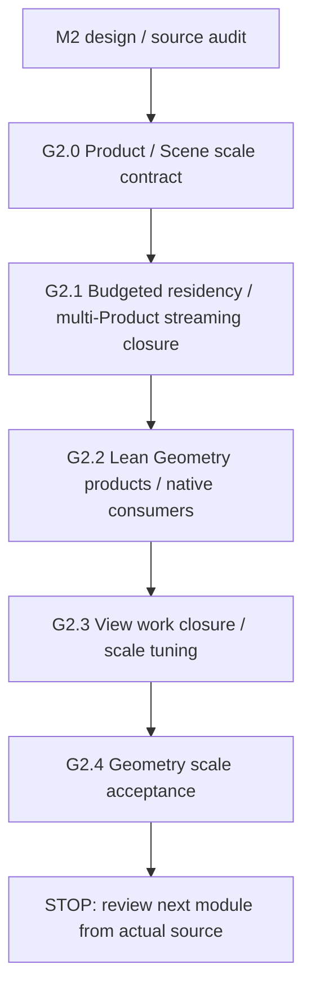

# EEngine V4 执行计划：完整责任闭包与规模优化

全局架构不变量依据 [V4 母稿](../next-design/eengine-v4-native-shading-2026-10.md)，本文保留 **M1/M2/CPU 实施记录和通用验证纪律**。M3 的唯一模块执行 authority 已转入 [Lighting Execution](./eengine-v4-lighting-execution-2026-10.md)，设计见 [Lighting Design](../next-design/eengine-v4-lighting-2026-10.md)；[workstream.authority/currentSlice](../../project/workstreams/active/eengine-next-clean-rebuild.yaml)导航当前模块，详细阶段状态只在对应执行计划。旧 R3/R4 为 history，不继续 Surface C，也不把旧阶段映射成 V4 已完成。

2026-10-07 文档切换时重新 `git fetch origin`，HEAD 与 origin/master 均为 `0386bea5fc59a98cefd3f54d2be589ab9b2ed0eb`，审查开始时工作区干净。当时仅重构执行模型，没有新实现或 GPU 结果；这是切换时点快照。S0/S1 的非生产交付见 §3.1/§3.2，S2 实际生产切换见 §3.3.1。实施前须再次核对源码身份和工作区。

## 1. 实施模型与验证纪律

### 1.1 Agent 入口与停止边界

收到“继续当前 V4 workstream”后：

1. 读 workstream authority/currentSlice 与本文阶段表，找到第一个未完成阶段。其他资产专项 workstream 不构成第二套 renderer authority；不新增 status/progress/roadmap。
2. 重新 fetch、确认 HEAD/origin/master/工作区，用 `node tools/vibe.mjs context <path>` 导航；读本阶段 producer、产品、全部直接 consumers 及近目录约束。context 不是许可或验证门禁。
3. 固定存活语义、真实合法场景、容量/失败行为和 Cost Card。按 §1.5 判断复杂度：简单工程代码直接实现，复杂模块优先研究成熟开源 hot path，再决定本地方案；实际引用或移植时核读相关完整阶段、license、关键分支并记录本地映射。计划或参考存在不代表移植完成。
4. 连续完成本阶段责任，再 architecture review、集中验证、分类定位失败、根因修复及受影响回归。缺少必需项就保持未完成，不能由测试颜色决定架构。
5. 在本阶段实施记录写 source/build 身份、实际交付、验证结果/限制、未运行项和开放问题。关闭后停在下一阶段边界；仅大模块/入口变化同步 currentSlice。
6. **每个大模块完成即 STOP。** M1 与 M2 已关闭（M2 结果见 §8.6.1）。停在模块边界，依真实代码重新评审后续模块；后续用户授权后才开始，不自动跨到 VT、Lighting、GI 或 ReSTIR。

**分阶段开发，不分阶段迁移 production。** 对 M1：S0 是小型实验，S1 在非生产环境构建完整 subsystem；两阶段中 RendererCore 和 FrameProgram 的生产 Surface 完整保持旧路径。S2 是唯一 production architecture switch，切换与删除属于同一个不可拆开的单元。阶段内部允许临时编译失败、无图或仅有隔离 harness；稳定边界必须是 100% 旧 Surface 或 100% SurfaceV4。对 M2：保留正确 Geometry owner；局部共享 ABI/核心 owner 重写也须完整构建、一次切换全部直接 consumers 并立即删除旧职责，但不强迫全 Geometry 从零 construction，不造 legacy bridge。

### 1.2 分阶段验证节奏

| 阶段 | 开发和集中验证 | 边界 |
|---|---|---|
| S0 | 只运行决定 native 物理可行性的 probe/oracle/calibration | 不建通用 benchmark framework，不触碰 production ownership |
| S1 | 连续构建；按需 typecheck、shader compile、targeted CPU/GPU oracle；完整 functional closure 后集中构建与集成验证 | work packages 不是生产迁移阶段，不每 helper 跑全性能矩阵 |
| S2 | 连续完成 ownership cutover 和 purge，之后集中 typecheck、build/新鲜 build:test、targeted semantics、真实 production GPU 链和 lifecycle | 不为中途绿色加 bridge；S3 不能代替 S2 必需正确性 |
| S3 | 旧 Surface 删除后做完整 Surface 场景/画质/生命周期/成本/CPU encode/GPU P50/P95 验收 | 实现级性能调优从这里开始，重要新机制仍需 Cost Card |
| 全 renderer 最终集成 | 后续 providers 闭合后的跨浏览器/设备/效果、长时质量、整帧预算、正式 evidence/claims | 本轮文档或局部结果不提前晋级整体验收 |

GPU 作业串行；不拼不同源码快照的通过结果。性能慢先解释必要工作、随机 gather、纹理 locality、register/spill、limits 和图边界；必要工作超预算时明确调整算法、lighting budget、quality 或 render scale，不隐藏 shortcut。普通 6–9ms、复杂 9–15ms、多灯 11–18ms 只是 planning targets，不是硬编码测试门禁。

<a id="validation-failure-contract"></a>

### 1.3 测试可信度与失败修复

保存原始失败输入/输出/source/build 身份，先区分 implementation bug、architecture bug、retired ABI test、fixture、lifecycle、numerical、environment/tooling。核对最小复现和独立预期，修根因并复跑原例及相关回归；无法解释就保持未通过，不把偶然复跑绿色追认为修复。

S0/S1 调用实际新生成 WGSL 和隔离链，S2/S3 调用唯一 production 入口。证明目标分支、非零有效 Lighting/VSM/IBL、真实 HDR/Aux 消费；mock、源码 regex、预填正确结果或归档 shader 不证明算法。结构搜索用于证明旧依赖清除，不能代替 GPU correctness。覆盖 tails/overflow/容量完整域；每 visible pixel 唯一 opaque HDR writer，background 单独完整写域。

退休时删/迁移 Tape opcode、six-signal、cache generation/nomination、旧 field/recipe 等表示测试。material numeric、C/X/Y/LOD、normal、coverage、HDR/preExposure、motion、publication atomicity、update/abort/retry、device loss、unique writer 与 fence 退休语义必须迁移新 owner。禁止 skip 必需断言、吞异常、放宽容差、漏像素、缩最终场景、测试专用 production fallback。预期改变要有数学/来源/新合同，实际质量或功能范围改变按用户授权处理。

最终源码变动后刷新受影响 build/checks；timeout、不完整 runner、不可用 timestamp、skip/未运行单列。实现覆盖、correctness、成本分别记录；新 owner 已知缺陷不得后移。

### 1.4 防止架构漂移

禁止测试失败就加兼容 path/fallback/adapter；性能慢就立即加 global cache/proof/reuse/history；dispatch 多就造 megakernel/VM；跨 pass consumer 出现就扩 Universal SurfaceRecord；新算法 history 交 Surface 统一管理；闭包未完成就持续 benchmark 并按数字改架构。

也禁止以保持 production 随时可运行为理由拆分 ownership 迁移、混合新旧 ABI，或留下“以后删旧 Surface”。Git history 保存旧实现，不保留 runtime selector、OldSurfaceAdapter、LegacySurfaceBridge、CompatSurface、SurfaceV4ToSignals、SignalsToSurfaceV4、FallbackVM、OldReconstructAdapter、LegacyPublicationWrapper。

<a id="source-reference-policy"></a>

### 1.5 复杂模块的开源参考与轻量 Source Map

**开源实现是优先参考项，不是强制依赖，也不要求所有代码移植。** 简单、局部、低风险的 glue code、数据转换、小 helper、简单资源绑定、已有 EEngine 的直接扩展及没有复杂 GPU 算法风险的普通工程代码直接实现，不额外寻找 donor。

复杂、高风险、性能敏感或易踩硬件执行坑的模块，先检查本地可复用基础，优先搜索成熟开源实现，再决定方案。适用范围包括 native material compiler、Visibility Shading、Program/Material Binning、GPU work generation、VG/VT/VSM/VRS、复杂 Lighting、SSR/SSGI/GI/ReSTIR、Temporal/Upscaling、Atmosphere/Volumetric 和复杂 streaming/residency；不能通过拆小任务回避整体研究。

有合适参考时，阅读真实源码 hot path 和相关完整阶段，核对数据流、GPU work、资源布局、关键分支、不变量、平台假设、性能边界与失败经验，再对照 EEngine/WebGPU 决定移植、改写或放弃。不照搬 C++ 框架、D3D12/Vulkan 封装或不适用的 bindless/ExecuteIndirect/wave 假设；平台适配不能无依据省略算法必要步骤。没有合适参考，或平台差异要求自主设计时，简述检索范围、缺口或平台理由及本地方案即可，不因缺 donor 阻塞开发。

复杂模块开工前可在**既有阶段实施记录或来源账本**留以下短记录，不建新文件、workstream、审批或重型文档流程；实际引用或移植的 Reference 才记录固定 revision、license、具体文件/函数及本地映射。

```text
Local:     EEngine 已有可复用基础
Reference: 实际研究的开源实现；无合适参考时简述原因
Adopt:     可吸收的算法核心、物理执行、工作组织或布局
Adapt:     针对 WebGPU/EEngine 的必要修改与平台边界
Original:  确需自主设计的部分及依据
```

开源只是设计参考，不自动证明本地性能、正确性或 adoption。最终 hot path 仍须本项目 Cost Card 和真实 GPU 验证；来源采用声明仍须来源核对、独立 oracle 与真实新 production 消费证据。简单问题直接解决，复杂问题优先借鉴成熟实现，确无合适参考或平台差异要求时自主设计。

## 2. 粗粒度后续模块（不是自动执行路线）

| 模块 | 目标 / 依赖 | producer→产品→consumer 与排序理由 |
|---|---|---|
| M1 Surface V4 | 完整 native subsystem→原子切换并删除→验收 | Visibility/publication/providers→HDR/Aux→既有 Temporal/effects；先消除核心执行税 |
| M2 Geometry / VG Alignment & Scale Optimization | 依已切换的 M1 winner/requirements；详细设计见 §8 | Scene/Product→budgeted residency、合法 view work、lean prepared geometry→Visibility/Surface/VSM/Temporal；保留正确 VG，先容量/生命周期，再优化冗余与规模成本 |
| M3 Lighting V4 | 依 native consumer、caster/geometry/资源边界 | 详细设计/执行已转入独立 [Lighting authority](./eengine-v4-lighting-execution-2026-10.md)，不在本文复制 |
| M4 Virtual Resources / VT（暂定后续） | 依 native sample 接口与真实 streaming | 资源 owner→page table/atlas/feedback→native sampler；待 M3 后按真实瓶颈另行评审 |
| M5 GI / Reflection / ReSTIR | 依 geometry、lighting、真实 demanded Aux | effect owner→indirect/reflection/reservoir/composition→HDR；输入/能量边界清楚后选择算法 |
| M6 Temporal / Upscaling / Presentation | 依真实 radiometry/motion/reactive/effect history | HDR/facts/exposure→Temporal/FSR/DRS/未来 AI→Post/Present；M1 已保证当前消费者 |
| M7 Transparency / Media / final integration | 依 opaque、lighting、Temporal | transparent/media→HDR/reactive/motion→presentation；完整交互后全 renderer 验收 |

保留 M1 的实施和结果，M2 详细单元与实际交付见 §8；M3 Lighting 已独立设计，M4–M7 依届时源码再设计，排序可调整。不宣称现有 VG、VSM 或 FSR 尚未实现；M2 不顺手重写 Lighting/VT 或后续 effects。

## 3. M1 Surface V4 实施与关闭记录

| 阶段 | 责任 | 状态 / 实施记录 |
|---|---|---|
| V4-S0 | Native Viability Gate | **closed / VIABLE（隔离物理模型）**；结果与限制见 §3.1 |
| V4-S1 | Complete SurfaceV4 Construction（non-production） | **closed / 非生产功能闭包已验证**；实际范围、成本及限制见 §3.2.1 |
| V4-S2 | Atomic Production Cutover + Immediate Destructive Purge | **closed / 唯一 native production 与旧链删除已闭合**；实际接线、GPU 正确性、资源账及既有测试失败见 §3.3.1，不代表完整验收 |
| V4-S3 | SurfaceV4 Acceptance | **closed / M1 Surface 验收完成，STOP**；生产正确性、场景/成本与已知限制见 §3.4.1；不是全 Renderer/AAA/60fps 或全 Node suite 通过声明 |

```text
S0 native viability（production 外实验）
  ↓ pass；不成立则先修正必要工作/物理模型
S1 完整 SurfaceV4 construction（非生产）
  ↓ 完整功能闭包、集中验证
S2 唯一原子 production cutover + 立即 destructive purge
  ↓ 旧依赖删除、唯一生产架构、集中验证
S3 完整 SurfaceV4 acceptance
  ↓
STOP；依据真实代码再设计 M2
```

原 S4.0→S4.1→S4.2 one-route production→S4.3 multi-route→S4.4 Aux→S4.5 retirement 顺序已被本四阶段模型替代，不再作为未来迁移路线。阶段状态只在上表及实施记录；S1 packages 不另设状态系统。

### 3.1 V4-S0 — Native Viability Gate

目的只回答 native useful work 的真实物理成本。小型隔离实验使用真实 Visibility/MeshletWork、instance/source/frame geometry、TextureResidency、cluster、VSM 与 IBL，执行 geometry reconstruction→native material→lighting→pre-exposed HDR；比较 fused 与明确 compact record split。不能借旧 heap、Tape、cache、six signals、history、Reconstruct，也不能加 binning/reuse/VRS 掩盖必要工作。

只校准解释该路径所需的 bandwidth、random gather、texture、ALU 和 dispatch/pass 固定成本，不建大型平台。简化输入必须显式标 SIMPLIFIED INPUT 并说明偏差；推断 spill/occupancy 标 INFERENCE，不用峰值或缩水 workload 充当 production 性能。

**退出条件：** 独立数值/有效 provider 和输入链成立，geometry/material/lighting/VSM/IBL 增量及 fused/split 有一致 Cost Card 和真实计时，差异可解释、管理税低、high coverage 必要工作在合理可优化量级。结论为 VIABLE、VIABLE WITH ARCHITECTURE ADJUSTMENT 或 NOT YET VIABLE；不能用 `<X ms` 强行通过。未成立先查必要工作，不进入 S1。S0 probe 是实验设施，不是第二 renderer；本次不展开其实现设计。

### 3.1.1 S0 实施记录（2026-10-07）

**结论：VIABLE，范围仅为下列明确的 native useful-work fixture。S0 关闭，S1 next，未实施 S1。** 该结果证明简单 native 执行的物理成本成立，不证明完整 production 性能、任意 graph backend、复杂场景或 AAA 全开预算。后续沿 fused baseline 构建；不把 compact split 作为默认跨 pass 产品，不创建第二 renderer。

重新 fetch 后 HEAD=origin/master=`0386bea5fc59a98cefd3f54d2be589ab9b2ed0eb`。实施开始时已有上轮 authority/执行模型的五份未提交文档改动，予以保留。结果对应本轮未提交源码；build:test source SHA256=`e5e1873a94e15aca81f2dd9bf8f559fbf532ffd16d02ae3b53e86b94dddcd0c1`、output SHA256=`e916927e7f85b234de6268b93b7dd838ab9f5083dfbc021c0dee983e33ae8abc`，完整 probe 入口 SHA256=`222af56fe48cfb75af9b309a5ac810187e05982984e4e0fe4a74675d47934e07`。实际 fused GML8VI WGSL SHA256=`226668cbda4779b43c0ec2f6d365fb8455fc747545e730874ebb0f307fcdb83d`，各 variant 的 source digest 都保存在报告。上述是测量身份，不是已提交 revision 或正式性能 evidence。

当时交付限于 `native-surface-shader.mjs`、`native-surface-gpu.mjs` 及 registry 的两个入口；这些依赖旧 Lighting ABI 的 S0 实验已于 M3 L3.2 退休，源码与原结果由 Git/既有 artifact 保留，现行数值语义由 native production/integration 与 LocalLightWork oracle 承担。共享 `surfaceGeometryCompletionWgsl` 当时只增加可关闭 diagnostic atomic 的参数；四种生产默认组合生成的 WGSL 与该起点 HEAD **逐字节相同**。当时 RendererCore、FrameProgram、publication owner、旧 Surface 生命周期均未改接；没有旧 VM、cache、signal/history/field heap、binning、queue、proof 或 Reconstruct 依赖。

### 3.1.2 Workload 与 SIMPLIFIED INPUT

- Windows 报告 GTX 1650 Ti 4GB、driver `32.0.15.8142`；Chrome `154.0.8037.98` headless，WebGPU adapter 为 nvidia/turing、非 fallback。使用 timestamp-query，本次协商 16 storage bindings（既有 Geometry producer 要求至少 15，native shading 使用 8 个）。不以显卡峰值推导时间。
- 1920×1080，2,073,600 screen pixels，32,400 个 8×8 workgroups / meshlet work slots，64,800 triangles。硬件 raster 写 r32uint Visibility + Depth，readback 实数为 **1,969,920 visible pixels（95%）** 和 **1,036,800（50%）**。24-bit slot + 8-bit primitive、外部 generation 保持原 ABI。
- 真实 FrameGeometryArena/FrameGeometryVertices producer；probe 读 actual MeshletWork、frame instance、arena directory、三顶点 clip/world position/normal/tangent/UV，再做原齐次 barycentric/gradient、textureSampleGrad、normal mapping。额外强制走 actual resident payload / instance matrices fallback，与 prepared 输出逐像素相同。Geometry preparation 与 raster 不在 Surface useful-work 计时内。
- Standard 的 baseColor/metallic/roughness/AO/normal/emissive/coat 与当前线性材质 profile 数学对应；5 个 texture queries，显式 gradient。Unlit 只有 base query。本轮是手写 native graph 对应数学，各 native specialization 通过真实 WGSL/pipeline 编译；不是 arbitrary graph compiler，完整 custom graph backend 留 S1。
- 4/8 **point lights 外加 1 directional**；消费真实 LightDatabase/cluster ABI 与 production Lambert/Smith-GGX/Schlick/coat helper。view depth 从 recovered position 推导；near=0.1/far=100 的 logarithmic slice 参数按当前 LightClusterPass.packSettings 生成，不使用常量 depth 或退化参数。VSM directional 查询消费 256 resident pages、真实 checkerboard depth atlas、2×2 PCF，存在可见与遮挡；point/spot shadow 按当前 helper。IBL diffuse/specular/DFG/coat 非零，消费 production octahedral helpers。Rec709→Rec2020、preExposure=1.25、rgba16float HDR。
- **SIMPLIFIED INPUT：** orthographic tessellated fixture、单实例 identity transform、一个 compatible material array；不是生产 Scene/VG culling/alpha producer。材质纹理为程序生成 512²×5、10 mips，没有通过 TextureResidency/routes/事务构建；cluster lists / VSM residency 为 ABI fixture，不测 producer，所有点灯覆盖所有 cluster；environment texels 为非零常量且高度 cache-local。它低估复杂纹理/实例/streaming entropy、透视/非均匀变换、资源路由与生命周期成本；32,400 slots、每像素 8+1 灯又高于一些简单场景必要量。不能外推为 production 场景。

### 3.1.3 Native useful-work 分解

每 coverage 先提交 24 次完整 workload 预热，各 variant 再丢弃 3 次、取 9 次；末尾另取 5 次 G/GM/GML8/GML8V/GML8VI 控制。P95 是 **9 次样本的最大值**，不是长时尾延迟。硬件 cache/locality 不等于 Surface cache/history。复用 GPUFrameTimingRing，同时记录 pass 与 command span；有 2 个 timing marker passes，不当 shading dispatch。

| Native variant | 95% P50 / 样本 P95 ms | 50% P50 / 样本 P95 ms | 95% 相邻增量 ms |
|---|---:|---:|---:|
| G | 0.997 / 1.001 | 0.803 / 0.811 | Geometry diagnostic baseline |
| GM | 1.102 / 1.534 | 0.939 / 0.945 | Material +0.105 |
| GML4 | 2.466 / 2.599 | 2.284 / 2.727 | 4 points + directional +1.364 |
| GML8 | 3.201 / 3.829 | 3.185 / 3.447 | 4→8 points +0.735；对 GM +2.099 |
| GML8V | 4.066 / 4.997 | 3.953 / 4.197 | VSM net +0.866 |
| GML8VI | 6.310 / 6.917 | 6.086 / 6.351 | IBL +2.243 |
| Unlit | 0.546 / 0.709 | 0.541 / 0.545 | 单 base query 的低成本参考 |
| Compact44 | 8.024 / 8.243 | 6.982 / 7.450 | 相对 fused +1.714 / +0.897 |

G/GM 用 output sink 保留 position/normal/tangent/UV/gradient，避免 GM 的 Geometry 被 DCE 减少后声称负 Material 成本。以上为**不同 compiled kernels 的诊断差分**，包含 live ranges/DCE/调度变化，不是可加的硬件 counter。末尾 95% G=0.740、GM=1.102，配对差为 0.362（表中首次差为 0.105）；GML8=3.245、V=4.143、VI=6.421。完整 workload 首尾较稳定；小 kernel 首尾仍漂移，所以 Material 差分只能报约 0.10–0.36ms，不能宣称更精确。clock/执行状态变化是 INFERENCE；无 clock/register counter，根因归因仍未知。VSM 增量是 net：被 shadow 拒绝的 directional 会跳过其 BRDF，不是纯 query 成本。

resident fallback 完整 native 在 95% 为 **6.485 / 7.053ms**、50% 为 **6.304 / 6.599ms**；整幅 HDR 最大差 0。两种 coverage 都是细列式 mask，每个 wave/workgroup 仍有活跃 lane，所以 50% pixels 不等于一半执行批数。DRS/完全空 tile 的缩放规律未测。

### 3.1.4 Fused / Compact 与 Cost Card

Compact 为 **44B**：32B response（half base/metal/rough/AO/emissive/coat，UNORM16 oct base+coat normal）+ 原 fp32 position 12B，array stride=44，不用旧 Surface products。fp16 oct normal 曾超预算；改 UNORM16 后，原 32B 路线从 Depth 重建的位置在 VSM 页边界产生不同查询，因此保留原位置。没有放宽断言或声称 32B 已正确；S1 若重选 compact 须重新证明精度/位置语义。

| 95% Cost Card | Fused GML8VI | Compact44 |
|---|---:|---:|
| screen / visible pixels | 2,073,600 / 1,969,920 | 同左 |
| 估计逻辑 read / visible pixel | 1,536B | 1,584B |
| write / screen pixel + visible 额外 | 8B + 0 | 8B + 44B |
| 必要 framebuffer / record 顺序流量 | 24.883MB/frame | 206.531MB/frame |
| 逻辑 random storage（未扣硬件 cache/DCE） | 2,340.265MB/frame | 同左 |
| 逻辑 texture tap budget | 677.652MB/frame | 同左 |
| 合计逻辑字节，**不是 DRAM counters** | 3,042.801MB/frame | 3,224.448MB/frame |
| samples / visible pixel | material 5 queries；VSM 4 taps；IBL 21 texel loads | 同左 |
| 粗估 scalar FLOP / visible pixel | 2,220 | 同左，另有未精确计入的 pack/unpack |
| special-op 估计 | 22 normalization、18 BRDF sqrt、9 coat pow、2 log2；非实测指令 | 同左，另有 oct pack/unpack |
| shading dispatch / pipeline activation | 1 / 1 | 2 / 2 |
| explicit atomic / barrier | 0 / 0 | 0 / 0 |
| Surface scratch / persistent history | 0 / 0 | 91,238,400B（87.012MiB）/ 0 |

MB 为十进制，MiB 为二进制。实例 stride 按逻辑上限估计，prepared 路径可 scalarize flags；同三角形、实例、灯光、page table 与 texture taps 高度重复，不能把全部逻辑字节除 DRAM 带宽当下限。Geometry unique-input footprint 粗估 12.442MB；没有 DRAM transaction counter。

probe peak 创建两条实验的全部资源：buffers=202,300,848B（含 compact、HDR/winner readback、64MiB calibration buffers），textures=59,757,900B，arena=25,661,696B，Geometry producer=128B，timers=1,536B；合计约 **274.39MiB**，不含 driver pipeline/query objects 和隐藏 alignment。去掉 compact、readback/calibration 后，fused fixture 粗计约 **100MiB**；不是完整 renderer VRAM，不含大型 scene residency/效果历史。没有持久 shading history。

Compact 多 **181.647MB/frame** 必要顺序往返；按实测 RW 169.49GB/s，streaming 税下限估计 **1.072ms**，额外 pass/dispatch 约 0.0036ms。实际慢 **1.714ms**；约 0.64ms 残余含 pack/unpack、失去融合/调度等，具体 counter 归因未知。break-even 要省掉超过实际约 1.71ms 的计算/occupancy 成本，本次未赚到，不采用默认 compact。不能证明绝无 spill；**INFERENCE：** 本 profile 未显示足以抵消存储税的 split occupancy 优势。

### 3.1.5 Calibration / Model vs Reality

| 小型校准 | P50 ms / effective throughput | 口径 |
|---|---|---|
| Sequential RW | 0.396 / 169.49GB/s | 32MiB read + 32MiB write |
| Sequential read | 0.303 / 138.38GB/s | 32MiB read + 8MiB sink，非纯 read |
| Sequential write | 0.193 / 173.46GB/s | 32MiB write |
| Random gather | 2.367 / 28.36GB/s | 32MiB LCG gather + 32MiB sink，非 Geometry 专用带宽 |
| Texture local / random | 0.545 / 22.264；61.58 / 1.51Gqueries/s | 每 lane 16 bilinear level-0 queries，含循环/坐标/sink；非 trilinear 或 IBL textureLoad |
| ALU 32 varying BRDF | 2.497；约 2,658 estimated GFLOP/s | 66,355,200 evaluations，约 100 scalar ops/eval 含动态输入递推、2 sqrt/divisions；非峰值 counter |
| Dispatch/pass | 0.00362ms | 可观测 sink update 的固定 GPU 开销；非 CPU pipeline switch 成本 |

各 calibration sink 在计时外有独立 CPU 检查。第一版固定角度 BRDF 被 compiler 常量折叠，约 18TF 的无效 throughput 已拒绝使用；改为 lane+previous-result 相关角度/roughness。初轮 G 数 ms / GM 更低还混入不匹配 DCE 与执行状态；保存原始数据、增加匹配 sink/完整预热/末尾控制，没有减 lights、关特性或调宽容差。

GML8VI 必要 streaming bandwidth 下限估计 **0.147ms**；按实测 dependent BRDF 和 2,220 estimated FLOP/pixel，compute-profile floor estimate **约 1.65ms**。两者不是总时间预测或可加 counter。误设 random logical bytes 全部 uncached 会得到 **约 82ms**，与 6.31ms 冲突——错误的是 cache/struct-load 假设。5 个 material queries 的 locality stress 范围约 **0.160–6.535ms**，也不能套给 21 IBL loads；不能用一个全局有效带宽代表混合 kernel。

乐观下界 max(streaming, BRDF profile)≈1.65ms；采用约 0.74–1.0ms Geometry、0.10–0.36ms Material、2.1ms 8+1 direct、0.87–0.90ms VSM、2.24–2.28ms IBL 的**测量后分解**，expected 约 6–7ms，样本悲观约 8–9ms（含本轮调度波动）。这不是独立预测或所有场景上界。必要工作的差分可解释，IBL 是主要增量；实际 cache miss/register/spill/latency 的 counter 归因未知，不用管理系统掩盖它。S1 保持 source/live-range/真实规模可审计，S3 才做完整生产调优。

### 3.1.6 验证、限制与下一边界

通过：两个新增模块 `node --check`；`npm run typecheck --prefix OEngine`；最终 `npm run build:test --prefix OEngine`；真实 GPU numeric（含 resident fallback）；完整 viability matrix（两 coverage、fused/compact、fallback、校准、末尾控制）。5 个独立 CPU HDR samples/variant 最大误差 <0.00079；整幅 fused/compact 8,294,400 channels/coverage 最大差 0.0029296875，预算保持 0.004 absolute + 0.4% relative；没有 skip、放宽容差或非有限值放行。harness GPU/API/page errors 为 0。文档校验 0 finding（62 个已有 history warnings），doctor 通过，documentation/context tests 9/9 通过，git diff --check 通过。

原始运行报告在忽略的 `.local/v4-s0/`：`initial.json`、`compile-fix.json`、`numeric-unorm.json`、`numeric-position.json`、`full-first.json`、`full-span.json`、`full-controlled.json`、`numeric-final.json`、`final.json`、`final-routed.json`、`numeric-routed.json`。它们是本机诊断，不新增 authority/正式 evidence。重跑入口为 `node tools/gpu-oracle.mjs native-surface-numeric --json` 与 `node tools/gpu-oracle.mjs native-surface-viability --json`，后者先依赖新鲜 build:test；GPU 作业串行。

未运行：生产 Surface GPU 回归、engine 打包 build、browser matrix/其它设备、真实 complex scene/TextureResidency/alpha、non-uniform scale/negative determinant/透视、完整 arbitrary graph/事务/abort-retry/device loss、DRS/FSR、长期 VRAM/P50/P95。共享 helper 的默认 WGSL 已与 HEAD 精确比对；后续生产等价闭包与合法 corner cases 仍是 S1/S2/S3 必需责任，不能因这里关闭 S0 而删减。

**下一阶段仅 V4-S1 完整非生产 Surface construction，以 fused native 为物理基线。** 完整 compiler/publication、多 Program/BindingSet/routes、Aux 与 lifecycle 闭合前，Renderer/FrameProgram 保持 100% 旧 production。此次停在 S0→S1 边界，不开始 S1，不修改旧 B2 defects。

### 3.2 V4-S1 — SurfaceV4 Complete Construction

在不进入 production Surface 的前提下完成整个 subsystem。S1 期间 RendererCore、FrameProgramLowering 仍完整使用旧 Surface，旧公开 publication 生产合同保持不变。新 native publication 在隔离环境拥有真实新产品及事务；共享基础设施不等于包装旧 Tape/cache/field 数据。允许源码共存，不允许第二 production renderer 或半接 production。

以下五个 packages 只表示开发依赖顺序，不是独立切换阶段、workstream 或 authority：

| Package | 必须闭合的责任 / 输出 |
|---|---|
| Compiler / Publication | Graph→typed IR/CSE/DCE/dependency/frequency/derivatives→native WGSL→async pipeline/registry→MaterialInstance publication；Standard PBR、Unlit、Clearcoat 和真正 custom graph；显式 C/X/Y/SampleGrad、texture/Product 语义；update、atomic publication、abort/retry、lease、device epoch |
| Native Surface Core | one Program、compatible BindingSet、多实例的内部 vertical slice；真实 winner reconstruction、position/normal/UV/tangent/gradient、cluster/VSM/IBL→HDR；background、alpha winner、preExposure；选择 S0 支持的 fused/有限 compact 物理执行方式 |
| Execution Bins | 完成 dense one-route bypass + CompactPixelBins multi-route（或 Cost Card/证据支持的替代）；多个 programs/material instances/BindingSets/routes，GPU count/offset/index/indirect、完整 capacity/tails/overflow/唯一 writer，CPU 命令随 bins 而非实例数增长 |
| Aux / Temporal Contract | 从真实 TemporalFacts/FSR/Debug/effect consumers 倒推有限 Base/Temporal/Reflection-GI profile、motion/reactive/validity 与必要响应；显式精度预算/需求；无 consumer 不声明、不分配，不为未来恢复 GBuffer |
| Lifecycle / Integration | 资源 ownership、preflight/prepare/commit/abort/retry/invalidate、resize/recovery/fence、物理计账及隔离集成 harness；新 producer→HDR/Aux→真实所需 direct consumer 接口完整闭合 |

one-route 只验证新 subsystem 内部第一个 vertical slice，**不接管生产**；multi-route/multi-binding-set 与最低 Temporal outputs 必须在同一 S1 中完成。禁止通过准入收缩把当前合法多 route 场景变成“不支持”再切换。

**允许共享基础设施：** GPU Scene、RenderWorld 合理的 instance/material/resource 产品、Visibility+Depth/GpuVisibilityKey、MeshletWork/FrameGeometryArena/source buffers、TextureResidency/静态材质资产、cluster/VSM/IBL/environment/BRDF、FrameGraph/CommandContext/timing/accounting、GraphCompiler 分析和 Registry 合理的 async/lease/preflight/device-loss 生命周期。提取纯数学/helper 时不能保留旧 runtime 产品依赖。

**禁止新 subsystem 依赖：** SurfaceWorkRuntime、SurfaceFrameResources 旧 banks、GpuSurfaceWorkAbi heap、GPU Tape/appearance_exact_dag interpreter、Closure Cache/nomination/publish、coherence、six RGB store、generic signal history/Reconstruct、old fields/work packets/proof/store/reference。禁止新 Material→旧 Signal Store、新 Surface→旧 Reconstruct、新 Geometry→Closure Cache、新 Aux→SurfaceWorkRuntime 或 Old Surface→partial V4。

**完整功能闭包：** isolated integration 使用真实 Visibility winner→ExecutionBin→Geometry→Native Material→cluster/VSM/IBL→HDR→最低 motion/reactive/Aux。覆盖多 program、多实例、多 BindingSets/texture routes、normal/ORM、coat、Unlit、custom graph、当前 winner 所需 alpha、主/阴影 alpha 一致、preExposure/background 与 Temporal/FSR 的真实输入。验证 non-uniform scale/朝向/导数等存活语义，不用预填 closure/lighting 或空 consumer 代替。资源协商与隔离生命周期独立清楚，不能要求 production 同时持有两套 Surface 工作集。

**退出条件：** 全部 packages 的实际 producer/product/consumer、资源和失败语义闭合，进行一次集中 typecheck/build、native 数值/采样、隔离 GPU integration/lifecycle 与结构/Cost Card 核对。S0 关键结论不能在集成中被未解释成本推翻；这不是每 helper benchmark，也不是完整 production 性能验收。列出 S2 完整 ownership/deletion 清单后才能关闭；只写完 compiler 或一个 PBR shader 不算完成。

<a id="v4-s1-construction-record"></a>

### 3.2.1 S1 实施记录（2026-10-07～08，非生产闭包关闭）

**S1 closed；以下为 S1 提交时的非生产快照，后续生产结果见 §3.3.1。** Graph→native publication→GPU raster winner/bins→Geometry/Material/Lighting→HDR/Aux→native Temporal→真实 FSR 已在隔离集成中闭合。该提交中 RendererCore、FrameProgram、GpuRenderWorld 没有接入新 Surface owners，生产仍完整使用旧 Surface；没有 adapter、双生产路径或 fallback VM。下列结果不是 S3 acceptance，也不是来源 production adoption。

起点及当前 HEAD 为 `355349c09219fd388c09aaafdc311d90ab6d102b`；重新 fetch 后 origin/master 为 `0386bea5fc59a98cefd3f54d2be589ab9b2ed0eb`。结果对应这一起点上的未提交源码。最终 fresh build:test 身份：source SHA256=`e51ed74dc68998fed8cd78b259ef15cf333fdc8af18baf89672a813d7e0b8ea9`，output SHA256=`6afd0b240634b93ee503adaa6de38f26a76a2eed94e9e52980bb6688773229a8`；七项最终 GPU 报告均使用同一身份。适配器报告 NVIDIA Turing、Chrome 154，没有确切 device 型号，不能认定已确认 GTX 1650 Ti。

#### 实际 producer / product / direct consumer

| Package | 实际交付（路径相对 OEngine/src） | 产品与直接消费 / 边界 |
|---|---|---|
| Compiler / Publication | `shaders/native_material.ts`、`appearance_operations.ts`；`gpu/GpuNativeMaterialPublication.ts`、`NativeMaterialBindings.ts`、`NativeMaterialProducts.ts` | 现有 scalar IR/CSE/DCE/dependency/frequency→straight-line WGSL、完整坐标祖先 C/X/Y、native samplers→Registry leases；immutable constants +16B/slot directory +8B/slot versions→shade/alpha/Temporal。Standard、coat、Unlit、非线性及 texture-driven UV custom；没有 GPU opcode 解释。ready/commit/abort/retry、全部 PSO 原子发布与 fence/device epoch 闭合 |
| Native Surface Core | `render/surface/SurfaceV4.ts`；`shaders/native_surface.ts`、`native_surface_lighting.ts` | 原 r32 winner/context、MeshletWork、真实 FrameGeometryArena/vertex source→局部 reconstruction/CXY/material/cluster/VSM/IBL/AO/physical sun→pre-exposed working-color HDR；background 完整写域。normal/ORM、base/coat validity、非均匀与负 determinant、prepared/resident fallback；中间值默认 private/register |
| Execution Bins / winner | `NativeExecutionBins.ts`、`NativeRasterWorkPartitions.ts`、`NativeVisibilityPass.ts` 及对应 shaders | dense 0/1 route 无管理资源/dispatch；multi-route count→sharded histogram→hierarchical small prefix→scatter→native indirect shade。regular/VSM 实际 queue ABI→GPU count/prefix/scatter→bucket drawIndirect→native alpha/winner；无本帧 work readback 调度 |
| Aux / Temporal | `NativeSurfaceAux.ts`、`render/temporal/NativeTemporalFactsPass.ts`、`shaders/native_surface_aux.ts` | Base 无 Aux；Temporal 仅 demanded reactive `rgba8unorm` 4B/P。native versions + authoritative sceneInstances/winner→motion `rg32float` 8B/P、mask `rgba8unorm` 4B/P、双 `rgba32uint` identity 32B/P→真实 FSR；identity/history 属于 Temporal，Reflection/GI 没有 consumer 时拒绝启用 |
| Lifecycle / Integration | 新 owners 的 prepare/ready/commit/abort/invalidate/retire/device-loss；`native-surface-integration-gpu.mjs` 等隔离 harness | async CPU 描述符快照、buffer identity 含 offset/size；encoded abort→retry、resize candidate 不覆盖 committed 状态、失败 fence 清理、device epochs/资源计账。共享 FSR owner 补 resize/abort checkpoint 和 fence 退休，motion binding 用 unfilterable-float；XeGTAO 暴露既有 scalar AO。GPU exposure 每帧 copy 4B 到设置，不用 CPU 曝光代替 |

`bindingSet` 表示完整物理材质资源兼容身份（包含 Product），不是 TextureResidency 的 owner-local set ID。S2 必须在实际 scene publication 中接入此合同。当前保留编译期频率信息，便宜值仍 native inline；**未实现 GPU uniform store/update-frequency 物化优化**，不能声称已得到其收益。参数更新建立新的 immutable candidate，stable frame 复用 committed publication；实例/纹理层不制造结构 ProgramKey。

#### 资源能力边界与有限执行调整

实际九个材质 texture banks，加上 Visibility/VSM/IBL/AO/physical sun 与 cooked Product，完整 fused profile 可达到17 sampled textures，超过 default16。没有删除合法材质或 provider 来通过编译：

- `NativeMaterialProducts` 将 cooked half 原 payload 四个 half/rgba16 texel 原样打包为一个 texture array，保留每字段原尺寸、全部 mips/domain/footprint LOD；软件 clamp/bilinear/trilinear，非重新烘焙、重采样或 opcode interpreter。256MiB raw /258MiB physical-upload 预算在分配前检查，mip 起点8B对齐；使用现有 CommandContext 上传/提交/中止/退休，没有 private submit。普通 profile 可继续使用原硬件 Product 采样。
- 完整 footprint 仍超 sampled limit 且含 physical sun 时，publication 包含两个必须一起 ready 的有限 PSO：primary 计算 Geometry/Material + cluster/VSM/IBL/AO→initialHDR/Aux；continuation 重算本 bin 的 Geometry/Material，仅加 shadowed physical sun，读 initialHDR、写 finalHDR。primary 后 copy initialHDR→finalHDR 保证背景/其他 routes 完整写域；continuation 不重写 Aux。同一 encoder/submit，没有通用 MaterialRecord/deferred selector。
- 首个 `rgba16float` read-write storage 尝试被真实 GPU 拒绝，原失败保留；最终是独立 sampled HDR 读 + write-only HDR 写，不假定 tier1 支持该格式 read-write。

这是资源 limit 所需的正确性方案，不是性能优化 claim。默认仍 fused；没有复活 signal store、cache/history 或 Universal SurfaceRecord。

#### Cost Card（逻辑账，不是 DRAM/register counters）

| 机制 | bytes / 工作 / 管理 | 理想、expected、worst / break-even |
|---|---|---|
| Native graph | Standard/coat 两 queries，Unlit 一，texture-driven custom 四（上游三点+下游一点）；逐 query transform 常量24B/实例，directory16B/slot、versions8B/slot、实例 constants 实际大小。组件两实例 publication：328/336/144/224B，算术88B；native evaluate 无全屏 scratch、atomic/barrier/内部 dispatch | 0/50/100% reuse 都执行同一 useful work，没有 reuse 机制。CXY 上游追加 queries 是数学语义所需；无旧生产内存删除量或 uniform extraction 收益 claim |
| CompactPixelBins | queue `4P+32B`，32 sharded histogram≈`128B` bytes及 prefix scratch；这里 B 是 bin 数。两次 winner/mapping gather、index 一写一读；tile-local aggregation，每 tile/distinct-bin 两次 global reservations。count 两个/scatter 三个 workgroup barriers，prefix 每 block17 barriers；B≤256 四管理 dispatch，hierarchical513-bin fixture六次 | dense 路径管理为0。uniform tile一次预留64 pixels；最坏64 distinct bins/tile 时最多64 comparisons/lane及逐 pixel reservation。不是 cache hit率；break-even 是被避免的重复扫描/divergence收益是否超过组织/locality税，尚未宣称相对等价 native 分派提速 |
| 1080p八 bins 下限 | queue=8,294,656B，scratch=1,076B（其他 bindings/settings另计）。只计两遍 winner 8P + index write/read 8V=32.348MB/frame，未计 mapping/atomics/scan；按 S0 RW169.49GB/s 约0.191ms floor | 实测 bins 四阶段 median 和约0.580ms；差额含 mapping、reservation/barriers、scan/dispatch和访问方式，具体 transaction counter unavailable。logical read不等于 uncached DRAM |
| Packed cooked Product | 原 half payload +每 mip<8B对齐+尾 page padding；默认 physical/upload 不超过258MiB。每 channel 至多8个显式 trilinear corner loads，多个通道可重复取同 packed texel；额外索引/插值 ALU，不增加全屏产品 | 绑定数由字段数降为1；20 fields 实测 payload2800B/physical4096B。不是更快保证；0/50/100%复用均不减 per-pixel 工作，binding-limit correctness 用途，不适用 hit break-even |
| Sun continuation | 只在该能力 profile 额外8P HDR；copy额外16P traffic；affected fraction f 再增16fV HDR read/write、f×Geometry/Material重算及太阳工作，追加每相关 bin native dispatch；无 MaterialRecord scratch、atomics/barriers | f=0/.5/1 时额外流量为16P/16P+8V/16P+16V；1080p95%约33.18/48.94/64.70MB，按规划90GB/s约0.37/0.54/0.72ms floor，另计重算/dispatch。profile存在但无affected pixels仍付copy税；未实测其1080p净成本，不当 speed optimization。112B fp32 record 会增约232MB全屏 scratch、约464MB往返及 storage bindings，因此选择有限重算/HDR版本 |
| HDR / demanded Aux / Temporal | 默认完整HDR写8P，reactive写4P；motion8P+mask4P为真实 FSR产品，Temporal双identity持久32P。默认无Material/six-signal scratch或Surface shading history | 不把所有产品都当每pass全读写。history明确在Temporal/FSR计账；motion f32保留0.1 render-pixel目标，不为4B预算强行降精度。Reflections/GI无consumer→0资源 |

S0 mixed BRDF profile floor≈1.65ms、普通 necessary-work分解 expected6–7ms仅是参考；S1多 Program/资源路由、custom/coat/Unlit混合的 native median7.29ms处于同量级，不能从这个总时间反推 Geometry/Material/Lighting各自精确增量，也不能把S0的2,220 FLOP全部像素套作S1新指令计数。register/spill/DRAM counters 未提供，fused压力只可作 **INFERENCE**；没有新增 cache/proof 来解释未知。

#### 集中正确性、生命周期与真实 GPU 验证

通过：`npm run typecheck --prefix OEngine`、fresh `npm run build:test --prefix OEngine`、最终完整 `npm run build --prefix OEngine`；native contracts +FSR lifetime +既有 graph/normal-filter oracles +XeGTAO scalar contract **76/76**（无 skip）。结构搜索确认新 owners 不 import 旧 Surface runtime/heap/GPU Tape/cache，RendererCore/FrameProgram/GpuRenderWorld 没有新 Surface wiring；共享 Geometry/BRDF/VSM helpers 只复用源解码/数学。

收尾文档验证：`node tools/docs-verify.mjs` 0 findings（62 historical warnings保留）；`node --test tools/tests/document-system.test.mjs` 7/7；`node tools/vibe.mjs doctor`、SurfaceV4 context/router与`git diff --check`通过。workstream继续只导航Surface V4，未复制阶段状态；未修改domains为V4已生产。

七项最终真实 GPU 报告均 passed、无 scoped/uncaptured GPU errors：

| 入口（`node tools/gpu-oracle.mjs <name> --json`，新鲜 build:test 后串行运行） | 实际结果与限制 |
|---|---|
| `native-material` | 五类 graph×32 invocations、两实例/两 texture sets；独立 authored VECTOR WGSL reference 不经过 scalar compiler/CSE/emitter。Standard/coat/Unlit/算术 max0，custom max1.78814e-7，预算1e-4+abs(ref)×1e-4未变；算术独立CPU max≈2.98e-7。缺 gradient 的 oracle-only 负控制被检测。真实 TextureResidency minMip tail6→promotion0、abort保tail；普通/static Product GPU采样max1.19209e-7；20不同尺寸packed fields独立CPU max4.65661e-10 |
| `native-execution-bins` | tails、空bins、513-bin hierarchical prefix、forced2D dispatch、malformed/stale winners、回放/容量/完整 membership/唯一 writer；dense bypass无管理资源/dispatch。不是完整程序规模性能矩阵 |
| `native-surface-integration` | 真正 native GPU coverage winner、8instances/4Programs/8bins/2BindingSets→cluster8 point+directional/VSM/IBL/normal-ORM/coat/custom/Unlit→HDR/native Temporal→真实 FSR；11frames含stable/reset、resident fallback、encoded abort→retry、参数gain .7→.4、负/非均匀scale、GPU exposure1.25→2.5、resize abort/commit。每帧独立PBR样本36–48，maxHDRerror0.000489198；原max(.001,abs(ref)×.002)预算未变 |
| `native-surface-perspective` | 非零透视winner/CXY、physical sun、GPU exposure/update，独立PBR样本18–72/frame，maxHDRerror0.000843182；motion真实变换检查；非所有近裁剪/极值场景验收 |
| `native-surface-resource-profile` | 实际绑定全部九个Residency bank views +packed cooked roughness被shade/HDR读取 +完整 Product Geometry resource layout +两个sun continuation routes；每帧独立PBR样本36–48，max0.000489198。实际材质queries取一个bank，不称九bank混合采样吞吐；winner仍resident，不称真实streamed VG decode acceptance |
| `native-surface-device-epoch` | 两个独立 GPU devices，受控device.destroy后全部新owner/FSR-owned bytes 1,648,189→0、旧epoch PSO拒绝、显式重建；不是自动driver-fault恢复验收 |
| `native-surface-cost` | 下面1080p成本实验；不是 production/S3 benchmark |

默认及resource-profile还使用真实 VSM caster/page/atlas ABI：独立alpha/depth16,384 comparisons、positive covered14,336、depth误差0；stale queue/page、overflow及replay negative diagnostics通过。fixture motion最大投影误差0，非零transform motion已检查；不能外推所有运动场景。Unlit原0.0004预算在1.25 exposure归一域保持，2.5 exposure时绝对HDR half误差随曝光加倍，不声称原绝对误差不变。全域finite、writer/背景/Unlit/FSR输出检查未缩减。

**保留的失败与根因分类：** WGSL reserved `diagnostic`（改名）；Temporal误把frame-instance stride当scene stride（分离authoritative sceneInstances）；background half rounding fixture预期错误；透视/PBR reference选到texture/VSM边界（按真实UV/page interior选择CPU样本）；后者的初版条件曾让小分辨率PBR样本为0（已修正并硬断言每帧`pbrSamples>0`，包含参数update）；normal Product validity误读名称（按compiler的`normalTSValidity/coatNormalTSValidity`并加contract）；不合法rgba16float read-write storage（上文物理方案调整）；stale build被harness拒绝（fresh build后重跑）。原报告保留在`.local/v4-s1/`，不追认为首轮通过。

**未完全解释的诊断：** CPU ideal filtering与hardware SampleGrad最大差0.1336045265仍保留，不改为passed；独立per-mip marker诊断的gradient LOD最大偏差0.08009、SampleLevel有效LOD最大偏差0.001866。GPU authored graph reference验证同硬件采样下的compiler/CXY等价，独立CPU HDR oracle选择真实UV内部恒定区，二者不能冒称所有texture/LOD边界CPU精确等价。S2/S3须继续保留独立reference及失败控制，不能删诊断以提高状态。

#### 1080p隔离成本及资源账

P=2,073,600，V=**1,969,920（95%）**，32,400 tiles；8instances、4Programs、8bins、2BindingSets，8 point+1 directional、非零VSM、IBL、normal/ORM、coat/custom/Unlit及完整Temporal/FSR。Geometry是tessellated quad，cluster lists、VSM residency与environment内容为明确provider fixtures，不包含scene生产/streaming成本。共12frames，discard前3，保留9计时样本；前2帧全域数值检查，随后只移除inspection/readback/CPU pixel scan，全部GPU实际渲染工作相同。

| GPU timestamp scope | P50 ms | P95 ms |
|---|---:|---:|
| raster begin / count / prefix / scatter（分别） | .00614 / .03891 / .02458 / .05485 | .01830 / .20285 / .04461 / .23168 |
| native indirect winner raster | 1.33661 | 4.35853 |
| bins count / scan / finalize / scatter（分别） | .25267 / .01024 / .01024 / .30691 | 1.47878 / .03075 / .02912 / 1.04419 |
| native opaque + background | **7.29283** | **31.12435** |
| native Temporal resolve | .63354 | 6.13171 |
| FSR exposure ratio / PrepareInputs | .00464 / .46694 | .01152 / 3.98794 |
| FSR LumaSPD / ShadingSPD / ShadingChange | .11158 / .29274 / .03510 | 1.42230 / 2.01082 / .23962 |
| FSR Reactivity / Instability / Accumulate / RCAS | .66864 / .26720 / 1.39616 / .17046 | 2.47120 / 1.65398 / 4.58371 / 1.06669 |
| command frame span | **13.75027** | **62.95754** |

bins四阶段median之和0.58006ms，加native约7.87ms只是**不同scope的median之和，不是联合Surface P50**；CPU encodeP50≈1.1ms、prepare≈.4ms。报告里的unclassified/temporal/post聚合scope与内部passes重叠，不能重复相加。九个frame-span原样为62.958/57.296/57.646/53.760/13.644/13.416/13.668/13.679/13.750ms，前四个样本多个stage同时慢很多；尾部原因**未知**，没有clock/register/spill counters，不靠继续选最优样本关闭性能问题。早期native约8.9ms/bins约.76ms/span约16.96ms记录也保留；本次可关闭非生产功能构建，不宣称稳定production P95/60Hz或性能改善。

| 实际physical资源类别 | bytes | 口径 |
|---|---:|---|
| SurfaceV4 owned | 24,885,172 | 默认单HDR、bins与设置；本1080p profile没有sun continuation第二HDR |
| demanded Aux | 8,294,400 | reactive |
| Temporal persistent | 66,355,232 | 双identity与小设置；motion/mask在FrameGraph pool |
| raster partitions | 148,096 | 独立GPU draw work组织 |
| FSR persistent | 78,797,009 | 自有history/常量，未加在Surface中 |
| FrameGraph texture / buffer pool | 104,504,472 / 8,294,404 | 时点allocated/cached物理池；不是只按active相加 |
| experiment readback | 265,420,800 | **实验单列，非生产budget** |

以上未包含全部scene/geometry/material-texture/provider/driver资源，不把合计说成renderer总VRAM；S3必须做全机物理去重、峰值/retired/resize账。S1已计各owner live/retiring资源，销毁后归零；没有generic Surface shading history。

**未运行/下一责任：** Renderer production cutover/旧链purge、真实scene streamed Product/VG、driver-fault自动恢复、跨browser/全Renderer画质与同条件长序列P50/P95/VRAM峰值、正式evidence/claims均未运行，分别属S2/S3及最终集成。B2-NUM-001/002仍unfixed/unresolved；native update/atomic publication/abort-retry/HDR语义已迁入上述隔离测试，但旧producer未删除。S2切换前重新核查下表所有production direct consumers；不因S1关闭而跳过真实Scene/Coverage/VSM/Temporal/FSR接线验证。

### 3.3 V4-S2 — Atomic Production Cutover + Destructive Purge

这是 M1 唯一一次 production architecture switch，也是不可分拆的 cutover/retirement 单元。S1 完整闭包证明后，连续把 `FrameProgram→SurfaceWorkRuntime→fields/signals→Reconstruct→HDR` 改为 `FrameProgram→SurfaceV4→HDR+demanded Aux`，随即删除全部失去 consumer 的旧代码。中间允许编译失败/不可运行；不通过临时 adapter、selector 或双 owner 保绿。

| S2 切换前审查边界（路径相对 OEngine/src） | 同一单元必须切换的责任 |
|---|---|
| `render/pipeline/RendererCore.ts` | `_surfaceWork` construction、canPrepareFrame/prepareFrame、invalidate、commit/abort、destroy/recovery、诊断/config/counter；新 owner 对接单帧提交/重试/退休 |
| `render/program/FrameProgram.ts/FrameProgramBindings.ts/FrameProgramLowering.ts` | products/需求/key/preflight、Lowering 中 FrameProgramOwners.surfaceWork、addPublicationToGraph/addToGraph、绑定/资源导入；radiance/reactive 与 Sky/Aerial/Temporal/FSR 全部直接输出 |
| `gpu/GpuRenderWorld.ts/GpuAppearancePublication.ts/AppearanceProgramRegistry.ts/GraphicsContext.ts` | native instance/program/material/route publication、Scene stage/prepareAppearance/commit/update/release、async ready/lease/preflight/device recovery、静态资产与资源账；不能无条件整类 KEEP/DELETE |
| `render/CoverageRasterBindings.ts/MeshletBucketRaster.ts/RasterWorkPartitions.ts`；`render/vsm/VsmAtlasRasterPass.ts` | compiled alpha programs、constants/routes/runtimeInputs/coverageDirectory、texture/Product views、finite raster partitions 及主 Visibility/VSM alpha 直接消费；材质更新与阴影 coverage 一致 |
| `render/temporal/TemporalFactsPass.ts`、`shaders/temporal_facts.ts`；FSR/Debug consumers | 替换 surfaceMetadataOffsets/materialLookup/valueVersions 读取；保 motion/change/identity/validity/曝光；FSR color/depth/motion/reactive/validity/current/prior exposure 实际接齐 |
| native lighting consumer 与现有 providers | 保 cluster/overflow、VSM table/atlas/constants/content version、IBL/AO/颜色域；只替换旧 packets/history 中间读取，不在本单元重写 provider 算法 |

S1现已构建的目标 owners 为 `GpuNativeMaterialPublication/NativeMaterialBindings/NativeMaterialProducts`、`SurfaceV4/NativeExecutionBins`、`NativeRasterWorkPartitions/NativeVisibilityPass`、`NativeSurfaceAux/NativeTemporalFactsPass`。S2用它们替换上表真实职责，不创建包裹旧publication/Surface的wrapper。重点补齐：

- RenderWorld的实际Scene stage/update/release与全局material slot→native directory/versions、完整物理BindingSet（含Product）原子发布；TextureResidency minMip/revision与主/VSM alpha一致推进；packed Product与所有PSO/pending/retired资源进入同一物理账及fence。
- Renderer/FrameProgram的真实Geometry queues、prepared/resident/Product source views、cluster/VSM/IBL/AO/physical environment/preExposure绑定及最低Aux需求；单一Surface拥有HDR，provider continuation只在能力profile内形成明确HDR版本，不恢复six signals。
- regular及VSM draw partitions、caster/page generation/容量/invalid diagnostics换成native alpha直接消费者；旧CoverageRasterBindings的Tape依赖不能留作兼容输入。
- Temporal读取权威sceneInstances与native material versions；motion `rg32float`通过既有FSR unfilterable binding、reactive/mask/曝光连接全部FSR/debug consumers；history/reset/abort/resize/fence归具体owner。S1受控设备销毁不替代这里实际Renderer recovery接线。

上述是 S1 关闭时的待实施 ownership 映射；实际 S2 交付与验证见下方实施记录。新 owner 的隔离 oracle 不是 production fallback。

切换后**在同一 S2 内立即 dependency review → destructive purge → compile → 集中验证**，不允许 TODO later removal。

| 删除候选 | 判断 / 保留边界 |
|---|---|
| SurfaceWorkRuntime、SurfaceFrameResources 旧职责、GpuSurfaceWorkAbi | 删除中央调度/旧 allocation、banks/field/signal heap、work/control 及 old history；必要物理计账/fence/math 分离至真实新 owner |
| appearance_exact_dag GPU runtime、Typed Tape GPU backend、Closure Cache ABI/runtime | 删除解释执行、nomination/unique writer/publish/cache/reuse 协议；ExactAppearanceDag 只保新 backend 实际需要的 CPU 分析/数学，不凭文件名整删 |
| surface_work coverage/coherence/appearance/lighting/reconstruct 等旧 wrappers | 删除旧 work packet/heap/rate/six-signal/history/reconstruct；保 Visibility coverage、VSM/IBL/BRDF/Geometry 的独立有效职责或纯 helper，不能删除真实 donor 算法 |
| 旧 diagnostics/settings、timing categories、exports/tests、contracts/specs | 清除旧 cache/reuse flags、field/signal 账和运行接口；存活语义迁移新测试/owner，历史记录保留 history，不让已退休 ABI 继续约束 current |

**不可达退出条件：** 搜索 imports/exports、owner construction、FrameGraph nodes、resource/pipeline allocation、settings/diagnostics、tests/contracts。旧 runtime 不再 constructed/prepared/encoded/allocated/committed/invalidated/retired，并删除无 consumer 实体；不只去掉 addToGraph 调用或留死文件。实际依赖可能增减，最后以 fresh source audit 为准。

**集中验证：** 最新源码 typecheck/build/build:test、targeted material/coverage/HDR/Temporal semantics、真实唯一 production GPU 链、update/stable/abort→retry/resize/recovery/fence；结构清除、完整合法多 route 域和资源账一并核对。真实 cutover 后才更新 domains 已实现事实及稳定合同。必需失败不交 S3 掩盖；S2 关闭时已经只有 SurfaceV4 production。

<a id="v4-s2-cutover-record"></a>

### 3.3.1 S2 实施记录（2026-10-08，原子切换与删除关闭）

**S2关闭时：下一阶段仅 V4-S3，当时未启动；后续S3结果见 §3.4.1。** 唯一 opaque production 现为 `FrameProgram→SurfaceV4→HDR+demanded Aux`；Renderer 不构建、准备、编码、提交或退休旧 Surface。cutover 与 destructive purge 属于同一提交单元，没有 selector、adapter、旧 ABI 桥或 fallback VM。此结论是 ownership/正确性闭包，不是性能改善、完整画质或 M1 完成声明。

起点为已提交 S1 `43e6d2f9435da9472d4f880d08ca176dae9bed45`，本轮 fetch 后 `origin/master=0386bea5fc59a98cefd3f54d2be589ab9b2ed0eb`。下列结果对应此起点上的 S2 工作树；最终 fresh build:test 身份为 source SHA256=`b24880cb7a3f405122e18a2bd1dbc3ae799a2effa726706cf0109ca01db139d3`、output SHA256=`62484c597ba0e34142a2dcd356dfaf8dc81d23adae6e4bc5c3ff714e2f74fddf`。真实生产 resident/Product 报告均匹配这两个 hash；没有拼接不同 engine source 的通过结果。Chrome 154、NVIDIA Turing，设备型号不可得，不能宣称已测 GTX 1650 Ti。

#### 实际 ownership / producer / direct consumer 切换

| 实际 owner（路径相对 OEngine/src） | 已闭合产品、直接消费与生命周期 |
|---|---|
| `render/pipeline/RendererCore.ts` | 唯一 `_surface: SurfaceV4`；readiness/prepare、单 frame submit、commit/abort/retry、invalidate/resize、destroy/recovery/fence、diagnostics 与资源计账切换；不构造旧 runtime |
| `render/program/FrameProgram.ts/FrameProgramBindings.ts/FrameProgramLowering.ts` | owners/products/Graph imports 直接接 native；实际 Packed Visibility+Depth、FrameGeometryArena/source 与 Geometry Product banks、cluster/VSM/IBL/AO/physical sun/preExposure→HDR→Sky/Aerial/FSR/Post/Present。需要 sun continuation 的 profile 使用独立 HDR 读/写版本，未恢复通用 deferred/signal store |
| `gpu/GpuRenderWorld.ts/GpuNativeMaterialScene.ts/GpuNativeMaterialPublication.ts` | Scene stage/update/release→immutable native programs、全局 material directory、实例参数与 dynamic inputs、完整物理 BindingSets（含 Product）→Surface/alpha/Temporal；所有 required PSO ready 后才允许整 tick。成功事务推进 active，abort 保 candidate 重试，替换按 lastCompletion 退休；结构 identity 包含 Unlit，不以资源 hash 判等 |
| `render/MeshletBucketRaster.ts`、`render/surface/NativeVisibilityPass.ts/NativeRasterWorkPartitions.ts`、`render/vsm/VsmAtlasRasterPass.ts` | 同一 native alpha/constants/texture routes→regular 与 VSM partitions、Visibility winner 和 shadow caster；保 alpha-tested winner 语义。Visibility 仍 r32uint（24-bit workSlot+8-bit primitive、外部 generation/partition），删除无 consumer 的 ShadingBinId MRT |
| `render/temporal/NativeTemporalFactsPass.ts`、FSR/Debug direct consumers | 从权威 sceneInstances 与 native material versions 读取 motion/change/identity；reactive `rgba8unorm`、motion `rg32float`、Temporal mask/identity/history 与 exposure→真实 FSR。history 属于 Temporal/FSR，Surface 不拥有统一历史；旧 diagnostics UI/capture 改接实际 FrameProfiler native timings/counters |
| ResourceAccounting / GraphicsContext / 各 native owner | publication 已由 RenderWorld 计账，native raw scratch 只计一次；bins/partitions 随 extent/Visibility retirement 同步标记 fence，native Product/中性 AO/VSM lazy resources 均归实际 owner。device recovery 后新 epoch 重新构建，不借用旧 PSO |

保留 GraphCompiler 的合法图语义、scalar IR/CSE/DCE/dependencies/CPU oracle、TextureResidency、AppearanceProgramRegistry 的 async leases、Geometry/Visibility、BRDF/providers、FrameGraph/CommandContext。Compiled graph 的 WeakMap 降低 CPU lowering 重复，不是 GPU closure cache。snapshot 的每帧 callback/source 比较与真实 CPU encode 成本仍需 S3 测量，没有宣称完成 CPU hot-path 调优。

#### 已删除与语义迁移

实际删除 SurfaceWorkRuntime、SurfaceFrameResources/Types、旧 LightingBindings/Radiometry/Diagnostics、GpuSurfaceWorkAbi 和 field/signal/proof/reference/domain/profile ABIs、GpuAppearancePublication、CoverageRasterBindings/RasterWorkPartitions、旧 TemporalFactsPass、GPU Tape/appearance_program/appearance_exact_dag、Closure Cache/key/nomination/publish、全 surface_work wrappers/coherence/rate/Reconstruct、six-signal/history、无 consumer 的旧 tonemap/counter/capability/export/config。ExactAppearanceDag、ClosurePlan/ExecutionProfile/FixedSurfaceFormulas 无存活 consumer，整实体删除；Registry、CPU graph compiler 和 asset/cook infrastructure 保留。Geometry continuity 的存活编码迁至 `assets/GeometryContinuityAbi.ts`，不保旧 SurfacePrimitiveAbi 名称。

依赖 review 覆盖 source imports/exports、owner construction、Graph nodes、GPU allocations/pipelines、settings/counters/diagnostics、examples、tests 与 validation executable scripts。旧 runtime 专用测试及 proof/store/signal labs、旧容量/带宽/曝光脚本、旧 Tape/publication 三个 Appearance scripts、旧 shader-rewrite/prewarm 设施删除；纯资产/normal 数学诊断保留。Showcase BenchmarkCapture/UI 改接真实 native timing/counters，无旧诊断壳。counter 旧槽保留 holes，未挪动有效指标索引。历史设计、原数值与旧结果只供追溯，不冒称当前可执行。

| 退休表示 / 存活语义 | 新验证责任 |
|---|---|
| Tape opcodes/layout、六 signal store、Closure Cache generation/nomination、旧 field/work heap | 表示测试随 owner 删除，不复活协议保绿 |
| graph/material numeric、C/X/Y/SampleGrad/normal/Product | `native-material`、perspective/resource-profile/integration 与既有 CPU graph/asset oracle；独立 authored reference 保留 |
| alpha/coverage 与 VSM caster | native visibility/raster partition GPU 测试、isolated strict VSM alpha/depth 检查和真实 Renderer VSM page/caster 非零断言 |
| HDR/preExposure、unique writer/background、motion/FSR | native Surface/Temporal integration、真实 resident 与 Scene→WASM Product production oracle；真实 motion 与 alpha 拒绝/恢复 |
| 参数/custom dynamic update、stable、atomic publication、abort→retry、resize/device loss/fence | native publication targeted tests及真实 Renderer production 双输入 oracle；受控 device.destroy 后调用实际 recovery，不宣称自动 driver-fault 接受 |

B2-NUM-001/002 保持 **legacy-retiring-path-known-defect，unfixed/unresolved**；其旧 producer 在本单元删除，错误随 owner 退休，不称修复。update/stable/publication atomicity/abort→retry/HDR 存活语义按上表由 native owners 验证。

#### 原始失败、根因与修复边界

- **基础资源 / lifecycle bug：** VsmResources 同 buffer 重复 getMappedRange 形成重叠，改一次 mapping；VSM caster/demand producer 返回写前 Graph resource 版本造成依赖 cycle，改返回写后版本；MeshletWork 主/Product queue 的既有 generation copy 与 VSM 诊断 readback 需要 COPY_SRC，补真实 usage。未改变 VSM/Geometry 算法。
- **实现 bug：** bin count 初始化引入 TextureBindingSetPolicy 循环依赖，改从本地 bit ABI 计算；native publication 双分支清理 async task，避免 `.finally` 派生 rejection 无消费者；Unlit 结构编辑进入 publication identity。
- **fixture / tooling：** 原 production VSM 报告 pages=7/casters=0，输入未声明 CastsShadow。显式 authored shadow flags 后原生产 caster=18，未修改 renderer 伪造 caster。旧 mock 缺真实 release/destroy、旧 owner guard tied-to-ABI 迁移；Showcase Node 直读 TS 的 `.js` import 解析失败由忽略目录内临时 source resolver 处理，未加 production fallback。原失败全部保留。

#### 集中验证及实际生产 GPU 结果

| 验证 | 实际结果 / 口径 |
|---|---|
| engine `npm run build`、fresh `npm run build:test` | 通过；build 包含 TypeScript、Vite 和 declarations，test build 的身份见上文 |
| 受影响 ownership/packed-render-world/shared-geometry tests | 定向复跑 45/45；完整 matrix 包含 native targeted 语义 |
| engine 全 Node matrix | **534 项：506 passed、28 failed、0 skipped/cancelled**，全套未通过；见下方 baseline 分类，未忽略或改容差 |
| 串行 GPU 组件回归 | `native-material`、`native-execution-bins`、`native-surface-integration`、`native-surface-resource-profile`、`native-surface-perspective`、`native-surface-numeric`、`framegraph-lifecycle` 通过。前五验证真实 native 编译/资源/数值，numeric 是 S0 数学回归；没有重跑 viability/calibration 或 S3 timing matrix |
| `native-surface-production` | 真 cooked resident Packed Scene→实际 Renderer device/FrameProgram→native HDR/Temporal/FSR；5材质、4Programs/4bins/2BindingSets、16×16 全5mip authored alpha/normal/ORM、coat/custom dynamic/Unlit、8点灯+sun。update、encoded abort 不推进 active、retry/stable、alpha cutoff .5拒绝/.2恢复、resize、camera motion、受控 loss→真实 recovery epoch2，全域 finite/独立 Unlit HDR 检查通过 |
| `native-surface-product-production` | 普通 Scene→真实 WASM cook→Geometry Product admission→同一 production Renderer，执行同样语义和 recovery 检查；不是预填 Geometry/closure 或第二 renderer |
| 独立 HDR / VSM | 两 production 输入的 Unlit Rec709→Rec2020 HDR 最大误差 `0.00033362477511755806`，原 .002 预算不变；PBR 精确数值由独立 integration/perspective oracle承担，production 输入不冒称逐像素 PBR reference。VSM allocated/content-valid pages=7/7、casters=18、overflow=0 |
| 真实 visible pixels | resident 初始9,888、alpha拒绝8,188、resize12,843、camera motion12,904、recovery13,021；这是小型正确性场景，不是1080p high coverage workload |
| 资源账 | recovery 后登记 native raw scratch：resident **807,340B**、Product **808,124B**；owner 登记、scratch 不重计、fenced teardown 清零断言通过。此数不含 Graph HDR/Temporal/TextureResidency/VSM，也不等于 driver VRAM residency，不外推1080p |
| examples / 文档工具 | Showcase benchmark 6/6、performance metrics 6/6、surface-performance targeted TS 检查通过；tools tests 11/11、documentation subset 7/7、validation工具测试12/12、docs verify 0 findings（66 historical warnings）、doctor/context、diff whitespace 检查通过。旧 V3 未采样 profile 明确退为 historical，review 后同步生成 registry；生成文件不构成架构或采用依据 |

**28 个既有失败未修复：** 在隔离 S1 HEAD worktree 复跑完全对应测试名，第一组48项/23 passed/25 failed，cook 组13项/10 passed/3 failed。涉及 Geometry Product admission/locations/multi-runtime/residency layouts 与旧 fixtures、streaming mock 缺 uploadCost、zero-coat canonical 期待、Runtime Package metadata；另有 OEGPACK golden identity/activation 与 Original Nyx MeshletBuilder differential group-count。它们在切换前已失败，未作为 S2 新回归处理，也未通过删除、skip 或放宽期望转绿。非本 Surface ownership 切换的已存在 Geometry/cook/fixture 缺口保留给对应 owner，**不等于全套绿，也不等于 M2 验收**；本单元必需 native/实际生产语义已独立通过。

原始日志与每次失败/修复后报告在忽略的 `.local/v4-s2/`，包括 `tests-final-second.txt`、baseline两组报告、`production-accounting-first/second.json`、`product-production-first.json`、七项组件 GPU 报告与 build/tooling 日志；是本机诊断，不新增 authority/evidence/claims。重跑真实生产入口：`node tools/gpu-oracle.mjs native-surface-production --json` / `native-surface-product-production --json`，依赖 fresh build:test，GPU 作业串行。最终报告 pageErrors/failedRequests 为0，Renderer GPU error收集为空；console仍有403资源诊断与VSM unreachable warning，不能称整个浏览器console无诊断。

**未运行 / 限制：** S3 high coverage普通/复杂/多灯全场景、CPU encode/GPU P50/P95、峰值/长期 VRAM、完整图像质量、跨浏览器/其他GPU、真实大规模 streamed VG、自动driver-fault恢复、正式 evidence/claims 未运行。S1 CPU ideal filtering 与 hardware SampleGrad 最大偏差的诊断仍未完全解释，不升级为通过。Nyx vbuffer 的三个映射标为 `pending-native-adoption`：来源 hash/token 核对继续强制，本轮生产接线不是完整 Nyx 独立逐函数采用证明。未来性能判断继续以 Cost Card 和 S3 测量为据，不从删行数或小场景正确性推导提速。

**停止边界：** S2 原子切换+立即删除+必需正确性验证闭合；S3=next/未开始。workstream 仍只导航 Surface V4，不启动 S3、不改下一大模块为 active。

### 3.4 V4-S3 — SurfaceV4 Acceptance

只在 S2 已切换、删除并集中验证后启动；此时结果才代表真实 production SurfaceV4。集中覆盖：普通/复杂 PBR、normal/ORM、coat、Unlit/custom、多 program/multi-route/multi-BindingSet；high/低 coverage、near/far、camera motion、alpha；4/8/many lights、有效 VSM/IBL；Temporal/FSR、resize/camera cut、parameter update/stable frame/publication atomicity/abort→retry/device loss/fence。

同条件记录实际 visible pixels、programs/bins/BindingSets/tile entropy、GPU outputs/质量/误差、bytes/bandwidth、VRAM/temporary/persistent/retired/resize peak、CPU encode/dispatch/pipeline、Geometry/material/lighting/management 分解、Surface total/command frame span/P50/P95。无法获得的 counter/时间明确 unavailable；旧历史速度不冒充新结果。

这里才做实现级性能调优：定位 binning tax、gather、texture locality、register/spill、pipeline count，不立即加 global cache/proof/history/VM。新复杂优化先 analytical Cost Card→isolated evidence→break-even，理想100%都不赚钱则拒绝，零收益管理税过高则不进入普通 hot path。不能为过 planning target 减灯/关 normal/VSM 或暗改 precision；必要质量/scale 改变须显式决定。

**退出条件：** 实现覆盖、独立 correctness、生命周期、旧链清除和真实成本均有结论；缺项/不完整 runner 如实未完成。结论解释模型与实际差异，并记录尚需数据决定的物理边界，不要求所有输入次线性。关闭 M1 后 STOP，重新设计 M2，不能自动继续后续模块。

#### 3.4.1 S3 实施结果与停止边界

本轮重新 fetch：HEAD=`d88aece22d3d7938db2286bb1102afdeb11f154f`，origin/master=`43e6d2f9435da9472d4f880d08ca176dae9bed45`，开始时工作区干净。S2 已在本地提交；重新检查 Renderer/FrameProgram 的唯一 SurfaceV4 ownership、native publication、Visibility/VSM alpha、HDR/Aux→Temporal/FSR、commit/abort/recovery 与旧链不可达，没有再次迁移 production 或恢复兼容层。本轮只增加集中验收和修正实际计时/诊断归属。

GPU 报告使用 fresh `build:test`：source SHA256=`95acada96c0214bb0f2060527316147f3a9b0164bc80c80c845b51e557a48656`，output SHA256=`27cd83d7f124df7ccdbb9efa7127ce488b6e8d2a172a2c06b2a456de4fa560ce`。下方生成场景表来自 `acceptance-providers-retry.json`，oracle SHA256=`ad75be7cc291d8549586229fb7102331b820fd61f54d18598e5225884ea1fb7f`；最终源码复验另见下文。它们是 HEAD 加本轮改动的测量身份，不是退休实现的对比 evidence。Chrome `154.0.8037.98`，Windows，NVIDIA GTX 1650 Ti **4096MiB**、driver `581.42`；GPU 作业串行。生成场景 oracle 为 headless，Showcase 为 headed，不跨这两种条件宣称提速。

**实际交付：** [production acceptance oracle](../../OEngine/tests/oracle/native-surface-acceptance-gpu.mjs) 仅使用实际 Renderer/Scene/Packed upload，复用现有 GPU timing/readback 与独立 CPU BRDF reference；没有替代 Surface shader、预填 closure/Lighting 或第二 renderer。现有 production oracle 补充 camera-cut/reset→settled 的真实 native identity 接线检查。FrameGraph 把 `SurfaceV4/*` 标为独立 `native-surface` timing region，Showcase 只消费该 region 或实际 native pass ticks，避免把末端 Present 的旧 `surface` region 当成 Surface。Showcase 诊断读实际 RenderWorld 的实例、Program、Bin、BindingSet 与资源账，初始化完成前安全返回缺项。新增内容是本地验收 glue；未新增复杂 GPU 算法或开源 adoption 声明。

##### 生产正确性与 workload

- 1080p、8×8 个真实 cooked box 实例，非均匀 scale=`(1.5,.825,.1)`，真实 winner/meshlet/instance/frame geometry/native graph/cluster/physical sun/VSM/IBL→pre-exposed HDR。P=`2,073,600`，V=`1,957,668`（**94.409%**），8×8 tiles=`32,400`。全部 64 instance 有 winner；完整 HDR 域 finite，每 visible pixel 获得正 radiance。
- 64 material instances 不等于 64 Programs。ordinary：1 Program/1 Bin/1 BindingSet，normal/ORM；complex：真实 custom graph，8 次 UV sin warp、normal sample 参与后续 color query 坐标、ORM、emissive、coat=.4/roughness=.3；多 route 组实际发布 8/32 Programs 和同数 bins、1 BindingSet。其 sin 深度随 Program 不同，**不是只改变 Program 数的等工作量性能对比**。Unlit 为单 Program、零点灯参考。
- 256×256、完整 9 mip authored normal/ORM/color 由 TextureResidency 发布。4/8/32 点灯数量分别检查实际 GPU light publication；distance=100、radius=.1、intensity=1，不把非零列表当作零 Lighting。ordinary 各组 64 个样本与独立 CPU 点灯 HDR delta 对照，最大绝对误差分别 `.000116144/.000109336/.000230904`，原先定义的 `.002 + .003×abs(reference)` 预算不变。Unlit 独立 working-color HDR、custom gain update 也通过；complex/coat 的完整数学另由集中 native-material/perspective/resource-profile oracle 验证，生成场景不冒称 custom 全像素 CPU 图像 reference。
- 首次 dirty-content frame 实际 VSM allocated/valid pages=`9/9`、casters=`180`、overflow=`0`；实际绑定的 diffuse/specular/DFG 采样 peak=`.323974609375/.2154541015625/1`，均 finite/nonzero。稳定 VSM 复用有效内容时 caster 写入可为零，不要求每帧重新 raster 来证明 provider 有效。provider readback 的额外 diagnostic submit 在计时之外；每个计时 production frame 恰好一个 submit。
- 真实 resident 与普通 Scene→WASM Product 两入口复跑 parameter update、publication atomicity、encoded abort→retry/stable、alpha reject/restore、normal/ORM/coat/custom/Unlit、多 BindingSets、camera motion、explicit cut→identity reset/settled、resize、受控 device.destroy→真实 recovery epoch2、fenced native ledger teardown。两入口均通过；不等于自动 driver-fault 恢复或完整大场景 VG 验收。

##### 1080p 实测成本

每组预热30帧，之后才启用120帧完整 timestamps；读回发生于计时外检查帧。以下 **同帧 pass 总和先求和再求 P50/P95**；native span 单独包含其间 copy/clear/marker，不重复加到 pass 总和。CPU 为 `renderer.render()` host elapsed，不含 host fence wait；dispatch 是整 production frame，非仅 Surface。

| 生成场景（全部 V=1,957,668） | lights / Programs / bins | Surface P50 / P95 ms | bins P50 ms | frame span P50 ms | CPU render P50 ms | frame dispatch |
|---|---|---:|---:|---:|---:|---:|
| ordinary normal/ORM | 4 / 1 / 1 | 5.552 / 6.829 | 0（dense bypass） | 45.970 | 5.4 | 87 |
| ordinary normal/ORM | 8 / 1 / 1 | 7.113 / 8.552 | 0 | 50.218 | 5.1 | 87 |
| ordinary normal/ORM | 32 / 1 / 1 | 14.201 / 14.957 | 0 | 57.177 | 5.0 | 87 |
| custom + coat | 8 / 1 / 1 | 8.529 / 9.324 | 0 | 54.050 | 6.9 | 87 |
| custom + coat | 32 / 1 / 1 | 16.601 / 16.976 | 0 | 60.276 | 6.8 | 87 |
| multi-route custom + coat | 8 / 8 / 8 | 10.130 / 10.531 | .840 | 54.634 | 7.2 | 98 |
| multi-route custom + coat | 32 / 8 / 8 | 17.749 / 18.702 | .844 | 63.805 | 10.2 | 98 |
| multi-route custom + coat | 8 / 32 / 32 | 12.026 / 12.370 | .889 | 58.714 | 11.8 | 122 |
| multi-route custom + coat | 32 / 32 / 32 | 19.892 / 20.564 | .889 | 64.887 | 11.2 | 122 |
| Unlit | 0 / 1 / 1 | .645 / .872 | 0 | 8.282 | 2.4 | 69 |

普通4→8灯 Surface 净增约1.56ms，8→32净增约7.09ms；complex 同灯数的必要图/coat成本与寄存器行为增加总时间。它们是实际 workload 差分，不是硬件 instruction counter，也不保证可加或跨轮次稳定。融合 shader 内的 Geometry/Material/Lighting **不能用 production timestamps 独立拆出**；可用的 G/GM/light/VSM/IBL 诊断差分仍是 §3.1 的独立 kernels，不冒充本表内部耗时。

**整帧瓶颈与 Surface 分开：** ordinary4 的 `LightCluster/yh` P50/P95=`29.908/38.412ms`，32-Program/8灯约=`35.197/40.620ms`。当前 owner 对 `60×34×24=48,960` clusters 做 frustum/light tests，每 invocation 有动态索引的 private `array<u32,256>`，并使用全局 CAS reservation。**INFERENCE：** private array/occupancy/spill 与全局竞争可能贡献高成本；无 backend counters，尚不能把30ms精确归给其中一种。这是已存在 Lighting provider 的性能缺口，不用 Surface cache/history/VM 隐藏，不在 M1 顺手重设计 M4。Surface 验收成立，**这些场景的 native1080p/60 全帧目标未达到**。

真实 authored `dungeon_warkarma.glb`（fixture SHA256=`cac0fc8c16d107e7ac4e69efde89c2cb6ef4bc66c34456a4dd0923218e5aafb1`），Scene→WASM Product/streaming→同一 production renderer：798 instances、25 material instances、**2 Programs/2 bins/2 BindingSets**，sun/VSM/IBL、XeGTAO/FSR/bloom/aerial开启，scale=1。该场景无显式点灯，不替代上表。两批交替 low/high，每组60帧预热、120完整 GPU frames；运行报告 complete，无多 submit。

| authored 场景 | actual V / coverage | Surface pass P50 / P95 ms | native span P50 / P95 ms | frame span P50 / P95 ms |
|---|---|---:|---:|---:|
| batch0 low | 681,012 /32.842% | 3.080 /3.473 | 3.080 /3.473 | 16.777 /17.302 |
| batch0 high | 1,667,147 /80.399% | 5.898 /8.192 | 5.898 /8.258 | 21.103 /27.460 |
| batch1 high | 同上 | 5.833 /10.551 | 5.833 /10.617 | 21.037 /35.127 |
| batch1 low | 681,012 /32.842% | 3.211 /4.850 | 3.277 /4.850 | 17.760 /25.100 |
| orbit-return high | 79.451–80.399% | 5.439 /7.668 | 见 raw capture | 23.986 /29.688 |

authored high 的 bins P50约`.852ms`、native useful shader约`4.981ms`；low 的 bins约`.721–.786ms`、native约`2.359–2.490ms`。低 coverage 管理比例更高，不把 fixed screen classification 当 O(V)；当前 dense 仍按真实 one-route绕过 bins。CPU render中位约`2.8–3.1ms`。运动 capture最大 Surface=`48.431ms`、frame span=`152.961ms`，原异常帧保留，不裁掉换好看 P95。传感器整轮温度72–91°C，148次采样中46次有至少一种 throttle flag active，P0 graphics clock765–1830MHz；这些不是固定clock、thermal-free基准，具体异常帧归因仍未知。timestamp量化约`.065536ms`，小 pass 量化零不等于无成本。

##### Cost Card / 模型对照

本轮没有新的 cache/reuse/VRS/selector；full-rate fused hot path、dense与compact bins均保持。Material/Geometry局部值留 private/register，未加全屏 MaterialRecord。下表是**源码逻辑访问/规划估算，不是 DRAM transactions 或 shader profiler counter**：

| 项目 | 当前 native 口径 / 1080p 高coverage成本 |
|---|---|
| 顺序流量 | background clear约8P；background/shade winner约8P；最终HDR+reactive完整写12P；empty background读8(P−V)，合计约**58.99MB/frame**。不含 sky/后效额外写入，明确不重算到下面texture流量 |
| 随机 storage | winner/Work/instance/directory/GeometryArena/coefficients/attributes/cluster/list/light-record gather；约`.6–1.2KiB + 48–64B×lights`每visible pixel的源码级读取包络。shared corner/frame metadata与light记录强复用；不能乘V后当全部uncached DRAM |
| texture | ordinary两个 material queries，custom有nested-coordinate邻域需求（约3–5 queries）；IBL代码21个textureLoad（diffuse4/specular8/DFG1/coat8），AO一个load；physical sun一个filtered LUT query和有效VSM query/taps。实际tap/cache/resident shader优化未提供计数 |
| compute | Geometry/Material/IBL/sun约数百至上千scalar ops，再加每point BRDF/attenuation约100–200ops；ordinary8粗计1,200–2,500 ops/V，32灯约4,000–7,000。normalization/sqrt/divisions独立记special ops；custom8的C/X/Y UV warp至多约48 scalar sin，32深度至多192。非实际动态FLOP/寄存器计数 |
| dense management | 0 queue、0 bins dispatch、无Surface全局atomic/barrier；background dispatch+1 native route在同compute pass，GPU exposure/generation小copy |
| multi-route management | 4管理dispatch；queue=`4P+32B`（8 bins=`8,294,656B`），32 sharded histogram/prefix scratch；count/scatter两遍winner/route与index一写一读，额外约`8P+8V=32.25MB/frame`，mapping/atomics另计。每tile/distinct-bin局部聚合后的global reservations、count2/scatter3 workgroup barriers；不是每pixel cache/proof |
| ownership / scratch | dense native raw约`.258MiB`；8 bins约`8.20MiB`、32 bins约`8.31MiB`（含Visibility/raster组织）；borrowed Graph HDR16.59MB/reactive8.29MB另计，不双算；无Surface persistent shading history |
| thresholds | 当前只验证coherent生成网格与authored scene；逐tile熵/硬件transaction/regs/spill counters unavailable。shader dispatch/pipeline数随实际bins增长；8→32 profile材质计算本身也变，不能纯归为dispatch税 |

引用 S0 measured RW=`169.49GB/s`，上述native顺序流量约`.348ms` floor；bins额外traffic约`.190ms` floor，实际`.84–.89ms`，差额含mapping/reservation/barrier/scan/locality，细分counter未知。S0 dependent BRDF profile约2,658 estimated GFLOP/s：ordinary8 compute-profile floor约`.88–1.84ms`，32灯约`2.95–5.16ms`。S0只是此前校准，clock/workload不同，不是本轮固定吞吐保证；floors取最大而非机械相加。把所有逻辑随机读取套28.36GB/s会严重高估，正如S0的错误82ms模型，拒绝用这个错误估算宣称未知开销。

planning 普通8灯6–9ms与本轮7.11/8.55ms相容；custom/coat8为8.53ms、8/32 Programs为10.13/12.03ms，32灯达到14.20–19.89ms，不能宣称一切场景6ms。不同kernel/条件的texture latency、Geometry gather、live range/occupancy和clock造成剩余差额，**精确寄存器/spill与transactions归因未知**。没有据此增加优化层；未来compact deferred阈值仍需同数学/同资源profile的测量，S0Compact44结果不自动替代生产split比较。

bins的可证伪边界仍是：被避免的额外扫描/divergence必须大于约`.84–.89ms`和locality损失；本轮是实际管理税验收，未构造等价many-fullscreen dispatch对照，**不宣称binning净提速**。0%有用组织收益则净损失管理税，50/100%时分别至少需要约1.7/0.9ms可节省工作（忽略noise/locality变化）；100%理想收益仍不足则拒绝该优化，不能用命中率美化。当前多route是合法不同Program/BindingSet执行的必要组织，dense不付这笔税；替代组织留有数据需求时评估。

##### VRAM / working set

`memoryEvidence()`是**部分 registered/allocator账，不是完整renderer VRAM**。authored当前约`1,010,375,520–1,018,670,620B`（约`.941–.949GiB`），其中FrameGeometryArena约128MiB、materials/texture capacity约319MiB、allocator textures约348MiB；native raw scratch随in-flight fence约8.22–16.13MiB。其遗漏不能当免费：API创建/销毁trace包含VG4个128MiB banks与64MiB metadata、VSM、native Temporal、FSR、environment等raw owners。

在截图完成时的API trace存活descriptor-byte总和=`1,868,391,337B`（**1.740GiB /1,781.84MiB**），创建/销毁序列峰值=`1,955,844,229B`（**1.822GiB /1,865.24MiB**）；texture逐mip/layer/sample/format计量、buffer按size，所有实际format均识别。它不含driver shader/query/alignment/隐式cache，也不能把destroy调用等同GPU fence完成。存活texture/buffer约束已实际计账，不能将`.94GiB`部分账冒称全预算。

其中VSM约`74,266,332B`（含4096² depth32 atlas）、native Temporal identity pair=`66,355,200B`（63.28MiB）、FSR-labelled resources约`78,797,009B`、environment约`17,339,888B`。VG banks+metadata=576MiB，GeometryArena128MiB；这些属于真实foundation/effect owner，**不是Surface scratch**，未来容量/streaming方案需要重新预算。nvidia-smi全GPU使用430–2647MiB（含桌面/Chrome/driver，非本进程专属）仍在4GB内，不是任意大场景有2GB余量的保证。

视觉720p→810p→720p resize样本的部分账约748→949→947MiB，回缩后shared allocator保留可回收capacity；native scratch最终回到约3.57MiB，真实resident/Product oracle fenced teardown均清空native ledger。1280/1920 resize acceptance不增加已完成native scratch。没有长期resize循环/allocator eviction实测，不能从少量resize宣称整renderer无泄漏。

##### 集中验证、原失败与限制

| 验证 | 本轮实际结果 |
|---|---|
| engine build / fresh build:test、examples surface-performance TS | 通过；build包含typecheck、Vite和declarations；实际GPU报告携带上文build身份 |
| engine全Node suite（在OEngine cwd） | **535项：507 passed、28 failed、0 skipped/cancelled**；28个失败名称全部对应S2已有、S1 baseline复现的缺口。新增FrameGraph真实stage归属回归通过；全套仍未通过，不修/删/skip这些失败来转绿 |
| targeted Surface/publication/bins/Aux/Temporal/FSR/FrameGraph | 47/47先通过；随后新增Graph回归所在文件9/9，全matrix覆盖该新增测试；Showcase+performance metrics13/13 |
| 串行GPU集中复验 | `native-surface-acceptance`、`native-surface-production`、`native-surface-product-production`、`native-material`、`native-surface-perspective`、`native-surface-resource-profile`、`framegraph-lifecycle`均通过；对应实际producer/product/consumer，不用regex替代 |
| authored timing / camera motion | 两批static low/high共480完整GPU frames、orbit-return120完整frames，截图/资源trace/传感器/raw时间保存；真实结果见上表，无多submit |
| visual VSM/FSR production | 9张static/moving/settled/Meshlet/near/resize/return/sun edit/restore截图，runner通过且逐张视觉检查；场景、贴图、debug切换、亮度修改与恢复可见，无明显缺失/爆色。不是独立photometric golden、ghosting定量或AAA画质证明 |
| 文档 / 导航 | docs verify 0 findings（66 historical warnings），documentation tests7/7、doctor/registry/context及diff whitespace通过；currentSlice只标M1完成边界，不复制性能状态 |

原失败均保留在忽略目录`.local/v4-s3/`：`acceptance-first.json`（fixture在setMode/预热前配置full capture，配额被耗掉；改为测量起点配置，不弱化断言）；`acceptance-final.json`（稳定/resize帧错误要求caster当帧非零；改为首次dirty-content帧检查180个真实caster，仍验证有效页面）；`acceptance-providers.json`因用户新消息中断未完成，重跑为`acceptance-providers-retry.json`通过。`visual/report.json`保留新增诊断在Renderer初始化前访问graphics的tooling错误，修正确认后`visual-final/report.json`通过。全Node第一次从仓库根调用，Phase-A工具按cwd解析`.test-dist`产生错误并挂住，停止该作业；正确OEngine cwd复跑完整535项，**不把中断运行当完成**。

`showcase-static/`保留修复前原始结果及错误Present-span派生值，不用于native span结论；`showcase-static-final/`、`showcase-motion/`带完整source fingerprints。它们的Showcase源码仅早于最终“初始化前返回缺项”诊断guard修复，计时shader/已初始化运行行为未改变；最终visual用修复后源码。GPUoracle均使用相同新鲜engine产物。本机raw artifact不是新authority，也未提升正式evidence/claims。

最后复核修正了oracle报表的样本字段：complex组64个样本只是HDR检查，不得标成64个独立CPU numeric samples；现在分别返回`inspectedSamples=64`与`independentSamples=0`，ordinary/Unlit仍为64个独立样本。修正后完整复跑所有生成场景，`acceptance-closed.json`通过，最终oracle SHA256=`c66fe4a206c2bd34169b61b6edd78ca2a3aa9eb1ac1221c46fc427c7d6c9da5d`。该轮普通8灯Surface P50/P95=`6.333/6.561ms`、32-Program/32灯=`19.738/20.224ms`；只修改report metadata、未改GPU工作，所以较前轮更快的数值不构成优化收益，前轮表及尾延迟仍保留。

**保留限制：** 28个Geometry/cook/fixture/canonical baseline失败仍未修复；S1 hardware SampleGrad与CPU理想filter偏差（本轮standard诊断最大`.1336045265`）仍未完全解释，authored GPU graph/梯度negative control通过不等于CPU理想采样一致。复杂custom/coat逐像素production CPU图像golden、逐tile entropy、register/spill/DRAM计数、其他GPU/浏览器、长时VRAM/设备fault、大规模VG与完整AAA/最终整renderer验收未运行。Nyx pending-native-adoption与B2-NUM-001/002历史unfixed/unresolved不升级。当前Lighting provider约30ms瓶颈、32 Program CPU encode与热降频尾延迟有明确记录，不宣称极致性能目标已全部实现。

**结论与停止：** M1完成：唯一native Surface生产路径覆盖本模块合法语义，S2旧owner清除、独立correctness/lifecycle与真实场景/资源/性能均有结论；保留默认fused与dense/CompactPixelBins，无新增全局管理系统。验收结论限于SurfaceV4模块与本轮场景，性能范围和未知项如上。**STOP：不自动启动M2**；下一步必须依据此时真实Geometry/VG代码和现有性能/容量缺口重新设计M2，而不是自动执行旧roadmap。

## 4. 旧缺陷的退休与存活语义

| 问题 | 保留的历史事实 | V4 测试责任 |
|---|---|---|
| B2-NUM-001 | General 参数 update/abort/retry 后 roughness 实际0.2757329643 vs 0.2333125621；后续复跑通过不关闭原失败 | **legacy-retiring-path-known-defect，unfixed/unresolved**；S1 native publication 参数/dirty/abort→retry/atomicity 与 stable material oracle，S2/S3 真实 production 验证 |
| B2-NUM-002 | 固定资源 update/参数 retry 稳定 HDR(0,0)ch0 实际0.99951171875 vs 1.4979037235540191，无 API error，根因未定位 | **legacy-retiring-path-known-defect，unfixed/unresolved**；S1 publication/HDR/preExposure，S2/S3 stable frame/HDR numeric/Temporal 语义 |

原失败/输入指纹保留在 [R4 §2.2](./eengine-extreme-performance-rebuild-execution-2026-10.md#22-未关闭正确性问题与用户例外)和 [R3 归档](../archive/eengine-extreme-performance-rebuild-r3-execution-2026-10-07.md)。不修即将删除的旧实现，不作为 V4 legacy-repair blocker，也不标 fixed/passed/resolved。只有 S2 实际删除致错旧 producer 及 production consumers 后，才记“旧 owner 已退休，原实现缺陷不适用于新链”；这不等于定位或修复历史错误。

parameter update、stable frame、publication atomicity、abort→retry、HDR numeric correctness 必须迁移 V4 新 owner 并验证。若源头属于仍存活的 shared foundation，归其真实 owner 修复，不能以“legacy”免除新链缺陷。

## 5. Source mapping与测试迁移

| 阶段 / package | 当前输入与新直接消费 | KEEP / REWRITE / DELETE |
|---|---|---|
| S0 | Visibility/Arena/source + cluster/VSM/IBL→isolated native HDR | KEEP winner/provider/math/timer；局部实验设施不进入 Renderer，不消费旧 heap/signals |
| S1 Compiler/Publication | GraphCompiler/ExactDag analysis/appearance_program + Scene/material routes→native registry/instance→isolated shader 与 coverage consumers | KEEP IR/CSE/DCE/deps、Registry lease/preflight、TextureResidency；REWRITE native CXY/backend/publication；新产品不依赖旧 GPU Tape/cache |
| S1 Native Core/Bins | MeshletWork/frame geometry/instance→winner reconstruction→native shade→HDR；routes→bins/indices/indirect | KEEP Geometry 源/VSM/BRDF/IBL；REWRITE native consumers 和瞬态组织；one-route 与 multi-route 都在非生产闭合 |
| S1 Aux/Lifecycle | demanded products/new publication→TemporalFacts/FSR/Debug 接口→隔离 integration | KEEP effect 自有 history、motion/exposure/math/FrameGraph；REWRITE finite Aux、事务和物理资源账；无 consumer 不分配 |
| S2 | Renderer/FrameProgram/RenderWorld + coverage/VSM alpha/Temporal/FSR 全部 owner 和直接读者 | REWRITE 唯一 production ownership/publication/读接口；同单元 DELETE 旧 runtime/heap/Tape/cache/coherence/signals/history/reconstruct/proof/store/reference 与无 consumer contracts/tests |
| S3 | 唯一 SurfaceV4 production→真实 HDR/Aux/Temporal/effects 输出 | KEEP 独立 reference；复审全部合法域、failure/质量/成本，按数据调整实现；不恢复旧 owner |

`appearance-graph.test.mjs`、`appearance-normal-filter.test.mjs`、`appearance-product-sampling-gpu.mjs` 映射 S1 native 数值/采样；`appearance-publication.test.mjs` 映射 S1 事务和 S2/S3 production；`surface-coverage-value-gpu.mjs`、`surface-geometry-boundary-gpu.mjs` 映射 S1 isolated 与 S2/S3 winner/numeric；`surface-temporal-value-gpu.mjs`、`fsr3-frame-lifetime.test.mjs`、`temporal-fabric.test.mjs` 的存活语义在切换前准备、切换时真实验证。旧 Tape/exact GPU、signal/field-store、closure cache/Store protocol 表示断言随 S2 producer 删除；其中 CXY、numeric、writer、abort 语义迁移，不能整套丢弃。现有测试仅是核查入口，预期须有独立依据。

## 6. Cost Card与数据决策

每个重要新增机制在实施前附一张简卡到对应单元实施记录/设计决策，source与测量后更新，不另建状态系统：

| Cost Card项 | 必填内容 |
|---|---|
| Workload/语义 | scene/graph/profile、P/V/T、lights、programs/ExecutionBins/BindingSets、entropy/residency、相同quality/reference |
| bytes | 新增/删除read/write bytes/pixel及总bytes；random/sequential分开；过滤texture流量已包含就不重复加 |
| compute | 新增/删除ALU/special ops、texture queries/taps、uniform/perpixel频率、实际删除work与仍必需exclusivework |
| management | global/shared atomics及contention/CASretry、barriers、scan/clear/copy、dispatch/pass/pipeline/CPU encode changes |
| memory | temporary/persistent working set、live/retired/upload/resize peak、每binding/sharedlimits和overflow完整行为 |
| model | effective吞吐来源/校准身份、compute/bandwidth/random/texturefloors、重叠假设、optimistic/expected/pessimistic；无数据明确假设 |
| break-even | ideal100%/50%/0%收益的成本/节省、噪声区间、适用/拒绝条件、失败后完整native correctness |
| measured verdict | closedunit的真实GPU/CPU全成本/quality，unknownscope解释、unavailable项，retain/rewrite/reject原因 |

frequency extraction也要计update/persistent uniform/边界读取成本，不能认为“编译期”就自动零executiontax。cache/VRS/ProgramPage/额外compaction/materialization未来即使提出，100%理想收益都不能明显赚钱则不实现，0%收益有高管理税则不得常规hotpath。可选机制关闭后必须仍有正确完整native，不能再把“OFF”做成巨量旧direct fallback。

开放决策只保留需要真实数据者：fused寄存器/跨pass收益对应compact deferred分界；nativeProgram×BindingSet/coverage pipeline的实际规模与capacity；shards/workgroup/multi-route locality以及将来compactpixel vs tile-route的必要性；winner32-bit外部context是否足够，改变契约才评估8B；Temporal identity/Aux格式精度与实际consumer。初版dense/CompactPixelBins已选定，tile-route不是同时开发的第二策略。后续AAA算法仅接口，不在M1决定reservoir格式、GI/SSR完整pipeline或AI模型。

## 7. 文档执行模型切换时的检查范围

文档执行模型切换时仅运行`node tools/docs-verify.mjs`、文档/导航工具targetedtests、`node tools/vibe.mjs doctor`、真实context/router解析及`git diff --check`。它们验证frontmatter、依赖、当前入口、YAML/链接和差异，不证明V4已实现或GPU performance；当时未运行engine typecheck/build、browser、GPU calibration、renderer oracle或benchmark，也未修改生产TS/WGSL。随后 S0 的代码与 GPU 验证单独记于 §3.1；入口不复制阶段结果。

<a id="m2-execution"></a>

## 8. M2 — Geometry / Virtual Geometry Alignment & Scale Optimization

### 8.1 当前边界与单元顺序

**M2=closed，G2.0–G2.4 全部关闭；STOP，不激活下一模块。** 规划时 2026-10-08 fetch 后 HEAD/origin/master=`a66667e04222481ca130c4c6d878118bf649bb9f`，起始工作区干净；规划已提交为 `d44823e2c11415fe7c24364c4c41a661bb181a8e`，随后按用户授权实施全部五个单元。M1结果、28个既有失败及未运行项不被追改。真实数据流、KEEP矩阵、Q1–Q7、成本卡、WebGPU limits与参考比较见[母稿 §11](../next-design/eengine-v4-native-shading-2026-10.md#11-m2--geometry--virtual-geometry-alignment--scale-optimization)；本节保存执行边界和实际状态，结果见 §8.2.1/§8.3.1/§8.4.1/§8.5.1/§8.6.1。



| 单元 | 状态 | 目标与依赖 |
|---|---|---|
| G2.0 Product / Scene Scale Contract | **closed，结果与限制见 §8.2.1** | 合法 descriptor、实际 depth/capacity/overflow 与独立 fixtures 已闭合；不是大场景性能验收 |
| G2.1 Budgeted Residency & Multi-Product Streaming Closure | **closed，结果与限制见 §8.3.1** | ABI3实际容量、唯一GPU目录/fence回收、bounded公平IO、压力pump与全部Product恢复闭合 |
| G2.2 Lean Geometry Products & Native Consumers | **closed** | lean v7 cook/recook、96B frame attributes、需求预留与全部native readers闭合，见 §8.4.1 |
| G2.3 View Work Closure & Scale Tuning | **closed，记录见 §8.5.1** | actual-count二维expansion、独立shadow view与VSM直接消费/延迟demand闭合；成本/限制如实记录 |
| G2.4 Geometry Scale Acceptance | **closed，结果与OPEN见 §8.6.1** | 完整本地authored大场景与100k压力正确性、恢复/卸载及成本记录闭合；停止，开放性能/跨设备范围留后续验证 |

这是五个architecture units，不是几十个patch或五套authority。G2.0先定义容量所需语义和基本合法producer；G2.3消费该合同实现实际work编码/优化，不能将G2.0必要正确性拖到后面。局部owner重写按“完整construction→全部direct consumers原子切换→立即purge→集中验证”；稳定边界仍一个Geometry产品合同，无A/B adapter、legacy decoder或运行时兼容owner。原本正确的cook、Scene、FrameGraph、Surface与算法基础保持，不重建整模块。

### 8.2 G2.0 — Product / Scene Scale Contract

**责任闭包：** Web/Offline/procedural descriptor + scene instance publication→validated hierarchy depth、roots、完整refinement cut与work容量→GpuRenderWorld/HierarchicalWorkGenerator/MeshletWorkCandidate/Visibility 的 admission/prepare。读取 `GeometryProductV1`、`GeometryAbiV3`、`GeometryHierarchy`、`VirtualGeometrySceneSourceV1`、`GeometryWorkBudget`、`GpuWorkGenerationAbi`、`GpuMeshletRasterWorkAbi` 及所有 caller，不能仅调一个常量。

KEEP Product、SSE/锁/误差/空间层次与refinement区别、r32 winner；ALIGN mapper/capacity与overflow语义；DELETE 无descriptor依据的固定depth64与assetCount×16“规模证明”。容量由真实descriptor、instance multiplicity、合法cut上界、device limits和总预算共同决定；遍历队列、VisibleCluster、MeshletWork、arena、demand溢出分别可观察，禁止漏实例/meshlet、partial cut成功或GPUcount→CPU→GPU。若使用有界renderable coarse fallback，必须证明完整覆盖与既定SSE降级合同；空间BVH node不能假作LOD triangle。没有该证明就明确失败/admission拒绝，不接收半帧。

先让合法page fixtures满足真实raw headers/triangle/attributes编码，不跳strictdecode；新oracle独立检查roots/refine互补、coverage、bounds/error、generation、overflow和2D work合法上限。CPU资产包可用于独立reference，不由新production依赖普通V2GPU heaps。

**退出集中验证：** targeted typecheck/build；Product contract/ABI与CPU traversal oracle；必要GPU hierarchy→work→winner handoff（空scene、单asset多instance、多个Product、非均匀scale/negative determinant、深层refinement、容量边界、故意overflow）；确认没有被接受的partial工作和winner身份截断。读取既有timing/descriptor账作为baseline，必要同条件Geometry短capture，不建通用benchmark平台。记录真实depth、H/E/C/M/Nv/Nt/dispatch与每个capacity；未触到边界的fixture不证明大场景可用。

#### 8.2.1 G2.0 实施结果与停止边界

**closed / Product→Scene→hierarchy→MeshletWork→winner/native consumers 的规模合同已闭合。G2.1=next，未开始。** 开始时重新 `git fetch origin`，HEAD/origin/master 均为 `a66667e04222481ca130c4c6d878118bf649bb9f`；工作区仅有已完成 M2 规划，先提交为 `d44823e2c11415fe7c24364c4c41a661bb181a8e`，再实施本单元。下列验证对应该 source baseline 加本轮代码。fresh build:test source SHA256=`069c8e6666fe8a417d2c7ed966a9cd2f5988aedc5b16754b5bc5185b1e81ef59`，output SHA256=`9bdef0788f7f7bd4b1dd8da050fec2438b20374ea75abf45eef65bea96315dc9`；GPU oracle 记录各自 source hash，不用旧 capture 冒充本轮结果。

#### 实际 producer / product / direct consumers

- 新增内部 `GeometryProductWorkload`，在 strict descriptor 验证后迭代分析每 asset forest，memoize immutable descriptor。最大实际 depth、最大层宽、全部唯一 leaf group 数与 packed meshlet 总数分别决定 rounds、ping/pong、VisibleCluster、MeshletWork 保守容量。按实例 multiplicity 求和；未实例化 asset 不增加 frame work。多 Product 合并使用 checked u32 sum，删除固定 depth64、最小256、assetCount×16 和65535静默 clamp。空间 BVH ancestors 仍不假作可渲染粗级。
- `VirtualGeometrySceneSourceV1` 的公开 mapper 输入改为完整 descriptor；WebCook、OEGPACK、procedural Renderer caller 与测试同时切换，不保旧 AssetRecord-only adapter。空 instance list 在访问首实例前明确拒绝；RenderWorld stage/append 在 Scene 资源创建前检查 buffer/binding/dispatch 与 winner namespace。已有提交/中止/追加/release 路径保持。
- `GeometryProductResidentAttributes` 核对真实页 group header 的 meshlet count 与已声明 hierarchy count，页内容不得突破容量证明；strict triangle/attribute/layout 检查保留。Product root pass 只 seed：root+depth+1 traversal 共 depth+2 dispatch；普通 Geometry root 自身测试的 depth+1 逻辑不变。真实 depth0 测试发现此前缺少终端 traversal，已补齐。
- 无 renderable parent 的 root/internal queue overflow 以及非法 Product引用 sticky 到 selected header；Product work prepare 检查该状态，finalize 失败时同时清空 MeshletWork written 与 drawIndirect count。FrameInstances/FrameGeometry/Visibility/native Surface 不消费成功前缀；attempted/overflow/invalid诊断仍保留。不是只禁 draw 而让其他 reader 使用 partial queue。
- capacity1 的真实 GPU 测试发现 VisibleCluster BGL 硬编码 minBindingSize56，而 ABI 单记录实际为32+20=52B；改用已有 ABI schema。没有新增 buffer、管理 pass、cache 或 CPU readback 控制。Surface、Lighting、VSM/Temporal ownership、VisibilityKey r32、Residency budgets/addresscodec 均保持。

容量证明针对当前合法 spatial forest / SSE cut：每层实际任务是该层完整节点集合的子集；selected 可跨层积累，因此取全部唯一 leaf groups 而非最大层宽；meshlet capacity 是全部 leaf packed counts 的总和，实际页解码再验证计数一致。跨 asset 层宽峰值错开时逐 asset maxima 求和仍安全，可能保守；不改变 SSE、normal/UV/精度或裁掉实例。当前128MiB binding 的 MeshletWork 上限为 `floor((134217728−32)/24)=5,592,404` records，先于 r32 的16,777,216 work-slot容量。Product一维 expansion仍要求 VisibleCluster capacity≤协商维度（目标device65535）；65536明确拒绝。Hierarchy/root保已有合法2D grid；actual-count Product expansion/2D扩展属于 G2.3，不在这里实现。

#### 实际 workload / 成本

新 GPU scale oracle 使用真实 MultiRuntime publication、HierarchicalWorkGenerator、Product MeshletWorkCandidate。三个合法 raw triangle Products 的 spatial comb depths为0/7/40；每 depth D 有2D+1节点、D+1终端groups，每group一个3-vertex/1-triangle meshlet。CPU预期来自独立fixture公式，不从被测容量推导 expected coverage；GPU比较完整(instance,asset,globalgroup/meshlet)集合与唯一性。frustum设为全接收、SSE使全部group参与、cone/HZB关闭，仅用于穷尽容量；它不是完整场景性能或Nyx cook质量证明。

| 正常 GPU scale场景 | depth / 实例 | traversal / VisibleCluster / MeshletWork 容量 | actual work | hierarchy dispatch / Product dispatch | hierarchy scratch / MeshletWork bytes |
|---|---|---|---:|---|---|
| terminal | 0 /1 | 1 /1 /1 | 1 | 2 /3 | 592 /56 |
| deep comb | 40 /65（含非均匀scale/negative determinant） | 130 /2665 /2665 | 2665 | 42 /3 | 99,840 /63,992 |
| multi Product | 0/7/40，各3/2/1实例 | 9 /60 /60 | 60 | 42 /3 | 4,124 /1,472 |
| discarded encoder→retry | 7 /3 | 6 /24 /24 | 24 | 9 /3 | 1,724 /608 |

scratch为该oracle开启diagnostics后的owner descriptor bytes，不是整个renderer VRAM；test-only draw snapshot多一个dispatch，不计入production组织数。root/internal/selected/work overflow和stale generation五个negative controls全部输出written=0、draw=0，且invalid/overflow非零。CPU覆盖depth0/1/7/40、单asset10,000实例、多Product求和、u32越界、65535/65536 grid、binding最后合法record/下一record与页计数/cycle拒绝；10k不是10k GPU image验收。

Cost Card（**ESTIMATE：源码逻辑访问，不是硬件counter**）：正常有效分支新增GPU bytes/record、texture samples、barriers、管理dispatch为0；沿用已有header，在故障分支增加sticky atomicOr，prepare增加一次header检查，finalize失败增加written reset。相对原固定rounds，编码数量随真实depth改变；depth0新增此前遗漏的必要工作，不能算性能退步或通过漏工作取得收益。CPU首次descriptor分析O(nodes+groups)、publication容量合成O(instances)，持久新增2B/group counts及少量asset摘要；不是逐frame遍历。

全接收comb的H/E逻辑访问数分别为terminal1、deep5265、multi114；C/M分别1、2665、60，Nv/Nt分别3/1、7995/2665、180/60（均**ESTIMATE**，未单独读GPU vertex counters）。node约48H、task往返约16E、VisibleCluster往返约40C、MeshletWork写24M，再加真实instance/asset/page lookup；不当成DRAM transactions。0/50/100%潜在空round收益只改变省掉的dispatch，新增正常管理资源为0；此单元首先保证合法容量和无partial，不引入可选收益层，不设ms门槛。**本轮GPU时间、带宽floor和register/spill为UNKNOWN，未作提速声明。** M1 Dungeon的65 hierarchy passes、旧scope medians之和2.556/3.604ms仅是规划基线，不与此小fixture比较。四banks512MiB、metadata64MiB和Arena128MiB预留未优化；budget/retiring峰值仍属G2.1/G2.2。

#### 集中验证、原失败与限制

| 验证 | 本轮结果 / 范围 |
|---|---|
| typecheck / build / fresh build:test | 通过；完整引擎构建、测试编译，无dependency变化 |
| targeted Node | 84/84，无skip：workload、Product binary、runtime cook/mapper、Admission、MultiRuntime、Residency/Profile、Packed RenderWorld publication/abort/release、culling与work shader source。不是全Node suite通过 |
| `geometry-product-scale` | 9/9，depth0/40、实例multiplicity、多Product、五种故障与discard→retry |
| `virtual-geometry-instance-culling` | 20/20 camera frames，消费实际depth0 scene；不重复声称旧bounds问题是本轮新修复 |
| `virtual-geometry-handoff` | 50/50，1/63/64/65/128，leaf/refine near/far/equal/mixed、missing、overflow、invalid/stale ABI、hierarchy-overflow；完整cut与失败written/draw闭合 |
| `native-surface-product-production` | 真实Scene→WASM Product→唯一Renderer：4Programs/4bins/2BindingSets、初帧9888winner pixels、normal/ORM/coat/custom/Unlit/alpha、参数publication/abort→retry/stable、resize/camera motion/cut、受控device recovery与fencedteardown通过。HDR sampled最大误差≤.000334；VSM7 allocated/7 valid pages、18casters、overflow0。小场景正确性，不冒称streamedVG验收 |

GPU串行，Chrome154.0.8037.98/Windows/NVIDIA Turing hardware adapter，128MiB storage binding、16storage buffers/stage；各报告gpuErrors/scopedErrors/pageErrors为空。生产Renderer error收集为空；browser仍有403静态资源console诊断和既有VSM shader warning，不能称所有console无诊断。build/oracle hashes、原失败与最终报告存本地忽略的 `.local/g2-0-*.json/txt`；它们是诊断，不新建authority或提升正式evidence/claims。

文档/导航收口：docs-verify 0 findings、66 historical warnings；documentation tests7/7、vibe doctor、registry --check、workload/hierarchy两条context和git diff --check通过。新增workload源文件的局部formatter/style检查通过，不重排其他旧源码。

失败先分类并保留：非法全零raw页/无group的extra pages属于fixture，替换为真实header/triangle/attribute编码；multi-Product重定位期待随合法两个group/root ranges更新，保完整地址断言。eviction测试budget从256KiB改为512KiB是**raw+decoded两个physicalslots**的口径修正，没有改变age/hysteresis；thrashBytes仍为262144，因为它计source refetch bytes。缺device limits的RenderWorld mock补真实协商字段；生产不加绕过。GPU暴露52B/56B BGL bug属implementation，按ABI修复；oracle试图copy无COPY_SRC的production indirect buffer属测试API bug，用test-only storage snapshot读取，不修改production usage。初始WebCook descriptor类型未接齐的编译错误也已修复，没有adapter或放宽decoder。

原28失败中的Admission11、Multi2、Profile1、Residency5已在本轮合法fixture targeted覆盖通过，不追改M1当时的结果。GPU ABI2、streaming mocks2、OEGPACK2、Nyx differential1及unrelated Material/Texture2仍未在本轮关闭；未重跑全suite，不宣称当前恰有9个剩余失败。Profile首槽通过不证明≥512slot地址合同；该已知correctness风险继续留G2.1。

**未运行/保留责任：** authored large/100M、100k实例GPU全覆盖、65535-group完整GPU raster矩阵、pressure streaming/fairness、multiProduct recovery/source replay、bank≥512地址、metadata回收、off-camera shadowcasters、Arena紧化、跨浏览器/其他GPU、同条件P50/P95/VRAM峰值和正式claims。未建立benchmark平台；本轮无性能优化结论，规模/成本集中验收仍在G2.4。参考仅为既有Nyx forest/refine语义与本地ABI，不新增上游移植或采用状态。稳定边界仍唯一Product合同、唯一SurfaceV4，**在G2.1边界停止**。

### 8.3 G2.1 — Budgeted Residency & Multi-Product Streaming Closure

**责任闭包：** Admission / Product source / delayed demand→shared physical pool、authoritative scene metadata、slot/gen-tagged上传/退休→Hierarchy/geometry decoder/Visibility/Surface/VSM、Scene publication和device recovery。入口 `GeometryProductResidencyProfile`、`GeometryProductSlotPool`、`GeometryProductGpuBudget`、`GeometryProductGpuAbiV1`、`VirtualGeometryResidency`、`GeometryProductMultiRuntime`、`GeometryProductAdmission`、`GeometryPageScheduler`、`GeometryPageStreamingRuntime`、`GeometryDemandReadbackRing`、Renderer提交/abort/recovery。

KEEP page256KiB、四bank绑定、raw与resident地址区分、先写payload后发布location、全DAGrootpins、延迟反馈、age/refetch/thrash策略和真实fence。局部REWRITE pool容量/metadata所有权，ALIGN scheduler/streaming/lifecycle；一次切换所有CPUcodec和WGSLdecoder，不保“512slot旧编码”的production分支。

连续完成以下同一闭包：

- 协商 budget/profile 后再建bank；候选4×32/64MiB仅用于Cost Card，最终尺寸满足pins、candidate replacement、in-flight retirement与目标working set。Balanced/HighEnd物理容量与全部addressdecoder一致，越界明确拒绝，generation/ranges/bankbindinglimits都验证。只按真实device共享容量计账。
- Production只保一份authoritative Product GPU directory；保必要CPUdescriptor/localtool镜像，不把每ProductGPUmetadata整份重复绑定。metadata ranges可在末读fence后回收，boundedCPU空闲区管理即可；固定比例与append-only不能令有界liveProducts经重复release仍耗尽。保持slot/generation、range relocation和合法Scene引用，不加GPUallocator framework。
- exact slot/generation/revision贯穿sink、IO、verified upload、eviction、cancel与replacement；同revision多个实例/Products、slotreuse、过期完成不得写新owner。已发布页撤销→最后consumer完成→physicalslotreuse；实际帧可达consumer不得默认resolvedPromise冒充fence。multi-Productdevice recovery从保留CPUsource/replay重建全部active合同，明确应用source职责，不能静默只恢复第一个。
- GPUdemand mainring encode/commit/abort/retry/device loss闭合；delayedshadowring只在有真实Geometryshadowdemand后消费。错误可观察，不吞promise失败。CPUverified队列纳入总source/IO/upload预算；perProduct公平、年龄/hysteresis、pin保护和pressureeviction→uploadretry实际接入frame间pump。禁止current-framereadback和独立frame submit。

**退出集中验证：** legalfixtures后Admission/Multi/Residency/Profile/stream/ring独立语义集中运行；boundaryslot511/512/767/1023与各实际profile最后槽；1/8/64/66Products、同revision分槽、lateIO、取消、abort→retry、replacement多次失败/成功、源与device恢复、consumerfence退休。真实GPU pressure输入超过有效slots，检查no missing accepted geometry、coarse root fallback、pin保留、boundedverifiedbytes、可进展且无starvation。至少重复load/replace/release直到超过旧append-only累计capacity，证明live/reserved/retiring有界；记录IOCPU/P50/P95、pending、uploads/evictions/refetch/thrash和peak。不能只拿uploadCost减少证明更快。

#### 8.3.1 G2.1 实施结果与停止边界（2026-10-08）

**closed / Budget→physical address→single scene directory→delayed multi-Product IO/upload→fenced retirement/recovery 闭合。G2.2=next，未开始。** 开始时重新 `git fetch origin`，工作区干净；HEAD=`4626f67de86928353bd2e314855e4da21d546aa7`，origin/master=`d44823e2c11415fe7c24364c4c41a661bb181a8e`。重新核读G2.0源码、容量/overflow与实施结果，没有重开其合同。最终 fresh build:test source SHA256=`f0a899ae4c7fa1e881deb02f6b83454d92bb5c041749ac60a2a2a4ba7269b720`，output SHA256=`94ff00e6762011ade43f5ce8d72de885c5578af4b9d4e640d96d1729189e75a2`；下列六个GPU报告消费同一build，不借旧capture。

#### 实际 ownership / producer→product→consumer

- **Profile/地址：** 保四个等大bank和256KiB物理页。profile改为ceiling，实际bank按budget/协商buffer limits下向页对齐；auto无显式预算默认4×32MiB=128MiB，显式Portable/Balanced/HighEnd无cap仍可达512/768/1024MiB。创建metadata/banks前检查feature、16storage bindings和最小四页容量，不能以低预算丢geometry。活pool不自动resize。GPU ABI数值3：header64B word12=实际slotsPerBank，page-location16B word1低16 raw slot/高16 resident地址；resident namespace1024与实际physical capacity分开，全部heap consumers先检raw/resident实际范围。删除旧512-slot解释，不改cook/Visibility r32/SSE/精度。
- **唯一GPU目录：** MultiRuntime scene heap内含唯一Product Table与六个metadata sections；每Product Residency保CPU descriptor/source/page lifetime，不再创建local GPU metadata或第二Table。独立single-Product owner仍有自己唯一metadata。bounded CPU free ranges仅末读fence后归还，live ranges不搬；replacement candidate独立构建，失败保旧current。generation-aware location sink拒绝旧producer写新slot。release/retire/evict默认捕获真实queue completion，reject不释放物理/metadata；loading cancel和lateIO不能复活slot。
- **Delayed streaming：** PackedVisibility的同一ShadeGPUCommandContext reserve→onFinished commit、onAborted cancel，discard→同frame retry与reset/map failures闭合。exact slot/generation/page/revision贯穿source、scheduler、sink、eviction与replacement，不按相同revision首匹配。in-flight reservations+verified raw bytes共预算，上传/取消释放；扩展attributes只在同步upload解码。read/upload按Product服务次数后priority/age，遵守expanded hard upload cap与当帧剩余credit。物理pressure真实接frame间pump：非pin age/hysteresis→revoke→捕获全部已提交consumers的queue fence→free→retry。没有GPU→CPU→GPU本帧control、额外submit或新Runtime。
- **Lifecycle：** Renderer checkpoint/replay所有active/dormant owned sources、slot/gen/asset-reference range与streaming registrations；失效旧device/ring/IO，不要求应用只恢复第一个Product。失败whole replay保sources供retry，成功才转交source ownership，显式destroy释放未转交sources。streaming错误保runtime/Renderer诊断，不吞fence/map异常。当前canonical source seam实为Provider的`revisions()`，修正类型并删除旧`as unknown as RevisionSource`；不是兼容adapter。Surface、Lighting和Arena算法未改。

#### Source Map / Cost Card

末次dependency review另补Product publication→streaming注册的同步生命周期：inactive/dormant/retiring立即unregister、abort reads/drop verified，重新active恢复source注册，destroy/device loss解除订阅；旧generation不能等到整streaming runtime销毁才取消。真实MultiRuntime+Streaming独立合同验证verified丢弃、dormancy恢复、replacement后的lateIO和末读fence/source单次释放；最终build/GPU复验均包含此修复。

Local：现有Residency/Profile/共享SlotPool、MultiRuntime、scheduler/ring、Renderer recovery与GPU oracle。Reference：Nyx `bc7e5b1e51f6b3b8af4771db81ffaa714fcbe64b`、MiniEngine MIT，重新读本地 `GeometryStreaming.cpp::Update/SyncMemoryAndAddressTable/ImmediateEvict`（SHA256=`acb3aa4786eb6367e92b99e9e295c83e0aade516d59578f23ff38496f838a072`）。Adopt：payload先于location、root pin、revoke/retire必要语义。Adapt：WebGPU四storage banks、单submit/异步fence、exactslot/generation/epoch。Reject：独立submit、固定512-frame native宽限、D3D封装。Original：预算ceiling、可回收CPU ranges、公平boundedverified与全部source replay是本地owner修正，不宣称新完整上游移植/adoption。来源映射见[账本](../porting/next-renderer.md)。

| 成本项 | 本轮变化 / 口径 |
|---|---|
| persistent reserved GPU bytes | 默认banks512→128MiB，删384MiB **descriptor reservation**；scene heap默认64MiB仍保，删各Product GPU metadata及独立Table。shared bank bytes只算一次；candidate/retiring slots在同pool，metadata ranges在同heap |
| GPU bytes/ALU | header仍64B/location16B，reserved word换actualcapacity；新增raw/resident physical bounds checks，namespace除模1024可编译位操作。无额外每pixel产品/texture samples/atomics/barriers/dispatch/pipeline；逻辑读写量基本不变，不称实测带宽改善 |
| CPU管理/working set | 新free ranges、retiring identities与公平排序；in-flight+verified默认4MiB硬上界，pressurefixture设512KiB。source自己的长期CPU资产/cache、digest/owned clone瞬时重叠、同步expanded decode scratch另计，不冒称整个CPU资产只4MiB |
| 理想/expected/worst | 小工作集减少reservation且无pressurefence；真实expected locality未知。零locality/工作集超budget会refetch/thrash，pins或candidate/retiring无法容纳则明确拒绝/配置更大budget，不裁合法几何 |
| 0/50/100%收益与break-even | 预留节省不依赖命中率；streaming的0/50/100%复用只是减少重复IO比例，并非测量。pressure pump的零复用税是read/hash/decode/upload/fence；break-even依页packing/IO/consumer时序，**UNKNOWN**。该单元修capacity/lifecycle，不以省reservation宣称帧时间提速 |

#### 实际 workload 与集中验证

真实pressure oracle使用 production MultiRuntime、Hierarchy、MeshletWorkCandidate、Streaming；两个同revision Product各一个完整coarse pin和三个fine页，每页合法raw triangle/header/attributes/hash。四bank共2MiB/8physicalslots，coarse先占4slots，six fine pages另需12slots，强制超过预算。24帧连续合法GPUwork，含discard→sameframe retry；每instance始终至少一个可渲染triangle work，pin始终resident，后续能得到fine work。此coverage是MeshletWork完整cut，**不是该pressurefixture像素级大场景验收**；真实winner/HDR另由双ProductRenderer oracle验证。

| pressure结果 | 实际测量 |
|---|---|
| GPU bank / metadata current reservation | 2,097,152 / 65,536B；Product local metadata=0 |
| submitted demand / overflow / stale / failed / malformed | 24 /0/0/0/0 |
| requested / fine上传次数 /实际上传bytes | 100 /12 /3,149,280B（raw+directory+expanded，累计） |
| retained verified /in-flight峰值 | 各524,288B，联合buffered峰值524,288B；不是二者相加的测量峰值 |
| 两Product各eviction /reload /短期rerequest /thrash | 各5 /3 /5 /786,432B；平均已退休page lifetime各4.4frames |
| IO+hash+verify最近窗口P50/P95 | 1.60 /2.00ms，本地memory provider；不是磁盘/网络throughput |
| 最后pending /verified /blocked | 4 /524,288B /2；超工作集pressure继续存在，不能声称全fine pages同时resident |

同device先运行HighEnd边界allocation，因此累计ledger globalpeak1GiB来自该边界子实验；不能拿它当2MiBpressure工作集峰值。正常当前allocation与retiring资源分别报告。压力fixture没测GPUtimestamp/CPU scheduler单独时间，均UNKNOWN；IO窗口是observed latency，非GPU时间。

| 验证 | 最终结果 / 范围 |
|---|---|
| typecheck /完整build /fresh build:test | 通过；无dependency变化 |
| targeted Node | 76/76，无skip：Admission、GPU ABI、MultiRuntime、Profile、Residency、budgeted lifecycle、scheduler/adaptive、stream/ring、identity/demand、G2.0 workload/binary/cook mapper |
| budgeted lifecycle独立合同 | 1/8/64/66-source replay与公平IO/upload、100次load/replace/retire/release超过旧累计metadata容量、真实pending/rejectedfence保护、lateactivation/失败replacement rollback、map sibling failure/reset、sameframeabort→retry |
| `geometry-budgeted-residency` | 13项真实bank marker访问含actual最后槽127/511/767/1023与511→512，使用heap physicalcapacity decoder；24pressureframes，pins/完整coarse cut、两Product进展、有界verified和fenced复用 |
| `native-surface-multi-product-production` | 两同revision Products真实Scene→WASM→唯一Renderer，4Programs/4bins/2BindingSets，initial9888winner、alpha8188、resize12843、motion12904、recovery13021；normal/ORM/coat/custom/Unlit、parameter/stable/abort→retry/Temporal/preExposure和two-source device recovery；HDR sampled maxerror .000333625，原容差不变；VSM7allocated/7valid、18casters、overflow0 |
| G2.0 GPU regression | `geometry-product-scale`9/9；`virtual-geometry-handoff`50/50；`virtual-geometry-instance-culling`20/20frames；singleProduct真实Renderer/recovery通过，VSM7/7、18casters、overflow0 |

GPU串行，同最终build，Chrome154 Windows/NVIDIA Turing；压力boundary oracle请求256MiB storage binding以覆盖HighEnd，production仍按实际协商limits。GPU/page/scoped错误为空；production仍见403静态console和既有VSM unreachable警告，不称全部console零诊断。原失败及最终 `.local/g2-1-*`报告保留为本地诊断，不升级正式evidence/claims。

文档/导航收口：docs-verify 0 findings、66 historical warnings；documentation tests7/7、vibe doctor（registry一致）、MultiRuntime context和git diff --check通过。workstream仍指向同一Geometry大模块，不复制G2.1详细状态到入口。

失败分类与根因：真实GPUSupportedLimits的字段是prototype properties，spread丢limits，改显式读取，低limit仍failclosed；新productionfixture静态allowlist缺资产路径为tooling，恢复既有ProductOracle允许范围而非绕验证；canonicalizer的Provider误类型为implementation，修真实seam而非cast；旧GPUcodec fixtures缺resident地址、profile期待512MiB、stream mocks无commandcommit均为已换ABI的表示测试，迁移真实字段/预算/事件，保语义断言。未改HDR容差、质量或SSE。M1/G2.0原失败记录不追改；当前定向已关闭GPUABI/streaming表示问题，未重跑全Node suite，不声称28个历史失败全部解决。

**未运行/边界：** authored大场景/100M、100k实例GPU raster、large-scene磁盘/网络/公平与thrash矩阵、GPU时间/帧P50/P95/物理VRAM工具、跨浏览器/其他GPU、失败wholeRendererrecovery的完整browser矩阵未运行；全source replay/fence/lateIO有CPU独立合同，实际GPU恢复覆盖两Product。固定metadata sections尚可能fragment，不建compactingallocator；scene-scale策略/最优budget留G2.4。Arena/continuity/rawpacking留G2.2，shadow真实demand/view closure留G2.3；LightCluster≈30ms外部瓶颈不在本单元改。Visibility r32、SurfaceV4唯一production和one frame submit保持。**停止于G2.2边界。**

### 8.4 G2.2 — Lean Geometry Products & Native Consumers

**责任闭包：** native/WASM cook + OEGPACK/provider→lean versioned Product/raw pages/resident attributes；GPU frameprepare→lean Arena→NativeVisibility/nativeWinnerGeometry/nativeSurface/HZB/debug/VSM/Temporal全部实际readers。读取native `GeometryCooker.cpp`、`GeometryCookRecipe`、当时的 `GeometryContinuityAbi`（本单元已删除无reader实体）、`GeometryProductBinaryV1`、`WasmGeometryProductV1`、`GeometryResidentAttributes`、`GeometryProductResidentAttributes`、`GpuFrameGeometryArenaAbi`、`GpuFrameGeometryAttributesAbi`、`FrameGeometryVertices`、`frame_geometry_vertices`、`surface_geometry_completion`、`MeshletBucketRaster` 和全部caller。

KEEP cook seam/lineage/errors/bounds/parentpins、float32position、normal/tangent/UV/color质量、winner/CXY/SampleGrad、TextureResidency与Temporal自有identity。独立完整构建新的serializer/layout后原子改producer/readers与ABI验证；DELETE无runtimeconsumer的64B/triangle continuitypayload，更新recipe/version/sourcehash/native+WASMartifact/OEGPACK验证与recook策略，旧artifact明确拒绝/要求recook，不留compatdecode。cook中用于welding/误差/质量的continuity数学不按名称删除；payload acceptance必须按新真实bytes重算。

Arena先144→96B同精度frameattributes，保持clip16B、triangle/index、source/filtered directories。按合法需求+boundedheadroom预留容量而非填满128MiB；owner累计256MiB需覆盖resize/replacementretiring峰值。旧object三vec4去掉的前提是所有readers/reference明确迁移；不得把UI/diagnostic显示“used”误作reservation。preparedmiss仍能正确residentdecode；它是Geometry恢复，不是旧Surfacefallback。

V2普通GPUupload与sparse-copy只在生产依赖已迁移且独立oracle保住后删除；保CPU SourceGeometry/GeometryAssetPackage/cooker数学与有用tool入口。unused helper删除必须查imports/exports/generatorstrings/tests/tools，不能删除live `surfaceGeometryDecodeWgsl`。更紧resident属性/raw directdecode不是本单元强制工作，只在Cost Card证明全consumer收益后选择；不造几套自动layout。

**退出集中验证：** native/WASM one/four-threaddeterminism、Product/OEGPACK格式拒绝/recook、独立cookcoverage/SSE/normal/UV/mirroredseams、diffcorpus的Nyx偏差解释；Shadercompile/CPU和GPUgeometryoracle（prepared命中/故意miss、normalmap、coat/customUV、非均匀scale/双面/nearclip/CXY/LOD）；Visibility/Surface/VSM/Temporal/Motion/HDR输出同语义。固定scene对比raw/expandeduploaded、physicalslots、Arenaused/reserved/live/retiring、GPUprepare与winnergather。禁止只证明删了64Tc估算bytes，必须报告pagepacking/LOD质量实际改变与完整bank释放。

### 8.4.1 G2.2 实施结果与停止边界（2026-10-08）

**closed / lean cook→Product/admission/residency→frame preparation→native直接消费闭合。G2.3=next，未开始。** 开始时重新fetch，HEAD=`954a6cd448b7de901cc538fef46f7e57a9141f25`，origin/master=`d44823e2c11415fe7c24364c4c41a661bb181a8e`，工作区干净。复核G2.1源码/提交/实施记录，没有发现需重开的地址、预算或生命周期合同；未重复其完整GPU矩阵，受影响admission/arena/lifecycle合同纳入本单元回归。下列六项最终GPU报告消费同一fresh build:test：source SHA256=`d64adadd810920e469bbda79f19e9653225bfa4ece7b97e4bd3b556323e43b71`，output SHA256=`5913b056a4a5f48d37b91cb42c6f5518cffdfca83b4c4f02b6ec4cff3017360c`。Chrome `154.0.8037.98`、headless、Windows、NVIDIA Turing非fallback；adapter未暴露型号/VRAM，不将本轮报告冒称GTX1650Ti特定性能测量。

#### 实际producer / product / consumer与删除边界

| Owner / 决策 | 实际变更与保留 |
|---|---|
| native `GeometryCooker.cpp` / ALIGN | GroupMeshlets、SimplifyGroup acceptance和SerializeGroup统一按实际lean bytes；删除无生产reader的64B/triangle serialized continuity尾部及flags bits6/7。内部seam/domain/lineage、full-record weld、attribute/error locks与normal/tangent/UV数学保留；未降precision或改SSE |
| recipe / native+WASM artifact / Product+OEGPACK / 原子版本退休 | cook profile改为 `static-pbr-page-local-f32-lean-v7`，profile进入recipe/content identity；WASM输入ABI3→4，single/pthread artifacts真实重建。recipe version3、容器/Product schema保留。TS/native validation拒绝旧profile或retired bits6/7，明确recook，不提供兼容decoder |
| `GpuFrameGeometryAttributesAbi` / writer / 两个cached reader | prepared frame vertex144→96B，同float32六vec4：world normal/tangent/position、UV01/color/UV2；immutable resident对象属性仍96B。`frame_geometry_vertices`唯一writer、`native_visibility`和`surface_geometry_completion`同步字段偏移，`surface_frame_geometry`使用同一stride。Arena数值ABI3→4，clip16B、packed triangle4B、source/filtered目录保留；Surface/VSM/Temporal继续消费真实winner/来源，不新增中间产品 |
| `PackedVisibilityPass`→`FrameGeometryArena` / OPTIMIZE | 默认CPU合法work admission上界×128、25% bounded headroom、128粒度，vertex/triangle capacities封顶1M；不读当帧GPU反馈。单arena128MiB上限、owner含retiring累计256MiB与实际queue fence退休保留；准备容量miss仍用同精度resident恢复，不省winner |
| DELETE / KEEP | 删除无imports/exports/reader的 `GeometryContinuityAbi.ts`、旧固定bank常量与C++retired flags。普通V2/sparse GPU buffers仍有Native ordinary decode、公共uploadPackedScene、工具/oracle真实consumer，**KEEP**，没有为删文件强迁所有资产入口；更紧resident/raw directdecode未实现，也未增加自动layout selector |

#### Cost Card与同输入packing

`Tc`为本次实际cook全LOD triangles，`Np`为实际prepared vertices，`p`为prepared命中比例。计数是逻辑bytes，非硬件DRAM transactions。

| 机制 | 新增 / 删除成本，ideal / expected / worst与break-even |
|---|---|
| 去serialized continuity | 删除理论64Tc raw payload，新增ALU/samples/random storage/atomics/barriers/dispatch=0；但acceptance及packing改变LOD cut，必须用下表实际page/slot差异，不能直接把64Tc当最终显存节省。CPU内部continuity数学不减、不新增常规runtime税 |
| lean frame attributes | 每prepared vertex少48B sequential写与48B可预留属性容量；必需world transforms/ALU、texture samples、clip/triangle写和3个vertex dispatch不变。readers原本已只读取所需world/UV/color，**不声称winner读也自动少48B**；random访问次数不变，无新barrier/atomic/queue。0/50/100%命中对应写节省0/24Nv/48Nv，理想48Np；零命中保正确resident work且无新增管理层，逻辑bytes在Np>0即盈利，GPU时间收益仍待同条件规模测量 |
| demand reservation | CPU仅prepare时O(1)合法整数计算；新增persistent/scratch产品为0，不新增GPU work。小场景按上界+headroom预留，大场景封顶并正确miss；最坏prepared覆盖减少会增加resident gather，必须用G2.4规模数据判断，不能从reserved下降宣称GPU提速。headroom是政策上界，不是25%物理VRAM保证（还含目录、alignment与其他区域） |

固定输入为4个material domains、97×97grid、完整float32/normal/tangent/UV/color、**73,728 source triangles**。隔离git HEAD的旧WASM只作历史CPU实验；没有让v6通过新production validator。raw/LOD是实际artifact计数，upload/slots由物理packing计算；v7再通过实际 `cookWasmGeometryProductRevisionV1→prepareProductResidentAttributes` 验证 **120 slots、22,875,072B total uploads**。未将全部页实际提交到GPU或用这些数据冒称driver VRAM。

| 同输入指标 | v6历史artifact | v7 lean |
|---|---:|---:|
| groups / meshlets / 全LOD triangles | 80 / 1,536 / 138,668 | 72 / 1,632 / 147,300 |
| finest triangles（完整source数量） | 73,728 | 73,728 |
| raw payload bytes / 256KiB pages | 12,788,288 / 76 | 4,180,864 / 48 |
| raw uploaded bytes | 19,922,944 | 12,582,912 |
| expanded attributes+directory upload bytes（不含raw） | 9,133,152 | 10,292,160 |
| physical slots / slot bytes | 152 / 39,845,888 | 120 / 31,457,280 |
| 当前bank reserved budget | 134,217,728 | 134,217,728 |

slot占用少8MiB，**完整bank释放为0**；expanded增长、全LOD triangles增加，不能称Geometry work减少。raw payload移除还改变group/cut，normal/UV/seam/errors/refine正确性另由下面独立检查承担；计数相同本身不证明完整画质。bandwidth floor、独立winner gather、register/spill与硬件DRAM计数为 **UNKNOWN**，未获得backend counter，不凭fused Surface总时间推导。

#### 集中验证 / 原失败分类

- engine typecheck、build、fresh build:test通过；native cooker、C++ WASM ABI oracle与native 1/4线程OEGPACK一致通过。checked-in portable-single、pthread concurrency1、pthread concurrency4在真实Chrome Dedicated Workers中对完整sections与48pages逐SHA相等；可重跑 `node OEngine/tools/test-web-cooker-threads.mjs`，不是新benchmark平台。
- 16个受影响Node文件 **99/99 passed，0 skipped**：Arena/layout/lifecycle、Product binary/admission/ABI/multi-runtime/residency/streaming、OEGPACK、WASM ABI/artifact、Nyx native/Web与独立donor corpus。覆盖corruption/旧profile或flags拒绝、完整packed corners、bootstrap/refine/error/bounds、mirroredUV/属性域与faceted/Dungeon coarse normal；另加强Native/WASM和seam输入的finest source oriented triangle multiset（不是只比数量），定向6/6复跑通过。未放宽数值容差。
- Nyx groups3 vs6是切换前既有failure，实际核读Nyx MeshletBuilder与本地完整simplify/serialize及meshoptimizer版本。donor 0.25、packed属性/Sloppy与本地1.3、float32/attribute-update、seam及acceptance不同；grid33 donor为6groups/13hierarchy/46meshlets/4,030triangles，本地Native/WASM均3/7/40/3,584，finest2,048、refine edges17。物理数量equal断言迁为source finest三角形完整且绕序不变的multiset、bounds/error/refinement/bootstrap语义及Native/WASM同recipe一致；独立donor自身数学/determinism/failure分支继续运行，不恢复旧精度/layout或称字节等价移植。
- OEGPACK golden原已有identity drift；先核新recipe、native/WASM与独立质量再更新v7golden；A8原漏expanded upload按实际bank writes总和修正。ABI golden先用ABI3复算吻合旧值，再按ABI4重算。近裁面新fixture刻意裁掉front-only材质，错误的“所有5材质仍有winner”要求仅在nearclip两帧改为真实暴露side/two-sided/mirrored实例；全部普通帧仍强制5材质，nearclip coverage与HDR原容差保留。readback一次mapping/header地址错误属于新增oracle fixture，修正后重跑三production入口；没有更改production来配合测试。
- 串行GPU **6/6 passed**：`native-material`、`native-surface-integration`、`native-surface-perspective`、`native-surface-production`、`native-surface-product-production`、`native-surface-multi-product-production`；后3项实际Renderer唯一production，包括normal/ORM、coat/custom/Unlit/alpha、4Programs/4bins/2BindingSets、8lights+sun、VSM/Temporal/FSR、update/stable/abort→retry/resize/motion/camera-cut/受控device recovery。mirrored非均匀/sheared transform、双面、prepared→故意miss→恢复及nearclip同raster jitter对比成立；其余Temporal帧恢复normal jitter。各报告GPU/scoped errors、pageErrors和failedRequests=0，console仍有既有403与VSM unreachable warning，不称console无诊断。

实际小场景512×256：Product/多Product Arena reserved **104,960B**，ordinary入口 **1,115,648B**（其work上界不同），均prepared120vertices/60triangles；强制miss分别1,632B/2,656B，replacement含retiring owner峰值 **106,592B / 1,118,304B**。Product固定视角9,549visible pixels，nearclip2,529，三production入口的hit/miss与nearclip HDR最大差均 **0**，独立Unlit最大误差 `0.00033362477511755806`（原.002预算不变）；有效VSM6pages/15casters、overflow0。不是1080p high coverage数据。

16帧完整single-submit timestamp诊断：Product `frame_vertices_begin/build/finalize` medians为 **0.011840 / 0.079744 / 0.006368ms**，fused native opaque+background **0.606176ms**（含winner gather/material/lighting，不能拆成独立gather）。ordinary / multi-product同样留完整诊断，跨运行抖动不作提速对比，不以这些ms作门槛；LightCluster≈30ms历史大场景外部瓶颈未修改，也未证明消失。

原失败、packing实验、artifact构建、99项Node与六GPU报告保存在忽略目录 `.local/g2-2-*`；是本机诊断，不新增evidence/claims/authority。相关docs verify、documentation tests、doctor/context和diff检查通过，当前domains/specs只同步已切换事实，来源映射见[porting G2.2](../porting/next-renderer.md#g22-lean-geometry-source-map)。**未运行：** 全Node矩阵（不称535项全绿）、authored large/100M、large-scene IO/thrash、不同GPU/浏览器、app完整pthread初始化、driver-fault自动恢复、GPU backend counters及M2同条件P50/P95/完整画质acceptance。普通V2 live入口保留、shadow独立coverage属G2.3、完整规模验收属G2.4；B2旧缺陷不追认修复，Material/Texture unrelated失败未修。**STOP于G2.3边界，不启动该单元，不关闭M2。**

### 8.5 G2.3 — View Work Closure & Scale Tuning

**责任闭包：** G2.0规模合同/scene+Product→实际GPUcounts、合法indirect与每view完整work→mainVisibility/Surface、Geometry shadowcaster work/instance transforms→VSM以及delayedshadowpagedemand。读取HierarchicalWorkGenerator/hierarchical_work_generation、MeshletWorkCandidate/virtual_geometry_work、FrameProgram request/bindings/lowering、VsmCasterRecordPass/VsmAtlasRasterPass和demand/ring消费。

KEEP wavefront、boundedprefix/CAS、frustum/cone/SSE、FrameGraph/一帧submit。先以actualdepth减少空rounds、用GPUactualVisibleClustercount组织expansion、合法2Dflatten/必要分批，完整容量和overflow闭合；既有fused144crossover不直接扩到Product，不为dispatch多改megakernel/VM，不用persistent队列全局spin模拟waveops。新增args/pass税必须小于省下空work；最坏全满场景与baseline都测。

**不能把maincamera选中work当完整VSMcaster集合。** 用off-camera caster投影到visible receiver的独立场景先验证缺口。Geometry提供足够conservative的shadowview/caster work、所需frameinstance/light-space source与missingpagedemand；mainclip/preparedcamera目录不能替代light transform。比较“broad conservative work”与“dirtyregion/clipview有界traversal”总成本，选最简单覆盖合法阴影的方案，不逐physicalpage重复整scene traversal、不建persistentworkcache。VSMatlas/pageallocator/PCF与Lighting不改；shadowgeometryLOD以lightcoverage/error定义，不能复用cameraSSE使阴影漏失。

ProductpreviousHZB仍关闭；要开启需完整disocclusion/refinecut恢复和Cost Card，不能只接一个旧HZBflag。该可选算法不自动纳入M2；保当前HZBlatefilter合法directoryremap。

**退出集中验证：** main traversal/expand的空/深/满队列、device dispatch边界与同质不同depth/instance规模；dirty阴影off-camera/occludedcaster、receiver移动、caster移动、lightclip边界、alpha材料、缺页coarse与反馈、abort/retry；真实productionGPU work/caster/HDR唯一writer与无漏工作。分开记main/各shadowview H/E/C/M、queue bytes、dispatch、CPUencode、GPUtime、management/usefulwork、worst。若优化无收益保合法baseline；不能降低灯数、删caster、改SSE/精度使数字通过。

#### 8.5.1 G2.3 实施记录（2026-10-08）

**closed / actual GPU work→independent shadow Geometry→VSM caster/atlas/HDR与delayed demand闭合。G2.4=next，未开始。** 起点 HEAD=`25c6347e53293b0320892ef09978979867baba62`，fetch 后 origin/master=`d44823e2c11415fe7c24364c4c41a661bb181a8e`；本地领先，不回退已提交G2.0–G2.2。工作区起始干净；重新核读G2.2 producer/native consumers与实施结果，无重开项，不重复其规模验收。

**实际切换：** 保G2.0已实现的actual-depth rounds、wavefront/fused144与r32 winner。Product prepare复用现有dispatch写12B indirect args（buffer16B），generate按actual VisibleCluster count二维展平，每cluster1WG；空/非法输入零expansion，finalize仍传播invalid/overflow且禁止partial成功。提前创建三个PSO，删除编码期lazy pipeline maps；prepare失败rollback、资源账与release闭合。Scene admission接受二维grid，同时仍受u32/storage/winner容量限制；65536实际groups完整覆盖第二行，不截断身份。

`VisibilityFeature` 拥有 `ShadowGeometryWork`，共享Scene、ordinary sources、VG metadata/banks；以directional clipmaps XY union沿light Z无限挤出的保守view单次traversal，SSE=0选合法finest resident cut，missing保coarse，关闭main cone/HZB。只选CastsShadow、排除Transparent。新增独立hierarchy/work/frame-instance allocations，按main资源身份重建和fenced retirement；不共享main-selected queue，不复制main Arena clips/attributes，不建persistent work cache。FrameGraph声明foundation readers与shadow writer，VSM caster/atlas消费独立work/instances；atlas只借Arena header/source metadata、恢复真实resident光空间数据。Product shadow demand发布MAX_PRIORITY/SHADOW，经现有独立delayed ring路由多Product；没有current-frame反馈控制或独立submit。

**直接consumer根因修正：** 原pageConstants没有writer，Surface实际读零常量而neutral；复用图还捕获旧generation/light/clip，且camera-relative lightView配world-space clip origin。receiver update现发布sampling constants写后版本，全部VSM jobs通过每帧binding解析；clip origin减camera lightXY保持同坐标域/world quantization。冻结bias数值按finest shadow texel转换到normalized depth，`depthPerTexel=1/(pagesPerAxis*pageSize*8)`，不改PCF/allocator。caster sphere用既有conservative scale覆盖shear，动态容量合法二维dispatch；invalid/overflow或written超header/physical/consumer容量必须可观察且draw count=0。补FrameProgram启用/关闭/Unlit产品需求合同，修复原Surface需求未引用shadow-visibility而使shadow前置检查不可达的问题。未重构LightCluster/Lighting算法。

**Cost Card：** Product新增16B/owner、prepare额外12B写和少量整数ALU，3dispatch不增加；无新增samples/atomics/barriers，删除`capacity-count`空组。0/50/100%空work的理论收益为零/省半数/省全部idle组；带宽/compute floor为UNKNOWN，因缺独立transaction/ALU吞吐counter。阴影正确性新增work按48H node、16E task往返、40C VisibleCluster往返、24M MeshletWork写及真实source/instance/page lookup估算（ESTIMATE，非DRAMtransactions），新增独立有界queues/instance产品；VG banks、Arena、texture samples、precision不改变。clip view与broad都一次scene traversal，收益来自减少无关selected work而不是少遍历整个scene；最坏全scene在prism内不省工作，clean/empty仍有固定管理税。未建立VSM caster额外actual-count prepare的稳定break-even，**撤销其新增pass/16B args**，保合法capacity baseline；不保留测不出收益的优化层。

**最终fresh build:test：** source SHA256=`06062480050683c1b8cd5e603c0214216b102c5bdbe29ea53a007496cdee5910`，output SHA256=`5879ac8d3eedf5a437ebb2d5110ac29eee0294793a358eda6c19a737bf2d0e52`；以下八项GPU报告同build。Chrome `154.0.8037.98`、headless、Windows、NVIDIA Turing非fallback，adapter未暴露型号/VRAM，不冒称特定4GB设备性能。GPU串行；未选择最快报告替代最终报告。

| Product expansion actual/capacity | actual GPU P50/P95 ms | capacity control P50/P95 ms |
|---|---:|---:|
| 65536/65536 | 20.297440 / 24.620928 | 20.559168 / 24.217600 |
| 32768/65536 | 11.257312 / 11.621792 | 11.620672 / 12.141760 |
| 0/65536 | .011488 / .013728 | .380928 / .383136 |

4帧warmup+12交替samples/control，测试侧将indirect替换capacity direct作物理对照，无production flag。该fixture重复同Group并有原子竞争，**不是大场景frame**；满队列未建立显著收益，P95波动且较前次18.584/18.565ms P50升高，clock/occupancy原因UNKNOWN。半空/全空确实减少idle管理，不据此宣称全renderer提速或设置ms门禁。CPU encode P50=0表示低于0.1ms计时分辨率，不是真零。

384×224真实ordinary生产场景：可见receiver、off-camera alpha caster及128远处caster；32warmup、每mode16完整GPU samples，一帧一submit。下面每帧先求相关pass sum再求P50/P95，不是相加各pass的median；main相关H/E/C/M=1/0/1/1，GPU P50约.271–.272ms，不含全部main raster/Surface。

| Shadow mode | H/E/C/M | shadow work GPU P50/P95 ms | caster+finalize GPU P50/P95 ms |
|---|---|---:|---:|
| clipmap dirty | 1/0/1/1 | .252544 / .255328 | .040384 / .043232 |
| broad dirty | 129/0/129/129 | .315488 / .748960 | .039584 / .042944 |
| clipmap control dirty | 1/0/1/1 | .253088 / .262944 | .039488 / .041888 |
| clean clipmap | 1/0/1/1 | .254432 / .264128 | .024992 / .039424 |
| empty | 0/0/0/0 | .224160 / .244064 | .023616 / .025472 |

shadow14passes（1hierarchy+9ordinarycandidate+4instances）、1round/depth0。shadowhierarchy descriptor5188B含测试诊断counters，work queue37760B、frame-instance完整allocation39120B，main instance同39120B；不把allocated bytes冒称每帧traffic。shadow CPU encode P50/P95约.1/.2ms，包含oracle diagnostics/proxy。dirty caster记录随实际dirty page state有2–3records，unique caster始终完整；clean无records但selection仍执行。clip减少128无关work，小fixtureP50有优势，broad P95尾部原因UNKNOWN；empty/clean固定税明显，完整规模/management-to-useful比值需G2.4，不能宣称已达大场景性能目标。

**集中验证与独立语义：** typecheck、full build、fresh build:test通过；7个受影响Node文件35/35通过（无skip）。真实GPU：

- `geometry-product-scale`：13cases，depth0/7/40、multiProduct、overflow/stale/empty、abort→retry、65536第二行完整instance集合及0/50/100%实际work对照。
- `geometry-shadow-view`：旧main-selected counterfactual漏caster，receiver radiance1.383789 vs独立阴影.922526；alpha cutoff变化与abort→retry、caster/receiver移动、相机遮挡与lightclip边界成立。遮挡case主work可保守存活，但actual winner零caster像素，alpha开关receiver radiance .881348 vs2.115234。另用生产caster/finalize PSO验证empty/one/full/invalid/overflow/header-bound/physical-bound/consumer-bound八case；零page只验证header，非阴影性能。
- `geometry-budgeted-residency`：实际ShadowGeometryWork与两个Product压力、缺页coarse、100 shadow demand records、delayed ring同帧不消费/abort，retirement/replacement/destroy latecallbacks不双释放；8-slot pool仍有reload/thrash，如实保留，非策略已最优。这里foundation测试入口有简化，shader/work/ring/residency为真实owner，不当完整renderer压力场景。
- `native-surface-product-production`、`native-surface-multi-product-production`、`native-surface-production`：真实Renderer winner/normal/ORM/alpha/nativeHDR、update/stable、abort→retry、resize/motion/controlled recovery，VSM caster/content实际消费，均通过。
- `virtual-geometry-handoff`：50case含missing coarse/invalid/overflow；`virtual-geometry-instance-culling`：20camera frames与旧double-transform误拒negative control，均通过。GPU/API错误无放行。

**失败分类/保留：** 早期VSM neutral为缺writer/坐标域/生命周期接线bug，不是加cache的依据。真实GPU上长布尔header条件曾错误拒绝合法queue，诊断所有五子条件均真；改为数学等价整数failure mask后上述八类PSO负/正case通过，未放宽界限。精确backend lowering根因UNKNOWN，只能标INFERENCE，不断言vendor bug或做device fallback。Node GPUShaderStage导入初始化为fixture问题；新增产品测试揭示不可达需求为真实contract bug。错误测试路径的一次Node命令未覆盖全部文件，最终修正为35/35，不用其33项结果代替。原失败与诊断保留 `.local/g2-3-*`，临时shader/prototype telemetry全部删除；不新增evidence/claims。

文档验证：docs-verify为0 findings/66已有history warnings；documentation tests7/7、vibe doctor、registry --check、ShadowGeometryWork context路由visibility与唯一V4 authority、git diff --check均通过。domains/spec/router只同步已实现事实；来源见[porting G2.3](../porting/next-renderer.md#g23-view-work-source-map)，没有adoption升级。**未运行：** authored large/100M、100k实例全raster、完整IO/fairness/thrash、目标4GB 1080p VRAM/全frame同条件P50/P95/画质、跨GPU/browser、driver-fault自动恢复与hardware register/spill/DRAM counters，均留G2.4或明确开放项。ProductpreviousHZB未开，LightCluster外部瓶颈未改；旧B2缺陷不追认修复。**STOP于G2.4边界，不开始acceptance，不关闭M2。**

### 8.6 G2.4 — Geometry Scale Acceptance

这是M2集中acceptance，不重跑每patch完整matrix。保持同adapter/browser/revision/build/render scale/camera/quality/light配置，清楚区分Geometry时间、Surfacegather时间、LightCluster和全frame；same-condition优化声明才对比P50/P95。目标仍GTX1650Ti4GB/1080p，另device只能补portability，不替代目标设备。

至少包含：

- Web/Offline/OEGPACK/proceduralProduct完整链；CPUcanonicalwindows/多shard/Productunion、normal/ORM/tangent/mirroredUV/coat/customgraph/alpha/CXY/HDR/Motion。合法1/8/64/66Products、10k/100kinstances按独立workbudget检查覆盖；超过真实上限明确failure，不能裁掉场景换过线。
- 实际可用的authored `large.glb`：保1,920primitives/66Products完整覆盖，对照b35aad2历史K0–K3但不得宣称跨架构同条件性能改善。100Msource route需明确actualsource/trianglecount/全catalog；无文件或硬件则列未运行/开放，不能用小fixture当完成large-scene项。
- near/far/快速camera、cut、occlusion、streamingprediction、working set超过residentpool、pins适合/不适合、multiProductfairness、IO慢/上传budget低、thrash与settling、replacement/取消/latecompletion/repeatedrelease、abort→retry、resize/device loss与所有Productsource replay。
- mainwinner/coverage、shadowoffcamera/alpha/light-view需求、Temporal稳定与运动；reserved/logical/live/physical/retiring/resizepeak分列，记录CPUsource/verified/staging、descriptorGPUtotal与ownerledger漏项。不把readback/CPUqueue漏算、不把driverunknown称零。
- existingGPUtimer分阶段与framecriticalspan、CPUencode/pump/cook/publish/TTFMF、H/E/C/M/Nv/Nt/V、pageupload/eviction/refetch、queue/demandoverflow、P50/P95/峰值。Geometrygather/有效带宽无法测的写UNKNOWN，register/DRAM判断写INFERENCE，不填假counter。

所有M2真实correctness或存活语义失败必须在新owner通过；退休ABI测试可迁移/删除表示断言，不能删coverage/fence/abort/numeric语义。其余Material/Texture既有失败独立保留，不冒充Geometry解决。记录目标未达到的根因，不能用硬ms阈值逼出cache/proof/reuse。**完成后STOP**，依此时代码与Lighting/VT实际成本再设计下一个大模块，不自动执行M3。

#### 8.6.1 G2.4 实施记录（2026-10-08，已关闭；保留各轮历史）

**当轮active，M2未关闭。** 本轮fetch后HEAD/origin/master=`25c6347e53293b0320892ef09978979867baba62`；保留未提交G2.3。复核其源码与八份同构建GPU报告，没有重开项，不重复G2.3完整矩阵。G2.3记录中的停止边界为当轮事实。

新鲜build:test后全Node首次553项546通过/7失败；5项WebCook mapping fixture仅提供assetRecords，缺合法hierarchy/bootstrap，修复为完整独立Product descriptor后7项targeted通过，全Node551通过/2失败。剩余Material zero-coat与Texture decoded-peak为既有unrelated，未修、未称全绿。真实GPU规模work oracle扩展至18cases，含10k/100k实例及8/64/66Products；66Product fixture须显式协商slotCapacity=66，默认64拒绝原失败保留，不改变production默认。修后18cases真实GPU通过；这是work generation oracle，不是100k完整raster/画质验收。

真实authored大场景K0完整source校验通过，但第一spatial shard在WASM cook失败：`coarse meshlet bound does not contain refine group`。冻结source SHA256=`54b608872aec11ce07b26fad6c0ad14a662314e6480bf8d833e5088b59c9851f`，477591060B，4871612triangles/1920primitives。诊断coarse sphere `(-2057.707275,-87645.546875,995.752441,872.915405)` / fine sphere `(-2057.546631,-87651.101562,995.623474,867.360107)`，按打印值估算欠包围0.003208对象单位。根因是float32 center舍入后仍沿用原radius。独立translated hierarchy在0/−87651/1048576坐标、double严格containment原失败，修后通过；本地MergeSphere用double选择中心，再按实际存储float32 center重算radius并向外舍入，支持alias，不放宽epsilon/降低position精度。Native/两WASM共同hierarchy recipe升级`nyx-hierarchy-v4.1-conservative-spheres`，原page/vertex ABI不变；原Nyx corpus与Native/Web语义/确定性通过，新golden仅反映有独立数学依据的content/recipe变更。artifact身份见tool README，来源映射见porting G2.4，不新增adoption。

首次修后K0进行时修改其他宿主HTML引发Vite reload，且复制pthread artifact造成source identity变化，该轮无效、未称通过。冻结重跑推进至Product43的publish，再被120s watchdog取消：未来activation页占满128 output credits，旧Product reread无法推进，属于真实流控lifecycle bug。修复为后续/多页activation保留一个**既有**credit供显式reader，并将credit等待移出serial emission tail；明确requested页可先完成pending activation、首次转移后自动prefetch跳过、旧页仍可重读。单页首bootstrap仍可用一credit；多页/后续cut在一credit配置由实际reader推进。没有提高source/output/VRAM预算、增加cache/allocator/submit或绕过reread。独立两credit/三Product oracle在旧coordinator明确deadlock，在新owner通过；原bare fixtures迁移为实际消费/return/request流程，保原页计数、credit conservation、TTFMF、heartbeat/取消语义。31相关Node通过；新鲜全Node最终554项552通过/2既有unrelated失败、0 cancelled。中途完整Node因两个旧bare fixtures等credit而挂起的日志保留，未算通过。

| 本轮修正 Cost Card（不是GPU提速声明） | 新增 / 删除 / 边界 |
|---|---|
| conservative sphere | cook增加double距离与outward rounding，O(merge数)；GPU bytes/ALU/samples/atomics/barriers/dispatch/scratch/persistent新增0；bounds数值变化可能改变保守selection，真实时间待验收 |
| output progress | GPU工作/内存新增0；既有128credit speculative window从128降到127页（31.75MiB），保留256KiB服务当前reader，**总reserved仍32MiB**。每页增加常数级已发key/credit检查和promise scheduling，无新page store；移除无reader的activationStreamed map。0% reread收益时税为少一页prefetch与CPU调度，50/100%不按命中率承诺提速；worst显式读取可串行IO但不等待被未来页锁住的credit。break-even是正确性progress责任，非可选GPU优化，CPU/IO税需真实large数据，不填未知ms |

新`geometry-scale-acceptance`只调用现有Renderer完整Web multi-Product入口，等待settled/全部catalog三角与planned shards union，1080p完整authored材质/512纹理、近远/快速motion/resize、真实winner/HDR、GPU profiles/owner ledger；没有第二renderer。旧`virtual-geometry-component`手填退休heap/raster fixture已迁移到现有真实Product完整集合/overflow/stale/abort oracle，删除只检查旧entry-point文本的source guard，独立GPU语义仍保留。Engine typecheck/build、新鲜build:test与validation typecheck通过；documentation/validation tests18项通过。66Products为历史结果，本轮完整大场景cook、production/压力/质量/成本集中结果仍待记录，M2不可关闭。原失败与后续诊断保存在`.local/g2-4-*`及validation原始artifact；未找到actual100M源文件，不以当前487万triangles替代。LightCluster为external owner，本轮未改Lighting。

##### G2.4 后续验证与恢复释放修复（2026-10-08）

**当轮G2.4仍active，M2未关闭。** 完整K0 artifact为`.local/validation/2026-10-08T02-06-02-132Z-web-authored-large-cook-k0-6c9ce085-282f-415d-9345-d87fd5b06a82/`：66Products、3775pages两次校验、完整catalog/triangle/shard union通过。首activation 11357.625ms、total 268974.28ms；WASM364118016B，source峰值26548620B、canonical21896048B、spill990137200B，disposal后spill/owners为0、3775releases。Chrome incognito OPFS实际约995MiB造成原storage失败；Runner改用全新独立disk-backed临时profile，独立1.10GiB写入/清理诊断通过，不使用用户profile。

完整activation真实packing为655pages/1332physical slots/349175808B（333MiB），upload194076588B。原128MiB在45Products拒绝是合法negative admission，保留原失败。宿主使用现有384MiB配置（4×96MiB/1536slots，余204slots=51MiB refinement），metadata64MiB，不提高512MiB ceiling。完整catalog为518texture routes（4small/514large），现有texture bank配置`[64,130,130,130,130]`提供516个512px可用层；最大RGBA bank749381536B，既有2GiB cap与512px画质不变。

首次完整production artifact为`.local/validation/2026-10-08T02-12-13-821Z-geometry-scale-acceptance-22029659-c54e-4ecd-8308-cfd7a8727984/`，**失败，不能追认为通过**。66Products/1920primitives/4871612源triangles/1944merged instances全部settled，379985.27ms；near GPU P50/P95=17.42528/18.931488ms、CPU=61.1/97.18ms、155009visible；far GPU=17.149952/25.30096ms、CPU=57.7/73.305ms、166489visible。motion/resize及全部source recovery到达记录，但teardown保留469762048B Product预算（384MiB banks+64MiB metadata），并在loss边界报一次`Geometry demand mapping failed`。另四个事件是两次Chrome平台warning与两次VSM不可达return warning，不是五个GPU failure。这些为owner账本，不据此推断硬件VRAM泄漏。

审查根因：`releaseVirtualGeometryScene/releasePackedScene`仅撤publication并删除唯一Product登记；恢复重新构造的内部runtime没有返回新handles，因此后续Renderer destroy也无法再找到该owner。修复明确Scene释放责任`releaseWithScene`：低层caller admission默认不转移责任；Renderer创建的Web multi-runtime及recovery replay owner随Scene卸载。撤publication/取消streaming先执行，真实queue fence成功后才destroy Product/source并移除登记；live fence失败保留登记，可重试等待而不提交空命令。重复release/destroy安全，迟到fence只退休捕获的旧owner，不删新publication；旧handles不访问已shutdown的GraphicsContext。原checkpoint source保留/失败replay retry协议不改。

Streaming在device-lost通知即注销scheduler generations、取消IO、revokes main/shadow readback epoch，保留Product source给checkpoint；WeakRef loss callback不延长已销毁runtime在live device上的寿命。mapping聚合前再次检查epoch，main/shadow await与retirement fence后的pump检查destroy状态，取消中的pending/queued pump不再upload或释放新epoch slot；live-device mapping/fence失败仍拒绝并可诊断，不吞异常或使用timeout猜测loss。移除VSM allocator不可达return（无数学改变），只精确allowlist Chrome Windows powerPreference warning。

新鲜source SHA=`e954c8e71577eef9765579b6159c50271b96b76b0da6d1a8a5411024d4c7c901`、test output SHA=`035fade8fc38489f644afe7d75bd5d7cd15f38d0b49ad05904ee56f852ee3d19`；engine typecheck/build/build:test和validation typecheck通过。完整Node565项563通过/2既有Material与Texture失败/0cancelled；相关31项覆盖owned/borrowed release、source只释放一次、失败fence/重试、late publication、pending main/shadow mapping、queued pump、late IO、真实failure与66Product source replay。真实single Product GPU及multi Product GPU分别通过（`.local/g2-4-recovered-single-release-gpu.json`、`.local/g2-4-recovered-release-gpu-retry.json`；multi artifact为前一版source，single为上述最终source），恢复后`releaseScene`在Renderer destroy之前检查banks/metadata/allocations全部归零，并验证重复卸载；保HDR/alpha/Temporal/abort→retry既有语义。

修后完整authored run为`.local/validation/2026-10-08T03-23-22-350Z-geometry-scale-acceptance-6a1827df-fc3b-4a26-9337-d8f63f979fac/`。源码/宿主/registry/WASM冻结，仍使用完整66Products与原画质。用户要求停止等待并先提交后中断Runner，已停止独立Chrome；留下截图显示页面到达`Complete authored Geometry runtime acceptance passed`，但**没有result/events或完整Runner gate，记为中断/未完成，不算正式通过**。未进一步扩修Runner，具体证据收尾位置尚未定位；截图不能替代error/dispose/freshness gates。

另有真实1080p raster规模oracle：10k/8Products与100k/66Products穷举unique work/winner instance coverage通过；100k单次诊断MeshletWork P50=6.344544ms、Geometry prepare=12.582528ms、raster/Visibility=27.781536ms、nativeSurface=1.226208ms。两规模frame GPU P50/P95约13.244416/91.767968ms与59.230208/382.277632ms，长尾UNKNOWN。fixture为position-only resident Unlit、每meshlet一个triangle但384vertex slots，不代表authored复杂场景，不据此宣称正式性能改善。Product64MiB banks+64MiB metadata与Renderer账本分列。

本次生命周期Cost Card：新增GPU bytes/ALU/samples/atomics/barriers/dispatch/working set均0；新增CPU release责任bit、WeakRef loss callback及await后常数检查。删除卸载后孤立的Product预算与失效epoch pump工作，真实Scene释放需既有末读queue fence，重复release不再submit；live-owner存活期间预算不变。它是必需correctness closure，不作为cache/命中率优化或GPU提速声明。完整大场景Runner闭包、actual100M源（未找到，未运行）、正式同条件性能/画质、hardware DRAM/register counters仍未完成；LightCluster external bottleneck与两项unrelated Node失败未改。**先提交可审查修复，不关闭G2.4、不进入下一模块。**

##### G2.4 最终验收与 M2 关闭（2026-10-08）

**G2.4=closed，M2=closed。STOP，不激活下一模块。** 以下是最终源码冻结后的实际验收；上文 active、失败、中断及缺项都是各自当轮事实，不追改为通过。按用户指定，本机必需 authored 规模使用完整本地 `large.glb`，不运行 Zorah/100M。关闭代表本模块 correctness、规模合同和生命周期验收闭合，不代表 CPU/GPU 性能目标、完整 AAA 画质或所有开放项已解决。

###### 源码 / 构建 / workload / artifact 身份

开始前重新 fetch，HEAD/origin/master=`3651e99ee5b55aa05cfe05b5d4aa5ab2213b6761`，起始工作区干净。最终结果对应该基线加本轮未提交的 readback cold-error 修复与验收采样/释放断言；artifact 明确 `dirty:true`，不是 clean-revision claim。

| 身份 | 最终值 |
|---|---|
| engine source SHA256 | `ec9b88acf1e7521b3b41d2706ad1b2b6782a9757eb2d1f0606a305da57c11e5b` |
| fresh build:test output SHA256 | `ba79f973038049d753fba052579dc05be784ed681fcb76bcc917c9fb4751f722`；完成于 UTC 04:37:49.406 |
| validation host build | `71ffe5e4ecea381f376e1b8735d0549e7cf8de27a8d821ef3f1029d327b92e42` |
| registry / workload SHA256 | `cd6315a78d49c05e91dd3a5e38a41c248527e35b4dc862839d4e921a34e685e3` / `521d95c084fa532d3386e791640b0faa5a5707468fe73ac589aeef44419672ba` |
| authored source | `large.glb`，477591060B，SHA256=`54b608872aec11ce07b26fad6c0ad14a662314e6480bf8d833e5088b59c9851f` |
| complete production artifact | `.local/validation/2026-10-08T04-44-58-737Z-geometry-scale-acceptance-37e9fca3-9bae-4e31-93fb-60375aaa390b/`；UTC 04:44:58.737–04:54:02.997 |

production runner **exit0 / passed / disposed**，`result.json`、`events.json`、`screenshot.png`齐全；freshness、identity、browserErrors、pageOutcome、disposed、artifacts 六 gate 都 true。events SHA256=`7ff1a99bfea9cc7c847208dff5e5c68b8fae6b945092ea60d36fd4209f782834`（1749B），screenshot SHA256=`face053533036fb6f6016febbe24eb322d2287c3bdca46369edccfce4fd9ecde`（244497B），独立读取核对 manifest。无 unexpected browser error、GPU validation/page/request error、timeout 或 source mismatch；仅 Vite debug 与两条精确 allowlist 的 Windows powerPreference warning。运行于本机 NVIDIA Turing hardware adapter / Windows Chrome154.0.8037.98，fresh disk profile；系统识别 GTX1650Ti4GB，不将泛化 Turing 字段当跨 GPU 证据。现有 runner 分类为 `diagnostic-only`：可用于本模块验收，不提升正式跨架构 performance claim。

workload保持1920×1080、renderScale1、完整 authored 材质和既定512纹理质量：**66 Products / 1920 primitives / 4,871,612 source triangles / 1944 merged instances / 518 texture routes**。`requiresDisposed`、`requiresEveryPlannedShard`、`requiresExactSourceTriangleCoverage`、`requiresFullCatalogCoverage`均为 true；每个 planned shard、catalog 和源三角形 union 完整核对，未裁场景、漏工作或改容差。真实 main/shadow/VSM/HDR/Temporal/FSR 链、20帧 camera motion、1280×720→1920×1080 resize、受控 device loss 后全部66 Product 的新 generation recovery、非空有限 winner/HDR 均通过。截图已查看；没有独立整场景 pixel reference，不宣称由截图证明 AAA 画质或光度等价。

###### 最后阻塞的分类与最小修复

两轮完整原失败保留于 `.local/validation/2026-10-08T04-08-25-326Z-geometry-scale-acceptance-6b608abe-582d-4e44-839c-10f37ead4109/`、`.local/validation/2026-10-08T04-25-23-831Z-geometry-scale-acceptance-4c981838-b438-4e2a-9d07-d610f1c487a7/`，页面语义/释放断言通过但 runner browserErrors gate 失败，不能追认通过。实际失序诊断证明 `device.destroy` 的 pending map AbortError / mapped-range invalidation 可先于 `device.lost` 通知；属于真实 lifecycle notification race，不是应 allowlist 的错误。

`GpuGeometryDemandReadbackRingV1` 用 WeakRef 在真实 loss 通知销毁/reset ring。只有 mapping 聚合失败的 cold path 才等待实际 loss 或 queue completion，并允许一个 host task 交付 loss 通知；**仅观察到 loss/destroy 才取消，经过时间不证明 loss，live AbortError/mapping/fence 仍拒绝**。聚合错误保留原始 causes；main/shadow active/queued、通知前 map abort 和 range invalidation 独立覆盖。没有新 GPU 资源/dispatch/submit、fallback 或第二 renderer。

采样 harness 发现 full profiler 既有120帧窗口不足以覆盖两个30+48帧段，far 原会变成 coarse；现按每 camera 段重启 full capture，并要求48个 sampled/full/nonpending/nontruncated profile、Geometry pass 与单 submit 全部存在。保存逐帧 CPU render 时间，恢复后在旧 device 账本上新增 Product 零占用断言。这是测量/验收完整性修正，不降低 workload 或修饰性能。

Cost Card：成功 GPU hot path 新增 bytes/ALU/samples/atomics/barriers/dispatch/persistent/scratch 均0；每 ring 一个 CPU WeakRef/loss callback，失败时才有 queue completion / host task。没有正常帧额外 submit；旧 epoch 回调被取消而非上传到新 owner。该修复是正确性责任，不作缓存收益或 GPU 提速声明；具体失败冷路径 CPU latency 未单独测量。

###### 恢复 / fence / teardown 的实际闭包

`releaseScene`撤 Scene publication→注销 streaming、取消IO/readback→等真实末读 GPU fence→销毁 Renderer-owned/replay-owned Product→回收 shared banks/metadata/source；borrowed admission 仍由 caller 释放。失败 fence 保登记可重试，迟到 fence 不删除 replacement，重复释放安全。最终 authored case 在 **Renderer.destroy 之前**核对恢复 Scene 释放为0；受控 loss/recovery 后旧 device 的 Product bank/metadata/allocation也为0。最终 current/old epoch Product totalBytes、allocations、metadataAllocations全部0；恢复66Products，winner/HDR38413非零像素，streaming lastError=null。

producer最终disposed：active/waiting sessions、source/WASM/output reserved bytes、provider bufferedPages/Bytes均0，transport关闭且queuedEvents/failures、provider staleEvents/failures为0。只把这些 owner 账本称为归零；不把 `GPUBuffer.destroy`调用或此账本当 driver physical VRAM 完成释放的证明。独立最终 K0 页重读/spill释放证据另列下方。

###### 真实 GPU / CPU / Geometry 计量

每 camera 段30 warmup + **48个 full profiles**；下表单位ms，P50/P95。Geometry按每帧先求 hierarchy、Product work、frame geometry、raster/Visibility、HZB之和再取分位数，不相加各 pass P95。包括实际重复标签的 main/shadow preparation，排除VSM raster、Surface和Temporal；main/shadow独立成本未拆出。CPU是同步 `renderer.render()`用时，不包含随后显式等待queue完成。

| 项 | near P50 / P95 | far P50 / P95 |
|---|---:|---:|
| **Geometry total** | **3.619680 / 18.847520** | **3.589728 / 4.106400** |
| hierarchy | .586400 / 4.021536 | .524800 / .558112 |
| MeshletWork | .141952 / .779680 | .134336 / .143552 |
| frame geometry prepare | 1.066720 / 3.854176 | 1.040928 / 1.419712 |
| raster / Visibility | 1.659264 / 9.109568 | 1.667328 / 1.841056 |
| HZB | .165888 / 1.024416 | .159744 / .167904 |
| native Surface（含bins及fused lighting） | 4.560640 / 28.987744 | 4.540416 / 6.477792 |
| VSM | .584928 / 3.585504 | .532000 / .851488 |
| LightCluster stage | .005888 / .020480 | .004640 / .007552 |
| native Temporal facts | .628384 / 2.219552 | .628896 / .642976 |
| FSR3 | 4.726336 / 40.139968 | 4.770144 / 5.505760 |
| environment | .524576 / 3.928032 | .522240 / .529536 |
| **整帧 GPU command span** | **17.521120 / 121.776128** | **17.360896 / 19.461536** |
| **CPU renderer.render** | **59.140 / 86.765** | **52.905 / 61.575** |
| CPU profiler内部frame | 12.010 / 20.665 | 10.825 / 14.975 |
| CPU graph-execute | 11.225 / 19.190 | 9.910 / 14.245 |
| CPU render减内部frame（逐帧配对） | 46.535 / 66.270 | 41.880 / 50.235 |

**CPU host bottleneck=OPEN**，未独立计时区域是主要测量缺口；full profiling/资源账与streaming observation包含在本口径，不能直接外推无profiling interactive性能。`streaming.evidence()`遍历全部Products及profiler外围工作是可定位候选（INFERENCE），不是已证实根因；streaming pump CPU独立时间=UNKNOWN。近景GPU多owner同时长尾、整帧P95=121.776128ms，**根因UNKNOWN**，无硬件counter，不猜为paging/register spill/clock，也不通过重复跑更好数字覆盖原结果。

该 authored 场景不是4/8/many local-light压力，微小LightCluster不推翻M1多灯30ms外部问题；Surface fused lighting/BRDF未独立拆时。Geometry在此场景median约3.6ms，不应把外部LightCluster/FSR/host时间算成Geometry瓶颈。

H/C/M/V计数P50/P95：near=`9455/9455`、`1677/1713`、`4734/5520`、`57036/155900`；far=`9339/9339`、`1672/1703`、`4672/5560`、`84351/167976`。输出检查点visible near155811/far65955，非全屏high coverage。E/Nv/Nt=**UNKNOWN**：对应未接线计数的0不得解释为无工作；invalid winner、demand overflow/malformed、generation/failed page错误为0。

完整production run重新cook并settled=373762.180ms；首次production frame完成=377221.795ms，case刻意先等全部settled，**不是渐进加载TTFMF**。66任务canonicalize/WASM-plan/spill/publish累计各19.282/208.859/34.898/80.776s，任务/worker区间可重叠，不相加为global critical time。runtime load P50/P95=23.190/118.800ms；Scene map=7.275/1608.720ms、publish=731.590/11343.835ms。page read近7.650/70.760ms、远6.775/62.070ms，包含IO/调度而非纯GPU带宽。保留完整原trace于artifact，未补造精确host分解。

###### 容量 / reserved / used / retiring

完整activation为655pages、1332physical slots=333MiB；configured banks **4×96MiB=384MiB**、metadata64MiB，共448MiB（469762048B），refinement余51MiB。近/远实际resident分别397934592/382730240B，快照retiring0，不把capacity当每帧traffic。FrameGeometryArena126110464B（约120.27MiB）另计；raw Product合同与lean prepared representation仍一个合法consumer链。

部分`memoryEvidence.allocatedBytes`=1671680600B（约1.557GiB）；部分resource ledger live=1329854772B、peak=1338164496B、retired peak=400837212B。Texture/material allocated793030832B、logical346537572B，是另一owner的容量机会。账本覆盖不同，**不相加/重复计shared banks、不宣称完整driver VRAM**；driver physical residency、完整resize/replacement峰值=UNKNOWN。

near/far累计evictions335/726、reloads28/171、thrash7/14MiB，采样时pending691/694，最终卸载全部撤销，failed/stale/malformed/overflow0；不是全部fine工作集常驻或无thrash。producer source/WASM/output reserved峰值128/512/32MiB，disposed后都0；cook spill peak990137200B，释放验证见K0。

###### 最终集中验证与开放范围

| 验证 | 最终结果 / 范围 |
|---|---|
| engine typecheck/build、fresh build:test、validation typecheck | 通过，日志`.local/g2-4-final-build*`、`.local/g2-4-final-validation-typecheck.txt`，build身份见上文 |
| lifecycle targeted | 29/29，pending main/shadow loss、live failure、owned/borrowed release、失败fence/retry、late replacement；`.local/g2-4-final-lifecycle-targeted.txt` |
| 全Node | **570项，568pass / 2fail / 0cancelled**；仅既有Material zero-coat与Texture decoded-peak（836vs340），unrelated未修，不称全绿；`.local/g2-4-final-node-v2*` |
| 最终同构建GPU | `geometry-budgeted-residency`、`native-surface-multi-product-production`、`geometry-shadow-view`、`geometry-product-scale`（18cases）、`geometry-scale-production`通过；`.local/g2-4-final-{budgeted-residency,multi-product-production,shadow-view,product-scale,scale-production}-v2.json`，均同source/output身份，无GPU/page/request error |
| complete authored production | 上文完整artifact六gate通过，不用截图/局部oracle代替runner |
| 独立完整cook K0 | `.local/validation/2026-10-08T04-58-56-575Z-web-authored-large-cook-k0-a971be89-ad7f-487c-89c0-6f306a62dcd3/`，同最终engine source；66Products/3775pages全部校验和重读、catalog/triangle/shards完整，六gate及manifest通过；total278663.800ms，dispose后spillCurrentBytes/OwnerCount=0、3775releases |
| 收尾文档/导航 | docs-verify 0 findings、66既有history warnings；documentation/validation tests18/18，vibe doctor、registry --check、readback context与git diff --check通过；未再启动GPU/engine测试 |

真实1080p穷举raster压力：10k/8Products GPU P50/P95=22.097888/27.148224ms、CPU=2.4/6.3ms、visible497624；100k/66Products GPU=67.049312/332.513632ms、CPU=1.9/2.2ms、visible500026。完整work/winner实例集合、overflow与lifecycle通过。fixture是position-only/resident/Unlit、每meshlet一triangle却384vertex slots，**仅证明work scale/completeness，不能当authored性能**；extreme-scale tail=OPEN，根因UNKNOWN，不在G2.4另造Geometry优化架构。

actual100M/Zorah=`not-run`：本轮实际发现本地Zorah glTF及两份合计约41.7GB declared buffers，**不能再称source unavailable**；但无冻结/已配置验证的100M route或独立triangle/catalog核验，且用户明确选择本机`large.glb`验收，不运行Zorah。先前“未找到”保留为当轮事实，本条纠正当前范围；不以4.87M或100k实例冒称100M覆盖，不阻塞本次用户指定M2关闭。

其他OPEN：跨GPU/browser、长时质量/独立整场景pixel oracle、硬件DRAM/register/spill、精确gather带宽/CPU pump、完整driver VRAM/峰值、CPU host成本、near/100k尾延迟、有限residentpool thrash、外部Lighting性能和两项unrelated Node。不存在未处理的本轮必需Geometry correctness/lifecycle failure。开源adoption不升级；旧B2-NUM缺陷不追认为修复。

**停止边界：** 用户要求停止补测并先关闭G2.4，后续手动测试。执行停止时独立K0已于UTC05:03:49.026正常结束，不记为中断，也不再启动GPU作业。workstream.currentSlice标记M2 complete，详细结果仅此处。下一步先定向审查host未计时区；若按Lighting/VT/Geometry三项排序，优先重新校准Lighting（既有多灯瓶颈），VT是实测capacity候选，Geometry不因当前长尾重新整模块重写。该建议不是下一模块启动授权，不激活或实施任何后续模块。

### 8.7 28个既有失败的分类与迁移责任

本次读取M1原始 `.local/v4-s3/full-node-matrix-engine-cwd.txt`：535tests、507pass、28fail；没有重跑Node全套。下表是源码/fixture与原失败分类，**不是修复记录**。页面全零但声明合法64Bgroup，当前strictresidentdecoder拒绝是合理；其下游状态断言失败不能直接判为11个独立productionbug。分类也不能代替独立correctness测试。

| 原测试组 / 数量 | 分类 / 源码依据 | 后续责任 |
|---|---|---|
| `contract/geometry-product-admission.test.mjs` / 11 | cook fixture issue：不完整rawpage导致activation先失败；含nonzeroSlot、failed/successreplacement、borrowedsource、recovery、mapping/submit failure、cancel、sharedcapacity断言 | G2.0建立legalfixtures，G2.1逐项独立验证activation/update/rollback/abort/retry/fence/source所有权。不得弱化decoder让假输入通过 |
| `contract/geometry-product-gpu-abi.test.mjs` / 2 | legacy ABI fixture：缺新residentBankIndex/residentSlotIndex；当前数值version2，不以文件V1判断codec | G2.1迁移编码fixture与negativecase；另加physicalslot≥512真实profilecorrectness，不恢复旧packing |
| `contract/geometry-product-multi-runtime.test.mjs` / 2 | cook fixture issue：非法page阻断64shards staleidentity与第二Productrelocation | G2.1保多Product/stalegen/heapranges语义，增加回收/重复替换与exactgeneration独立oracle |
| `contract/geometry-product-residency-profile.test.mjs` / 1 | fixture问题，且掩盖Balanced/HighEnd 512slot真实ABI冲突 | G2.1同时修合法fixture和真实完整容量地址合同，不删profile测试 |
| `contract/virtual-geometry-product.test.mjs` / 5 | cook fixture issue：activation、retiringreuse、ageevict、sharedbanks、prediction/refetch/thrash受无合法页阻断 | G2.1保全部resident生命周期与策略语义，真实pressure/completeconsumerfence验证 |
| `unit/geometry-page-streaming-runtime.test.mjs` / 2 | fixture API drift：mock缺uploadCost/当前tryUploadPage接口 | G2.1修mock并验证delayed反馈和多Productroute，增加ringabort/pressurefairness，不改成当帧readback |
| `contract/oegpack-v3.test.mjs` / 2 | canonical baseline drift candidate（A1–A7hash）；legacy accounting（A8 532176 vs524288，新增decoded属性/directory） | G2.2核recipe/格式/独立质量后才更新golden；raw/expanded/physical/reserved定义分开，保determinism/corruption/completebanksdestroy |
| `oracle/nyx-differential-corpus.test.mjs` / 1 | **UNKNOWN：Geometry correctness vs intentional cook policy**，实际groups3 vs独立Nyx6；简化策略/锁/metadataacceptance差异不能仅凭groupcount判正确 | G2.2读取完整cook阶段与sourceversion，独立coverage/边界/误差/normalUV决定是否真实bug；解释有依据的偏差，不改expected或跳oracle求绿 |
| `contract/material-closure-v2.test.mjs` / 1 | unrelated：Standardcoat/transmission图的静态canonical意图与参数判定 | 不属M2，保留原失败，由Materialowner另判语义/基线；不恢复旧VM或零coatshortcut |
| `unit/runtime-asset-v2.test.mjs` / 1 | unrelated Texture accounting/baseline drift：836 vs340 decodedpeak | 不属M2，保留原失败；Textureowner核variant/radiometrybytes，不算Geometry改善 |

合计28，未发现这份原记录中environment导致失败的证据；本次不宣称全suite现状仍精确相同。独立correctness问题（例如profile地址不一致）可被fixture失败遮蔽，应按真实source纳入M2，不由既有failure标题决定是否修。旧Surface B2-NUM记录仍为未修退休路径knowndefects，M1新语义的已验证结果维持，M2继续保publicationatomicity/parameterupdates/stableHDR/abort→retry，不回修旧producer。

### 8.8 开发、集中验证与实施记录

开发中仅按需typecheck、shadercompile、targetedCPU/GPUoracle；GPU作业串行。每个上述unit连续完成producer/product/所有directconsumers/容量/reset/lifecycle与立即删除旧职责，architecture review后集中typecheck/build/新鲜build:test、该unit合同与真实GPU链/成本。G2.4才做完整Geometry规模矩阵，不每helper跑fullbrowser/benchmark。不为始终绿色加adapter；失效用implementation/architecture/retiredABI/fixture/lifecycle/numerical/environment分类，保原失败与根因，修后重跑受影响验证。

后续Agent读取currentSlice与本节第一个未关闭unit→核最新SHA与owner/consumer源码→更新该unitCost Card→连续实现→集中验证→在本文该unit新增实施记录（source/build、actualwork、numeric/lifecycle、GPUtime/bytes/peak、source映射、限制/未运行）→关闭unit→停在下一边界。依赖改动若影响已关闭合同，先重开对应责任，不自动跳过。只在模块变化更新YAML，不复制状态到README或新建Geometry-status文档。

**规划时记录（`d44823e`）：** 只改设计/执行/导航/来源与真实domain事实，无productionTS/WGSL、probe、benchmark或构建。读取既有GPUcapture进行分阶段统计，不是新测量；本地Nyx函数map7个hash与vendoredmeshoptimizer22个hash核对，source引用不提升adoption。当时 M2 尚未实现、G2.0=next；后续实施见 §8.2.1。

轻量验证：`docs-verify` 0 findings、66 historical warnings；documentation tests7/7；`vibe doctor`、`registry --check`、Residency/Arena/Hierarchy/FrameProgram四条context解析和`git diff --check`通过。初次doctor/registry拒绝旧Nyx task使用不支持的paused状态；保workstream暂停，task改schema合法todo后重跑通过。context仅一个current renderer authority与geometry-v4 planned导航，旧Nyx/Web100M入口暂停并指回本计划。未运行engine typecheck/build/build:test、fullNode、browser或GPUbenchmark；它们不属于本次纯设计验证，原28失败没有被追认为修复。

## 9. Renderer CPU Host 专项归因与有限优化（2026-10-08）

**归因完成；Branch B；CPU Host: STILL BOTTLENECK。** 本轮只修改 native material publication 的 CPU 稳定帧重复工作，没有改变 Geometry/Surface/Lighting shader、画质、GPU work、生产 ownership 或 submit 数。M1/M2 保持关闭，不启动下一模块；不把本轮有限收益写成 CPU runtime 已解决。

### 9.1 源码、工作负载与计量边界

开始重新 fetch，HEAD/origin/master 均为 `bc04d21769df58ebbe6607473ff7235eeb860f65`，工作区干净。直接核查 RendererCore、FrameProgram/Lowering、CompiledFrameGraphCache、FrameGraph/CommandContext、native material Scene/Surface、streaming/multi Product、VSM/Temporal/FSR、profiler/accounting 与 authored acceptance 接线。原 engine source hash=`ec9b88acf1e7521b3b41d2706ad1b2b6782a9757eb2d1f0606a305da57c11e5b`；最终为未提交工作树，engine source=`f26c05a08a7a2d71fdc30081d51b34ea9a705f018644553547a821767e1f2806`，fresh build:test output=`59a074a08b01cef8ba8a9cfcec5fa33e88891296780300253b736b3f66190b31`，完成于 UTC08:15:18.474。最终 browser host identity=`a3f4178b05a7c278ab6e7af4a22c62942428f8cf5e9a77c0fae1ae25b350b906`；不以 Git HEAD 代替 dirty source/build identity。

增加一个 case-local `renderer-cpu-host`，复用现有完整 authored cook、production Renderer、validation controller/runner 与 error/dispose gates，没有另建 benchmark framework 或 production timing owner。工作负载 `renderer-cpu-host-v1` hash=`9bcb08718fe3913501ddde3676bdf8837fbe17aca66424380e9e870762cda77c`；registry=`e716f7c54abce938195416a8cf6d72149ff7fc0f1f706e08ee1afd4854e301cc`。保持本地 large.glb **477591060B、4871612 source triangles、1920 primitives、66 Products、1944 merged instances、518 texture routes**，source hash=`54b608872aec11ce07b26fad6c0ad14a662314e6480bf8d833e5088b59c9851f`。全部 planned shards/catalog/triangle union 被断言；1920×1080、renderScale=1、既定512 texture quality、完整材质/纹理、streaming、VSM、native Surface、Temporal/FSR、AO/environment/post 链保持。Geometry budget 为既有 complete-scene 384MiB banks +64MiB metadata，未缩场景换数字。

near/far 为 `(0,5,10)` / `(0,5,35)`，看向 `(0,5,0)`、60° FOV。每段30 warmup +48真实提交帧；RAF 驱动，2 in-flight backpressure 的 deferred ticks 单列并排除，不用空 tick 拉低 CPU。Normal 关闭 profiler/counters/额外 evidence，保实际 renderer 功能；Full 开完整 GPU timing/counters/CPU pass timing，并在 render 之外每帧采 memory/ledger/multi/streaming evidence 与 JSON。这里的 production case 是现有 Vite validation host 上的实际 production 路径；不宣称 release bundle、跨浏览器或长时交互性能。

计时只包同步 `renderer.render()`；GPU drain、RAF 等待、readback/map、输出检查和 artifact 写盘在外。先48帧无 wrapper Normal near control，再做 disabled-wrapper 与 attributed 两组；far 反转 Normal/Full 顺序。轻量 fixed typed arrays、嵌套 exclusive 计时，无每 call 大对象、无新增 GPU work；最终100k次校准 raw=.720ms、timed=64.900ms，额外约642ns/call。该值是校准而非真实帧精确扣除项；保留未计时 control，不将 timer 自身收益当优化。

### 9.2 原始结果、复测与分叉

四次完整 runner artifact 均保留于 `.local/validation/`：

| run | 原始目录 / 用途 |
|---|---|
| R0 | `2026-10-08T07-27-44-016Z-renderer-cpu-host-3cda1e75-b613-4175-a0d5-d9343958f868`；初始 hooks 尚漏 canPrepareFrame/snapshot，仍有38–40ms UNKNOWN，不能作为完整归因 |
| R1 | `2026-10-08T07-38-33-289Z-renderer-cpu-host-19ab6d32-f92e-4691-961f-6c325a3a5942`；补全 owner hooks，**优化前**完整归因 |
| R2 | `2026-10-08T07-57-36-713Z-renderer-cpu-host-ae1a94a7-adae-4c8c-aa80-a9bee2b0f6ba`；绑定复用后，engine source=`d83d488a188a1a3778c70fb275c2b7b3f703afda21ca824801f402b9de843819` |
| R3 | `2026-10-08T08-37-32-775Z-renderer-cpu-host-eabbc79a-2f97-4727-9da1-b8807f545a63`；最终 source/build 冻结完整 rerun，UTC08:46:08.102完成 |

下表单位ms，每项48 samples。disabled-wrapper 只转发、不开 owner timer；无 wrapper near control 另列。各 run 非同时采样，有 streaming/host 状态漂移，不能将负 Full-minus-Normal 当 profiling 加速或把最小值替换最终结果。

| camera / mode | R1 P50 / P95 / max | R2 P50 / P95 / max | **R3 P50 / P95 / max** |
|---|---:|---:|---:|
| near Normal，无 wrapper | 53.315 / 84.180 / 103.285 | 19.175 / 26.300 / 32.920 | **24.505 / 33.685 / 36.820** |
| near Normal，disabled wrapper | 59.410 / 90.755 / 274.215 | 18.850 / 28.475 / 36.145 | **28.315 / 45.660 / 50.760** |
| far Normal，disabled wrapper | 60.080 / 73.525 / 99.080 | 18.915 / 22.585 / 23.400 | **19.925 / 25.270 / 27.695** |
| near Full，disabled wrapper | 56.340 / 72.910 / 215.585 | 19.705 / 22.655 / 27.000 | **24.075 / 29.645 / 32.325** |
| far Full，disabled wrapper | 53.005 / 68.385 / 79.465 | 21.775 / 34.175 / 38.795 | **20.935 / 28.250 / 30.140** |

R3 相同 disabled-wrapper 的 Full-minus-Normal P50/P95：near=-4.240/-16.015ms，far=+1.010/+2.980ms。这组差分不稳定，不支持“profiling解释40–50ms”的假设。**Normal 原来同样50–60ms，Branch B 在修改前已成立。** R3 Full 的额外 render 外 observations near P50/P95/max=9.025/13.140/26.435ms，far=7.725/10.360/11.045ms；JSON near=.190/.345/.590ms，far=.170/.255/.300ms。逐帧先相加 render+observation+JSON 后取分位数，完整同步 validation CPU near=34.300/42.285/50.780ms、far=28.930/36.255/40.720ms；不把这个总量标成 renderer.render。

R1→R2 的收益与直接 owner 计时一致；R2→R3 提前稳定检查**没有可靠额外收益**，不能宣称进一步变快。R3 无 wrapper near 比 R1 P50降低28.810ms、约54%；保留R3较慢的最终样本和全部 tails，不挑R2数字称收尾。

### 9.3 CPU Cost Breakdown 与重复工作

R1 直接证明 `RendererCore.render → nativeMaterials.canPrepareFrame → snapshot` 在 `_profiler.beginFrame` **之前**发生，每帧1次；snapshot near/far Normal P50=42.035/49.680ms，解释原40–50ms缺口。旧 snapshot 对630材质重复构建绑定 WGSL、大型结构 key/资源 entries；numeric/identity 比较完成之后才返回 old publication。不是 Geometry GPU、GPU wait、FrameGraph compile 或 heavy evidence 的40ms开销。

R3 attributed Normal total near/far P50/P95/max=22.045/31.385/34.650 与20.010/24.745/27.840ms；Full 为24.400/37.040/57.055 与23.725/31.045/34.875ms。下面**每帧先汇总同组 exclusive 再取分位数**，API labels 单列，避免把 Surface 父计时、子 helper 和 GPU API 相加。各行P50/P95本身不可相加成 total；Full/Normal 的 render 外 observation 不在此表。

| exclusive CPU group | Normal near P50/P95 | Normal far | Full near | Full far |
|---|---:|---:|---:|---:|
| Scene/view/environment/scene patch | .070/.115 | .055/.065 | .065/.110 | .055/.100 |
| **Material publication** | **10.145/16.660** | **9.255/13.230** | **11.055/15.955** | **9.975/14.215** |
| FrameProgram key/cache | .020/.035 | .015/.025 | .020/.035 | .020/.030 |
| graph cache/compile/late bindings | .050/.085 | .045/.070 | .055/.085 | .055/.090 |
| Geometry orchestration | .565/1.045 | .545/.840 | .900/1.770 | .860/1.450 |
| Streaming pressure/pump synchronous | .020/.040 | .015/.045 | .015/.025 | .015/.050 |
| Evidence/profiler synchronous | .260/.410 | .255/.365 | .425/.685 | .435/.680 |
| Surface/bins，扣除单列 shared API | 5.010/7.725 | 4.570/7.280 | 5.100/10.655 | 4.935/8.310 |
| Temporal/FSR prepare/commit | .045/.070 | .040/.065 | .045/.070 | .045/.065 |
| VSM generation/radiometry prepare | .015/.025 | .015/.025 | .015/.030 | .015/.040 |
| GPU object allocation API | 2.445/4.325 | 2.005/3.315 | 2.250/4.305 | 2.215/3.735 |
| graph callbacks/command encode/update | 2.550/3.535 | 2.235/3.335 | 3.290/5.295 | 3.225/4.765 |
| Submit/finish/fence bookkeeping | .110/.180 | .085/.115 | .145/.240 | .140/.215 |
| **UNKNOWN** | **.335/.525** | **.310/.450** | **.385/.550** | **.360/.570** |

UNKNOWN 逐帧占比P50分别1.54/1.57/1.58/1.55%，P95均≤2.07%；范围是未hook的 RendererCore 内联 bookkeeping 与 timer 边界。没有把异步 IO 等待计入这个 UNKNOWN。

便于理解的 inclusive owner 数字不能再加到上表：Normal near/far snapshot=10.145/9.245ms；Surface prepare=7.085/6.245ms，其中 validateProfiles=2.290/2.130ms、createState=4.435/3.810ms；graph execute=10.605/9.315ms，**包含 Surface**，exclusive余量=1.590/1.285ms。当前最大三类直接 CPU 工作是 material publication、Surface prepare 和其余 graph/command encoding，不是 LightCluster。

Full 内部 CPU pass labels 可补充上述 callback 归属：near/far VSM encode P50/P95=1.045/1.915与1.035/1.805ms，LightCluster=.040/.075与.035/.075ms，FSR callbacks=.440/.725与.415/.960ms，PhysicalSky/Aerial=.100/.170与.095/.170ms，Bloom/Present=.490/.810与.485/.875ms；这些是CPU callback/encode，并非shader时间，已包含在graph/API组，**不重复加总**。Scene.prepare=.070/.105与.065/.150，view.prepare=.380/.560与.340/.585ms。稳定 Scene matrix/update 和 camera/update 不在 render 中独立反复运行；camera仅段切换更新，Scene/GPU publication是显式上传/patch。没有为凑阶段制造额外工作。

稳定帧 FrameProgram 与 CompiledFrameGraph **48/48 hit**（每帧1次），new identity/miss=0，FrameGraph compile=0；相应 build/lower仅cache miss时运行，未发现稳定帧重复。compute/render pipeline（同步/异步）creation=0；没有每帧重新canonicalize或完整重发Scene。GPU API依然每帧280 bind groups、124 buffers、34 views、0 textures，主要候选为 Surface createState；没有为了本轮收益改它。精确分配字节与GC/driver长尾原因=UNKNOWN，不能由对象个数推定全部frame时间。

streaming.evidence 每帧1次，内部67 residency observations；inclusive Normal near/far P50/P95=.255/.405与.250/.365ms，Full=.265/.455与.265/.435ms。完整扫描存在，但不是40ms根因。Normal memory/ledger/multi evidence snapshot=0次/render，Full资源快照也在render之外；Full profiler.endFrame约.10ms。参数/数组/Map临时分配仍存在，未将 `Array.from/map` 单独当成硬件或GC根因。

### 9.4 唯一生产修复、身份与 Cost Card

`GpuNativeMaterialScene` 每个 authored source 只保留一个当前 binding/code snapshot，精确比较 immutable Graph/Product、set id/generation、全部bank view、sample route、mip range、publication slot/generation/live revision/minimum mip、runtime asset dimensions；变化重新建立绑定，不用hash或frame号接受cache。bindingSets每snapshot取一次，old value优先按固定source index匹配；去掉重复binding包装。稳定帧保留所有 Standard/dynamic 数值读取、finite/range、alpha/Unlit/emissive检查，然后比较bindings、Unlit、values；变化才构造资源分组与publication。numeric edit、texture资源更新、candidate替换、active pointer、abort→retry、fence retirement和device loss继续属于原owner；destroy清空CPU引用，不新增GPU资源owner。

Local/Original：既有 native binding glue 的局部 immutable CPU复用；Reference/Adopt/Adapt：无外部移植，这不是复杂GPU算法，无需寻找donor。没有改native lowering数学、shader、texture采样或增加第二runtime。

Cost Card：GPU bytes/ALU/samples/atomics/barriers/dispatch/pipeline/submit增量均0；CPU新增每source一条精确identity，reference载荷粗估 `8*N*(4+B+9*S)` bytes +JS对象headers（ESTIMATE，N=materials、B=bank views、S=sample count，非实测heap bytes），旧code/binding本来已被publication持有。稳定验证仍O(N+samples+numeric words)，630次binding helper实测合计约1.1–1.3ms；避免重复WGSL/key/entries和旧线性source lookup。binding改变时回原cold builder，不省更新工作；cache容量固定为source数，不建立page/cache/history OS。0%稳定命中=没有避免cold work且增加identity税；50%命中收益只可按 `hitRate*(avoided cold CPU)-identity tax` ESTIMATE，不能直接将本次稳定帧数字外推；100%稳定场景snapshot从42–50ms降至9–11ms有直接测量，保守break-even约identity税/可避免cold成本。资源分组提前返回只有避免工作理由，R3未证明独立额外收益。

### 9.5 render 之外的 Streaming 与开放边界

Normal R3 near/far采样窗口内背景method exclusive累计除以48提交帧：scheduler pump=.834/.889ms、ingestDemands=.621/.497、recordResidencyFeedback=.273/.205、uploadCost=.686/.685、tryUploadPage=15.722/14.929、GPU writeBuffer=1.942/1.807ms。这是**窗口摊销CPU量，不是P50/P95，不是renderer.render同步成本**；异步方法只计await前同步prefix，未hook continuation glue和IO wait仍UNKNOWN，不能声称整app CPU已完全解释。预算有限的residentpool持续refetch/eviction；未关闭streaming制造静态好数字。

render里queue.submit约.025ms，onSubmittedWorkDone注册约.015ms；completion Promise、页IO、GPU等待与RAF延迟发生在render外。正常render没有同步GPU wait；浏览器API内部driver阻塞若有，计入相应API elapsed，但无counter不能推断具体机制。FrameCoordinator观察完成实现backpressure，不做current-frame GPU→CPU→GPU控制。

**OPEN：** normal同步render仍约20–28ms，材质snapshot的数值检查/临时对象约9–11ms、Surface prepare约6–7ms及per-frame GPU对象创建；background page materialization/upload明显占host，完整continuation/IO/GC因果尚未分解；sampling状态漂移、长尾/跨CPU/browser、release bundle和长时交互未独立测。CPU仍可成为production瓶颈，不能以GPU同样较慢来称CPU acceptable。现在已有明确owner，后续若继续CPU只能对这些实测范围做有限验证；本轮不启动新Renderer架构或Lighting/VT/Geometry模块。

### 9.6 最终验证与停止

engine typecheck/full build、fresh build:test、validation typecheck通过；native material Scene/binding/publication/Surface targeted **19/19**，包括直接numeric edit、active/candidate atomicity、abort/retry/fence、Unlit与resource generation、route/bank/mip/live publication失效、finite rejection与cleanup。原targeted fixture失败留 `.local/cpu-host-targeted-initial-failure.txt`：GPU globals前static import与重复binding wrapper，修正后重跑，不删断言/放宽容差。case-local timer nesting/exclusive/disabled/restore/sync-prefix检查通过，不新增production profiler系统。

最终真实 GPU `native-surface-production`通过，artifact `.local/cpu-host-native-production-gpu-v2.json`，与R3同engine/build:test source/output；覆盖native numeric/HDR、normal/ORM/alpha、abort/retry、resize/motion、controlled recovery。GPU/scoped/page/request errors为空，但oracle console有一条未归因403资源响应，**不称console完全干净**；它未被推广成GPU error。该oracle的Product Geometry/large recovery不是本轮覆盖，不能冒称；完整 authored CPU runner单独严格browserErrors gate通过。

R3 `result.json`（32048007B）、`events.json`（1531B）、`screenshot.png`（310139B）齐全，freshness/identity/browserErrors/pageOutcome/disposed/artifacts **全部true**，无 unexpected browser/GPU/page/request error。释放后Product allocated/metadata/total bytes及allocations/metadata allocations均0，producer active/wait/source/WASM/output/buffered pages均0，transport关闭、stale/failure0；这是owner accounting归零，不当成driver physical VRAM释放counter。

未跑全Node suite、Geometry/GPU完整矩阵、100M/cross-GPU/browser或新Lighting压力；已知unrelated Material zero-coat/Texture decoded-peak不在本轮修。有限CPU修改已集中做所需生产验证，未追认历史失败修复。收尾docs-verify **0 findings / 66 historical warnings**，documentation/validation tests **18/18**，vibe doctor、registry --check、native material Scene context routing、static prototype hook核对、git diff --check通过；不将未运行当通过。

**STOP：** 归因目标完成、40–50ms UNKNOWN已找到，Branch B做了一个owner的有限优化；最终保留 **STILL BOTTLENECK** 和上述OPEN。没有继续大改Surface/Geometry/Renderer或自动进入下一模块。
