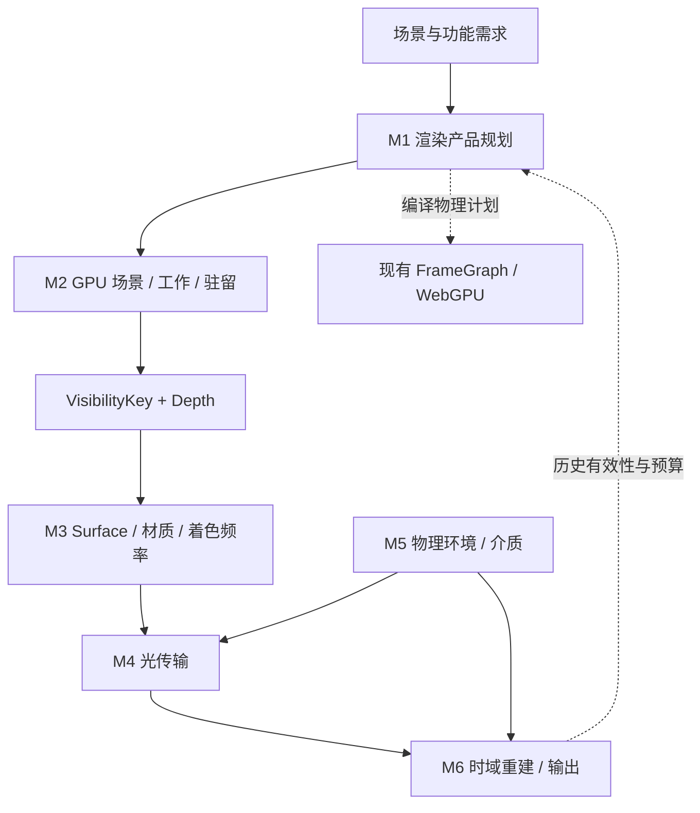

# EEngine Next：模块划分与重构实施路线

目标：**Demand-Driven Virtualized Visibility Renderer**。用户已确认分享中的最终设计；本页将其落实为工程模块与实施顺序。只面向一个 Next 目标，允许重写主管线，不再划分三代架构。

本页管理模块边界和依赖顺序；[ADR-0019](./adr/0019-eengine-next-renderer.md) 管理长期决策；[迁移来源账本](./porting/next-renderer.md) 管理具体算法来源与适配；[workstream](../project/workstreams/active/eengine-next.yaml) 是当前任务状态的唯一入口。这里的目标能力不代表当前实现或验证完成。

## 1. 六个大模块

这六个模块是交付和职责边界，不要求立即创建六套目录、六套 manager 或六个新的机器 domain。先沿现有 owner 切开实现，避免目录搬迁先于职责收敛。

| 模块 | 拥有的职责 | 对外结果 | 对应现有 owner |
| --- | --- | --- | --- |
| M1 渲染规划与执行 | Render Product Compiler、表示选择、FrameGraph lowering、程序缓存、composition root | 有界物理执行计划与资源生命周期 | frame-runtime；shading 配合 |
| M2 GPU 场景、工作与驻留 | Scene Publication、VG、Visibility、GPU Work Runtime、虚拟资源控制面 | 场景快照、VisibilityKey/Depth、GPU 工作流与驻留状态 | virtual-assets、visibility、materials-textures |
| M3 Surface 与自适应着色 | 属性重建、材质编译、绑定闭包、采样复用、信号求值频率 | 按需求值的材质/Surface/光照输入 | shading、materials-textures、visibility |
| M4 光传输 | Direct Light Visibility、Indirect Radiance、Reflection | 阴影可见性、漫反射间接辐射、镜面反射 | shading；M2 提供工作与驻留 |
| M5 物理环境与参与介质 | Sun/Sky、大气 LUT、环境照明、Aerial Perspective、局部 Froxel 介质 | 物理一致的环境辐射、散射与透射 | shading |
| M6 时域重建与质量预算 | Motion/Exposure/Jitter/History 生命周期、信号重建接口、最终超分、统一质量控制 | 有效历史、重建图像、下一帧预算策略 | frame-runtime、shading |

图表示数据与决策关系，不要求每个方框成为独立 Pass。Provider 可以融合进消费它的 shading，也可以物化产品；最终由 M1 选择合法计划。

### 统一到哪里，在哪里停止

- **工作统一协议与基础算子**：Demand → Classify → Compact → WorkStream → Execute；保留 meshlet、pixel/tile、ray、page 等专用元素与执行器。统一计数、容量、溢出、间接参数、生命周期与观测，不建立一个混装所有任务的 GPU mega-queue。
- **资源统一控制面**：虚拟身份、需求优先级、预算、pin、版本、反馈与淘汰政策共享；VG、VT、VSM、Radiance 的物理缓存、页格式和更新机制分开。几何/纹理是加载资源，VSM/动态辐射是计算缓存，不能假装同一种 streaming。
- **Surface 统一语义**：Normal、Velocity、World Position 等首先是 Logical Product。允许 fuse/recompute/materialize/cache，但由明确的表示与精度合同约束，不默认创建 Fat GBuffer，也不默认永远重算。
- **光照统一结果合同**：AO 是可见性估计，GI 是辐射估计，Reflection 是镜面路径估计。它们共享输入和基础设施，不共享一个模糊的“光照纹理”。SSR 命中替换相应环境镜面基线，GI 与 Sky 不重复累计能量。
- **Temporal 统一状态管理**：时间、曝光、运动约定、失效与尺寸域共享；AO、Reflection、GI、Media 的统计量、拒绝条件和滤波算法仍各有 owner。信号去噪与最终超分是不同接口。

## 2. 各模块的实施步骤

每个模块仅三步，按可交付的生产链划分。迁移一个算法时保留其必要阶段与边界条件，不把每个 shader/function 拆成单独项目。

### M1：渲染规划与执行

**保留基础**：[FrameGraph](../OEngine/src/framegraph/FrameGraph.ts)、[FrameProducts](../OEngine/src/render/pipeline/FrameProducts.ts)、[OpaqueShadingDemand](../OEngine/src/render/pipeline/OpaqueShadingDemand.ts)、原子 publication 与 feature-off 裁剪。

1. **拆开主管线所有权。** 从 [MainRenderPipeline](../OEngine/src/render/pipeline/MainRenderPipeline.ts) 分离产品规划、Provider 编排、场景发布协调、恢复与观测。先保持画面语义不变，让 Renderer 只负责组装。稳定 Shader/Pipeline 缓存与 revision-local 资源绑定分离，不能因无关资产 append 重建所有程序。
2. **建立有限方案的产品编译器。** 产品声明消费者、空间/分辨率、精度、覆盖、曝光与时间有效性；先支持少量可解释计划，如融合、重算、compact materialization。FrameGraph 执行选好的计划，不承担猜测产品语义的工作。不先做通用表达式优化器或每帧 CPU 搜索。
3. **接入成本和失效。** topology/feature/capability 变化时重编计划；帧内工作数量由 GPU 决定；历史和缓存在依赖改变时失效。成本规则同时看带宽、重复解码、dispatch 和绑定成本，不能只用消费者数量决定物化。

**来源策略**：沿用本地 FrameGraph；Filament 可参考图裁剪与生命周期。产品语义和跨模块计划是本项目必要集成代码，目前没有已核实的整套开源替代品。**完成观察**：同一场景画面语义保持；关闭 Provider 后无孤儿产品/Pass；稳定帧与无关资产增量不触发无理由重编。

### M2：GPU 场景、工作与驻留

**保留基础**：[GpuRenderWorld](../OEngine/src/gpu/GpuRenderWorld.ts)、GPU Scene、Nyx-derived VG、[HierarchicalWorkGenerator](../OEngine/src/render/HierarchicalWorkGenerator.ts)、间接硬件光栅、Geometry Page Streaming、Texture Residency。

1. **从已有闭环抽公共工作运行时。** 先服务现有 MeshletWork 和 ShadingWork，保留 DirectSingleBin/Dense 快路径。复用已选的 scan/compact 算法；队列写明元素语义、容量、溢出/重试或降级、生产者/消费者与 counter。全量覆盖时不强迫“分类+压缩”比直接执行更贵。
2. **接入第二类需求并抽驻留控制面。** 用 SSSR RayWork 和 VSM PageWork 验证协议能跨领域复用；把 VG/Texture 已有预算和反馈接入共同调度。CPU 可异步处理网络/解压/上传，不读取 GPU 当前可见计数再决定本帧渲染列表。
3. **完成辅助视图与资源接入。** VSM caster 工作沿独立光空间需求生成，不能复用主相机最终可见列表。Radiance field 加入相同预算/版本体系；完整 VT 作为后续物理缓存 provider 接入，但先补合格来源与内容收益证据，不能把现有 mip promotion 宣称为 VT。

**来源策略**：VG 继续当前 Nyx/meshoptimizer 来源；scan 优先 GPUPrefixSums 的完整 Reduce-Then-Scan；VSM 页面算法参考 Timberdoodle，执行端适配现有硬件 indirect。**完成观察**：工作由 GPU 真正消费；空工作与溢出可解释；新增消费者不回退 CPU 全场景扫描。

### M3：Surface 与自适应着色

**保留基础**：VisibilityKey、Sparse Shading Bin、单次材质解析原则、compact Surface、[SparseShadingResolvePass](../OEngine/src/render/passes/SparseShadingResolvePass.ts) 的 sparse 与 direct 路径。

1. **先降低每次求值成本。** 提取 Surface Reconstruction 和显式梯度；沿用 The Forge 的可追溯属性数学。整理 Material Program 与绑定闭包，区分少量 Hard specialization 和运行时参数。仅在纹理、sampler、UV/变换、LOD/梯度与颜色解释等价时合并采样。无需为此先引入完整 MaterialX 编辑系统。
2. **再降低需要执行的求值量。** 按 coverage、材质频带、深度/法线连续性、信号变化与历史有效性选择 Dense/Sparse/Coarse/Reuse；优先对能可靠重建的低频照明信号降频，高频材质调制和边界保留所需频率。不得用 roughness factor=1 推断有效 roughness=1，更不能由此降低整个 PBR 的频率。
3. **把频率与产品规划、历史连接起来。** 低频结果必须有覆盖/置信度/失效和重建消费者，边缘与 disocclusion 有完整求值路径。帧内 VisibilityKey 不作为长期 history identity。更新“每命中完整材质一次”的现行 claim/contract 后才能切换频率语义，不能暗中改名继承原验收。

**来源策略**：The Forge 属性重建、现有 Filament PBR、可选 MaterialX graph/lowering；FidelityFX VRS 仅借鉴分类器。当前未找到可直接搬入 WebGPU 的完整 adaptive compute material 系统，跨信号频率规划和重建契约属于明确的新集成研究。**完成观察**：解析梯度/贴图保持；有纹理粗糙墙、细边与运动揭露处不因粗粒度决策丢失必要信号；队列收益覆盖分类/重建成本。

### M4：光传输

**目标 Provider**：Directional VSM、XeGTAO、SSSR-style Reflection、Near/World/Infinite Hybrid GI。CSM 是对照与有界 fallback；不把目标重新降成只做 Cached CSM。

1. **先完成屏幕域的两条完整链。** XeGTAO 移植 depth prefilter → evaluation → denoise；SSSR 移植 classification → ray/denoiser queues → indirect trace → reproject/filter/temporal resolve。共同申请深度派生产品，但只有空间、归约、厚度和格式合同相同才能共用同一张 HZB。
2. **完成 Directional VSM 的页面闭环。** 迁移需求标记、分配、缓存、脏页失效、采样和缺页政策；先用一个有界场景验证 WebGPU 页光栅的命令数、caster work 与缓存复用，再扩场景。没有 mesh shader/multi-draw-count 时，必须证明固定有界 indirect 批次可承受，不允许逐页 CPU 遍历全场景。
3. **完成动态世界域 GI 与镜面 fallback。** 移植 DDGI-like field 的更新、遮挡、状态和查询；同时落实能响应动态几何与动态光源的 irradiance/distance 样本生产者。动态代理/追踪结构更新、脏区域传播与 Probe 历史失效必须成链，静态烘焙不是首版完成路径。Near Screen GI 提供局部修正，World probes/bricks 提供世界覆盖，Sky 提供远场边界。镜面采用屏幕命中与环境/probe fallback 的一致权重和能量语义。设备基线与动态更新边界见第 6 节。

**来源策略**：XeGTAO；FidelityFX SDK v1.1.4 SSSR+Reflections Denoiser；Timberdoodle VSM；Atlas DDGI/软件 BVH 为主候选、Speedball WebGPU 为补充调查。**完成观察**：移动相机、遮挡体、光源与缺页时，命中/回退/历史不造成重复能量；field 不是只会显示 probe 的空壳。ReSTIR/NRC 不进入本轮默认实现。

### M5：物理环境与参与介质

1. **迁移环境光照的完整主链。** 以 Takram atmosphere WebGPU 为主要来源，保留 Bruneton/Hillaire 对应预计算与运行时关系、太阳透射和天空间接光。移除 Three/TSL/R3F 宿主依赖，不删大气数学；建立长度、场景原点、光度/辐射量与曝光约定。非地理引擎仍然需要明确大气半径和观察高度的解释。
2. **接入真实光照消费者。** Sun 是统一权威，PBR/GI/Shadow/Sky 共享方向、强度与光谱/颜色约定；接入 IBL 与 Aerial Perspective，避免独立天空装饰和重复太阳。
3. **迁移局部 Froxel 介质并合成。** 以 Adria 注入 → 历史 → 沿视线积分 → 合成为候选完整链。Fog/Local Volume/Particles 作为消光与散射输入；与大气按同一视线路径分配积分区间，避免重复雾化。体积云后置，不阻塞该模块。

**来源策略**：Takram 是实际环境来源；Adria 是可移植局部体积链。Frostbite/Decima 主要提供架构和论文参考；Filament Froxelizer 是光源分簇，不可当成完整体积介质实现。**完成观察**：晴空/逆光/阴影下的太阳、物体与空气有一致能量和单位；透明/体积合成顺序明确。

### M6：时域重建与质量预算

1. **前置共享状态基础。** 从现有 [TemporalHistoryRegistry](../OEngine/src/render/TemporalHistoryRegistry.ts) 提取统一 Motion、Depth、Disocclusion、Jitter、Exposure、尺寸域和提交生命周期；明确稳定表面身份及资产/材质/页替换的局部失效。当前 pre-exposure multiplier 为 1 的路径不算动态曝光闭环，须接入真实生产值。
2. **完整移植一个最终超分后端。** 默认候选 FidelityFX SDK v1.1.4 的 FSR3 Upscaler；保留选中版本的输入准备、reactivity/shading-change、重投影、累积与重建链。保留 analytic 基线，FSR2 仅作替代来源，不拼接两个版本的内部阶段。不开 Frame Generation；SSR/GI 的信号去噪继续保留其算法语义。
3. **统一调节成本并留后端入口。** 一个协调器管理 dynamic resolution、着色频率、ray/probe/page 更新预算，采用有界、较慢的反馈避免多个控制器互相追逐。Neural 后端声明所需信号、模型资源、延迟与失败路径；WebNN/GPU 互操作未证明之前，不承诺零复制或实时替换。

**来源策略**：FSR3 Upscaler/FSR2 + 本地 history；DLSS SR/RR、NRD 作为输入契约和研究参考，不作为 WebGPU 默认可调用实现。**完成观察**：相机切换、resize、动态分辨率、曝光变化与反射揭露不错误复用历史；后端切换不会留下多套 jitter/history owner。

## 3. 同一目标的执行顺序

| 批次 | 要交付的整体结果 | 为什么此时做 |
| --- | --- | --- |
| A 基础切分 | M1 主干拆分与有限产品计划；M2 工作协议；M6 时间/曝光/失效合同 | 先建立后续所有算法共同消费的基础；不要求先写完通用框架 |
| B 完整迁移样板 | M3 求值成本整理；完整 XeGTAO 与 SSSR；M5 环境主链 | 用真实消费者反向校验抽象，建立忠实迁移样板；各来源按完整链逐个接入 |
| C 风险闭环 | VSM WebGPU 页执行；DDGI 样本生产与更新；M3 自适应频率；最终超分 | 优先验证最可能改变拓扑/预算的部分，避免最后才发现执行模型不成立 |
| D 组合交付 | 局部介质、统一预算、缺页/失效/feature-off 收敛、旧生产路径删除 | 在实际组合中验证带宽和工作削减，完成一次 Next 主线切换 |

这不是四套临时 Renderer。每个批次都落在同一主管线；迁移期间允许对照来源和必要 fallback，但不长期维护旧、新两条 production pipeline。A 批次即安排动态 GI producer 的小型可行性实验，覆盖动态追踪结构更新、失效和 Probe 消费，避免到 C 才发现动态场景不成立；VSM 页执行也可同时做有界实验。它们不应扩大为另一套引擎。

## 4. WebGPU 实现边界

运行能力以 [ADR-0010](./adr/0010-webgpu-2026-capability-contract.md)、[WEBGPU](./WEBGPU.md) 与 adapter/device 协商为准。本页不降低现有 required feature/limit，也不把草案自动升级为生产保证。

- 主路径是 **CPU 编译静态、有界 kernel graph + GPU 决定动态工作量**。drawIndirect/dispatchIndirect 不意味着 GPU 可以创建新命令或任意改变绑定。按 kernel family/binding class 预编码有界调用，空任务可零工作执行。
- `subgroups` 值得影响 scan、分配与分类，但 wave32/64 假设必须显式处理；`subgroup-size-control` 仅在协商成功时选对应变体。不得默认 WGSL 原子能充当跨 workgroup 全局同步。
- `primitive-index` 可降低部分 ID 搬运成本，但仍需要 instance/meshlet 等身份；`shader-f16` 可降部分带宽/寄存器开销，但不统一降低深度、坐标和累积精度。
- format tiers、资源数量/大小和纹理绑定 limits 决定可用计划。WGSL language feature 与 device feature 分开探测，`enable`/`requires` 不混用。
- 不依赖 mesh/task shader、硬件 RT pipeline、Work Graph、通用 bindless heap、BDA、64 位通用原子、multiDrawIndirectCount。新增标准能力经目标浏览器验证后成为可选后端，不反向决定语义合同。
- 全屏不是禁词：最终重建、输出及确有全域消费者的步骤可以全屏。应削减的是无需求的昂贵 tracing/shading 与重复数据生产，而不是为了队列形式额外增加分类、压缩和读写。

## 5. 如何保持迁移完整，又不增加重型流程

迁移执行规则统一放在 [porting README](./porting/README.md)；来源逐项记录在 [Next 来源账本](./porting/next-renderer.md)。每次迁移以一个有边界的完整算法 profile 为单位，不要求搬走上游整台引擎。

一个批次只需要这些可审查结果：来源版本/许可证和阶段映射、生产链接入、关键差异/未覆盖项、与改动匹配的验证。已有场景和检查能覆盖就复用，不为机械搬文件新增测试。

| 改动 | 足够的验证规模 |
| --- | --- |
| 本轮文档和计划 | 一次 `node tools/vibe.mjs verify --changed`，检查路由、链接和记录；不宣称 GPU 已验证 |
| 保持行为的主干拆分 | 受影响现有测试；代表场景观察输出和 feature-off，不为每个 wrapper 新建 case |
| 首次接入一个算法 | 一组聚焦的源实现/参考对照或数学 oracle；一个独立 validation 场景覆盖典型、运动和关键边界，可扩现有 case |
| 队列/ABI/驻留风险 | 补与风险直接对应的容量、overflow、身份/生命周期检查；不扩成全功能组合矩阵 |
| 集成切换和性能声明 | 按仓库规则运行阶段检查；固定条件采集真实 GPU 时间、带宽/工作量代理指标与画质证据 |

新算法的对照不能仅证明“画面出现了”，至少要覆盖其关键失效条件。性能改善不能从 shader 数量或少算像素数直接推导；需要同时统计分类、重建、缓存与绑定成本。现有 [近景性能诊断](./performance/2026-09-25-rendering-lab-basic-gpu-analysis.md) 可指导选场景，但不是正式 PERF，也不证明 VT 是近景 shading 瓶颈的解法。

## 6. 开工前还需要准备什么

**本轮已准备**：目标 ADR、六模块实施路线、固定版本来源调查、忠实移植要求、现有 owner 关联和可继续执行的 workstream。没有修改 Renderer 实现，也没有把候选源码登记为已移植。

**可以直接推进的下一批工作**：

1. 按 A 批次冻结最小跨模块合同：Product 空间/精度/曝光/覆盖、Work 容量与闭环、稳定 history identity。现在不提前规定全部 buffer layout；首次真实消费者落地时再写对应 spec。
2. 为首个迁移切片拉取固定源码子集，保留 LICENSE/NOTICE 与第三方追溯，建立源函数/阶段到本地 owner 的映射。已有 Nyx/PBR 来源不无理由换版本；本轮调查 pin 不是自动升级指令。
3. 复用现有场景形成一个代表 workload：近景高覆盖与高频材质、遮挡揭露、屏幕外投影体、移动光源/物体。记录输出/内部尺寸、feature set、显存/工作容量和设备状态，之后用于比较同一组合，不创建庞大新样例库。

**2026-09-25 已确认的产品约束**：用户以交替使用的 1650/2060 两台开发机作为目标，并明确首版选择动态 World GI。以下记录将其落实为可执行基线，不再作为等待用户选型的阻塞项。

| 项目 | 基线与决策 |
| --- | --- |
| 当前实测整机 | TIMI Redmi G；Intel Core i7-10750H，6 核 12 线程；安装内存 16 GiB（2 × 8 GiB），系统可用物理总量约 15.87 GiB |
| 当前实测独显 | NVIDIA GeForce GTX 1650 Ti，4096 MiB 显存；NVIDIA 驱动 581.42。以此作为较低配置基线，不误记成无 Ti 型号 |
| 当前实测系统/显示 | Windows 11 Pro x64，10.0.22621；系统显示模式 1920 × 1080、72 Hz，由 Intel UHD 驱动显示。显示输出设备不等于浏览器实际 WebGPU adapter |
| 第二台设备 | 用户提供的 RTX 2060 开发机；CPU、显存容量、驱动与浏览器能力待切换到该机器时读取，不推定其余配置 |
| 工程默认目标 | 1920 × 1080 输出，60 FPS / 16.67 ms 帧预算作为优化目标；允许动态内部分辨率、信号频率与 ray/probe/page 更新预算。此数值是工程规划默认值，尚非已实现性能或所有场景“全开”保证 |
| 内存规划 | 按 4 GiB 独显与 16 GiB 系统内存约束内容和缓存；不能把全部显存当作引擎可用额度。A 批次测量浏览器/基础资源开销后设可配置总额及缓存分配，几何、纹理、阴影、GI 与 transient 计入同一本账 |
| World GI | 首版支持动态几何与动态光源。变化驱动世界代理/软件追踪结构更新、受影响 Probe 重采样、历史失效与着色消费；不能以仅静态烘焙或仅屏幕空间 GI 宣称完成 |

硬件通过本机 `Get-CimInstance` 和 `nvidia-smi` 读取，仅记录必要配置，不保存序列号/设备唯一标识。它不是 WebGPU capability 或性能 evidence。每台机器首次运行以及浏览器/驱动变化后，记录实际 adapter、features、limits 和 shader 变体；确认测试使用目标独显，避免把集显或远程显示路径的结果混入比较。跨机数据分开记录，沿用固定条件与温度/时钟观测。

“动态”允许有预算的渐进收敛，不要求场景任意变化后整场 GI 在一帧内完全收敛。第一批实验覆盖物体移动、增删、几何变形与光源变化，明确 refit/rebuild、代理误差、更新延迟和暂时低置信度的处理。初期保留参考/fallback 以便推进，但不把尚未覆盖的动态类别悄悄排除在最终要求之外；2060 的硬件 RT 也不作为 WebGPU 主路径前提。

**仍需工程调查，不让用户替我们做技术选型**：VSM 页执行吞吐、Atlas/Speedball 的完整 GI 闭环和第三方来源、全 VT 的合格 donor、adaptive compute shading 的质量/收益。这些在对应切片结束前保持开放；不能因“开源项目存在”就认为 WebGPU 性能已成立。

## 7. 文档入口与权威边界

| 想知道什么 | 去哪里 |
| --- | --- |
| 下一代做什么、模块如何划分 | 本页 |
| 长期取舍为什么成立 | [ADR-0019](./adr/0019-eengine-next-renderer.md) |
| 今天做哪一批、尚有什么阻塞 | [eengine-next.yaml](../project/workstreams/active/eengine-next.yaml) |
| 哪份源码、哪个版本、哪些算法不得省略 | [Next 来源账本](./porting/next-renderer.md) |
| 当前实际实现/ABI | [domains](./domains/)、[contracts](./contracts/)、[specs](./specs/)；由机器 manifest 关联 |
| 已经验证到什么程度 | `node tools/vibe.mjs status` 与正式 evidence |
| 用户最终讨论和本地源码评审 | [最终原文归档](./reviews/2026-09-25-eengine-next-final-architecture-source.md)、[2026-09-25 评审](./reviews/2026-09-25-eengine-next-final-architecture-analysis.md) |

保留两份 review 作为来源和评审记录，不复制进去继续维护新 TODO。现有 Nyx 与 authored-large workstream 继续拥有自己的资产工作；Next 只引用并消费其成果，不重复登记其任务，也不把尚未提升的研究当作已生效 ABI。
