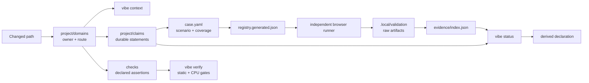

# 文档系统与验证测试系统审评（2026-09-21）

> 本文是针对当前 revision `dc1994dd450499ecaf04a020563cb2f45ff131f1` 的审评报告，不是设计权威、完成声明或 evidence。机器事实仍以 `project/`、`checks/`、case-local `case.yaml` 和正式合同为准。

## 结论

OEngine 已经建立了一套结构先进的 contract-driven project OS：它能把路径归属、长期决策、精确 ABI、可执行检查、浏览器 case 和当前 evidence 连接起来，也明确拒绝用旧日志、示例页面或文档措辞冒充运行事实。作为“知识与验证拓扑”，基础质量较高。

但它目前还不能被视为可信的完成声明门禁。核心原因不是 case 数量不足，而是 claim promotion 链上存在三个完整性缺口：实际执行的 check 没有形成不可伪造的 provenance；claim 的最低 assurance level 没有在接受 evidence 时强制执行；`not-run` check 可以与 `verificationComplete: true` 同时出现。此外，L4 的文档定义与现有 case 分类不一致，evidence 聚合策略又会随本地历史变化。

综合评价：

- 信息架构与 owner 路由：良好（8/10）
- 合同、ABI 与来源可追踪性：良好（8/10）
- 浏览器宿主与 artifact 完整性：良好（8/10）
- claim/evidence 晋级可信度：不足（4/10）
- 日常可操作性与重建安全性：一般（6/10）
- 当前整体：基础扎实，但应先修复 promotion integrity，再依赖它发布完成结论（6.5/10）

## 修复结果（同日）

本报告发现的问题已在同一工作树一次性修复；原始审评内容保留，作为问题与决策依据。修复后的完成对照如下：

| 原问题 | 修复 | 验证 |
| --- | --- | --- |
| P0 required check 自证循环 | artifact schema v2 携带 full preflight 的真实 check receipts；index 只读取 receipts，不再从 claim 合成 | 负向测试拒绝缺失、伪造、revision/tree/registry/scope 不匹配的 receipt |
| P0 assurance 未强制、L4/smoke 漂移 | 模型强制 promotion case 等级；L4 仅允许 `kind: perf` + `formal-1080p`；现有 correctness/lifecycle claim 与 case 统一为 L3 | 负向测试把 protocol case 降到 L0 后模型明确失败；当前模型通过 |
| P1 `not-run` 仍可 complete | required check 的 `not-run` 与 browser `notRun` 都阻止 `verificationComplete`；非适用 check 不进入 required set | helper 负向测试通过；changed verify 对未运行 browser case 返回不完整 |
| P1 evidence 历史隐式 AND | 每个 claim 声明 `allOf`、`anyOf`、`diagnosticCases`、`checkOnly`；lab/manual 禁止 promotion | 诊断 case 的失败历史不再阻塞 promotion，且所有 reverse coverage 必须显式分类 |
| P1 空/部分 raw 清空或裁剪 index | evidence 使用原子替换；空/部分 raw 默认拒绝删除 compact case，提供只读 `--check` 与显式 `--force-empty`/`--force-prune` | 实测空输入命令失败且 index SHA-256 前后不变；单元测试覆盖空与部分输入 |
| P2 domain 页信息不足 | 6 个 domain 页补齐 current production path、owner/failure、main entrypoints/proof | 文档 guard 与完整 engine suite 通过 |

验证记录：validation Node tests 18/18；full verify 通过且 `engine-suites` 为 443/443；`protocol-self-test` 实际浏览器运行通过，schema v2、11 个 full passed receipts 和全部六项 gate 均有效。由于工作树未提交，该浏览器记录按合同是 `diagnostic-only`，没有错误提升任何 claim。当前旧 evidence 仍应保持 stale/blocked，clean revision 上重跑 promotion policy 指定的 case 后才能形成新的 RuntimeValidated 声明。

## 系统如何工作

### 文档系统

文档不是一个平铺目录，而是按变更速度和权威类型分层：

| 层 | 用途 | 当前权威来源 |
| --- | --- | --- |
| 路由与 owner | 文件属于谁、改动命中什么 | `project/domains/*.yaml` |
| Durable claim | 哪些长期陈述影响完成判断 | `project/claims/*.yaml` |
| 当前领域事实 | owner 边界、生产数据流、不变量 | `docs/domains/*.md` |
| 跨 owner 合同 | 小而精确的共享接口 | `docs/contracts/*.md` |
| 长期取舍 | 为什么采用某个方向 | `docs/adr/` |
| ABI、格式、状态机 | 实现必须逐字段遵守的精确定义 | `docs/specs/` |
| 外部算法与来源 | 上游、license、保留不变量、移植账本 | `docs/sources/`、`docs/porting/` |
| 活跃交付切片 | 尚未结束的任务、gate、退出条件 | `project/workstreams/active/` |
| 当前证明状态 | 从当前 revision evidence 推导 | `validation/evidence/index.json`、`vibe status` |

这种分层是本系统最强的部分。ADR 不承担状态，spec 不承担取舍，workstream 不冒充长期合同，evidence 不由文字声明替代，边界是清楚的。入口见[文档总览](../README.md)、[验证总合同](../VALIDATION.md)和[路由合同](../contracts/project-routing.md)。

### 验证测试系统

验证系统有四个相互独立的面：

1. L0 topology：解析 YAML、frontmatter、链接、owner 路由和静态 guard。
2. L1 CPU proof：构建最新 `.test-dist` 后运行 unit、contract、oracle 和 guard。
3. L2/L3 browser proof：独立 `validation/` 宿主运行真实 WebGPU component 或 production/lifecycle case。
4. L4 formal PERF：按文档应固定 adapter、workload、分辨率、warm-up 和多次采样。

case-local manifest 决定 route、workload、profile、artifact、变更映射和覆盖的 claim；生成 registry 只作为 runner 输入。共享 harness 负责 nonce、run identity、浏览器/GPU error、readback、dispose 和 artifact hash，case 只负责业务场景与断言。这种宿主/场景分离是正确的。

## 当前快照

审评时模型自检结果：

- 6 个 domain、14 个 claim、11 个 check、20 个 case、2 个 profile、18 个 workload。
- 20 个 case 中：L0 1 个、L3 12 个、L4 7 个；没有 L1、L2 或 `kind: perf` case。
- 19 个 automatic case，1 个 observer lab。
- compact evidence index 有 19 条 latest-per-case 记录，但其生成 revision 是 `d00bc41...`，当前 HEAD 是 `dc1994d...`。
- 当前 claim 状态：0 accepted、10 stale、3 blocked、1 unproven。
- `node tools/vibe.mjs doctor` 通过；`validation` 自身的 10 个 Node 测试全部通过。
- 本次审评没有运行真实浏览器 case，也没有运行完整 `engine-suites`，因此不产生新的 RuntimeValidated 或 Performance 结论。

当前没有 claim 被提升是合理且保守的表现，说明 revision freshness gate 确实在工作。但“现在没有误提升”不等于“promotion 算法不存在误提升路径”。下列问题针对的是后者。

## 做得好的地方

### 1. Source of truth 分层明确

机器路由、人类说明、长期决策、精确 spec、运行 evidence 各自承担一种职责。`validation/registry.generated.json` 被明确视为投影而不是设计源，降低了手改生成物造成双重真相的风险。

### 2. Owner 路由具有可解释性

具体路径优先于宽泛 fallback，并保留 related domain。例如 `Renderer.ts` 由精确匹配的 `frame-runtime` 主责，同时关联 `shading` 和 `platform`；路由分数和命中 pattern 可由 `vibe context` 直接解释。

### 3. 浏览器 evidence 的宿主合同完整

runner 记录 commit/tree/dirty、浏览器可执行文件 hash、workload/registry hash、nonce、单次导航、错误聚合、dispose 和 artifact manifest。unsupported 也不会自动冒充 accepted。这比只保存截图或“页面跑通”可靠得多。

### 4. 测试性质被显式区分

unit、contract、oracle、guard、gpu、perf 与 L0-L4 被建模为不同维度；`engine-suites` 先构建再测试，避免 `.test-dist` 过期却静默变绿。这一约束非常有价值。

### 5. 当前状态推导保持保守

旧 revision 或 case signature 不匹配时降为 stale，失败的最新相关 case 降为 blocked，dirty evidence 只能 diagnostic。这符合“完成声明必须由当前证据支撑”的原则。

## 主要问题

### P0：required check provenance 是自证循环

[evidence index 构建代码](../../tools/vibe-lib.mjs)中的 `buildEvidenceIndex()` 没有读取“本次实际运行了哪些 check”的 receipt，而是从 case 覆盖的 claim 反查 `claim.requiredChecks`，直接生成 `checkIds`。随后 `requiredChecksCovered()` 又检查这些推导出的 `checkIds` 是否包含同一份 `claim.requiredChecks`。

因此，当前链路实际证明的是“claim 声明自己需要这些 check”，不是“这些 check 在该 revision 上成功执行”。浏览器 case 即使没有和 `model`、`changed-coverage` 或 `engine-suites` 形成同一次验证事务，也可能在 index 中被标记为覆盖这些 check。值得注意的是，目前没有 claim 把 `engine-suites` 列入 `requiredChecks`。

影响：claim 的 accepted 状态不能可靠证明其前置 CPU/static gates 真正运行并通过。

建议：让每次 verify/case run 生成带 revision、tree、输入 hash、runner id、结果和时间的 check receipt；browser evidence 只能引用已存在且匹配的 receipt，index 不能从声明反推执行事实。

### P0：最低 assurance level 没有被强制执行

[claim 接受逻辑](../../tools/vibe-lib.mjs)检查 freshness、status 和 required check id，但没有检查 `case.level >= claim.level`。模型校验也只验证 level 枚举合法，没有验证 coverage 的等级关系。

仓库中已经存在实际反例：

- `protocol-self-test` 是 L0，却覆盖 L4 的 `frame.host-protocol` 和 `platform.evidence`。
- `webgpu-component` 是 L3，却覆盖 L4 的 `platform.evidence`。
- `glb-incremental-publication`、`virtual-product-offline` 是 L3，却覆盖 L4 的 `virtual-assets.lifecycle`。
- `shading-bin-component`、`virtual-product-production` 是 L3，却覆盖 L4 的 `visibility.gpu-closure`。

更根本的语义漂移是：[验证总合同](../VALIDATION.md)把 L4 定义为固定环境正式 PERF，但当前 7 个 L4 case 全部使用 `smoke` profile，且没有一个是 `kind: perf`；唯一的 `formal-1080p` profile 没有被 case 使用。

影响：`level` 目前更像人工标签，不能作为机器可执行的最低证明强度。

建议：先决定 L4 是否只表示 formal PERF。若是，应把非性能 lifecycle/closure claim 降到 L3，并为性能结论建立独立 perf claim；若还需要“非性能但最高完整性”，应增加正交字段，而不是复用 L4。模型必须拒绝低等级 case 覆盖高等级 claim，或要求 claim 显式声明分层 evidence policy。

### P1：`not-run` 与 `verificationComplete` 语义冲突

[verify 实现](../../tools/vibe.mjs)只把 failed check 计入失败；check 的 `not-run` 不参与 `ok` 或 `verificationComplete`，后者只看未运行的 browser case。当前 `validation/evidence/verification.json` 就记录了 `engine-suites: not-run`，同时 `ok: true`、`verificationComplete: true`。

这与“退出 0 表示检查通过且无跳过”的工作流描述冲突，也让两种同名概念分裂：check 使用 `status: not-run`，browser case 使用顶层 `notRun`。

影响：机器消费者可能把“未要求/未运行”误读为“全部完成”。

建议：先计算 required check set。非 required check 不应出现在报告中；进入 required set 的 check 若为 `not-run`，必须令 `verificationComplete: false`，并使用统一的 skip/not-run schema 和退出码。

### P1：evidence 聚合是历史依赖的隐式 AND

`claimStatus()` 会收集所有曾经存在 evidence、且覆盖该 claim 的 case，取每个 case 的 latest record；其中任意一个 stale/failed 就使整个 claim stale/blocked。但从未运行的 covering case 又不会阻塞 claim。

这导致 claim 的实际完成条件不完全来自当前模型，而取决于“本地/索引历史上哪些 case 曾经跑过”。observer lab 一旦产生 evidence，也会参与正式 claim 状态，尽管它是 `automatic: false`。

影响：相同代码和 manifest 配合不同 evidence 历史可能得到不同的 required case 集合；增加诊断 case 也可能永久抬高维护成本。

建议：在 claim 中显式声明 `evidencePolicy`，例如 `allOf`、`anyOf`、`requiredCases`、`requiredKinds` 和 `diagnosticCases`。case 的 `covers` 只保留反向可发现性，不应隐式定义完成布尔表达式；lab 默认不得参与 promotion。

### P1：`vibe evidence` 在缺少本地 raw artifact 时会清空 tracked index

[Claims and evidence 合同](../contracts/claims-and-evidence.md)规定 raw artifact 位于被忽略的 `.local/validation/`，compact index 则被提交。新 checkout 或清理本地 artifact 后执行文档推荐的 `node tools/vibe.mjs evidence`，会从空目录重建并覆盖现有 tracked index 为零记录。

本次审评实际触发了这一行为，并已把 `validation/evidence/index.json` 完整恢复到 HEAD。这不是数据源被破坏，但命令默认行为不安全，也会给新贡献者制造无意义的巨大 diff。

建议：空输入且现有 index 非空时默认拒绝覆盖；提供显式 `--force-empty`。更理想的是让 CI/制品存储成为 raw evidence 的可重建来源，并让 `evidence` 支持 `--check` 与临时文件原子替换。

### P2：领域页更像目录摘要，尚不足以承担“当前事实”

`docs/domains/*.md` 的边界表达准确，但多数页面很短，主要指向 spec/ADR。对于中大型 GPU-first engine，建议每个 domain 至少稳定描述：composition root、生产数据流、owner/non-owner、关键状态机、feature-off 行为、容量/overflow、失败与恢复、主要代码入口、对应 claim 和 evidence policy。

影响：老成员能靠链接导航，新成员仍需跨多份 ADR/spec 和源码重建当前运行图；“current fact”层的价值没有完全发挥。

建议：保持 domain 页短，但增加统一模板和一张当前生产路径图；可以从 machine manifest 生成 claims/checks/cases 表，人工只维护解释性内容，减少 YAML 与 Markdown 重复。

## 整改顺序

### 第一阶段：封住错误晋级路径

1. 引入真实 check receipt，删除从 `requiredChecks` 合成 `checkIds` 的逻辑。
2. 强制 assurance level 关系，并统一 L4 语义。
3. 让 required check 的 `not-run` 阻止 `verificationComplete`。
4. 给上述三点补负向测试，再允许任何 claim 进入 accepted。

### 第二阶段：把完成策略变成声明式合同

1. 为 claim 增加显式 `evidencePolicy`，区分 all-of、alternatives、diagnostic 和 lab。
2. 把 freshness、case signature、check receipt 和 policy evaluation 输出为可解释的逐项 decision trace。
3. 为 `vibe evidence` 增加空输入保护、`--check` 和原子写入。

### 第三阶段：降低维护与认知成本

1. 为 domain current-fact 页面建立统一模板。
2. 自动生成 claim/check/case 交叉表，避免三处手工重复。
3. 增加一条 clean-checkout reproduction gate，验证 registry、index 与 status 的重建行为。
4. 正式建立至少一个 `kind: perf` + `formal-1080p` 的 L4 case，或者从合同中移除尚未实现的 L4 promotion 能力。

## 建议的验收标准

完成整改后，以下命题应由自动测试直接证明：

- 删除或跳过任一 required check receipt，claim 不能 accepted。
- L0/L3 case 不能单独满足 L4 claim。
- required check 为 `not-run` 时，退出码不能是完整成功。
- 同一模型和同一组规范化 evidence 在不同机器上得到相同 claim 状态。
- lab/diagnostic case 默认不改变正式 claim promotion。
- 空 `.local/validation/` 不会静默清空已有 compact index。
- L4 结论必须绑定 formal profile、固定环境和可复算 samples；若没有，状态只能停留在 L3 或 diagnostic。

## 审评边界

本报告审查了 `docs/`、`project/`、`checks/`、`tools/vibe*.mjs`、`tools/check-runners.mjs`、validation manifests/harness/runner、当前 registry/evidence/verification，以及 validation 自身测试。它没有审计每个 GPU case 的算法正确性，也没有运行浏览器或完整引擎测试，因此不对渲染功能本身作完成判断。
