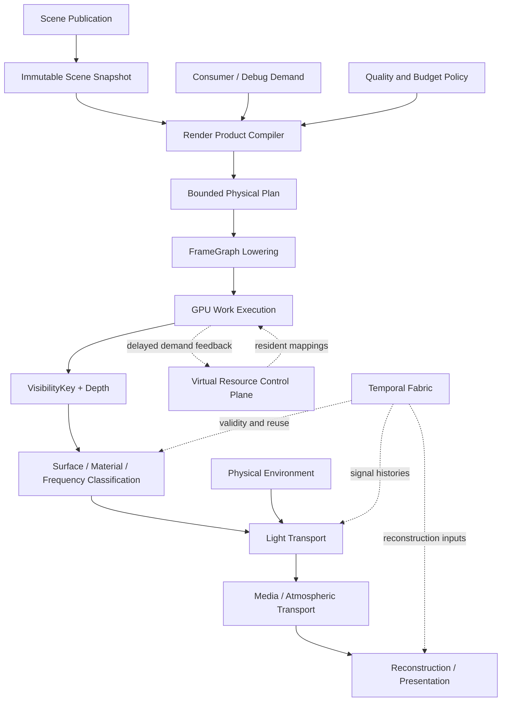

# EEngine Next：最终渲染架构整理与源码评审

日期：2026-09-25  
源码观察基线：`89f0a94` 及当前工作区。  
设计来源：[《渲染架构分析》最终讨论](https://chatgpt.com/share/6ab63639-d184-83e8-8994-1e3b9cd1c400)。  
原始最终稿：[EEngine Next Renderer — 最终架构设计](./2026-09-25-eengine-next-final-architecture-source.md)。

本文以用户确认的分享最终稿为目标设计，整理其系统边界，并结合当前代码提出实现评审。下文明确区分“最终设计”“源码事实”“评审补充”。评审补充不是对用户已选方向的擅自替换，也不代表现有 ADR、ABI 或 capability contract 已被修改。实现落地仍需同步相应 owner、contract、spec 与验证。

当前版本保留在 Git，直接面向 **EEngine Next** 重构。本文不再制定三代 Renderer 路线；末尾仅列同一目标架构的实施依赖与验收条件。源码检查覆盖渲染主链与主要所有权边界，不是全部文件逐行正确性审计。本次文档工作不构成新的浏览器运行、画质或性能认证。

## 1. 核心判断

**这份最终设计成立，而且比仅有 GPU Work Runtime 的方案更完整。真正的架构中心是 Render Product Compiler；工作运行时、虚拟资源控制面和 Temporal Fabric 是它能做出有效决策的基础。**

最终定位保持为：

> **Demand-Driven Virtualized Visibility Renderer**
>
> Virtualized Scene + Render Product Compiler + GPU Work Runtime + Visibility-Driven Compute Shading + Temporal Fabric。

这次最终讨论相较先前方案新增或明确了四个关键决定：

1. 不再以多代迁移约束最终结构，允许重构 Renderer 主干。
2. **Shading Rate is a Decision**：可见性覆盖、着色采样密度、显示分辨率解耦。
3. 明确默认技术选型：Directional VSM、XeGTAO、SSSR-style reflection、Temporal Upscaling，以及 Takram-derived 非地理环境光照。
4. 性能目标由“减少 Pass / 队列化”扩大为“减少必要语义结果的总生产成本”。

最需要补强的不是再增加技术名词，而是五个边界：**决策发生在 CPU 还是 GPU、低频着色的安全条件、产品的语义等价条件、缓存失效粒度、预算不足时的有效回退。**

## 2. 最终设计的六条原则

| 原则 | 应落实的含义 | 不能误解成 |
| --- | --- | --- |
| Visibility is Truth | 不透明主视图命中由 VisibilityKey + Depth 定义 | 主视图可见数据足以回答阴影、GI、透明和反射的一切查询 |
| Work is Currency | 昂贵工作有需求、预算、计数和消费者 | 每个操作都要 append / compact / indirect |
| Shading Rate is a Decision | 按信号、误差与有效性选择求值频率 | 所有高粗糙度表面都可直接低分辨率计算完整 PBR |
| Residency is Memory | 大规模数据通过逻辑身份、驻留映射和预算管理 | VG、VT、VSM、GI 使用同一个物理缓存 |
| Temporal is Persistent State | 历史有身份、依赖、有效期与提交生命周期 | 所有效果共用一份 confidence 或一个 temporal shader |
| Render Products are Semantic | 先定义结果，再选择重建、物化、缓存与执行域 | 所有数据都不落纹理，或者编译器每帧任意搜索所有实现 |

目标是同时降低计算与带宽，并控制画质误差。不能把“更少着色样本”单独当作成功标准。

## 3. 一级系统与所有权

| 一级系统 | 拥有的事实与决策 | 不拥有 |
| --- | --- | --- |
| Scene Publication / Virtualized Scene | 稳定身份、资产版本、实例与材质关联、不可变帧快照 | 本帧 CPU 最终可见列表 |
| Render Product Compiler | 消费者需求、Provider 选择、语义表示、质量与执行计划 | IO 实现、材质数学、任意 GPU 动态命令生成 |
| GPU Work Runtime | 有界工作流、容量、计数、间接参数、预算执行、反馈 | 所有算法统一的 Work Record |
| Virtual Resource Runtime | 驻留控制面、域预算、请求优先级、发布与退役 | 唯一通用 page size / allocator / eviction 算法 |
| Visibility System | 主视图及辅助视图工作生成、光栅命中与深度 | 完整材质和最终光照 |
| Surface & Shading Runtime | 属性重建、梯度、材质编译、着色频率与有效结果 | 为所有消费者无条件创建固定 GBuffer |
| Light Transport | Direct、Direct Visibility、Indirect、Specular 的能量组合 | 各算法独立重建完整 Scene、History 和资源体系 |
| Physical Environment | 物理太阳、天空、透射、散射、环境表示与版本 | three.js 的对象和 Renderer 生命周期 |
| Participating Media | 介质系数、体积照明与路径积分 | 将全球大气强塞进局部 Froxel |
| Temporal Fabric | 跨帧身份、运动约定、历史生命周期、失效传播 | 各种信号的统一滤波算法 |
| Reconstruction Backend | 信号/最终图像的时空重建、超分接口 | 厂商 SDK 作为 WebGPU 默认依赖 |
| FrameGraph / WebGPU Backend | 物理资源、依赖、编码、复用、提交、设备恢复 | LOD、Provider 和 BRDF 的高层策略 |

Performance Budget 与 Telemetry 是横跨这些系统的基础能力。预算策略由渲染规划层协调，执行计数由各 owner 产生；不另建一个能随意修改所有系统内部状态的全局管理器。



图中反馈不是同一 dispatch 内的递归调度。实际图必须被展开成有界依赖；CPU 不读回本帧像素分类来决定本帧提交哪些工作。

## 4. Render Product Compiler 应如何成立

### 4.1 先分开三种时间尺度

| 时间尺度 | 合理决策 | 输出 |
| --- | --- | --- |
| 资产/材质编译 | 材质能力、资源引用、采样等价关系、复杂度元数据 | 有界 Kernel Family 与材质元数据 |
| 配置/发布/尺寸变化 | Provider、输出依赖、表示方案、Pipeline/Layout、缓存计划 | 可复用的物理拓扑与程序 |
| GPU 每帧执行 | occupancy、实际工作量、局部频率、页面请求、有效性 | WorkStream、间接参数、信号与反馈 |

**CPU 编译执行可能性，GPU 决定本帧实际工作。** 动态预算可使用延迟 GPU 时间反馈；不能把本帧读回放入同步关键路径。

这一区分避免两个问题：每帧重编译图，以及 CPU 等 GPU 回答“哪些区域需要着色”。

### 4.2 产品合同必须比名称更精确

一个语义产品至少需要说明：

- 信号含义：几何法线、着色法线、入射辐射、已乘 BRDF 的出射辐射等。
- 空间/坐标域：世界、视图、屏幕、Froxel、Probe、页面。
- 尺度与采样语义：分辨率、footprint、过滤方式、稀疏覆盖。
- 颜色和曝光：工作色域、radiance/irradiance、pre-exposure。
- 时间与身份：generation、有效帧、依赖 revision、误差或置信度。
- 失败条件：无命中、未驻留、预算不足、历史不可用时的结果。

几何法线不能无条件替代 normal-map 后的着色法线；半分辨率近似不能被消费者默认为精确全分辨率数据。`recompute / materialize / cache` 只能在满足消费者语义和质量约束的方案之间选择。

### 4.3 表示规划需要有界方案

最终设计中的 Fuse、Recompute、Materialize、Cache、Temporal Reuse、Tile-local 都保留，但先实现有限物理计划与可解释选择规则。成本至少考虑：

```text
生产成本 + 写入带宽 + 各消费者读取/重建成本
+ 同步/分桶成本 + 寄存器压力 + 缓存容量 + 重建误差
```

Tile-local scratch 只在同一 kernel/workgroup 的真实共享范围成立，不能作为任意跨 Pass 的“零成本产品”。跨 kernel 必须重建或落入可见存储。

融合也不是默认最优：更少 Pass 可能伴随更高寄存器压力、更差 occupancy 和更宽绑定集合。

## 5. Adaptive Shading Frequency：核心价值与最大风险

最终稿将频率控制提升为核心，这个判断值得保留。但应该将“整个 Surface 每像素算一次”拆成不同频率的信号，而不是首先降低整个 PBR 输出的频率。

### 5.1 建议区分三类频率

| 信号 | 高频来源 | 首选策略 |
| --- | --- | --- |
| Coverage / Identity / Depth / Motion validity | 轮廓、薄几何、遮挡切换、形变 | 保持目标可见性分辨率的可靠信息 |
| Material appearance | Albedo、法线贴图、纹理粗糙度、emissive、alpha | 根据实际材质频带处理，不由粗糙度 factor 单独决定 |
| Lighting / Radiance | 阴影、BRDF lobe、局部光变化、环境和反射 | 在有误差界与边缘约束时稀疏、降频或复用 |

大面积粗糙墙面可能有高频砖缝、文字或法线纹理。低频漫反射照明可以与高频材质调制分开处理；这只是适用路径，不能把所有微表面 BRDF 都视为可简单线性拆分。

### 5.2 必须纠正 roughness factor 的推断

历史 `sparse_shading_resolve.ts` 中有效粗糙度是材质 factor 与纹理通道相乘再钳制的结果（该文件已删除）：

```text
effective roughness = clamp(roughness factor × sampled roughness channel)
```

因此诊断资产的 `roughness factor = 1` 不能证明所有像素都是 roughness 1。`metallic factor = 0` 可以约束相应标准乘法路径的金属度，但也不能单独证明表面低频。

低成本 Kernel / Coarse eligibility 必须依赖可靠的材质分析、纹理内容元数据、当前采样或保守边界。未知情况回到完整路径。不会把“看上去像纯色”作为可降频证据。

### 5.3 避免分类先支付完整材质成本

如果必须先全分辨率运行完整材质，才能知道 normal variance、roughness 和 specular complexity，节省空间会显著缩小。

合理结构是：

1. Visibility 与深度提供便宜的边界/覆盖信息。
2. 编译期元数据提供保守资格，不猜测未读纹理内容。
3. 必要时进行低成本预分类或局部探测。
4. 仅为通过条件的区域生成 coarse/reuse 工作。
5. 边界、新暴露、响应性变化及未知区域保留 full-rate。

分类本身的成本必须被计入整体收益，而不是只报告 expensive shader invocation 的减少。

### 5.4 频率与身份边界需要适配微三角形

最终稿要求保护 primitive/material boundary，这是保守起点。但 Virtual Geometry 场景可能每像素都有 primitive 变化；永久将全部三角形边界设为 full-rate，会使 coarse 路径失去覆盖。

**评审补充：**真实轮廓、深度不连续、材质不连续必须保护；是否允许跨连续三角形重用，应由曲面连续性、插值/梯度误差及材质合同证明。不能只凭 Primitive ID 不同判定不可重建，也不能只凭同材质判定可重建。

### 5.5 跨帧复用不是缓存最终 RGB 即可

同一表面仍可能发生光照、阴影、视角、环境、纹理驻留和形变变化。镜面响应尤其不满足“表面不动，颜色就不变”。

复用必须声明依赖；无法检测的变化需要周期性刷新或保守失效。预算应为新暴露和历史无效区域保留最低刷新能力，防止错误历史持续自我证明。

### 5.6 三种分辨率的完整成本

保留 Visibility / Shading / Presentation 解耦。但 Full-resolution Visibility 意味着深度、ID、部分运动与分类成本仍然存在；最终 resolve 和重建也可能全屏。

`2×2 / 4×4` 是可选求值密度，不是 4 倍/16 倍总帧加速承诺，也不依赖 WebGPU 提供硬件 VRS。它们由 compute 采样和重建实现，必须与“降低整帧分辨率 + TAAU”做等画质对比。

## 6. Material Compiler 与绑定策略

最终稿提出 Material Compiler、采样去重、Hard/Soft specialization，是降低单次求值成本的重要部分；它与减少求值次数应分别测量。

### 6.1 采样复用的安全边界

AO/ORM 的一次采样复用需要相同的逻辑纹理、采样器、UV、UV 变换、梯度/LOD、纹理视图及解码约定。通道提取本身可不同；sRGB 与 linear view、不同 LOD policy 等会改变采样语义。

目标是对等价采样表达式消除重复，而不是只按 image URI 去重。当前性能报告只提示机会，尚未证明其收益。

### 6.2 有界 Kernel Family 保留

必须分离：

```text
Material Instance Identity
Kernel / Program Family
Resource Binding Domain
Execution Variant
```

`Kernel Family × Resource Residency Class × Execution Variant` 是分类维度，不意味着把完整笛卡尔积预先实例化。Soft branch 仍会带来分歧、代码体积与寄存器成本；Hard specialization 也不能只按抽象原则排除，需要依据实际执行结构选择。

纹理逻辑引用保持稳定，但物理 Pipeline/Layout 不可能完全无视 WebGPU 绑定限制。编译器最终仍需验证所选资源集合可绑定，并控制实际执行类别总数。

### 6.3 Compute derivatives 必须保留为合同

最终稿将解析属性梯度放入 Surface Runtime 是正确决定。未来迁移应覆盖透视插值、UV 变换、退化/裁剪三角形与 LOD 选择，不能以粗采样中心梯度无条件代表整个 block。这里先冻结能力和验证要求，不在本文规定 WGSL 布局。

## 7. GPU Work Runtime 与 Virtual Resource Runtime

### 7.1 Static Kernel Graph + Dynamic Work Streams

这是 WebGPU 下正确的核心模型。GPU 控制 count 与记录，CPU/图控制有限执行类别和合法绑定状态。

统一 Demand、Reservation、Compaction、Capacity、Overflow、Indirect Args、Budget、Telemetry；保留 Meshlet、Ray、Page、Probe 各自的数据和算法。

Dense、Sparse、Virtual Page、Temporal/Cache Reuse 都是合法执行策略。公共层应允许跳过无收益的分类和压缩，不为接口对称增加 GPU Pass。

不同失败应有不同语义：可选 culling 失败可保守放行；反射预算不足可回退环境；几何不能任意丢失形成洞；阴影缺页需要有效粗级结果；诊断不应在生产路径引入逐像素 ownership atomics。

### 7.2 One Control Plane, Multiple Data Planes

统一逻辑身份、generation、请求优先级、预算与退役；保留 VG Buffer、VT Texture Cache、VSM Depth Page、GI Probe/Brick 的独立物理实现。

控制面还需要明确：

- 主视图、阴影、GI、反射与预测请求的来源和优先级。
- 最低可用几何/纹理/阴影表示不可被普通驱逐破坏。
- IO、解码、上传与 GPU 生成的不同延迟和硬预算。
- 页面失效与物理不驻留不是同一种状态。
- 驱逐后资源在 GPU 引用完成前不能立即复用。

VT 是容量与流送路线，不是当前近景 IBL 成本的替代解法。当前 mip promotion / Texture Residency 也不能直接宣布为完整分页 VT。

## 8. Light Transport 的最终选型与成立条件

| 语义 | 用户最终选型 | 需要补齐的关键条件 |
| --- | --- | --- |
| Direct Lighting | Clustered / GPU-driven lights + Physical Sun | 统一光度/辐射、曝光与材质能量约定 |
| Direct Visibility | Directional VSM，CSM fallback/reference | 页面批量光栅、缓存失效、缺页粗级结果、辅助视图需求 |
| Indirect Visibility | XeGTAO | 深度表示适配、几何/着色法线选择、与 GI 避免重复遮挡 |
| Near Indirect Radiance | Screen GI | 当前帧源辐射边界、离屏缺失、历史有效性 |
| World Indirect Radiance | DDGI-like Probe / Brick Field | 更新样本来源、泄漏控制、分时预算与空间覆盖 |
| Infinite Radiance | Physical Sky / Atmosphere | 环境变化、空间适用范围与缓存更新 |
| Specular Radiance | SSSR-style screen trace + environment/probe fallback | RayWork、命中置信度、信号去噪、能量替换 |
| Final Reconstruction | Temporal Upscaling / TAAU | Motion、Reactive、Exposure、频率变化与 DRS 合同 |

### 8.1 VSM 是目标选型，不是已证明的 WebGPU 性能结果

保留 Directional VSM 作为 Next 主太阳阴影目标，不改回“长期以 Cached CSM 为中心”。但上线条件必须证明页面执行适合 WebGPU。

重点不只在 page table：GPU 动态选择页面后，怎样避免 CPU 按页设置 viewport/scissor 并提交大量 draw？怎样限制 caster 到多个页面的工作放大？怎样批量清页、写页、处理边界和深度比较？这些都需要实际原型回答。

VSM 必须复用 GPU Scene、几何驻留和层次遍历算法，但**不能直接复用主相机最终可见列表**。屏幕外物体可以投影到屏幕内。主视图深度只产生 receiver demand，caster 选择仍是光空间查询。

静态/动态缓存分离也需要定义组合语义与移除动态对象后的恢复，不能只记录两个 dirty bit。Geometry LOD、变形和 alpha-mask 纹理可用性变化都可能使阴影缓存失效。

### 8.2 共享 Depth Hierarchy 不等于唯一 mip texture

最终稿希望 Occlusion、SSSR、XeGTAO、SSGI 共享深度基础设施，方向正确。但它们可能需要不同的深度空间、min/max 归约、厚度或过滤约定。

**评审补充：统一生成 owner 与语义描述，仅对兼容表示共享物理资源。** 不能因为都叫“深度金字塔”就把当前 reverse-Z HZB 直接交给所有算法。

### 8.3 Hybrid GI 要区分样本来源与存储结构

Probe/Brick 是表示，不自动提供动态照明样本。Screen injection 有不可见区域缺失；Raster capture 有多视图更新成本；Software BVH 有构建、遍历与材质命中成本；未来 RT/Neural 不能成为当前隐含前提。

保留 DDGI-like 世界场目标，但必须为默认版本明确样本来源、更新预算和无新样本时的行为。无需现在决定所有未来 backend。

Confidence 并不是可任意混合能量的权重。Provider 还需要声明覆盖范围、入射/出射量及已包含的贡献，避免 Screen GI + Probe + Sky 重复累计。AO 对已经包含同域可见性的 GI 再次相乘会造成 double darkening。

### 8.4 Specular 输出不是额外加亮层

保留当前 baseline replacement 思路。ScreenTrace 产生受覆盖与可信度约束的结果，与 Probe/Environment 的基线进行替换或规范混合，不直接加到已含完整镜面环境的 HDR 上。

SSSR-style 队列化需包含 trace、未命中处理、稀疏结果初始化与过滤邻域成本。少量 ray 不等于整条反射管线同等比例降本。

## 9. Physical Environment 与 Participating Media

最终稿选择 Takram-derived、non-geospatial 的物理环境光照，保留。主要实现源在 [three-geospatial atmosphere/webgpu](https://github.com/takram-design-engineering/three-geospatial/tree/main/packages/atmosphere/src/webgpu)，展示站点仓库本身不是主要算法源码。

### 9.1 太阳是环境的权威输出

物理世界主太阳来自 Environment；普通 DirectionalLight 继续服务人工、测试和风格化照明。实现需要防止物理太阳与同方向普通灯重复注入。

太阳衰减后的 irradiance、Sky irradiance/radiance、介质 transmittance 与 scattering 应共享单位、坐标和曝光约定。HDRI 环境可作为可替换 Provider 或明确艺术覆盖，不应因物理太阳加入而隐式重复照明。

### 9.2 Non-geospatial 仍需要大尺度数学合同

不依赖 WGS84/ECEF 作为 Scene 基础是合理的，但仍要明确米制比例、局部参考高度、行星中心/曲率、世界原点移动，以及太阳角度约定。局部 Y-Up 不等于可以忽略高度和大尺度精度。

Environment cache 的有效性不能只看太阳角度。观察高度、局部参考位置、地面条件与大气参数若影响缓存表示，也必须进入依赖或误差容忍范围。

迁移只继承物理模型与算法，并记录固定上游 revision、许可证和差异；不继承 three.js 对象、TSL 运行时、R3F 和绑定所有权。Bruneton/Hillaire 的贡献划分要沿上游数学核实，不能直接叠加两份多次散射。

### 9.3 大气与局部介质统一传输语义

保留 Froxel / VBuffer 处理 Local Fog、局部体积和介质粒子；大气保持适合其尺度的表示，云后置。

二者需要定义同一路径上的散射与透射合成，避免重复积分同一段介质。透明表面与体积的深度顺序也要进入最终拓扑；“Opaque → Media → Atmosphere”只是简图，不能覆盖所有透明/折射场景。

## 10. Temporal Fabric、Reconstruction 与预算控制

### 10.1 Temporal 必须在早期就可用

原稿的线性 Main Frame Flow 将 Temporal Validation 列在后段，不能按字面实现。频率分类和历史复用前就需要 camera cut、motion validity、表面映射和基础 disocclusion；各信号还需在结果产生后做自身有效性判断。

Temporal Fabric 是横贯整帧的基础设施，不是最后才执行的一组 Pass。

### 10.2 帧内 VisibilityKey 不能直接作为跨帧身份

保留紧凑 Frame-local Work Identity + Local Primitive Identity，但下一帧 Work Queue 可能重排，几何 LOD 和 page generation 也会变化。

History 必须通过稳定实例/资产身份、形变与表面对应关系或可靠重投影验证建立关联。不能直接比较两个帧内 key 的整数值来证明“同一表面”。

### 10.3 共享框架，不共享全部统计量

Motion、Jitter、曝光、分辨率和 History 生命周期共享；Reflection、GI、AO、Media 与最终图像的方差、拒绝条件、运动解释与滤波仍由信号 owner 定义。

建议区分 Signal Reconstruction 与 Display Reconstruction。DLSS Ray Reconstruction 一类工作与最终超分的输入需求不同；Neural 后端不能只靠一个 `color → color` 插槽覆盖。

当前工程已有实际 NSS 模型与执行路径，应该隔离为可选 backend，而不是将“Future Neural”解释为必须删除已有实现或已达到生产质量。

### 10.4 预算控制避免多个反馈回路互相追逐

DRS、Shading Frequency、Reflection Ray Budget、GI update、VSM page update 需要共同目标，但不能每个系统都根据上一帧 GPU 时间同时大幅升降质量。

必须具备控制优先级、滞回、冷却窗口、最低刷新预算与不同时间尺度。先调整哪类工作由内容重要度与实测成本决定；相机切换、页面缺失等临界情况有保底预算。

历史状态稳定不代表无限期不刷新。控制器应防止饥饿，并记录“降本来自少算、降频、低质量、历史复用还是 DRS”，便于评估真实代价。

## 11. WebGPU 能力审查

使用既有 `webgpu` 技能与在线规范核对能力；规范新增项不等于目标浏览器已可用。当前仓库 capability/ADR 在实现变更前仍是运行时基线。

| 类别 | 结论 |
| --- | --- |
| Compute / Storage / Atomics / Indirect | 足以支持有界 GPU 工作生成与消费 |
| Subgroups | 分类、归约和 compact 的重要优化，不能默认固定 subgroup 宽度 |
| Primitive-index | 简化 primitive 身份，不自动提供 draw/instance/material ID |
| Shader-f16 / Format tiers | 分别通过协商后的变体和精度/格式合同使用 |
| Subgroup-size-control | 可作为后续优化变体；当前代码的禁止是 ADR 策略，不能直接绕过 |
| Immediate Data / Transient Attachments | 减少部分常量更新或 Pass 内附件成本，不能替代核心数据模型 |
| 受限 64-bit min/max atomics | 在线规范已有 `atomic-vec2u-min-max`；不等于通用 64-bit CAS，也不保证浏览器覆盖 |
| Mesh/Task Shader、Work Graph、硬件 RT、自由 bindless、multiDrawIndirectCount | 不能作为 Next 标准 WebGPU baseline 的隐含前提 |
| WebNN / 厂商 Neural | 可预留 backend；零复制互操作、延迟与质量必须独立证明 |

原稿把部分能力同时列入核心和优化层，建议最终 capability manifest 明确唯一分类：**必需 feature、可选 feature、所需 limit、WGSL language feature、实验能力**。例如 `shader-f16`、`primitive-index` 不能仅因列入设计就假定启用；当前 sparse shading 的 format tier 和资源 limit 要求也不能被泛化描述覆盖。

WebGPU 的生命周期复用不等于原生 API 的自由 heap aliasing；Barrier/transition 由 API 实现处理，FrameGraph 仍需正确声明资源使用和合法 Pass 边界。

## 12. 当前源码到最终架构的映射

| 当前入口 | 应保留的基础 | Next 改造 |
| --- | --- | --- |
| [GpuRenderWorld](../../OEngine/src/gpu/GpuRenderWorld.ts)、GpuScene、Product Admission | 原子发布、Packed Instance、generation、GPU 消费 | 与程序编译/尺寸资源进一步解耦，不退回 CPU 可见列表 |
| [HierarchicalWorkGenerator](../../OEngine/src/render/HierarchicalWorkGenerator.ts)、MeshletBucketRaster | 层次工作、间接执行、硬件光栅 | 提取公共工作协议，扩展辅助视图消费者 |
| [GeometryPageStreamingRuntime](../../OEngine/src/gpu/GeometryPageStreamingRuntime.ts) | 延迟反馈、异步调度、发布检查 | 接入虚拟资源控制面与跨来源预算 |
| 历史 `OpaqueShadingDemand` | 消费者驱动的输出依赖 | Semantic Demand + 有界 Representation Planning |
| [FrameProducts](../../OEngine/src/render/pipeline/FrameProducts.ts) | 分辨率域、曝光、可选产品、能量语义 | 补精度/覆盖/时间/表示等价合同 |
| 历史 `SparseShadingResolvePass` | Sparse indirect + DirectSingleBin | Dense/Sparse/Coarse/Reuse 规划；程序与 revision 资源分离 |
| 历史 `SparseShadingPublicationCoordinator` | 不可变 revision、事务、失效安全 | 稳定程序缓存不因无关 Product append 重建 |
| 历史 `ScreenSpaceReflectionsPass` | HZB trace、History、baseline replacement | SSSR-style WorkStream + Specular Provider |
| GIService / LongRangeDiffuseProvider | 接收点 provider 选择、能量一次应用 | Near/World/Infinite 的覆盖与更新合同 |
| [TemporalHistoryRegistry](../../OEngine/src/render/TemporalHistoryRegistry.ts) | 提交感知生命周期和 pre-exposure 约定 | 依赖范围失效、稳定表面映射、频率变化支持 |
| 历史 `MainRenderPipeline` | 单一主管线与 composition root | 拆发布、产品编译、Provider、图 lowering、恢复与观测职责 |
| [FrameGraph](../../OEngine/src/framegraph/FrameGraph.ts) | 依赖、裁剪、图缓存、资源复用 | 作为已选物理计划的执行层 |
| [TextureResidency](../../OEngine/src/gpu/TextureResidency.ts) | 逻辑引用、mip 可用性、有界绑定 | 将 VT 作为数据面扩展，不把已有账本视为完整 VT |

两个当前事实需要明确：

1. 当前 SparseShading 并非全部都是全屏 early-out。它同时拥有多 bin 的 sparse-microtile indirect 与单 bin direct 路径；原稿描述的是诊断场景中的后者，不能据此否定已有 GPU 队列闭环。
2. Temporal 已有 pre-exposure 合同，但当前主管线构造的 frame pre-exposure multiplier 为 1。合同存在不等于动态 pre-exposure 的完整生产闭环已完成。

## 13. 性能诊断支持什么，不支持什么

依据：[rendering-lab-basic 近景 GPU 性能分析](../performance/2026-09-25-rendering-lab-basic-gpu-analysis.md)。这是工作区中的交互诊断，非正式 PERF。

| 观察 | 可以支持 | 不能直接推出 |
| --- | --- | --- |
| Resolve 从约 0.46 ms 增至近景约 6.1 ms | 调查可见像素求值成本有价值 | GPU Geometry 已经在所有场景最优 |
| 仅材质约 2.56 ms；Direct 约 3.41 ms；完整约 5.83 ms | 优先分析 IBL 与材质路径 | 差值就是严格可加的独立算子成本 |
| 约 90°C、温控降频 | 比较必须控制硬件热状态 | 新架构已能保证解决散热问题 |
| AO/ORM 引用同图像与 UV | 值得检查采样等价性 | 已测得重复采样是主瓶颈 |
| 约 2/4 GiB 显存采样 | 此次无显存耗尽证据 | 引入 VT 会降低近景着色成本 |

最终稿的频率控制具有合理动机，但当前数据尚未证明哪类材质可安全 coarse、可节省多少、重建误差是否可接受。正式对比需要固定相机、分辨率、浏览器、适配器、功能、revision 与采样条件，并记录温度/时钟状态。

## 14. 同一 Next 目标的实施依赖

以下是落地顺序，不是三代架构，也不把目标 VSM 重新降为可有可无的长期方向。

### A. 冻结语义与所有权

先定义 Product Demand、Provider 输出、Frame/History 身份、工作/资源预算与错误语义。明确几何法线和着色法线、入射和出射辐射、frame-local key 和 persistent identity。确定当前 capability 基线及优化变体。

### B. 建立可复用程序与产品编译骨架

分离 Scene publication、Shader/Pipeline cache、绑定资源与尺寸资源。用现有 opaque 输出和 Geometry Debug 验证需求闭包：仅看 Meshlet/Depth 时应真实裁剪无消费者的材质、光照及附件。

### C. 建立 Surface/Material 的成本与频率基础

实现安全采样复用、有界 Kernel Family、梯度合同和保守频率资格。先测等价优化，再比较 coarse/reuse 与等画质 DRS/TAAU；不能一次同时修改 BRDF、频率、采样器和重建后声称单点收益。

### D. 用不同消费者验证公共运行时

接入现有 ShadingWork 与 SSSR RayWork，证明公共容量/间接执行/telemetry 可以复用而不引入额外 Pass。同步建立 Temporal 的局部失效与信号合同。

### E. 完成目标光照 Provider

Physical Environment 提供一致的太阳/天空输入；Directional VSM 原型验证页面批量渲染和失效；World Field 明确默认更新样本来源。它们都接入相同 Scene、Work、Residency 和 Product 合同，不创建第二套 Renderer。

### F. 集成全局预算与组合画质

接入 Media、TAAU 与 DRS/频率协调，测功能叠加成本及运行稳定性。VT 与更大世界场按容量场景验收；Neural 和未来空间查询通过后端扩展，不改写核心合同。

## 15. 必须有的验收矩阵

| 领域 | 正确性/画质 | 成本/生命周期 |
| --- | --- | --- |
| Product Compiler | 等价表示、缺失 Provider、依赖闭包、debug 输出正确 | 稳定帧不重编译，无消费者不分配/执行 |
| Work Runtime | 零工作、容量边界、溢出、generation mismatch | 生产/消费计数一致，计数观测不强制同步读回 |
| Adaptive Shading | 薄几何、细纹理、法线高频、镜面、运动、camera cut、新暴露 | 分类+求值+重建总耗时，对照等画质 dense/DRS |
| VSM | 离屏 caster、动态增删、LOD/alpha 变化、缺页、页面边界 | Page hit/churn、工作放大、CPU 命令与 GPU raster 成本 |
| Hybrid GI / Reflection | 能量不重复、离屏 fallback、遮挡泄漏、历史拖影 | Trace/update/reconstruction 的完整成本 |
| Environment / Media | 单位、曝光、太阳一致、路径积分与透明顺序 | LUT/cache 更新频率、常驻与瞬态峰值 |
| Temporal | 表面重映射、局部失效、分辨率变化、曝光、提交 abort | History bytes、刷新预算、无效历史不被持续复用 |
| Residency / Recovery | 迟到请求、驱逐、替换失败、device loss | owner 峰值、退役、安全重建、feature-off 零残留 |

Browser 与 PERF 验证只由独立 `validation/` 宿主产生。示例计时用于定位；文档整理、源码接口与单元测试均不提升 Runtime/Performance claim。

## 16. 评审结论与待补设计决策

**保留最终架构整体方向，不建议回退到效果堆叠，也不建议仅靠统一 Queue 完成重构。** Next 的真正差异化能力是：语义结果编译、有效工作调度、着色频率控制、驻留和历史状态共同降低结果生产成本。

进入大规模实现前，应补齐以下具体决策：

1. CPU 拓扑计划与 GPU 每帧频率/工作决策的接口边界。
2. Full-rate、Coarse、Reuse 的信号粒度与保守资格。
3. 稳定 Surface identity 及局部变化到 History/Cache 的失效传播。
4. Directional VSM 的 WebGPU 批量页面光栅方案与保底阴影。
5. World GI 默认样本来源，而不只确定 Probe/Brick 表示。
6. 多种 Depth/Normal/Confidence 表示的语义与可共享条件。
7. 程序缓存、发布版本、绑定域和尺寸资源的独立生命周期。
8. 预算控制的优先级、滞回、最低刷新与质量验收标准。

这些补充不会改变用户选定的最终技术栈；它们使该技术栈从架构愿景变成可实现、可测试、可衡量的系统。

## 17. 来源与核对入口

- [最终分享对话](https://chatgpt.com/share/6ab63639-d184-83e8-8994-1e3b9cd1c400)：本文的目标设计来源；最终稿原文另存，避免与本地评审混合。
- [本地最终稿归档](./2026-09-25-eengine-next-final-architecture-source.md)：提取对话中的 Markdown 文本，不执行分享页内代码。
- [当前性能诊断](../performance/2026-09-25-rendering-lab-basic-gpu-analysis.md)：仅作为问题定位证据。
- [WebGPU living specification](https://gpuweb.github.io/gpuweb/) 与 [WGSL living specification](https://gpuweb.github.io/gpuweb/wgsl/)：能力与语法边界，浏览器支持需另验。
- [Takram WebGPU atmosphere](https://github.com/takram-design-engineering/three-geospatial/tree/main/packages/atmosphere/src/webgpu)：迁移源，正式移植时需固定 revision 与许可证追踪。
- [FidelityFX SSSR](https://gpuopen.com/manuals/fidelityfx_sdk/techniques/stochastic-screen-space-reflections/)：分类、Ray List、间接追踪与信号重建参考。
- [XeGTAO](https://github.com/GameTechDev/XeGTAO)：Indirect Visibility 的默认算法参考。
- [FidelityFX Temporal Super Resolution](https://gpuopen.com/manuals/fidelityfx_sdk/techniques/super-resolution-temporal/)：运动、曝光、Reactive 与重建合同参考。
- [RTXGI-DDGI](https://github.com/NVIDIAGameWorks/RTXGI-DDGI)：世界场表示与更新机制参考，不把其硬件 RT 后端作为 WebGPU 前提。
- [The Forge](https://github.com/ConfettiFX/The-Forge)：Visibility Buffer 与延迟属性求值参考。
- [Unreal VSM](https://dev.epicgames.com/documentation/en-us/unreal-engine/virtual-shadow-maps-in-unreal-engine)：页面、缓存与失效参考；本次未完成该在线页面的最新实现核验。
- [仓库 WebGPU 合同](../WEBGPU.md)、[验证规则](../VALIDATION.md)：实际实现与声明升级继续遵循的本地约束。
