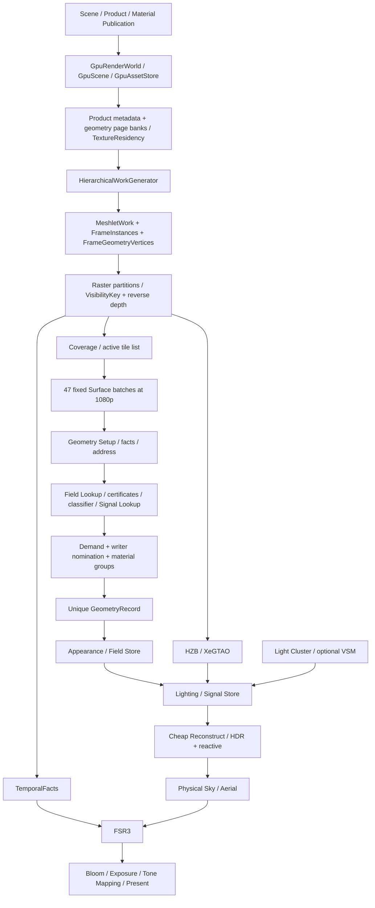

# EEngine 当前源码、GPU 执行模型与性能独立审计

日期：2026-10-05。审计快照：`09449d6d98b33a89b200bd71d5faaf8140149779`，开始及收口核对时 production 源码无未提交变更。本次不使用 skills，不继续任何 Phase，不修改生产实现。

## 结论

**判断为 C：核心执行模型需要大规模重构，重点是 Surface 前端的成本模型、物理表示和调度，而不是推倒全部 Asset、Scene 或数学算法。** FrameGraph 的 CPU 执行复杂度、Geometry 的固定层数与缺失遮挡路径也是独立问题。当前底座不适合直接继续叠加 ReSTIR、SSGI、Virtual Texture 或更多证明/队列系统。

现代技术名称没有保证现代执行效率。当前主链确实由 GPU 生成可见工作并间接执行，但 CPU 同时固定展开数千个命令；Surface 为决定“哪些工作可以省略”执行了远高于实际 Appearance/Lighting 的工作；稀疏的需求仍对应很宽的密集容量、引用表和 reset。

在本机 GTX 1650 Ti 所在 NVIDIA Turing adapter 上，独立 headless Chrome、1080p Dungeon、静态远/近相机测得：

- 每帧 2,689 个可执行 FrameGraph node，2,382 compute pass、4 render pass、2,394 dispatch。
- Surface 固定 47 个 batch；每 batch 56 个 graph node、48 个 compute pass，本例包含两个 Appearance program。
- 每帧 489 次 `clearBuffer`，清理 **283.47 MiB**；965 次 `copyBufferToBuffer`，即使禁用 GPU profiling 也存在。
- 远景 Surface timestamp pass 合计 P50 **96.14 ms**；近景 **785.19 ms**。近景 Field Lookup、Proof、Classifier、Signal Lookup 合计是主成本，实际 Lighting P50 **10.09 ms**。
- 近景真实计数：1,286,720 可见像素、1,286,265 GeometryRecord、10,293,760 Field Lookup probes，material lookup 命中率 **2.24%**。
- profiling 关闭时，JS `render()` CPU P50 仍约 **40–41 ms**。这个数包含诊断原生 API wrapper 的开销，不是无插桩生产 CPU 基准。

这些数据足以否定“仅有几个 shader 指令需要优化”的解释。它们不证明删除 cache 后必然快多少；缓存净收益仍需要保持输出正确的 recompute A/B。

## 1. 证据与可信度

本报告区分三类结论：**实测**为本次执行产生的结果；**源码事实**为当前可达调用链/ABI/循环；**待验证**为需要独立场景、A/B 或硬件采样才能定量的判断。没有用历史性能报告填补空白。

### 1.1 覆盖与环境

全 `OEngine/src` 建立 TypeScript AST 文件、函数和静态 import 清单：581 个 TS 文件、142,762 行。深入检查生产入口及其 GPU producer/consumer、主要 owner、资源 ABI 和 shader generator。**文件清单不是逐行完成所有 14 万行正确性证明**；import 可达也不等于每帧 GPU 执行。

环境：Windows；系统报告 `NVIDIA GeForce GTX 1650 Ti`、驱动 `32.0.15.8142`，另有 Intel/远程显示 adapter。浏览器实际 WebGPU adapter 报 `vendor=nvidia, architecture=turing`，不暴露 device 名称，因此型号是系统交叉证据。未控制频率、温度、供电、其他进程和远程桌面影响。

场景使用当前 showcase 的 Dungeon Product、生产 shader、GTAO/FSR3/Bloom/Physical Environment；VSM 关闭，jitter 关闭、固定曝光、内部/输出均 1920×1080。计时主试验关闭 Surface detailed counters。诊断只向 showcase 增加访问入口、包裹原生 WebGPU API 计数，**没有替换 shader 或预填结果**。

### 1.2 本次检查

| 检查 | 结果 | 能证明什么 |
|---|---|---|
| 新鲜 `npm run build:test` | 通过 | 当前源码测试产物可构建 |
| `npm run build` | 通过，含 typecheck/Vite/declaration | TS/打包成立，不证明所有 WGSL 分支 |
| 44 个 targeted tests | 44 通过，0 skip/fail | FrameProgram、capacity、reset、demand、tree、writer oracle、temporal/FSR3 lifetime 等合同；含 CPU/mock，不能统称真实 GPU 验收 |
| headless Chrome 远/近 × profiling off/full | 四组完成、记录错误为空 | 当前完整生产链在该环境可执行；未做连续画质 oracle |
| headless detailed GPU workload census | 两组完成，各 12 帧、错误为空 | 实际 coverage、需求、命中与发布计数 |
| headless 移动相机 | 独立启动，38 帧完成、错误为空 | 主链动态 view 下的成本分布；非正式 static/moving 因果对照 |
| 原生 GPU profiler 四模式微测 | 四组完成、错误为空 | 大量 timestamp 的独立成本归属 |
| 当前 FrameGraph CPU 缩放微测 | 完成 | 空 node/imported resource 的调度复杂度 |
| 128/256/512 MiB binding limit capacity 调用 | 完成 | 当前 capacity policy 的实际限制来源 |

原有 headed 性能 runner 的本次运行**没有通过完整 suite**：出现 `Target closed`、device lost `A valid external Instance reference no longer exists`、HZB compilation Instance dropped，另有仅两帧的未完成结果。原始失败保留，未把它归因为某个 shader，也未把后续 headless 成功追认成 headed 成功。

### 1.3 原始数据与复现

原始数据保存在本机 ignored 诊断目录 [audit-2026-10-05](D:/code/EEngine/.local/audit-2026-10-05/)：

- [browser-scene.json](D:/code/EEngine/.local/audit-2026-10-05/browser-scene.json)：原生命令、graph dump、逐帧 timestamp、CPU 样本。
- [browser-census.json](D:/code/EEngine/.local/audit-2026-10-05/browser-census.json)：真实 workload 与 Surface diagnostics。
- [browser-moving.json](D:/code/EEngine/.local/audit-2026-10-05/browser-moving.json)：移动相机及阶段计时。
- [browser-micro.json](D:/code/EEngine/.local/audit-2026-10-05/browser-micro.json)、[framegraph-cpu.json](D:/code/EEngine/.local/audit-2026-10-05/framegraph-cpu.json)、[capacity.json](D:/code/EEngine/.local/audit-2026-10-05/capacity.json)。
- [summary.json](D:/code/EEngine/.local/audit-2026-10-05/summary.json)、[source-inventory.json](D:/code/EEngine/.local/audit-2026-10-05/source-inventory.json)、[capacity-catalog.json](D:/code/EEngine/.local/audit-2026-10-05/capacity-catalog.json)、`targeted-tests.log`。
- [run-audit.mjs](D:/code/EEngine/.local/audit-2026-10-05/run-audit.mjs)、[summarize.mjs](D:/code/EEngine/.local/audit-2026-10-05/summarize.mjs)、`static-audit.mjs` 为本次最小诊断入口。

复现命令：`node .local/audit-2026-10-05/run-audit.mjs scene` / `census` / `micro` / `moving`，然后 `node .local/audit-2026-10-05/summarize.mjs`。脚本使用独立 Vite 4187、真实 Chrome，并在完成后关闭服务。大 JSON 未纳入报告源码，不应在生产 runtime 加入这些接口。

## 2. Top 5 根因

### 根因 1：密集物理前端驱动固定 CPU batch 展开

**文件/函数：** [SurfaceOptimizationCapacity.ts:121](D:/code/EEngine/OEngine/src/gpu/SurfaceOptimizationCapacity.ts:121) `planSurfaceOptimizationCapacity()/physicalFor()`；[SurfaceCellClassifierPass.ts:230](D:/code/EEngine/OEngine/src/render/surface/SurfaceCellClassifierPass.ts:230) `addToGraph()`；[SurfaceWorkRuntime.ts:197](D:/code/EEngine/OEngine/src/render/surface/SurfaceWorkRuntime.ts:197) `consume()`。

**当前实现：** 512 MiB 自定义 envelope 对 scratch 按 `2×scratch+224 MiB+48 MiB` 记账，1080p 最终仅容纳 700 tiles/44,800 targets。CPU 据全屏 32,400 tiles 固定建立 47 批完整流水线。GPU coverage 能压缩有效 tile 与 indirect invocation，却不会减少 CPU 展开的批数、reset、finalize、copy 或 pass。

**问题类别：架构 + 调度 + 内存。** binding limit 增至 256/512 MiB，批数仍为 47，限制池仍是 `retirementEnvelope`；这里不能把性能归罪于 WebGPU 128 MiB limit。稳定帧 queue-ordered scratch 本可复用，resize retirement 的最坏重叠被永久用来限制稳定帧吞吐。

**实际影响：** Surface 2,639 graph nodes / 2,263 compute passes；workspace+demand reset 源码计算 271.72 MiB/frame，整帧原生计数 283.47 MiB。远景只有 7.71% 像素覆盖，命令规模仍与近景相同。96 ms 的远景 Surface 本身已超过实时预算。

**验证：** 当前 planner 三种 limit、graph dump、native commands 已证明结构。下一步对同一图像和实际需求，比较紧凑工作表示、稳定帧容量和命令数；不能只扩大 budget 后看平均 FPS。

### 根因 2：通用 cache identity 和 admission 比材质/光照计算更贵

**文件/函数：** [surface_field_lookup.ts:114](D:/code/EEngine/OEngine/src/shaders/surface_field_lookup.ts:114) `lookup_surface_fields()`；[surface_signal_lookup.ts:42](D:/code/EEngine/OEngine/src/shaders/surface_signal_lookup.ts:42) `lookup_surface_signals()`；[surface_demand.ts:180](D:/code/EEngine/OEngine/src/shaders/surface_demand.ts:180) producer nomination/resolve；`SurfaceStorePublishPass.addToGraph()`。

**当前实现：** Field identity 20 words、完整 key 32 words、entry 256 B；Signal key 72 words/288 B、entry 352 B，缓存值只有 16 B。4-way probing 后还需 support、同 key writer nomination、resolve、admission、Store。Signal key hash/比较包含完整依赖；不能假设四路每次都比较到末尾，但长 key 的生成和读取是真实成本。

**问题类别：架构 + GPU 内存实现。** 缓存把便宜值与复杂闭包统一进入昂贵协议。跨帧重用成本没有按字段/材质/信号的真实重算成本分级，宽 witness 随像素而不是有收益的重用域增长。

**实际影响：** 近景 FieldLookup P50 169.54 ms、SignalLookup 108.00 ms、Demand 62.26 ms、Store 44.24 ms；Appearance 6.68 ms、Lighting 10.09 ms。近景 material hit 86,654/3,860,160=2.24%，10,293,760 field lookup probes；signal cache 发布 admission 仅 1,351，拒绝计数 1,014,088。后者不是 shading 工作丢失：拒绝的是可选 cache 请求/admission 路径，真实输出需求继续计算。

**验证：** 热点与低 material 命中实测成立。**尚未完成正确输出的 cache OFF/recompute A/B，不据此宣称所有 cache 都无收益。** 验证净收益必须覆盖 cold/static/moving、贵纹理材质与常量材质，并计入 key、lookup、proof、admission、store、reset 全账。

### 根因 3：每个 plane 的证明与 tree/scan 管理没有换来采样减少

**文件/函数：** [surface_cell_classify.ts:120](D:/code/EEngine/OEngine/src/shaders/surface_cell_classify.ts:120) classifier entry；[surface_cell_group_validation.ts:171](D:/code/EEngine/OEngine/src/shaders/surface_cell_group_validation.ts:171) `cell_tree_validate_plane()`；`surface_cell_production_facts` 的 certificate producer。

**当前实现：** 15 field planes + 6 signal planes，重复 coverage、21-node 固定 tree、geometry reduction、field dependency reduction、provider proof 和 64-lane prefix。Fixed tree 消除了任意子集组合，但并没有消除各 plane 的重复工作。

**问题类别：架构成本模型 + shader 同步实现。** 只用 O(N) 评价算法掩盖了常数、重复 reduction、工作组闲置和同步。其复杂度必须按 `active tiles × active planes × dependencies × reduction/barriers` 算。

**实际影响：** 近景 Proof P50 146.15 ms、Classifier 178.52 ms。近景 GeometryRecord/visiblePixels=99.965%，远景=99.953%；当前普通场景的证明系统几乎没有减少 record 数量。仍可分享部分 diffuse transport，不能将这个比例直接解释为所有 lobe 完全 fine，但重型前端收益严重不足。

**验证：** GPU 需求计数、独立 tree CPU 合同、逐阶段 GPU timestamp 已获得。需要受控合法成功/局部拒绝场景以及同质量 fine reference，量化“每少一个真实 material/light evaluation，付了多少 proof/scan”。不能删证明条件或永久拒绝 coarse 来通过测试。

### 根因 4：FrameGraph 执行对每个 node 扫描全部 resource registry

**文件/函数：** [FrameGraph.ts:885](D:/code/EEngine/OEngine/src/framegraph/FrameGraph.ts:885) `executeCompiled()`，尤其 [FrameGraph.ts:927](D:/code/EEngine/OEngine/src/framegraph/FrameGraph.ts:927) 生命周期 release 循环。

**当前实现：** 每个执行 node 后遍历所有 resource entry，判断 `last===pass` 再释放 transient。许多不同 graph import 最终指向同一物理 scratch GPUBuffer，却仍扩张 registry。

**问题类别：CPU 实现 + 资源身份架构。** `O(nodes×resources)` 循环连 imported resource 也遍历，稳定缓存 graph 仍付这笔钱。1080p 2,689×1,603，约 **431 万 entry 检查/frame**，无需 GPU workload 就会增长。

**实际影响：** 当前真实空 graph micro，2,500 nodes/100 resources P50 1.45 ms；/1,000 resources 13.78 ms；/3,000 resources 49.83 ms。真实 renderer 的 graph-execute P50 39.50–42.08 ms，包含编码/绑定/诊断，不能把全部归给这一个循环。

CPU micro 运行时主机还有浏览器诊断活动，40样本未做进程/频率隔离；其绝对毫秒不能当作删除循环后的帧时预测。相同真实入口的资源规模变化与源码循环共同支持复杂度结论。

**验证：** 生产 `CompiledFrameGraph.execute()` 缩放测试及源码直接证明。将 release 按 schedule index 预编译成列表、同物理 import 共享 owner 身份，再做同样缩放实验与真实 renderer 验证。**graph compile/dump 已缓存，没有证据支持“每帧全图重建”这个指控。**

### 根因 5：Geometry 的运行时描述与遮挡路径不符合真实 workload

**文件/函数：** [VirtualGeometrySceneSourceV1.ts:164](D:/code/EEngine/OEngine/src/assets/geometry-product/VirtualGeometrySceneSourceV1.ts:164) 固定 `hierarchyMaxDepth:64`；[PackedVisibilityPass.ts:462](D:/code/EEngine/OEngine/src/render/passes/PackedVisibilityPass.ts:462) `encodeHierarchy()`；[RendererCore.ts:1443](D:/code/EEngine/OEngine/src/render/pipeline/RendererCore.ts:1443) 移动时 HZB invalidation。

**当前实现：** Product metadata 向 runtime 声称 max depth 64，CPU 编码 root+64 rounds。Virtual Geometry 路径显式将 previous HZB 设为 null，默认 current-HZB late recheck 又关闭；普通移动相机任意 matrix delta>1e-5 也失效 previous HZB。

**问题类别：Geometry 架构 + 固定调度 + 能力缺口。** indirect 控制 round 的 GPU invocation，却无法取消 64 轮命令和参数维护；当前 Product 主路径没有遮挡剪枝，虽然后续仍生成 HZB。

**实际影响：** 原生计数确有 65 hierarchy passes。当前场景 Geometry GPU P50 2.36–2.69 ms，并不是近景 785 ms Surface 的主原因；但此缺陷扩大复杂场景 workload 风险、削弱“GPU-driven occlusion”能力，不能因为 Geometry 暂时较快就忽略。

**验证：** 当前 source descriptor 和 native commands 已证明；census meshlet works 远 1,176、近 1,404，仅增 19.4%，而覆盖约增 8.05 倍。应以真实树深、选中三角形、遮挡拒绝数和 overdraw/microtriangle histogram 分离几何吞吐与 Surface 成本。三角形计数当前未可靠接通，不填零当作结果。

## 3. 当前引擎实际上是什么

### 3.1 生产 owner 与数据链



这是当前的实际类型与调用关系，不是按名称推断的理想功能清单。Surface 包含 Lighting，Shadow 若启用需在 Surface 消费前建立；TemporalFacts 在 Surface 之前解决 motion/identity，FSR3 在之后。环境 LUT 维护在 FrameGraph 之前编码进同一个 encoder。

| 系统 | 真实边界 | 审计判断 |
|---|---|---|
| Scene / Asset / Product | Scene 保留 CPU 身份；cook/package/source 将 Product 发布到 GPU world | 数据发布与渲染分离存在；容量和 runtime descriptor 仍过度保守 |
| GPU Scene / World | `GpuRenderWorld`、`GpuScene`、`GpuAssetStore`、material/publication | 真实长期 GPU owner；patch 与 active shading summary 用于帧准备 |
| Geometry / pages | Product heap+4 banks、page residency、hierarchy、meshlet work、frame arena | 真实 GPU traversal/LOD；固定深度、缺 occlusion、宽 vertex attributes |
| Material / Texture | `GpuAppearancePublication`、program partitions、texture banks、`TextureResidency`、variation pool | shader/program 分派真实存在；cheap material 仍进入重前端 |
| Surface | `SurfaceWorkRuntime` 集成 classifier/setup/demand/record/appearance/lighting/store/reconstruction | 最大架构热点；局部 sparse producer 被 dense scratch 和固定批编码抵消 |
| Lighting | cluster buffers+direct/IBL/solar；LightingWork 消费唯一 record | 消费边界比重复 source decode 更好；fallback 有全灯路径 |
| Shadow | VSM receiver demand/allocation/caster/atlas/版本；本次场景关闭 | 不可用本次时间表替它背书；局部灯阴影能力未完成 |
| Environment | persistent atmosphere LUT/IBL 与 full-screen Sky/Aerial | LUT dirty 机制确实存在，不是每帧重建所有 LUT |
| Temporal | TemporalFabric/history roles、TemporalFacts、FSR3 | 产品/失效机制实际接通；identity/history 高内存，SPD 命名失真 |
| Post | Bloom、radiometry、tone mapping/present | 当前测得次于 Surface；不能假设以后仍次要 |
| Debug / Profiler | FrameProfiler、GPUTimer、readback rings、SurfaceDiagnostics | 区分 instrumentation 模式不足，部分字段有误导 |

### 3.2 不在本次生产帧里的模块

SSR、独立 TAA、NSS、motion blur、transparent OIT 等源码存在，但当前普通生产 FrameProgram 没有对应 stage。这不等于它们永远不可达：debug/export/test/import 可保留引用。**不能把文件存在算成一帧开销，也不能把完整 AAA 透明/SSR/TAA 功能宣称已运行。**

## 4. 一帧实际执行

入口为 [RendererCore.ts:1310](D:/code/EEngine/OEngine/src/render/pipeline/RendererCore.ts:1310) `render()`；`FrameProgram` 经 `lowerFrameProgram()/compileSceneGraph()` 编译到缓存 FrameGraph；`executeCompiled()` 同步编码，FrameCoordinator 提交一个 command buffer。存在两帧 completion backpressure；本次串行测量每帧等待完成，不代表正常吞吐调度。

### 4.1 CPU 与 GPU 顺序

1. 检查 device/frame/scratch retirement 是否可以开始；Streaming pressure 更新。
2. profiler begin、FrameCoordinator begin，同一个 `Renderer/visibility-frame` encoder。
3. Temporal begin、GPU frame maintenance、环境 LUT dirty update、pre-exposure 参数。
4. Scene pending patch、Appearance publication sync、view/camera upload、HZB/history 状态更新。
5. 缓存 FrameProgram/FrameGraph recipe，late-bind 当前资源；稳定帧 cache hit，本次 build/compile 为零。
6. Product hierarchy root+64 rounds，meshlet candidate、FrameInstances、FrameGeometryVertices、raster partition，Visibility render。
7. HZB compute pyramid；LightCluster 的数据准备；GTAO；TemporalFacts。
8. 若启用 VSM：invalidation→receiver demand→allocate→caster records→atlas raster/content version，供后续 Surface Lighting 使用。
9. Surface 共用 dependency epoch、coverage、radiometry envelope、publication，然后按固定 batch 顺序 reset→active range→setup→facts→address→field lookup/support→proof queues/certificates→classifier0→signal witness/lookup→classifier1→Demand→GeometryRecord→Appearance→FieldStore→Lighting→SignalStore→reconstruct。
10. Physical Sky、Aerial，FSR3 pre-exposure/prepare/pyramids/reactivity/accumulate/RCAS，Bloom，tone-map/present。
11. timer resolve/readback 与其他请求提交，queue submit 一次，history/scratch 生命周期绑定 completion。

### 4.2 1080p 实际阶段规模

| 阶段 / CPU owner | GPU owner 或 entry | graph nodes（执行） | compute / render pass | 主要资源与边界 |
|---|---|---:|---:|---|
| PackedVisibilityPass | hierarchy、candidate、instances、vertices、partition、coverage | 1 | 77 / 1 | scene/page/meshlet→frame arena、vertices→depth/VisibilityKey；多次间接参数与 clear/copy 藏在一个 node |
| Visibility HZB | HZB compute pyramid | 1 | 1 / 0 | depth→逐 mip HZB；同一 compute pass 中多 dispatch/pipeline |
| visibility counters | R0 count owner | 1 | 主计时试验 0 / 0 | counter disabled 时 node 仍在图中 |
| LightCluster | visible list/cluster resources | 3 | 本场景 0 / 0 | 没有有效本地灯，节点保留、GPU 分支不编码 cluster assign |
| XeGTAO | normals/prefilter/mip/main/denoise/pack | 7 | 6 / 0 | depth/visibility→weighted depth、AO indirect visibility |
| TemporalFacts | resolve | 1 | 1 / 0 | visibility+scene identities+previous history→motion/mask/current identity |
| SurfaceWorkRuntime | shared 7 + 47×56 batch nodes | 2,639 | 2,263 / 0 | workspace、setup、cache、proof、demand、records、fields/signals、HDR；大量 copy/reset 边界 |
| PhysicalSky / Aerial | sky render/aerial compute | 2 | 1 / 1 | atmosphere/IBL LUT、HDR/depth→sky/aerial HDR |
| FSR3 | prepare、13 luma/3 shading mip、reactivity、accumulate/RCAS | 23 | 23 / 1 | 另有 clear-new-locks render 由 FSR3 owner 内编码；8 个图 node 被 cull |
| Bloom | extract/4 down/4 up/compose | 10 | 10 / 0 | FSR3 HDR→bloom chain→composite |
| Present | SurfacePresentPass | 1 | 0 / 1 | exposure/tone mapping→swapchain |
| 总计 | 实际 encoder | **2,689** | **2,382 / 4** | 不是 node 与 pass 一一对应 |

graph 注册 node 总数 2,697，执行 2,689，resource registry 1,603。这里 resource 是 graph entry，既不是唯一物理 GPU allocation 数，也不是资源版本 node 数。

本次原生拦截没有给每个 draw/dispatch/copy 绑定 graph node ID，因此阶段表不伪造逐 owner 的所有 copy/clear 精确账。细粒度 pass 标签及依赖已保存在原始 dump；整帧命令下表完整计数。下一版诊断应在 facade 的 node scope 中归属这些操作。

### 4.3 整帧命令账

| 项目 | profiling off | full per-pass profiling | 口径 |
|---|---:|---:|---|
| Compute Pass | 2,382 | 2,382 | 原生 beginComputePass |
| Render Pass | 4 | 4 | visibility、sky、FSR locks、present |
| direct dispatch | 445 | 445 | 含 finalize、reset、full-screen 等 |
| indirect dispatch | 1,949 | 1,949 | 控制 invocation 数，不减少 encoded pass |
| dispatch 合计 | 2,394 | 2,394 | HZB/candidate 等一个 pass 多 dispatch |
| direct draw | 2 | 2 | sky/present |
| indirect draw | 2 | 2 | visibility 分区 |
| buffer copy | 965 | 968 | 324,420 / 362,596 B；后者多三页 timestamp readback |
| buffer clear | 489 | 489 | **297,241,108 B = 283.47 MiB/frame** |
| render attachment clear | 4 | 4 | 与 clearBuffer 分开 |
| setPipeline 调用 | 2,390 | 2,390 | **不是去重后 pipeline switch 数** |
| setBindGroup 调用 | 4,233 | 4,233 | **不是 cache request 数** |
| 原生 createBindGroup | 41 | 41 | 稳定帧仍有 post 等新建绑定 |
| Surface bind cache request | detailed census 3,909/frame | detailed census 3,909/frame | 该 census 多诊断 pass；cache create 增量为零。全工程 request 数未统一插桩 |
| timestamp writes | 0 | 4,772 | 每 compute/render pass 两个 query |
| query resolve | 0 | 3 | 1,024 pass/page |
| queue submit | 1 | 1 | 无本帧 visible GPU→CPU→GPU 控制回路 |

Buffer copy **次数极多但字节小**：主要成本疑似调度/状态/依赖，不应当用 0.31 MiB 推断 copy 免费。Clear 字节为命令请求范围，不是显存总线实测带宽；driver 可能优化清零。

## 5. 当前性能账

### 5.1 采样方法与误差

每组 38 帧，前 8 帧剔除，30 个 CPU/queue-completion 样本。full 组最后一个 timestamp 仍 pending，仅使用本组最新 38 frame 中剔除 8 warmup 后的 **29 个完成 GPU 样本**，未混入 profiler 历史中上一组数据。P50/P95 采用排序后线性插值。

`GPU span` 为第一个 pass start 至最后一个 pass end，覆盖间隙，仍不包含更早维护/更晚 resolve、浏览器呈现、queue 等待。`pass sum` 为各 pass timestamp 时长和，遗漏 pass 间 copy/clear/gap。此设备浏览器时间量化约 **65.536 us**，很多小 pass 为零，不能按单个零值宣称免费。

`completionMs` 为 JS render 开始至 `queue.onSubmittedWorkDone()` 返回，包含 CPU、提交、排队、浏览器 IPC/fence；**不是 GPU frame time，也不能把 completion-span 的差全算为 profiler 或 GPU scheduling。** 原生 wrapper 有 CPU 税。四组按固定顺序运行，未随机化/交错或锁定温度，远近/off/full 差异不能用于正式收益百分比。

### 5.2 整帧

| 条件 | CPU render P50 / P95 ms | queue-completion P50 / P95 ms | GPU pass sum P50 / P95 ms | GPU span P50 / P95 ms |
|---|---:|---:|---:|---:|
| far 1.75 / profiler off | 41.45 / 58.50 | 262.75 / 306.06 | 未采样 | 未采样 |
| far 1.75 / full | 43.35 / 50.74 | 269.72 / 288.06 | 106.10 / 112.25 | 112.79 / 119.68 |
| near 0.50 / profiler off | 40.66 / 56.96 | 764.01 / 955.00 | 未采样 | 未采样 |
| near 0.50 / full | 41.27 / 50.98 | 962.49 / 990.08 | 809.11 / 828.20 | 817.63 / 836.06 |
| moving 约0.50 / full，独立启动 | 89.31 / 113.42 | 984.95 / 1158.12 | 673.58 / 787.21 | 680.92 / 795.33 |

GPU pass 间 gap P50：far 7.08 ms、near 8.06 ms。这包含无法从 per-pass sum 看见的工作/间隙。CPU graph-execute P50 far 42.08 ms、near 39.50 ms，scene-prepare 约 0.06 ms、view-prepare 0.49–0.54 ms；当前 CPU 主问题是 graph 执行与命令编码，不是 Scene update。

移动组每帧改变相机distance为 `0.5+0.025*sin(frame*0.2)`，经过当前production view更新；CPU计时不含外部设置相机动作。graph稳定cache hit，命令数和683次/31,768B upload与静态相同，CPU graph-execute却P50 86.90ms。这是尚未定位的host/driver/测量波动，不能直接归因为camera运动或graph重编译。移动组来自另一次浏览器启动，缓存占用、coverage及温度不同，不构成“移动比静态快”的因果证据。

### 5.3 GPU 阶段

每项先在一帧内累加该阶段所有 pass，再计算分位数。**各项 P50/P95 不可直接相加得到整帧对应分位数。** Lighting 已包含在 Surface，不重复加入整帧。

| GPU 阶段 | far P50 / P95 ms | near P50 / P95 ms |
|---|---:|---:|
| Geometry traversal/work/instance/vertex/partition | 2.36 / 3.16 | 2.69 / 12.65 |
| Visibility raster | 0.39 / 0.69 | 0.92 / 4.34 |
| HZB | 0.13 / 0.20 | 0.20 / 0.81 |
| GTAO | 0.98 / 1.25 | 2.36 / 16.45 |
| Surface 全部 | **96.14 / 101.24** | **785.19 / 815.05** |
| Lighting，仅 Surface 子集 | 1.25 / 1.59 | 10.09 / 12.65 |
| VSM Shadow | 本组关闭，未测 | 本组关闭，未测 |
| Physical Sky + Aerial | 0.52 / 0.52 | 0.59 / 3.25 |
| TemporalFacts | 0.52 / 0.72 | 0.72 / 4.05 |
| FSR3 | 4.19 / 4.59 | 4.78 / 26.28 |
| Bloom | 0.52 / 0.63 | 0.59 / 2.54 |
| Present/tone mapping | 0.26 / 0.45 | 0.33 / 1.35 |

当前典型 P50 明确由 Surface 支配。近景许多无关阶段 P95 同时升高，存在全局状态/频率/driver 波动，不能据此直接断言 FSR3 算法固有 26 ms。P0 后须重新测 post；本次没有证据支持“Temporal+Post 稳定 30 ms”的说法。

移动组阶段 P50/P95（ms）：Geometry 2.69/3.68，Visibility 0.66/1.26，HZB 0.13/0.39，AO 2.29/3.29，Surface **650.77/754.02**，Environment 0.59/0.69，TemporalFacts 0.66/1.04，FSR3 **14.35/18.72**，Bloom 0.59/0.59，Present 0.33/0.56；VSM仍关闭。

### 5.4 Surface 内部

| 阶段 | far P50 / P95 ms | near P50 / P95 ms |
|---|---:|---:|
| Coverage | 0.33 / 0.46 | 0.52 / 3.26 |
| Geometry Setup 六阶段 | 3.01 / 3.38 | 6.75 / 7.93 |
| Address | 1.05 / 1.25 | 5.83 / 6.59 |
| Field Lookup + support finalize/validate/commit | 18.74 / 19.86 | **169.54 / 187.62** |
| Proof family queue + certificates | 18.35 / 19.50 | **146.15 / 170.37** |
| Classifier 两阶段 | 14.29 / 15.74 | **178.52 / 199.96** |
| Signal witness + Lookup | 17.50 / 19.22 | **108.00 / 121.12** |
| Demand/nominate/resolve/compact/group | 9.31 / 10.08 | 62.26 / 76.62 |
| GeometryRecord | 1.38 / 1.68 | 11.93 / 13.95 |
| Appearance 两个 program | 1.38 / 1.82 | 6.68 / 7.88 |
| Lighting | 1.25 / 1.59 | 10.09 / 12.65 |
| Field/Signal Store 六阶段 | 6.68 / 7.21 | 44.24 / 52.87 |
| Reconstruct | 1.44 / 1.81 | 6.49 / 7.85 |
| Facts/publication/dependency/radiometry/active-range | 1.05 / 1.39 | 2.03 / 3.57 |

近景单 `lookup_surface_fields` P50 165.87 ms、单 Signal Lookup 101.19 ms，classifier stage0 53.74 ms、stage1 118.03 ms。上述是整个标签跨 47 batch 的每帧合计，不是单 dispatch 耗时。

移动组Surface P50/P95（ms）：Coverage 0.52/0.72，Setup 5.31/6.50，Address 4.85/5.32，FieldLookup 141.49/158.60，Proof 113.05/142.33，Classifier 120.91/134.78，SignalLookup 103.68/123.40，Demand 54.53/61.49，GeometryRecord 8.91/10.22，Appearance 5.96/7.43，Lighting 8.39/9.83，**Store 70.71/81.20**，Reconstruct 5.90/6.72，maintenance 1.70/2.37。动态view不能指望静态cache收益，Store的这组绝对成本值得单独查，但尚无同条件cache A/B。

### 5.5 真正工作量与收益

以下取独立 detailed census 最后一帧；两组各 12 帧用于读取/稳定观察，不作为另一份 30 帧正式性能表。detailed 模式会增加 snapshot pass 和原子计数，故不将其耗时拼入主计时。

| 计数 | far | near |
|---|---:|---:|
| output pixels | 2,073,600 | 2,073,600 |
| visible pixels / coverage | 159,914 / **7.71%** | 1,286,720 / **62.05%** |
| active tiles | 2,662 | 20,409 |
| uniform / mixed tiles | 1,504 / 1,158 | 16,537 / 3,872 |
| GeometryRecord | 159,839 | 1,286,265 |
| material lookup / hit | 479,742 / 61,572 | 3,860,160 / 86,654 |
| material hit fraction | 12.83% | **2.24%** |
| Appearance evaluator records | 159,827 | 1,286,219 |
| Lighting records | 148,304 | 1,265,522 |
| Field Lookup probes | 1,279,312 | **10,293,760** |
| full direct-light evaluations | 141,073 | 1,262,427 |
| shared direct-transport evaluations | 71,544 | 1,090,541 |
| proof admitted / rejected | 31,039 / 332,669 | 262,062 / 2,235,764 |
| field cache requests / admissions | 256,423 / 5,234 | 2,465,254 / 6,687 |
| signal cache requests / admissions | 138,077 / 17,859 | 1,226,203 / 1,351 |
| signal cache rejected counter | 42,509 | 1,014,088 |
| Geometry hot / cold writes | 19.51 / 13.37 MiB | **157.01 / 115.74 MiB** |
| signal witness leaves | 159,914 | 1,286,720 |
| signal witness writes | 7.32 MiB | 58.90 MiB |
| explicit Store ref writes | 2.15 MiB | 3.03 MiB |
| Geometry nodes tested | 3,508 | 3,065 |
| meshlet works produced | 1,176 | 1,404 |

`sharedDirectTransportEvaluations` 说明确实有局部复用，不能声称所有优化完全无效。但 sample/record 数几乎等于全部可见像素，昂贵 proof/classifier 没有换来整体稀疏着色。更多 near 时间主要随 screen workload 增长；本场景没有“meshlet 激增八倍”证据。

`geometryRasterTriangles`、`geometryPaddedVertices`、多个 light-loop/shadow/allocatedBytes/reconstructReadBytes 字段为零，却没有完整生产写入证据，因此记为**不可用**，不是实际零工作。UV witness 的计数是逻辑写字节，物理槽仍为 72 B，不能拿较小 logical counter 证明 allocation 紧凑。

## 6. GPU-driven 与 FrameGraph

### 6.1 GPU-driven 的真实程度

GPU traversal、LOD/SSE、MeshletWork、compact、indirect raster/dispatch 都是真的。没有发现本帧 GPU 可见工作读回 CPU 再生成本帧 GPU workload 的控制回路，Streaming 的延迟反馈不等同于这种禁忌回路。

但它目前更像 **GPU 决定每个既定命令调用多少 invocation，CPU 决定大量固定容器**。空 indirect dispatch 不能删除 begin/end pass、pipeline/bind、timestamp、reset、upload/copy。Coverage 将 active tiles 压缩以后，CPU 仍按全部屏幕 capacity 的 batch 数编码。这不是健康的 GPU-driven execution model。

WebGPU 没有通用 execute-indirect command stream，也不能依赖同 dispatch 内全局 barrier；不要求虚构 DX12 式 command list。应设计成少数有界 GPU queue phases、packed work、少量真正需要全局可见性的 dispatch 边界，使空工作至多承担固定小常数调度税。

### 6.2 graph compile / execute / alias

- graph 使用 resource version、producer/read/write、显式依赖、拓扑顺序、根资源和 side-effect culling；不是没有依赖系统。
- 稳定 recipe 复用 `CompiledFrameGraphCache`，late binding 替换当前资源，`dump()` 缓存。不要继续“优化每帧 compile”这个错误对象。
- 生命周期在 compile 阶段已得知 first/last，execute 却仍每 node 扫全 registry；应预编译 release events。
- 多个 graph import 表示同一物理 scratch，却没有一个统一物理资源的版本链可自动推导别名 hazard。当前通过 batch `consumed`、reset read 及 node 顺序补充，形成额外协调层。不能直接删除这些依赖，否则可引入覆盖上批数据。
- resource manager 的复用是 GPUBuffer/GPUTexture 对象池，不是显存 heap placement alias。报告不把逻辑生命周期复用当成物理 native alias 已完成。
- WebGPU 隐式处理资源状态/同步与验证；FrameGraph 没有显式 native barrier 编译器。node 多不等于 barrier 数，pass 少也不等于 shader 同步少。
- Environment LUT 的直接 encoder 维护不在全部 graph 资源依赖中；目前靠源码顺序保证。这是图对真实帧不完整的边界，应让 persistent owner 的发布产品/version 进入图，而非再加一套全局状态表。

### 6.3 哪些边界保留，哪些应合并

| 类别 | 当前对象 | 决策与约束 |
|---|---|---|
| 必须保留 encoder-level 边界 | clearBuffer/copyBufferToBuffer、render↔compute、附件使用 | 无法把 encoder copy/clear 塞入 compute pass |
| 必须保留全局工作同步 | histogram/nominate→resolve、append→finalize、producer→consumer | 仍需 dispatch 级全局顺序；不能用 workgroupBarrier 替代 |
| 可能同 compute pass | 同资源兼容读写的 finalize/validate/commit、多个 direct dispatch、pipeline-only 切换 | 改 shader/绑定的同时验证 WebGPU usage scope；node 可独立而编码 pass 共享 |
| 必须谨慎分开 | 写 indirect 参数然后绑定同 buffer 作为 INDIRECT | compute pass usage scope 可能 STORAGE-write/INDIRECT 冲突；目前 copy 到独立 args buffer 有理由，不能盲删 |
| 可 shader 合并 | 重复读同一 leaf/fact 的局部 witness/address，统计可用 bitmask 的 rank | 只合并 invocation-local 计算，不跨全局依赖，检查 register/live range |
| 可 queue 化 | active tiles、proof family、material groups、dirty signals | packed 实际队列；不要变成更多固定 queue capacity×node |
| 可 indirect chain 化 | 真实 producer 输出 counts→下一 phase args | 保持少量边界，indirect chain 仍不是自动删除 host commands |
| 应消除的 graph 组织税 | batch consumed 空 node、同物理 scratch 多次 import、每小 kernel 独立 pass | 用明确物理版本链/phase owner 替代；不能只删命名节点后保留原命令规模 |

HZB 一个 pass 内多个 mip dispatch 是当前已有的积极例子，证明不是所有换 pipeline 都需要结束 pass。另一方面 GPU mip 数据依赖与同 texture 不同 subresource usage 仍须按实际绑定验证。

## 7. 内存、布局与 capacity

### 7.1 Surface 物理账

1080p 实际 planner：scratch **119.901 MiB**、persistent segments 224 MiB、retirement overlap 再计 119.901 MiB、output reserve 24 MiB 及其他 envelope headroom。它是容量模型账，不是实际同一时刻所有 GPU allocation 相加。

| 产品 | 真实布局/最大 stride | 1080p batch 容量或 pool | 判断 |
|---|---|---:|---|
| workspace | plans/maps/proofs/witnesses/ref/demand/facts | 31.14 MiB | 混合 hot/cold/control，按 44,800 target 密集保留 |
| tile plan / map | 568 B/tile，map worst 21×96 B/tile | capacity 700 tiles | 很多模板不需 map，但 worst pool 永久存在 |
| proof results | 32×52 words/tile | 4.44 MiB | 真实 append 写小于保留；screen-field refs 等另有密集表 |
| addresses | 24 words/96 B per target | 4.10 MiB | 正式 identity 与值 witness 分开了，仍大 |
| UV witness | 18 words/72 B per target | 3.08 MiB | 按需写入不等于按需物理容量 |
| signal witness | 12 words/48 B per target | 2.05 MiB | census 当前每 visible leaf 都生成 |
| field/signal explicit references | 每 target 21×8 B | 7.18 MiB | 即使实际 ref 写入很少也预留全部 |
| GeometryRecord hot | 128 B/record | 5.47 MiB | Lighting hot-only 的边界有价值 |
| GeometryRecord cold | 最大 528 B/record | 22.56 MiB | append 实际 union 写入；physical worst-case dense，不应误称每次都写 528 B |
| Geometry Setup + refs | 512 B/setup + 8 B/ref | 22.22 MiB | 混合 tile 排序/同帧 memo，宽三角形缓存 |
| geometry memo | 528 B×32,768 entries | 16.50 MiB | 有 frame generation，第一批 reset state，持续维护 publish/commit |
| field values | 240 B/target | 10.25 MiB | 15×vec4，不意味着所有 field 有有效值 |
| signal values | 96 B/target | 4.10 MiB | 6×vec4 |
| Demand | queues/hash/masks/program/control | 6.46 MiB | 2R/R cache request capacity、pow2 dictionaries、固定 256 program slots |
| FieldStore+dependency | 256 B entry/value16 B，另 witness pool | 120+8 MiB | metadata/identity 比 value 宽得多 |
| SignalStore | 352 B entry/value16 B | 约 64 MiB | key288 B，cacheline与随机读压力 |
| texture variation | 独立 pool | 32 MiB | 另一个 budget owner，须核收益 |

上述范围有子区重叠，**不能再次把 workspace 子区加到 workspace 总数上**。Geometry Setup 总池 38.72 MiB 包含 22.22 MiB arena+16.50 MiB memo。

hot/cold 分离、语义 alias 共用 physical 属性、memo fast path、uniform winner fast path 均真实存在；问题是这些优化外面仍包着大规模统一协议。相邻 tile/record 的 key 与 value 不连续导致 random memory，原子 touch/CAS 让读 cache 也写状态。未获得 vendor cache miss/register spill 指标，不把这些推测写成实测。

### 7.2 全工程 sparse/dense 清单

| 系统 | sparse 逻辑 | dense 物理或编码 |
|---|---|---|
| Coverage/Surface | active tiles compact | 全屏最大 batch 数、每批 reset/finalize/pass |
| GeometryRecord | 按 union 生成、cold append | hot+cold 最大槽数预留 |
| Witness/proof/ref | 实际请求/结果计数 | 全 target witness/ref、worst certificate pool |
| Store admission | 少量 admission 成功 | 仍为大量 request hash、nomination、probe、resolve |
| hierarchy | 每层实际 work count | 固定 root+64 round commands |
| meshlet candidate | 实际 visible clusters | `visibleClusterCapacity` 级 direct generation dispatch/early return |
| frame vertices | 选中 vertex count | 默认 1<<20 vertices ×96 B=96 MiB attributes |
| Product pages | 当前只 64 pages/32 MiB resident | 4×128 MiB banks=512 MiB，2,048 slots |
| Temporal identity | 有效表面身份 | full-resolution 双 rgba32uint，无表面区域也保留 |
| VSM caster records | dirty pages/selected work | workCapacity dispatch，每 work 再循环 dirty allocation |
| clustered lights | 少量 light | full screen/depth clusters，最坏每 cluster 扫全部 active light |

Product pool 初始实测 512 MiB banks+64 MiB metadata heap；resident physical slots计32 MiB/64 logical pages，相对物理slot容量使用率 **6.25%**。ABI raw page实际是 **256 KiB**，64pages的raw仅16MiB；`VirtualGeometryResidency.#writeResidentPage()`另外将resident attributes/directory写入extraslots，所以当前physical resident为128slots，而非64slots。这个32MiB不是raw资产payload总数。Frame arena 初始实测28.70MiB，attributes96MiB。各系统有独立budget，没有一个当前有效的统一帧峰值/VRAMpressure分配策略。

TextureResidency 的 2 GiB budget 是 ceiling，不能加成“已分配 2 GiB”；但在约 4 GiB GPU 上，geometry+surface+history+纹理多个局部 ceiling 缺少全局协调是实在的风险。初始 buffer 采样不追踪 destroy 后 lifetime，不能把历史 createBuffer 全部相加称 live VRAM。

### 7.3 为什么需要 batch

| 模型 | 硬约束 / 软约束 | 当前问题 |
|---|---|---|
| Surface 8×8 tile/64 lane | 局部共享与 prefix，算法选择 | tile 有理由；21-plane 密集 ABI 不是硬件必需 |
| Surface batch 700 tiles | 自定义 envelope/category/retirement，及 buffer limits | 本次真正先碰到 retirementEnvelope；不同 binding limit 结果不变 |
| Geometry raw page 256 KiB / 4 banks | Page ABI、可绑定 bank 数/大小 | raw+expandedresident占多个slot，大bank先全分配，与resident需求解耦 |
| hierarchy round | 实际树全局工作同步 | source hardcode64，不是 cook 树深实测 |
| program slots 256 | runtime partition 最大值 | 实际两个 program 仍付较宽表/控制成本 |
| cache 4-way / producer hash | association/唯一 writer 协议 | 并非 WebGPU 强制；需与省下计算比较 |
| light cluster 32px×24 z | cluster 空间分割 | overflow fallback 退成全灯遍历 |
| profiler 1024 passes/page | querySet/page implementation | 每帧三页，granularity 可改变 |

capacity fresh invocation：640×360→6 batches，1280×720→21，1920×1080→47，均受 retirementEnvelope 限制。2560×1440/3840×2160 被自定义 **outputs 24 MiB** policy 拒绝，而不是 adapter texture dimension。`outputBytes=24 MiB` 也不是精确实际 HDR/reactive 用量；1080p 实际两者合计 23.73 MiB。

调整 budget 可以作为诊断，但不是根治：宽 ABI 让扩大 batch 需要大量 VRAM，且不降低每 pixel lookup/proof。正确顺序是瘦表示和重用收益分级，再按实际 limits/峰值 memory 决定 partition；稳定 scratch 与 resize 短暂 overlap 分开管理。

声明级capacity清单对全部581个TS文件扫描变量/属性/参数中的batch/chunk/page/tile/cluster/capacity/budget/queue-limit，获得 **186文件、1,815条声明**，具体文件、行号、初始表达式在`capacity-catalog.json`。它包含非生产路径和重复参数，不能当作1,815套独立capacitypolicy；也无法发现无名数字，因此不是所有隐含magic limit的完备证明。正文表格聚焦生产上真正改变容量和调度的模型。

### 7.4 Allocator、upload、streaming与pipeline管理

`GPUBufferAllocator`按size/usage复用recent/aged池，维护active/pending/cached，completion后退回；`GPUStagingBufferAllocator`按size下界取缓存、completion后插回。合法queue顺序的复用是需要保留的机制，不能因为cache多就统一删除。array splice/搜索可能有CPU税，本次未证明它们是最大的host热点。

`GPUTextureAllocator`按完整descriptor匹配、按数量>1024时trim至512，并周期检查过期；没有按bytes统一pressure。其`evidence().allocatedBytes`仅cached+pending，**不包含正在被consumer持有的active texture**，不能用这个字段替代全引擎live texture内存。`GPUTextureContext`独立accounting可补owner账，报告没有将这处口径认定为已证明泄漏。

本次full静态帧profiler记录 **683次upload write、31,768B**，其中31,508B标为staging-copy；上传数据少而碎，产生大量copy命令和小uniform分配/绑定。应按phase打包稳定参数、变动参数和实际args，而不是仅优化byte throughput。native965copy包含这些及indirect拷贝，不能把两个次数直接等同。

`GeometryPageStreamingRuntime`使用延迟readback、completedframe后poll、CPU IO scheduler及residency发布；默认并发read2、inflight4MiB。它不是本帧可见工作同步控制。page pin/generation/retirement对应真实异步资源寿命，不是可无条件DELETE的“过度工程”。应检查scheduler/backlog/readbackdrops是否解释缺页，当前稳定场景无证据把它列为主要GPU时间。

`GPUDescriptorCaches`有shader/layout/render/compute descriptor cache；compute miss同步`createComputePipeline`，render也有async路径。Surface/FSR等又以本地Map按capacity/feature/program管理pipeline，缓存入口碎片化、观测不统一。本次冷启动出现长等待，不把host API duration等同driver完成native编译；稳定graph hit也不等于native pipeline全部早已编译。建议统一资源identity与first-use观测，避免制造额外万能cache层；初次加载/resize各自单独计账。

GPU Scene instance stride **176B**（64static+112dynamic），FrameInstance另扩到**288B**（instance+objectToClip+normal matrix），MeshletWork record**24B**，prepared attributes**96B/vertex**。对raster预计算有收益，但Surface再次从source组Setup会重复一些数据/计算；需分别说明每一份的consumer和lifetime，不能因都叫Geometry就保持无限扩展。

## 8. Surface shader 深审

### 8.1 Fixed tree：真实 barrier 与 shared memory

基于当前生成器逐路径计数，分类器每 dispatch 先有一次初始化 barrier。每 plane 常规路径有 **8 次显式 workgroupBarrier、1 次 storageBarrier**，另有两次 `workgroupUniformLoad` 所带的工作组同步；这里把隐式同步单列，避免与显式调用混算。

- `state.w!=0` 的 representative prefix：6 步×2=**12 次额外 workgroupBarrier/plane**，即已命中的活动 plane 也付 prefix。
- 真正构建 tree：3 level，再加 validation 固定4次，及每个 dependency field **4 次 barrier**，因此 tree 路径显式 workgroup barrier 为 `27+4D`，另有 storage 和 uniform-load 同步。
- direct-provider validation 额外 **17 次显式 workgroupBarrier**，含另一个64-lane prefix12次，再有一次 reservation uniform load。provider cache 可跳 proof 内容，但 prefix 外层成本仍存在。
- 15-field/6-signal 是两个 dispatch，field 依赖 reduction 遍历 15-bit mask；不会总执行所有15 field，但 active dependency 多时仍逐 field 三层 reduction。
- tree 的有效 lane 从16→4→1，其余 lane 等待，WGSL O(N) 不反映这种利用率。

`GpuSurfaceCellTreeAbi.ts` 声明 shared storage 上界 **15,616 B/workgroup**，接近 portable 16 KiB。实际 entry 可因未使用变量裁剪不同，编译检查已过；不能由 shared bytes 单独推出 occupancy，register/liveness 还未采样。它已足以否定“tree 常数很小无需关注”的假设。

### 8.2 Prefix 可替换的范围

代表集合和 provider eligibility 是布尔 rank，当前用64-entry shared array的 Hillis–Steele。可用两个32-bit mask、`countOneBits(mask & lowerBits)` 获得 rank，portable WebGPU 不依赖 subgroup ballot。需证明非uniform写 mask 的原子/同步、代表列表 scatter 与优先级顺序完全一致。

Demand prefix 是每 lane 多字段计数/多 queue counts，**不能把 count scan 全部替成一个 ballot**；可拆为每字段 bitmask或局部 count但需评估21 planes新增工作。Geometry Setup 的 run rank在排序后为布尔，适合 mask/popcount；只有先减少排序/重复setup才可能大幅收益。

### 8.3 Geometry Setup / memo

`surface_cell_geometry_setup.ts` 有全 tile 同 winner 快速路径，不能说每 tile 都跑 sort。混合 tile 的 bitonic64网络共21steps，每step两个barrier=42；随后runprefix12，加外围4次，共58个显式workgroupBarrier，另有一次workgroupUniformLoad同步。

每批全 reference capacity reset；memo第一批清状态，request/build/publish/commit 等六阶段维持同帧唯一 setup。memo512-byte setup缓存对复杂重复三角形可能有效，但仅相同frame/相同key，并额外16.5 MiB及同步。需memo ON/OFF对重复winner与microtriangle分别测试；本次不宣称memo净收益为负。

FrameGeometryVertices 已产96-byte属性，Surface Setup仍读source/Product顶点并变换生成另一套512-byte三角形setup；这些产品语义不同，但确有重复 decode/transform 的架构机会。不要让未来优化继续复制第三套 geometry authority。

`SurfaceGeometryPass.produce_geometry()` 虽按实际 demand union写cold，却只要neighbor physical mask非零就在C/X/Y各算 position、normal、tangent、orthogonal basis、view；仅UV需求也承担完整basis计算。可以按physical输入依赖裁剪计算，但必须保留hot记录和实际请求语义。

### 8.4 Proof、cache 的净收益条件

保留 cache 的必要不等式是：

```text
saved_recompute > key + hash + lookup + support/proof
                + nomination/resolve + admission/store
                + reset/lifetime + extra memory/dispatch tax
```

当前证据只证明 RHS 很大、普通near命中低，不能直接测得counterfactual LHS。建议默认 publication constant/廉价算术直接取值，贵texture/程序闭包才进入适合其domain的有限cache；signal仅对稳定且key可廉价获得的传输复用。**不是截断身份或用碰撞hash替代完整一致性。**

`SurfaceDependencyEpochPass` 每帧四个dispatch，静态已发布依赖也跑；`SurfaceRadiometryPass` 单workgroup遍历active lights和solar transmittance证明有限。不可变LUT validity应在创建/更新发布边界证明，消费已发布版本；动态光变化仍需要合法校验。不要把合法不变量每帧重新全量证明。

## 9. Geometry / Visibility

Cook/package 使用 meshlet/hierarchy representation；运行时GPU traversal确有frustum、cone、SSE/LOD、residency与缺页请求，生成bounded MeshletWork、partition indirect raster。Page streaming以异步上传/版本维护支持Product，不应为了删除复杂度恢复长期Loader GPU资源或CPU逐meshlet draw。

三个独立缺口：Product没有previous-HZB参与；移动普通相机失效previous-HZB、默认无current late recovery；Product runtime最大depth固定64。HZB仍服务AO/cluster/后续消费者，**不是死模块，不应删除整个HZB**。

近景census仅meshletworks从1176增到1404，而pixels从159914增到1286720。本次慢主要归于Surface每像素前端，不是选中meshlet数量暴增；但不能据此排除另一个高overdraw/microtriangle场景的Geometry瓶颈。缺少可靠triangle/paddedvertex/overdraw/LOD histogram，正式SSE结论仍未成立。

若VSM使用camera MeshletWork作为唯一caster输入，off-camera遮光体无法自然进入caster候选，需独立shadow work domain；这是source调用关系风险，还没有本次image oracle证明漏影。未来ReSTIR/SSGI等同样不应把camera shading work误用为所有域的完整geometry集合。

## 10. Lighting / Shadow / Environment

### 10.1 Cluster与direct lighting

`light_cluster.ts` @1080p为60×34×24=48,960 clusters；assignment每cluster遍历全部active lights，局部列表array256 u32=1 KiB private scratch/invocation，可能导致register压力/溢出，但未取得ISA证明。point/spot每cluster阈值128或globalcapacity不足时标fallback。

[SurfaceLightingWorkPass.ts:200](D:/code/EEngine/OEngine/src/render/surface/SurfaceLightingWorkPass.ts:200) fallback每shading sample遍历`cluster_data.active_written`全active list；coarse risk predicate又会拒绝fallback sharing，形成 `Nsamples×Nlights` 极端路径。应采用分级/overflow受控列表或独立dense-light方法，保持所有光照语义，不能截掉overflow lights。

本次场景没有有效local-light provider，cluster GPU assignment没有执行，light-loop zero计数也未完全接线。因此该风险是源码证明的极端复杂度，不是本次785ms的解释；须用>128/type灯与globaloverflow fixture单独检查。

### 10.2 VSM

`VsmCasterRecordPass` directdispatch `ceil(workCapacity/64)`，shader筛actualwork后逐dirtypage检查。每meshlet采用instance bounds sphere，而非更紧meshlet bounds，导致保守关联和 `actualWork×dirtyPages` 开销。receiver/page/invalidation/pin/content version有真实必要性，但应避免任何新cache层把这个乘积再放大。

`vsm_sampling.ts` fallback最多6levels×6mips=36lookup；常规PCF四乘四=16depth loads，bounded二乘二=4。命名/参数若按“4 taps”理解会低估实际采样。生产direct lighting的point/spot shadowhelper返回1，VSM目前主要directional路径；不能宣称全面local-light shadows已实现。

VSM本次关闭，未测其GPU/CPU/内存峰值，也未做moving shadow/off-camera caster图像比较。P0执行模型稳定后独立测enabled稳定页、全dirty页、camera cut，禁止把关闭shadow的基准冒充AAA全部效果成本。

### 10.3 Atmosphere与IBL

PhysicalEnvironmentRuntime有LUT dirty/publication，25 world-grid与sun变化阈值控制重建；环境不是每帧重跑完整所有LUT。Sky render和Aerial全分辨率每帧运行，当前合计P50约0.52–0.59ms。保留环境数学和owner，修正图外producer版本边界即可；现在不该把它作为主性能重写对象。

## 11. Temporal / Post

TemporalFacts双full-res `rgba32uint` identity约 **63.28 MiB**，另motion `rg16float`、mask `rgba8unorm`。身份语义保留是对的，但每像素宽identity是否都需两份、哪些变化可用publisheddomain/localrevision判断，应在P0后按质量和读带宽优化，不能删camera-cut/identity合同。

FSR3 history双color/luma/lumaHistory/accumulation，在1:1分辨率约38 B/pixel即 **75.15 MiB**，不含全部中间纹理。`Fsr3LumaPyramidPass` 实际13个mip dispatch/pass，shading pyramid3个，并非同名“single pass downsampler”的单pass执行。这是命名与实现事实不一致，不在本次宣称donor移植完成或未完成。

Bloom为extract1+down4+up4+compose1=10compute passes，稳定帧仍有uniformupload/新bindgroup；可纳入commandscope和resourcecache治理，但本次GPU P50约0.5ms，远低于Surface。AO6passes，nearP50约2.36ms。

TAA/SSR/NSS未在此生产program执行；FSR3作为实际temporal路径存在。**不要因为源文件保留，把这些系统的时间编造成账单。**

## 12. Profiler、计数与测量问题

### 12.1 四种模式独立实测

空WGSL compute、64lane、每pass一次dispatch，共2,200passes；每模式28帧、剔8warmup、20samples。使用原生device，不执行引擎Surface；query resources复用，因此**没有包含引擎每帧分配timer的额外税**。

| 模式 | query数 | CPU encode P50/P95 ms | completion P50/P95 ms | GPU span P50/P95 ms |
|---|---:|---:|---:|---:|
| 无profiling | 0 | 2.11 / 2.54 | 8.96 / 9.80 | 无timestamp |
| coarse frame边界 | 2 | 2.05 / 2.33 | 8.64 / 10.21 | 0.393 / 0.403 |
| 稀疏stage采样 | 32 | 2.14 / 2.52 | 8.95 / 10.13 | 0.393 / 0.393 |
| full per-pass | 4,400 | 2.15 / 2.23 | **15.82 / 18.99** | **7.504 / 9.768** |

WebGPU core没有任意encoder writeTimestamp；coarse用两个空pass的开始/结束写边界。stage模式只给分散pass加timestamp，最外span略短于完整2200pass，**不是完整stage内部区间计时的实现**。模式顺序固定、emptyshader允许driver优化，这个约7ms差值不能直接按比例套真实Surface。

结论是逐passtimestamp对本机GPU执行成本确有显著影响；full细分诊断不能作为productionnoprofiler帧时。它也远不足以解释near数百ms的lookup/proof。

### 12.2 当前profiler实现

`ShadeGPUCommandContext` attach timer后自动为每个compute/renderpass写一对query；`GPUTimer` 每sampledframe创建queryset/resolve/readback并读完destroy，没有跨帧pool。1080p三页/4772queries/38176B readback。readback字节小，query同步与pass数量才是主要疑点。

当前“Surface timing”配置改变SurfaceDiagnostic计数模式，**不代表GPU timestamp降为粗stage**。GPU timer off/coarse/stage/full应是独立维度。Production不需要每帧全pass时间；coarse应有固定小预算，详细模式短时采样。

### 12.3 必须纠正的证据字段

- `SurfaceDiagnosticsPass` 的 `geometryRecordStrideWords` 写入`SURFACE_GEOMETRY_RECORD_VECTORS=8`，而hot记录是32words/128B。decoder也与8比较，因此coverage pass无法发现这个命名/单位错误。
- material entered/completed等若都从同一个queue计数赋值，不能作为consumer真的完成的独立证据；本次也不把它们当逐invocation完成oracle。
- 多个 light/shadow/readBytes/allocation字段无完整producer，零不能证明无工作。
- GPU dispatch/draw facade合并direct/indirect，不含完整copy/clear/bindrequests，需原生或统一scope计数补足。
- `proofAdmitted/proofRejected`、queue拒绝、cachehit、sharing命中属于不同语义，不得汇总成“优化成功率”或“丢失工作率”。
- CPU/API错误为空不证明画质、cache同key合法写域或camera-history正确；本次coverage输出计数通过只说明该合同。

## 13. 代码质量、owner与过度工程

### 13.1 维护难度的具体证据

| 对象 | 当前规模/问题 | 建议级别 |
|---|---|---|
| RendererCore | 1842lines，render339lines，同时维护streamingpressure/history/HZB/appearance/VSM/graph recipe等协议 | 文件级边界重划：composition root保留，帧事实发布归实际owner |
| HierarchicalWorkGenerator | 2061lines，prepare319lines，容量/多route/encoding/resource/state集中 | 系统级执行重构，不能只拆文件掩盖固定64轮 |
| GpuRenderWorld | 1882lines，source/runtime/patch/material/product状态耦合 | owner内按发布产品拆职责，禁止新平行state tracker |
| SurfaceWorkRuntime | 下游pipeline consume与classifier相互嵌套，scratch物理生命周期被batchconsumed协议驱动 | 系统级数据流重写 |
| hierarchical_work_generation generator | 单函数约1183lines | 将ABI、阶段与特化用显式模块输出，生成真实产物可追踪 |
| Surface WGSL | Demand control magicindex0/46/49/96，workspace counters84–127等跨文件 | 命名ABI slot生成并对齐CPU/WGSL；不要只加注释 |
| 字符串replace | TS清单全工程79次replace/replaceAll；不全是shader | 分清合法模板与semantic source rewriting，不能因计数直接判错 |

危险具体集中在`surface_geometry_reader.ts` 13处、`surface_demand.ts`10处、`surface_cell_production_facts.ts`7处、`SurfaceLightingWorkPass.ts`6处、`surface_store_publish.ts`6处等替换。生成器用`.includes("fn ...")`决定功能路径，改一个函数名即可静默改变生成行为；replace缺match未必报错，片段局部重写隐式依赖声明/类型名称。

建议显式shaderfeature/ABI参数与有名字的WGSL模块生成；保存实际编译源码hash/entry/资源layout诊断。**不建议为解决这个问题建立另一个大型编译器或多层IR。** 静态replace计数不是证明已有数值bug，只是可维护性与隐藏ABI风险的直接信号。

### 13.2 “优化管理”链已经存在

在Surface普通路径可复原：

```text
value重复计算问题
→ key/witness
→ FieldStore/SignalStore
→ dependency epoch/support
→ proof family/certificate
→ classifier / domain/provider cache
→ request/hash nominee/resolve
→ generation/submission/admission
→ Store publish/commit
→ batch reset/consumed dependency
→ scratch retirement + capacity envelope
```

每一层可能各自有正确理由，但当前CPU/GPU账和近乎全率record证明**组合成本失控**。新增一层proof/store/cache无法自动修好上一层的宽布局。改动者是否Agent不影响技术判断；本次不从注释或commit message推断谁造成问题。

Pipeline/bindgroupcache本身不是全坏：Surface稳定帧3909请求、零create说明它确实减少nativecreation；问题是host仍构建entries/key/shape并请求cache，绑定次数与批数过大。不得以create为零证明CPU绑定成本消失。

## 14. 建议直接删除/替换的模块与行为

这里的DELETE是重构目标，**本次审计没有执行删除**。对于有正确性职责的对象，必须先完成直接producer/全部consumer替换，保持一条生产路径。

| 决策 | 删除/替换对象 | 替代与验证条件 |
|---|---|---|
| **DELETE** | 固定CPU逐batch展开整套Surface流水线作为最终executionmodel | 少量有界queuephase+实际workpacked表示；硬件limit必要partition保留，验证所有overflow/覆盖 |
| **DELETE** | 每node全registryrelease遍历 | compile时release-list，import不参与transientrelease；同资源lifetime等价回归 |
| **DELETE / REPLACE** | “所有廉价field/signal也走通用跨帧cache”策略 | constant直接publication，cheaprecompute；贵closure有限缓存。整个cacheowner是否删除取决于正确输出A/B，不宣称已验证全删收益 |
| **DELETE / REPLACE** | denseperleaf完整field/signalref+witness作为统一中间表示 | tiletemplate/sharedcertificate+少量exceptionpackedref；不截短完整身份，不漏dirtyconsumer |
| **DELETE / REPLACE** | 已发布不变量的每帧全量LUT/radiometry/dependency证明 | producer更新时验证与发布version，消费者用权威事实；动态依赖保持必要更新 |
| **DELETE** | Product descriptor固定depth64 | 从实际package/cook获得depth，必要boundedoverflow明确处理 |
| **DELETE** | fullperpassprofiling作为常规性能基准配置 | productionoff+coarse/stage预算；短窗口fulldiagnostic与reusequerypool |
| 条件DELETE | 未进入生产FrameProgram的SSR/TAA/NSS/OIT等遗留coordinator/资源owner | 先查export/debug/test消费者，退休后删；不把未来效果能力连同有效数学一起删除 |

**保留**：唯一GeometryRecord产品边界、真实GPUwork/indirect、resourcecapacityoverflow合同、same-key唯一writer、完整cacheidentity、history/device-loss/queueorderedlifetime、必要全局同步、合法interval数学。这些不能为跑分快而删。

## 15. P0 / P1 / P2

### P0：现在必须改，限定五项

1. **重建Surface物理表示与收益门槛。** 从full-rate正确reference定义outputs；publication/cheapfields直接计算，贵闭包按实际reuse域分配，证明/lookup不得先无条件覆盖全部visibleleaves。退出条件是保持身份、误差与消费合同且实际metadata/reset随有效需求增长；不能只改counter。
2. **重建boundedqueue调度和capacity/lifetime。** 拆稳定scratch与resizeoverlap，减少固定batch流水线、合并合法computepass、紧凑args与upload；不牺牲overflow和same-keywriter。退出条件：空/低覆盖CPUcommand数为小常数，1080p不因retirement永久47批；真实limits与峰值内存公开。
3. **修FrameGraph CPU算法和物理资源身份。** schedule release-list、同scratch统一version/owner，保持cachedrecipe/latebinding。空图缩放应接近nodes+resourceevents；真实graphexecute显著低于现状，依赖/异常清理回归通过。
4. **修测量口径。** productionoff/coarse/stage/full独立，timerpool复用、commandscope统计copy/clear/bindrequest，修diagnosticunits与未接线字段，GPUspan与passsum区分。先建立同条件正确基准再宣称收益。
5. **纠正Geometry执行描述与遮挡能力。** 真实hierarchydepth、容量/selectedwork计数、Product/移动相机合法occlusion/recovery。当前Geometry不是最大ms热点，但这是继续VirtualGeometry/Shadow/SSGI前的基础缺口。

五项不能理解成五个局部patch即可收口。前两项是核心系统重构，后三项保证它可以正确调度、扩展和被可信测量。顺序可先做3/4建立低税baseline，再在同一生产路径实施1/2，5按独立owner推进。

### P1：P0完成后重新profile再决定

- cacheON/OFF、proof/classifier与finebaseline、memoON/OFF，按材质/覆盖/static/moving分布测净收益。
- clustered-lightoverflow与全灯fallback，VSM全dirty/稳定/off-cameracaster；这些是独立正确性与极端成本检查。
- selectedtriangle/overdraw/microtriangle/LODhistrogram，SSE改变对几何质量与Surface总成本的影响。
- GeometryRecord按physicalinput裁剪邻居basis计算，Setup复用framevertexproduct，prefixbitmask/popcount。
- FSR3真实pyramid、temporalidentity/history带宽，Bloom绑定/upload，AO与environmentfull-screen成本。
- 全局VRAMpressure与pagebank/纹理/Surface/historybudget协调、resize/device-loss峰值。

### P2：当前不要动

- 不先微调PBRbrdf/coat/specular若干指令，当前lookup/proof/classifier远更大。
- 不重写Atmosphere/IBL数学或删HZB；本次成本小且HZB有实际消费者。
- 不新增ReSTIR/SSGI/AIupscale或新cache/proof协调器压在当前底座上。
- 不为了文件行数做无行为收益的wrapper拆分，不重建大型测试/claim基础设施。
- 不恢复legacy/双生产renderer，也不把当前GPUwork改成CPU逐meshletdraw。

## 16. 建议的新底层形态

```text
Scene/Product/Material 变更发布
  → GPU Scene / residency authority
  → 有界 geometry work phases（真实depth +合法occlusion/recovery）
  → compact MeshletWork / visibility raster
  → coverage + 少量tile/primitive共享产品
  → publication/cheap fields直接取值
  → 贵material closure与必要dirtysignal queues
  → 一份GeometryRecord（实际输入union；紧凑cold）
  → Appearance / Lighting
  → cheap reconstruct
  → 独立TemporalFacts / FSR3 / Post
```

关键不是把所有stage合一个megashader，而是**降低在计算之前管理计算的成本**。保留少量有数学/全局同步理由的phase；把常量、已发布依赖、hotgeometry与按需cold/exception分开。Cache按昂贵closure而非所有value泛化；证明按有实际收益的共享域而非每个pixel×plane泛化；FrameGraph按真实productowner/version管理lifetime，而不是把一个小kernel包装成一个自治系统。

未来VirtualTexture、Shadow、ReSTIR、SSGI各有自己的workdomain，但应共享scene/residency/identity事实，不共享一个万能proof/storeprotocol。新增系统需明确worst-casework、fallback总成本和VRAMpeak，不能靠再加generation/cache层证明“可扩展”。

## 17. 为什么现代设计仍然这么慢

| 层 | 当前真实问题 | 本次证据 |
|---|---|---|
| 架构 | 重用/正确性管理系统泛化到便宜值，大量中间产品与稀疏收益不匹配 | 近景几乎fullrateRecord，proof/classifier/lookup远高于Appearance+Lighting |
| GPU shader | 21-plane重复tree/reduction/provider/prefix；长keyhash/probe；cheap请求也完整几何邻居basis | classifier178.52ms、proof146.15ms；barrier逐路径计算 |
| 内存 | 宽identity/witness/ref、hotcold最大密集预留、缓存metadata远大于16Bvalue | scratch119.9MiB、cache192MiB、nearGeometry写272.76MiB |
| 调度 | CPU47批×48passes，65hierarchyrounds，很多tinycopy/finalize/reset | 2386passes、965copies、489clears，far/near命令数相同 |
| CPU | graph每node扫全resource、cacheentry构造、数千bindingrequests/upload维护 | 431万registry检查；graphexecute约40ms；Surface3909bindrequests |
| 测量 | fulltimestamp税、passsum漏copyclear、completion误作GPUtime、部分counter没producer/单位失真 | emptyshaderfullspan7.50ms vscoarse0.39ms，diagnosticstride8不是32words |

这不是“GPU-driven本身慢”，而是GPU-driven只覆盖了shaderinvocation数量，没有覆盖hostschedule、physicalrepresentation、重用收益和measurementbudget。当前性能问题有可定位的源码与实测来源，无需诉诸“未来阶段理论更快”。

## 18. 未完成验证与结论边界

没有完成cache/proof/memo/batch大小/lighting/VSM/post开关的同输出A/B；没有正式跨浏览器、连续画质、resize/device-loss或历史revision对照；没有vendorISA/occupancy/cacheline/bandwidth采样；triangle/overdraw计数未可靠接通。因此本报告**不承诺重构后FPS/百分比，也不把DELETE建议写成已测收益**。

已有证据足以支持C类判断与P0优先级：CPU固定调度、FrameGraph执行复杂度、Surface元数据/证明热点、低真实重用率、Geometry能力缺口及profiling税都独立重新核对。报告中的生产能力与数量均从当前源码/本次执行推导；Phase状态文字、历史总计、Agent注释不是证明。

文档可信度纠正：本次未用设计/Phase报告充当事实，不作未经逐条核读的“所有文档失真”指控。但任何文字声称“当前主链已经物理稀疏、低调度成本、Product遮挡已接通、SPD单pass或全部AAAeffects运行”，都与本报告所列当前实现不符。需以实际producer、ABI、commandinventory及正确测量更新，不能用采纳文档证明实现完成。
