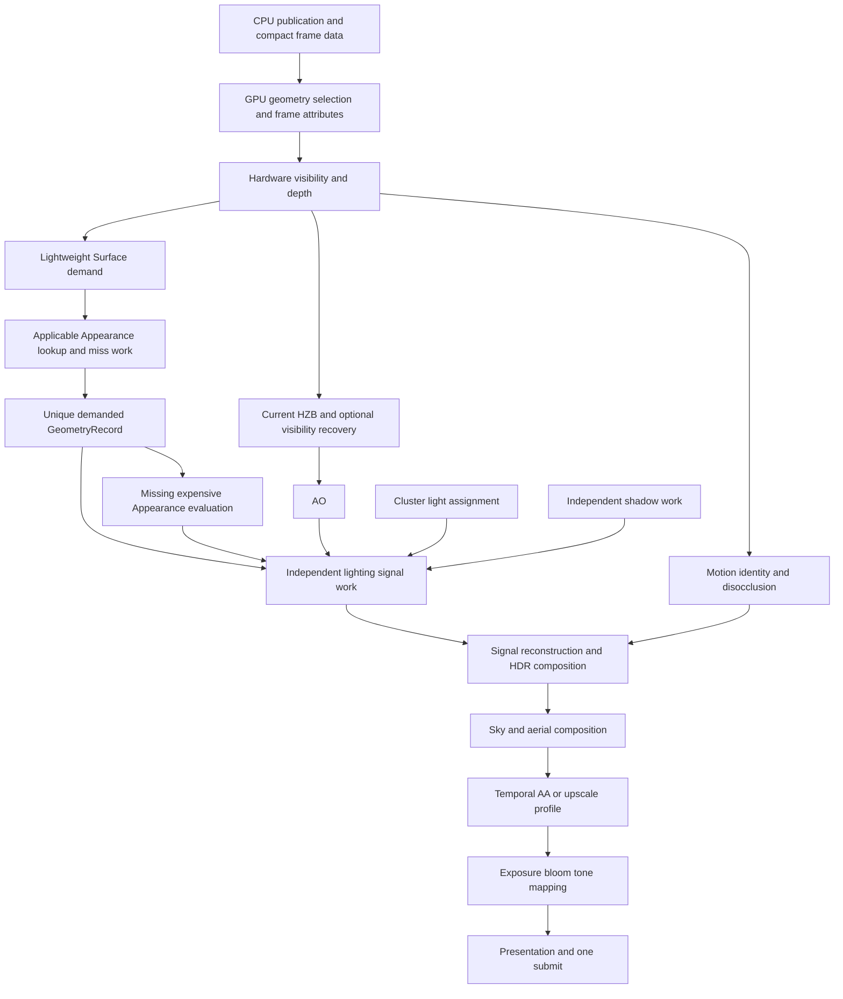

# EEngine 极致性能重构临时设计报告

日期：2026-10-05。源码快照：`09449d6d98b33a89b200bd71d5faaf8140149779`。

> **状态：已并入母稿，本文保留为历史记录。** 用户于 2026-10-05 采纳本文并追加三处调整，成果为
> [极致性能重建设计](../next-design/eengine-extreme-performance-rebuild-2026-10.md)（母稿）与
> [重建执行计划](../next-execution/eengine-extreme-performance-rebuild-execution-2026-10.md)。
> 母稿取代本文作为架构依据；本文保留当时的问题归因、成本账与完整论证过程，供追溯。

性质：独立分析与设计建议，不是已批准架构、执行计划或 Phase 延续。不纳入 `docs/next-design/`，不修改 workstream、AGENTS、生产代码或测试。此前讨论已停止；本文不把助手提案转成用户决定。本次未使用 skill。

## 1. 核心判断

**建议大规模重建执行底座和 Surface V3 的物理实现，保留需求驱动的核心方向。不能回退 V1/V2，也不能继续在当前证明、缓存、队列和 batch 链上补丁式优化。**

当前最严重的问题不是 PBR 太复杂，而是引擎为决定“可不可以省略计算”支付了远高于计算本身的成本。统一的复杂缓存协议、按像素膨胀的元数据、固定容量调度相互放大，CPU 和 GPU 同时受损。

重建对象应包含：帧编码与资源执行、Surface 前端与工作表示、材质发布与求值分类、Geometry 数据共享和遮挡接线。Lighting/Shadow 的极端复杂度必须重新设计；Temporal/Post/Atmosphere 的成熟数学实现优先复用，不因为允许大量删除就全部重写。

目标架构是：

```text
CPU：资产编译 / 资源发布 / 小量帧参数 / 有限执行类别
GPU：几何选择 / 可见性 / 按字段与信号生成需求 / 间接执行
数据：少量全屏必要事实 + 紧凑重工作 + 明确的消费产品
复用：便宜数据直接用，昂贵计算选择适合其域的复用机制
输出：独立信号重建与合成，不重新执行完整几何和 PBR
```

“极致性能”的含义应落实为完整成本账，而不是最大化 sparse、cache 或 indirect 的使用次数。

## 2. 依据与边界

### 2.1 本次核对

核对当前 HEAD、工作树、主要生产入口、Surface 调度、capacity、GeometryRecord ABI、Field/Signal Store ABI、FrameGraph 执行循环、Geometry descriptor、遮挡分支、direct-light fallback、shader 拼装方式及 FrameProgram。

生产源码没有未提交改动，与本会话独立审计的源码快照一致。已有 GPU 原始数据仍在 `.local/audit-2026-10-05/`。本轮重读了 `summary.json` 中的逐项统计，**没有重新运行 GPU benchmark，也没有执行新方案**。

现有独立审计：[源码与 GPU 性能审计](D:/code/EEngine/docs/reviews/eengine-independent-source-gpu-performance-audit-2026-10-05.md)。该报告用于索引已产生的源码证据与原始实测，不把其建议当作不可变设计。

正文区分：

- 源码事实：当前调用与资源实际存在。
- 实测：本会话先前在相同源码快照产生的结果。
- 设计建议：本文提出、尚未实现的替代结构。
- 待证明：缓存净收益、画质、具体 shader 占用率及新方案帧时。

### 2.2 性能基线不能过度解读

已有实验是 Windows、系统 GTX 1650 Ti、浏览器 NVIDIA Turing adapter、headless Chrome、Dungeon、1920×1080 内部与输出。VSM 关闭，jitter 关闭，固定曝光，使用当前 AO/FSR3/Bloom/Environment 路径。温度、频率、系统竞争没有完全隔离。

| 指标 | 静态远景 | 静态近景 |
|---|---:|---:|
| Surface GPU P50/P95，ms | 96.14 / 101.24 | 785.19 / 815.05 |
| 已记录 pass 的 GPU 时间线跨度 P50/P95，ms | 112.79 / 119.68 | 817.63 / 836.06 |
| profiler off 的 CPU render P50/P95，ms | 41.45 / 58.50 | 40.66 / 56.96 |
| 可见像素 census | 159,914 | 1,286,720 |
| GeometryRecord / 可见像素 | 约 99.953% | 约 99.965% |

GPU 数据使用 full per-pass timestamps，CPU 数据包含原生 API wrapper 插桩。它们是定位基线，不是无 profiling 生产性能承诺。GPU 时间线跨度不是包含一切图外工作和显示的完整帧时间；completion wait 也不是 GPU shader time。

移动相机的独立启动试验有 Surface P50 650.77 ms、FSR3 P50 14.35 ms，不能因启动条件不同推导“移动更快”。VSM 与大量有效 local lights 未在这些数值中覆盖。

近景Surface细分如下，均为先前同快照的full-timestamp诊断，29个有效样本，单位ms：

| 部分 | P50 | P95 |
|---|---:|---:|
| Coverage | 0.52 | 3.26 |
| Geometry Setup | 6.75 | 7.93 |
| Address | 5.83 | 6.59 |
| Field Lookup | 169.54 | 187.62 |
| Proof | 146.15 | 170.37 |
| Classifier | 178.52 | 199.96 |
| Signal Lookup | 108.00 | 121.12 |
| Demand | 62.26 | 76.62 |
| GeometryRecord | 11.93 | 13.95 |
| Appearance | 6.68 | 7.88 |
| Lighting | 10.09 | 12.65 |
| Store | 44.24 | 52.87 |
| Reconstruct | 6.49 | 7.85 |

各部分P50/P95不能相加当作整段同分位数；各帧波动与其他维护工作单独存在。这个表说明热点归属，不预测删除某阶段会线性减少相同毫秒。

### 2.3 Git 恢复的 V3 动机

历史记录只是解释为什么重构，不用于替代当前源码与测量：

| 提交 | 原本要消除的问题 |
|---|---|
| `15497ffe` | 每像素重复几何、材质和照明；分类不能先跑多个完整 PBR 再决定节省 |
| `182fd51e` | 中间 Probe/Worker/Resolve 没有在 Dungeon 有效减少样本；转向稳定地址、一次几何准备、材质编译和独立稀疏照明 |
| `13c536ca` | Appearance 每可见像素生成 task 并恢复几何，Lighting 再做全屏 prepare；提出唯一记录、lookup 前移、miss-only 和 cheap reconstruct |

历史 `e7296be9:OEngine/src/gpu/GpuAppearancePublication.ts::encodeDemand()` 的实际顺序确实是 demand → scatter → geometry inputs → cache stages。命中不能省掉已执行的前置几何恢复。

因此：当前 V3 实现的问题不能成为恢复旧执行模式的依据。原 V3 也并没有要求简单已有纹理再存一份等价闭包。

历史文件引用 Wicked Engine、The Forge、WeakKnight OSS 和 DOOM GPC 2025；本轮未重新核读这些上游完整实现，不宣称本文已移植它们，也不套用其性能收益。具体新算法实施前仍需核对可复现实现、许可证、revision 和本地边界。

## 3. Top 5 重构根因

### 3.1 固定容量把 Surface 变成数千命令的流水线

源码：[SurfaceOptimizationCapacity.ts](D:/code/EEngine/OEngine/src/gpu/SurfaceOptimizationCapacity.ts:121)、[SurfaceCellClassifierPass.ts](D:/code/EEngine/OEngine/src/render/surface/SurfaceCellClassifierPass.ts:230)、[SurfaceWorkRuntime.ts](D:/code/EEngine/OEngine/src/render/surface/SurfaceWorkRuntime.ts:197)。

当前 512 MiB envelope 将稳定 scratch 与一次 retired overlap 一起收费；1080p 最终仅容纳 700 tiles，固定展开 47 批。每批重新编码 setup、facts、lookup、proof、分类、demand、store 和重建。

实测整帧 2,689 个可执行节点、2,382 compute passes、2,394 dispatch；Surface 占 2,639 节点、2,263 compute passes。489 次 clear 清理 283.47 MiB，profiler off 仍有 965 次 buffer copy。

这是架构、调度和内存问题。扩大 binding limit 并不改变 47 批，因为首先限制的是自定义 retirement envelope。不能靠增加显存预算完成根治。

验证替代方案：同场景、同质量下同时比较命令数、实际工作、live/retired memory 和帧时。批数减少但 shader 成本不变，只完成了部分重构。

### 3.2 管理缓存比重算结果贵

源码：[Field Store ABI](D:/code/EEngine/OEngine/src/gpu/GpuSurfaceFieldStoreAbi.ts:6)、[Signal Store ABI](D:/code/EEngine/OEngine/src/gpu/GpuSurfaceSignalStoreAbi.ts:5)、`surface_field_lookup.ts`、`surface_signal_lookup.ts`、`surface_demand.ts`。

Field key 32 words、entry 256 B；Signal key 72 words、entry 352 B，结果 payload 只有 16 B。还要支付 probing、support、writer nomination、resolve、admission 和 publish。

近景 material lookup 命中率仅 2.24%，Field Lookup probes 约 1,029 万。近景 lookup、demand、store 都比 Appearance 求值本身贵。这是错误的统一成本模型，不只是 hash 实现差。

验证：对简单数据、昂贵动态材质和不同运动状态分别测完整净收益。尚无可信 cache OFF/recompute A/B，所以不能宣称所有复用都应删除。

### 3.3 证明和分类没有换来对应工作缩减

源码：`surface_cell_classify.ts`、`surface_cell_group_validation.ts`、`surface_cell_certificates.ts`、`GpuSurfaceCellTreeAbi.ts`。

15 field planes + 6 signal planes，重复 tree、geometry reduction、field dependency reduction、provider proof 和 prefix。共享内存声明上界 15,616 B/workgroup；tree 有效 lane 16→4→1。

已有路径计数：tree 路径显式 workgroup barriers 为 `27 + 4D`，direct-provider validation 另有 17 次；具体实际次数依分支与依赖变化。没有 ISA/register 数据，不能仅由 shared bytes 宣称准确 occupancy。

近景 Proof P50 146.15 ms，Classifier 178.52 ms；GeometryRecord 数几乎等于可见像素。这说明昂贵判定没有有效减少该产品产量，不代表所有光照信号都没有分享。

验证：测“每减少一份真实重计算需要多少管理成本”，同时保证合法 coarse 成功和局部拒绝两类用例存在。

### 3.4 FrameGraph 的 CPU 执行复杂度错误

源码：[FrameGraph.ts::executeCompiled](D:/code/EEngine/OEngine/src/framegraph/FrameGraph.ts:885)。

每个节点后扫描全部 resource registry，检查 `entry.last === pass`。当前约 2,689×1,603，431 万次 entry 判断/帧。

图编译和 dump 已有缓存，不能指控“每帧重编译”。问题是稳定编译结果的执行仍为 `O(nodes × resources)`。

验证：按 schedule index 预编译 release/acquire 列表后，执行成本应随引用和命令线性增长；再测真实 renderer，不只测空图。

### 3.5 Geometry 与未来效果没有统一正确的工作域

源码：[VirtualGeometrySceneSourceV1.ts](D:/code/EEngine/OEngine/src/assets/geometry-product/VirtualGeometrySceneSourceV1.ts:164)、[PackedVisibilityPass.ts](D:/code/EEngine/OEngine/src/render/passes/PackedVisibilityPass.ts:462)、`RendererCore.ts`、`SurfaceLightingWorkPass.ts`、VSM caster shaders。

Product 描述硬编码 hierarchy depth 64，编码 65 hierarchy passes；Product previous HZB 被设为 null。普通相机变化又清掉 HZB。Local-light cluster overflow 会退化为每 shading sample 遍历全部 active lights。

Shadow 的 caster domain 不能天然等同 camera-visible meshlets；GI/reflection 也不能把屏幕可见集合当世界完整查询集合。

Geometry 在本例不是最大 GPU 热点，但继续堆新 AAA 效果会放大这些基础错误。验证必须包含遮挡、off-camera caster、大灯数和真实几何深度。

## 4. 重建原则：把性能写入执行结构

1. 一个产品一个写入 owner，消费者只有明确读取接口。
2. CPU 不维护本帧 GPU workload 细节，不读回本帧数量后再决定执行。
3. 全屏阶段仅保留必要事实、轻量需求判定和最终输出；所有全屏工作必须有真实消费者。
4. 判定成本有上限，不因字段数量增加就复制一套完整几何与证明系统。
5. 复用必须减小完整成本，命中率和 invocation 数不是独立目标。
6. 稳定资源与参数绑定在发布/布局确定时准备；帧内不循环请求万能 cache 来维持稳定绑定。
7. 控制 plane 与数据 plane 分开：少量 counters/args，紧凑 payload，不让状态协议占大部分流量。
8. 各系统为自己的真实工作付费；阴影、GI、反射不继承 camera shading 的错误容量假设。
9. 调试观察独立于生产性能路径，正常配置不自动启用细分 timestamps 和统计 atomics。
10. 一个生产 renderer，一次渲染帧 submit。独立资产上传和诊断宿主明确区分，不为修补帧内结果添加第二 submit。

这些原则限制实现自由度，但不制造新 proof 框架、万能队列系统或执行许可层。

## 5. 目标整体架构与 owner

以下名字是责任描述，不要求逐项新建类或框架。

| 边界 | 负责什么 | 明确不负责什么 |
|---|---|---|
| Asset compiler | Geometry 页/层级、材质分析、静态产品、过滤信息与稳定地址映射 | 长期 GPU residency 和本帧可见性 |
| Scene publication | 稳定身份、实例/材质/灯光变更与 GPU 数据发布 | 每个 tile 的工作状态 |
| Geometry residency | 压缩页、必要展开属性、异步请求/上传、合法 LOD 表示 | Surface cache、全屏证明 |
| Frame runtime | 有限执行拓扑、资源生命期、命令 scope 与唯一 submit | 重新判断材质/光照全部语义 |
| Visibility/geometry work | LOD/culling、raster work、可见 key、depth、所需帧几何 | 材质和光照结果 |
| Material publication | 编译程序、输入依赖、常量/纹理/静态产品、昂贵动态更新计划 | 世界空间照明有效性 |
| Surface work | 按字段/信号需求、共享模式、GeometryRecord union、consumer mapping | 世界所有 effects 的万能任务协调 |
| GeometryRecord producer | 权威几何插值与需要的派生量 | 另建一套独立缓存/失效语义 |
| Lighting providers | 直接光、IBL/反射/GI 各自任务、结果、更新与有效性 | 自行从 Visibility 恢复完整几何 |
| Shadow | light-space需求、caster work、物理页和 shadow visibility | 借 camera-visible list 当完整caster集合 |
| Temporal facts | motion、身份、显露、变化事实 | 替每个 provider 再管理一份同义 scene state |
| Reconstruction/post | 分信号结果重建、合成、HDR、显示处理 | 重跑完整材质或完整 PBR |

Renderer 只装配以上边界。继续把方法拆成多个文件但保留同一个 God owner 和重复状态，不算架构重构。

## 6. 一帧的目标执行流程



真实顺序由依赖确定：shadow/cluster 必须在其消费者之前，environment dirty 更新进入同一帧 encoder；静态产品发布不要求每帧重算。不能为了图看起来整齐强迫所有分支串行。

| 阶段 | CPU 热路径 | GPU 工作 | 必要边界 |
|---|---|---|---|
| Frame begin | 合并已完成异步发布；写小量参数 | 小 counters/args 初始化 | 一次明确的帧资源角色选择 |
| Geometry | 访问已准备 profile | 层级选择、裁剪、缺页请求、帧属性 | 层级轮次之间独立 dispatch |
| Visibility | 有限 raster partition 命令 | indirect draw、coverage/深度 | compute→render |
| HZB/recovery | 固定 pyramid recipe | reduction、可选保守恢复 | mip依赖与render/compute切换 |
| Temporal facts | 绑定历史角色 | motion/identity/change | 当前 visibility 与历史输入明确 |
| Surface front | 编码有限类别 | address、rate、需求与 miss compact | 发布任务后再消费 |
| Geometry/Appearance | 固定 family/profile | geometry union 与适用 material miss | Record/field生产后消费 |
| Lighting | 有限 provider 类别 | 信号primary/更新 | cluster/shadow/field输入已发布 |
| Reconstruction | 小量参数 | 分信号重建和合成 | 输出写域独占 |
| Post/present | 已准备 binding | AO、temporal、bloom、tone mapping等 | 按效果依赖，不为换pipeline人为切pass |
| Submit/commit | 一次submit，交换逻辑角色 | 不做同步CPU wait | 完成序号仅服务退休/readback |

### 6.1 命令规模

建议将命令数量模型改为：

```text
Cframe = Cgeometry(actual representation depth)
       + Csurface(finite execution families, physical segments)
       + Cproviders(enabled features)
       + Cpyramids(mip counts)
```

不能继续是 `全屏最大 batch 数 × 全部 Surface 阶段`。但也不能承诺命令完全与分辨率无关：设备 binding、dispatch dimension、资源分片是真实限制。

作为首轮工程估算，可按基础配置 Surface 约 10–20 个图节点、20–50 次 dispatch、数个 compute scope 做资源表与命令设计；完整基础帧先按约 100–200 次 dispatch 检查可行性。**这些是待计算的估算，不是已证明可达或验收阈值**，不同材质 profile、阴影/GI 和实际 depth 会改变它们。

需要独立列每个命令的 producer、consumer、输入、输出、容量与为何必须存在。不能把 2,000 次 hidden dispatch 放进一个图节点就宣称调度改善。

### 6.2 WebGPU 的真实限制

- Indirect dispatch/draw 不会替 CPU 选择 pipeline/bind group，也不是 D3D12 ExecuteIndirect。
- CPU 编码少量固定类别、GPU 参数为零，是正常做法；有必要的空命令不等于架构失败。
- 不以长期循环等待的 persistent workgroup 实现跨工作组全局同步。没有调度/前进保证时可能死锁。
- 不依赖硬件 Mesh Shader、通用 bindless、硬件 VRS、固定 subgroup 宽度作为 baseline。
- 同一 compute pass 可包含多个 pipeline/dispatch。依赖、usage scope 与 binding 必须合法；一个 dispatch 不能同时把同一范围当冲突的 writable storage 和 indirect/其他只读输入使用。
- 后续 dispatch 消费前序结果时，必须切到合法 bindings；workgroup barrier 不能代替跨 dispatch 的算法依赖。
- `queue.writeBuffer` 的多个写入不会自动成为同一未提交 command buffer 内各阶段的参数快照。不同阶段参数用独立范围、动态 offset 或 GPU 参数产品，不用一个反复覆盖的 uniform 假装阶段局部值。

## 7. FrameGraph：保留价值，替换错误执行器

### 7.1 应保留的职责

资源 producer/consumer、依赖排序、未消费节点裁剪、transient 生命周期、历史角色、合法 alias 计划。这些对未来多个 effect 的组合有价值。

### 7.2 应删除的执行成本

逐节点全 registry scan、相同物理资源重复 import 的身份膨胀、为了代码分层建立小节点、图回调重复生成参数数组与 binding tuple。

编译结果直接包含：

```text
executionScopes[]
acquireAtScope[]
releaseAtScope[]
resolvedResourceSlots[]
historyBindingRoles[]
```

每帧执行只处理当前 scope 的引用和命令，复杂度接近 `O(commands + actual references + lifetime events)`。同物理 import 的身份归其 owner；不同逻辑版本仍可表达依赖，不能为去重抹掉写入先后。

Alias 仅发生在兼容 descriptor/usage、互不重叠生命期的 transient 资源。跨帧历史和持久页不自动 alias；不把物理 alias 冒充 WebGPU 不支持的任意 heap/suballocation 能力。

### 7.3 分开、同 pass、融合的判据

| 情况 | 建议 |
|---|---|
| render/compute、copy、clear encoder 操作 | 保留必要 pass/encoder 边界 |
| 跨工作组 prefix/compact、producer后消费 | 独立 dispatch；合法时可在同一compute pass |
| 只更换 pipeline 或 bind group | 不自动结束 pass |
| 同局部输入、无需全局发布的小运算 | 评估 shader融合，避免多次写回 |
| 融合使VGPR/shared/liveness大幅增加 | 分开，比较总时间和带宽 |
| args已由GPU写入 | 直接消费合法INDIRECT buffer，不经CPUreadback |

不建立万能“pass fusion optimizer”；有限且稳定的帧 recipe 更容易审查实际 GPU 执行。

## 8. Surface V3：重建前端，而非回退整套 full-rate PBR

### 8.1 正确成本模型

```text
Tsurface = Tlight_facts(P)
         + Tactive_demand(tiles, demanded fields/signals)
         + Tapplicable_lookup(reuse requests)
         + Tgeometry(G)
         + Tappearance(Mmiss)
         + Tlighting(Ldiffuse, Lspecular, Lcoat, ...)
         + Treconstruct(P)
         + Tmemory_and_schedule
```

`G` 可能在真实高频区域接近 `P`；高频normal/specular并不会神奇地让几何消失。应独立减少其他低频字段与信号，不能强制每个指标都 sparse。

Lookup前移不意味着零几何信息就能生成地址。允许一次轻量插值获得地址/footprint，但必须与完整normal/tangent/basis/material准备分开计账，不能把重工作搬到 Address 后宣布已消除。

### 8.2 物理表示：模式描述代替逐 plane 密集账本

建议起点仍可使用 8×8 tile，它是局部组织选择，不是不可更改的合同：

- Full-rate：tile descriptor + 需求mask；样本位置和索引隐式生成，避免64条通用task/ref。
- Uniform/coarse：代表位置、rate、目标信号mask；常规映射由坐标推导。
- Mixed：coverage bitmask、有限representative与exception列表；仅特殊部分产生显式mapping。
- 不同字段/信号保持逻辑独立；具有相同需求的执行profile可以共享遍历，不要求复制21份物理元数据。

初始ABI候选：tile header 32–64 B、exception reference 4–8 B。它们是设计探索范围，未完成对全部坐标、精度、版本和容量的打包证明。

例如1080p共有32,400个8×8 tile，64 B descriptor是约1.98 MiB；一张每像素u32映射是7.91 MiB，而21张就是约166.1 MiB。**这是布局算术，不代表新方案必须恰好用这些尺寸或已经节省该显存。**

逻辑独立不等于物理复制。需要规范的full-rate indexing、mixed compact range和每个consumer的索引规则后再确定ABI。

### 8.3 分类：共享域、速率与近似分开

三件事不要继续打包成通用proof：

1. 合法域：对象/材质/侧面、LOD映射、有效资源、接缝与不连续性。
2. 更新事实：参数、纹理、光源、阴影、视向、显露与历史年龄。
3. 质量选择：某个信号在什么空间/时间间隔下满足约定误差。

前两者来源于权威producer和实际依赖；第三者允许采用经验证的近似模型。没有理由每plane都重新证明一遍共同身份与几何边界。

建议常规准入使用coverage/depth、不连续mask、材质发布时的字段变化信息、normal/roughness和信号风险。低频diffuse可更粗，镜面和coat按粗糙度、法线、视向与遮挡变化局部提高率。

尖锐高光、UV接缝、薄几何、显露边缘必须触发适合的刷新/细率，不采用单一历史低contrast作为当前帧安全证明。不把ORM/normal-map/coat类型整体排除共享。

变化信息缺失时，先保证该字段或局部信号完整求值，同时补全正常材质发布元数据；不能把“未知永远fine”作为架构完成状态，也不能用稀疏四点采样假装不存在未采样高频细节。

共享跨primitive仅在发布了连续surface mapping、合法过滤域时成立；跨LOD映射无依据则局部拒绝，不能将不同primitive简单合并为同material。

### 8.4 Fixed tree / prefix / geometry setup

**建议替换常规21-plane固定tree作为统一分类主机制。** 保留必要的几何与质量判据，不保留一遍遍重复tree和依赖reduction的执行形式。复杂程序的局部bounds可以继续存在，但按其真实需求生成。

布尔集合rank优先评估两个u32 mask与`countOneBits`。构建mask仍需要合法原子/同步，不能依赖默认64-lane subgroup。多值prefix、跨tile scan不能被一个ballot替代。

混合tile的64元素bitonic setup目前有42次sorting barriers，加prefix与外围达58次显式barrier；uniform已有快路径，不能说每tile都支付sorting。建议直接依赖现成帧几何数据，少量winner先局部合并，再按真正唯一primitive生成setup。高microtriangle场景下，重用率低时直接生产必要记录可能更便宜。

同帧memo是否保留，按重复winner和microtriangle两种负载实测。不要把hash memo换成另一个更复杂的memo来满足“唯一准备”。允许producer内局部重算少量廉价值，只禁止昂贵独立authority与大范围重复工作。

### 8.5 解决“分类需要材质、材质又需要分类”的循环

不能要求normal-map实际结果、精确roughness和完整光照先全部算完，才决定省掉它们。目标采用分层需求：

1. 用visibility、depth与发布元数据确定coverage、合法域和初始geometry输入需求。
2. 对分类真正需要的便宜guide，只采样必要源通道或已发布产品；产生可被后续消费者直接使用的结果，不采完再丢弃重采。
3. Appearance缺失字段独立决定其求值工作；Lighting在已有guide/field之上选择各信号primary与history更新。
4. 如果某个geometry输入只因后续guide才确定，由同一producer追加该记录未生产的部分，或在初始union中为该明确profile计入它。不能另开一个独立几何恢复owner。

这意味着必要时存在早期薄记录与后续按需补全两个dispatch，“唯一GeometryRecord”不要求所有字段必须在一个kernel里一次写完。每个字段的写域和发布点固定，禁止消费者自行补写共享record。

涉及昂贵字段时，分类采用cook/发布时有效的variation/过滤信息或明确的局部细率，不为取得guide先执行整个昂贵子图。若guide本身成为大热点，应降低判定复杂度或改变该字段的共享算法；不能把guide成本从Surface账中拿走。

缓存命中跳过的只能是它实际覆盖的heavy work。几何还被当前Lighting、motion、SSR guide需求使用时，仍需生产；不能把“材质命中”误解为“所有几何可跳过”。

## 9. GeometryRecord：唯一authority不等于万能大record

当前hot为128 B，cold最大528 B；cold确实按需求append，但hot/cold容量仍按worst-case预留。当前字段包含position、normal、tangent、view、geometric、identity、metrics与cold header。

建议把“唯一产品”解释为唯一生产语义和需求union，而不是每个primary永久存全部信息：

- Lighting hot：position/depth、所需normal、材料/实例索引、必要几何模式。
- Normal-map/anisotropy需要的tangent或其他量按真实consumer选择。
- Appearance cold：UV、导数、局部/世界输入等按程序依赖append；不要只有UV需求也计算完整三套basis。
- View direction可由camera与position在lighting样本处计算，无需所有记录保存一份vec4。
- Temporal必要身份/运动由权威事实产品提供，不在每个record复制所有scene版本。

可先探索64 B hot：三组vec4几何值与一组u32 references；geometric/shading normal同时需要、导数、tangent精度与flags如何表达仍须做完整consumer layout，不把64 B作为硬性裁剪目标。

不同profile允许额外stream，不再定义完整21-plane最坏closure为每个target的常规stride。压缩法线或half字段必须单独验证画质；不是为了瘦ABI静默降低position/UV精度。

Raster、Surface、Shadow共用geometry residency的源属性和必要frame变换。空间不同的派生结果可以不同，不能为了统一强迫shadow存camera clip position，也不能继续各自解码一遍相同静态顶点。

## 10. 材质：编译为四种真实成本类别

| 类别 | 生产处理 | 每帧处理 |
|---|---|---|
| 常量、廉价算术、已有简单纹理 | 常量折叠、死通道删除、等价采样合并、确定绑定 | 直接消费；不缓存等价16B结果 |
| 昂贵静态、局部、视向无关子图 | 资产阶段生成有过滤合同的Appearance产品 | 合法地址/footprint采样 |
| 昂贵动态、局部、可重复消费子图 | 发布稳定域、依赖与更新程序 | demand去重、有效产品lookup、miss-only更新 |
| 视向/光照/非局部项 | 专用求值或对应provider | 按该信号的真实需求执行 |

这是同一编译语义的分类，不建立四套无关系材质系统。程序按有限feature family/resource profile组织，不按每个材质实例生成不同PSO，也不回到一个遍历全部角色的巨型shader。

视向不变不代表任意bake都等价：非线性计算与纹理过滤不交换，多UV、顶点色、变形和动态参数需要真实依赖。材质产品应附过滤/采样要求，不能以“静态”抹掉语义。

Coat/specular的能量耦合留在合成合同；metallic为零不意味着可删除介电镜面。SSR/SSGI需要的normal/roughness具有独立精度需求，不能无条件复用低频lighting结果。

## 11. Cache / Store：从万能协议转为适合数据域的复用

### 11.1 Appearance建议

对于有稳定chart/page映射的昂贵产品，优先虚拟页/texel域寻址：已发布对象或材质域、chart、mip/footprint、动态内容版本；逻辑页映射到物理数据。使用已存在的纹理/Appearance residency owner，不新增万能cache管理器。

对不能形成稳定映射的动态程序，允许小型精确key cache，但只对该程序启用。重用域由实际输入依赖确定，不自动带上instance/camera/light等无关版本。

从宽key变小的正确方法是**改变依赖表达和地址域**：把不变的完整描述在发布时赋予无歧义domain ID，GPU读取权威版本，地址保留影响结果的变量。不是截断key，也不是以hash碰撞概率替代身份正确性。

GPU slot重用、ID回绕、资源退休仍需有明确寿命。若生成新的intern表需要大量每帧管理，它也要计入成本，不得成为下一个proof系统。

### 11.2 Lighting建议

**建议替换当前72-word通用SignalStore作为所有光照复用的默认机制。**

屏幕视向相关的direct/specular/coat首先使用各自的历史图/primary stream、reprojection、局部依赖变化和置信度；静态material身份不足以保证lighting有效。世界/表面域irradiance或reflection cache由其provider管理，并声明方向需求与更新时间。

这减少随pixel生成完整通用key的必要性，但不保证免费：motion、history、刷新判定和带宽都计入lighting/temporal。历史复用不是错误状态恢复，也不是重复平滑层。

不要拿一个RGB irradiance假装可精确覆盖任意法线/BSDF。视向相关diffuse、镜面、coat的模型与能量关系必须保留。

### 11.3 净收益判据

```text
hit_probability × avoided_compute
>
address + lookup + validity + miss_management + store
+ extra_bandwidth + initialization + schedule + lifetime
```

按cold/static/moving、便宜/昂贵材质分别验证。发布时决定默认策略，不在每tile动态做另一个复杂成本预测器。未知收益机制不得普遍进入所有材质路径。

## 12. Geometry / Visibility / LOD

### 12.1 应立即修正

- hierarchy max depth来自cook/package实际数据，删除硬编码64；有上限时明确描述合法输入和超出行为。
- 只编码真实表示最大深度的必要轮次。GPU empty frontier为零仍可能留下少量命令，这是WebGPU限制，不需伪persistent循环。
- Product路径接入真正的保守遮挡策略，避免建了HZB却没有给几何选择使用。
- 相机普通运动不等于camera cut。上一帧HZB的重投影和风险条件需与当前视角恢复相配套；没有可靠依据不能直接复用旧深度。

推荐两阶段保守遮挡思路：稳定/已验证可见域先选择和raster，生成当前HZB；对需要当前证据的候选再检查/恢复。具体算法选择必须核读完整实现，不把缺少恢复的单阶段伪装成双阶段。

### 12.2 LOD与Surface成本联合观察

几何需要增加可靠的selected triangles、padded vertices、投影三角面积、overdraw、LOD/SSE与遮挡拒绝histogram。本例meshlet只增约19.4%，pixel覆盖增约8倍，Surface前端是主因；其他场景仍可能被microtriangles拖垮。

不靠增大SSE或删小三角形掩盖Surface问题。几何质量与成本可形成独立profile，LOD连续性、silhouette、crack与surface mapping需要明确验证。

### 12.3 几何内存

raw page为256 KiB，expanded resident attributes占额外slots。当前4×128 MiB banks不应因名字叫virtual而默认合理。建议按adapter limits和实际resident需求选择物理bank规模；扩容发生在发布时，不在shader内增加任意bank选择协议。

静态属性按消费拆分；position、normal、tangent、UV的布局由raster/surface实际访问决定。frame attributes当前96 B/vertex，不应把shadow、raster与material所有潜在需求都常驻成每vertex大record。

## 13. Lighting / Shadow / Environment

### 13.1 Clustered lighting

当前assignment每cluster扫全部active lights，overflow sample又扫全active list。应重建为按light bounds影响范围的分配，采用count → prefix → fill，或明确分级列表。

对于真正dense-light区域，任务可分light ranges归约，或采用有质量合同的专用dense-light算法；不能一个overflow bit就让百万samples各自遍历世界全部灯。

保留所有有效光照贡献。池不足不允许静默截断；分段列表/容量扩展/明确的可呈现场景限制必须在发布与producer边界决定。任意数量灯的精确照明不存在固定成本保证，应明说真实输入规模的成本。

Direct diffuse、specular、coat可逻辑独立，但共同light traversal/visibility若能复用，应在合法相同采样域内共享，避免因为信号分开又把同一shadow query支付三次。融合会增加register时单独比较。

### 13.2 Shadow

VSM保留需求、分配、物理页、失效和sampling语义，替换workCapacity级dispatch与`meshlet × dirtyPages`无差别关联。使用light-space page binning和更紧bounds，按dirty page生成caster ranges。

Caster候选来自相关世界几何/光源影响域，不能仅用camera visible list。已有directional支持不代表point/spot shadow完成；当前sparse direct helper的point/spot在相关路径返回1，需要在功能账中明列。

屏幕信号的shadow变化应接收相关页/区域版本，不因任意无关shadow页变化全屏刷新，也不能忽略移动遮光体。

### 13.3 Environment/Atmosphere

复用现有LUT与dirty/publication机制。初始生成、sun/参数变更和每帧sky/aerial分开记账。当前GPU远低于Surface，不做无依据算法重写。

图外environment producer要纳入真实资源版本和执行依赖；不因同encoder就省略source与consumer的产品关系。

### 13.4 透明、alpha coverage与非标准材质

Opaque Visibility Buffer只记录winner，不能覆盖多层透明。当前存在`packed_transparent_oit.ts`等实现；本轮未重新做透明画质与时间测试，不据此宣称完整AAA透明已验收。

目标保留单一renderer中的独立透明执行类别，复用材质编译、BRDF、cluster与shadow数学，使用适合透明层的forward/OIT输出。它是同一帧中的必要算法分支，不是旧新renderer兼容路径。

Alpha-test的coverage必须在visibility/depth阶段成立；不能先用错误opaque winner再由Surface后补。Coverage材质子图单独编译为所需最小输入，保持纹理LOD/alpha cutoff与最终材质一致。

折射、头发、粒子、透射等不能强塞通用opaque sparse域。定义具体feature/profile与数据需求；当前未完整实现的能力列为新功能，不通过空provider或恒定返回值获得“AAA完成”。

## 14. Temporal / Reconstruction / Post

TemporalFacts只生产一次。Camera cut清屏幕域history，不自动清静态Appearance；普通相机运动由motion/reprojection处理。形变、LOD、显露与内容变化必须传递给实际相关consumer。

稀疏lighting history负责信号更新和重建；FSR3/output temporal负责最终图像。不能两个系统各自无限平滑、靠输出clamp隐藏缺失工作。

Reconstruct允许坐标映射、depth/normal等guide检查、空间/时间滤波、能量与曝光合成；不重读source geometry恢复完整三顶点，不重跑材质图或完整IBL/PBR。

Normal/roughness/motion等未来consumer字段由需要它们的产品producer供给，不经最终HDR反推，也不为了SSGI预存当前无人消费的完整大GBuffer。

原生1080p与upscale分profile报告。原生可使用temporal AA；是否继续FSR3 1:1路径或选更轻native temporal，需要画质/成本对照，不能简单关闭它制造性能改善。

当前Temporal identity双rgba32uint约63.28 MiB，FSR相关主要history约75.15 MiB。这值得在P0后梳理，但现阶段不靠丢身份、关history满足性能目标。

AO、Bloom和pyramid的dispatch/参数绑定纳入执行底座治理。FSR luma pyramid当前为多pass，不根据“SPD”名称宣称单pass已实现。SSR/TAA/NSS源文件存在不代表当前运行，也不应算入本例性能账。

## 15. 资源、容量与 CPU 编码

### 15.1 统一预算，不建立统一资源God owner

每个owner保留资源责任；公共层只记录实际active、cached、history、retired、staging bytes，并给出设备budget/profile。不能把各局部ceiling相加当当前live memory，也不能漏算active texture。

稳定scratch在同队列有序工作间复用，不需要每帧双倍预留；历史与readback独立ring。Resize短暂重叠单独预算，必要时限制重复resize积累或等已提交工作释放，而不是永久减小稳态吞吐。

持久页驻留优先级由实际domain负责；CPU可读取延迟feedback驱动未来IO，不使用本帧readback控制visible work。

### 15.2 Worst case 与正常 sparse

预留worst-case不自动错误，问题是预留、清理、写入和dispatch都按worst-case支付。四个数必须分别报告。

高频full-rate工作使用隐式索引与有限完整容量，不为21个plane都预留worst-case task；mixed/adaptive只append真实exception。可选cache admission失败时不缓存，本帧需要的结果仍完整求值。

页池、queue和work consumer必须有足够可执行的完整工作表示。不能把overflow反复归入fallback/recovery owner，在同一帧增补大量状态和submit。

### 15.3 上传、绑定、pipeline

已有测量每帧683次upload write但仅约31 KiB，说明问题是碎片化命令而非纯上传带宽。按frame/phase打包参数，固定offset表由准备阶段确定。

稳定pipeline和bind group在publication/layout变化时建立。资源不变时直接使用准备好的group；不在每dispatch构造数组、遍历tuple cache再返回同一group。

现有`GpuBindGroupResourceCache`按真实resource identity工作，并非所有请求都创建native group。删除重复request需要调整调用者，不应无依据把该cache称为泄漏。它可保留在真正动态资源组合的准备边界。

Pipeline按有限feature/profile异步预热；避免hot path同步首次编译。不要添加第三层cache解决前两层互相不知道状态的问题。Ready产品发布后再执行；资源编译失败直接暴露。

### 15.4 Texture与上传路径

Source texture只由一个residency owner发布。材质程序持有必要的view/sampler/profile与内容版本，不复制一套权威驻留状态。Mip可采样范围变化与内容变化应区分，但采样结果受其影响的字段必须正确失效。

对批量小更新，CPU聚合连续数据并一次或少量上传；GPU生成的控制数据直接留在GPU。大资产IO/解压可以异步CPU或GPU处理，其staging峰值、上传延迟、resident展开成本都进入全局账，不能只算最终texture尺寸。

未来VT应复用纹理发布边界和延迟feedback，独立处理页请求与过滤边缘；不要把所有source texture先搬入新的通用Appearance Atlas，再为Atlas另建同义residency。

### 15.5 稀疏产品的内存可行性计算

以2,073,600 pixels为例，下表仅作新布局的尺寸敏感性分析，不是已分配资源或已确定容量：

| 项目 | 假设 | 计算结果 |
|---|---|---:|
| Tile描述 | 32,400 × 64 B | 1.98 MiB |
| 显式pixel引用上界 | P × 4 B，仅作dense对照 | 7.91 MiB |
| Geometry hot | G=25%P，64 B/record | 31.64 MiB |
| Geometry hot最坏 | G=P，64 B/record | 126.56 MiB |
| 单信号当前值 | L=25%P，8 B/value | 3.96 MiB |
| 单信号双全屏history | 2 × P × 8 B | 31.64 MiB |

因此不能轻率承诺“全屏新scratch一定低于128 MiB”或“每信号一个全屏history一定便宜”。多个stream要分binding，cold/history另计；尽可能以该信号的实际rate/domain存储，保证重建所需定位信息完整。

工作分片应由这些真实尺寸与limits算出，而不是先定512 MiB再反推一套极小batch。Full-rate极端仍可能需要少量物理分片；关键是避免每个分片重复全部昂贵前端与状态流程。

## 16. 不做防御性编程：责任前移，热路径简化

用户要求应落实为：删除重复检查、猜测性恢复、默认值修补、备用owner、吞异常和测试专用生产fallback。

| 边界 | 应做的事 |
|---|---|
| Device/profile创建 | 一次协商limits/features，确定合法资源布局 |
| Asset/cook/publication | 校验结构、依赖、程序与稳定domain；发布可消费产品 |
| GPU task producer | 正确reservation/计数/索引、工作覆盖和写域划分 |
| Hot consumer | 消费已发布输入；只判断该算法真正动态的有效性 |
| Debug/validation | 额外guards、统计、错误路径复现；与生产profile分离 |

Shader数据争用、动态驻留/历史变化是算法事实，不是可以删除的“防御性成本”。把整个正确性协议删掉后依赖“通常不会撞”不是极致性能设计。

Owner存在一个状态事实即可，避免Renderer、FrameGraph、cache与consumer各保存generation/recovery判断。不可缓存、无history、未知variation等是明确输入状态，不在生产热路径用异常兜底。

## 17. 代码组织与 WGSL

建议以真实数据产品拆模块，而不是“一函数一pass”。先稳定producer/consumer和ABI，再拆文件。

- `RendererCore`只保留composition与frame入口，scene发布、history、streaming、VSM由实际owner负责。
- `SurfaceWorkRuntime`当前大规模接线与批次协议直接替换，不保留adapter让旧协调逻辑继续指挥新产品。
- `HierarchicalWorkGenerator`按representation准备、frontier执行和资源产品分离，删除伪maxDepth与无消费者状态。
- `GpuRenderWorld`保留scene GPU publication语义，拆掉同义patch/state的多处authority；不另建一个同步镜像世界。

WGSL使用显式共享math模块、固定binding接口、编译时feature生成。替换通过marker slicing、omit函数、全局`replaceAll`改变binding/变量语义的生成器。

不需要立即建设完整通用WGSL编译器。有限模板与小型明确IR即可表达材质图；ABI定义生成TS/WGSL offsets/structs，减少隐式magic index。生成工具本身不管理运行时scene状态。

特别是`lighting_direct.ts::createProductionSparseDirectLightingWgsl()`，目前从大shader截取和删除函数再replace变量。建议提取真正共享BRDF/light/shadow库，由不同入口显式组合，避免同名替换改变隐藏分支。

## 18. DELETE / REPLACE / KEEP 清单

下面是建议退休的责任范围，不是立即执行文件删除列表；实际源码文件可能含需要保留的数学片段，替换consumer后才能删除。

| 处理 | 对象 | 理由 |
|---|---|---|
| REPLACE | `SurfaceOptimizationCapacity`当前固定envelope/batch模型 | 将退休峰值与稳态工作耦合，放大命令数 |
| REPLACE | `SurfaceCellClassifierPass`全批展开与21-plane通用判定路径 | 管理成本大于重算；改为轻量profile/模式/需求 |
| REPLACE | `SurfaceWorkRuntime`当前batch协调链 | 新产品与执行scope直接接线，取消旧协议桥梁 |
| DELETE | 简单常量/已有纹理的等价结果Store路径 | 直接消费更适合该类别 |
| REPLACE | 72-word `SignalStore`统一跨帧复用默认策略 | 使用各signal实际domain的history/provider reuse |
| DELETE | 已发布不变量的每帧全量重复证明 | 发布时保证，变更时更新 |
| DELETE | 多consumer重复几何恢复、无实际消费者的setup/metadata | 只保留需要的数据产品 |
| REPLACE | 512B setup + memo作为统一前置路径 | 按真实primitive/consumer需求生成，memo需净收益 |
| DELETE | FrameGraph逐节点全资源扫描 | 编译lifetime事件列表 |
| DELETE | Product固定hierarchy depth64 | 来自真实representation metadata |
| REPLACE | cluster overflow全灯sample循环与VSM全交叉扫描 | 分级/分段light域和page-caster bins |
| REPLACE | shader marker/replace驱动语义拼装 | 明确库、入口、生成ABI |
| DELETE | 仅绑定旧文件名/阶段/tree尺寸的退休测试 | 测新语义和输出，Git保存历史 |
| DELETE | 与退休机制绑定的Phase状态页、claim promotion模型 | 不再作为新设计或实施门禁 |
| KEEP | 有独立依据的插值、BRDF、过滤、radiometry数学 | 重构执行方式不自动推翻数学 |
| KEEP | 异步residency、必要pin/generation/retirement | 对应实际GPU资源寿命 |
| KEEP | HZB、AO、Atmosphere、FSR的有用实现 | 有真实consumer，不因局部缺口整块删除 |
| KEEP | 完整工作覆盖、writer互斥、有效身份断言 | 是必要语义，不是旧结构兼容 |

旧文档与测试的删除应与新责任映射一起完成，不把仍有效的质量/覆盖断言一并删掉制造绿色结果。

## 19. 验证体系：证明输出与成本，不管理声明

### 19.1 当前体系的实际情况

`tools/vibe.mjs`已有轻量module模式，日常检查不自动加载acceptance模型。不能把所有claim/evidence成本说成每次开发都强制执行。

但`tools/vibe-acceptance.mjs`、`project/claims/`、registry/evidence/status模型维护了较大的关联结构。它们能记录证据，不能替代真实production GPU consumer与独立预期。

旧测试有两类混合：`surface-fixed-tree-phase4.test.mjs`既包含coverage语义，也锁定tree尺寸/CPU reference结构；`surface-store-writer-protocol.test.mjs`具有区分原writer缺陷的独立枚举价值。前者不能整体照搬，后者不能仅因旧文件名而删除语义。

### 19.2 建议的新体系

| 层 | 最小内容 | 证明什么 |
|---|---|---|
| Build | typecheck、build、真实生成WGSL编译 | 产品可执行与接口合法 |
| Semantic/GPU | 独立数学预期、当前production entry、覆盖/互斥/失效fixture | 算法与接线正确 |
| Quality | 固定相机与连续轨迹、full-rate独立reference、局部差异和人工核看 | 近似满足画质预算 |
| Cost | 无细分profiling帧时、coarse/stage诊断、命令和bytes/work counters | 优化真的减总成本 |

用直接runner与简单固定fixture描述即可，不重建一套claim级别、promotion、workstream退出与manifest继承系统。

独立reference不是第二生产renderer。可在独立测试宿主、固定Git checkout或oracle实现运行；新旧对照不在production挂兼容开关。

### 19.3 最小场景矩阵

- 低/高可见覆盖；near/far；静止/持续移动/新显露。
- 简单常量和源纹理；昂贵静态与动态材质；normal-map、锐利specular和coat。
- UV接缝、跨primitive连续面、LOD变化、形变、texture/page residency变化。
- 有效非零local lights、超过cluster局部阈值、global列表压力。
- VSM稳定页/大量dirty页、移动光源与off-camera caster。
- Resize、camera cut、device重新建立，分别检查资源寿命与history。

模块内跑针对性检查；完成一个producer→全部直接consumer切换后集中核对。没有完成编译和真实必要消费的模块不宣称完成。完整性能/连续画质在可运行新链上检查，不等未来效果全部建完才首次测前端。

### 19.4 测量口径

| 模式 | 用途 |
|---|---|
| Production，无profiling | CPU编码、帧间隔/吞吐、真实使用体验 |
| Coarse frame timing | 小预算GPU跨度，记录可覆盖边界 |
| Stage timing | 定位工作归属，稳定且有限query量 |
| Full per-pass | 短时诊断，单列profiler tax |

Timer使用持久query/readback ring，异步回收，不每frame创建后销毁。Timestamp不可用时明确不可用，不用CPUcompletion冒充GPU时间。

同condition实验建议先200个有效steady样本并保留原始帧；camera轨迹使用相同输入与独立运行，必要时交替顺序检查热降频。P50/P95与cold/首次发布分别报告，不合并多快照通过结果。

每项cache/rate/memo/shadow变化需要可识别的受控变量。Counters必须来自实际producer/consumer，不能同一个queue长度同时填entered/completed证明消费。

### 19.5 文档精简

未来实施建议保留一份整体架构、一份当前模块执行清单、一份验证方法；稳定跨owner ABI按需少量spec，不把所有中间状态写成合同。

上游引用revision/许可证/具体入口记录随算法边界维护。benchmark产物保留输入身份、源码/构建hash、环境和原始数据即可；无需关联claim promotion状态。

历史Phase与失效设计从活跃目录退休，Git供回溯；必要迁移说明一页足够，不建立第二个庞大archive设计入口。当前临时报告本身不成为新权威入口。

## 20. 重构顺序：先做可运行的垂直切换

以下顺序为建议，避免同时替换所有owner导致长期无可观察产品。

| 切换单元 | 一起替换什么 | 收口必须看到什么 |
|---|---|---|
| A：执行与资源底座 | lifetime事件、稳定binding、参数打包、profiling模式 | CPU复杂度线性，实际copy/request减少；现有输出不变 |
| B：V3完整前端与直接consumer | tile表示、准入、lookup/miss、demand、Record与Appearance/Lighting读取、reset/capacity | 删除47批旧协调，普通成功共享，完整覆盖，成本随真实需求增长 |
| C：材质产品与信号复用 | 编译类别、选择性Appearance reuse、专属lighting history与reconstruct | 命中跳过对应heavy work；有独立画质与净收益 |
| D：Geometry完整工作域 | 实际depth、帧属性共享、遮挡接线及恢复 | 全coverage/无漏几何，选中work与SSE/HZB数据可信 |
| E：Lighting/Shadow极端路径 | cluster分配、dense lists、shadow caster/page bins | 非零provider、overflow正确、off-camera shadow成立 |
| F：Temporal/Post与整体收口 | 必要history瘦化、native/upscale profile、参数与pyramid治理 | 连续画质、全帧P50/P95、live/retired峰值完整 |

可以因直接依赖把后续consumer接线前移。切换期间不维护旧新兼容生产链，不用占位效果、空consumer或永久fine/miss通过检查。

执行底座的改进能独立落地，但不能停在这里宣称V3修好了。B/C是核心架构改造，必须看到完整material/light workload与图像结果。

## 21. P0 / P1 / P2

### P0：现在必须设计并替换的四项

1. **Surface常规路径与物理表示**：替换固定47批、密集21-plane管理和通用tree/proof主机制，连同需求、Record、全部直接consumer、reset一次切换。
2. **复用成本分类**：删除简单源数据的等价缓存；重建昂贵Appearance需求与lighting自身历史，替换宽SignalStore默认路径。
3. **帧执行底座**：删除FrameGraph全表扫描、碎片化参数copy和重复稳定binding请求；GPUtimer正常路径关闭细分查询。
4. **Geometry真实运行描述与数据authority**：实际depth、合法遮挡策略、必要帧属性共享；不再让surface前端独立生成第二套昂贵几何事实。

### P1：P0后测量再选择规模

- Cluster/dense-light与VSM page-caster重写。若目标场景已依赖大量灯/完整阴影，它们是该配置上线前的必要项，不能作为无限延期优化。
- GeometryRecord hot layout、Temporal identity和FSR history进一步瘦化。
- Memo净收益、bitmask rank、shader融合/拆分的occupancy与带宽对照。
- 原生temporal与FSR 1:1配置的画质/成本；AO、SSR/GI需求字段。
- Residency bank规模、压力策略与streaming尾延迟。

### P2：现在不要动

- 未被证明错误或昂贵的BRDF、插值、过滤和Atmosphere数学。
- 为未来ReSTIR/AI upscale新建万能scheduler、proof graph或provider registry。
- 只因为“现代”就强制全局subgroup、硬件VRS、bindless或persistent shader。
- 单独美化目录、改名或重写所有asset format；没有消费者收益的重构不是性能工作。

## 22. 性能预算与验收建议

GTX 1650 Ti、原生1080p作为同分辨率架构比较基准是合理起点；upscale另设profile。AAA需要明确效果组合，不能把未来全部高级效果同时满档视为该硬件已有可实现承诺。

可用60 FPS的16.67 ms作为激进设计预算，但不能由当前数据推导已能达到。一个供设计容量检查的预算示例：

| 部分 | 示例GPU预算，ms |
|---|---:|
| Geometry / Visibility / HZB | 3.0 |
| Surface前端 / GeometryRecord / Appearance | 2.0 |
| Lighting / Shadow | 5.0 |
| AO / Environment | 1.5 |
| Temporal / Post / Present | 3.0 |
| 余量 | 2.17 |

这张表不是预测，也不是用户已经批准的验收线。CPU encode可先按2–3 ms设计；CPU与GPU可能重叠，不将两者简单相加成FPS。

真正验收至少同时满足：

- 相同场景、分辨率、效果与约定画质，完整帧P50/P95和CPU编码明显改善。
- 正常合法区域有实际sample/field/signal节省，不能全fine或全miss。
- Frontend管理成本不再压倒重计算；cold和moving时不能出现数百ms管理爆炸。
- 工作覆盖与有效性完整；无静默截断、同key多writer和错误history。
- 真实命令、clear/copy、hot/cold写入、live/retired memory有可解释账目。
- 如最终不能达到预算，明确是哪些真实效果/输入成本超标，再选择算法或产品profile，不篡改测量口径。

## 23. 为未来 AAA 系统留下什么基础

| 未来系统 | 应依赖的基础 | 应避免的扩展方式 |
|---|---|---|
| Virtual Geometry | 合法页/LOD映射、真实hierarchy work、保守visibility | 再添一层CPU visible batch协调 |
| Virtual Texture | texture域address/feedback/异步residency | 每像素复制全依赖witness |
| Virtual Shadow | light-space需求与caster域、page版本 | camera visible集合替所有caster |
| ReSTIR | provider自有reservoir、真实候选/重用/visibility输入 | 每个reservoir经过Surface通用certificateStore |
| SSGI / SSR | 当前depth、必要normal/roughness/motion、world query域 | 完整大GBuffer永远预留或从HDR反推几何 |
| Atmosphere | 更新型LUT、统一radiometry | 每帧重复证明静态LUT |
| 高级Temporal | 一次motion/identity/change事实、分信号历史合同 | 多owner各自发明cameraCut/generation |
| AI Upscaling | 明确输入/输出profile、motion/reactive/exposure | 以低内部尺寸掩盖底座调度成本 |

共同基础是可预测的执行规模、明确数据产品和更新责任，而不是一个能管理所有效果的巨大抽象。

## 24. 为什么采用现代设计仍然慢

| 层次 | 当前真实问题 | 重建方向 |
|---|---|---|
| 架构 | 共享/缓存的管理协议成为主要工作，独立字段被实现为大规模重复流水线 | 分类计算成本，改变复用域与产品边界 |
| GPU shader | tree/reduction/prefix重复，同步重、有效lane减少，重分析几乎没有减少Record | 轻量局部准入、共享公共事实、按真实consumer执行 |
| 内存 | key比value大很多，元数据密集，worst-case与cold复杂度进入常规路径 | 模式描述、hot/cold需求化、适用的页/信号history |
| 调度 | GPU数量变少，CPU仍固定展开数千pass和copy/reset | 有限执行类别、合法compute scope、真正indirect范围 |
| CPU | FrameGraph全表扫描、碎片化参数与binding请求、God owner状态协调 | 编译执行列表、准备稳定资源、单一authority |
| 测量 | full timestamps/插桩影响结果，零API错误和queue计数被误当完成证据 | production/coarse/stage/full分离，独立输出与成本验证 |

**建议重构的是让这些现代思想落地的执行和数据模型。** V3的正确方向是减少真正昂贵的计算；当前实现却把节省计算变成了更昂贵的管理工作。这个矛盾解决前，不应继续在同一底座叠加更多高级效果。

## 附录：下一步必须证明、不能预先承诺的事项

- 新classifier在普通合法材质上有共享成功，并满足连续画质，不是换一种永久拒绝。
- 前置lookup所需轻量几何成本，以及命中真正省掉的heavy工作量。
- 动态Appearance页方案的过滤、跨LOD稳定映射、cache cold和更新成本。
- 替代lighting history的显露、高光与shadow变化行为，不能把宽key成本转移为同等昂贵history检查。
- 瘦GeometryRecord是否保留全部现有与明确目标consumer所需精度。
- 每个scope在WebGPU实际usage/limit下合法，dispatch数量估算没有隐藏按capacity展开。
- 改进后GPU全帧与CPU编码的同condition收益；本文不提供未经实现的新帧时预测。
- Complex算法的上游完整实现/本地方案边界；历史参考和本提案均不等于来源采用完成。

本轮只生成此临时报告，没有执行任何DELETE/REPLACE，没有恢复已撤销的讨论文档。
